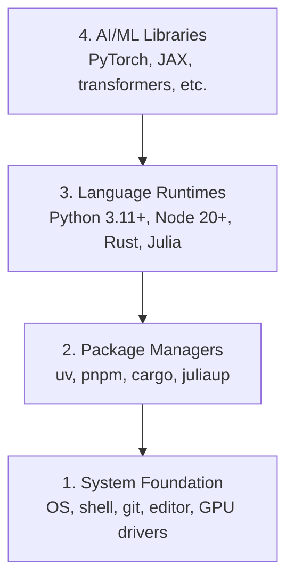

# 開發環境

> 你的工具塑造你的思考方式。一次設定好，而且要設定對。

**類型：** 實作
**程式語言：** Python、Node.js、Rust
**先修單元：** 無
**時間：** 約 45 分鐘

## 學習目標

- 從零開始安裝 Python 3.11+、Node.js 20+ 與 Rust 工具鏈
- 設定虛擬環境與套件管理器，讓建置結果可重現
- 用 CUDA／MPS 驗證 GPU 是否可用，並執行一次測試用的張量運算
- 理解四層堆疊：系統、套件、語言執行環境、AI 函式庫

## 問題所在

你即將用 Python、TypeScript、Rust 和 Julia，走完 200 多個單元的 AI 工程學習。如果環境是壞的，每一個單元都會變成跟工具鏈搏鬥，而不是學習。

大多數人會跳過環境設定，然後花上好幾個小時 debug 匯入錯誤、版本衝突和缺失的 CUDA 驅動程式。我們要一次把這件事做好、做對。

## 核心概念

一個 AI 工程環境有四層：



我們自底向上安裝。每一層都依賴它下面那一層。

```figure
s0-env-stack
```

## 動手實作

### 步驟 1：系統基礎

檢查你的系統，把基本工具裝好。

```bash
# macOS
xcode-select --install
brew install git curl wget

# Ubuntu/Debian
sudo apt update && sudo apt install -y build-essential git curl wget

# Windows (use WSL2)
wsl --install -d Ubuntu-24.04
```

### 步驟 2：用 uv 安裝 Python

我們用 `uv` —— 它比 pip 快 10 到 100 倍，而且會自動處理虛擬環境。

```bash
curl -LsSf https://astral.sh/uv/install.sh | sh

uv python install 3.12

uv venv
source .venv/bin/activate  # or .venv\Scripts\activate on Windows

uv pip install numpy matplotlib jupyter
```

驗證：

```python
import sys
print(f"Python {sys.version}")

import numpy as np
print(f"NumPy {np.__version__}")
a = np.array([1, 2, 3])
print(f"Vector: {a}, dot product with itself: {np.dot(a, a)}")
```

### 步驟 3：用 pnpm 安裝 Node.js

給 TypeScript 的單元用（代理程式、MCP 伺服器、網頁應用）。

```bash
curl -fsSL https://fnm.vercel.app/install | bash
fnm install 22
fnm use 22

npm install -g pnpm

node -e "console.log('Node', process.version)"
```

**macOS ／ Apple Silicon（M1/M2/M3/M4）：** 如果安裝程式停在 `Error: Cannot install under Rosetta 2 in ARM default prefix (/opt/homebrew)`，表示你的終端機正在 Rosetta 2 底下執行（`arch` 會印出 `i386`），而 Homebrew 是原生的 arm64 版本。強制以 arm64 安裝 fnm，把它接進你的 shell，然後從上面的 `fnm install 22` 開始重跑那幾行命令：

```bash
arch -arm64 brew install fnm
echo 'eval "$(fnm env --use-on-cd)"' >> ~/.zshrc
source ~/.zshrc
```

### 步驟 4：Rust

給效能關鍵的單元用（推論、系統）。

```bash
curl --proto '=https' --tlsv1.2 -sSf https://sh.rustup.rs | sh

rustc --version
cargo --version
```

### 步驟 5：Julia（選用）

給 Julia 特別擅長的數學密集單元用。

```bash
curl -fsSL https://install.julialang.org | sh

julia -e 'println("Julia ", VERSION)'
```

### 步驟 6：GPU 設定（如果你有 GPU）

**NVIDIA（Linux ／ Windows）：**

```bash
nvidia-smi

# Install PyTorch with CUDA
uv pip install torch torchvision torchaudio --index-url https://download.pytorch.org/whl/cu124
```

**macOS ／ Apple Silicon（M1/M2/M3/M4）：** Mac 上沒有 CUDA —— 這是正常的，不是失敗。**不要**加上 `--index-url .../cuXXX`（那些 wheel 只有 Linux／Windows 版，加了就會安裝失敗）。裝普通版本就好，它已經內含 Apple 的 MPS（Metal）GPU 後端：

```bash
uv pip install torch torchvision torchaudio
```

驗證（在任何平台都適用）：

```python
import torch
print(f"CUDA available: {torch.cuda.is_available()}")           # False on macOS — expected
print(f"MPS available:  {torch.backends.mps.is_available()}")   # True on Apple Silicon
if torch.cuda.is_available():
    print(f"GPU: {torch.cuda.get_device_name(0)}")
```

沒有 GPU？沒關係。大多數單元在 CPU 上就跑得動。訓練量大的單元可以用 Google Colab 或雲端 GPU。

### 步驟 7：驗證你想開始的那條路線

這一課的每一道指令，都請從版本庫根目錄執行，也就是放著 `README.md` 與
`phases/` 的那個目錄。預檢只檢查你所選路線起步時真正需要的東西。它預設會
跳過後面才用到的工具，讓新學習者看到的是一個清楚的答案，而不是一整面警告牆。

啟動完整的初學者序列：

```bash
python3 phases/00-setup-and-tooling/01-dev-environment/code/verify.py --route beginner
```

或只檢查你想走的那條路線：

```bash
python3 phases/00-setup-and-tooling/01-dev-environment/code/verify.py --route ml-foundations
python3 phases/00-setup-and-tooling/01-dev-environment/code/verify.py --route llm-engineering
python3 phases/00-setup-and-tooling/01-dev-environment/code/verify.py --route agents
python3 phases/00-setup-and-tooling/01-dev-environment/code/verify.py --route mcp
python3 phases/00-setup-and-tooling/01-dev-environment/code/verify.py --route agent-skills
python3 phases/00-setup-and-tooling/01-dev-environment/code/verify.py --route certification
```

想讓同一份預檢連後面單元會用到的選用工具與相依套件一起檢查，就加上
`--show-later`。缺少後面才要用的工具，永遠不會擋住你目前選定的路線。

每一項失敗的必要檢查，都會附上偵測到的路徑或匯入錯誤，以及一道精確的修正
指令。Agent Skills 與認證這兩條路線還會列出需要人工確認的宿主檢查，因為
Python 腳本無法證明某個 AI 宿主真的發現了某個技能，也無法證明你選的技能
範圍是可寫入的。

初學者預檢通過時，它會印出確切的第一個可執行單元：

```text
Ready to start Beginner course.
Next: python3 phases/01-math-foundations/01-linear-algebra-intuition/code/vectors.py
```

## 框架應用

你的環境已經可以開始你剛才檢查過的那條路線了。後面的工具等到某一課要求時
再安裝，不要讓第一課卡在整套技術堆疊上。以下是各種語言分別用在哪裡：

| 語言 | 使用於 | 套件管理器 |
|----------|---------|-----------------|
| Python | 階段 1-12（ML、DL、NLP、視覺、語音、LLM） | uv |
| TypeScript | 階段 13-17（工具、代理程式、群體、基礎設施） | pnpm |
| Rust | 階段 12、15-17（效能關鍵的系統） | cargo |
| Julia | 階段 1（數學基礎） | Pkg |

## 產出交付

本單元會產出一份驗證腳本，任何人都可以執行它來檢查自己的環境設定。

請看 `outputs/prompt-env-check.md`，裡面有一段提示詞，可以幫 AI 助理診斷環境問題。

## 練習

1. 執行驗證腳本，把所有失敗的項目修掉
2. 為本課程建立一個 Python 虛擬環境，並安裝 PyTorch
3. 用四種語言各寫一支「hello world」，並逐一執行
