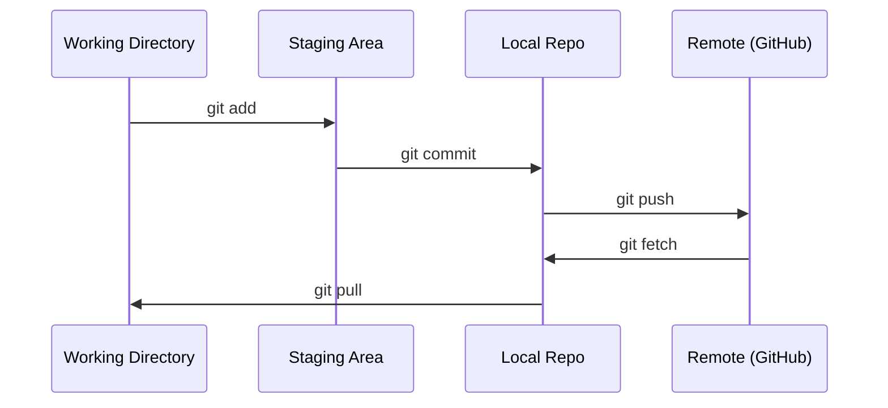

# Git 與協作

> 版本控制不是選配。你在這裡做的每一次實驗、每一個模型、每一個單元，都要被追蹤起來。

**類型：** 學習
**程式語言：** --
**先修單元：** 階段 0 · 01
**時間：** 約 30 分鐘

## 學習目標

- 設定 git 身分，並熟練 add、commit、push 的日常流程
- 建立與合併分支，讓實驗彼此隔離而不弄壞 main
- 寫一份 `.gitignore`，排除模型檢查點與大型二進位檔
- 用 `git log` 瀏覽提交歷史，理解專案的演進過程

## 問題所在

接下來 20 個階段裡，你會寫上數百個程式碼檔案。沒有版本控制，你會弄丟成果、把東西改壞又救不回來，也沒有辦法跟別人協作。

Git 是工具，GitHub 是程式碼存放的地方。這個單元只講這門課用得到的部分，多的一律不談。

## 核心概念



記住三件事：
1. 常常存檔（`git commit`）
2. 推上遠端（`git push`）
3. 實驗開分支（`git checkout -b experiment`）

```figure
s0-commit-dag
```

## 動手實作

### 步驟 1：設定 git

```bash
git config --global user.name "Your Name"
git config --global user.email "you@example.com"
```

### 步驟 2：日常流程

```bash
git status
git add file.py
git commit -m "Add perceptron implementation"
git push origin main
```

### 步驟 3：為實驗開分支

```bash
git checkout -b experiment/new-optimizer

# ... make changes, commit ...

git checkout main
git merge experiment/new-optimizer
```

### 步驟 4：使用這門課的儲存庫

你沒辦法直接推到課程儲存庫本身 —— 只有維護者才有寫入權限。請先在 GitHub 上 fork 一份（右上角的 Fork 按鈕），這樣 `origin` 才會指向你自己的副本：

```bash
git clone https://github.com/YOUR-USERNAME/ai-engineering-from-scratch.git
cd ai-engineering-from-scratch

git checkout -b my-progress
# work through lessons, commit your code
git push origin my-progress
```

## 框架應用

這門課用到的指令，就只有這些：

| 指令 | 什麼時候用 |
|---------|------|
| `git clone` | 取得課程儲存庫 |
| `git add` + `git commit` | 存下你的成果 |
| `git push` | 備份到 GitHub |
| `git checkout -b` | 想試點東西又不想弄壞 main |
| `git log --oneline` | 看看自己做了什麼 |

就這樣。這門課不需要 rebase、cherry-pick 或 submodule。

## 練習

1. Fork 這個儲存庫，clone 你的 fork，開一個叫 `my-progress` 的分支，建一個檔案、提交、推上去
2. 寫一份 `.gitignore`，排除模型檢查點檔案（`.pt`、`.pth`、`.safetensors`）
3. 用 `git log --oneline` 看這個儲存庫的提交歷史，讀讀各個單元是怎麼被加進來的

## 關鍵術語

| 術語 | 大家怎麼說 | 實際上是什麼 |
|------|----------------|----------------------|
| 提交（commit） | 「存檔」 | 整個專案在某個時間點的快照 |
| 分支（branch） | 「一份副本」 | 指向某個提交的指標，會隨著你工作而往前移動 |
| 合併（merge） | 「把程式碼併起來」 | 把一個分支上的改動拿過來，套用到另一個分支 |
| 遠端（remote） | 「雲端」 | 你的儲存庫託管在別處的一份副本（GitHub、GitLab） |
