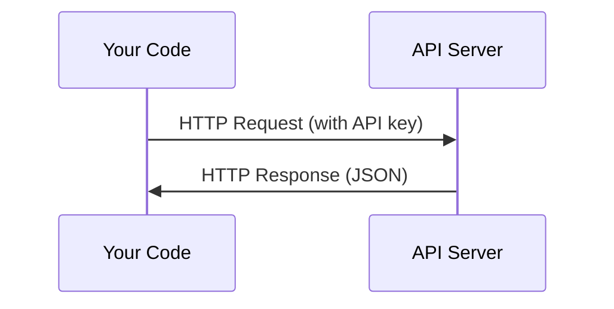

# API 與金鑰

> 每一個 AI API 的運作方式都一樣：送出請求，取回回應。細節會變，模式不會。

**類型：** 實作
**程式語言：** Python、TypeScript
**先修單元：** 階段 0 · 01
**時間：** 約 30 分鐘

## 學習目標

- 用環境變數與 `.env` 檔案安全地保管 API 金鑰
- 分別用 Anthropic 的 Python SDK 和原始 HTTP 呼叫 LLM API
- 比較 SDK 與原始 HTTP 的請求／回應格式，方便除錯
- 認出並處理常見的 API 錯誤，包含認證失敗與流量限制

## 問題所在

從階段 11 開始，你會呼叫各家的 LLM API（Anthropic、OpenAI、Google）。到了階段 13-16，你會做出在迴圈裡使用這些 API 的代理程式。所以你得先知道 API 金鑰是怎麼運作的、要怎麼安全保管，以及怎麼發出你的第一個 API 呼叫。

## 核心概念



每一次 API 呼叫都有：
1. 一個端點（URL）
2. 一組 API 金鑰（認證）
3. 一份請求主體（你想要什麼）
4. 一份回應主體（你拿回什麼）

```figure
s0-secret-inject
```

## 動手實作

### 步驟 1：安全地保管 API 金鑰

千萬不要把 API 金鑰寫進程式碼裡。請用環境變數。

```bash
export ANTHROPIC_API_KEY="sk-ant-..."
export OPENAI_API_KEY="sk-..."
```

或是用一個 `.env` 檔案（記得把它加進 `.gitignore`）：

```
ANTHROPIC_API_KEY=sk-ant-...
OPENAI_API_KEY=sk-...
```

### 步驟 2：第一個 API 呼叫（Python）

```python
import os

import anthropic

client = anthropic.Anthropic()

MODEL = os.environ.get("LLM_MODEL", "claude-sonnet-5")

response = client.messages.create(
    model=MODEL,
    max_tokens=256,
    messages=[{"role": "user", "content": "What is a neural network in one sentence?"}]
)

print(response.content[0].text)
```

`LLM_MODEL` 用來選定 Anthropic 的模型 id，預設值是不帶日期的 Sonnet 別名。其他供應商（OpenAI、Google 等等）同樣是「一組金鑰加上一個模型 id」的模式，但各家都有自己的 SDK、端點，以及請求／回應的結構。

### 步驟 3：第一個 API 呼叫（TypeScript）

```typescript
import Anthropic from "@anthropic-ai/sdk";

const client = new Anthropic();

const MODEL = process.env.LLM_MODEL ?? "claude-sonnet-5";

const response = await client.messages.create({
  model: MODEL,
  max_tokens: 256,
  messages: [{ role: "user", content: "What is a neural network in one sentence?" }],
});

console.log(response.content[0].text);
```

### 步驟 4：原始 HTTP（不用 SDK）

```python
import os
import urllib.request
import json

url = "https://api.anthropic.com/v1/messages"
headers = {
    "Content-Type": "application/json",
    "x-api-key": os.environ["ANTHROPIC_API_KEY"],
    "anthropic-version": "2023-06-01",
}
body = json.dumps({
    "model": os.environ.get("LLM_MODEL", "claude-sonnet-5"),
    "max_tokens": 256,
    "messages": [{"role": "user", "content": "What is a neural network in one sentence?"}],
}).encode()

req = urllib.request.Request(url, data=body, headers=headers, method="POST")
with urllib.request.urlopen(req) as resp:
    result = json.loads(resp.read())
    print(result["content"][0]["text"])
```

這就是 SDK 在底層做的事。看懂原始的 HTTP 呼叫，除錯時會很有幫助。

## 框架應用

這門課會用到的：

| API | 什麼時候需要 | 免費額度 |
|-----|-----------------|-----------|
| Anthropic（Claude） | 階段 11-16（代理程式、工具） | 註冊贈送 $5 額度 |
| OpenAI | 階段 11（做比較） | 註冊贈送 $5 額度 |
| Hugging Face | 階段 4-10（模型、資料集） | 免費 |

你現在不需要全部都申請。等單元用到的時候再去設定就好。

## 產出交付

本單元會產出：
- `outputs/prompt-api-troubleshooter.md` - 診斷常見的 API 錯誤

## 練習

1. 申請一組 Anthropic API 金鑰，並發出你的第一個 API 呼叫
2. 試試原始 HTTP 的版本，把回應格式和 SDK 版本的比一比
3. 故意用一組錯的 API 金鑰，把錯誤訊息讀過一遍

## 關鍵術語

| 術語 | 大家怎麼說 | 實際上是什麼 |
|------|----------------|----------------------|
| API 金鑰 | 「API 的密碼」 | 一串獨一無二的字串，用來辨識你的帳號並授權請求 |
| 流量限制（rate limit） | 「它在限制我」 | 每分鐘／每小時的請求上限，用來防止濫用並確保資源公平使用 |
| 詞元（token） | 「一個字」（在 API 的脈絡下） | 一種計費單位：輸入詞元與輸出詞元分開計算、分開收費 |
| 串流（streaming） | 「即時回應」 | 一個字一個字地拿到回應，而不是等整段回應生成完 |
