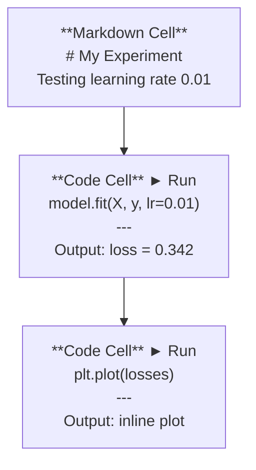
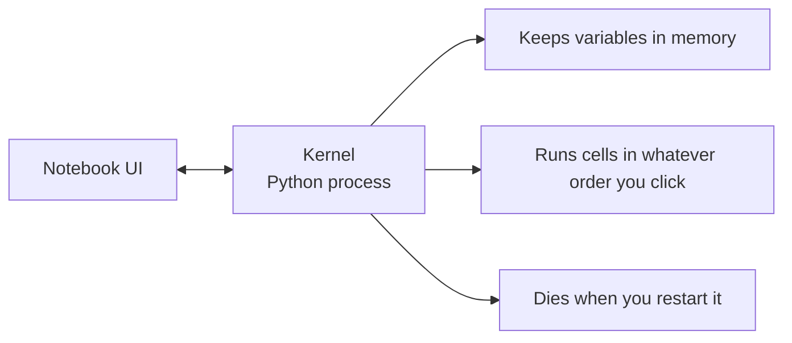

# Jupyter Notebooks

> Notebook 是 AI 工程的實驗檯。你在這裡做原型，再把成功的部分搬進生產環境。

**類型：** 實作
**程式語言：** Python
**先修單元：** 階段 0 · 01
**時間：** 約 30 分鐘

## 學習目標

- 安裝並啟動 JupyterLab、Jupyter Notebook，或裝了 Jupyter 擴充套件的 VS Code
- 用魔術指令（`%timeit`、`%%time`、`%matplotlib inline`）做效能測試與內嵌繪圖
- 分辨什麼時候該用 notebook、什麼時候該用腳本，並實踐「探索用 notebook，交付用腳本」的流程
- 認出並避開常見的 notebook 陷阱：亂序執行、隱藏狀態、記憶體洩漏

## 問題所在

每一篇 AI 論文、每一份教學、每一場 Kaggle 競賽都在用 Jupyter notebook。它讓你把程式碼拆成一小段一小段來跑、輸出直接顯示在旁邊、程式碼與說明混在一起寫，迭代得很快。想學 AI 卻不用 notebook，就像寫數學作業不准打草稿。

但 notebook 也有實實在在的陷阱。大家什麼事都拿它來做，包括它根本不擅長的事。知道什麼時候該用 notebook、什麼時候該寫腳本，可以讓你之後少掉一堆除錯的惡夢。

## 核心概念

Notebook 就是一串儲存格（cell）。每個儲存格要嘛是程式碼，要嘛是文字。



Kernel 是一個在背景執行的 Python 行程。你執行一個儲存格時，它把程式碼送給 kernel，kernel 執行完再把結果送回來。所有儲存格共用同一個 kernel，所以變數會在儲存格之間留存下來。



「你點哪個就跑哪個」這件事，既是超能力，也是會打到自己腳的槍。

```figure
s0-cell-order
```

## 動手實作

### 步驟 1：挑一個介面

三個選擇，同一種格式：

| 介面 | 安裝 | 最適合 |
|-----------|---------|----------|
| JupyterLab | `pip install jupyterlab` 之後 `jupyter lab` | 完整的 IDE 體驗，多重分頁、檔案瀏覽器、終端機 |
| Jupyter Notebook | `pip install notebook` 之後 `jupyter notebook` | 簡單、輕量，一次開一個 notebook |
| VS Code | 安裝 "Jupyter" 擴充套件 | 就在你原本的編輯器裡，有 git 整合與除錯功能 |

三者讀寫的都是同一種 `.ipynb` 檔。喜歡哪個用哪個。AI 工作裡最常見的是 JupyterLab。

```bash
pip install jupyterlab
jupyter lab
```

### 步驟 2：真正要記的鍵盤快捷鍵

你會在兩種模式之間切換。按 `Escape` 進命令模式（左側藍色條），按 `Enter` 進編輯模式（綠色條）。

**命令模式（最常用）：**

| 按鍵 | 動作 |
|-----|--------|
| `Shift+Enter` | 執行儲存格並移到下一格 |
| `A` | 在上方插入儲存格 |
| `B` | 在下方插入儲存格 |
| `DD` | 刪除儲存格 |
| `M` | 轉成 markdown |
| `Y` | 轉成程式碼 |
| `Z` | 復原儲存格操作 |
| `Ctrl+Shift+H` | 顯示所有快捷鍵 |

**編輯模式：**

| 按鍵 | 動作 |
|-----|--------|
| `Tab` | 自動完成 |
| `Shift+Tab` | 顯示函式簽名 |
| `Ctrl+/` | 切換註解 |

`Shift+Enter` 是你每天要按上千次的那一個。先把它記住。

### 步驟 3：儲存格的種類

**程式碼儲存格**執行 Python 並顯示輸出：

```python
import numpy as np
data = np.random.randn(1000)
data.mean(), data.std()
```

輸出：`(0.0032, 0.9987)`

**Markdown 儲存格**會把文字排版渲染出來。用它記錄你在做什麼、為什麼這樣做。它支援標題、粗體、斜體、LaTeX 數學式（`$E = mc^2$`）、表格與圖片。

### 步驟 4：魔術指令

這些不是 Python。它們是 Jupyter 專屬的指令，開頭是 `%`（行魔術）或 `%%`（儲存格魔術）。

**替程式碼計時：**

```python
%timeit np.random.randn(10000)
```

輸出：`45.2 us +/- 1.3 us per loop`

```python
%%time
model.fit(X_train, y_train, epochs=10)
```

輸出：`Wall time: 2.34 s`

`%timeit` 會把程式碼跑很多次再取平均。`%%time` 只跑一次。微基準測試用 `%timeit`，訓練用 `%%time`。

**啟用內嵌繪圖：**

```python
%matplotlib inline
```

之後每個 `plt.plot()` 或 `plt.show()` 都會直接畫在 notebook 裡。

**不離開 notebook 就安裝套件：**

```python
!pip install scikit-learn
```

`!` 前綴可以執行任何 shell 指令。

**查看環境變數：**

```python
%env CUDA_VISIBLE_DEVICES
```

### 步驟 5：把豐富的輸出內嵌顯示

Notebook 會自動顯示儲存格裡最後一個運算式的值。不過你也可以自己控制：

```python
import pandas as pd

df = pd.DataFrame({
    "model": ["Linear", "Random Forest", "Neural Net"],
    "accuracy": [0.72, 0.89, 0.94],
    "training_time": [0.1, 2.3, 45.6]
})
df
```

這會渲染成一張排好版的 HTML 表格，不是一坨純文字。繪圖也一樣：

```python
import matplotlib.pyplot as plt

plt.figure(figsize=(8, 4))
plt.plot([1, 2, 3, 4], [1, 4, 2, 3])
plt.title("Inline Plot")
plt.show()
```

圖會出現在儲存格正下方。這就是 notebook 之所以主宰 AI 工作的原因：資料、圖、程式碼你一次全看得到。

顯示圖片：

```python
from IPython.display import Image, display
display(Image(filename="architecture.png"))
```

### 步驟 6：Google Colab

Colab 是雲端上免費的 Jupyter notebook。它給你一張 GPU、預先裝好的函式庫，還有 Google Drive 整合。完全不用設定。

1. 前往 [colab.research.google.com](https://colab.research.google.com)
2. 上傳本課程任何一個 `.ipynb` 檔
3. Runtime > Change runtime type > T4 GPU（免費）

Colab 與本機 Jupyter 的差異：
- 檔案不會在工作階段之間留存（請存到 Drive 或下載回來）
- 已預先裝好：numpy、pandas、matplotlib、torch、tensorflow、sklearn
- 用 `from google.colab import files` 上傳／下載檔案
- 用 `from google.colab import drive; drive.mount('/content/drive')` 取得持久儲存空間
- 閒置 90 分鐘後工作階段會逾時中斷（免費方案）

## 框架應用

### Notebook 對腳本：什麼時候用哪個

| 適合用 notebook | 適合用腳本 |
|-------------------|-----------------|
| 探索一份資料集 | 訓練管線 |
| 做模型原型 | 可重複使用的工具函式 |
| 把結果視覺化 | 任何要用到 `if __name__` 的東西 |
| 解釋你的工作 | 定時執行的程式碼 |
| 快速實驗 | 生產環境的程式碼 |
| 課程練習 | 套件與函式庫 |

原則就一句：**探索用 notebook，交付用腳本**。

AI 工作裡常見的流程：
1. 在 notebook 裡探索資料
2. 在 notebook 裡做模型原型
3. 一旦跑得通，就把程式碼搬到 `.py` 檔
4. 再把那些 `.py` 檔 import 回 notebook，繼續做實驗

### 常見陷阱

**亂序執行。** 你先跑第 5 格、再跑第 2 格、然後第 7 格。在你的機器上一切正常，但別人從頭跑到尾就壞了。解法：分享之前先做一次 Kernel > Restart & Run All。

**隱藏狀態。** 你刪掉了某個儲存格，但它建立的變數還留在記憶體裡。Notebook 看起來很乾淨，實際上依賴一個幽靈儲存格。解法：定期重啟 kernel。

**記憶體洩漏。** 載入一份 4GB 的資料集、訓練一個模型、再載入另一份資料集。什麼都沒被釋放。解法：`del variable_name` 加上 `gc.collect()`，或者直接重啟 kernel。

## 產出交付

本單元會產出：
- `outputs/prompt-notebook-helper.md`，用來排查 notebook 的問題

## 練習

1. 打開 JupyterLab，建立一個 notebook，用 `%timeit` 比較串列生成式與 numpy 在建立 100,000 個隨機數陣列時的差別
2. 建立一個同時含 markdown 與程式碼儲存格的 notebook，讓它載入一個 CSV、顯示 dataframe，並畫出一張圖。接著執行 Kernel > Restart & Run All，確認它從頭跑到尾都沒問題
3. 把 `code/notebook_tips.py` 的程式碼貼進 Colab notebook，用免費 GPU 跑一次

## 關鍵術語

| 術語 | 大家怎麼說 | 實際上是什麼 |
|------|----------------|----------------------|
| Kernel | 「跑我程式碼的那個東西」 | 一個獨立的 Python 行程，負責執行儲存格並把變數留在記憶體裡 |
| 儲存格（cell） | 「一個程式碼區塊」 | Notebook 裡可獨立執行的單位，可以是程式碼或 markdown |
| 魔術指令 | 「Jupyter 的小把戲」 | 以 `%` 或 `%%` 開頭的特殊指令，用來控制 notebook 環境 |
| `.ipynb` | 「Notebook 檔」 | 一個 JSON 檔，內含儲存格、輸出與中介資料。名稱來自 IPython Notebook |

## 延伸閱讀

- [JupyterLab Docs](https://jupyterlab.readthedocs.io/) 完整的功能列表
- [Google Colab FAQ](https://research.google.com/colaboratory/faq.html) Colab 特有的限制與功能
- [28 Jupyter Notebook Tips](https://www.dataquest.io/blog/jupyter-notebook-tips-tricks-shortcuts/) 進階使用者的快捷鍵技巧
