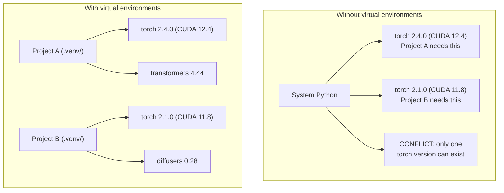

# Python 環境

> 相依性地獄是真的存在的。虛擬環境就是解藥。

**類型：** 實作
**程式語言：** Shell
**先修單元：** 階段 0 · 01
**時間：** 約 30 分鐘

## 學習目標

- 用 `uv`、`venv` 或 `conda` 建立彼此隔離的虛擬環境
- 寫一份帶有選用相依性群組的 `pyproject.toml`，並產生鎖定檔以確保可重現
- 診斷並修正常見的坑：裝到全域、pip 與 conda 混用、CUDA 版本不符
- 為相依性互相衝突的專案，實作一套「每階段一個環境」的策略

## 問題所在

你為了一個微調專案裝了 PyTorch 2.4。下週，另一個專案需要 PyTorch 2.1，因為它綁死了特定的 CUDA build。你把全域的版本升上去，第一個專案就壞了。你降回來，第二個又壞了。

這就是相依性地獄。它在 AI／ML 的工作裡不斷發生，因為：

- PyTorch、JAX、TensorFlow 各自帶自己的 CUDA 綁定
- 模型函式庫會綁死特定的框架版本
- 一次全域的 `pip install` 會直接蓋掉原本裝好的東西
- CUDA 11.8 的 build 不能配 CUDA 12.x 的驅動程式（反之亦然）

解法：每個專案都有自己隔離的環境，裝自己的套件。

## 核心概念



```figure
s0-env-isolation
```

## 動手實作

### 選項 1：uv venv（推薦）

`uv` 是目前最快的 Python 套件管理工具（比 pip 快 10 到 100 倍）。虛擬環境、Python 版本、相依性解析，一套工具全包。

```bash
curl -LsSf https://astral.sh/uv/install.sh | sh

uv python install 3.12

cd your-project
uv venv
source .venv/bin/activate
```

安裝套件：

```bash
uv pip install torch numpy
```

一步建立帶 `pyproject.toml` 的專案：

```bash
uv init my-ai-project
cd my-ai-project
uv add torch numpy matplotlib
```

### 選項 2：venv（內建）

如果你沒辦法安裝 `uv`，Python 本身就內建 `venv`：

```bash
python3 -m venv .venv
source .venv/bin/activate  # Linux/macOS
.venv\Scripts\activate     # Windows

pip install torch numpy
```

比 `uv` 慢，但只要有 Python 的地方都能用。

### 選項 3：conda（需要時再用）

Conda 管得了非 Python 的相依性，像 CUDA toolkit、cuDNN 和 C 函式庫。什麼時候用它：

- 你需要某個特定版本的 CUDA toolkit，又不想裝到整台機器上
- 你在共用叢集上，沒有權限安裝系統套件
- 某個函式庫的安裝說明直接寫「用 conda」

```bash
# Install miniconda (not the full Anaconda)
curl -LsSf https://repo.anaconda.com/miniconda/Miniconda3-latest-Linux-x86_64.sh -o miniconda.sh
bash miniconda.sh -b

conda create -n myproject python=3.12
conda activate myproject

conda install pytorch torchvision torchaudio pytorch-cuda=12.4 -c pytorch -c nvidia
```

一條規則：某個環境既然用了 conda，那個環境裡的所有套件就都用 conda 裝。在 conda 環境裡混進 `pip install`，會造成極難除錯的相依性衝突。

### 本課程的做法：每階段一個環境

你當然可以整個課程只開一個環境。別這樣。不同階段需要不同的（有時互相衝突的）相依性。

策略：

```
ai-engineering-from-scratch/
├── .venv/                    <-- shared lightweight env for phases 0-3
├── phases/
│   ├── 04-neural-networks/
│   │   └── .venv/            <-- PyTorch env
│   ├── 05-cnns/
│   │   └── .venv/            <-- same PyTorch env (symlink or shared)
│   ├── 08-transformers/
│   │   └── .venv/            <-- might need different transformer versions
│   └── 11-llm-apis/
│       └── .venv/            <-- API SDKs, no torch needed
```

`code/env_setup.sh` 這支腳本會建立本課程的基礎環境。

## pyproject.toml 基礎

每個 Python 專案都該有一份 `pyproject.toml`。它一個檔案就取代了 `setup.py`、`setup.cfg` 和 `requirements.txt`。

```toml
[project]
name = "ai-engineering-from-scratch"
version = "0.1.0"
requires-python = ">=3.11"
dependencies = [
    "numpy>=1.26",
    "matplotlib>=3.8",
    "jupyter>=1.0",
    "scikit-learn>=1.4",
]

[project.optional-dependencies]
torch = ["torch>=2.3", "torchvision>=0.18"]
llm = ["anthropic>=0.39", "openai>=1.50"]
```

接著安裝：

```bash
uv pip install -e ".[torch]"    # base + PyTorch
uv pip install -e ".[llm]"     # base + LLM SDKs
uv pip install -e ".[torch,llm]" # everything
```

## 鎖定檔

鎖定檔（lockfile）會把每一項相依性——包括間接相依的那些——都釘死在確切的版本上。這保證了可重現性：任何人照著鎖定檔安裝，拿到的套件都一模一樣。

```bash
# uv generates uv.lock automatically when using uv add
uv add numpy

# pip-tools approach
uv pip compile pyproject.toml -o requirements.lock
uv pip install -r requirements.lock
```

把鎖定檔提交進 git。別人 clone 這個儲存庫時，就會從鎖定檔安裝，拿到完全相同的版本。

## 常見錯誤

### 1. 裝到全域

```bash
pip install torch  # BAD: installs to system Python

source .venv/bin/activate
pip install torch  # GOOD: installs to virtual environment
```

確認你的套件裝到哪裡去了：

```bash
which python       # should show .venv/bin/python, not /usr/bin/python
which pip           # should show .venv/bin/pip
```

### 2. 混用 pip 與 conda

```bash
conda create -n myenv python=3.12
conda activate myenv
conda install pytorch -c pytorch
pip install some-other-package   # BAD: can break conda's dependency tracking
conda install some-other-package # GOOD: let conda manage everything
```

如果非得在 conda 裡用 pip（有些套件只有 pip 版），先把所有 conda 套件裝完，最後才裝 pip 套件。

### 3. 忘記啟用環境

```bash
python train.py           # uses system Python, missing packages
source .venv/bin/activate
python train.py           # uses project Python, packages found
```

你的 shell 提示字元應該會顯示環境名稱：

```
(.venv) $ python train.py
```

### 4. 把 .venv 提交進 git

```bash
echo ".venv/" >> .gitignore
```

虛擬環境動輒 200MB 到 2GB。它們是本機專屬的，換一台機器就不能用。該提交的是 `pyproject.toml` 和鎖定檔。

### 5. CUDA 版本不符

```bash
nvidia-smi                # shows driver CUDA version (e.g., 12.4)
python -c "import torch; print(torch.version.cuda)"  # shows PyTorch CUDA version

# These must be compatible.
# PyTorch CUDA version must be <= driver CUDA version.
```

## 框架應用

執行設定腳本，建立你的課程環境：

```bash
bash phases/00-setup-and-tooling/06-python-environments/code/env_setup.sh
```

這會在儲存庫根目錄建立一個 `.venv`，裝好核心相依性並驗證通過。

## 練習

1. 執行 `env_setup.sh`，確認所有檢查都通過
2. 建立第二個虛擬環境，在裡面裝一個不同版本的 numpy，確認兩個環境彼此隔離
3. 為一個同時需要 PyTorch 與 Anthropic SDK 的專案寫一份 `pyproject.toml`
4. 故意不啟用虛擬環境、把套件裝到全域，觀察它跑到哪裡去，然後把它移除

## 關鍵術語

| 術語 | 大家怎麼說 | 實際上是什麼 |
|------|----------------|----------------------|
| 虛擬環境 | 「一個 venv」 | 一個隔離的目錄，裡面裝著一份 Python 直譯器與套件，與系統 Python 分開 |
| 鎖定檔 | 「釘死的相依性」 | 一份列出每個套件及其確切版本的檔案，保證跨機器安裝結果一致 |
| pyproject.toml | 「新版的 setup.py」 | Python 專案設定檔的標準格式，取代 setup.py／setup.cfg／requirements.txt |
| 間接相依性 | 「相依性的相依性」 | 套件 B 依賴 C；你裝了依賴 B 的 A，那 C 就是 A 的間接相依性 |
| CUDA 版本不符 | 「我的 GPU 不能用」 | PyTorch 編譯時針對的 CUDA 版本，跟你的 GPU 驅動程式支援的版本不一樣 |
