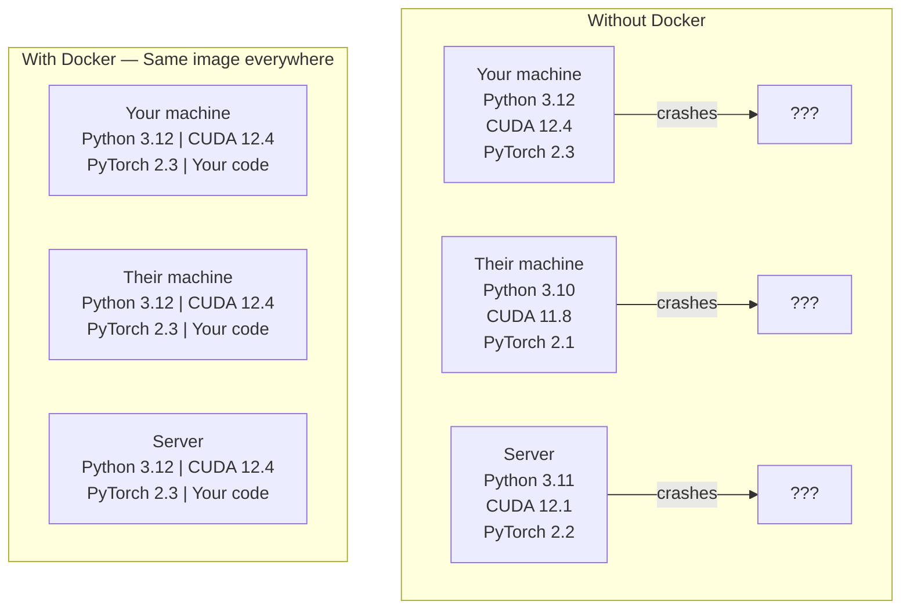

# Docker 與 AI 開發

> 有了容器，「在我機器上明明就能跑」這句話從此成為過去。

**類型：** 實作
**程式語言：** Docker
**先修單元：** 階段 0 · 01、03
**時間：** 約 60 分鐘

## 學習目標

- 從 Dockerfile 建置一個含 CUDA、PyTorch 與 AI 函式庫的 GPU 映像檔
- 把主機目錄掛載成 volume，讓模型、資料集與程式碼在容器重建後仍然保留
- 設定 NVIDIA Container Toolkit，把 GPU 開放給容器使用
- 用 Docker Compose 編排多服務的 AI 應用（推論伺服器加向量資料庫）

## 問題所在

你在自己的筆電上用 PyTorch 2.3、CUDA 12.4、Python 3.12 訓練了一個模型。你同事的環境是 PyTorch 2.1、CUDA 11.8、Python 3.10。你的模型在他機器上直接掛掉。但你的 Dockerfile 在兩台機器上都能跑。

AI 專案是相依性的惡夢。一套典型的堆疊包含 Python、PyTorch、CUDA 驅動程式、cuDNN、系統層的 C 函式庫，以及像 flash-attn 這種對編譯器版本挑到不行的套件。Docker 把這一切打包成單一映像檔，到哪裡跑都一樣。

## 核心概念

Docker 把你的程式碼、執行環境、函式庫與系統工具包成一個隔離的單位，叫做容器。你可以把它想成輕量的虛擬機，差別在於它共用主機的作業系統核心，而不是自己跑一套，所以啟動只要幾秒鐘，不用幾分鐘。



### 為什麼 AI 專案比一般專案更需要 Docker

1. **GPU 驅動程式很脆弱。** 用 CUDA 12.4 寫的程式碼不會在 CUDA 11.8 上跑。Docker 把 CUDA toolkit 隔離在容器內，同時透過 NVIDIA Container Toolkit 共用主機的 GPU 驅動程式。

2. **模型權重很大。** 一個 7B 參數的模型在 fp16 下是 14 GB。你不會想每次重建都重新下載一次。Docker 的 volume 讓你把主機上的模型目錄掛進去。

3. **多服務架構很常見。** 真實的 AI 應用不只是一支 Python 腳本，而是一台推論伺服器、一個給 RAG 用的向量資料庫，也許還有一個網頁前端。Docker Compose 用一道指令就把這些全部編排起來。

### 關鍵詞彙

| 術語 | 意思 |
|------|---------------|
| Image | 唯讀的模板。你的食譜。從 Dockerfile 建置而來。 |
| Container | 映像檔的一個執行實例。你的廚房。 |
| Dockerfile | 建置映像檔的指令。一層一層疊上去。 |
| Volume | 持久化的儲存空間，容器重啟後依然存在。 |
| docker-compose | 用 YAML 定義多容器應用的工具。 |

### AI 領域常見的容器模式

```
Dev Container
  Full toolkit. Editor support. Jupyter. Debugging tools.
  Used during development and experimentation.

Training Container
  Minimal. Just the training script and dependencies.
  Runs on GPU clusters. No editor, no Jupyter.

Inference Container
  Optimized for serving. Small image. Fast cold start.
  Runs behind a load balancer in production.
```

```figure
s0-image-layers
```

## 動手實作

### 步驟 1：安裝 Docker

```bash
# macOS
brew install --cask docker
open /Applications/Docker.app

# Ubuntu
curl -fsSL https://get.docker.com | sh
sudo usermod -aG docker $USER
# Log out and back in for group change to take effect
```

驗證：

```bash
docker --version
docker run hello-world
```

### 步驟 2：安裝 NVIDIA Container Toolkit（Linux 搭配 NVIDIA GPU）

這一步讓 Docker 容器能用到你的 GPU。macOS 與 Windows（WSL2）使用者可以略過；Docker Desktop 在那些平台上以不同方式處理 GPU 直通。

```bash
distribution=$(. /etc/os-release;echo $ID$VERSION_ID)
curl -fsSL https://nvidia.github.io/libnvidia-container/gpgkey | sudo gpg --dearmor -o /usr/share/keyrings/nvidia-container-toolkit-keyring.gpg
curl -s -L https://nvidia.github.io/libnvidia-container/$distribution/libnvidia-container.list | \
    sed 's#deb https://#deb [signed-by=/usr/share/keyrings/nvidia-container-toolkit-keyring.gpg] https://#g' | \
    sudo tee /etc/apt/sources.list.d/nvidia-container-toolkit.list

sudo apt-get update
sudo apt-get install -y nvidia-container-toolkit
sudo nvidia-ctk runtime configure --runtime=docker
sudo systemctl restart docker
```

測試容器內能不能存取 GPU：

```bash
docker run --rm --gpus all nvidia/cuda:12.4.1-base-ubuntu22.04 nvidia-smi
```

如果看到你的 GPU 資訊，就表示 toolkit 正常運作。

### 步驟 3：搞懂基礎映像檔

選對基礎映像檔，可以省下好幾個小時的除錯時間。

```
nvidia/cuda:12.4.1-devel-ubuntu22.04
  Full CUDA toolkit. Compilers included.
  Use for: building packages that need nvcc (flash-attn, bitsandbytes)
  Size: ~4 GB

nvidia/cuda:12.4.1-runtime-ubuntu22.04
  CUDA runtime only. No compilers.
  Use for: running pre-built code
  Size: ~1.5 GB

pytorch/pytorch:2.6.0-cuda12.4-cudnn9-runtime
  PyTorch pre-installed on top of CUDA.
  Use for: skipping the PyTorch install step
  Size: ~6 GB

python:3.12-slim
  No CUDA. CPU only.
  Use for: inference on CPU, lightweight tools
  Size: ~150 MB
```

### 步驟 4：為 AI 開發寫一份 Dockerfile

這就是 `code/Dockerfile` 裡的內容。我們逐段來看：

```dockerfile
FROM nvidia/cuda:12.4.1-devel-ubuntu22.04

ENV DEBIAN_FRONTEND=noninteractive
ENV PYTHONUNBUFFERED=1

RUN apt-get update && apt-get install -y --no-install-recommends \
    software-properties-common \
    git \
    curl \
    build-essential \
    && add-apt-repository -y ppa:deadsnakes/ppa \
    && apt-get update && apt-get install -y --no-install-recommends \
    python3.12 \
    python3.12-venv \
    python3.12-dev \
    && rm -rf /var/lib/apt/lists/*

RUN update-alternatives --install /usr/bin/python python /usr/bin/python3.12 1

RUN curl -sSL https://raw.githubusercontent.com/pypa/get-pip/3b73145063be545b649ad9ca83ea8da5fc915a4f/public/get-pip.py -o /tmp/get-pip.py \
    && echo "a341e1a43e38001c551a1508a73ff23636a11970b61d901d9a1cad2a18f57055  /tmp/get-pip.py" | sha256sum -c - \
    && python /tmp/get-pip.py \
    && rm /tmp/get-pip.py \
    && update-alternatives --install /usr/bin/pip pip /usr/local/bin/pip3.12 1

RUN python -m pip install --no-cache-dir --upgrade pip setuptools wheel

RUN python -m pip install --no-cache-dir \
    torch==2.6.0+cu124 \
    torchvision==0.21.0+cu124 \
    torchaudio==2.6.0+cu124 \
    --index-url https://download.pytorch.org/whl/cu124

RUN python -m pip install --no-cache-dir \
    numpy \
    pandas \
    scikit-learn \
    matplotlib \
    jupyter \
    transformers \
    datasets \
    accelerate \
    safetensors

WORKDIR /workspace

VOLUME ["/workspace", "/models"]

EXPOSE 8888

CMD ["python"]
```

建置它：

```bash
docker build -t ai-dev -f phases/00-setup-and-tooling/07-docker-for-ai/code/Dockerfile .
```

第一次會跑一陣子（要下載 CUDA 基礎映像檔和 PyTorch）。之後的建置會沿用快取的層。

執行它：

```bash
docker run --rm -it --gpus all \
    -v $(pwd):/workspace \
    -v ~/models:/models \
    ai-dev python -c "import torch; print(f'PyTorch {torch.__version__}, CUDA: {torch.cuda.is_available()}')"
```

在容器裡跑 Jupyter：

```bash
docker run --rm -it --gpus all \
    -v $(pwd):/workspace \
    -v ~/models:/models \
    -p 8888:8888 \
    ai-dev jupyter notebook --ip=0.0.0.0 --port=8888 --no-browser --allow-root
```

### 步驟 5：把資料與模型掛成 volume

對 AI 工作來說，volume 掛載是關鍵。少了它，容器一停，你那 14 GB 的模型下載就沒了。

```bash
# Mount your code
-v $(pwd):/workspace

# Mount a shared models directory
-v ~/models:/models

# Mount datasets
-v ~/datasets:/data
```

在你的訓練腳本裡，直接從掛載的路徑載入：

```python
from transformers import AutoModel

model = AutoModel.from_pretrained("/models/llama-7b")
```

模型放在主機的檔案系統上。容器想重建幾次就重建幾次，都不必重新下載。

### 步驟 6：用 Docker Compose 跑多服務 AI 應用

一個真正的 RAG 應用需要推論伺服器加向量資料庫。Docker Compose 一道指令就把兩者都跑起來。

請看 `code/docker-compose.yml`：

```yaml
services:
  ai-dev:
    build:
      context: .
      dockerfile: Dockerfile
    deploy:
      resources:
        reservations:
          devices:
            - driver: nvidia
              count: all
              capabilities: [gpu]
    volumes:
      - ../../../:/workspace
      - ~/models:/models
      - ~/datasets:/data
    ports:
      - "8888:8888"
    stdin_open: true
    tty: true
    command: jupyter notebook --ip=0.0.0.0 --port=8888 --no-browser --allow-root

  qdrant:
    image: qdrant/qdrant:v1.12.5
    ports:
      - "6333:6333"
      - "6334:6334"
    volumes:
      - qdrant_data:/qdrant/storage

volumes:
  qdrant_data:
```

全部啟動：

```bash
cd phases/00-setup-and-tooling/07-docker-for-ai/code
docker compose up -d
```

現在你的 AI 開發容器可以用服務名稱，透過 `http://qdrant:6333` 連到向量資料庫。Docker Compose 會自動建立一個共用網路。

在 AI 容器裡測試連線：

```python
from qdrant_client import QdrantClient

client = QdrantClient(host="qdrant", port=6333)
print(client.get_collections())
```

全部停止：

```bash
docker compose down
```

加上 `-v` 可以連 qdrant 的 volume 一起刪掉：

```bash
docker compose down -v
```

### 步驟 7：AI 工作中好用的 Docker 指令

```bash
# List running containers
docker ps

# List all images and their sizes
docker images

# Remove unused images (reclaim disk space)
docker system prune -a

# Check GPU usage inside a running container
docker exec -it <container_id> nvidia-smi

# Copy a file from container to host
docker cp <container_id>:/workspace/results.csv ./results.csv

# View container logs
docker logs -f <container_id>
```

## 框架應用

你現在有一個可重現的 AI 開發環境了。本課程接下來：

- 用 `docker compose up` 一次把開發環境和向量資料庫都啟動
- 把程式碼、模型與資料都掛成 volume，重建之間什麼都不會掉
- 當某個單元需要新的 Python 套件時，把它加進 Dockerfile 再重建
- 把你的 Dockerfile 分享給隊友。他們拿到的是一模一樣的環境。

### 沒有 GPU？

把 `--gpus all` 這個旗標和 NVIDIA 的 deploy 區塊拿掉。容器仍然能跑那些用 CPU 的單元。PyTorch 偵測不到 CUDA 時會自動退回 CPU。

## 練習

1. 建置這份 Dockerfile，並在容器內執行 `python -c "import torch; print(torch.__version__)"`
2. 啟動 docker-compose 堆疊，確認能從 AI 容器透過 `http://qdrant:6333/collections` 連到 Qdrant
3. 把 `flask` 加進 Dockerfile，重建，然後在 5000 埠跑一個簡單的 API 伺服器。用 `-p 5000:5000` 對應埠號
4. 用 `docker images` 量測映像檔大小。試著把基礎映像檔從 `devel` 換成 `runtime`，再比較大小

## 關鍵術語

| 術語 | 大家怎麼說 | 實際上是什麼 |
|------|----------------|----------------------|
| Container | 「輕量虛擬機」 | 一個使用主機核心的隔離行程，有自己的檔案系統與網路 |
| Image layer | 「快取起來的步驟」 | Dockerfile 的每道指令都會產生一層。沒變動的層會被快取，所以重建很快。 |
| NVIDIA Container Toolkit | 「Docker 裡的 GPU」 | 一個執行環境掛鉤，透過 `--gpus` 旗標把主機 GPU 開放給容器 |
| Volume mount | 「共享資料夾」 | 主機上的一個目錄映射進容器內。容器停掉之後變更依然保留。 |
| Base image | 「起點」 | 你的 Dockerfile 用 `FROM` 疊在上面的那個映像檔。它決定了預先裝好什麼。 |
