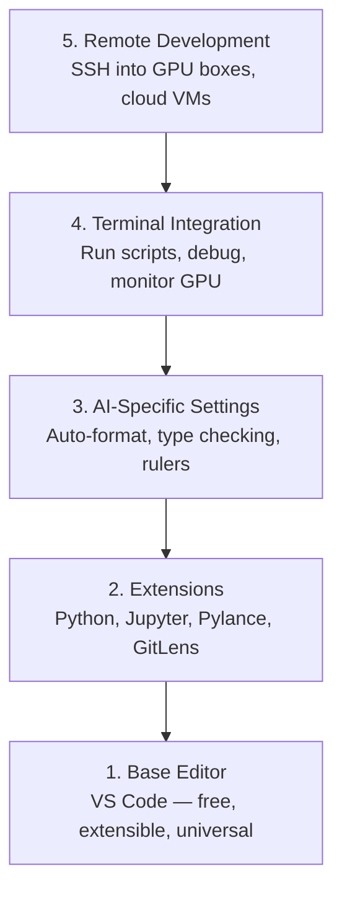

# 編輯器設定

> 編輯器是你的副駕駛。花一次功夫設定好，它就不會擋你的路，還會開始幫你分擔工作。

**類型：** 實作
**程式語言：** --
**先修單元：** 階段 0 · 01
**時間：** 約 20 分鐘

## 學習目標

- 安裝 VS Code，以及 Python、Jupyter、linting、remote SSH 這幾類必備擴充套件
- 設定存檔自動格式化、型別檢查，以及適合 AI 工作流程的 notebook 輸出捲動
- 設定 Remote SSH，像在本機一樣編輯與除錯遠端 GPU 機器上的程式碼
- 評估其他編輯器選項（Cursor、Windsurf、Neovim）在 AI 工作上的取捨

## 問題所在

你會在編輯器裡待上好幾千個小時：寫 Python、跑 notebook、除錯訓練迴圈、SSH 進 GPU 機器。設定沒弄好，每次開工都是磨人的摩擦：沒有自動完成、沒有型別提示、沒有行內錯誤、格式要手動調、終端機用起來卡卡的。

正確的設定花你 20 分鐘。省下這 20 分鐘，代價是每天都要付 20 分鐘。

## 核心概念

一套 AI 工程用的編輯器設定，需要五樣東西：



## 動手實作

### 步驟 1：安裝 VS Code

VS Code 是我們推薦的編輯器。它免費、在每個作業系統上都能跑、對 Jupyter notebook 有一級支援，而且擴充套件生態系涵蓋了 AI 工作需要的一切。

到 [code.visualstudio.com](https://code.visualstudio.com/) 下載。

在終端機確認：

```bash
code --version
```

如果在 macOS 上找不到 `code`，開啟 VS Code，按 `Cmd+Shift+P`，輸入 "Shell Command"，然後選 "Install 'code' command in PATH"。

### 步驟 2：安裝必備擴充套件

在 VS Code 裡開啟內建終端機（所有平台都是 `` Ctrl+` ``），安裝對 AI 工作真正有用的擴充套件：

```bash
code --install-extension ms-python.python
code --install-extension ms-python.vscode-pylance
code --install-extension ms-toolsai.jupyter
code --install-extension eamodio.gitlens
code --install-extension ms-vscode-remote.remote-ssh
code --install-extension ms-python.debugpy
code --install-extension ms-python.black-formatter
code --install-extension charliermarsh.ruff
```

每一個各自做什麼：

| 擴充套件 | 為什麼要它 |
|-----------|-----|
| Python | 語言支援、虛擬環境偵測、執行／除錯 |
| Pylance | 快速的型別檢查、自動完成、import 解析 |
| Jupyter | 在 VS Code 裡跑 notebook，附變數瀏覽器 |
| GitLens | 看誰改了什麼，行內顯示 git blame |
| Remote SSH | 像開本機資料夾一樣，開遠端 GPU 機器上的資料夾 |
| Debugpy | Python 的逐步除錯 |
| Black Formatter | 存檔時自動格式化，風格一致 |
| Ruff | 快速 linting，抓出常見錯誤 |

本單元的 `code/.vscode/extensions.json` 收錄了完整的建議清單。當你開啟這個專案資料夾時，VS Code 會提示你安裝它們。

### 步驟 3：設定 settings

把本單元 `code/.vscode/settings.json` 裡的設定複製過去，或是透過 `Settings > Open Settings (JSON)` 手動套用。

對 AI 工作最關鍵的幾項設定：

```jsonc
{
    "python.analysis.typeCheckingMode": "basic",
    "editor.formatOnSave": true,
    "editor.rulers": [88, 120],
    "notebook.output.scrolling": true,
    "files.autoSave": "afterDelay"
}
```

為什麼這幾項重要：

- **型別檢查設為 basic**：在你執行之前就抓到傳錯型別的引數。省下張量形狀不符、API 參數給錯的除錯時間。
- **存檔時格式化**：從此不必再想格式的事，Black 會處理。
- **標尺放在 88 與 120**：Black 在 88 換行。120 那條線則提醒你 docstring 與註解寫得太長了。
- **Notebook 輸出捲動**：訓練迴圈會印出好幾千行。沒有捲動，輸出面板就爆掉。
- **自動存檔**：你一定會忘記存檔，然後訓練腳本跑的是舊程式碼。自動存檔可以避免這件事。

### 步驟 4：終端機整合

VS Code 的內建終端機，就是你執行訓練腳本、監控 GPU、管理環境的地方。

把它設好：

```jsonc
{
    "terminal.integrated.defaultProfile.osx": "zsh",
    "terminal.integrated.defaultProfile.linux": "bash",
    "terminal.integrated.fontSize": 13,
    "terminal.integrated.scrollback": 10000
}
```

好用的快捷鍵：

| 動作 | macOS | Linux/Windows |
|--------|-------|---------------|
| 開關終端機 | `` Ctrl+` `` | `` Ctrl+` `` |
| 新增終端機 | `` Ctrl+Shift+` `` | `` Ctrl+Shift+` `` |
| 分割終端機 | `Cmd+\` | `Ctrl+Shift+5` |

分割終端機很實用：一邊跑你的腳本，另一邊用 `nvidia-smi -l 1` 或 `watch -n 1 nvidia-smi` 監控 GPU。

### 步驟 5：遠端開發（SSH 進 GPU 機器）

這是 AI 工作上最重要的擴充套件。你會在遠端機器上跑訓練（雲端 VM、實驗室伺服器、Lambda、Vast.ai）。Remote SSH 讓你開啟遠端檔案系統、編輯檔案、開終端機、除錯，一切都像在本機。

設定方式：

1. 安裝 Remote SSH 擴充套件（步驟 2 已經做了）。
2. 按 `Ctrl+Shift+P`（或 `Cmd+Shift+P`），輸入 "Remote-SSH: Connect to Host"。
3. 輸入 `user@your-gpu-box-ip`。
4. VS Code 會自動在遠端機器上安裝它的 server 元件。

想免密碼登入，就設定 SSH 金鑰：

```bash
ssh-keygen -t ed25519 -C "your-email@example.com"
ssh-copy-id user@your-gpu-box-ip
```

把主機加進 `~/.ssh/config` 會方便很多：

```
Host gpu-box
    HostName 203.0.113.50
    User ubuntu
    IdentityFile ~/.ssh/id_ed25519
    ForwardAgent yes
```

現在 `Remote-SSH: Connect to Host > gpu-box` 就能立刻連上。

## 其他選擇

### Cursor

[cursor.com](https://cursor.com) 是 VS Code 的分支，內建 AI 程式碼生成。它沿用同一套擴充套件生態系與設定格式。如果你用 Cursor，本單元講的一切照樣適用：匯入同一份 `settings.json` 與 `extensions.json` 就好。

### Windsurf

[windsurf.com](https://windsurf.com) 是另一個以 AI 為核心的 VS Code 分支。故事一樣：同樣的擴充套件、同樣的設定格式、同樣支援 Remote SSH。

### Vim/Neovim

如果你本來就在用 Vim 或 Neovim，而且用得很順，那就留在那裡。做 AI Python 工作的最低設定：

- **pyright** 或 **pylsp** 做型別檢查（透過 Mason 或手動安裝）
- **nvim-lspconfig** 串接 language server
- **jupyter-vim** 或 **molten-nvim** 提供類似 notebook 的執行方式
- **telescope.nvim** 做檔案／符號搜尋
- **none-ls.nvim** 搭配 black 與 ruff 做格式化／linting

如果你原本沒在用 Vim，現在別開始。學習曲線會跟學 AI 工程互相搶時間。用 VS Code。

## 框架應用

有了這套設定，你的日常工作流程會是這樣：

1. 在 VS Code 開啟專案資料夾（或用 Remote SSH 連到 GPU 機器）。
2. 在編輯器裡寫 Python，有自動完成、型別提示和行內錯誤。
3. 用 Jupyter 擴充套件直接在編輯器裡跑 notebook。
4. 用內建終端機跑訓練腳本、`uv pip install`、監控 GPU。
5. 提交前用 GitLens 檢視改動。

## 練習

1. 安裝 VS Code 以及步驟 2 列出的所有擴充套件
2. 把本單元的 `settings.json` 複製到你的 VS Code 設定裡
3. 開一個 Python 檔案，確認 Pylance 會顯示型別提示、Black 會在存檔時格式化
4. 如果你有遠端機器可用，設定 Remote SSH 並開啟上面的某個資料夾

## 關鍵術語

| 術語 | 大家怎麼說 | 實際上是什麼 |
|------|----------------|----------------------|
| LSP | 「自動完成引擎」 | Language Server Protocol：一套標準，讓編輯器能從特定語言的 server 取得型別資訊、補全與診斷 |
| Pylance | 「那個 Python 外掛」 | 微軟的 Python language server，用 Pyright 做型別檢查與 IntelliSense |
| Remote SSH | 「在伺服器上工作」 | VS Code 擴充套件，在遠端機器上跑一個輕量 server，把 UI 串流回你本機的編輯器 |
| 存檔時格式化 | 「自動 prettier」 | 每次存檔時編輯器就跑一次格式化工具（Black、Ruff），程式碼風格永遠一致 |
