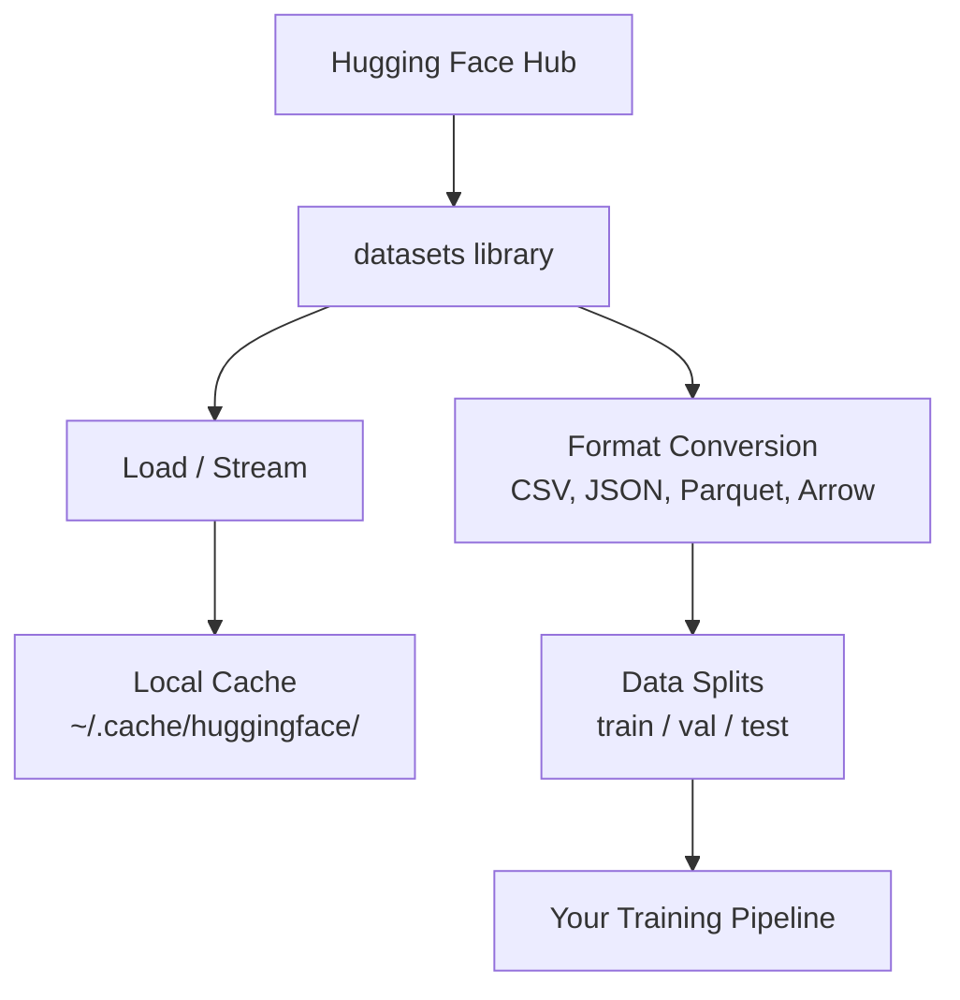

# 資料管理

> 資料是燃料。你怎麼管理它，決定了你能跑多快。

**類型：** 實作
**程式語言：** Python
**先修單元：** 階段 0 · 01
**時間：** 約 45 分鐘

## 學習目標

- 用 Hugging Face 的 `datasets` 函式庫載入、串流與快取資料集
- 在 CSV、JSON、Parquet、Arrow 之間轉換格式，並說得出各自的取捨
- 固定隨機種子，建立可重現的訓練／驗證／測試切分
- 用 `.gitignore`、Git LFS 或 DVC 管理龐大的模型與資料集檔案

## 問題所在

每個 AI 專案都從資料開始。你得找到資料集、把它下載下來、在各種格式之間轉換、切分成訓練與評估用，還要做版本控管，這樣實驗才能重現。每次都手動來一遍既慢又容易出錯。你需要一套可以重複執行的流程。

## 核心概念



在 AI 工作裡，Hugging Face 的 `datasets` 函式庫是載入資料的標準做法。下載、快取、格式轉換與串流，它開箱就都幫你處理好。

```figure
s0-data-pipeline
```

## 動手實作

### 步驟 1：安裝 datasets 函式庫

```bash
pip install datasets huggingface_hub
```

### 步驟 2：載入資料集

```python
from datasets import load_dataset

dataset = load_dataset("stanfordnlp/imdb")
print(dataset)
print(dataset["train"][0])
```

這會下載 IMDB 電影評論資料集。第一次下載之後，之後都從 `~/.cache/huggingface/datasets/` 的快取載入。

### 步驟 3：串流大型資料集

有些資料集大到硬碟裝不下。串流會一列一列讀進來，不必先把整份東西下載完。

```python
dataset = load_dataset("wikimedia/wikipedia", "20220301.en", split="train", streaming=True)

for i, example in enumerate(dataset):
    print(example["title"])
    if i >= 4:
        break
```

串流給你的是一個 `IterableDataset`。資料一列一列來，你就一列一列處理。不論資料集多大，記憶體用量都維持不變。

### 步驟 4：資料集格式

`datasets` 函式庫底層用的是 Apache Arrow。你可以依照流程的需要轉成其他格式。

```python
dataset = load_dataset("stanfordnlp/imdb", split="train")

dataset.to_csv("imdb_train.csv")
dataset.to_json("imdb_train.json")
dataset.to_parquet("imdb_train.parquet")
```

格式比較：

| 格式 | 大小 | 讀取速度 | 適合什麼 |
|--------|------|-----------|----------|
| CSV | 大 | 慢 | 給人看、試算表 |
| JSON | 大 | 慢 | API、嵌套資料 |
| Parquet | 小 | 快 | 分析、以欄為單位的查詢 |
| Arrow | 小 | 最快 | 記憶體內處理（`datasets` 內部就是用它） |

做 AI 的話，Parquet 是最好的儲存格式。Arrow 是你在記憶體裡實際操作的東西。CSV 與 JSON 則是用來交換資料的。

### 步驟 5：資料切分

每個 ML 專案都需要三份切分：

- **訓練集（train）**：模型從這裡學（通常佔 80%）
- **驗證集（validation）**：訓練過程中用來看進展（通常佔 10%）
- **測試集（test）**：訓練結束後做最終評估（通常佔 10%）

有些資料集本來就切好了。沒切好的，就自己動手：

```python
dataset = load_dataset("stanfordnlp/imdb", split="train")

split = dataset.train_test_split(test_size=0.2, seed=42)
train_val = split["train"].train_test_split(test_size=0.125, seed=42)

train_ds = train_val["train"]
val_ds = train_val["test"]
test_ds = split["test"]

print(f"Train: {len(train_ds)}, Val: {len(val_ds)}, Test: {len(test_ds)}")
```

為了可重現，種子一定要設。同一個種子每次都會切出同樣的結果。

### 步驟 6：下載並快取模型

模型檔案都很大。`huggingface_hub` 函式庫會處理下載與快取。

```python
from huggingface_hub import hf_hub_download, snapshot_download

model_path = hf_hub_download(
    repo_id="sentence-transformers/all-MiniLM-L6-v2",
    filename="config.json"
)
print(f"Cached at: {model_path}")

model_dir = snapshot_download("sentence-transformers/all-MiniLM-L6-v2")
print(f"Full model at: {model_dir}")
```

模型會快取到 `~/.cache/huggingface/hub/`。下載過一次之後，後續執行都是瞬間載入。

### 步驟 7：處理大型檔案

模型權重與大型資料集不該進 git。有三個選擇：

**方案 A：.gitignore（最簡單）**

```
*.bin
*.safetensors
*.pt
*.onnx
data/*.parquet
data/*.csv
models/
```

**方案 B：Git LFS（在 git 裡追蹤大檔案）**

```bash
git lfs install
git lfs track "*.bin"
git lfs track "*.safetensors"
git add .gitattributes
```

Git LFS 在你的儲存庫裡只放指標，實際檔案放在另一台伺服器上。GitHub 免費給你 1 GB。

**方案 C：DVC（資料版本控管）**

```bash
pip install dvc
dvc init
dvc add data/training_set.parquet
git add data/training_set.parquet.dvc data/.gitignore
git commit -m "Track training data with DVC"
```

DVC 會產生小小的 `.dvc` 檔案指向你的資料。資料本身放在 S3、GCS 或其他遠端儲存後端。

| 做法 | 複雜度 | 適合什麼 |
|----------|-----------|----------|
| .gitignore | 低 | 個人專案、可以重新抓回來的下載資料 |
| Git LFS | 中 | 團隊透過 git 共用模型權重 |
| DVC | 高 | 可重現的實驗、大型資料集、團隊協作 |

本課程用 `.gitignore` 就夠了。當你需要在不同機器上重現一模一樣的實驗時，再用 DVC。

### 步驟 8：儲存模式

**本機儲存** 適用於 10 GB 以下的資料集。HF 快取會自動幫你處理。

**雲端儲存** 則用在更大的資料，或需要跨機器共用時：

```python
import os

local_path = os.path.expanduser("~/.cache/huggingface/datasets/")

# s3_path = "s3://my-bucket/datasets/"
# gcs_path = "gs://my-bucket/datasets/"
```

DVC 可以直接接 S3 與 GCS：

```bash
dvc remote add -d myremote s3://my-bucket/dvc-store
dvc push
```

本課程用本機儲存就夠。等你要在遠端 GPU 機器上做微調時，雲端儲存才會派上用場。

## 本課程使用的資料集

| 資料集 | 出現單元 | 大小 | 教你什麼 |
|---------|---------|------|----------------|
| IMDB | 分詞、分類 | 84 MB | 文本分類的基礎 |
| WikiText | 語言模型 | 181 MB | 下一個詞元的預測 |
| SQuAD | 問答系統 | 35 MB | 問答、答案區間 |
| Common Crawl（子集） | 嵌入 | 不固定 | 大規模文本處理 |
| MNIST | 視覺基礎 | 21 MB | 圖像分類的基本功 |
| COCO（子集） | 多模態 | 不固定 | 圖文配對 |

你現在不需要全部下載。每個單元都會說明它需要哪些。

## 框架應用

執行這支工具腳本，確認一切正常：

```bash
python code/data_utils.py
```

它會下載一個小資料集，做轉換、做切分，最後印出摘要。

## 產出交付

本單元會產出：
- `code/data_utils.py` —— 可重複使用的資料載入與快取工具
- `outputs/prompt-data-helper.md` —— 用來為某項任務找到合適資料集的提示詞

## 練習

1. 用 `mrpc` 這個 config 載入 `glue` 資料集，檢視前 5 筆範例
2. 串流 `c4` 資料集，數一數 10 秒內能處理多少筆範例
3. 把一個資料集轉成 Parquet，跟 CSV 比較檔案大小
4. 固定種子，做出 70/15/15 的訓練／驗證／測試切分，並驗證各自的筆數

## 關鍵術語

| 術語 | 大家怎麼說 | 實際上是什麼 |
|------|----------------|----------------------|
| 資料集切分 | 「訓練資料」 | 有名字的子集（train／val／test），用在 ML 生命週期的不同階段 |
| 串流 | 「延遲載入」 | 從遠端來源一列一列處理資料，不必下載整份資料集 |
| Parquet | 「壓縮過的 CSV」 | 為分析查詢與儲存效率最佳化的欄式檔案格式 |
| Arrow | 「快的 dataframe」 | 記憶體內的欄式格式，datasets 函式庫內部用它做零複製讀取 |
| Git LFS | 「處理大檔案的 git」 | 一個擴充套件，把大檔案存在 git 儲存庫外，只在版本控管裡留指標 |
| DVC | 「處理資料的 git」 | 給資料集與模型用的版本控管系統，可以接雲端儲存 |
| 快取 | 「已經下載過了」 | 先前抓過的資料的本機副本，預設放在 ~/.cache/huggingface/ |
