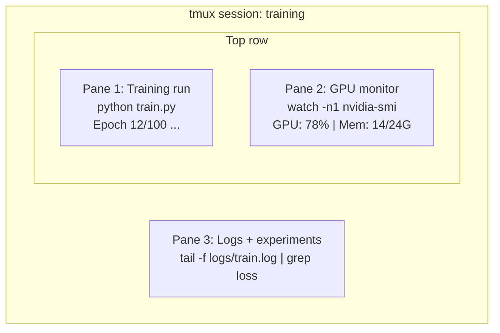

# 終端機與 Shell

> 終端機是 AI 工程師的棲身之地。把這裡待熟。

**類型：** 學習
**程式語言：** --
**先修單元：** 階段 0 · 01
**時間：** 約 35 分鐘

## 學習目標

- 用管線、重導向與 `grep`，在命令列上篩選與處理訓練日誌
- 建立可持續存在的 tmux 工作階段，用多個窗格同時跑訓練與監看 GPU
- 用 `htop`、`nvtop` 與 `nvidia-smi` 監看系統與 GPU 資源
- 用 SSH、`scp` 與 `rsync` 在本機與遠端機器之間傳檔

## 問題所在

你待在終端機裡的時間，會比待在任何編輯器裡都長。訓練、監看 GPU、追日誌、遠端 SSH、環境管理——每一種 AI 工作流程都會碰到 shell。這裡慢，做什麼都慢。

本單元只講對 AI 工作真正有用的終端機技能。不講 Unix 歷史，也不深入 Bash 腳本。只講你需要的部分。

## 核心概念



三件事同時在跑，只用一個終端機。你可以中途離開（detach）、回家、再 SSH 進來重新接上（reattach），訓練從頭到尾都沒斷。

```figure
s0-shell-pipeline
```

## 動手實作

### 步驟 1：認識你的 shell

先看看你在跑哪一個 shell：

```bash
echo $SHELL
```

大多數系統用 `bash` 或 `zsh`，兩個都可以。本課程的指令在哪一個都能跑。

一定要知道的幾件事：

```bash
# Move around
cd ~/projects/ai-engineering-from-scratch
pwd
ls -la

# History search (most useful shortcut you'll learn)
# Ctrl+R then type part of a previous command
# Press Ctrl+R again to cycle through matches

# Clear terminal
clear   # or Ctrl+L

# Cancel a running command
# Ctrl+C

# Suspend a running command (resume with fg)
# Ctrl+Z
```

### 步驟 2：管線與重導向

管線把指令串起來。這就是你處理日誌、篩選輸出、把工具接成一條龍的方式，而且會用個不停。

```bash
# Count how many times "loss" appears in a log
cat train.log | grep "loss" | wc -l

# Extract just the loss values from training output
grep "loss:" train.log | awk '{print $NF}' > losses.txt

# Watch a log file update in real time, filtering for errors
tail -f train.log | grep --line-buffered "ERROR"

# Sort experiments by final accuracy
grep "final_accuracy" results/*.log | sort -t= -k2 -n -r

# Redirect stdout and stderr to separate files
python train.py > output.log 2> errors.log

# Redirect both to the same file
python train.py > train_full.log 2>&1
```

你需要的三種重導向：

| 符號 | 作用 |
|--------|-------------|
| `>` | 把 stdout 寫進檔案（覆寫） |
| `>>` | 把 stdout 附加到檔案末端 |
| `2>` | 把 stderr 寫進檔案 |
| `2>&1` | 把 stderr 導到跟 stdout 同一個地方 |
| `\|` | 把前一個指令的 stdout 當成下一個指令的 stdin |

### 步驟 3：背景程序

訓練動輒好幾個小時。你不會想讓終端機一直開著。

```bash
# Run in background (output still goes to terminal)
python train.py &

# Run in background, immune to hangup (closing terminal won't kill it)
nohup python train.py > train.log 2>&1 &

# Check what's running in background
jobs
ps aux | grep train.py

# Bring a background job to foreground
fg %1

# Kill a background process
kill %1
# or find its PID and kill that
kill $(pgrep -f "train.py")
```

`&`、`nohup` 與 `screen`／`tmux` 的差別：

| 做法 | 關掉終端機還活著嗎？ | 能重新接上嗎？ |
|--------|-------------------------|---------------|
| `command &` | 不行 | 不行 |
| `nohup command &` | 可以 | 不行（只能看日誌檔） |
| `screen` / `tmux` | 可以 | 可以 |

只要超過幾分鐘的工作，就用 tmux。

### 步驟 4：tmux

tmux 讓你建立可持續存在的終端機工作階段，一個階段裡開多個窗格。管理訓練這件事，它是最有用的單一工具。

```bash
# Install
# macOS
brew install tmux
# Ubuntu
sudo apt install tmux

# Start a named session
tmux new -s training

# Split horizontally
# Ctrl+B then "

# Split vertically
# Ctrl+B then %

# Navigate between panes
# Ctrl+B then arrow keys

# Detach (session keeps running)
# Ctrl+B then d

# Reattach
tmux attach -t training

# List sessions
tmux ls

# Kill a session
tmux kill-session -t training
```

一個典型的 AI 工作階段長這樣：

```bash
tmux new -s train

# Pane 1: start training
python train.py --epochs 100 --lr 1e-4

# Ctrl+B, " to split, then run GPU monitor
watch -n1 nvidia-smi

# Ctrl+B, % to split vertically, tail the logs
tail -f logs/experiment.log

# Now detach with Ctrl+B, d
# SSH out, go get coffee, come back
# tmux attach -t train
```

### 步驟 5：用 htop 與 nvtop 監看

```bash
# System processes (better than top)
htop

# GPU processes (if you have NVIDIA GPU)
# Install: sudo apt install nvtop (Ubuntu) or brew install nvtop (macOS)
nvtop

# Quick GPU check without nvtop
nvidia-smi

# Watch GPU usage update every second
watch -n1 nvidia-smi

# See which processes are using the GPU
nvidia-smi --query-compute-apps=pid,name,used_memory --format=csv
```

你會用到的 `htop` 快速鍵：
- `F6` 或 `>` 依欄位排序（依記憶體排序可以找出記憶體洩漏）
- `F5` 切換樹狀檢視（看得到子程序）
- `F9` 終止某個程序
- `/` 搜尋程序名稱

### 步驟 6：用 SSH 連遠端 GPU 機器

當你租雲端 GPU（Lambda、RunPod、Vast.ai）時，都是透過 SSH 連上去。

```bash
# Basic connection
ssh user@gpu-box-ip

# With a specific key
ssh -i ~/.ssh/my_gpu_key user@gpu-box-ip

# Copy files to remote
scp model.pt user@gpu-box-ip:~/models/

# Copy files from remote
scp user@gpu-box-ip:~/results/metrics.json ./

# Sync a whole directory (faster for many files)
rsync -avz ./data/ user@gpu-box-ip:~/data/

# Port forward (access remote Jupyter/TensorBoard locally)
ssh -L 8888:localhost:8888 user@gpu-box-ip
# Now open localhost:8888 in your browser

# SSH config for convenience
# Add to ~/.ssh/config:
# Host gpu
#     HostName 192.168.1.100
#     User ubuntu
#     IdentityFile ~/.ssh/gpu_key
#
# Then just:
# ssh gpu
```

### 步驟 7：AI 工作好用的別名

把這些加到你的 `~/.bashrc` 或 `~/.zshrc`：

```bash
source phases/00-setup-and-tooling/10-terminal-and-shell/code/shell_aliases.sh
```

或者只挑你想要的來抄。幾個關鍵別名：

```bash
# GPU status at a glance
alias gpu='nvidia-smi --query-gpu=index,name,utilization.gpu,memory.used,memory.total,temperature.gpu --format=csv,noheader'

# Kill all Python training processes
alias killtraining='pkill -f "python.*train"'

# Quick virtual environment activate
alias ae='source .venv/bin/activate'

# Watch training loss
alias watchloss='tail -f logs/*.log | grep --line-buffered "loss"'
```

完整清單請看 `code/shell_aliases.sh`。

### 步驟 8：常見的 AI 終端機套路

這些在實務上會一再出現：

```bash
# Run training, log everything, notify when done
python train.py 2>&1 | tee train.log; echo "DONE" | mail -s "Training complete" you@email.com

# Compare two experiment logs side by side
diff <(grep "accuracy" exp1.log) <(grep "accuracy" exp2.log)

# Find the largest model files (clean up disk space)
find . -name "*.pt" -o -name "*.safetensors" | xargs du -h | sort -rh | head -20

# Download a model from Hugging Face
wget https://huggingface.co/model/resolve/main/model.safetensors

# Untar a dataset
tar xzf dataset.tar.gz -C ./data/

# Count lines in all Python files (see how big your project is)
find . -name "*.py" | xargs wc -l | tail -1

# Check disk space (training data fills disks fast)
df -h
du -sh ./data/*

# Environment variable check before training
env | grep -i cuda
env | grep -i torch
```

## 框架應用

本課程裡，這些工具各自會在什麼時候派上場：

| 工具 | 什麼時候用 |
|------|----------------|
| tmux | 每一次訓練（階段 3 以後） |
| `tail -f` + `grep` | 監看訓練日誌 |
| `nohup` / `&` | 短時間的背景工作 |
| `htop` / `nvtop` | 排查訓練變慢、OOM 錯誤 |
| SSH + `rsync` | 在雲端 GPU 上工作 |
| 管線與重導向 | 處理實驗結果 |
| 別名 | 省下重複打指令的時間 |

## 練習

1. 裝好 tmux，建立一個有三個窗格的工作階段，一個跑 `htop`、一個跑 `watch -n1 date`、第三個跑一支 Python 腳本。離開再重新接上。
2. 把 `code/shell_aliases.sh` 裡的別名加進你的 shell 設定檔，再用 `source ~/.zshrc`（或 `~/.bashrc`）重新載入。
3. 用 `for i in $(seq 1 100); do echo "epoch $i loss: $(echo "scale=4; 1/$i" | bc)"; sleep 0.1; done > fake_train.log` 造一份假的訓練日誌，然後用 `grep`、`tail` 與 `awk` 只把 loss 數值抽出來。
4. 為一台你有權限的伺服器設定一筆 SSH config（或者拿 `localhost` 來練語法）。

## 關鍵術語

| 術語 | 大家怎麼說 | 實際上是什麼 |
|------|----------------|----------------------|
| Shell | 「終端機」 | 負責解讀你打的指令的那支程式（bash、zsh、fish） |
| tmux | 「終端機多工器」 | 讓你在同一個視窗裡跑多個終端機工作階段，並可離開／重新接上的程式 |
| Pipe（管線） | 「那根豎線」 | `\|` 運算子，把一個指令的輸出送成另一個指令的輸入 |
| PID | 「程序 ID」 | 指派給每個執行中程序的唯一編號，用來監看或終止它 |
| nohup | 「No hangup」 | 讓指令免於 hangup 訊號，因此關掉終端機不會把它殺掉 |
| SSH | 「連上伺服器」 | Secure Shell，一種在遠端機器上執行指令的加密協定 |
