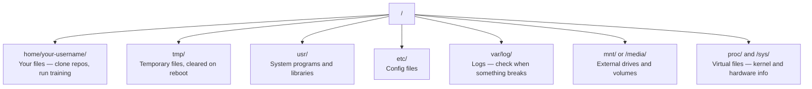

# AI 開發者的 Linux 入門

> 大部分的 AI 都跑在 Linux 上。你得懂到足以不被卡住的程度。

**類型：** 學習
**程式語言：** --
**先修單元：** 階段 0 · 01
**時間：** 約 30 分鐘

## 學習目標

- 在命令列裡瀏覽 Linux 檔案系統，並完成必要的檔案操作
- 用 `chmod` 與 `chown` 管理檔案權限，解決「Permission denied」的錯誤
- 用 `apt` 安裝系統套件，把一台全新的 GPU 機器設定成能做 AI 工作
- 認出 macOS 與 Linux 之間那些常讓人在遠端機器上踩坑的差異

## 問題所在

你在 macOS 或 Windows 上開發。但只要你 SSH 進一台雲端 GPU 機器、租一台 Lambda 實例，或開一台 EC2，你就落在 Ubuntu 裡了。終端機是你唯一的介面。沒有 Finder，沒有檔案總管，沒有 GUI。如果你不會在命令列裡瀏覽檔案系統、安裝套件、管理程序，你就只能一邊付著 GPU 閒置的費用，一邊 google「how to unzip a file in Linux」。

這是一份求生指南。它只涵蓋你為了在遠端 Linux 機器上做 AI 工作所必需的東西，多的不談。

## 檔案系統配置

Linux 把所有東西都放在單一的根目錄 `/` 底下。沒有 `C:\`，也沒有 `/Volumes`。你真的會碰到的目錄有這些：



你的家目錄是 `~` 或 `/home/your-username`。你做的事幾乎都發生在這裡。

## 必備指令

以下 15 個指令，涵蓋你在遠端 GPU 機器上會做的 95% 的事。

### 到處走走

```bash
pwd                         # Where am I?
ls                          # What's here?
ls -la                      # What's here, including hidden files with details?
cd /path/to/dir             # Go there
cd ~                        # Go home
cd ..                       # Go up one level
```

### 檔案與目錄

```bash
mkdir my-project            # Create a directory
mkdir -p a/b/c              # Create nested directories in one shot

cp file.txt backup.txt      # Copy a file
cp -r src/ src-backup/      # Copy a directory (recursive)

mv old.txt new.txt          # Rename a file
mv file.txt /tmp/           # Move a file

rm file.txt                 # Delete a file (no trash, it's gone)
rm -rf my-dir/              # Delete a directory and everything inside
```

`rm -rf` 是永久的。沒有復原。按下 enter 之前，路徑再確認一次。

### 讀取檔案

```bash
cat file.txt                # Print entire file
head -20 file.txt           # First 20 lines
tail -20 file.txt           # Last 20 lines
tail -f log.txt             # Follow a log file in real time (Ctrl+C to stop)
less file.txt               # Scroll through a file (q to quit)
```

### 搜尋

```bash
grep "error" training.log           # Find lines containing "error"
grep -r "learning_rate" .           # Search all files in current directory
grep -i "cuda" config.yaml          # Case-insensitive search

find . -name "*.py"                 # Find all Python files under current dir
find . -name "*.ckpt" -size +1G     # Find checkpoint files larger than 1GB
```

## 權限

Linux 裡每個檔案都有一個擁有者與一組權限位元。當腳本跑不起來、或你寫不進某個目錄時，你就會碰上它。

```bash
ls -l train.py
# -rwxr-xr-- 1 user group 2048 Mar 19 10:00 train.py
#  ^^^             owner permissions: read, write, execute
#     ^^^          group permissions: read, execute
#        ^^        everyone else: read only
```

常見的修法：

```bash
chmod +x train.sh           # Make a script executable
chmod 755 deploy.sh         # Owner: full, others: read+execute
chmod 644 config.yaml       # Owner: read+write, others: read only

chown user:group file.txt   # Change who owns a file (needs sudo)
```

當某個東西說「Permission denied」，那幾乎一定是權限問題。`chmod +x` 或 `sudo` 能解決大部分情況。

## 套件管理（apt）

Ubuntu 用 `apt`。系統層級的軟體就是這樣裝的。

```bash
sudo apt update             # Refresh the package list (always do this first)
sudo apt install -y htop    # Install a package (-y skips confirmation)
sudo apt install -y build-essential  # C compiler, make, etc. Needed by many Python packages
sudo apt install -y tmux    # Terminal multiplexer (keep sessions alive after disconnect)

apt list --installed        # What's installed?
sudo apt remove htop        # Uninstall
```

在一台全新的 GPU 機器上，你通常會裝這些套件：

```bash
sudo apt update && sudo apt install -y \
    build-essential \
    git \
    curl \
    wget \
    tmux \
    htop \
    unzip \
    python3-venv
```

## 使用者與 sudo

你平常是以一般使用者的身分登入。有些操作需要 root（管理員）權限。

```bash
whoami                      # What user am I?
sudo command                # Run a single command as root
sudo su                     # Become root (exit to go back, use sparingly)
```

在雲端 GPU 實例上，通常只有你一個使用者，而且已經有 sudo 權限了。不要什麼事都用 root 跑。只在需要時才用 sudo。

## 程序與 systemd

當訓練卡住，或你想看看有什麼在跑：

```bash
htop                        # Interactive process viewer (q to quit)
ps aux | grep python        # Find running Python processes
kill 12345                  # Gracefully stop process with PID 12345
kill -9 12345               # Force kill (use when graceful doesn't work)
nvidia-smi                  # GPU processes and memory usage
```

systemd 負責管理服務（背景常駐程式）。如果你要跑推論伺服器，就會用到它：

```bash
sudo systemctl start nginx          # Start a service
sudo systemctl stop nginx           # Stop it
sudo systemctl restart nginx        # Restart it
sudo systemctl status nginx         # Check if it's running
sudo systemctl enable nginx         # Start automatically on boot
```

## 磁碟空間

GPU 機器的磁碟空間往往有限。模型與資料集很快就把它塞滿。

```bash
df -h                       # Disk usage for all mounted drives
df -h /home                 # Disk usage for /home specifically

du -sh *                    # Size of each item in current directory
du -sh ~/.cache             # Size of your cache (pip, huggingface models land here)
du -sh /data/checkpoints/   # Check how big your checkpoints are

# Find the biggest space hogs
du -h --max-depth=1 / 2>/dev/null | sort -hr | head -20
```

常見的空間回收手段：

```bash
# Clear pip cache
pip cache purge

# Clear apt cache
sudo apt clean

# Remove old checkpoints you don't need
rm -rf checkpoints/epoch_01/ checkpoints/epoch_02/
```

## 網路

你會在命令列裡下載模型、傳輸檔案、打 API。

```bash
# Download files
wget https://example.com/model.bin                   # Download a file
curl -O https://example.com/data.tar.gz              # Same thing with curl
curl -s https://api.example.com/health | python3 -m json.tool  # Hit an API, pretty-print JSON

# Transfer files between machines
scp model.bin user@remote:/data/                     # Copy file to remote machine
scp user@remote:/data/results.csv .                  # Copy file from remote to local
scp -r user@remote:/data/checkpoints/ ./local-dir/   # Copy directory

# Sync directories (faster than scp for large transfers, resumes on failure)
rsync -avz --progress ./data/ user@remote:/data/
rsync -avz --progress user@remote:/results/ ./results/
```

只要東西一大，就用 `rsync` 而不是 `scp`。它只傳有變動的位元組，也能處理中斷的連線。

## tmux：讓工作階段活著

當你 SSH 進遠端機器，闔上筆電就會殺掉你的訓練。tmux 能避免這件事。

```bash
tmux new -s train           # Start a new session named "train"
# ... start your training, then:
# Ctrl+B, then D            # Detach (training keeps running)

tmux ls                     # List sessions
tmux attach -t train        # Reattach to session

# Inside tmux:
# Ctrl+B, then %            # Split pane vertically
# Ctrl+B, then "            # Split pane horizontally
# Ctrl+B, then arrow keys   # Switch between panes
```

長時間的訓練工作，一律在 tmux 裡跑。一律。

## Windows 使用者的 WSL2

如果你用 Windows，WSL2 讓你不必雙系統開機，就有一個真正的 Linux 環境。

```bash
# In PowerShell (admin)
wsl --install -d Ubuntu-24.04

# After restart, open Ubuntu from Start menu
sudo apt update && sudo apt upgrade -y
```

WSL2 跑的是真正的 Linux 核心。這一課裡的東西在它裡面全都能用。從 WSL 裡面看，你的 Windows 檔案在 `/mnt/c/Users/YourName/`。

只要 NVIDIA 驅動程式裝在 Windows 那一側，GPU 直通就能運作。請安裝 Windows 版的 NVIDIA 驅動程式（不是 Linux 版），CUDA 就會在 WSL2 裡可用。

## 踩坑清單：從 macOS 到 Linux

從 macOS 過來的人會被這些絆倒：

| macOS | Linux | 說明 |
|-------|-------|-------|
| `brew install` | `sudo apt install` | 套件名稱有時不一樣。`brew install htop` 和 `sudo apt install htop` 效果相同，但 `brew install readline` 和 `sudo apt install libreadline-dev` 就不是這麼回事。 |
| `open file.txt` | `xdg-open file.txt` | 但遠端機器上你不會有 GUI。用 `cat` 或 `less`。 |
| `pbcopy` / `pbpaste` | 沒有這東西 | 透過 SSH 沒有可以導入／導出的剪貼簿。 |
| `~/.zshrc` | `~/.bashrc` | macOS 預設用 zsh。大多數 Linux 伺服器用 bash。 |
| `/opt/homebrew/` | `/usr/bin/`、`/usr/local/bin/` | 執行檔放的位置不一樣。 |
| `sed -i '' 's/a/b/' file` | `sed -i 's/a/b/' file` | macOS 的 sed 在 `-i` 後面要接一個空字串。Linux 不用。 |
| 檔案系統不分大小寫 | 檔案系統區分大小寫 | 在 Linux 上，`Model.py` 和 `model.py` 是兩個不同的檔案。 |
| 換行字元 `\n` | 換行字元 `\n` | 一樣。但 Windows 用 `\r\n`，會弄壞 bash 腳本。用 `dos2unix` 修掉。 |

## 速查卡

```
Navigation:     pwd, ls, cd, find
Files:          cp, mv, rm, mkdir, cat, head, tail, less
Search:         grep, find
Permissions:    chmod, chown, sudo
Packages:       apt update, apt install
Processes:      htop, ps, kill, nvidia-smi
Services:       systemctl start/stop/restart/status
Disk:           df -h, du -sh
Network:        curl, wget, scp, rsync
Sessions:       tmux new/attach/detach
```

```figure
s0-process-fork
```

## 練習

1. SSH 進任何一台 Linux 機器（或打開 WSL2），切換到你的家目錄。建一個專案資料夾，用 `touch` 在裡面建三個空檔案，再用 `ls -la` 列出它們。
2. 用 apt 安裝 `htop`，執行它，找出哪個程序吃掉最多記憶體。
3. 開一個 tmux 工作階段，在裡面執行 `sleep 300`，卸離、列出工作階段，再重新接回去。
4. 用 `df -h` 查看可用磁碟空間，再用 `du -sh ~/.cache/*` 找出快取裡是什麼在占空間。
5. 用 `scp` 把一個檔案從本機傳到遠端機器，再用 `rsync` 做同樣的傳輸，比較兩者的體感差異。
