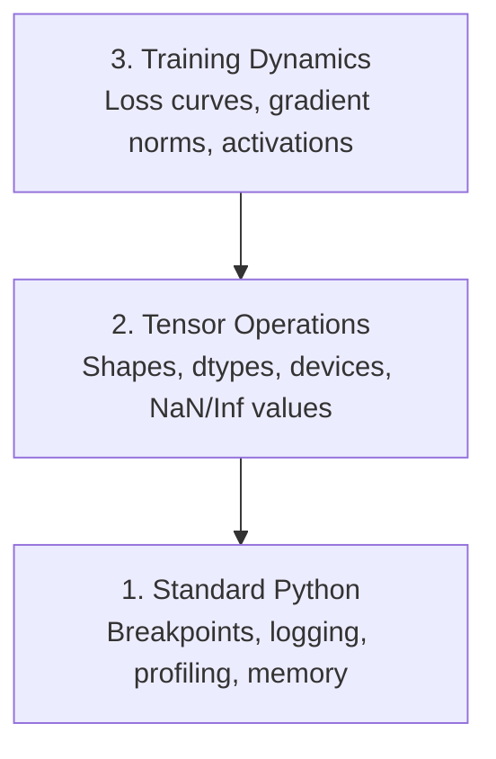

# 除錯與效能分析

> 最難搞的 AI bug 不會讓程式掛掉。它們安安靜靜地拿垃圾資料訓練，然後回報一條漂亮的損失曲線。

**類型：** 實作
**程式語言：** Python
**先修單元：** 階段 0 · 01（開發環境）、基本的 PyTorch 使用經驗
**時間：** 約 60 分鐘

## 學習目標

- 用條件式的 `breakpoint()` 與 `debug_print`，在訓練途中檢查張量的形狀、dtype 與 NaN
- 用 `cProfile`、`line_profiler` 與 `tracemalloc` 分析訓練迴圈，找出瓶頸
- 抓出常見的 AI bug：形狀不符、損失變成 NaN、資料洩漏、張量跑錯裝置
- 設定 TensorBoard，把損失曲線、權重直方圖與梯度分布視覺化

## 問題所在

AI 程式碼壞掉的方式跟一般程式碼不一樣。網頁應用出錯會噴一份堆疊追蹤；設定錯的訓練迴圈卻會乖乖跑 8 小時、燒掉 200 美元的 GPU 時數，最後產出一個不管輸入什麼都預測平均值的模型。程式從頭到尾沒有報錯。錯的是某個張量待在錯的裝置上、某處忘了 `.detach()`，或是標籤洩漏進了特徵裡。

你需要一些除錯工具，在這些無聲的失敗浪費掉你的時間與算力之前就把它們攔下來。

## 核心概念

AI 除錯分三個層次：



大多數人一上來就跳到第 3 層（盯著 TensorBoard 看）。但 AI 的 bug 有 80% 都住在第 1、2 層。

```figure
s0-flame-hot
```

## 動手實作

### 第 1 部分：用 print 除錯（沒錯，這招有用）

用 print 除錯常被看不起。其實不該。對張量程式碼來說，一句下對位置的 print 勝過一步步跟著除錯器走，因為你需要一次看到形狀、dtype 跟數值範圍。

```python
def debug_print(name, tensor):
    print(f"{name}: shape={tensor.shape}, dtype={tensor.dtype}, "
          f"device={tensor.device}, "
          f"min={tensor.min().item():.4f}, max={tensor.max().item():.4f}, "
          f"mean={tensor.mean().item():.4f}, "
          f"has_nan={tensor.isnan().any().item()}")
```

每做完一個可疑的運算就呼叫一次。抓到 bug 之後，把這些 print 拿掉。就這麼簡單。

### 第 2 部分：Python 除錯器（pdb 與 breakpoint）

內建的除錯器在 AI 工作上被嚴重低估。把 `breakpoint()` 丟進訓練迴圈，就能互動式地檢查張量。

```python
def training_step(model, batch, criterion, optimizer):
    inputs, labels = batch
    outputs = model(inputs)
    loss = criterion(outputs, labels)

    if loss.item() > 100 or torch.isnan(loss):
        breakpoint()

    loss.backward()
    optimizer.step()
```

除錯器停下來之後，這幾個指令很好用：

- `p outputs.shape` 檢查形狀
- `p loss.item()` 看損失值
- `p torch.isnan(outputs).sum()` 數 NaN 的數量
- `p model.fc1.weight.grad` 檢查梯度
- `c` 繼續執行，`q` 離開

這就是條件式除錯。只有在看起來不對的時候才停下來。對一次 10,000 步的訓練來說，這件事很關鍵。

### 第 3 部分：Python logging

當除錯不只是隨手看一眼的時候，就用 logging 取代 print。

```python
import logging

logging.basicConfig(
    level=logging.INFO,
    format="%(asctime)s [%(levelname)s] %(message)s",
    handlers=[
        logging.FileHandler("training.log"),
        logging.StreamHandler()
    ]
)
logger = logging.getLogger(__name__)

logger.info("Starting training: lr=%.4f, batch_size=%d", lr, batch_size)
logger.warning("Loss spike detected: %.4f at step %d", loss.item(), step)
logger.error("NaN loss at step %d, stopping", step)
```

logging 會給你時間戳記、嚴重程度分級，還能輸出到檔案。當一次訓練在凌晨三點掛掉時，你想要的是一份日誌檔，而不是早就滾出畫面的終端機輸出。

### 第 4 部分：為程式片段計時

知道時間花在哪裡，是最佳化的第一步。

```python
import time

class Timer:
    def __init__(self, name=""):
        self.name = name

    def __enter__(self):
        self.start = time.perf_counter()
        return self

    def __exit__(self, *args):
        elapsed = time.perf_counter() - self.start
        print(f"[{self.name}] {elapsed:.4f}s")

with Timer("data loading"):
    batch = next(dataloader_iter)

with Timer("forward pass"):
    outputs = model(batch)

with Timer("backward pass"):
    loss.backward()
```

常見的結論是：資料載入吃掉了 60% 的訓練時間。解法是在 DataLoader 裡設 `num_workers > 0`，不是換一張更快的 GPU。

### 第 5 部分：cProfile 與 line_profiler

當手動計時器不夠用的時候：

```bash
python -m cProfile -s cumtime train.py
```

這會列出每一個函式呼叫，並依累計時間排序。若要逐行分析：

```bash
pip install line_profiler
```

```python
@profile
def train_step(model, data, target):
    output = model(data)
    loss = F.cross_entropy(output, target)
    loss.backward()
    return loss

# Run with: kernprof -l -v train.py
```

### 第 6 部分：記憶體分析

#### 用 tracemalloc 看 CPU 記憶體

```python
import tracemalloc

tracemalloc.start()

# your code here
model = build_model()
data = load_dataset()

snapshot = tracemalloc.take_snapshot()
top_stats = snapshot.statistics("lineno")
for stat in top_stats[:10]:
    print(stat)
```

#### 用 memory_profiler 看 CPU 記憶體

```bash
pip install memory_profiler
```

```python
from memory_profiler import profile

@profile
def load_data():
    raw = read_csv("data.csv")       # watch memory jump here
    processed = preprocess(raw)       # and here
    return processed
```

用 `python -m memory_profiler your_script.py` 執行，就能看到逐行的記憶體用量。

#### 用 PyTorch 看 GPU 記憶體

```python
import torch

if torch.cuda.is_available():
    print(torch.cuda.memory_summary())

    print(f"Allocated: {torch.cuda.memory_allocated() / 1e9:.2f} GB")
    print(f"Cached: {torch.cuda.memory_reserved() / 1e9:.2f} GB")
```

當你遇到 OOM（Out of Memory）時：

1. 把批次大小調小（永遠是第一個該試的）
2. 用 `torch.cuda.empty_cache()` 釋放快取起來的記憶體
3. 對大型中間結果，先 `del tensor` 再 `torch.cuda.empty_cache()`
4. 用混合精度（`torch.cuda.amp`）把記憶體用量砍半
5. 對很深的模型使用梯度檢查點（gradient checkpointing）

### 第 7 部分：常見的 AI bug 與抓法

#### 形狀不符

最常見的 bug。模型預期 `[batch, channels, height, width]`，張量卻是 `[batch, features]`。

```python
def check_shapes(model, sample_input):
    print(f"Input: {sample_input.shape}")
    hooks = []

    def make_hook(name):
        def hook(module, inp, out):
            in_shape = inp[0].shape if isinstance(inp, tuple) else inp.shape
            out_shape = out.shape if hasattr(out, "shape") else type(out)
            print(f"  {name}: {in_shape} -> {out_shape}")
        return hook

    for name, module in model.named_modules():
        hooks.append(module.register_forward_hook(make_hook(name)))

    with torch.no_grad():
        model(sample_input)

    for h in hooks:
        h.remove()
```

拿一個樣本批次跑一次就好。它會把模型裡每一次形狀的變換都畫出來。

#### 損失變成 NaN

損失變成 NaN，代表有東西爆掉了。常見原因：

- 學習率太高
- 自訂損失函式裡除以零
- 對零或負數取 log
- RNN 裡的梯度爆炸

```python
def detect_nan(model, loss, step):
    if torch.isnan(loss):
        print(f"NaN loss at step {step}")
        for name, param in model.named_parameters():
            if param.grad is not None:
                if torch.isnan(param.grad).any():
                    print(f"  NaN gradient in {name}")
                if torch.isinf(param.grad).any():
                    print(f"  Inf gradient in {name}")
        return True
    return False
```

#### 資料洩漏

你的模型在測試集上拿到 99% 準確率。聽起來很棒。這是個 bug。

```python
def check_data_leakage(train_set, test_set, id_column="id"):
    train_ids = set(train_set[id_column].tolist())
    test_ids = set(test_set[id_column].tolist())
    overlap = train_ids & test_ids
    if overlap:
        print(f"DATA LEAKAGE: {len(overlap)} samples in both train and test")
        return True
    return False
```

也要檢查時間上的洩漏：拿未來的資料去預測過去。切分之前先依時間戳記排序。

#### 裝置錯了

張量分散在不同裝置（CPU 與 GPU）會導致執行期錯誤。但有時候某個張量就這麼無聲無息地留在 CPU 上，其他東西都在 GPU 上，訓練只是變得很慢而已。

```python
def check_devices(model, *tensors):
    model_device = next(model.parameters()).device
    print(f"Model device: {model_device}")
    for i, t in enumerate(tensors):
        if t.device != model_device:
            print(f"  WARNING: tensor {i} on {t.device}, model on {model_device}")
```

### 第 8 部分：TensorBoard 基礎

TensorBoard 讓你看見訓練過程中內部發生了什麼事。

```bash
pip install tensorboard
```

```python
from torch.utils.tensorboard import SummaryWriter

writer = SummaryWriter("runs/experiment_1")

for step in range(num_steps):
    loss = train_step(model, batch)

    writer.add_scalar("loss/train", loss.item(), step)
    writer.add_scalar("lr", optimizer.param_groups[0]["lr"], step)

    if step % 100 == 0:
        for name, param in model.named_parameters():
            writer.add_histogram(f"weights/{name}", param, step)
            if param.grad is not None:
                writer.add_histogram(f"grads/{name}", param.grad, step)

writer.close()
```

啟動它：

```bash
tensorboard --logdir=runs
```

該看什麼：

- **損失不下降**：學習率太低，或是模型架構有問題
- **損失劇烈震盪**：學習率太高
- **損失變成 NaN**：數值不穩定（見上面的 NaN 那節）
- **訓練損失下降、驗證損失上升**：過度擬合
- **權重直方圖塌向零**：梯度消失
- **梯度直方圖爆開**：需要做梯度裁剪

### 第 9 部分：VS Code 除錯器

若要做互動式除錯，用一份 `launch.json` 設定 VS Code：

```json
{
    "version": "0.2.0",
    "configurations": [
        {
            "name": "Debug Training",
            "type": "debugpy",
            "request": "launch",
            "program": "${file}",
            "console": "integratedTerminal",
            "justMyCode": false
        }
    ]
}
```

點行號旁的空白處設中斷點。用 Variables 面板檢查張量的各種屬性。Debug Console 讓你在程式執行中途執行任意 Python 運算式。

要一步步走過資料前處理流程、想看清每一次轉換的結果時，這特別好用。

## 框架應用

以下這套除錯流程，抓得到大部分的 AI bug：

1. **訓練之前**：拿一個樣本批次跑 `check_shapes`。確認輸入與輸出的維度符合預期。
2. **前 10 步**：對損失、輸出與梯度用 `debug_print`。確認沒有 NaN，數值也都在合理範圍。
3. **訓練期間**：記錄損失、學習率與梯度範數。用 TensorBoard 做視覺化。
4. **出問題的時候**：在出錯的地方放 `breakpoint()`。互動式地檢查張量。
5. **調效能時**：分別為資料載入、前向傳播與反向傳播計時。快撞到 OOM 就順手做記憶體分析。

## 產出交付

執行除錯工具包腳本：

```bash
python phases/00-setup-and-tooling/12-debugging-and-profiling/code/debug_tools.py
```

`outputs/prompt-debug-ai-code.md` 是一段提示詞，能幫你診斷 AI 特有的 bug。

## 練習

1. 執行 `debug_tools.py`，把每一節的輸出讀過一遍。改一下那個假模型，讓它產生 NaN（提示：在前向傳播裡除以零），看偵測器怎麼抓到它。
2. 用 `cProfile` 分析一個訓練迴圈，找出最慢的函式。
3. 用 `tracemalloc` 找出你的資料載入流程裡，哪一行配置了最多記憶體。
4. 為一次簡單的訓練設定 TensorBoard，判斷模型有沒有過度擬合。
5. 在訓練迴圈裡用 `breakpoint()`。練習從除錯器的提示符檢查張量的形狀、裝置與梯度值。
