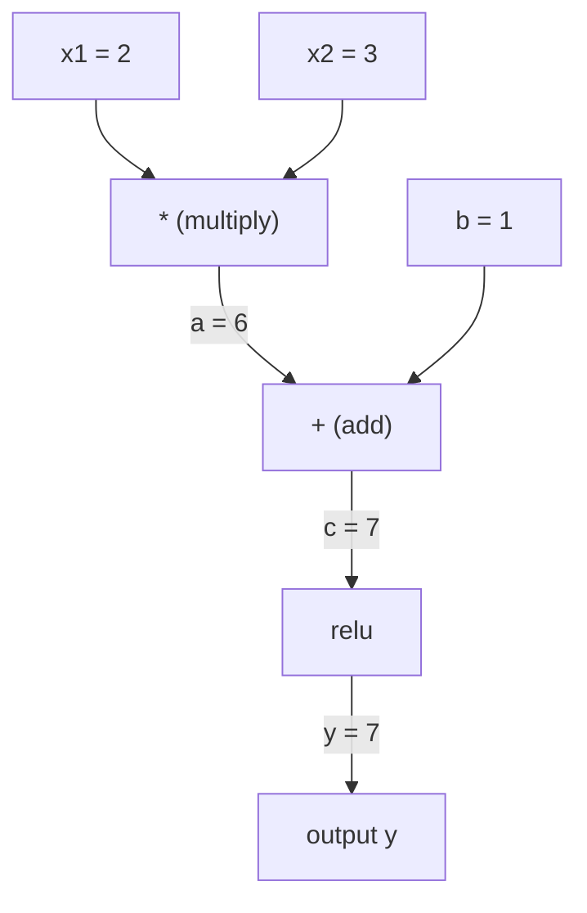
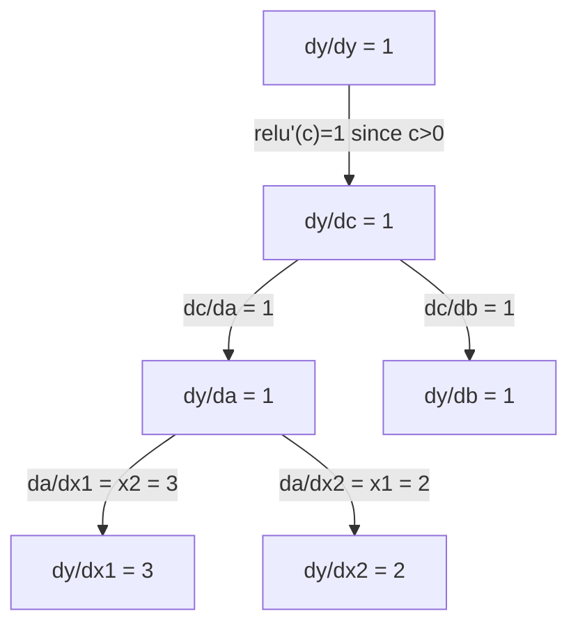

# 連鎖律與自動微分

> 連鎖律是每一個會學習的神經網路背後的引擎。

**類型：** 實作
**程式語言：** Python
**先修單元：** 階段 1 · 04（導數與梯度）
**時間：** 約 90 分鐘

## 學習目標

- 打造一個最小的自動微分引擎（Value 類別），它會記錄運算並用反向模式自動微分算出梯度
- 用拓撲排序在計算圖上實作前向傳播與反向傳遞
- 只用這個從零打造的自動微分引擎，建立並訓練一個多層感知器來學 XOR
- 用梯度檢查對照數值有限差分，驗證自動微分的正確性

## 問題所在

你會算簡單函式的導數。但神經網路不是簡單函式。它是好幾百個函式合成起來的東西：矩陣乘法、加偏差項、套激活函式、再一次矩陣乘法、softmax、交叉熵損失。輸出是函式的函式的函式。

要訓練這個網路，你需要損失對每一個權重的梯度。幾百萬個參數，用手算是不可能的。用數值方法算（有限差分）又太慢。

連鎖律給你數學，自動微分給你演算法。兩者合起來，讓你能對任意函式合成算出精確的梯度，而所花的時間只跟一次前向傳播成正比。

PyTorch、TensorFlow 與 JAX 就是這樣運作的。你要從零打造一個迷你版。

## 核心概念

### 連鎖律

若 `y = f(g(x))`，則 `y` 對 `x` 的導數是：

```
dy/dx = dy/dg * dg/dx = f'(g(x)) * g'(x)
```

把鏈上的導數一路乘起來。每一個環節都貢獻它自己的局部導數。

例子：`y = sin(x^2)`

```
g(x) = x^2       g'(x) = 2x
f(g) = sin(g)     f'(g) = cos(g)

dy/dx = cos(x^2) * 2x
```

合成更深時，這條鏈就繼續延伸：

```
y = f(g(h(x)))

dy/dx = f'(g(h(x))) * g'(h(x)) * h'(x)
```

神經網路的每一層，都是這條鏈上的一個環節。

### 計算圖

計算圖讓連鎖律看得見。每個運算變成一個節點。資料沿著圖往前流，梯度往後流。

**前向傳播（算出數值）：**



**反向傳遞（算出梯度）：**



反向傳遞在每個節點套用連鎖律，把梯度從輸出一路傳回輸入。

### 正向模式與反向模式

在一張圖上套用連鎖律有兩種方向。

**正向模式**從輸入出發，把導數往前推。它從 `dx/dx = 1` 開始，經過每個運算往下傳。當你的輸入少、輸出多時，這種做法比較好。

```
Forward mode: seed dx/dx = 1, propagate forward

  x = 2       (dx/dx = 1)
  a = x^2     (da/dx = 2x = 4)
  y = sin(a)  (dy/dx = cos(a) * da/dx = cos(4) * 4 = -2.615)
```

**反向模式**從輸出出發，把梯度往回拉。它從 `dy/dy = 1` 開始，反向經過每個運算往回傳。當你的輸入多、輸出少時，這種做法比較好。

```
Reverse mode: seed dy/dy = 1, propagate backward

  y = sin(a)  (dy/dy = 1)
  a = x^2     (dy/da = cos(a) = cos(4) = -0.654)
  x = 2       (dy/dx = dy/da * da/dx = -0.654 * 4 = -2.615)
```

神經網路有幾百萬個輸入（權重），只有一個輸出（損失）。反向模式用一次反向傳遞就算出所有梯度。這就是反向傳播採用反向模式的原因。

| 模式 | 起始種子 | 方向 | 什麼時候最適合 |
|------|------|-----------|-----------|
| 正向 | `dx_i/dx_i = 1` | 輸入到輸出 | 輸入少、輸出多 |
| 反向 | `dy/dy = 1` | 輸出到輸入 | 輸入多、輸出少（神經網路） |

### 用雙數實作正向模式

正向模式可以用雙數很漂亮地實作出來。雙數的形式是 `a + b*epsilon`，其中 `epsilon^2 = 0`。

```
Dual number: (value, derivative)

(2, 1) means: value is 2, derivative w.r.t. x is 1

Arithmetic rules:
  (a, a') + (b, b') = (a+b, a'+b')
  (a, a') * (b, b') = (a*b, a'*b + a*b')
  sin(a, a')         = (sin(a), cos(a)*a')
```

把輸入變數的導數設為 1 當起始種子，導數就會自動穿過每一個運算傳下去。

### 打造一個自動微分引擎

一個自動微分引擎需要三樣東西：

1. **包裝數值。** 把每個數字包進一個物件裡，這個物件同時存住它的值與梯度。
2. **記錄計算圖。** 每個運算都記下自己的輸入，以及計算局部梯度的函式。
3. **反向傳遞。** 對圖做拓撲排序，然後反向走一遍，在每個節點套用連鎖律。

PyTorch 的 `autograd` 做的就是這件事。`torch.Tensor` 類別包裝數值，在 `requires_grad=True` 時記錄運算，並在你呼叫 `.backward()` 時算出梯度。

### PyTorch Autograd 的底層運作

當你寫下這樣的 PyTorch 程式碼：

```python
x = torch.tensor(2.0, requires_grad=True)
y = x ** 2 + 3 * x + 1
y.backward()
print(x.grad)  # 7.0 = 2*x + 3 = 2*2 + 3
```

PyTorch 在內部做的事是：

1. 為 `x` 建立一個 `requires_grad=True` 的 `Tensor` 節點
2. 每個運算（`**`、`*`、`+`）都建立一個新節點，並記下對應的反向函式
3. `y.backward()` 觸發反向模式自動微分，走過整張記錄下來的圖
4. 每個節點的 `grad_fn` 算出局部梯度，再傳給上游節點
5. 梯度以相加的方式（而不是取代）累積到 `.grad` 屬性上

這張圖是動態的（define-by-run）。每次前向傳播都重新建一張新圖。這就是 PyTorch 能在模型裡支援控制流程（if/else、迴圈）的原因。

```figure
chain-rule
```

## 動手實作

### 步驟 1：Value 類別

```python
class Value:
    def __init__(self, data, children=(), op=''):
        self.data = data
        self.grad = 0.0
        self._backward = lambda: None
        self._prev = set(children)
        self._op = op

    def __repr__(self):
        return f"Value(data={self.data:.4f}, grad={self.grad:.4f})"
```

每個 `Value` 存住自己的數值、梯度（初始為零）、一個反向函式，以及指向產生它的子節點的指標。

### 步驟 2：帶梯度追蹤的算術運算

```python
    def __add__(self, other):
        other = other if isinstance(other, Value) else Value(other)
        out = Value(self.data + other.data, (self, other), '+')
        def _backward():
            self.grad += out.grad
            other.grad += out.grad
        out._backward = _backward
        return out

    def __mul__(self, other):
        other = other if isinstance(other, Value) else Value(other)
        out = Value(self.data * other.data, (self, other), '*')
        def _backward():
            self.grad += other.data * out.grad
            other.grad += self.data * out.grad
        out._backward = _backward
        return out

    def relu(self):
        out = Value(max(0, self.data), (self,), 'relu')
        def _backward():
            self.grad += (1.0 if out.data > 0 else 0.0) * out.grad
        out._backward = _backward
        return out
```

每個運算都建立一個閉包，這個閉包知道怎麼算局部梯度，並把它乘上上游梯度（`out.grad`）。用 `+=` 是為了處理同一個值被用在多個運算裡的情況。

### 步驟 3：反向傳遞

```python
    def backward(self):
        topo = []
        visited = set()
        def build_topo(v):
            if v not in visited:
                visited.add(v)
                for child in v._prev:
                    build_topo(child)
                topo.append(v)
        build_topo(self)

        self.grad = 1.0
        for v in reversed(topo):
            v._backward()
```

拓撲排序保證每個節點的梯度都完全算好之後，才往它的子節點傳下去。起始種子梯度是 1.0（dy/dy = 1）。

### 步驟 4：讓引擎完整所需的更多運算

基本的 Value 類別只處理加法、乘法與 relu。真正的自動微分引擎需要更多。以下是打造神經網路會用到的運算：

```python
    def __neg__(self):
        return self * -1

    def __sub__(self, other):
        return self + (-other)

    def __radd__(self, other):
        return self + other

    def __rmul__(self, other):
        return self * other

    def __rsub__(self, other):
        return other + (-self)

    def __pow__(self, n):
        out = Value(self.data ** n, (self,), f'**{n}')
        def _backward():
            self.grad += n * (self.data ** (n - 1)) * out.grad
        out._backward = _backward
        return out

    def __truediv__(self, other):
        return self * (other ** -1) if isinstance(other, Value) else self * (Value(other) ** -1)

    def exp(self):
        import math
        e = math.exp(self.data)
        out = Value(e, (self,), 'exp')
        def _backward():
            self.grad += e * out.grad
        out._backward = _backward
        return out

    def log(self):
        import math
        out = Value(math.log(self.data), (self,), 'log')
        def _backward():
            self.grad += (1.0 / self.data) * out.grad
        out._backward = _backward
        return out

    def tanh(self):
        import math
        t = math.tanh(self.data)
        out = Value(t, (self,), 'tanh')
        def _backward():
            self.grad += (1 - t ** 2) * out.grad
        out._backward = _backward
        return out
```

**每個運算為什麼重要：**

| 運算 | 反向規則 | 用在哪裡 |
|-----------|--------------|---------|
| `__sub__` | 重用 add + neg | 損失計算（pred - target） |
| `__pow__` | n * x^(n-1) | 多項式激活函式、MSE（error^2） |
| `__truediv__` | 重用 mul + pow(-1) | 正規化、學習率縮放 |
| `exp` | exp(x) * 上游梯度 | Softmax、對數似然 |
| `log` | (1/x) * 上游梯度 | 交叉熵損失、對數機率 |
| `tanh` | (1 - tanh^2) * 上游梯度 | 經典的激活函式 |

聰明的地方在於：`__sub__` 與 `__truediv__` 是用既有運算定義出來的。它們不必額外寫反向規則就有正確的梯度，因為連鎖律會穿過底層的 add／mul／pow 自動合成。

### 步驟 5：從零打造迷你 MLP

有了完整的 Value 類別，你就能打造一個神經網路。不用 PyTorch，不用 NumPy。只要 Value 和連鎖律。

```python
import random

class Neuron:
    def __init__(self, n_inputs):
        self.w = [Value(random.uniform(-1, 1)) for _ in range(n_inputs)]
        self.b = Value(0.0)

    def __call__(self, x):
        act = sum((wi * xi for wi, xi in zip(self.w, x)), self.b)
        return act.tanh()

    def parameters(self):
        return self.w + [self.b]

class Layer:
    def __init__(self, n_inputs, n_outputs):
        self.neurons = [Neuron(n_inputs) for _ in range(n_outputs)]

    def __call__(self, x):
        return [n(x) for n in self.neurons]

    def parameters(self):
        return [p for n in self.neurons for p in n.parameters()]

class MLP:
    def __init__(self, sizes):
        self.layers = [Layer(sizes[i], sizes[i+1]) for i in range(len(sizes)-1)]

    def __call__(self, x):
        for layer in self.layers:
            x = layer(x)
        return x[0] if len(x) == 1 else x

    def parameters(self):
        return [p for layer in self.layers for p in layer.parameters()]
```

一個 `Neuron` 算的是 `tanh(w1*x1 + w2*x2 + ... + b)`。一個 `Layer` 是一串神經元。一個 `MLP` 把層疊起來。每個權重都是一個 `Value`，所以呼叫 `loss.backward()` 就會把梯度傳到每一個參數上。

**訓練 XOR：**

```python
random.seed(42)
model = MLP([2, 4, 1])  # 2 inputs, 4 hidden neurons, 1 output

xs = [[0, 0], [0, 1], [1, 0], [1, 1]]
ys = [-1, 1, 1, -1]  # XOR pattern (using -1/1 for tanh)

for step in range(100):
    preds = [model(x) for x in xs]
    loss = sum((p - y) ** 2 for p, y in zip(preds, ys))

    for p in model.parameters():
        p.grad = 0.0
    loss.backward()

    lr = 0.05
    for p in model.parameters():
        p.data -= lr * p.grad

    if step % 20 == 0:
        print(f"step {step:3d}  loss = {loss.data:.4f}")

print("\nPredictions after training:")
for x, y in zip(xs, ys):
    print(f"  input={x}  target={y:2d}  pred={model(x).data:6.3f}")
```

這就是 micrograd。一個完整的神經網路訓練迴圈，純 Python 加上自動微分。每一套商業級的深度學習框架，做的都是同一件事，只是規模大得多。

### 步驟 6：梯度檢查

你怎麼知道自己的自動微分是對的？拿它跟數值導數比較。這就是梯度檢查。

```python
def gradient_check(build_expr, x_val, h=1e-7):
    x = Value(x_val)
    y = build_expr(x)
    y.backward()
    autodiff_grad = x.grad

    y_plus = build_expr(Value(x_val + h)).data
    y_minus = build_expr(Value(x_val - h)).data
    numerical_grad = (y_plus - y_minus) / (2 * h)

    diff = abs(autodiff_grad - numerical_grad)
    return autodiff_grad, numerical_grad, diff
```

拿一個複雜的表達式來測：

```python
def expr(x):
    return (x ** 3 + x * 2 + 1).tanh()

ad, num, diff = gradient_check(expr, 0.5)
print(f"Autodiff:  {ad:.8f}")
print(f"Numerical: {num:.8f}")
print(f"Difference: {diff:.2e}")
# Difference should be < 1e-5
```

實作新運算時，梯度檢查是必備的。如果你的反向傳遞有 bug，數值檢查會抓到它。每一份認真的深度學習實作，在開發期間都會跑梯度檢查。

**什麼時候該做梯度檢查：**

| 情況 | 要做梯度檢查嗎？ |
|-----------|-------------------|
| 為自動微分引擎新增一個運算 | 要，一定要 |
| 除錯一個訓練不收斂的訓練迴圈 | 要，先檢查梯度 |
| 正式訓練 | 不要，太慢（每個參數要多跑兩次前向傳播） |
| 自動微分程式碼的單元測試 | 要，而且要自動化 |

### 步驟 7：對照手算結果驗證

```python
x1 = Value(2.0)
x2 = Value(3.0)
a = x1 * x2          # a = 6.0
b = a + Value(1.0)    # b = 7.0
y = b.relu()          # y = 7.0

y.backward()

print(f"y = {y.data}")          # 7.0
print(f"dy/dx1 = {x1.grad}")   # 3.0 (= x2)
print(f"dy/dx2 = {x2.grad}")   # 2.0 (= x1)
```

手算檢查：`y = relu(x1*x2 + 1)`。因為 `x1*x2 + 1 = 7 > 0`，relu 相當於恆等函式。
`dy/dx1 = x2 = 3`、`dy/dx2 = x1 = 2`。引擎的結果吻合。

## 框架應用

### 對照 PyTorch 驗證

```python
import torch

x1 = torch.tensor(2.0, requires_grad=True)
x2 = torch.tensor(3.0, requires_grad=True)
a = x1 * x2
b = a + 1.0
y = torch.relu(b)
y.backward()

print(f"PyTorch dy/dx1 = {x1.grad.item()}")  # 3.0
print(f"PyTorch dy/dx2 = {x2.grad.item()}")  # 2.0
```

梯度一樣。你的引擎算出跟 PyTorch 相同的結果，因為背後的數學相同：用連鎖律做反向模式自動微分。

### 一個更複雜的表達式

```python
a = Value(2.0)
b = Value(-3.0)
c = Value(10.0)
f = (a * b + c).relu()  # relu(2*(-3) + 10) = relu(4) = 4

f.backward()
print(f"df/da = {a.grad}")  # -3.0 (= b)
print(f"df/db = {b.grad}")  #  2.0 (= a)
print(f"df/dc = {c.grad}")  #  1.0
```

## 產出交付

本單元會產出：
- `outputs/skill-autodiff.md` —— 一項技能，用來打造與除錯自動微分系統
- `code/autodiff.py` —— 一個你可以繼續擴充的最小自動微分引擎

這裡打造的 Value 類別，是階段 3 神經網路訓練迴圈的基礎。

## 練習

1. 為 Value 類別加上 `__pow__`，讓你能算 `x ** n`。驗證 `d/dx(x^3)` 在 `x=2` 時等於 `12.0`。

2. 加上 `tanh` 當激活函式。驗證 `tanh'(0) = 1`、`tanh'(2) = 0.0707`（近似值）。

3. 為單一神經元建一張計算圖：`y = relu(w1*x1 + w2*x2 + b)`。算出全部五個梯度，並對照 PyTorch 驗證。

4. 用雙數實作正向模式自動微分。寫一個 `Dual` 類別，驗證它算出的導數跟你的反向模式引擎一致。

## 關鍵術語

| 術語 | 大家怎麼說 | 實際上是什麼 |
|------|----------------|----------------------|
| 連鎖律 | 「把導數乘起來」 | 合成函式的導數等於各函式局部導數的乘積，且每個都要在正確的點上取值 |
| 計算圖 | 「那張網路圖」 | 一張有向無環圖，節點是運算，邊上帶著數值（正向）或梯度（反向） |
| 正向模式 | 「把導數往前推」 | 把導數從輸入傳到輸出的自動微分。每個輸入變數要跑一次。 |
| 反向模式 | 「反向傳播」 | 把梯度從輸出傳到輸入的自動微分。每個輸出變數要跑一次。 |
| Autograd | 「自動算梯度」 | 一套會記錄數值上的運算、建出計算圖，並用連鎖律算出精確梯度的系統 |
| 雙數 | 「值再加上導數」 | 形式為 a + b*epsilon（epsilon^2 = 0）的數，能在算術運算中一路攜帶導數資訊 |
| 拓撲排序 | 「依相依順序排」 | 把圖的節點排成每個節點都在它所有相依項之後。正確傳遞梯度的必要條件。 |
| 梯度累積 | 「相加，不是取代」 | 當一個值被餵進多個運算時，它的梯度是所有流進來的梯度貢獻之總和 |
| 動態圖 | 「define by run」 | 每次前向傳播都重建一次的計算圖，讓模型裡可以寫 Python 控制流程（PyTorch 的風格） |
| 梯度檢查 | 「數值驗證」 | 拿自動微分的梯度跟數值有限差分的梯度比較，以驗證正確性。除錯時不可或缺。 |
| MLP | 「多層感知器」 | 一個帶有一層或多層隱藏神經元的神經網路。每個神經元算加權和加偏差項，再套一個激活函式。 |
| 神經元 | 「加權和 + 激活」 | 最基本的單位：output = activation(w1*x1 + w2*x2 + ... + b)。權重與偏差項是可學習的參數。 |

## 延伸閱讀

- [3Blue1Brown: Backpropagation calculus](https://www.youtube.com/watch?v=tIeHLnjs5U8) —— 用視覺方式解釋神經網路裡的連鎖律
- [PyTorch Autograd mechanics](https://pytorch.org/docs/stable/notes/autograd.html) —— 真實系統是怎麼運作的
- [Baydin et al., Automatic Differentiation in Machine Learning: a Survey](https://arxiv.org/abs/1502.05767) —— 完整的參考文獻
