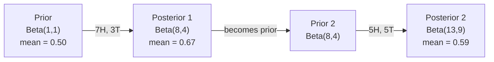

# 貝氏定理

> 機率講的是你預期什麼。貝氏定理講的是你學到了什麼。

**類型：** 實作
**程式語言：** Python
**先修單元：** 階段 1 · 單元 06（機率基礎）
**時間：** 約 75 分鐘

## 學習目標

- 運用貝氏定理，從先驗、概似與證據算出後驗機率
- 從零打造一個單純貝氏文本分類器，加上 拉普拉斯平滑與對數空間計算
- 比較 MLE 與 MAP 估計，並說明 MAP 為什麼等同於 L2 正則化
- 用 Beta-Binomial 共軛先驗實作序列式貝氏更新，應用在 A/B 測試上

## 問題所在

某個醫學檢驗的準確率是 99%。你的檢驗結果是陽性。你真的得病的機率有多少？

大多數人會說 99%。真正的答案取決於這個病有多罕見。如果每 10,000 人只有 1 人得病，那麼陽性結果只代表你大約有 1% 的機率生病。其餘 99% 的陽性結果，都是來自健康人的假警報。

這不是什麼腦筋急轉彎。這就是貝氏定理。每一個垃圾郵件過濾器、每一項醫學診斷、每一個會量化不確定性的機器學習模型，用的都是完全相同的推理。你先有一個信念，看到證據，然後更新。

如果你在不懂這件事的情況下打造 ML 系統，你會誤讀模型輸出、設出爛的閾值，並交付過度自信的預測。

## 核心概念

### 從聯合機率到貝氏

你在單元 06 已經知道條件機率是：

```
P(A|B) = P(A and B) / P(B)
```

對稱地也有：

```
P(B|A) = P(A and B) / P(A)
```

兩個式子共用同一個分子：P(A and B)。把它們畫上等號再整理一下：

```
P(A and B) = P(A|B) * P(B) = P(B|A) * P(A)

Therefore:

P(A|B) = P(B|A) * P(A) / P(B)
```

這就是貝氏定理。四個量，一條式子。

### 四個組成部分

| 組成 | 名稱 | 意思是什麼 |
|------|------|---------------|
| P(A\|B) | 後驗 | 看到證據 B 之後，你對 A 更新後的信念 |
| P(B\|A) | 概似 | 如果 A 為真，證據 B 出現的機率有多高 |
| P(A) | 先驗 | 在看到任何證據之前，你對 A 的信念 |
| P(B) | 證據 | 在所有可能性之下，看到 B 的總機率 |

證據項 P(B) 的作用是正規化因子。你可以用全機率定律把它展開：

```
P(B) = P(B|A) * P(A) + P(B|not A) * P(not A)
```

### 醫學檢驗的例子

某疾病每 10,000 人影響 1 人。檢驗準確率為 99%（能揪出 99% 的病人，並有 1% 的機率給出偽陽性）。

```
P(sick)          = 0.0001     (prior: disease is rare)
P(positive|sick) = 0.99       (likelihood: test catches it)
P(positive|healthy) = 0.01    (false positive rate)

P(positive) = P(positive|sick) * P(sick) + P(positive|healthy) * P(healthy)
            = 0.99 * 0.0001 + 0.01 * 0.9999
            = 0.000099 + 0.009999
            = 0.010098

P(sick|positive) = P(positive|sick) * P(sick) / P(positive)
                 = 0.99 * 0.0001 / 0.010098
                 = 0.0098
                 = 0.98%
```

不到 1%。先驗完全主導了結果。當一個狀況很罕見時，就算檢驗很準，產出的陽性結果也大多是偽陽性。這就是醫生為什麼要再開一次確認檢驗。

### 垃圾郵件過濾器的例子

你收到一封含有「lottery」這個字的郵件。它是垃圾郵件嗎？

```
P(spam)                = 0.3      (30% of email is spam)
P("lottery"|spam)      = 0.05     (5% of spam emails contain "lottery")
P("lottery"|not spam)  = 0.001    (0.1% of legitimate emails contain "lottery")

P("lottery") = 0.05 * 0.3 + 0.001 * 0.7
             = 0.015 + 0.0007
             = 0.0157

P(spam|"lottery") = 0.05 * 0.3 / 0.0157
                  = 0.955
                  = 95.5%
```

一個字就把機率從 30% 推到 95.5%。真正的垃圾郵件過濾器會同時對數百個字套用貝氏定理。

### 單純貝氏：獨立假設

單純貝氏把這套做法推廣到多個特徵上，方法是假設在給定類別的條件下，所有特徵都彼此條件獨立：

```
P(class | feature_1, feature_2, ..., feature_n)
  = P(class) * P(feature_1|class) * P(feature_2|class) * ... * P(feature_n|class)
    / P(feature_1, feature_2, ..., feature_n)
```

「樸素」指的就是這個獨立假設。在文本裡，詞的出現並不獨立（「New」跟「York」是相關的）。但這個假設在實務上出乎意料地好用，因為分類器只需要把各類別排出高低，不需要產出校準過的機率。

既然分母對所有類別都一樣，你可以直接略過它，只比較分子：

```
score(class) = P(class) * product of P(feature_i | class)
```

挑分數最高的那個類別。

### 最大概似估計（MLE）

你要怎麼從訓練資料得到 P(feature|class)？數次數。

```
P("free"|spam) = (number of spam emails containing "free") / (total spam emails)
```

這就是 MLE：選出讓觀測資料最有可能出現的參數值。你在最大化概似函式，而對離散計數來說，它就化簡成相對頻率。

問題來了：如果某個字在訓練時從未出現在垃圾郵件裡，MLE 會給它機率零。一個沒見過的字就會把整個乘積歸零。用 拉普拉斯平滑來修：

```
P(word|class) = (count(word, class) + 1) / (total_words_in_class + vocabulary_size)
```

給每個計數都加 1，就能保證機率永遠不會是零。

### 最大後驗（MAP）

MLE 問的是：哪些參數能最大化 P(data|parameters)？

MAP 問的是：哪些參數能最大化 P(parameters|data)？

根據貝氏定理：

```
P(parameters|data) proportional to P(data|parameters) * P(parameters)
```

MAP 對參數本身加上了一個先驗。如果你認為參數應該要小，就把這個想法編碼成一個懲罰大數值的先驗。這跟 ML 裡的 L2 正則化是同一件事。ridge 回歸裡的「ridge」懲罰項，字面上就是權重上的高斯先驗。

| 估計方法 | 最佳化的對象 | ML 中的對應 |
|------------|-----------|---------------|
| MLE | P(data\|params) | 沒有正則化的訓練 |
| MAP | P(data\|params) * P(params) | L2／L1 正則化 |

### 貝氏派 vs 頻率派：實務上的差別

頻率派把參數當成固定但未知的值。他們問的是：「如果我把這個實驗重複很多次，會發生什麼？」

貝氏派把參數當成分布。他們問的是：「以我已經觀測到的東西來看，我對參數的信念是什麼？」

對打造 ML 系統來說，實務上的差別是：

| 面向 | 頻率派 | 貝氏派 |
|--------|-------------|----------|
| 輸出 | 點估計 | 數值上的一個分布 |
| 不確定性 | 信賴區間（關於程序） | 可信區間（關於參數） |
| 小資料 | 可能過度擬合 | 先驗起到正則化的作用 |
| 計算 | 通常較快 | 常常需要取樣（MCMC） |

大部分生產環境的 ML 都是頻率派的（SGD、點估計）。當你需要校準過的不確定性（醫療決策、安全關鍵系統），或資料很稀少時（few-shot learning、冷啟動），貝氏方法才會發光。

### 為什麼貝氏思考對 ML 很重要

這個關聯比類比更深：

**先驗就是正則化。** 權重上的高斯先驗就是 L2 正則化，Laplace 先驗就是 L1。每次你加上一個正則化項，你就是在對「你預期參數會是什麼數值」做一個貝氏陳述。

**後驗就是不確定性。** 單一個預測機率完全說不出模型對這個估計有多少信心。貝氏方法給你的是一個分布：「我認為 P(spam) 落在 0.8 到 0.95 之間。」

**貝氏更新就是線上學習。** 今天的後驗會變成明天的先驗。當模型看到新資料時，它會逐步更新自己的信念，而不是從頭重新訓練。

**模型比較是貝氏的。** 貝氏資訊量準則（BIC）、邊際概似與貝氏因子，全都用貝氏推理在模型之間做選擇，同時避免過度擬合。

```figure
bayes-update
```

## 動手實作

### 步驟 1：貝氏定理函式

```python
def bayes(prior, likelihood, false_positive_rate):
    evidence = likelihood * prior + false_positive_rate * (1 - prior)
    posterior = likelihood * prior / evidence
    return posterior

result = bayes(prior=0.0001, likelihood=0.99, false_positive_rate=0.01)
print(f"P(sick|positive) = {result:.4f}")
```

### 步驟 2：單純貝氏分類器

```python
import math
from collections import defaultdict

class NaiveBayes:
    def __init__(self, smoothing=1.0):
        self.smoothing = smoothing
        self.class_counts = defaultdict(int)
        self.word_counts = defaultdict(lambda: defaultdict(int))
        self.class_word_totals = defaultdict(int)
        self.vocab = set()

    def train(self, documents, labels):
        for doc, label in zip(documents, labels):
            self.class_counts[label] += 1
            words = doc.lower().split()
            for word in words:
                self.word_counts[label][word] += 1
                self.class_word_totals[label] += 1
                self.vocab.add(word)

    def predict(self, document):
        words = document.lower().split()
        total_docs = sum(self.class_counts.values())
        vocab_size = len(self.vocab)
        best_class = None
        best_score = float("-inf")
        for cls in self.class_counts:
            score = math.log(self.class_counts[cls] / total_docs)
            for word in words:
                count = self.word_counts[cls].get(word, 0)
                total = self.class_word_totals[cls]
                score += math.log((count + self.smoothing) / (total + self.smoothing * vocab_size))
            if score > best_score:
                best_score = score
                best_class = cls
        return best_class
```

對數機率可以避免下溢。把很多個很小的機率乘在一起，得到的數字會小到浮點數表示不了。把對數機率相加則數值穩定，而且數學上完全等價。

### 步驟 3：用垃圾郵件資料訓練

```python
train_docs = [
    "win free money now",
    "free lottery ticket winner",
    "claim your prize today free",
    "urgent offer free cash",
    "congratulations you won free",
    "meeting tomorrow at noon",
    "project update attached",
    "can we schedule a call",
    "quarterly report review",
    "lunch on thursday sounds good",
    "team standup notes attached",
    "please review the pull request",
]

train_labels = [
    "spam", "spam", "spam", "spam", "spam",
    "ham", "ham", "ham", "ham", "ham", "ham", "ham",
]

classifier = NaiveBayes()
classifier.train(train_docs, train_labels)

test_messages = [
    "free money waiting for you",
    "meeting rescheduled to friday",
    "you won a free prize",
    "please review the attached report",
]

for msg in test_messages:
    print(f"  '{msg}' -> {classifier.predict(msg)}")
```

### 步驟 4：檢視學到的機率

```python
def show_top_words(classifier, cls, n=5):
    vocab_size = len(classifier.vocab)
    total = classifier.class_word_totals[cls]
    probs = {}
    for word in classifier.vocab:
        count = classifier.word_counts[cls].get(word, 0)
        probs[word] = (count + classifier.smoothing) / (total + classifier.smoothing * vocab_size)
    sorted_words = sorted(probs.items(), key=lambda x: x[1], reverse=True)
    for word, prob in sorted_words[:n]:
        print(f"    {word}: {prob:.4f}")

print("\nTop spam words:")
show_top_words(classifier, "spam")
print("\nTop ham words:")
show_top_words(classifier, "ham")
```

## 框架應用

Scikit-learn 內建了可直接上生產環境的單純貝氏實作：

```python
from sklearn.feature_extraction.text import CountVectorizer
from sklearn.naive_bayes import MultinomialNB
from sklearn.metrics import classification_report

vectorizer = CountVectorizer()
X_train = vectorizer.fit_transform(train_docs)
clf = MultinomialNB()
clf.fit(X_train, train_labels)

X_test = vectorizer.transform(test_messages)
predictions = clf.predict(X_test)
for msg, pred in zip(test_messages, predictions):
    print(f"  '{msg}' -> {pred}")
```

同一個演算法。CountVectorizer 負責分詞與建立詞彙表，MultinomialNB 在內部處理平滑與對數機率。你從零寫的那個版本，用 40 行做的是同一件事。

## 產出交付

這裡打造的 NaiveBayes 類別展示了完整流程：分詞、用 拉普拉斯平滑做機率估計、在對數空間做預測。`code/bayes.py` 裡的程式碼可以端到端跑完，除了 Python 標準函式庫之外沒有任何依賴。

### 共軛先驗

當先驗與後驗屬於同一個分布族時，這個先驗就叫做「共軛」的。這讓貝氏更新在代數上很乾淨——你可以直接得到閉合形式的後驗，不用做數值積分。

| 概似 | 共軛先驗 | 後驗 | 例子 |
|-----------|----------------|-----------|---------|
| 伯努利 | Beta(a, b) | Beta(a + successes, b + failures) | 估計硬幣的偏差 |
| 常態（已知變異數） | Normal(mu_0, sigma_0) | Normal(weighted mean, smaller variance) | 感測器校準 |
| 卜瓦松 | Gamma(a, b) | Gamma(a + sum of counts, b + n) | 建模事件到達率 |
| 多項式 | Dirichlet(alpha) | Dirichlet(alpha + counts) | 主題模型、語言模型 |

這為什麼重要：沒有共軛先驗的話，你得靠蒙地卡羅取樣或變分推論來近似後驗。有了共軛先驗，你只要更新兩個數字。

Beta 分布是實務上最常見的共軛先驗。Beta(a, b) 代表你對一個機率參數的信念。它的平均值是 a/(a+b)。a+b 越大，這個分布就越集中（越有信心）。

Beta 先驗的幾個特例：
- Beta(1, 1) = 均勻分布。你對這個參數沒有任何意見。
- Beta(10, 10) = 在 0.5 處有尖峰。你強烈相信這個參數靠近 0.5。
- Beta(1, 10) = 偏向 0。你相信這個參數很小。

更新規則簡單到不行：

```
Prior:     Beta(a, b)
Data:      s successes, f failures
Posterior: Beta(a + s, b + f)
```

不用積分。不用取樣。只要加法。

### 序列式貝氏更新

貝氏推論天生就是序列式的。今天的後驗會變成明天的先驗。真實系統就是這樣逐步學習，而不必重新處理全部的歷史資料。

具體例子：估計一枚硬幣公不公正。

**第 1 天：還沒有資料。**
從 Beta(1, 1) 開始——一個均勻先驗。你沒有任何意見。
- 先驗平均值：0.5
- 先驗在 [0, 1] 上是平的

**第 2 天：觀測到 7 次正面、3 次反面。**
後驗 = Beta(1 + 7, 1 + 3) = Beta(8, 4)
- 後驗平均值：8/12 = 0.667
- 證據顯示這枚硬幣偏向正面

**第 3 天：又觀測到 5 次正面、5 次反面。**
把昨天的後驗當成今天的先驗。
後驗 = Beta(8 + 5, 4 + 5) = Beta(13, 9)
- 後驗平均值：13/22 = 0.591
- 這批平衡的新資料把估計值拉回靠近 0.5



觀測的順序並不重要。把 Beta(1,1) 一次用全部 12 次正面與 8 次反面更新，得到的還是 Beta(13, 9)——同一個結果。序列式更新與批次更新在數學上是等價的。但序列式更新讓你能在每一步就做決策，而不必保存原始資料。

這正是生產環境 ML 系統中線上學習的基礎。用於 bandit 的 Thompson sampling、增量式推薦系統，以及串流異常偵測器，用的全是這個模式。

### 與 A/B 測試的關聯

A/B 測試其實就是換了個外貌的貝氏推論。

情境設定：你要測試兩種按鈕顏色。版本 A（藍色）與版本 B（綠色）。你想知道哪一個拿到的點擊比較多。

貝氏 A/B 測試：

1. **先驗。** 兩個版本都從 Beta(1, 1) 開始。事前不偏好任何一邊。
2. **資料。** 版本 A：1000 次曝光得到 50 次點擊。版本 B：1000 次曝光得到 65 次點擊。
3. **後驗。**
   - A：Beta(1 + 50, 1 + 950) = Beta(51, 951)。平均值 = 0.051
   - B：Beta(1 + 65, 1 + 935) = Beta(66, 936)。平均值 = 0.066
4. **決策。** 計算 P(B > A)——也就是 B 的真實轉換率高於 A 的機率。

要解析地算出 P(B > A) 很難。但用蒙地卡羅就變得輕而易舉：

```
1. Draw 100,000 samples from Beta(51, 951)  -> samples_A
2. Draw 100,000 samples from Beta(66, 936)  -> samples_B
3. P(B > A) = fraction of samples where B > A
```

如果 P(B > A) > 0.95，就出版本 B。如果落在 0.05 與 0.95 之間，就繼續收資料。如果 P(B > A) < 0.05，就出版本 A。

相對於頻率派 A/B 測試的優點：
- 你得到一個直接的機率陳述：「B 比較好的機率有 97%」
- 沒有 p 值造成的困惑。不用再講「無法拒絕虛無假設」這種模糊話。
- 你可以隨時查看結果，而不會拉高偽陽性率（沒有「偷看問題」）
- 你可以把先驗知識納進來（例如：先前的測試顯示轉換率通常在 3-8% 之間）

| 面向 | 頻率派 A/B | 貝氏 A/B |
|--------|----------------|--------------|
| 輸出 | p 值 | P(B > A) |
| 解讀方式 | 「如果 A=B，這筆資料有多令人意外？」 | 「B 比 A 好的可能性有多高？」 |
| 提早停止 | 會拉高偽陽性 | 任何時間點都安全（前提是先驗選得好、模型設定正確） |
| 先驗知識 | 用不上 | 編碼成 Beta 先驗 |
| 決策規則 | p < 0.05 | P(B > A) > 閾值 |

## 練習

1. **多次檢驗。** 一位病人在兩次獨立檢驗中都呈陽性（兩次的準確率都是 99%，疾病盛行率為 10,000 分之 1）。兩次檢驗之後 P(sick) 是多少？把第一次檢驗的後驗當成第二次的先驗。

2. **平滑的影響。** 把垃圾郵件分類器分別用 0.01、0.1、1.0 與 10.0 的平滑值跑一遍。最高機率的那些字的機率怎麼變？如果 smoothing=0，而某個字只出現在 ham 裡，會發生什麼事？

3. **加入特徵。** 擴充 NaiveBayes 類別，讓它除了詞的計數之外，也把訊息長度（短／長）當成一個特徵。從訓練資料估計 P(short|spam) 與 P(short|ham)，並把它納入預測分數。

4. **手算 MAP。** 已知觀測資料（10 次投擲硬幣中有 7 次正面），用 Beta(2,2) 先驗算出偏差的 MAP 估計。把它跟 MLE 估計（7/10）做比較。

## 關鍵術語

| 術語 | 大家怎麼說 | 實際上是什麼 |
|------|----------------|----------------------|
| 先驗 | 「我一開始的猜測」 | 觀測證據之前的 P(hypothesis)。在 ML 裡：就是正則化項。 |
| 概似 | 「資料吻合得有多好」 | P(evidence\|hypothesis)。在某個特定假設之下，觀測到的資料有多可能出現。 |
| 後驗 | 「我更新後的信念」 | P(hypothesis\|evidence)。先驗乘上概似，再做正規化。 |
| 證據 | 「那個正規化常數」 | 跨所有假設的 P(data)。確保後驗的總和為 1。 |
| 單純貝氏 | 「那個簡單的文本分類器」 | 假設在給定類別下各特徵彼此獨立的分類器。儘管假設是錯的，效果卻很好。 |
| 拉普拉斯平滑 | 「加一平滑」 | 給每個特徵都加上一個小小的計數，避免沒見過的資料造成機率為零。 |
| MLE | 「直接用頻率就好」 | 選出最大化 P(data\|parameters) 的參數。沒有先驗。資料少時可能過度擬合。 |
| MAP | 「加了先驗的 MLE」 | 選出最大化 P(data\|parameters) * P(parameters) 的參數。等同於加了正則化的 MLE。 |
| 對數機率 | 「在對數空間裡算」 | 用 log(P) 取代 P，避免乘上很多小數字時發生浮點下溢。 |
| 偽陽性 | 「一次錯誤的警報」 | 檢驗說是陽性，但真實狀態是陰性。這是基本比率謬誤的成因。 |

## 延伸閱讀

- [3Blue1Brown: Bayes' theorem](https://www.youtube.com/watch?v=HZGCoVF3YvM) —— 用醫學檢驗例子做的視覺化說明
- [Stanford CS229: Generative Learning Algorithms](https://cs229.stanford.edu/notes2022fall/cs229-notes2.pdf) —— 單純貝氏及其與判別式模型的關聯
- [Think Bayes](https://greenteapress.com/wp/think-bayes/) —— 免費書，用 Python 程式碼講貝氏統計
- [scikit-learn Naive Bayes](https://scikit-learn.org/stable/modules/naive_bayes.html) —— 生產級實作，以及各個變體的適用時機
