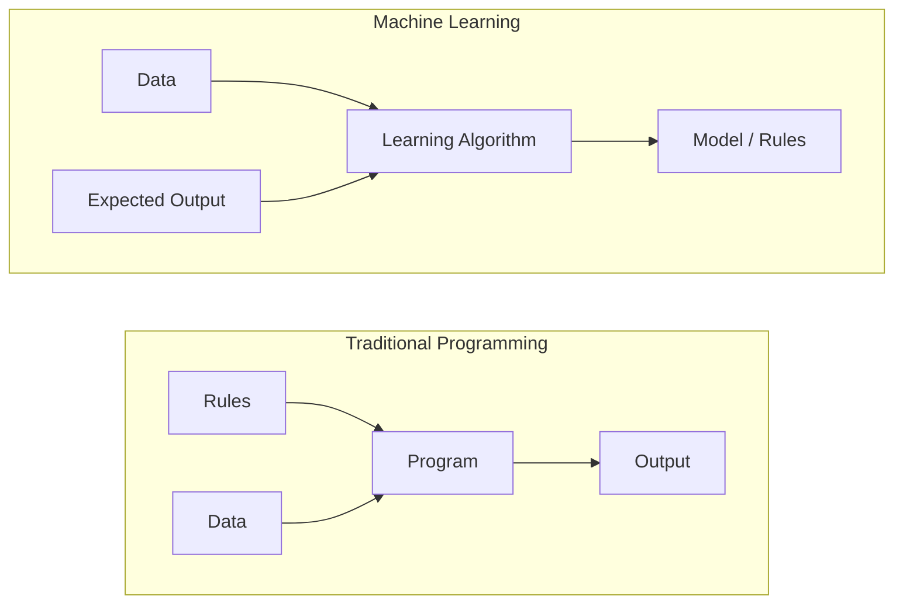
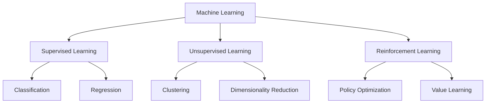
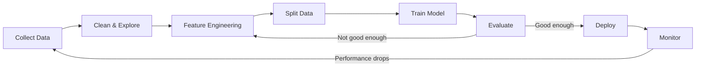
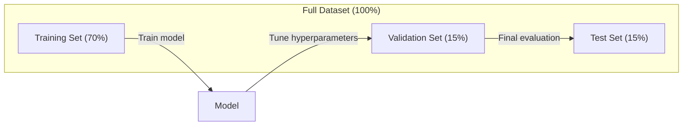
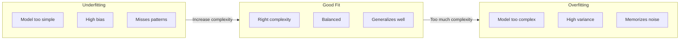
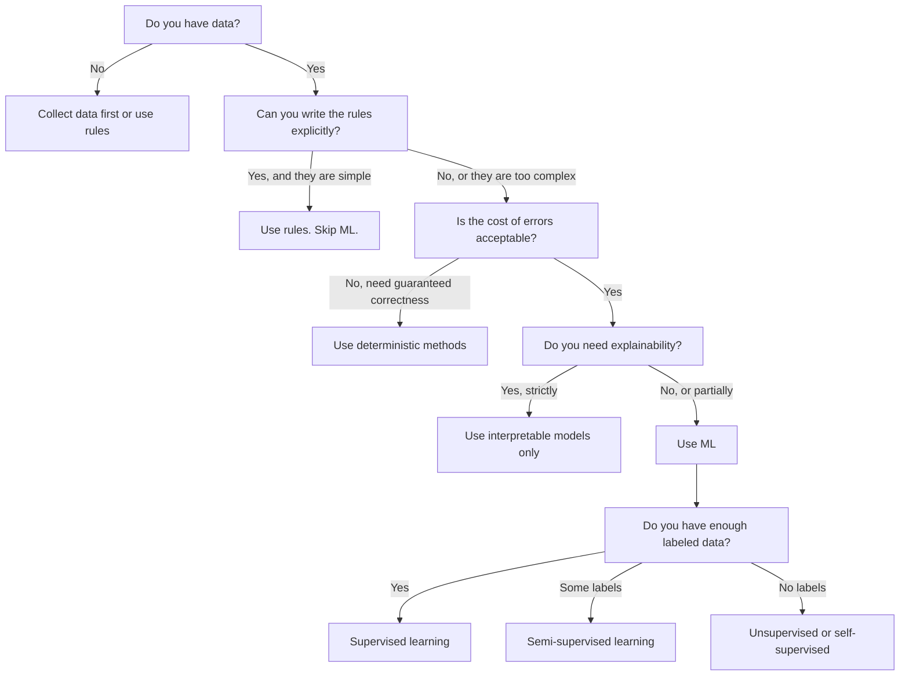

# 什麼是機器學習

> 機器學習就是教電腦從資料裡找出規律，而不是靠人手寫規則。

**類型：** 學習
**程式語言：** Python
**先修單元：** 階段 1（數學基礎）
**時間：** 約 45 分鐘

## 學習目標

- 說明監督式學習、非監督式學習與強化學習的差別，並判斷一個問題屬於哪一類
- 從零實作一個最近質心分類器，並拿它跟隨機基準線比較
- 分辨分類與迴歸任務，並為各自挑出適當的損失函式
- 評估一個商業問題適合用 ML，還是用確定性的規則解決比較好

## 問題所在

你想做一個垃圾郵件過濾器。傳統做法是：坐下來寫幾百條規則。「如果信裡出現 'FREE MONEY'，標成垃圾。如果驚嘆號超過 3 個，標成垃圾。」你花好幾週寫規則。然後寄垃圾信的人換了說法，你的規則就失效了。你再寫更多規則，這個循環永遠沒完。

機器學習把這件事反過來。你不寫規則，而是給電腦幾千封標好標籤的信（「垃圾」或「不是垃圾」），讓它自己把規則找出來。電腦會找到你根本不會想到的規律。當寄垃圾信的人換戰術時，你只要用新資料重新訓練，不用重寫程式碼。

從「寫規則」轉向「從資料學習」，正是機器學習的核心。每一個推薦引擎、語音助理、自動駕駛車與語言模型，運作方式都是這樣。

## 核心概念

### 從資料學習，而不是靠規則

傳統程式設計與機器學習解決問題的方向剛好相反。



傳統程式設計：規則由你來寫。程式把規則套用到資料上，產生輸出。

機器學習：你提供資料與期望的輸出。演算法自己把規則找出來。

訓練產出的那個「模型」本身就是規則，只是以數字（權重、參數）的形式編碼起來。它從看過的範例中泛化，對從沒見過的資料做出預測。

### 機器學習的三大類型



**監督式學習**：你手上有輸入與輸出成對的資料。模型學的是怎麼把輸入映射到輸出。
- 「這裡有 10,000 張標了貓或狗的照片。學會把牠們分開。」
- 「這裡有房屋特徵與價格。學會預測價格。」

**非監督式學習**：你只有輸入，沒有標籤。模型自己找出資料的結構。
- 「這裡有 10,000 筆客戶購買紀錄。找出自然的分群。」
- 「這裡有 1,000 維的資料點。降到 2 維，但要保留結構。」

**強化學習**：一個代理程式在環境中採取行動，並得到獎勵或懲罰。它學出一套策略（policy）來最大化總獎勵。
- 「玩這個遊戲。贏了 +1，輸了 -1。自己想出策略。」
- 「控制這隻機器手臂。抓起物體 +1，每浪費一秒 -0.01。」

實務上你會做的東西大多用監督式學習。非監督式學習常用於前處理與探索。強化學習則驅動了遊戲 AI、機器人，以及語言模型的 RLHF。

### 三大類型之外

上面這三類分得很乾淨，但真實世界的 ML 經常模糊了界線。

**半監督式學習**用一小批有標籤的資料，搭配一大批沒標籤的資料。你可能有 100 張標好的醫療影像，以及 100,000 張沒標的。常見手法包括：

- **標籤傳播（label propagation）：** 建一張圖，把相似的資料點連起來。標籤沿著圖從有標籤的節點擴散到沒標籤的鄰居。
- **偽標籤（pseudo-labeling）：** 先用有標籤的資料訓練一個模型，用它去預測無標籤資料的標籤，然後拿全部資料重新訓練。模型自己拉拔出自己的訓練集。
- **一致性正則化（consistency regularization）：** 對同一個輸入以及它被稍微擾動後的版本，模型應該給出相同的預測。這件事就算沒有標籤也做得到。

**自監督式學習**從資料本身生出監督訊號，完全不需要人工標籤。模型利用資料的結構，自己創造出一個預測任務。

- **遮罩語言模型（BERT）：** 把句子裡 15% 的詞遮起來，訓練模型預測被遮掉的詞。「標籤」就來自原本的文字。
- **對比學習（SimCLR）：** 拿一張圖，做出兩個增強後的版本。訓練模型認出它們來自同一張圖，同時跟其他圖的增強版本區分開來。
- **下一個詞元預測（GPT）：** 給定前面所有的字，預測下一個字。每一份文字文件都成了一個訓練範例。

這些並不是三大類型之外的另立門派，而是把監督式與非監督式的想法結合起來的策略。自監督式學習嚴格說起來就是監督式的（模型要預測某個東西），只是標籤是自動生成的，不是人標的。

### 分類 vs 迴歸

這是監督式學習的兩大任務。

| 面向 | 分類 | 迴歸 |
|--------|---------------|------------|
| 輸出 | 離散的類別 | 連續的數值 |
| 例子 | 「這封信是垃圾郵件嗎？」 | 「這間房子會賣多少錢？」 |
| 輸出空間 | {cat, dog, bird} | 任何實數 |
| 損失函式 | 交叉熵、準確率 | 均方誤差、MAE |
| 決策 | 類別之間的邊界 | 一條擬合資料的曲線 |

分類回答的是「哪一類？」迴歸回答的是「多少？」

有些問題兩種框法都行。預測股票會漲還是會跌是分類；預測確切價格是迴歸。

### ML 工作流程

不論用什麼演算法，每個機器學習專案走的都是同一條流程。



**蒐集資料**：收集原始資料。資料多幾乎總是比較好，但品質比數量更重要。

**清理與探索**：處理缺失值、移除重複、把分布畫出來、找出異常。這一步經常吃掉整個專案 60-80% 的時間。

**特徵工程**：把原始資料轉換成模型能用的特徵。把日期轉成星期幾。把數值欄位正規化。把類別變數編碼。好的特徵比花俏的演算法更重要。

**切分資料**：分成訓練集、驗證集與測試集。模型在訓練資料上訓練，你在驗證資料上調超參數，最後在測試資料上報告成績。

**訓練模型**：把訓練資料餵進演算法。演算法調整內部參數，把損失函式壓到最小。

**評估**：在驗證／測試資料上量測表現。如果表現不能接受，就回頭換特徵、換演算法或換超參數。

**部署**：把模型送上生產環境，對新資料做預測。

**監控**：持續追蹤表現。資料分布會變（資料漂移），模型會退化。表現下滑時就重新訓練。

### 訓練集、驗證集與測試集的切分

這是初學者最常搞錯、卻也最重要的觀念。你必須用模型在訓練期間完全沒看過的資料來評估它，否則你量到的是背答案，不是學習。



| 切分 | 用途 | 何時使用 | 常見比例 |
|-------|---------|-----------|-------------|
| 訓練集 | 模型從這批資料學習 | 訓練期間 | 60-80% |
| 驗證集 | 調超參數、比較模型 | 每一輪訓練跑完後 | 10-20% |
| 測試集 | 最終無偏的表現估計 | 只在最後看一次 | 10-20% |

測試集是神聖的，你只能看它一次。如果你一直根據測試表現去調模型，那實際上就是在測試集上訓練，你報出來的數字也就毫無意義。

資料量小的時候，用 k 折交叉驗證：把資料切成 k 份，用 k-1 份訓練、剩下那份驗證，輪流換一遍，最後把結果平均。

### 過度擬合 vs 欠擬合



**欠擬合**：模型太簡單，抓不到資料裡的規律。像是用一條直線去擬合彎曲的關係。訓練誤差高，測試誤差也高。

**過度擬合**：模型太複雜，把訓練資料連雜訊一起背下來。像是一條彎彎曲曲的曲線，穿過每一個訓練點，但碰到新資料就失手。訓練誤差低，測試誤差高。

**擬合得剛好**：模型抓到了真正的規律，又沒有背下雜訊。訓練誤差與測試誤差都相當低。

過度擬合的徵兆：
- 訓練準確率遠高於驗證準確率
- 模型在訓練資料上表現很好，但在新資料上很差
- 加更多訓練資料就會改善表現（說明模型原本是在背，不是在學）

過度擬合的解法：
- 取得更多訓練資料
- 降低模型複雜度（少一點參數、簡單一點的架構）
- 正則化（對過大的權重加上懲罰）
- Dropout（訓練時隨機把神經元歸零）
- 提早停止（驗證誤差開始上升時就停止訓練）

欠擬合的解法：
- 換一個更複雜的模型
- 加入更多特徵
- 減少正則化
- 訓練久一點

### 偏差與變異的權衡

這是過度擬合與欠擬合背後的數學框架。

**偏差（bias）**：來自模型假設錯誤的誤差。當真實關係是非線性時，線性模型的偏差就很高。高偏差會導致欠擬合。

**變異（variance）**：來自模型對訓練資料微小波動過度敏感的誤差。變異高的模型，用不同的資料子集訓練就會給出差異很大的預測。高變異會導致過度擬合。

| 模型複雜度 | 偏差 | 變異 | 結果 |
|-----------------|------|----------|--------|
| 太低（用線性模型配彎曲的資料） | 高 | 低 | 欠擬合 |
| 剛剛好 | 中 | 中 | 泛化良好 |
| 太高（用 20 次多項式配 10 個點） | 低 | 高 | 過度擬合 |

Total error = Bias^2 + Variance + Irreducible noise

不可約的雜訊你降不下來（那是資料本身的隨機性）。你要找的是讓 bias^2 + variance 最小的那個甜蜜點。

### 天下沒有白吃的午餐定理

沒有哪一種演算法在所有問題上都最好。在某一類問題上表現優異的演算法，換到另一類就會表現很差。這也是為什麼資料科學家會試好幾種演算法，然後比較結果。

實務上，選擇取決於：
- 你有多少資料
- 有多少個特徵
- 關係是線性還是非線性
- 你需不需要可解釋性
- 你負擔得起多少運算資源

### 什麼時候「不該」用機器學習

ML 很強大，但不一定是對的工具。在動手做模型之前，先問問你是不是真的需要一個。

**不要用 ML，當：**

- **規則本身很簡單、定義明確。** 稅額計算、排序演算法、單位換算。如果邏輯用幾個 if 就寫完了，做模型只是增加複雜度，沒有任何好處。
- **你沒有資料，或資料極少。** ML 需要範例才能學。只有 10 筆資料，你訓練不出任何有意義的東西。先去蒐集資料。
- **出錯的代價是災難性的，而你需要保證正確。** 醫療劑量計算、核反應爐控制、密碼學驗證。ML 模型是機率性的，它偶爾就是會錯。如果「偶爾會錯」無法接受，就用確定性的方法。
- **查表或啟發式規則就能解決問題。** 如果一個簡單的門檻或表格就涵蓋了 99% 的情況，加上 ML 只會提高維護成本，卻換不到有意義的改善。
- **你無法解釋決策，而可解釋性是必要條件。** 受監管的產業（貸放、保險、刑事司法）有時要求每個決策都必須能完整說明。有些 ML 模型是可解釋的（線性迴歸、小型決策樹），但大多數不是。
- **問題變化的速度比你重新訓練的速度還快。** 如果規則天天在變，而重新訓練要一週，那模型永遠是過期的。

可以照這張決策流程圖走：



## 動手實作

`code/ml_intro.py` 裡的程式碼從零實作了一個最近質心分類器，也就是最簡單的 ML 演算法。它示範了核心想法：從資料學習，然後對新資料做預測。

### 步驟 1：從零實作最近質心分類器

最近質心分類器會算出訓練資料中每個類別的中心（平均值）。要預測時，它把每個新的點指派給中心離它最近的那個類別。

```python
class NearestCentroid:
    def fit(self, X, y):
        self.classes = np.unique(y)
        self.centroids = np.array([
            X[y == c].mean(axis=0) for c in self.classes
        ])

    def predict(self, X):
        distances = np.array([
            np.sqrt(((X - c) ** 2).sum(axis=1))
            for c in self.centroids
        ])
        return self.classes[distances.argmin(axis=0)]
```

整個演算法就這樣。fit 算兩個平均值，predict 算距離。沒有梯度下降，沒有迭代，沒有超參數。

### 步驟 2：用合成資料訓練

我們生成一個 2D 的分類資料集，裡面兩個類別稍微重疊。質心分類器會在兩個類別中心之間畫出一條線性的決策邊界。

```python
rng = np.random.RandomState(42)
X_class0 = rng.randn(100, 2) + np.array([1.0, 1.0])
X_class1 = rng.randn(100, 2) + np.array([-1.0, -1.0])
X = np.vstack([X_class0, X_class1])
y = np.array([0] * 100 + [1] * 100)
```

### 步驟 3：跟基準線比較

每個 ML 模型都應該拿來跟一條無腦的基準線比較。這裡的基準線隨機猜一個類別。如果你的 ML 模型連隨機亂猜都贏不了，那一定有什麼地方出錯了。

```python
baseline_preds = rng.choice([0, 1], size=len(y_test))
baseline_acc = np.mean(baseline_preds == y_test)
```

在這個乾淨的資料集上，質心分類器的準確率應該有 90% 以上，隨機基準線大約 50%。

### 為什麼這很重要

最近質心分類器簡單到不像話。它沒有超參數、沒有迭代、沒有梯度下降。但它抓住了 ML 最根本的模式：

1. 從訓練資料**學出**一個表示（那些質心）
2. 用這個表示對新資料**預測**（最近距離）
3. 拿基準線來**評估**（隨機亂猜）

從邏輯迴歸到 Transformer，每一個 ML 演算法走的都是這同樣的三步。表示會變得更複雜，但流程沒有變。

### 步驟 4：質心分類器做不到的事

最近質心分類器假設每個類別是一坨。它畫的是線性決策邊界。它會失手的情況：

- 一個類別包含好幾個群落（例如數字「1」有好幾種不同寫法）
- 決策邊界是非線性的（例如一個類別環繞著另一個類別）
- 各特徵的尺度差很多（距離會被尺度最大的那個特徵主導）

這些限制正是你之後會學的每一個演算法的動機。K 近鄰處理多個群落的情況。決策樹處理非線性邊界。特徵縮放解決尺度問題。每一課都建立在前一課的限制之上。

## 框架應用

sklearn 提供了 `NearestCentroid` 與合成資料產生器：

```python
from sklearn.neighbors import NearestCentroid
from sklearn.datasets import make_classification
from sklearn.model_selection import train_test_split

X, y = make_classification(
    n_samples=500, n_features=2, n_redundant=0,
    n_clusters_per_class=1, random_state=42
)
X_train, X_test, y_train, y_test = train_test_split(X, y, test_size=0.3)

clf = NearestCentroid()
clf.fit(X_train, y_train)
print(f"Accuracy: {clf.score(X_test, y_test):.3f}")
```

## 產出交付

這一課產出 `outputs/prompt-ml-problem-framer.md` —— 一段把模糊的商業問題轉成具體 ML 任務的提示詞。你給它一段問題描述（「我們想降低客戶流失」或「預測下一季的需求」），它會判斷屬於哪種學習類型、定義預測目標、列出候選特徵、挑一個成功指標、建立基準線，並標示出資料洩漏或類別不平衡之類的陷阱。在任何 ML 專案一開始就用它，可以避免做出錯的東西。

## 關鍵術語

| 術語 | 大家怎麼說 | 實際上是什麼 |
|------|----------------|----------------------|
| 模型 | 「那個 AI」 | 一個帶有可學習參數的數學函式，把輸入映射到輸出 |
| 訓練 | 「教 AI」 | 跑一個最佳化演算法來調整模型參數，讓預測貼近已知的輸出 |
| 特徵 | 「一個輸入欄位」 | 資料的一項可量測性質，模型拿它來做預測 |
| 標籤 | 「答案」 | 訓練範例已知的輸出，用來計算誤差訊號 |
| 超參數 | 「一個你會去調的設定」 | 訓練前就設定好、用來控制學習過程的參數（學習率、層數） |
| 損失函式 | 「模型錯得多離譜」 | 一個衡量預測與實際輸出差距的函式，訓練就是要把它壓小 |
| 過度擬合 | 「它把考題背下來了」 | 模型學到的是訓練資料特有的雜訊，而不是一般的規律，所以碰到新資料就失手 |
| 欠擬合 | 「它什麼都沒學到」 | 模型太簡單，抓不到資料裡真正的規律 |
| 泛化 | 「它在新資料上也管用」 | 模型對沒有拿來訓練過的資料做出準確預測的能力 |
| 交叉驗證 | 「換不同的區塊來測」 | 反覆把資料切成訓練／測試折，再把結果平均，得到更穩健的表現估計 |
| 正則化 | 「讓權重保持小」 | 在損失函式加上一個懲罰項，抑制過度複雜的模型 |
| 資料漂移 | 「世界變了」 | 進來的資料統計分布隨時間偏移，讓模型表現退化 |

## 練習

1. 隨便挑一個資料集（例如 Iris、Titanic）。以 70/15/15 切成訓練／驗證／測試。說明為什麼你不該在測試集上調超參數。
2. 列出三個真實世界的問題。針對每一個，判斷它是分類、迴歸還是分群，以及它屬於監督式還是非監督式。
3. 有個模型在訓練資料上準確率 99%，但在測試資料上只有 60%。診斷問題出在哪，並列出三件你會拿來修它的事。

## 延伸閱讀

- [An Introduction to Statistical Learning](https://www.statlearning.com/) —— 免費教科書，涵蓋所有古典 ML 方法並附上實務範例
- [Google's Machine Learning Crash Course](https://developers.google.com/machine-learning/crash-course) —— 簡潔的視覺化 ML 概念入門
- [Scikit-learn User Guide](https://scikit-learn.org/stable/user_guide.html) —— 用 Python 實作 ML 的實務參考手冊
