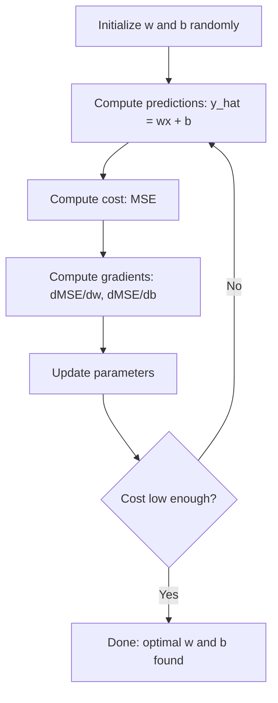

# 線性迴歸

> 線性迴歸就是在你的資料裡畫出最合適的一條直線。它是機器學習的「hello world」。

**類型：** 實作
**程式語言：** Python
**先修單元：** 階段 1（線性代數、微積分、最佳化）、階段 2 · 單元 01
**時間：** 約 90 分鐘

## 學習目標

- 推導均方誤差的梯度下降更新規則，並從零實作線性迴歸
- 從計算複雜度的角度比較梯度下降與正規方程，並說明各自適用的時機
- 建立一個帶特徵標準化的多元線性迴歸模型，並解讀學到的權重
- 說明 Ridge 迴歸（L2 正則化）如何藉由懲罰過大的權重來防止過度擬合

## 問題所在

你手上有一份資料：房屋面積與它們的成交價。你想根據一間新房子的面積預測它的價格。你可以在散布圖上目測一下，但你需要的是一個公式。你需要一條最貼合資料的直線，這樣才能代入任何面積、得到一個價格預測。

線性迴歸就給你那條線。更重要的是，它引入了機器學習訓練迴圈的全貌：定義模型、定義成本函式、最佳化參數。每一個機器學習演算法都遵循同一套模式。在這裡用最簡單的情境把它練熟，之後你到處都會認出它。

這也不只適用於簡單問題。線性迴歸在正式系統裡被用於需求預測、A/B 測試分析、財務建模，也是每一項迴歸任務的基準線。

## 核心概念

### 模型

線性迴歸假設輸入 (x) 與輸出 (y) 之間存在線性關係：

```
y = wx + b
```

- `w`（權重／斜率）：x 每增加 1，y 會變動多少
- `b`（偏差項／截距）：x = 0 時 y 的值

當輸入（特徵）有多個時，這會擴展成：

```
y = w1*x1 + w2*x2 + ... + wn*xn + b
```

或寫成向量形式：`y = w^T * x + b`

目標：找出讓預測的 y 在所有訓練樣本上都盡可能接近實際 y 的 w 與 b。

### 成本函式（均方誤差）

你要怎麼衡量「盡可能接近」？你需要一個單一數字，用來刻畫你的預測錯得多離譜。最常見的選擇是均方誤差（MSE）：

```
MSE = (1/n) * sum((y_predicted - y_actual)^2)
```

為什麼要平方？有兩個理由。第一，它對大誤差的懲罰比對小誤差重得多（誤差 10 的糟糕程度是誤差 1 的 100 倍，不是 10 倍）。第二，平方函式處處平滑可微，這讓最佳化變得很直接。

成本函式會構成一個曲面。對單一權重 w 與偏差項 b 來說，MSE 曲面看起來像一個碗（一個凸的拋物面）。碗底就是 MSE 最小的地方。訓練就是去找到那個碗底。

### 梯度下降

梯度下降靠一步步往下坡走來找到碗底。



梯度告訴你兩件事：每個參數該往哪個方向移動，以及該移動多少。

對 y_hat = wx + b 的 MSE 來說：

```
dMSE/dw = (2/n) * sum((y_hat - y) * x)
dMSE/db = (2/n) * sum(y_hat - y)
```

更新規則：

```
w = w - learning_rate * dMSE/dw
b = b - learning_rate * dMSE/db
```

學習率控制步伐大小。太大：你會衝過最小值然後發散。太小：訓練久到沒完沒了。常見的起始值：0.01、0.001 或 0.0001。

### 正規方程（封閉形式解）

專就線性迴歸而言，有一個直接的公式能算出最佳權重，完全不需要迭代：

```
w = (X^T * X)^(-1) * X^T * y
```

它靠反轉一個矩陣，一步就把 w 解出來。在小資料集上完全夠用。碰上大資料集（數百萬列或數千個特徵）時，梯度下降更受青睞，因為矩陣反轉對特徵數而言是 O(n^3)。

### 多元線性迴歸

有多個特徵時，模型變成：

```
y = w1*x1 + w2*x2 + ... + wn*xn + b
```

一切運作方式都一樣：MSE 是成本函式，梯度下降同時更新所有權重。唯一的差別是你在配適一個超平面，而不是一條線。

特徵縮放在這裡就變得重要了。如果一個特徵的範圍是 0 到 1，另一個是 0 到 1,000,000，梯度下降會很吃力，因為成本曲面會被拉得又細又長。訓練前請先把特徵標準化（減掉平均值、除以標準差）。

### 多項式迴歸

那如果關係不是線性的呢？你還是可以用線性迴歸，做法是建立多項式特徵：

```
y = w1*x + w2*x^2 + w3*x^3 + b
```

這依然算是「線性」迴歸，因為模型對權重 (w1, w2, w3) 而言是線性的。你只是拿 x 的非線性特徵來用而已。

次數越高的多項式能配適更複雜的曲線，但有過度擬合的風險。一個 10 次的多項式會穿過一份 10 個點的資料集裡的每一個點，但在新資料上預測得很差。

### R 平方分數

MSE 告訴你錯得多離譜，但這個數字取決於 y 的尺度。R 平方 (R^2) 提供一個與尺度無關的衡量：

```
R^2 = 1 - (sum of squared residuals) / (sum of squared deviations from mean)
    = 1 - SS_res / SS_tot
```

- R^2 = 1.0：完美預測
- R^2 = 0.0：這個模型並不比每次都猜平均值更好
- R^2 < 0.0：這個模型比每次都猜平均值還糟

### 正則化預覽（Ridge 迴歸）

當特徵很多時，模型可能會給出很大的權重而過度擬合。Ridge 迴歸（L2 正則化）加上一個懲罰項：

```
Cost = MSE + lambda * sum(w_i^2)
```

這個懲罰項會抑制過大的權重。超參數 lambda 控制其間的取捨：lambda 越大，權重越小、正則化越強。這會在後面的單元裡深入探討。現在你只要知道它存在，以及它為什麼有幫助。

```figure
linear-regression-fit
```

## 動手實作

### 步驟 1：產生範例資料

```python
import random
import math

random.seed(42)

TRUE_W = 3.0
TRUE_B = 7.0
N_SAMPLES = 100

X = [random.uniform(0, 10) for _ in range(N_SAMPLES)]
y = [TRUE_W * x + TRUE_B + random.gauss(0, 2.0) for x in X]

print(f"Generated {N_SAMPLES} samples")
print(f"True relationship: y = {TRUE_W}x + {TRUE_B} (+ noise)")
print(f"First 5 points: {[(round(X[i], 2), round(y[i], 2)) for i in range(5)]}")
```

### 步驟 2：用梯度下降從零實作線性迴歸

```python
class LinearRegression:
    def __init__(self, learning_rate=0.01):
        self.w = 0.0
        self.b = 0.0
        self.lr = learning_rate
        self.cost_history = []

    def predict(self, X):
        return [self.w * x + self.b for x in X]

    def compute_cost(self, X, y):
        predictions = self.predict(X)
        n = len(y)
        cost = sum((pred - actual) ** 2 for pred, actual in zip(predictions, y)) / n
        return cost

    def compute_gradients(self, X, y):
        predictions = self.predict(X)
        n = len(y)
        dw = (2 / n) * sum((pred - actual) * x for pred, actual, x in zip(predictions, y, X))
        db = (2 / n) * sum(pred - actual for pred, actual in zip(predictions, y))
        return dw, db

    def fit(self, X, y, epochs=1000, print_every=200):
        for epoch in range(epochs):
            dw, db = self.compute_gradients(X, y)
            self.w -= self.lr * dw
            self.b -= self.lr * db
            cost = self.compute_cost(X, y)
            self.cost_history.append(cost)
            if epoch % print_every == 0:
                print(f"  Epoch {epoch:4d} | Cost: {cost:.4f} | w: {self.w:.4f} | b: {self.b:.4f}")
        return self

    def r_squared(self, X, y):
        predictions = self.predict(X)
        y_mean = sum(y) / len(y)
        ss_res = sum((actual - pred) ** 2 for actual, pred in zip(y, predictions))
        ss_tot = sum((actual - y_mean) ** 2 for actual in y)
        return 1 - (ss_res / ss_tot)


print("=== Training Linear Regression (Gradient Descent) ===")
model = LinearRegression(learning_rate=0.005)
model.fit(X, y, epochs=1000, print_every=200)
print(f"\nLearned: y = {model.w:.4f}x + {model.b:.4f}")
print(f"True:    y = {TRUE_W}x + {TRUE_B}")
print(f"R-squared: {model.r_squared(X, y):.4f}")
```

### 步驟 3：正規方程（封閉形式解）

```python
class LinearRegressionNormal:
    def __init__(self):
        self.w = 0.0
        self.b = 0.0

    def fit(self, X, y):
        n = len(X)
        x_mean = sum(X) / n
        y_mean = sum(y) / n
        numerator = sum((X[i] - x_mean) * (y[i] - y_mean) for i in range(n))
        denominator = sum((X[i] - x_mean) ** 2 for i in range(n))
        self.w = numerator / denominator
        self.b = y_mean - self.w * x_mean
        return self

    def predict(self, X):
        return [self.w * x + self.b for x in X]

    def r_squared(self, X, y):
        predictions = self.predict(X)
        y_mean = sum(y) / len(y)
        ss_res = sum((actual - pred) ** 2 for actual, pred in zip(y, predictions))
        ss_tot = sum((actual - y_mean) ** 2 for actual in y)
        return 1 - (ss_res / ss_tot)


print("\n=== Normal Equation (Closed-Form) ===")
model_normal = LinearRegressionNormal()
model_normal.fit(X, y)
print(f"Learned: y = {model_normal.w:.4f}x + {model_normal.b:.4f}")
print(f"R-squared: {model_normal.r_squared(X, y):.4f}")
```

### 步驟 4：多元線性迴歸

```python
class MultipleLinearRegression:
    def __init__(self, n_features, learning_rate=0.01):
        self.weights = [0.0] * n_features
        self.bias = 0.0
        self.lr = learning_rate
        self.cost_history = []

    def predict_single(self, x):
        return sum(w * xi for w, xi in zip(self.weights, x)) + self.bias

    def predict(self, X):
        return [self.predict_single(x) for x in X]

    def compute_cost(self, X, y):
        predictions = self.predict(X)
        n = len(y)
        return sum((pred - actual) ** 2 for pred, actual in zip(predictions, y)) / n

    def fit(self, X, y, epochs=1000, print_every=200):
        n = len(y)
        n_features = len(X[0])
        for epoch in range(epochs):
            predictions = self.predict(X)
            errors = [pred - actual for pred, actual in zip(predictions, y)]
            for j in range(n_features):
                grad = (2 / n) * sum(errors[i] * X[i][j] for i in range(n))
                self.weights[j] -= self.lr * grad
            grad_b = (2 / n) * sum(errors)
            self.bias -= self.lr * grad_b
            cost = self.compute_cost(X, y)
            self.cost_history.append(cost)
            if epoch % print_every == 0:
                print(f"  Epoch {epoch:4d} | Cost: {cost:.4f}")
        return self

    def r_squared(self, X, y):
        predictions = self.predict(X)
        y_mean = sum(y) / len(y)
        ss_res = sum((actual - pred) ** 2 for actual, pred in zip(y, predictions))
        ss_tot = sum((actual - y_mean) ** 2 for actual in y)
        return 1 - (ss_res / ss_tot)


random.seed(42)
N = 100
X_multi = []
y_multi = []
for _ in range(N):
    size = random.uniform(500, 3000)
    bedrooms = random.randint(1, 5)
    age = random.uniform(0, 50)
    price = 50 * size + 10000 * bedrooms - 1000 * age + 50000 + random.gauss(0, 20000)
    X_multi.append([size, bedrooms, age])
    y_multi.append(price)


def standardize(X):
    n_features = len(X[0])
    means = [sum(X[i][j] for i in range(len(X))) / len(X) for j in range(n_features)]
    stds = []
    for j in range(n_features):
        variance = sum((X[i][j] - means[j]) ** 2 for i in range(len(X))) / len(X)
        stds.append(variance ** 0.5)
    X_scaled = []
    for i in range(len(X)):
        row = [(X[i][j] - means[j]) / stds[j] if stds[j] > 0 else 0 for j in range(n_features)]
        X_scaled.append(row)
    return X_scaled, means, stds


y_mean_val = sum(y_multi) / len(y_multi)
y_std_val = (sum((yi - y_mean_val) ** 2 for yi in y_multi) / len(y_multi)) ** 0.5
y_scaled = [(yi - y_mean_val) / y_std_val for yi in y_multi]

X_scaled, x_means, x_stds = standardize(X_multi)

print("\n=== Multiple Linear Regression (3 features) ===")
print("Features: house size, bedrooms, age")
multi_model = MultipleLinearRegression(n_features=3, learning_rate=0.01)
multi_model.fit(X_scaled, y_scaled, epochs=1000, print_every=200)

print(f"\nWeights (standardized): {[round(w, 4) for w in multi_model.weights]}")
print(f"Bias (standardized): {multi_model.bias:.4f}")
print(f"R-squared: {multi_model.r_squared(X_scaled, y_scaled):.4f}")
```

### 步驟 5：多項式迴歸

```python
class PolynomialRegression:
    def __init__(self, degree, learning_rate=0.01):
        self.degree = degree
        self.weights = [0.0] * degree
        self.bias = 0.0
        self.lr = learning_rate

    def make_features(self, X):
        return [[x ** (d + 1) for d in range(self.degree)] for x in X]

    def predict(self, X):
        features = self.make_features(X)
        return [sum(w * f for w, f in zip(self.weights, row)) + self.bias for row in features]

    def fit(self, X, y, epochs=1000, print_every=200):
        features = self.make_features(X)
        n = len(y)
        for epoch in range(epochs):
            predictions = [sum(w * f for w, f in zip(self.weights, row)) + self.bias for row in features]
            errors = [pred - actual for pred, actual in zip(predictions, y)]
            for j in range(self.degree):
                grad = (2 / n) * sum(errors[i] * features[i][j] for i in range(n))
                self.weights[j] -= self.lr * grad
            grad_b = (2 / n) * sum(errors)
            self.bias -= self.lr * grad_b
            if epoch % print_every == 0:
                cost = sum(e ** 2 for e in errors) / n
                print(f"  Epoch {epoch:4d} | Cost: {cost:.6f}")
        return self

    def r_squared(self, X, y):
        predictions = self.predict(X)
        y_mean = sum(y) / len(y)
        ss_res = sum((actual - pred) ** 2 for actual, pred in zip(y, predictions))
        ss_tot = sum((actual - y_mean) ** 2 for actual in y)
        return 1 - (ss_res / ss_tot)


random.seed(42)
X_poly = [x / 10.0 for x in range(0, 50)]
y_poly = [0.5 * x ** 2 - 2 * x + 3 + random.gauss(0, 1.0) for x in X_poly]

x_max = max(abs(x) for x in X_poly)
X_poly_norm = [x / x_max for x in X_poly]
y_poly_mean = sum(y_poly) / len(y_poly)
y_poly_std = (sum((yi - y_poly_mean) ** 2 for yi in y_poly) / len(y_poly)) ** 0.5
y_poly_norm = [(yi - y_poly_mean) / y_poly_std for yi in y_poly]

print("\n=== Polynomial Regression (degree 2 vs degree 5) ===")
print("True relationship: y = 0.5x^2 - 2x + 3")

print("\nDegree 2:")
poly2 = PolynomialRegression(degree=2, learning_rate=0.1)
poly2.fit(X_poly_norm, y_poly_norm, epochs=2000, print_every=500)
print(f"  R-squared: {poly2.r_squared(X_poly_norm, y_poly_norm):.4f}")

print("\nDegree 5:")
poly5 = PolynomialRegression(degree=5, learning_rate=0.1)
poly5.fit(X_poly_norm, y_poly_norm, epochs=2000, print_every=500)
print(f"  R-squared: {poly5.r_squared(X_poly_norm, y_poly_norm):.4f}")

print("\nDegree 2 fits the true curve well. Degree 5 fits training data slightly better")
print("but risks overfitting on new data.")
```

### 步驟 6：Ridge 迴歸（L2 正則化）

```python
class RidgeRegression:
    def __init__(self, n_features, learning_rate=0.01, alpha=1.0):
        self.weights = [0.0] * n_features
        self.bias = 0.0
        self.lr = learning_rate
        self.alpha = alpha

    def predict_single(self, x):
        return sum(w * xi for w, xi in zip(self.weights, x)) + self.bias

    def predict(self, X):
        return [self.predict_single(x) for x in X]

    def fit(self, X, y, epochs=1000, print_every=200):
        n = len(y)
        n_features = len(X[0])
        for epoch in range(epochs):
            predictions = self.predict(X)
            errors = [pred - actual for pred, actual in zip(predictions, y)]
            mse = sum(e ** 2 for e in errors) / n
            reg_term = self.alpha * sum(w ** 2 for w in self.weights)
            cost = mse + reg_term
            for j in range(n_features):
                grad = (2 / n) * sum(errors[i] * X[i][j] for i in range(n))
                grad += 2 * self.alpha * self.weights[j]
                self.weights[j] -= self.lr * grad
            grad_b = (2 / n) * sum(errors)
            self.bias -= self.lr * grad_b
            if epoch % print_every == 0:
                print(f"  Epoch {epoch:4d} | Cost: {cost:.4f} | L2 penalty: {reg_term:.4f}")
        return self


print("\n=== Ridge Regression (L2 Regularization) ===")
print("Same data as multiple regression, with alpha=0.1")
ridge = RidgeRegression(n_features=3, learning_rate=0.01, alpha=0.1)
ridge.fit(X_scaled, y_scaled, epochs=1000, print_every=200)
print(f"\nRidge weights: {[round(w, 4) for w in ridge.weights]}")
print(f"Plain weights: {[round(w, 4) for w in multi_model.weights]}")
print("Ridge weights are smaller (shrunk toward zero) due to the L2 penalty.")
```

## 框架應用

現在用 scikit-learn 做同一件事，這才是你在正式環境裡真正會用的東西。

```python
from sklearn.linear_model import LinearRegression as SklearnLR
from sklearn.linear_model import Ridge
from sklearn.preprocessing import PolynomialFeatures, StandardScaler
from sklearn.model_selection import train_test_split
from sklearn.metrics import mean_squared_error, r2_score
import numpy as np

np.random.seed(42)
X_sk = np.random.uniform(0, 10, (100, 1))
y_sk = 3.0 * X_sk.squeeze() + 7.0 + np.random.normal(0, 2.0, 100)

X_train, X_test, y_train, y_test = train_test_split(X_sk, y_sk, test_size=0.2, random_state=42)

lr = SklearnLR()
lr.fit(X_train, y_train)
y_pred = lr.predict(X_test)

print("=== Scikit-learn Linear Regression ===")
print(f"Coefficient (w): {lr.coef_[0]:.4f}")
print(f"Intercept (b): {lr.intercept_:.4f}")
print(f"R-squared (test): {r2_score(y_test, y_pred):.4f}")
print(f"MSE (test): {mean_squared_error(y_test, y_pred):.4f}")

poly = PolynomialFeatures(degree=2, include_bias=False)
X_poly_sk = poly.fit_transform(X_train)
X_poly_test = poly.transform(X_test)

lr_poly = SklearnLR()
lr_poly.fit(X_poly_sk, y_train)
print(f"\nPolynomial degree 2 R-squared: {r2_score(y_test, lr_poly.predict(X_poly_test)):.4f}")

scaler = StandardScaler()
X_train_scaled = scaler.fit_transform(X_train)
X_test_scaled = scaler.transform(X_test)

ridge = Ridge(alpha=1.0)
ridge.fit(X_train_scaled, y_train)
print(f"Ridge R-squared: {r2_score(y_test, ridge.predict(X_test_scaled)):.4f}")
print(f"Ridge coefficient: {ridge.coef_[0]:.4f}")
```

你自己從零寫的實作與 scikit-learn 得到相同的結果。差別在於：scikit-learn 會處理邊界情況、數值穩定性與效能最佳化。正式環境請用函式庫。從零實作的版本則用來理解背後到底發生了什麼。

## 產出交付

這個單元會產出：
- `outputs/skill-regression.md` - 一份根據問題挑選合適迴歸方法的技能

## 練習

1. 實作批次梯度下降、隨機梯度下降（SGD）與小批次梯度下降。在同一份資料集上比較收斂速度。哪一種收斂最快？哪一種的成本曲線最平滑？
2. 從一個三次函式產生資料（y = ax^3 + bx^2 + cx + d + noise）。配適次數為 1、3、10 的多項式。比較訓練 R^2 與測試 R^2。到第幾次時過度擬合變得明顯？
3. 實作 Lasso 迴歸（L1 正則化：penalty = alpha * sum(|w_i|)）。在多特徵的房價資料上訓練。比較它與 Ridge 分別讓哪些權重歸零。為什麼 L1 會產生稀疏解，而 L2 不會？

## 關鍵術語

| 術語 | 大家怎麼說 | 實際上是什麼 |
|------|----------------|----------------------|
| 線性迴歸 | 「在資料裡畫一條線」 | 找出權重 w 與偏差項 b，讓 wx+b 與實際 y 值之間的平方差總和最小 |
| 成本函式 | 「模型有多糟」 | 一個把模型參數對應到單一數字的函式，那個數字衡量預測誤差，而最佳化就是去把它最小化 |
| 均方誤差 | 「誤差平方的平均」 | (1/n) * sum of (predicted - actual)^2，對大誤差施以不成比例的懲罰 |
| 梯度下降 | 「往下坡走」 | 用偏導數，反覆把參數往能降低成本函式的方向調整 |
| 學習率 | 「步伐大小」 | 一個純量，控制每一步梯度下降會把參數改動多少 |
| 正規方程 | 「直接解出來」 | 封閉形式解 w = (X^T X)^-1 X^T y，不需迭代就給出最佳權重 |
| R 平方 | 「配適得有多好」 | 模型所解釋的 y 變異數比例，範圍從負無限大到 1.0 |
| 特徵縮放 | 「讓各特徵可比較」 | 把特徵轉換到相近的範圍（例如零平均、單位變異數），讓梯度下降收斂更快 |
| 正則化 | 「懲罰複雜度」 | 在成本函式裡加上一個會壓縮權重的項，以防止過度擬合 |
| Ridge 迴歸 | 「L2 正則化」 | 在 MSE 上加了 lambda * sum(w_i^2) 這個懲罰項的線性迴歸 |
| 多項式迴歸 | 「用線性數學配適曲線」 | 在多項式特徵 (x, x^2, x^3, ...) 上做線性迴歸，對權重而言仍然是線性的 |
| 過度擬合 | 「把訓練資料背下來」 | 用了複雜到會把訓練資料裡的雜訊也一起配適進去的模型，結果在新資料上失效 |

## 延伸閱讀

- [An Introduction to Statistical Learning (ISLR)](https://www.statlearning.com/) -- 免費 PDF，第 3 與第 6 章以實用的 R 範例涵蓋線性迴歸與正則化
- [The Elements of Statistical Learning (ESL)](https://hastie.su.domains/ElemStatLearn/) -- 免費 PDF，ISLR 數學味更重的姊妹作，對 ridge 與 lasso 的處理更深入
- [Stanford CS229 Lecture Notes on Linear Regression](https://cs229.stanford.edu/main_notes.pdf) -- Andrew Ng 的講義，從第一原理推導正規方程與梯度下降
- [scikit-learn LinearRegression documentation](https://scikit-learn.org/stable/modules/linear_model.html) -- LinearRegression、Ridge、Lasso 與 ElasticNet 的實用參考，附程式碼範例
