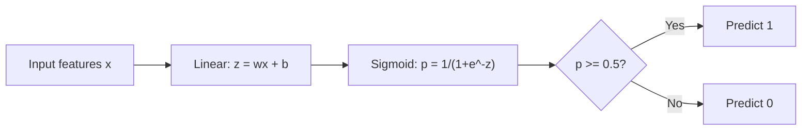
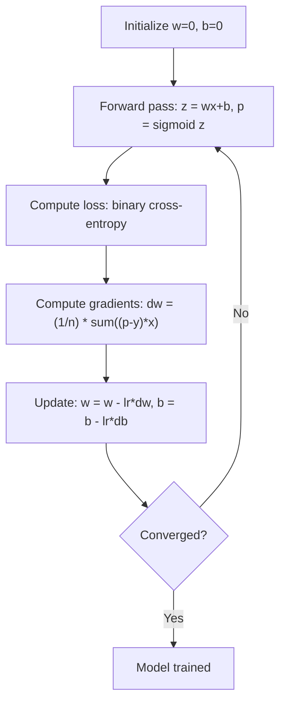

# 邏輯迴歸

> 邏輯迴歸把一條直線折成 S 形曲線，用機率來回答是或不是的問題。

**類型：** 實作
**程式語言：** Python
**先修單元：** 階段 2 · 01-02（什麼是 ML、線性迴歸）
**時間：** 約 90 分鐘

## 學習目標

- 用 sigmoid 函式與二元交叉熵損失，從零實作邏輯迴歸
- 計算並解讀二元分類的精確率、召回率、F1 分數與混淆矩陣
- 說明為什麼 MSE 不適用於分類，以及為什麼二元交叉熵會產生凸的成本曲面
- 打造一個 softmax 迴歸模型來做多元分類，並評估調整分類閾值的取捨

## 問題所在

你想根據腫瘤的大小，預測它是惡性還是良性。你試了線性迴歸，它輸出 0.3、1.7 或 -0.5 這樣的數字。這些數字是什麼意思？1.7 代表「非常惡性」嗎？-0.5 代表「非常良性」嗎？線性迴歸輸出的是沒有界限的數字。分類需要的是介於 0 與 1 之間、有界限的機率，以及一個明確的決定：是或不是。

邏輯迴歸解決了這件事。它接手同樣的線性組合（wx + b），把它送進 sigmoid 函式，把任何數字都壓縮到 (0, 1) 的範圍內。輸出就是一個機率。你設一個閾值（通常是 0.5），然後做出決定。

這是實務上使用最廣泛的演算法之一。雖然名字裡有「迴歸」，邏輯迴歸其實是分類演算法，不是迴歸演算法。這個名字來自它所使用的 logistic（sigmoid）函式。

## 核心概念

### 為什麼線性迴歸不適合分類

想像你要根據讀書時數預測及格／不及格（1/0）。線性迴歸會在資料上配一條線：

```
hours:  1   2   3   4   5   6   7   8   9   10
actual: 0   0   0   0   1   1   1   1   1   1
```

線性配適可能會在第 1 小時給出 -0.2、在第 10 小時給出 1.3 這樣的預測。這些值不是機率，它們跑到 0 以下、1 以上。更糟的是，只要有一個離群值（某個讀了 50 小時的人）就會把整條線拖走，改變每一個人的預測。

分類需要的函式必須：
- 輸出介於 0 與 1 之間的值（機率）
- 產生一個明確的轉折（決策邊界）
- 不會被離邊界很遠的離群值扭曲

### sigmoid 函式

sigmoid 函式剛好就做到這些事：

```
sigmoid(z) = 1 / (1 + e^(-z))
```

性質：
- 當 z 是很大的正數時，sigmoid(z) 趨近 1
- 當 z 是很大的負數時，sigmoid(z) 趨近 0
- 當 z = 0 時，sigmoid(z) = 0.5
- 輸出永遠在 0 與 1 之間
- 函式處處平滑且可微分

它的導數形式很方便：sigmoid'(z) = sigmoid(z) * (1 - sigmoid(z))。這讓梯度計算變得很有效率。

### 邏輯迴歸 = 線性模型 + sigmoid

模型先算 z = wx + b（跟線性迴歸一樣），然後套用 sigmoid：



輸出 p 被解讀成 P(y=1 | x)，也就是這個輸入屬於類別 1 的機率。決策邊界就在 wx + b = 0 的地方，此處 sigmoid 的輸出剛好是 0.5。

### 二元交叉熵損失

邏輯迴歸不能用 MSE。MSE 搭配 sigmoid 會產生非凸的成本曲面，上面有很多局部極小值。改用二元交叉熵（log loss）：

```
Loss = -(1/n) * sum(y * log(p) + (1-y) * log(1-p))
```

它為什麼有效：
- 當 y=1 而 p 接近 1：log(1) = 0，所以損失接近 0（正確，成本低）
- 當 y=1 而 p 接近 0：log(0) 趨近負無限大，所以損失非常大（錯誤，成本高）
- 當 y=0 而 p 接近 0：log(1) = 0，所以損失接近 0（正確，成本低）
- 當 y=0 而 p 接近 1：log(0) 趨近負無限大，所以損失非常大（錯誤，成本高）

對邏輯迴歸來說，這個損失函式是凸的，保證只有一個全域最小值。

### 邏輯迴歸的梯度下降

二元交叉熵搭配 sigmoid 的梯度形式很乾淨：

```
dL/dw = (1/n) * sum((p - y) * x)
dL/db = (1/n) * sum(p - y)
```

這看起來跟線性迴歸的梯度一模一樣。差別在於 p = sigmoid(wx + b)，而不是 p = wx + b。sigmoid 引入了非線性，但梯度的更新規則不變。



### 決策邊界

對二維輸入（兩個特徵）來說，決策邊界就是這條線：

```
w1*x1 + w2*x2 + b = 0
```

落在一側的點被分類成 1，落在另一側的被分類成 0。邏輯迴歸產生的決策邊界永遠是線性的。如果你需要彎曲的邊界，就得加入多項式特徵，或改用非線性模型。

### 用 softmax 做多元分類

二元邏輯迴歸處理兩個類別。要處理 k 個類別，就用 softmax 函式：

```
softmax(z_i) = e^(z_i) / sum(e^(z_j) for all j)
```

每個類別都有自己的權重向量。模型為每個類別算出一個分數 z_i，然後 softmax 把這些分數轉換成加總為 1 的機率。預測結果就是機率最高的那個類別。

損失函式變成類別交叉熵：

```
Loss = -(1/n) * sum(sum(y_k * log(p_k)))
```

其中 y_k 對真實類別是 1，其他全是 0（one-hot 編碼）。

### 評估指標

只看準確率是不夠的。假設一個資料集有 95% 是負類、5% 是正類，一個永遠預測負類的模型可以拿到 95% 準確率，卻毫無用處。

**混淆矩陣**：

| | 預測為正 | 預測為負 |
|---|---|---|
| 實際為正 | 真正例（TP） | 假負例（FN） |
| 實際為負 | 假正例（FP） | 真負例（TN） |

**精確率**：在所有被預測為正的樣本裡，有多少真的是正的？
```
Precision = TP / (TP + FP)
```

**召回率**（敏感度）：在所有實際為正的樣本裡，我們抓到了多少？
```
Recall = TP / (TP + FN)
```

**F1 分數**：精確率與召回率的調和平均。平衡這兩個指標。
```
F1 = 2 * (Precision * Recall) / (Precision + Recall)
```

什麼時候該優先考慮哪一個：
- **精確率**：當假正例代價很高時（垃圾郵件過濾器，你不希望正常郵件被擋掉）
- **召回率**：當假負例代價很高時（癌症篩檢，你不希望漏掉任何腫瘤）
- **F1**：當你需要一個平衡的單一指標時

```figure
logistic-sigmoid
```

## 動手實作

### 步驟 1：sigmoid 函式與資料生成

```python
import random
import math

def sigmoid(z):
    z = max(-500, min(500, z))
    return 1.0 / (1.0 + math.exp(-z))


random.seed(42)
N = 200
X = []
y = []

for _ in range(N // 2):
    X.append([random.gauss(2, 1), random.gauss(2, 1)])
    y.append(0)

for _ in range(N // 2):
    X.append([random.gauss(5, 1), random.gauss(5, 1)])
    y.append(1)

combined = list(zip(X, y))
random.shuffle(combined)
X, y = zip(*combined)
X = list(X)
y = list(y)

print(f"Generated {N} samples (2 classes, 2 features)")
print(f"Class 0 center: (2, 2), Class 1 center: (5, 5)")
print(f"First 5 samples:")
for i in range(5):
    print(f"  Features: [{X[i][0]:.2f}, {X[i][1]:.2f}], Label: {y[i]}")
```

### 步驟 2：從零打造邏輯迴歸

```python
class LogisticRegression:
    def __init__(self, n_features, learning_rate=0.01):
        self.weights = [0.0] * n_features
        self.bias = 0.0
        self.lr = learning_rate
        self.loss_history = []

    def predict_proba(self, x):
        z = sum(w * xi for w, xi in zip(self.weights, x)) + self.bias
        return sigmoid(z)

    def predict(self, x, threshold=0.5):
        return 1 if self.predict_proba(x) >= threshold else 0

    def compute_loss(self, X, y):
        n = len(y)
        total = 0.0
        for i in range(n):
            p = self.predict_proba(X[i])
            p = max(1e-15, min(1 - 1e-15, p))
            total += y[i] * math.log(p) + (1 - y[i]) * math.log(1 - p)
        return -total / n

    def fit(self, X, y, epochs=1000, print_every=200):
        n = len(y)
        n_features = len(X[0])
        for epoch in range(epochs):
            dw = [0.0] * n_features
            db = 0.0
            for i in range(n):
                p = self.predict_proba(X[i])
                error = p - y[i]
                for j in range(n_features):
                    dw[j] += error * X[i][j]
                db += error
            for j in range(n_features):
                self.weights[j] -= self.lr * (dw[j] / n)
            self.bias -= self.lr * (db / n)
            loss = self.compute_loss(X, y)
            self.loss_history.append(loss)
            if epoch % print_every == 0:
                print(f"  Epoch {epoch:4d} | Loss: {loss:.4f} | w: [{self.weights[0]:.3f}, {self.weights[1]:.3f}] | b: {self.bias:.3f}")
        return self

    def accuracy(self, X, y):
        correct = sum(1 for i in range(len(y)) if self.predict(X[i]) == y[i])
        return correct / len(y)


split = int(0.8 * N)
X_train, X_test = X[:split], X[split:]
y_train, y_test = y[:split], y[split:]

print("\n=== Training Logistic Regression ===")
model = LogisticRegression(n_features=2, learning_rate=0.1)
model.fit(X_train, y_train, epochs=1000, print_every=200)

print(f"\nTrain accuracy: {model.accuracy(X_train, y_train):.4f}")
print(f"Test accuracy:  {model.accuracy(X_test, y_test):.4f}")
print(f"Weights: [{model.weights[0]:.4f}, {model.weights[1]:.4f}]")
print(f"Bias: {model.bias:.4f}")
```

### 步驟 3：從零打造混淆矩陣與各項指標

```python
class ClassificationMetrics:
    def __init__(self, y_true, y_pred):
        self.tp = sum(1 for t, p in zip(y_true, y_pred) if t == 1 and p == 1)
        self.tn = sum(1 for t, p in zip(y_true, y_pred) if t == 0 and p == 0)
        self.fp = sum(1 for t, p in zip(y_true, y_pred) if t == 0 and p == 1)
        self.fn = sum(1 for t, p in zip(y_true, y_pred) if t == 1 and p == 0)

    def accuracy(self):
        total = self.tp + self.tn + self.fp + self.fn
        return (self.tp + self.tn) / total if total > 0 else 0

    def precision(self):
        denom = self.tp + self.fp
        return self.tp / denom if denom > 0 else 0

    def recall(self):
        denom = self.tp + self.fn
        return self.tp / denom if denom > 0 else 0

    def f1(self):
        p = self.precision()
        r = self.recall()
        return 2 * p * r / (p + r) if (p + r) > 0 else 0

    def print_confusion_matrix(self):
        print(f"\n  Confusion Matrix:")
        print(f"                  Predicted")
        print(f"                  Pos   Neg")
        print(f"  Actual Pos     {self.tp:4d}  {self.fn:4d}")
        print(f"  Actual Neg     {self.fp:4d}  {self.tn:4d}")

    def print_report(self):
        self.print_confusion_matrix()
        print(f"\n  Accuracy:  {self.accuracy():.4f}")
        print(f"  Precision: {self.precision():.4f}")
        print(f"  Recall:    {self.recall():.4f}")
        print(f"  F1 Score:  {self.f1():.4f}")


y_pred_test = [model.predict(x) for x in X_test]
print("\n=== Classification Report (Test Set) ===")
metrics = ClassificationMetrics(y_test, y_pred_test)
metrics.print_report()
```

### 步驟 4：決策邊界分析

```python
print("\n=== Decision Boundary ===")
w1, w2 = model.weights
b = model.bias
print(f"Decision boundary: {w1:.4f}*x1 + {w2:.4f}*x2 + {b:.4f} = 0")
if abs(w2) > 1e-10:
    print(f"Solved for x2:     x2 = {-w1/w2:.4f}*x1 + {-b/w2:.4f}")

print("\nSample predictions near the boundary:")
test_points = [
    [3.0, 3.0],
    [3.5, 3.5],
    [4.0, 4.0],
    [2.5, 2.5],
    [5.0, 5.0],
]
for point in test_points:
    prob = model.predict_proba(point)
    pred = model.predict(point)
    print(f"  [{point[0]}, {point[1]}] -> prob={prob:.4f}, class={pred}")
```

### 步驟 5：用 softmax 做多元分類

```python
class SoftmaxRegression:
    def __init__(self, n_features, n_classes, learning_rate=0.01):
        self.n_features = n_features
        self.n_classes = n_classes
        self.lr = learning_rate
        self.weights = [[0.0] * n_features for _ in range(n_classes)]
        self.biases = [0.0] * n_classes

    def softmax(self, scores):
        max_score = max(scores)
        exp_scores = [math.exp(s - max_score) for s in scores]
        total = sum(exp_scores)
        return [e / total for e in exp_scores]

    def predict_proba(self, x):
        scores = [
            sum(self.weights[k][j] * x[j] for j in range(self.n_features)) + self.biases[k]
            for k in range(self.n_classes)
        ]
        return self.softmax(scores)

    def predict(self, x):
        probs = self.predict_proba(x)
        return probs.index(max(probs))

    def fit(self, X, y, epochs=1000, print_every=200):
        n = len(y)
        for epoch in range(epochs):
            grad_w = [[0.0] * self.n_features for _ in range(self.n_classes)]
            grad_b = [0.0] * self.n_classes
            total_loss = 0.0
            for i in range(n):
                probs = self.predict_proba(X[i])
                for k in range(self.n_classes):
                    target = 1.0 if y[i] == k else 0.0
                    error = probs[k] - target
                    for j in range(self.n_features):
                        grad_w[k][j] += error * X[i][j]
                    grad_b[k] += error
                true_prob = max(probs[y[i]], 1e-15)
                total_loss -= math.log(true_prob)
            for k in range(self.n_classes):
                for j in range(self.n_features):
                    self.weights[k][j] -= self.lr * (grad_w[k][j] / n)
                self.biases[k] -= self.lr * (grad_b[k] / n)
            if epoch % print_every == 0:
                print(f"  Epoch {epoch:4d} | Loss: {total_loss / n:.4f}")
        return self

    def accuracy(self, X, y):
        correct = sum(1 for i in range(len(y)) if self.predict(X[i]) == y[i])
        return correct / len(y)


random.seed(42)
X_3class = []
y_3class = []

centers = [(1, 1), (5, 1), (3, 5)]
for label, (cx, cy) in enumerate(centers):
    for _ in range(50):
        X_3class.append([random.gauss(cx, 0.8), random.gauss(cy, 0.8)])
        y_3class.append(label)

combined = list(zip(X_3class, y_3class))
random.shuffle(combined)
X_3class, y_3class = zip(*combined)
X_3class = list(X_3class)
y_3class = list(y_3class)

split_3 = int(0.8 * len(X_3class))
X_train_3 = X_3class[:split_3]
y_train_3 = y_3class[:split_3]
X_test_3 = X_3class[split_3:]
y_test_3 = y_3class[split_3:]

print("\n=== Multi-class Softmax Regression (3 classes) ===")
softmax_model = SoftmaxRegression(n_features=2, n_classes=3, learning_rate=0.1)
softmax_model.fit(X_train_3, y_train_3, epochs=1000, print_every=200)
print(f"\nTrain accuracy: {softmax_model.accuracy(X_train_3, y_train_3):.4f}")
print(f"Test accuracy:  {softmax_model.accuracy(X_test_3, y_test_3):.4f}")

print("\nSample predictions:")
for i in range(5):
    probs = softmax_model.predict_proba(X_test_3[i])
    pred = softmax_model.predict(X_test_3[i])
    print(f"  True: {y_test_3[i]}, Predicted: {pred}, Probs: [{', '.join(f'{p:.3f}' for p in probs)}]")
```

### 步驟 6：調整分類閾值

```python
print("\n=== Threshold Tuning ===")
print("Default threshold: 0.5. Adjusting the threshold trades precision for recall.\n")

thresholds = [0.3, 0.4, 0.5, 0.6, 0.7]
print(f"{'Threshold':>10} {'Accuracy':>10} {'Precision':>10} {'Recall':>10} {'F1':>10}")
print("-" * 52)

for t in thresholds:
    y_pred_t = [1 if model.predict_proba(x) >= t else 0 for x in X_test]
    m = ClassificationMetrics(y_test, y_pred_t)
    print(f"{t:>10.1f} {m.accuracy():>10.4f} {m.precision():>10.4f} {m.recall():>10.4f} {m.f1():>10.4f}")
```

## 框架應用

同樣的東西，換成用 scikit-learn 寫。

```python
from sklearn.linear_model import LogisticRegression as SklearnLR
from sklearn.metrics import accuracy_score, precision_score, recall_score, f1_score
from sklearn.metrics import confusion_matrix, classification_report
from sklearn.model_selection import train_test_split
from sklearn.preprocessing import StandardScaler
import numpy as np

np.random.seed(42)
X_0 = np.random.randn(100, 2) + [2, 2]
X_1 = np.random.randn(100, 2) + [5, 5]
X_sk = np.vstack([X_0, X_1])
y_sk = np.array([0] * 100 + [1] * 100)

X_tr, X_te, y_tr, y_te = train_test_split(X_sk, y_sk, test_size=0.2, random_state=42)

scaler = StandardScaler()
X_tr_sc = scaler.fit_transform(X_tr)
X_te_sc = scaler.transform(X_te)

lr = SklearnLR()
lr.fit(X_tr_sc, y_tr)
y_pred = lr.predict(X_te_sc)

print("=== Scikit-learn Logistic Regression ===")
print(f"Accuracy:  {accuracy_score(y_te, y_pred):.4f}")
print(f"Precision: {precision_score(y_te, y_pred):.4f}")
print(f"Recall:    {recall_score(y_te, y_pred):.4f}")
print(f"F1:        {f1_score(y_te, y_pred):.4f}")
print(f"\nConfusion Matrix:\n{confusion_matrix(y_te, y_pred)}")
print(f"\nClassification Report:\n{classification_report(y_te, y_pred)}")
```

你從零寫出來的版本，產生的決策邊界與各項指標都一樣。scikit-learn 額外提供了求解器選項（liblinear、lbfgs、saga）、自動正則化、多元分類策略（一對多、multinomial），以及數值穩定性的最佳化。

## 產出交付

這一課會產出：
- `code/logistic_regression.py` —— 從零打造的邏輯迴歸，含各項指標

## 練習

1. 生成一個「不是」線性可分的資料集（例如兩個同心圓）。訓練邏輯迴歸，觀察它怎麼失敗。接著加入多項式特徵（x1^2、x2^2、x1*x2）再訓練一次，證明準確率有所提升。
2. 為 3 類別的 softmax 模型實作一個多元分類的混淆矩陣。計算每個類別各自的精確率與召回率。哪一個類別最難分類？
3. 從零畫出 ROC 曲線。對 0 到 1 之間的 100 個閾值，計算真正例率與假正例率，再用梯形法則算出 AUC（曲線下面積）。

## 關鍵術語

| 術語 | 大家怎麼說 | 實際上是什麼 |
|------|----------------|----------------------|
| 邏輯迴歸 | 「用來做分類的迴歸」 | 一個線性模型後面接一個 sigmoid 函式，輸出類別機率 |
| sigmoid 函式 | 「那條 S 形曲線」 | 函式 1/(1+e^(-z))，把任何實數映射到 (0, 1) 的範圍 |
| 二元交叉熵 | 「log loss」 | 損失函式 -[y*log(p) + (1-y)*log(1-p)]，對自信卻錯誤的預測給出很重的懲罰 |
| 決策邊界 | 「那條分界線」 | 模型輸出機率剛好等於 0.5 的那個曲面，把預測的類別分隔開來 |
| Softmax | 「多元分類版的 sigmoid」 | 把一個分數向量轉換成加總為 1 的機率的函式 |
| 精確率 | 「挑出來的有多少是對的」 | TP / (TP + FP)，被預測為正的樣本中，真的是正的比例 |
| 召回率 | 「該挑的挑到了多少」 | TP / (TP + FN)，實際為正的樣本中，被模型正確找出來的比例 |
| F1 分數 | 「平衡過的準確率」 | 精確率與召回率的調和平均：2*P*R / (P+R) |
| 混淆矩陣 | 「錯誤的細項拆解」 | 一張表，列出每一組類別配對的 TP、TN、FP、FN 數量 |
| 分類閾值 | 「那條切線」 | 機率超過這個值就預測為類別 1（預設 0.5，可調整） |
| One-hot 編碼 | 「把類別變成二元的欄位」 | 把類別 k 表示成一個全為 0、只有第 k 個位置是 1 的向量 |
| 類別交叉熵 | 「多元分類版的 log loss」 | 二元交叉熵的延伸，用 one-hot 編碼的標籤處理 k 個類別 |
