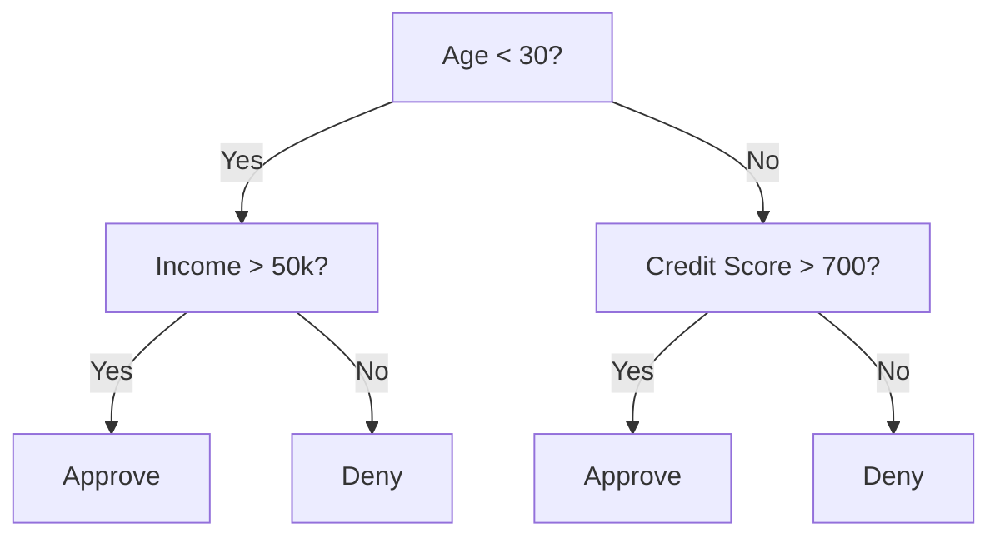
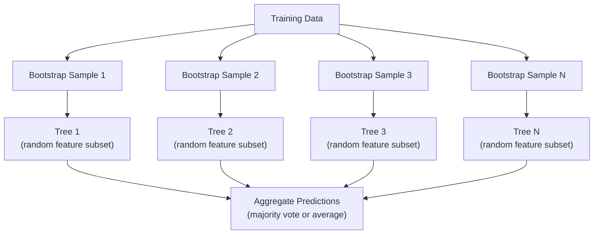

# 決策樹與隨機森林

> 決策樹就是一張流程圖。但一整座由它們組成的森林，是機器學習裡最強大的工具之一。

**類型：** 實作
**程式語言：** Python
**先修單元：** 階段 1（單元 09 資訊理論、06 機率）
**時間：** 約 90 分鐘

## 學習目標

- 實作吉尼不純度、熵與資訊增益的計算，用來找出決策樹的最佳分裂
- 從零打造一個決策樹分類器，並加上預先剪枝的控制項（最大樹深度、最小樣本數）
- 用自助抽樣與特徵隨機化建構一座隨機森林，並說明它為什麼能降低變異
- 比較 MDI 特徵重要性與置換重要性，並指出 MDI 在什麼情況下會有偏誤

## 問題所在

你手上有一份表格資料。列是樣本、欄是特徵，其中有一欄是你想預測的目標。你當然可以拿神經網路來硬上。但對表格資料來說，樹狀模型（決策樹、隨機森林、梯度提升樹）的表現始終勝過深度學習。Kaggle 上結構化資料的競賽是被 XGBoost 與 LightGBM 主導的，不是 transformer。

為什麼？樹不需要前處理就能吃下混合型別的特徵（數值與類別）。它不需要特徵工程就能處理非線性關係。它是可解釋的：你可以直接看著樹，確切知道某個預測是怎麼來的。而隨機森林靠平均許多棵樹，在中等大小的資料集上對過度擬合有很強的抵抗力。

這個單元會用遞迴分割從零打造決策樹，再在上面疊出一座隨機森林。你會實作分裂標準背後的數學（吉尼不純度、熵、資訊增益），並理解為什麼一群弱學習器的集成會變成一個強學習器。

## 核心概念

### 決策樹在做什麼

決策樹靠問一連串是／否問題，把特徵空間切成一塊塊矩形區域。



每個內部節點會拿某個特徵去和一個閾值比較。每個葉節點會給出一個預測。要分類一個新的資料點，你從根節點出發，沿著分支一路走到葉節點。

樹是自上而下建起來的：在每個節點挑出最能把資料分開的特徵與閾值。「最能」的定義來自分裂標準。

### 分裂標準：衡量不純度

在每個節點，我們手上有一組樣本。我們希望分裂之後產生的子節點盡可能「純」，也就是每個子節點裡大多只有一個類別。

**吉尼不純度**衡量的是：如果依照某節點的類別分布來給一個隨機抽出的樣本貼標籤，它被分錯的機率有多大。

```
Gini(S) = 1 - sum(p_k^2)

where p_k is the proportion of class k in set S.
```

對一個純節點（全是同一類）來說，Gini = 0。對一個 50/50 的二元分裂，Gini = 0.5。越低越好。

```
Example: 6 cats, 4 dogs

Gini = 1 - (0.6^2 + 0.4^2) = 1 - (0.36 + 0.16) = 0.48
```

**熵**衡量的是一個節點裡的資訊量（混亂程度）。階段 1 單元 09 已經談過。

```
Entropy(S) = -sum(p_k * log2(p_k))
```

對一個純節點來說，entropy = 0。對 50/50 的二元分裂，entropy = 1.0。越低越好。

```
Example: 6 cats, 4 dogs

Entropy = -(0.6 * log2(0.6) + 0.4 * log2(0.4))
        = -(0.6 * -0.737 + 0.4 * -1.322)
        = 0.442 + 0.529
        = 0.971 bits
```

**資訊增益**是分裂之後不純度（熵或 Gini）減少的量。

```
IG(S, feature, threshold) = Impurity(S) - weighted_avg(Impurity(S_left), Impurity(S_right))

where the weights are the proportions of samples in each child.
```

每個節點上的貪婪演算法是這樣：試過每一個特徵、每一個可能的閾值，然後挑出讓資訊增益最大的那組（特徵, 閾值）。

### 分裂是怎麼運作的

對於目前節點上有 n 個特徵、m 個樣本的資料集：

1. 對每個特徵 j（j = 1 到 n）：
   - 依特徵 j 把樣本排序
   - 把每一對相鄰且不同的值之間的中點都拿來當閾值試一次
   - 計算每個閾值的資訊增益
2. 選出資訊增益最高的特徵與閾值
3. 把資料分成左邊（feature <= threshold）與右邊（feature > threshold）
4. 對每個子節點遞迴下去

這種貪婪做法不保證能得到全域最佳的樹。要找出最佳的樹是 NP-hard。但貪婪分裂在實務上表現得很好。

### 停止條件

沒有停止條件的話，樹會一直長到每個葉節點都是純的（一個葉節點一個樣本）。這會把訓練資料完美背下來，而泛化能力糟到不行。

**預先剪枝**在樹還沒完全長成前就讓它停下來：
- 最大樹深度：樹達到設定的深度就停止分裂
- 每個葉節點的最小樣本數：節點裡的樣本少於 k 個就停
- 最小資訊增益：如果最好的分裂帶來的不純度改善低於某個閾值就停
- 最大葉節點數：限制葉節點的總數

**事後剪枝**先把整棵樹長完，再修回去：
- 代價複雜度剪枝（scikit-learn 採用的做法）：加上一個與葉節點數成正比的懲罰項。把懲罰調大就會得到更小的樹
- 誤差降低剪枝：如果移除一棵子樹不會讓驗證誤差上升，就把它移掉

預先剪枝比較簡單也比較快。事後剪枝往往能產生更好的樹，因為它不會過早停掉某些分裂——那些分裂本身看起來平庸，但可能通往後續有用的分裂。

### 用於迴歸的決策樹

做迴歸時，葉節點的預測值是該葉節點裡目標值的平均。分裂標準也跟著換：

**變異縮減**取代了資訊增益：

```
VR(S, feature, threshold) = Var(S) - weighted_avg(Var(S_left), Var(S_right))
```

挑出讓變異降低最多的那個分裂。樹會把輸入空間切成一塊塊區域，並在每塊區域裡預測一個常數（也就是平均值）。

### 隨機森林：集成的力量

單一棵決策樹的變異很高。資料上一點小改動就可能長出完全不同的樹。隨機森林靠平均許多棵樹來解決這件事。



有兩個隨機性的來源讓這些樹彼此不同：

**Bagging（自助聚合）：** 每棵樹都在一份自助抽樣上訓練，也就是從訓練資料裡有放回地隨機抽樣。每份自助抽樣大約會包含原始樣本的 63%（剩下的是袋外樣本，可以拿來做驗證）。

**特徵隨機化：** 每次分裂時只考慮一個隨機的特徵子集。分類的預設值是 sqrt(n_features)，迴歸則是 n_features/3。這能避免所有樹都在同一個強勢特徵上分裂。

關鍵的洞見是：平均許多彼此去相關的樹能降低變異，而不會增加偏誤。單獨看每棵樹可能都很平庸，但整個集成很強。

### 特徵重要性

隨機森林天生就能給出特徵重要性分數。最常見的做法是：

**平均不純度下降（MDI）：** 對每個特徵，把所有樹、所有用到該特徵的節點上的不純度下降量加總起來。在越早的分裂上帶來越大不純度下降的特徵就越重要。

```
importance(feature_j) = sum over all nodes where feature_j is used:
    (n_samples_at_node / n_total_samples) * impurity_decrease
```

這個做法很快（訓練時就順便算完），但它會偏向基數高的特徵，以及可能分裂點很多的特徵。

**置換重要性**是另一種選擇：把某個特徵的值打亂，再量測模型準確率掉了多少。比較可靠，但比較慢。

### 樹什麼時候會贏過神經網路

在表格資料上，樹與森林壓過神經網路。原因有好幾個：

| 因素 | 樹 | 神經網路 |
|--------|-------|----------------|
| 混合型別（數值 + 類別） | 原生支援 | 需要編碼 |
| 小型資料集（< 10k 列） | 表現良好 | 過度擬合 |
| 特徵交互作用 | 靠分裂自己找到 | 需要設計架構 |
| 可解釋性 | 完全透明 | 黑盒子 |
| 訓練時間 | 幾分鐘 | 幾小時 |
| 對超參數的敏感度 | 低 | 高 |

當資料具有空間或序列結構（影像、文字、音訊）時，神經網路才會勝出。面對一張扁平的特徵表格，樹才是預設選擇。

```figure
decision-tree-depth
```

## 動手實作

### 步驟 1：吉尼不純度與熵

把兩種分裂標準都從零寫出來，並驗證它們對「哪些分裂是好的」看法一致。

```python
import math

def gini_impurity(labels):
    n = len(labels)
    if n == 0:
        return 0.0
    counts = {}
    for label in labels:
        counts[label] = counts.get(label, 0) + 1
    return 1.0 - sum((c / n) ** 2 for c in counts.values())

def entropy(labels):
    n = len(labels)
    if n == 0:
        return 0.0
    counts = {}
    for label in labels:
        counts[label] = counts.get(label, 0) + 1
    return -sum(
        (c / n) * math.log2(c / n) for c in counts.values() if c > 0
    )
```

### 步驟 2：找出最佳分裂

試過每一個特徵、每一個閾值，回傳資訊增益最高的那一組。

```python
def information_gain(parent_labels, left_labels, right_labels, criterion="gini"):
    measure = gini_impurity if criterion == "gini" else entropy
    n = len(parent_labels)
    n_left = len(left_labels)
    n_right = len(right_labels)
    if n_left == 0 or n_right == 0:
        return 0.0
    parent_impurity = measure(parent_labels)
    child_impurity = (
        (n_left / n) * measure(left_labels) +
        (n_right / n) * measure(right_labels)
    )
    return parent_impurity - child_impurity
```

### 步驟 3：實作 DecisionTree 類別

遞迴分割、預測，以及特徵重要性的累計。`_build` 是整棵樹的核心：當一個節點已經是純的、或碰到預先剪枝的限制時就停下來，否則就取最佳分裂並往兩個子節點遞迴。

```python
import random

class DecisionTree:
    def __init__(self, max_depth=None, min_samples_split=2,
                 min_samples_leaf=1, criterion="gini",
                 max_features=None):
        self.max_depth = max_depth
        self.min_samples_split = min_samples_split
        self.min_samples_leaf = min_samples_leaf
        self.criterion = criterion
        self.max_features = max_features
        self.tree = None
        self.feature_importances_ = None

    def fit(self, X, y):
        self.n_features = len(X[0])
        self.feature_importances_ = [0.0] * self.n_features
        self.n_samples = len(X)
        self.tree = self._build(X, y, depth=0)
        total = sum(self.feature_importances_)
        if total > 0:
            self.feature_importances_ = [
                fi / total for fi in self.feature_importances_
            ]

    def predict(self, X):
        return [self._predict_one(x, self.tree) for x in X]

    def _build(self, X, y, depth):
        if len(set(y)) == 1:
            return {"leaf": True, "value": y[0]}

        if self.max_depth is not None and depth >= self.max_depth:
            return self._make_leaf(y)

        if len(y) < self.min_samples_split:
            return self._make_leaf(y)

        best_feature, best_threshold, best_gain = self._best_split(X, y)

        if best_feature is None or best_gain <= 0:
            return self._make_leaf(y)

        left_X, left_y, right_X, right_y = self._split_data(
            X, y, best_feature, best_threshold
        )

        if len(left_y) < self.min_samples_leaf or len(right_y) < self.min_samples_leaf:
            return self._make_leaf(y)

        weight = len(y) / self.n_samples
        self.feature_importances_[best_feature] += weight * best_gain

        return {
            "leaf": False,
            "feature": best_feature,
            "threshold": best_threshold,
            "left": self._build(left_X, left_y, depth + 1),
            "right": self._build(right_X, right_y, depth + 1),
        }

    def _make_leaf(self, y):
        counts = {}
        for label in y:
            counts[label] = counts.get(label, 0) + 1
        return {"leaf": True, "value": max(counts, key=counts.get)}

    def _best_split(self, X, y):
        best_feature = None
        best_threshold = None
        best_gain = -1.0

        if self.max_features == "sqrt":
            k = max(1, int(math.sqrt(self.n_features)))
            feature_indices = random.sample(range(self.n_features), k)
        elif isinstance(self.max_features, int):
            if self.max_features < 1:
                raise ValueError("max_features must be at least 1 when given as an integer")
            k = min(self.max_features, self.n_features)
            feature_indices = random.sample(range(self.n_features), k)
        else:
            feature_indices = list(range(self.n_features))

        for feature_idx in feature_indices:
            values = sorted(set(X[i][feature_idx] for i in range(len(X))))
            if len(values) <= 1:
                continue

            for i in range(len(values) - 1):
                threshold = (values[i] + values[i + 1]) / 2.0
                left_y = [y[j] for j in range(len(X)) if X[j][feature_idx] <= threshold]
                right_y = [y[j] for j in range(len(X)) if X[j][feature_idx] > threshold]

                if len(left_y) < self.min_samples_leaf or len(right_y) < self.min_samples_leaf:
                    continue

                gain = information_gain(y, left_y, right_y, self.criterion)
                if gain > best_gain:
                    best_gain = gain
                    best_feature = feature_idx
                    best_threshold = threshold

        return best_feature, best_threshold, best_gain

    def _split_data(self, X, y, feature, threshold):
        left_X, left_y, right_X, right_y = [], [], [], []
        for i in range(len(X)):
            if X[i][feature] <= threshold:
                left_X.append(X[i])
                left_y.append(y[i])
            else:
                right_X.append(X[i])
                right_y.append(y[i])
        return left_X, left_y, right_X, right_y

    def _predict_one(self, x, node):
        if node["leaf"]:
            return node["value"]
        if x[node["feature"]] <= node["threshold"]:
            return self._predict_one(x, node["left"])
        return self._predict_one(x, node["right"])
```

### 步驟 4：實作 RandomForest 類別

自助抽樣、特徵隨機化，以及多數投票。

```python
class RandomForest:
    def __init__(self, n_trees=100, max_depth=None,
                 min_samples_split=2, max_features="sqrt",
                 criterion="gini"):
        self.n_trees = n_trees
        self.max_depth = max_depth
        self.min_samples_split = min_samples_split
        self.max_features = max_features
        self.criterion = criterion
        self.trees = []

    def fit(self, X, y):
        n = len(X)
        for _ in range(self.n_trees):
            indices = [random.randint(0, n - 1) for _ in range(n)]
            X_boot = [X[i] for i in indices]
            y_boot = [y[i] for i in indices]
            tree = DecisionTree(
                max_depth=self.max_depth,
                min_samples_split=self.min_samples_split,
                max_features=self.max_features,
                criterion=self.criterion,
            )
            tree.fit(X_boot, y_boot)
            self.trees.append(tree)

    def predict(self, X):
        all_preds = [tree.predict(X) for tree in self.trees]
        predictions = []
        for i in range(len(X)):
            votes = {}
            for preds in all_preds:
                v = preds[i]
                votes[v] = votes.get(v, 0) + 1
            predictions.append(max(votes, key=votes.get))
        return predictions
```

完整實作與所有輔助方法請見 `code/trees.py`。

## 框架應用

用 scikit-learn 訓練一座隨機森林只要三行：

```python
from sklearn.ensemble import RandomForestClassifier
from sklearn.datasets import load_iris
from sklearn.model_selection import train_test_split

X, y = load_iris(return_X_y=True)
X_train, X_test, y_train, y_test = train_test_split(X, y, random_state=42)

rf = RandomForestClassifier(n_estimators=100, random_state=42)
rf.fit(X_train, y_train)
print(f"Accuracy: {rf.score(X_test, y_test):.4f}")
print(f"Feature importances: {rf.feature_importances_}")
```

實務上，梯度提升樹（XGBoost、LightGBM、CatBoost）往往比隨機森林更強，因為它們是循序建樹的，每一棵樹都在修正前面那些樹的錯誤。但隨機森林比較難設定壞掉，而且幾乎不需要調超參數。

## 產出交付

這個單元會產出 `outputs/prompt-tree-interpreter.md`——一個為業務關係人解讀決策樹分裂的提示詞。把訓練好的樹的結構（深度、特徵、分裂閾值、準確率）餵給它，它會把模型翻譯成白話規則、把特徵重要性排序、標記出過度擬合或資料洩漏，並建議下一步該做什麼。任何時候你需要向不讀程式碼的人解釋樹狀模型，就用它。

## 練習

1. 在一份有 3 個類別的 2D 資料集上訓練單一棵決策樹。手動追蹤每次分裂，並畫出矩形的決策邊界。比較 max_depth=2 與 max_depth=10 時的邊界。

2. 為迴歸樹實作變異縮減分裂。從 y = sin(x) + noise 產生 200 個點，並配適你的迴歸樹。把樹的分段常數預測與真實曲線畫在一起比較。

3. 分別用 1、5、10、50、200 棵樹建構隨機森林。把訓練準確率與測試準確率對樹的數量畫出來。你會觀察到測試準確率會趨於平坦，但不會下降（森林能抵抗過度擬合）。

4. 在 5 份不同的資料集上比較吉尼不純度與熵這兩種分裂標準。量測準確率與樹深度。大多數情況下，兩者的結果幾乎相同。解釋為什麼。

5. 實作置換重要性。在一份「某個特徵其實是隨機雜訊、但基數很高」的資料集上，把它和 MDI 重要性做比較。MDI 會把那個雜訊特徵排得很前面，置換重要性不會。

## 關鍵術語

| 術語 | 大家怎麼說 | 實際上是什麼 |
|------|----------------|----------------------|
| 決策樹 | 「一張做預測的流程圖」 | 一種靠學習一連串 if/else 分裂，把特徵空間切成矩形區域的模型 |
| 吉尼不純度 | 「這個節點有多混」 | 在某節點把一個隨機樣本分錯的機率。0 = 純，二元情況下 0.5 = 不純度最大 |
| 熵 | 「節點裡的混亂程度」 | 某節點上的資訊量。0 = 純，二元情況下 1.0 = 不確定性最大。來自資訊理論 |
| 資訊增益 | 「這個分裂有多好」 | 分裂之後不純度減少的量。挑選分裂時採用的貪婪標準 |
| 預先剪枝 | 「讓樹提早停下來」 | 藉由設定最大深度、最小樣本數或最小增益閾值，提早停止樹的生長 |
| 事後剪枝 | 「長完再修掉」 | 先長出完整的樹，再把那些無法改善驗證表現的子樹移除 |
| Bagging | 「在隨機子集上訓練」 | 自助聚合。讓每個模型在一份不同的有放回隨機抽樣上訓練 |
| 隨機森林 | 「一堆樹」 | 決策樹的集成，每棵樹都在一份自助抽樣上訓練，且每次分裂只用隨機的特徵子集 |
| 特徵重要性（MDI） | 「哪些特徵重要」 | 每個特徵貢獻的不純度下降總量，跨所有樹與所有節點加總 |
| 置換重要性 | 「打亂再檢查」 | 把某個特徵的值隨機打亂後準確率掉了多少。對含雜訊的特徵比 MDI 更可靠 |
| 變異縮減 | 「資訊增益的迴歸版」 | 資訊增益在迴歸樹上的對應物。挑出讓目標變異降低最多的那個分裂 |
| 自助抽樣 | 「會重複的隨機抽樣」 | 從原始資料集有放回抽出的隨機樣本。大小相同，但會有重複 |

## 延伸閱讀

- [Breiman: Random Forests (2001)](https://link.springer.com/article/10.1023/A:1010933404324) - 隨機森林的原始論文
- [Grinsztajn et al.: Why do tree-based models still outperform deep learning on tabular data? (2022)](https://arxiv.org/abs/2207.08815) - 在表格任務上對樹與神經網路的嚴謹比較
- [scikit-learn Decision Trees documentation](https://scikit-learn.org/stable/modules/tree.html) - 附視覺化工具的實用指南
- [XGBoost: A Scalable Tree Boosting System (Chen & Guestrin, 2016)](https://arxiv.org/abs/1603.02754) - 主導 Kaggle 的梯度提升論文
