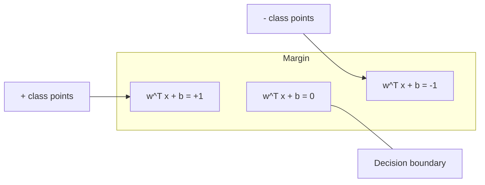
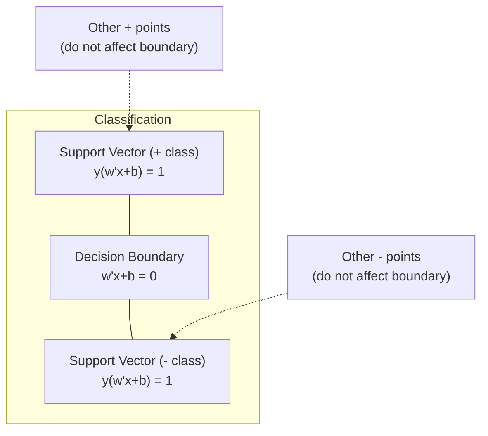
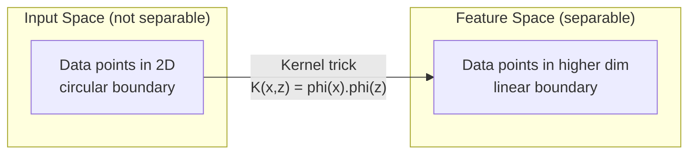

# 支持向量機

> 在兩個類別之間找出最寬的那條街。整個想法就只有這樣。

**類型：** 實作
**程式語言：** Python
**先修單元：** 階段 1（08 最佳化、14 範數與距離、18 凸最佳化）
**時間：** 約 90 分鐘

## 學習目標

- 用合頁損失與梯度下降，在原始問題（primal）上從零實作線性 SVM
- 說明最大間隔原則，並從訓練好的模型中找出支持向量
- 比較 linear、polynomial 與 RBF 核，並說明核技巧如何避免明確做高維映射
- 評估 C 參數在間隔寬度與分類錯誤之間所控制的取捨

## 問題所在

你有兩個類別的資料點，需要畫一條線（或一個超平面）把它們分開。有無限多條線都可以做到。你該挑哪一條？

挑間隔最大的那一條。間隔是決策邊界到兩側最近資料點之間的距離。間隔越寬，代表分類器越有信心，對沒見過的資料也泛化得越好。

這個直覺帶出了支持向量機——ML 裡數學上最優雅的演算法之一。在深度學習出現之前，SVM 是主流的分類方法；到今天，遇到小資料集、高維度資料，或是需要一個有理論保證、原理清楚的模型時，它仍然是最好的選擇。

SVM 直接接回階段 1：最佳化問題是凸的（第 18 課），間隔是用範數來度量的（第 14 課），而核技巧則利用內積來處理非線性邊界，完全不必真的在高維空間裡計算。

## 核心概念

### 最大間隔分類器

給定線性可分的資料，標籤 y_i 屬於 {-1, +1}，特徵向量為 x_i，我們想找一個超平面 w^T x + b = 0 把兩個類別分開。

點 x_i 到超平面的距離是：

```
distance = |w^T x_i + b| / ||w||
```

對一個被正確分類的點：y_i * (w^T x_i + b) > 0。間隔則是超平面到任一側最近點的距離的兩倍。



最佳化問題：

```
maximize    2 / ||w||     (the margin width)
subject to  y_i * (w^T x_i + b) >= 1  for all i
```

等價的寫法（最小化 ||w||^2 比較好最佳化）：

```
minimize    (1/2) ||w||^2
subject to  y_i * (w^T x_i + b) >= 1  for all i
```

這是一個凸的二次規劃問題，有唯一的全域解。剛好落在間隔邊界上的那些資料點（也就是 y_i * (w^T x_i + b) = 1 的點）就是支持向量。只有它們決定了決策邊界。你把任何一個非支持向量的點移動或刪掉，邊界都不會變。

### 支持向量：關鍵的少數



大部分的訓練點其實無關緊要，只有支持向量重要。這也是 SVM 在預測階段很省記憶體的原因：你只需要存下支持向量，不必存整個訓練集。

支持向量的數量也給出了泛化誤差的一個上界。相對於資料集大小來說，支持向量越少，代表泛化越好。

### 軟間隔：用 C 參數處理雜訊

真實資料很少能被完美分開。有些點可能落在邊界的錯誤一側，或是落在間隔之內。軟間隔的寫法引入鬆弛變數，允許這些違規。

```
minimize    (1/2) ||w||^2 + C * sum(xi_i)
subject to  y_i * (w^T x_i + b) >= 1 - xi_i
            xi_i >= 0  for all i
```

鬆弛變數 xi_i 度量第 i 個點違反間隔的程度。C 控制這個取捨：

| C 值 | 行為 |
|---------|----------|
| C 大 | 對違規重罰。間隔窄、誤分類少。會過度擬合 |
| C 小 | 容許較多違規。間隔寬、誤分類多。會擬合不足 |

C 就是正則化強度的倒數。C 大 = 正則化較弱；C 小 = 正則化較強。

### 合頁損失：SVM 的損失函式

軟間隔 SVM 可以改寫成一個沒有約束的最佳化問題：

```
minimize    (1/2) ||w||^2 + C * sum(max(0, 1 - y_i * (w^T x_i + b)))
```

其中 max(0, 1 - y_i * f(x_i)) 這一項就是合頁損失。當點被正確分類且落在間隔之外時，它是零；當點落在間隔之內或被誤分類時，它是線性的。

```
Hinge loss for a single point:

loss
  |
  | \
  |  \
  |   \
  |    \
  |     \_______________
  |
  +-----|-----|-------->  y * f(x)
       0     1

Zero loss when y*f(x) >= 1 (correctly classified, outside margin).
Linear penalty when y*f(x) < 1.
```

跟邏輯損失（邏輯迴歸用的那個）比較：

```
Hinge:     max(0, 1 - y*f(x))          Hard cutoff at margin
Logistic:  log(1 + exp(-y*f(x)))        Smooth, never exactly zero
```

合頁損失會產生稀疏解（只有支持向量的貢獻不為零）。邏輯損失則用到了所有資料點。這讓 SVM 在預測階段更省記憶體。

### 用梯度下降訓練線性 SVM

你可以直接對合頁損失加上 L2 正則化做梯度下降來訓練線性 SVM，不必去解那個有約束的 QP：

```
L(w, b) = (lambda/2) * ||w||^2 + (1/n) * sum(max(0, 1 - y_i * (w^T x_i + b)))

Gradient with respect to w:
  If y_i * (w^T x_i + b) >= 1:  dL/dw = lambda * w
  If y_i * (w^T x_i + b) < 1:   dL/dw = lambda * w - y_i * x_i

Gradient with respect to b:
  If y_i * (w^T x_i + b) >= 1:  dL/db = 0
  If y_i * (w^T x_i + b) < 1:   dL/db = -y_i
```

這叫做原始問題（primal）的寫法。它每一個 epoch 的複雜度是 O(n * d)，其中 n 是樣本數、d 是特徵數。對於大型、稀疏、高維度的資料（例如文字分類），這非常快。

### 對偶問題與核技巧

SVM 問題的拉格朗日對偶（來自階段 1 第 18 課的 KKT 條件）是：

```
maximize    sum(alpha_i) - (1/2) * sum_ij(alpha_i * alpha_j * y_i * y_j * (x_i . x_j))
subject to  0 <= alpha_i <= C
            sum(alpha_i * y_i) = 0
```

對偶問題裡只出現資料點之間的內積 x_i . x_j。這就是關鍵洞見。把每一個內積換成核函式 K(x_i, x_j)，SVM 就能學出非線性的邊界，而且從頭到尾都不需要明確算出那個轉換。

```
Linear kernel:      K(x, z) = x . z
Polynomial kernel:  K(x, z) = (x . z + c)^d
RBF (Gaussian):     K(x, z) = exp(-gamma * ||x - z||^2)
```

RBF 核把資料映射到一個無限維的空間。在輸入空間中靠得很近的點，核值接近 1；離得很遠的點，核值接近 0。它可以學出任何平滑的決策邊界。



核技巧在高維空間中算出內積，卻從來不真的走進那個空間。以 D 維空間裡的 d 次 polynomial 核為例，明確展開的特徵空間有 O(D^d) 個維度，但 K(x, z) 只要 O(D) 的時間就算得出來。

### 用 SVM 做迴歸（SVR）

支持向量迴歸在資料周圍配一根寬度為 epsilon 的管子。落在管子裡的點損失為零，落在管子外的點則受到線性的懲罰。

```
minimize    (1/2) ||w||^2 + C * sum(xi_i + xi_i*)
subject to  y_i - (w^T x_i + b) <= epsilon + xi_i
            (w^T x_i + b) - y_i <= epsilon + xi_i*
            xi_i, xi_i* >= 0
```

epsilon 參數控制管子的寬度。管子越寬 = 支持向量越少 = 配適越平滑；管子越窄 = 支持向量越多 = 配適越貼合資料。

### SVM 為什麼輸給了深度學習（以及它什麼時候還是贏）

從 1990 年代末到 2010 年代初，SVM 一直是 ML 的主流。深度學習之所以超越它，有幾個原因：

| 因素 | SVM | 深度學習 |
|--------|------|---------------|
| 特徵工程 | 必須自己做 | 自己學特徵 |
| 可擴展性 | 核方法是 O(n^2) 到 O(n^3) | 搭配 SGD 每個 epoch O(n) |
| 影像／文字／音訊 | 需要手工設計的特徵 | 直接從原始資料學 |
| 大型資料集（>100k） | 慢 | 擴展性好 |
| GPU 加速 | 幫助有限 | 大幅加速 |

在這些情況下，SVM 還是贏：
- 小資料集（幾百到一兩千筆樣本）
- 高維度稀疏資料（用 TF-IDF 特徵的文字）
- 你需要數學上的保證時（間隔的界）
- 訓練時間必須壓到最低時（線性 SVM 非常快）
- 間隔結構清楚的二元分類問題
- 異常偵測（one-class SVM）

```figure
svm-margin
```

## 動手實作

### 步驟 1：合頁損失與梯度

打地基。算出一個批次的合頁損失以及它的梯度。

```python
def hinge_loss(X, y, w, b):
    n = len(X)
    total_loss = 0.0
    for i in range(n):
        margin = y[i] * (dot(w, X[i]) + b)
        total_loss += max(0.0, 1.0 - margin)
    return total_loss / n
```

### 步驟 2：用梯度下降實作線性 SVM

透過最小化帶正則化的合頁損失來訓練。不需要 QP 求解器。

```python
class LinearSVM:
    def __init__(self, lr=0.001, lambda_param=0.01, n_epochs=1000):
        self.lr = lr
        self.lambda_param = lambda_param
        self.n_epochs = n_epochs
        self.w = None
        self.b = 0.0

    def fit(self, X, y):
        n_features = len(X[0])
        self.w = [0.0] * n_features
        self.b = 0.0

        for epoch in range(self.n_epochs):
            for i in range(len(X)):
                margin = y[i] * (dot(self.w, X[i]) + self.b)
                if margin >= 1:
                    self.w = [wj - self.lr * self.lambda_param * wj
                              for wj in self.w]
                else:
                    self.w = [wj - self.lr * (self.lambda_param * wj - y[i] * X[i][j])
                              for j, wj in enumerate(self.w)]
                    self.b -= self.lr * (-y[i])

    def predict(self, X):
        return [1 if dot(self.w, x) + self.b >= 0 else -1 for x in X]
```

### 步驟 3：核函式

實作 linear、polynomial 與 RBF 核。

```python
def linear_kernel(x, z):
    return dot(x, z)

def polynomial_kernel(x, z, degree=3, c=1.0):
    return (dot(x, z) + c) ** degree

def rbf_kernel(x, z, gamma=0.5):
    diff = [xi - zi for xi, zi in zip(x, z)]
    return math.exp(-gamma * dot(diff, diff))
```

### 步驟 4：間隔與支持向量的判定

訓練完之後，找出哪些點是支持向量，並算出間隔的寬度。

```python
def find_support_vectors(X, y, w, b, tol=1e-3):
    support_vectors = []
    for i in range(len(X)):
        margin = y[i] * (dot(w, X[i]) + b)
        if abs(margin - 1.0) < tol:
            support_vectors.append(i)
    return support_vectors
```

完整的實作與所有示範請看 `code/svm.py`。

## 框架應用

改用 scikit-learn：

```python
from sklearn.svm import SVC, LinearSVC, SVR
from sklearn.preprocessing import StandardScaler
from sklearn.pipeline import Pipeline

clf = Pipeline([
    ("scaler", StandardScaler()),
    ("svm", SVC(kernel="rbf", C=1.0, gamma="scale")),
])
clf.fit(X_train, y_train)
print(f"Accuracy: {clf.score(X_test, y_test):.4f}")
print(f"Support vectors: {clf['svm'].n_support_}")
```

重要：訓練 SVM 之前一定要先做特徵縮放。SVM 對特徵的尺度很敏感，因為間隔取決於 ||w||，沒有縮放過的特徵會把幾何關係扭曲掉。

資料集很大時，請用 `LinearSVC`（原始問題的寫法，每個 epoch O(n)），而不是 `SVC`（對偶問題的寫法，O(n^2) 到 O(n^3)）：

```python
from sklearn.svm import LinearSVC

clf = Pipeline([
    ("scaler", StandardScaler()),
    ("svm", LinearSVC(C=1.0, max_iter=10000)),
])
```

## 練習

1. 生成一個二維的線性可分資料集。訓練你的 LinearSVM 並找出支持向量。驗證這些支持向量就是離決策邊界最近的那些點。

2. 在一個帶雜訊的資料集上，把 C 從 0.001 變化到 1000。為每一個 C 值畫出決策邊界。觀察它如何從寬間隔（擬合不足）過渡到窄間隔（過度擬合）。

3. 造一個類別邊界是圓形（不是線性）的資料集。證明線性 SVM 會失敗。算出 RBF 核矩陣，並說明在核所誘導的特徵空間裡，這些類別變成可分的了。

4. 在同一個資料集上比較合頁損失與邏輯損失。分別訓練一個線性 SVM 和一個邏輯迴歸。數一數各自有多少訓練點對模型的決策邊界有貢獻（支持向量 vs 全部的點）。

5. 實作 SVR（epsilon 不敏感損失）。把它配適到 y = sin(x) + noise。畫出預測值周圍的 epsilon 管子，並標出支持向量（落在管子外的點）。

## 關鍵術語

| 術語 | 實際上是什麼 |
|------|----------------------|
| 支持向量 | 離決策邊界最近的那些訓練點。只有它們決定了超平面 |
| 間隔 | 決策邊界到最近的支持向量之間的距離。SVM 要把它最大化 |
| 合頁損失 | max(0, 1 - y*f(x))。被正確分類且落在間隔之外時為零，否則是線性懲罰 |
| C 參數 | 間隔寬度與分類錯誤之間的取捨。C 大 = 間隔窄，C 小 = 間隔寬 |
| 軟間隔 | 透過鬆弛變數容許違反間隔的 SVM 寫法。可以處理不可分的資料 |
| 核技巧 | 在高維特徵空間中計算內積，卻不必明確映射到那個空間 |
| Linear 核 | K(x, z) = x . z。等同於一般的內積。適用於線性可分的資料 |
| RBF 核 | K(x, z) = exp(-gamma * \|\|x-z\|\|^2)。映射到無限多維。可以學出任何平滑的邊界 |
| Polynomial 核 | K(x, z) = (x . z + c)^d。映射到由多項式組合構成的特徵空間 |
| 對偶問題 | SVM 問題的另一種寫法，只依賴資料點之間的內積。讓核函式得以派上場 |
| SVR | 支持向量迴歸。在資料周圍配一根 epsilon 管子。管子裡的點損失為零 |
| 鬆弛變數 | xi_i：度量一個點違反間隔的程度。對落在間隔外且正確分類的點為零 |
| 最大間隔 | 挑選那個讓「到兩類最近點的距離」最大的超平面的原則 |

## 延伸閱讀

- [Vapnik: The Nature of Statistical Learning Theory (1995)](https://link.springer.com/book/10.1007/978-1-4757-3264-1) —— SVM 與統計學習理論的奠基之作
- [Cortes & Vapnik: Support-vector networks (1995)](https://link.springer.com/article/10.1007/BF00994018) —— 最原始的 SVM 論文
- [Platt: Sequential Minimal Optimization (1998)](https://www.microsoft.com/en-us/research/publication/sequential-minimal-optimization-a-fast-algorithm-for-training-support-vector-machines/) —— 讓 SVM 訓練變得實用的 SMO 演算法
- [scikit-learn SVM documentation](https://scikit-learn.org/stable/modules/svm.html) —— 實務指南，含實作細節
- [LIBSVM: A Library for Support Vector Machines](https://www.csie.ntu.edu.tw/~cjlin/libsvm/) —— 大多數 SVM 實作背後的那個 C++ 函式庫
