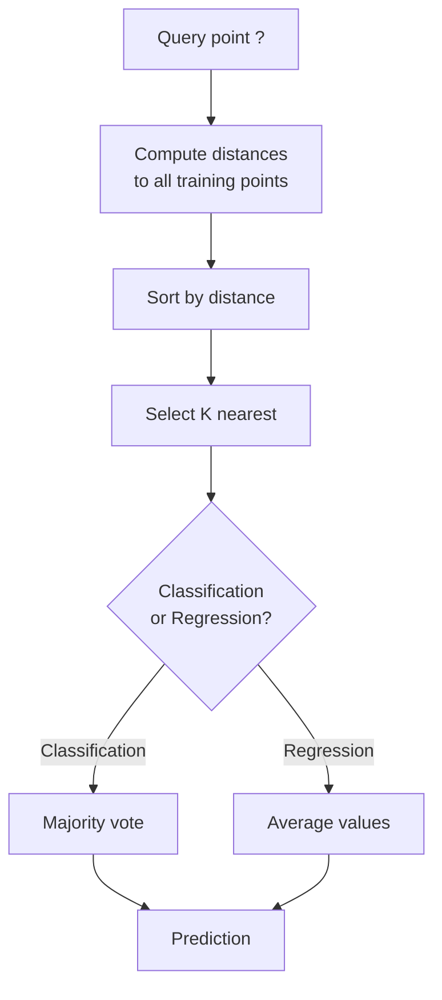
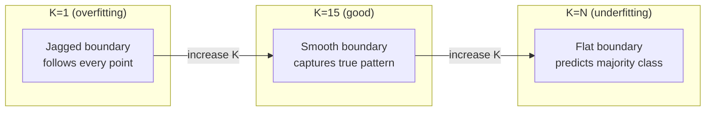
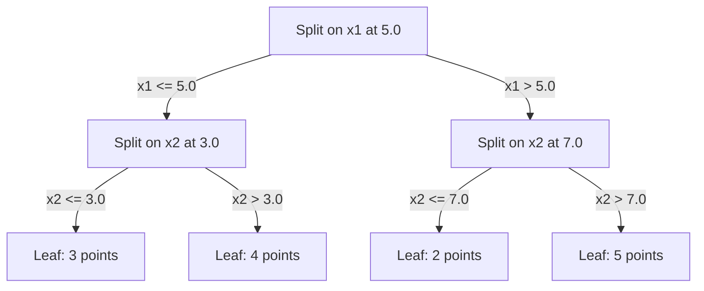

# k 近鄰與距離

> 全部存下來。要預測就看看鄰居怎麼說。最簡單，卻真的能用的演算法。

**類型：** 實作
**程式語言：** Python
**先修單元：** 階段 1（單元 14 範數與距離）
**時間：** 約 90 分鐘

## 學習目標

- 從零實作 KNN 分類與迴歸，K 值與距離加權投票都可調整
- 比較 L1、L2、餘弦與 Minkowski 等距離度量，並為特定資料型態挑出合適的那一個
- 說明維度詛咒，並示範 KNN 為什麼在高維空間裡會失效
- 打造一棵 KD 樹來加速最近鄰搜尋，並分析它在什麼情況下勝過暴力搜尋

## 問題所在

你手上有一個資料集。一個新的資料點進來了。你需要幫它分類，或預測它的數值。你不從資料裡學參數（不像線性迴歸或 SVM 那樣），而是直接找出離這個新點最近的 K 個訓練點，讓它們投票。

這就是 k 近鄰。沒有訓練階段。沒有要學的參數。沒有要最小化的損失函式。你把整個訓練集存起來，等到預測的時候才算距離。

聽起來簡單到不像能用。但 KNN 在許多問題上的競爭力出乎意料地強，尤其是在中小型資料集上；而且把它徹底搞懂，會帶出幾個根本概念：距離度量的選擇（接上階段 1 單元 14）、維度詛咒，以及懶惰學習與積極學習的差別。

KNN 在現代 AI 裡到處都在，只是換了名字。向量資料庫做的是對嵌入的 KNN 搜尋。檢索增強生成（RAG）找的是最近的 K 個文件片段。推薦系統找的是相似的使用者或商品。演算法是同一個，不同的只是規模與資料結構。

## 核心概念

### KNN 怎麼運作

給定一個有標籤的資料集，以及一個新的查詢點：

1. 算出查詢點到資料集中每一個點的距離
2. 依距離排序
3. 取最近的 K 個點
4. 分類任務：這 K 個鄰居多數投票
5. 迴歸任務：這 K 個鄰居數值的平均（或加權平均）



整個演算法就這樣。不用擬合。不用梯度下降。沒有 epoch。

### 挑選 K

K 是唯一的超參數。它控制的是偏差與變異之間的取捨：

| K | 行為 |
|---|----------|
| K = 1 | 決策邊界貼著每一個點跑。訓練誤差為零。高變異。過度擬合 |
| 小 K（3-5） | 對局部結構敏感。能捕捉複雜的邊界 |
| 大 K | 邊界更平滑。更耐雜訊。可能擬合不足 |
| K = N | 對每一個點都預測多數類別。偏差最大 |

對 N 個點的資料集，常見的起點是 K = sqrt(N)。二元分類請用奇數 K，以免出現平票。



### 距離度量

距離函式定義了「近」是什麼意思。不同的度量會給出不同的鄰居，也就給出不同的預測。

**L2（歐氏距離）** 是預設選擇。直線距離。

```
d(a, b) = sqrt(sum((a_i - b_i)^2))
```

它對特徵尺度很敏感。在 KNN 裡用 L2 之前，一定要先把特徵標準化。

**L1（曼哈頓距離）** 把絕對差值加起來。因為不做平方，所以比 L2 更耐離群值。

```
d(a, b) = sum(|a_i - b_i|)
```

**餘弦距離** 衡量向量之間的夾角，忽略大小。處理文字與嵌入資料時不可或缺。

```
d(a, b) = 1 - (a . b) / (||a|| * ||b||)
```

**Minkowski** 用參數 p 把 L1 與 L2 一般化。

```
d(a, b) = (sum(|a_i - b_i|^p))^(1/p)

p=1: Manhattan
p=2: Euclidean
p->inf: Chebyshev (max absolute difference)
```

該用哪個度量，取決於資料：

| 資料型態 | 最合適的度量 | 為什麼 |
|-----------|------------|-----|
| 數值特徵、尺度相當 | L2（歐氏距離） | 預設選擇，適合空間性資料 |
| 數值特徵、有離群值 | L1（曼哈頓距離） | 有韌性，不會放大巨大的差異 |
| 文字嵌入 | 餘弦 | 大小是雜訊，方向才是意義 |
| 高維稀疏 | 餘弦或 L1 | L2 深受維度詛咒之害 |
| 混合型態 | 自訂距離 | 依特徵型態分別組合度量 |

### 加權 KNN

標準的 KNN 給 K 個鄰居一樣的權重。但距離 0.1 的鄰居，理應比距離 5.0 的鄰居更有份量。

**距離加權 KNN** 讓每個鄰居的權重與距離成反比：

```
weight_i = 1 / (distance_i + epsilon)

For classification: weighted vote
For regression:     weighted average = sum(w_i * y_i) / sum(w_i)
```

epsilon 是為了避免查詢點剛好與某個訓練點重合時發生除以零。

加權 KNN 對 K 的選擇比較不敏感，因為遠處的鄰居無論如何都貢獻不了多少。

### 維度詛咒

KNN 的表現在高維度下會退化。這不是模糊的擔憂，而是數學事實。

**問題一：距離會收斂。** 隨著維度上升，最大距離與最小距離的比值會趨近 1。所有點離查詢點都變得一樣「遠」。

```
In d dimensions, for random uniform points:

d=2:    max_dist / min_dist = varies widely
d=100:  max_dist / min_dist ~ 1.01
d=1000: max_dist / min_dist ~ 1.001

When all distances are nearly equal, "nearest" is meaningless.
```

**問題二：體積會爆炸。** 想在固定比例的資料裡湊到 K 個鄰居，你得把搜尋半徑撐大到覆蓋特徵空間裡大得多的一塊。高維空間裡的「鄰域」幾乎涵蓋了整個空間。

**問題三：角落主宰一切。** 在 d 維的單位超立方體裡，體積大部分集中在角落附近，而不是中心。隨著 d 變大，內接於立方體的超球所佔的體積比例會趨近於零。

實務上的後果：KNN 在大約 20 到 50 個特徵以內都還好用。再多下去，你就得先做降維（PCA、UMAP、t-SNE）才能套用 KNN，或者改用能利用資料內在低維結構的樹狀搜尋結構。

### KD 樹：快速的最近鄰搜尋

暴力版的 KNN 會算出查詢點到每一個訓練點的距離，每次查詢是 O(n * d)。資料集一大，這就太慢了。

KD 樹沿著特徵軸遞迴切分空間。每一層都挑一個維度，在中位數的位置切開。



要找最近鄰，就沿著樹走到包含查詢點的葉節點，然後回溯，只在鄰近的分割區「可能藏著更近的點」時才去檢查它。

平均查詢時間：低維度下是 O(log n)。但在高維度（d > 20）時，KD 樹會退化成 O(n)，因為回溯能剪掉的分支越來越少。

### 球樹：中等維度下的更好選擇

球樹把資料切進一層層嵌套的超球裡，而不是與座標軸對齊的方盒。每個節點定義一顆球（中心 + 半徑），包住該子樹裡所有的點。

比 KD 樹好的地方：
- 在中等維度（約 50 維以內）表現更好
- 能處理不與座標軸對齊的結構
- 邊界包得更緊，搜尋時能剪掉更多分支

KD 樹與球樹都是精確演算法。若要做真正大規模的搜尋（數百萬個點、數百個維度），就得改用近似最近鄰方法（HNSW、IVF、乘積量化）。這些在階段 1 單元 14 講過。

### 懶惰學習與積極學習

KNN 是懶惰學習器：訓練時什麼都不做，全部的工作都留到預測時。多數其他演算法（線性迴歸、SVM、神經網路）是積極學習器：訓練時做大量運算，把模型壓成精簡的形式，之後預測就很快。

| 面向 | 懶惰（KNN） | 積極（SVM、神經網路） |
|--------|------------|------------------------|
| 訓練時間 | O(1)，只是把資料存起來 | O(n * epochs) |
| 預測時間 | 每次查詢 O(n * d) | O(d) 或 O(參數量) |
| 預測時的記憶體 | 存下整個訓練集 | 只存模型參數 |
| 面對新資料 | 直接加點就好 | 得重新訓練模型 |
| 決策邊界 | 隱含的，當場算出來 | 明確的，訓練完就固定了 |

懶惰學習最適合這些情況：
- 資料集經常變動（加點、刪點都不必重新訓練）
- 你只需要對極少數查詢做預測
- 你希望訓練時間為零
- 資料集小到暴力搜尋就夠快

### 用 KNN 做迴歸

迴歸版的 KNN 不做多數投票，而是把 K 個鄰居的目標值平均起來。

```
prediction = (1/K) * sum(y_i for i in K nearest neighbors)

Or with distance weighting:
prediction = sum(w_i * y_i) / sum(w_i)
where w_i = 1 / distance_i
```

KNN 迴歸給出的是分段常數的預測（加了權重就變成分段平滑）。它無法外推到訓練資料的範圍之外。如果訓練目標值全都落在 0 到 100 之間，KNN 永遠不會預測出 200。

```figure
knn-smoothness
```

## 動手實作

### 步驟 1：距離函式

實作 L1、L2、餘弦與 Minkowski 距離。這些直接接上階段 1 單元 14。

```python
import math

def l2_distance(a, b):
    return math.sqrt(sum((ai - bi) ** 2 for ai, bi in zip(a, b)))

def l1_distance(a, b):
    return sum(abs(ai - bi) for ai, bi in zip(a, b))

def cosine_distance(a, b):
    dot_val = sum(ai * bi for ai, bi in zip(a, b))
    norm_a = math.sqrt(sum(ai ** 2 for ai in a))
    norm_b = math.sqrt(sum(bi ** 2 for bi in b))
    if norm_a == 0 or norm_b == 0:
        return 1.0
    return 1.0 - dot_val / (norm_a * norm_b)

def minkowski_distance(a, b, p=2):
    if p == float('inf'):
        return max(abs(ai - bi) for ai, bi in zip(a, b))
    return sum(abs(ai - bi) ** p for ai, bi in zip(a, b)) ** (1 / p)
```

### 步驟 2：KNN 分類器與迴歸器

打造完整的 KNN，K 值、距離度量與要不要做距離加權都可以設定。

```python
class KNN:
    def __init__(self, k=5, distance_fn=l2_distance, weighted=False,
                 task="classification"):
        self.k = k
        self.distance_fn = distance_fn
        self.weighted = weighted
        self.task = task
        self.X_train = None
        self.y_train = None

    def fit(self, X, y):
        self.X_train = X
        self.y_train = y

    def predict(self, X):
        return [self._predict_one(x) for x in X]
```

### 步驟 3：用 KD 樹加速搜尋

從零打造一棵 KD 樹，遞迴地在每個維度的中位數上切分。

```python
class KDTree:
    def __init__(self, X, indices=None, depth=0):
        # Recursively partition the data
        self.axis = depth % len(X[0])
        # Split on median of the current axis
        ...

    def query(self, point, k=1):
        # Traverse to leaf, then backtrack
        ...
```

完整實作連同所有輔助方法與示範，請看 `code/knn.py`。

### 步驟 4：特徵縮放

KNN 需要特徵縮放，因為距離對特徵的量級很敏感。一個範圍 0 到 1000 的特徵，會壓過一個範圍 0 到 1 的特徵。

```python
def standardize(X):
    n = len(X)
    d = len(X[0])
    means = [sum(X[i][j] for i in range(n)) / n for j in range(d)]
    stds = [
        max(1e-10, (sum((X[i][j] - means[j]) ** 2 for i in range(n)) / n) ** 0.5)
        for j in range(d)
    ]
    return [[((X[i][j] - means[j]) / stds[j]) for j in range(d)] for i in range(n)], means, stds
```

## 框架應用

用 scikit-learn：

```python
from sklearn.neighbors import KNeighborsClassifier
from sklearn.preprocessing import StandardScaler
from sklearn.pipeline import Pipeline

clf = Pipeline([
    ("scaler", StandardScaler()),
    ("knn", KNeighborsClassifier(n_neighbors=5, metric="euclidean")),
])
clf.fit(X_train, y_train)
print(f"Accuracy: {clf.score(X_test, y_test):.4f}")
```

當資料集夠大、維度夠低時，scikit-learn 會自動改用 KD 樹或球樹。遇到高維資料，它會退回暴力搜尋。你可以用 `algorithm` 參數來控制這件事。

要做大規模的最近鄰搜尋（數百萬個向量），就用 FAISS、Annoy 或向量資料庫：

```python
import faiss

index = faiss.IndexFlatL2(dimension)
index.add(embeddings)
distances, indices = index.search(query_vectors, k=5)
```

## 練習

1. 在一個有 3 個類別的二維資料集上實作 KNN 分類。分別畫出 K=1、K=5、K=15 與 K=N 的決策邊界，觀察它如何從過度擬合一路走到擬合不足。

2. 在 2、5、10、50、100 與 500 維空間裡各產生 1000 個隨機點。對每一種維度，算出所有配對距離中最大值與最小值的比值。把這個比值對維度畫成圖，讓維度詛咒現形。

3. 在一個文字分類問題上（用 TF-IDF 向量）比較 KNN 搭配 L1、L2 與餘弦距離的結果。哪個度量的準確率最好？為什麼餘弦在文字上通常會贏？

4. 實作一棵 KD 樹，並在 2 維、10 維與 50 維、資料量分別為 1k、10k、100k 的情況下，量測它與暴力搜尋的查詢時間。維度到多高時，KD 樹就不再比暴力搜尋快了？

5. 為 y = sin(x) + noise 打造一個加權 KNN 迴歸器。在 K=3、10、30 下與未加權的 KNN 比較。證明加權會讓預測更平滑，K 大的時候尤其明顯。

## 關鍵術語

| 術語 | 實際上是什麼 |
|------|----------------------|
| k 近鄰 | 非參數的演算法，靠找出離查詢點最近的 K 個訓練點來做預測 |
| 懶惰學習 | 訓練時完全不運算，所有工作都發生在預測時。KNN 就是最典型的例子 |
| 積極學習 | 訓練時做大量運算，把模型壓成精簡的形式。多數 ML 演算法都是積極型的 |
| 維度詛咒 | 高維度下距離會收斂、鄰域會膨脹到覆蓋大半個空間，使 KNN 失效 |
| KD 樹 | 沿著特徵軸遞迴切分空間的二元樹。低維度下查詢是 O(log n) |
| 球樹 | 由嵌套超球構成的樹。在中等維度（約 50 維以內）比 KD 樹更好用 |
| 加權 KNN | 鄰居的權重與距離成反比。越近的鄰居對預測影響越大 |
| 特徵縮放 | 把特徵正規化到可比的範圍。像 KNN 這種基於距離的方法非做不可 |
| 多數投票 | 數一數 K 個鄰居裡哪個類別最常出現，以此分類 |
| 暴力搜尋 | 算出到每一個訓練點的距離。每次查詢 O(n*d)。精確，但 n 一大就慢 |
| 近似最近鄰 | 一類演算法（HNSW、LSH、IVF），能比精確搜尋快得多地找出近似最接近的點 |
| Voronoi 圖 | 把空間切成若干區域，每個區域裡的點離某一個訓練點都比離其他訓練點更近。K=1 的 KNN 產生的就是 Voronoi 邊界 |

## 延伸閱讀

- [Cover & Hart: Nearest Neighbor Pattern Classification (1967)](https://ieeexplore.ieee.org/document/1053964) —— KNN 的奠基論文，證明它的錯誤率最多是貝氏最優的兩倍
- [Friedman, Bentley, Finkel: An Algorithm for Finding Best Matches in Logarithmic Expected Time (1977)](https://dl.acm.org/doi/10.1145/355744.355745) —— 最早的 KD 樹論文
- [Beyer et al.: When Is "Nearest Neighbor" Meaningful? (1999)](https://link.springer.com/chapter/10.1007/3-540-49257-7_15) —— 對最近鄰的維度詛咒做出形式化分析
- [scikit-learn Nearest Neighbors documentation](https://scikit-learn.org/stable/modules/neighbors.html) —— 實用指南，含演算法的選用建議
- [FAISS: A Library for Efficient Similarity Search](https://github.com/facebookresearch/faiss) —— Meta 的十億級近似最近鄰搜尋函式庫
