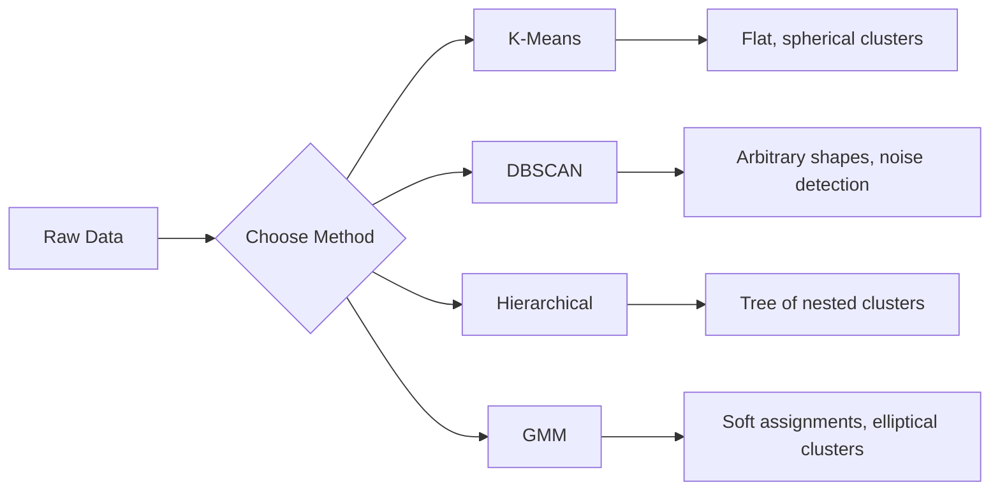

# 非監督式學習

> 沒有標籤，也沒有老師。演算法自己把結構找出來。

**類型：** 實作
**程式語言：** Python
**先修單元：** 階段 1（範數與距離、機率與分布）、階段 2 單元 1-6
**時間：** 約 90 分鐘

## 學習目標

- 從零實作 K-Means、DBSCAN 與高斯混合模型，並比較它們的分群行為
- 用輪廓係數與手肘法評估分群品質，挑出最合適的 K
- 說明 DBSCAN 在什麼情況下會勝過 K-Means，並指出哪個演算法能處理非球形的群與離群值
- 用分群方法打造一條異常偵測管線，把偏離正常模式的點標記出來

## 問題所在

到目前為止，每個機器學習單元都假設資料是有標籤的：「這是輸入，這是正確的輸出。」但在現實世界裡，標籤很貴。一間醫院有幾百萬筆病歷，卻沒有人手動替每一筆標上疾病類別。一個電商網站有幾百萬個使用者工作階段，卻沒有人手工標出客群分類。一個安全團隊有網路日誌，但沒有人把每個異常都標記出來。

非監督式學習不需要別人告訴它要找什麼，就能找出模式。它會把相似的資料點分成群、發現隱藏的結構、把異常浮上檯面。如果監督式學習是拿著附解答的教科書學習，那非監督式學習就是盯著原始資料看，直到模式自己顯現出來。

代價是：沒有標籤，你就無法直接量測「對」或「錯」。你需要另一套工具，才能評估演算法找到的結構到底有沒有意義。

## 核心概念

### 分群：把相似的東西歸在一起

分群會把每個資料點指派到某一組（群）裡，使得同一組內的點彼此之間，比它們和其他組的點更相似。而問題永遠是：「相似」到底是什麼意思？



### K-Means：主力工具

K-Means 會把資料切成剛好 K 個群。每個群都有一個質心（它的質量中心），而每個點都屬於離它最近的那個質心。

Lloyd 演算法：

1. 隨機挑 K 個點當作初始質心
2. 把每個資料點指派給離它最近的質心
3. 把每個質心重新算成它所轄樣本的平均
4. 重複步驟 2-3，直到指派結果不再變動

目標函式（慣量）量測的是每個點到它所屬質心的平方距離總和。K-Means 會把這個值最小化，但只能找到局部極小值。不同的初始化會給出不同的結果。

### 挑選 K

有兩種標準做法：

**手肘法：** 對 K = 1, 2, 3, ..., n 各跑一次 K-Means。把慣量對 K 畫出來。找出那個「手肘」——再加群也不會讓慣量明顯下降的轉折點。

**輪廓係數：** 對每個點，量測它和自己所屬群的相似程度（a），以及和最近的另一個群的相似程度（b）。輪廓係數是 (b - a) / max(a, b)，範圍從 -1（分錯群）到 +1（分得很好）。把所有點平均起來就得到一個整體分數。

### DBSCAN：密度分群

K-Means 假設群是球形的，而且要你事先決定 K。DBSCAN 兩個假設都不需要。它把群視為被稀疏區域隔開的稠密區域。

兩個參數：
- **eps**：鄰域的半徑
- **min_samples**：構成一個稠密區域所需的最少點數

三種類型的點：
- **核心點**：在 eps 距離內至少有 min_samples 個點
- **邊界點**：落在某個核心點的 eps 範圍內，但自己不是核心點
- **雜訊點**：既不是核心點也不是邊界點。這些就是離群值。

DBSCAN 會把彼此距離在 eps 之內的核心點串成同一群。邊界點會加入附近核心點所屬的那一群。雜訊點不屬於任何群。

強項：能找出任意形狀的群、自動決定群的數量、能辨識離群值。弱項：碰到密度不一致的群就會很吃力。

### 階層式分群

建出一棵由層層嵌套的群組成的樹（樹狀圖）。

聚合式（由下往上）：
1. 一開始每個點各自成為一群
2. 合併最接近的兩群
3. 重複下去，直到只剩一群
4. 在你想要的高度把樹狀圖切開，就得到 K 個群

群與群之間的「接近程度」可以這樣量：
- **單一連結**：兩群之中任兩點之間的最小距離
- **完全連結**：任兩點之間的最大距離
- **平均連結**：所有配對距離的平均
- **Ward's method**：選讓群內總變異增加最少的那次合併

### 高斯混合模型（GMM）

K-Means 給的是硬指派：每個點只屬於一個群。GMM 給的是軟指派：每個點對每個群都有一個歸屬機率。

GMM 假設資料是由 K 個高斯分布混合而生成的，每個分布各有自己的平均與共變異數。期望最大化（EM）演算法在兩個步驟之間交替：

- **E 步驟**：計算每個點屬於每個高斯分布的機率
- **M 步驟**：更新每個高斯分布的平均、共變異數與混合權重，讓資料的概似值最大

GMM 能建模橢圓形的群（不像 K-Means 只能是球形），也天生就能處理彼此重疊的群。

### 什麼時候該用哪一個

| 方法 | 最適合 | 什麼時候別用 |
|--------|----------|------------|
| K-Means | 大型資料集、球形群、已知 K | 形狀不規則、資料裡有離群值 |
| DBSCAN | K 未知、任意形狀、離群值偵測 | 密度不一致、維度非常高 |
| 階層式 | 小型資料集、需要樹狀圖、K 未知 | 大型資料集（記憶體 O(n^2)） |
| GMM | 群彼此重疊、需要軟指派 | 資料集非常大、維度太多 |

### 用分群做異常偵測

分群天生就能拿來做異常偵測：
- **K-Means**：離所有質心都很遠的點就是異常
- **DBSCAN**：雜訊點按定義就是異常
- **GMM**：在所有高斯分布下機率都很低的點就是異常

```figure
kmeans-step
```

## 動手實作

### 步驟 1：從零實作 K-Means

```python
import math
import random


def euclidean_distance(a, b):
    return math.sqrt(sum((ai - bi) ** 2 for ai, bi in zip(a, b)))


def kmeans(data, k, max_iterations=100, seed=42):
    random.seed(seed)
    n_features = len(data[0])

    centroids = random.sample(data, k)

    for iteration in range(max_iterations):
        clusters = [[] for _ in range(k)]
        assignments = []

        for point in data:
            distances = [euclidean_distance(point, c) for c in centroids]
            nearest = distances.index(min(distances))
            clusters[nearest].append(point)
            assignments.append(nearest)

        new_centroids = []
        for cluster in clusters:
            if len(cluster) == 0:
                new_centroids.append(random.choice(data))
                continue
            centroid = [
                sum(point[j] for point in cluster) / len(cluster)
                for j in range(n_features)
            ]
            new_centroids.append(centroid)

        if all(
            euclidean_distance(old, new) < 1e-6
            for old, new in zip(centroids, new_centroids)
        ):
            print(f"  Converged at iteration {iteration + 1}")
            break

        centroids = new_centroids

    return assignments, centroids
```

### 步驟 2：手肘法與輪廓係數

```python
def compute_inertia(data, assignments, centroids):
    total = 0.0
    for point, cluster_id in zip(data, assignments):
        total += euclidean_distance(point, centroids[cluster_id]) ** 2
    return total


def silhouette_score(data, assignments):
    n = len(data)
    if n < 2:
        return 0.0

    clusters = {}
    for i, c in enumerate(assignments):
        clusters.setdefault(c, []).append(i)

    if len(clusters) < 2:
        return 0.0

    scores = []
    for i in range(n):
        own_cluster = assignments[i]
        own_members = [j for j in clusters[own_cluster] if j != i]

        if len(own_members) == 0:
            scores.append(0.0)
            continue

        a = sum(euclidean_distance(data[i], data[j]) for j in own_members) / len(own_members)

        b = float("inf")
        for cluster_id, members in clusters.items():
            if cluster_id == own_cluster:
                continue
            avg_dist = sum(euclidean_distance(data[i], data[j]) for j in members) / len(members)
            b = min(b, avg_dist)

        if max(a, b) == 0:
            scores.append(0.0)
        else:
            scores.append((b - a) / max(a, b))

    return sum(scores) / len(scores)


def find_best_k(data, max_k=10):
    print("Elbow method:")
    inertias = []
    for k in range(1, max_k + 1):
        assignments, centroids = kmeans(data, k)
        inertia = compute_inertia(data, assignments, centroids)
        inertias.append(inertia)
        print(f"  K={k}: inertia={inertia:.2f}")

    print("\nSilhouette scores:")
    for k in range(2, max_k + 1):
        assignments, centroids = kmeans(data, k)
        score = silhouette_score(data, assignments)
        print(f"  K={k}: silhouette={score:.4f}")

    return inertias
```

### 步驟 3：從零實作 DBSCAN

```python
def dbscan(data, eps, min_samples):
    n = len(data)
    labels = [-1] * n
    cluster_id = 0

    def region_query(point_idx):
        neighbors = []
        for i in range(n):
            if euclidean_distance(data[point_idx], data[i]) <= eps:
                neighbors.append(i)
        return neighbors

    visited = [False] * n

    for i in range(n):
        if visited[i]:
            continue
        visited[i] = True

        neighbors = region_query(i)

        if len(neighbors) < min_samples:
            labels[i] = -1
            continue

        labels[i] = cluster_id
        seed_set = list(neighbors)
        seed_set.remove(i)

        j = 0
        while j < len(seed_set):
            q = seed_set[j]

            if not visited[q]:
                visited[q] = True
                q_neighbors = region_query(q)
                if len(q_neighbors) >= min_samples:
                    for nb in q_neighbors:
                        if nb not in seed_set:
                            seed_set.append(nb)

            if labels[q] == -1:
                labels[q] = cluster_id

            j += 1

        cluster_id += 1

    return labels
```

### 步驟 4：高斯混合模型（EM 演算法）

```python
def gmm(data, k, max_iterations=100, seed=42):
    random.seed(seed)
    n = len(data)
    d = len(data[0])

    indices = random.sample(range(n), k)
    means = [list(data[i]) for i in indices]
    variances = [1.0] * k
    weights = [1.0 / k] * k

    def gaussian_pdf(x, mean, variance):
        d = len(x)
        coeff = 1.0 / ((2 * math.pi * variance) ** (d / 2))
        exponent = -sum((xi - mi) ** 2 for xi, mi in zip(x, mean)) / (2 * variance)
        return coeff * math.exp(max(exponent, -500))

    for iteration in range(max_iterations):
        responsibilities = []
        for i in range(n):
            probs = []
            for j in range(k):
                probs.append(weights[j] * gaussian_pdf(data[i], means[j], variances[j]))
            total = sum(probs)
            if total == 0:
                total = 1e-300
            responsibilities.append([p / total for p in probs])

        old_means = [list(m) for m in means]

        for j in range(k):
            r_sum = sum(responsibilities[i][j] for i in range(n))
            if r_sum < 1e-10:
                continue

            weights[j] = r_sum / n

            for dim in range(d):
                means[j][dim] = sum(
                    responsibilities[i][j] * data[i][dim] for i in range(n)
                ) / r_sum

            variances[j] = sum(
                responsibilities[i][j]
                * sum((data[i][dim] - means[j][dim]) ** 2 for dim in range(d))
                for i in range(n)
            ) / (r_sum * d)
            variances[j] = max(variances[j], 1e-6)

        shift = sum(
            euclidean_distance(old_means[j], means[j]) for j in range(k)
        )
        if shift < 1e-6:
            print(f"  GMM converged at iteration {iteration + 1}")
            break

    assignments = []
    for i in range(n):
        assignments.append(responsibilities[i].index(max(responsibilities[i])))

    return assignments, means, weights, responsibilities
```

### 步驟 5：產生測試資料並跑過一輪

```python
def make_blobs(centers, n_per_cluster=50, spread=0.5, seed=42):
    random.seed(seed)
    data = []
    true_labels = []
    for label, (cx, cy) in enumerate(centers):
        for _ in range(n_per_cluster):
            x = cx + random.gauss(0, spread)
            y = cy + random.gauss(0, spread)
            data.append([x, y])
            true_labels.append(label)
    return data, true_labels


def make_moons(n_samples=200, noise=0.1, seed=42):
    random.seed(seed)
    data = []
    labels = []
    n_half = n_samples // 2
    for i in range(n_half):
        angle = math.pi * i / n_half
        x = math.cos(angle) + random.gauss(0, noise)
        y = math.sin(angle) + random.gauss(0, noise)
        data.append([x, y])
        labels.append(0)
    for i in range(n_half):
        angle = math.pi * i / n_half
        x = 1 - math.cos(angle) + random.gauss(0, noise)
        y = 1 - math.sin(angle) - 0.5 + random.gauss(0, noise)
        data.append([x, y])
        labels.append(1)
    return data, labels


if __name__ == "__main__":
    centers = [[2, 2], [8, 3], [5, 8]]
    data, true_labels = make_blobs(centers, n_per_cluster=50, spread=0.8)

    print("=== K-Means on 3 blobs ===")
    assignments, centroids = kmeans(data, k=3)
    print(f"  Centroids: {[[round(c, 2) for c in cent] for cent in centroids]}")
    sil = silhouette_score(data, assignments)
    print(f"  Silhouette score: {sil:.4f}")

    print("\n=== Elbow Method ===")
    find_best_k(data, max_k=6)

    print("\n=== DBSCAN on 3 blobs ===")
    db_labels = dbscan(data, eps=1.5, min_samples=5)
    n_clusters = len(set(db_labels) - {-1})
    n_noise = db_labels.count(-1)
    print(f"  Found {n_clusters} clusters, {n_noise} noise points")

    print("\n=== GMM on 3 blobs ===")
    gmm_assignments, gmm_means, gmm_weights, _ = gmm(data, k=3)
    print(f"  Means: {[[round(m, 2) for m in mean] for mean in gmm_means]}")
    print(f"  Weights: {[round(w, 3) for w in gmm_weights]}")
    gmm_sil = silhouette_score(data, gmm_assignments)
    print(f"  Silhouette score: {gmm_sil:.4f}")

    print("\n=== DBSCAN on moons (non-spherical clusters) ===")
    moon_data, moon_labels = make_moons(n_samples=200, noise=0.1)
    moon_db = dbscan(moon_data, eps=0.3, min_samples=5)
    n_moon_clusters = len(set(moon_db) - {-1})
    n_moon_noise = moon_db.count(-1)
    print(f"  Found {n_moon_clusters} clusters, {n_moon_noise} noise points")

    print("\n=== K-Means on moons (will fail to separate) ===")
    moon_km, moon_centroids = kmeans(moon_data, k=2)
    moon_sil = silhouette_score(moon_data, moon_km)
    print(f"  Silhouette score: {moon_sil:.4f}")
    print("  K-Means splits moons poorly because they are not spherical")

    print("\n=== Anomaly detection with DBSCAN ===")
    anomaly_data = list(data)
    anomaly_data.append([20.0, 20.0])
    anomaly_data.append([-5.0, -5.0])
    anomaly_data.append([15.0, 0.0])
    anomaly_labels = dbscan(anomaly_data, eps=1.5, min_samples=5)
    anomalies = [
        anomaly_data[i]
        for i in range(len(anomaly_labels))
        if anomaly_labels[i] == -1
    ]
    print(f"  Detected {len(anomalies)} anomalies")
    for a in anomalies[-3:]:
        print(f"    Point {[round(v, 2) for v in a]}")
```

## 框架應用

在 scikit-learn 裡，同樣這些演算法都只是一行：

```python
from sklearn.cluster import KMeans, DBSCAN, AgglomerativeClustering
from sklearn.mixture import GaussianMixture
from sklearn.metrics import silhouette_score as sklearn_silhouette

km = KMeans(n_clusters=3, random_state=42).fit(data)
db = DBSCAN(eps=1.5, min_samples=5).fit(data)
agg = AgglomerativeClustering(n_clusters=3).fit(data)
gmm_model = GaussianMixture(n_components=3, random_state=42).fit(data)
```

從零寫過一遍的版本，會讓你確切看到這些函式庫在算什麼。K-Means 在指派與重算之間反覆。DBSCAN 從稠密的種子點長出群。GMM 在期望與最大化之間交替。函式庫的版本多加了數值穩定性、更聰明的初始化（K-Means++）與 GPU 加速，但核心邏輯是一樣的。

## 產出交付

這個單元會產出 K-Means、DBSCAN 與 GMM 的從零實作，而且都能跑。這些分群程式碼可以當成基礎，往更進階的非監督式方法擴充。

## 練習

1. 實作 K-Means++ 初始化：不要隨機挑質心，而是第一個隨機挑，之後每個質心被選中的機率正比於它到最近的既有質心的平方距離。把收斂速度和隨機初始化做比較。
2. 在程式碼裡加上階層式聚合分群。實作 Ward's linkage 並產生一張樹狀圖（用嵌套的 list 表示合併順序）。在不同高度把它切開，並和 K-Means 的結果比較。
3. 打造一條簡單的異常偵測管線：對同一份資料同時跑 DBSCAN 與 GMM，把兩種方法都認定是離群值的點標記出來（在 DBSCAN 裡是雜訊點，在 GMM 裡是機率很低的點）。量測兩者的重疊程度，並討論它們在什麼情況下會判斷不一致。

## 關鍵術語

| 術語 | 大家怎麼說 | 實際上是什麼 |
|------|----------------|----------------------|
| 分群 | 「把相似的東西歸在一起」 | 把資料切成幾個子集，使組內相似度高於組間相似度，而相似度由某個特定的距離度量決定 |
| 質心 | 「一個群的中心」 | 指派給某一群的所有點的平均；K-Means 拿它當作該群的代表 |
| 慣量 | 「群有多緊密」 | 每個點到它所屬質心的平方距離總和；越低就越緊密 |
| 輪廓係數 | 「群分得有多開」 | 對每個點計算 (b - a) / max(a, b)，其中 a 是群內平均距離，b 是到最近的群的平均距離 |
| 核心點 | 「稠密區域裡的點」 | 在 DBSCAN 裡，指在 eps 距離內至少有 min_samples 個鄰居的點 |
| EM 演算法 | 「軟性的 K-Means」 | 期望最大化：反覆計算歸屬機率（E 步驟）並更新分布參數（M 步驟） |
| 樹狀圖 | 「一棵群的樹」 | 一張樹狀圖，呈現階層式分群中各群被合併的順序與距離 |
| 異常 | 「離群值」 | 不符合預期模式的資料點，在 DBSCAN 裡被判為雜訊，在 GMM 裡則是機率很低 |

## 延伸閱讀

- [Stanford CS229 - Unsupervised Learning](https://cs229.stanford.edu/notes2022fall/main_notes.pdf) - Andrew Ng 關於分群與 EM 的講義
- [scikit-learn Clustering Guide](https://scikit-learn.org/stable/modules/clustering.html) - 用視覺化範例實際比較所有分群演算法
- [DBSCAN original paper (Ester et al., 1996)](https://www.aaai.org/Papers/KDD/1996/KDD96-037.pdf) - 提出密度分群的那篇論文
