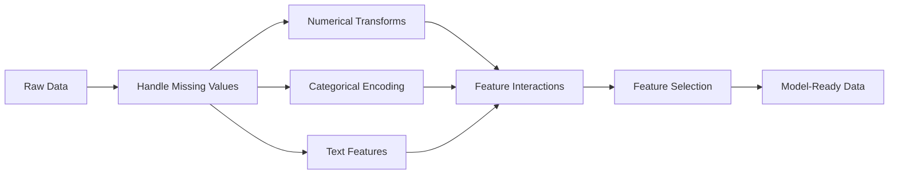

# 特徵工程與特徵選擇

> 一個好特徵，勝過一千個資料點。

**類型：** 實作
**程式語言：** Python
**先修單元：** 階段 1（ML 統計學、線性代數）、階段 2 單元 1-7
**時間：** 約 90 分鐘

## 學習目標

- 實作數值轉換（標準化、min-max 縮放、對數轉換、分箱），並說明各自適合用在什麼場合
- 為類別特徵建構獨熱編碼、標籤編碼與目標編碼，並指出目標編碼的資料洩漏風險
- 從零打造一個 TF-IDF 向量化器，並說明它在文字分類上為什麼勝過原始詞頻
- 套用篩選式特徵選擇（變異數閾值、相關係數、互資訊）來降低維度

## 問題所在

你手上有一份資料集。你挑了一個演算法。你把它訓練起來。結果很平庸。你換一個更花俏的演算法。還是平庸。你花了一週調超參數。只換到微幅的改善。

然後有人把原始資料轉成更好的特徵，一個簡單的邏輯迴歸就打敗了你調過的梯度提升集成模型。

這種事一直在發生。在傳統機器學習裡，資料的表示方式比演算法的選擇更重要。一個用「坪數」與「房間數」的房價模型，會勝過一個把「地址當成原始字串」的模型——不管後者的學習器多精巧。演算法只能用你餵給它的東西做事。

特徵工程是把原始資料轉換成「讓模型更容易找到規律」的表示方式的過程。特徵選擇則是把那些只帶來雜訊、不帶來訊號的特徵丟掉的過程。兩者合起來，是傳統機器學習裡槓桿最高的工作。

## 核心概念

### 特徵處理流程



### 數值特徵

原始數字很少能直接餵給模型。常見的轉換有：

**特徵縮放：** 把各個特徵放到同一個範圍，讓基於距離的演算法（K-Means、KNN、SVM）平等對待所有特徵。Min-max 縮放會映射到 [0, 1]。標準化（z-score）會映射到 mean=0、std=1。

**對數轉換：** 壓縮右偏的分布（收入、人口、詞頻）。把乘法關係變成加法關係。

**分箱：** 把連續值轉成類別。當特徵與目標之間的關係是非線性但呈階梯狀時很有用（例如年齡層）。

**多項式特徵：** 造出 x^2、x^3、x1*x2 這些項。讓線性模型也能捕捉非線性關係，代價是特徵變多。

### 類別特徵

模型需要數字。類別需要編碼。

**獨熱編碼：** 為每個類別造一個二元欄位。「color = red/blue/green」會變成三個欄位：is_red、is_blue、is_green。對基數低的特徵很好用，但類別一多就會爆炸。

**標籤編碼：** 把每個類別對應到一個整數：red=0、blue=1、green=2。這會引入不存在的順序關係（模型可能以為 green > blue > red）。只適合用在會針對個別值做分裂的樹狀模型上。

**目標編碼：** 把每個類別換成該類別的目標變數平均值。很強，但也很危險：資料洩漏的風險很高。必須只用訓練資料計算，再套用到測試資料上。

### 文字特徵

**Count vectorizer：** 統計每個詞在一份文件裡出現幾次。「the cat sat on the mat」會變成 {the: 2, cat: 1, sat: 1, on: 1, mat: 1}。

**TF-IDF：** Term Frequency-Inverse Document Frequency（詞頻－逆文件頻率）。依照一個詞在所有文件中有多獨特來給它權重。像「the」這種常見詞權重很低。稀有而有辨識力的詞權重很高。

```
TF(word, doc) = count(word in doc) / total words in doc
IDF(word) = log(total docs / docs containing word)
TF-IDF = TF * IDF
```

### 遺漏值

真實資料處處是洞。可用的策略：

- **丟掉整列：** 只在遺漏很少且是隨機發生時才這樣做
- **平均值／中位數填補：** 簡單，且能保住分布形狀（中位數對離群值比較穩健）
- **眾數填補：** 用於類別特徵
- **指示欄位：** 在填補之前先加一個二元欄位「這格原本是不是空的」。資料本身遺漏這件事，可能就帶有資訊
- **前向／後向填補：** 用於時間序列資料

### 交互特徵

有時候訊號藏在組合裡。「身高」和「體重」各自的預測力，比不上「BMI = weight / height^2」。交互特徵會讓特徵空間成倍增加，所以要靠領域知識挑出對的那些。

### 特徵選擇

特徵越多不一定越好。不相關的特徵會帶進雜訊、拉長訓練時間，還可能造成過度擬合。

**過濾法（在建模之前）：**
- 相關係數：把彼此高度相關的特徵移掉（那是冗餘的）
- 互資訊：衡量知道某個特徵之後，對目標的不確定性減少了多少
- 變異數閾值：把幾乎不變動的特徵移掉

**包裝法（依賴模型）：**
- L1 正則化（Lasso）：把不相關特徵的權重壓到恰好為零
- 遞迴特徵消除：訓練、移掉最不重要的特徵、再重複

**為什麼特徵選擇很重要：** 一個只有 10 個好特徵的模型，通常會勝過一個有 10 個好特徵加 90 個雜訊特徵的模型。那些雜訊特徵給了模型機會，去擬合訓練資料裡無法泛化的規律。

```figure
feature-scaling
```

## 動手實作

### 步驟 1：從零實作數值轉換

```python
import math


def min_max_scale(values):
    min_val = min(values)
    max_val = max(values)
    if max_val == min_val:
        return [0.0] * len(values)
    return [(v - min_val) / (max_val - min_val) for v in values]


def standardize(values):
    n = len(values)
    mean = sum(values) / n
    variance = sum((v - mean) ** 2 for v in values) / n
    std = math.sqrt(variance) if variance > 0 else 1.0
    return [(v - mean) / std for v in values]


def log_transform(values):
    return [math.log(v + 1) for v in values]


def bin_values(values, n_bins=5):
    min_val = min(values)
    max_val = max(values)
    bin_width = (max_val - min_val) / n_bins
    if bin_width == 0:
        return [0] * len(values)
    result = []
    for v in values:
        bin_idx = int((v - min_val) / bin_width)
        bin_idx = min(bin_idx, n_bins - 1)
        result.append(bin_idx)
    return result


def polynomial_features(row, degree=2):
    n = len(row)
    result = list(row)
    if degree >= 2:
        for i in range(n):
            result.append(row[i] ** 2)
        for i in range(n):
            for j in range(i + 1, n):
                result.append(row[i] * row[j])
    return result
```

### 步驟 2：從零實作類別編碼

```python
def one_hot_encode(values):
    categories = sorted(set(values))
    cat_to_idx = {cat: i for i, cat in enumerate(categories)}
    n_cats = len(categories)

    encoded = []
    for v in values:
        row = [0] * n_cats
        row[cat_to_idx[v]] = 1
        encoded.append(row)

    return encoded, categories


def label_encode(values):
    categories = sorted(set(values))
    cat_to_int = {cat: i for i, cat in enumerate(categories)}
    return [cat_to_int[v] for v in values], cat_to_int


def target_encode(feature_values, target_values, smoothing=10):
    global_mean = sum(target_values) / len(target_values)

    category_stats = {}
    for feat, target in zip(feature_values, target_values):
        if feat not in category_stats:
            category_stats[feat] = {"sum": 0.0, "count": 0}
        category_stats[feat]["sum"] += target
        category_stats[feat]["count"] += 1

    encoding = {}
    for cat, stats in category_stats.items():
        cat_mean = stats["sum"] / stats["count"]
        weight = stats["count"] / (stats["count"] + smoothing)
        encoding[cat] = weight * cat_mean + (1 - weight) * global_mean

    return [encoding[v] for v in feature_values], encoding
```

### 步驟 3：從零實作文字特徵

```python
def count_vectorize(documents):
    vocab = {}
    idx = 0
    for doc in documents:
        for word in doc.lower().split():
            if word not in vocab:
                vocab[word] = idx
                idx += 1

    vectors = []
    for doc in documents:
        vec = [0] * len(vocab)
        for word in doc.lower().split():
            vec[vocab[word]] += 1
        vectors.append(vec)

    return vectors, vocab


def tfidf(documents):
    n_docs = len(documents)

    vocab = {}
    idx = 0
    for doc in documents:
        for word in doc.lower().split():
            if word not in vocab:
                vocab[word] = idx
                idx += 1

    doc_freq = {}
    for doc in documents:
        seen = set()
        for word in doc.lower().split():
            if word not in seen:
                doc_freq[word] = doc_freq.get(word, 0) + 1
                seen.add(word)

    vectors = []
    for doc in documents:
        words = doc.lower().split()
        word_count = len(words)
        tf_map = {}
        for word in words:
            tf_map[word] = tf_map.get(word, 0) + 1

        vec = [0.0] * len(vocab)
        for word, count in tf_map.items():
            tf = count / word_count
            idf = math.log(n_docs / doc_freq[word])
            vec[vocab[word]] = tf * idf
        vectors.append(vec)

    return vectors, vocab
```

### 步驟 4：從零實作遺漏值填補

```python
def impute_mean(values):
    present = [v for v in values if v is not None]
    if not present:
        return [0.0] * len(values), 0.0
    mean = sum(present) / len(present)
    return [v if v is not None else mean for v in values], mean


def impute_median(values):
    present = sorted(v for v in values if v is not None)
    if not present:
        return [0.0] * len(values), 0.0
    n = len(present)
    if n % 2 == 0:
        median = (present[n // 2 - 1] + present[n // 2]) / 2
    else:
        median = present[n // 2]
    return [v if v is not None else median for v in values], median


def impute_mode(values):
    present = [v for v in values if v is not None]
    if not present:
        return values, None
    counts = {}
    for v in present:
        counts[v] = counts.get(v, 0) + 1
    mode = max(counts, key=counts.get)
    return [v if v is not None else mode for v in values], mode


def add_missing_indicator(values):
    return [0 if v is not None else 1 for v in values]
```

### 步驟 5：從零實作特徵選擇

```python
def correlation(x, y):
    n = len(x)
    mean_x = sum(x) / n
    mean_y = sum(y) / n
    cov = sum((xi - mean_x) * (yi - mean_y) for xi, yi in zip(x, y)) / n
    std_x = math.sqrt(sum((xi - mean_x) ** 2 for xi in x) / n)
    std_y = math.sqrt(sum((yi - mean_y) ** 2 for yi in y) / n)
    if std_x == 0 or std_y == 0:
        return 0.0
    return cov / (std_x * std_y)


def mutual_information(feature, target, n_bins=10):
    feat_min = min(feature)
    feat_max = max(feature)
    bin_width = (feat_max - feat_min) / n_bins if feat_max != feat_min else 1.0
    feat_binned = [
        min(int((f - feat_min) / bin_width), n_bins - 1) for f in feature
    ]

    n = len(feature)
    target_classes = sorted(set(target))

    feat_bins = sorted(set(feat_binned))
    p_feat = {}
    for b in feat_bins:
        p_feat[b] = feat_binned.count(b) / n

    p_target = {}
    for t in target_classes:
        p_target[t] = target.count(t) / n

    mi = 0.0
    for b in feat_bins:
        for t in target_classes:
            joint_count = sum(
                1 for fb, tv in zip(feat_binned, target) if fb == b and tv == t
            )
            p_joint = joint_count / n
            if p_joint > 0:
                mi += p_joint * math.log(p_joint / (p_feat[b] * p_target[t]))

    return mi


def variance_threshold(features, threshold=0.01):
    n_features = len(features[0])
    n_samples = len(features)
    selected = []

    for j in range(n_features):
        col = [features[i][j] for i in range(n_samples)]
        mean = sum(col) / n_samples
        var = sum((v - mean) ** 2 for v in col) / n_samples
        if var >= threshold:
            selected.append(j)

    return selected


def remove_correlated(features, threshold=0.9):
    n_features = len(features[0])
    n_samples = len(features)

    to_remove = set()
    for i in range(n_features):
        if i in to_remove:
            continue
        col_i = [features[r][i] for r in range(n_samples)]
        for j in range(i + 1, n_features):
            if j in to_remove:
                continue
            col_j = [features[r][j] for r in range(n_samples)]
            corr = abs(correlation(col_i, col_j))
            if corr >= threshold:
                to_remove.add(j)

    return [i for i in range(n_features) if i not in to_remove]
```

### 步驟 6：完整流程與示範

```python
import random


def make_housing_data(n=200, seed=42):
    random.seed(seed)
    data = []
    for _ in range(n):
        sqft = random.uniform(500, 5000)
        bedrooms = random.choice([1, 2, 3, 4, 5])
        age = random.uniform(0, 50)
        neighborhood = random.choice(["downtown", "suburbs", "rural"])
        has_pool = random.choice([True, False])

        sqft_with_missing = sqft if random.random() > 0.05 else None
        age_with_missing = age if random.random() > 0.08 else None

        price = (
            50 * sqft
            + 20000 * bedrooms
            - 1000 * age
            + (50000 if neighborhood == "downtown" else 10000 if neighborhood == "suburbs" else 0)
            + (15000 if has_pool else 0)
            + random.gauss(0, 20000)
        )

        data.append({
            "sqft": sqft_with_missing,
            "bedrooms": bedrooms,
            "age": age_with_missing,
            "neighborhood": neighborhood,
            "has_pool": has_pool,
            "price": price,
        })
    return data


if __name__ == "__main__":
    data = make_housing_data(200)

    print("=== Raw Data Sample ===")
    for row in data[:3]:
        print(f"  {row}")

    sqft_raw = [d["sqft"] for d in data]
    age_raw = [d["age"] for d in data]
    prices = [d["price"] for d in data]

    print("\n=== Missing Value Handling ===")
    sqft_missing = sum(1 for v in sqft_raw if v is None)
    age_missing = sum(1 for v in age_raw if v is None)
    print(f"  sqft missing: {sqft_missing}/{len(sqft_raw)}")
    print(f"  age missing: {age_missing}/{len(age_raw)}")

    sqft_indicator = add_missing_indicator(sqft_raw)
    age_indicator = add_missing_indicator(age_raw)
    sqft_imputed, sqft_fill = impute_median(sqft_raw)
    age_imputed, age_fill = impute_mean(age_raw)
    print(f"  sqft filled with median: {sqft_fill:.0f}")
    print(f"  age filled with mean: {age_fill:.1f}")

    print("\n=== Numerical Transforms ===")
    sqft_scaled = standardize(sqft_imputed)
    age_scaled = min_max_scale(age_imputed)
    sqft_log = log_transform(sqft_imputed)
    age_binned = bin_values(age_imputed, n_bins=5)
    print(f"  sqft standardized: mean={sum(sqft_scaled)/len(sqft_scaled):.4f}, std={math.sqrt(sum(v**2 for v in sqft_scaled)/len(sqft_scaled)):.4f}")
    print(f"  age min-max: [{min(age_scaled):.2f}, {max(age_scaled):.2f}]")
    print(f"  age bins: {sorted(set(age_binned))}")

    print("\n=== Categorical Encoding ===")
    neighborhoods = [d["neighborhood"] for d in data]

    ohe, ohe_cats = one_hot_encode(neighborhoods)
    print(f"  One-hot categories: {ohe_cats}")
    print(f"  Sample encoding: {neighborhoods[0]} -> {ohe[0]}")

    le, le_map = label_encode(neighborhoods)
    print(f"  Label encoding map: {le_map}")

    te, te_map = target_encode(neighborhoods, prices, smoothing=10)
    print(f"  Target encoding: {({k: round(v) for k, v in te_map.items()})}")

    print("\n=== Text Features ===")
    descriptions = [
        "large modern house with pool",
        "small cozy cottage near downtown",
        "spacious family home with large yard",
        "modern apartment downtown with view",
        "rustic cabin in rural area",
    ]
    cv, cv_vocab = count_vectorize(descriptions)
    print(f"  Vocabulary size: {len(cv_vocab)}")
    print(f"  Doc 0 non-zero features: {sum(1 for v in cv[0] if v > 0)}")

    tf, tf_vocab = tfidf(descriptions)
    print(f"  TF-IDF vocabulary size: {len(tf_vocab)}")
    top_words = sorted(tf_vocab.keys(), key=lambda w: tf[0][tf_vocab[w]], reverse=True)[:3]
    print(f"  Doc 0 top TF-IDF words: {top_words}")

    print("\n=== Polynomial Features ===")
    sample_row = [sqft_scaled[0], age_scaled[0]]
    poly = polynomial_features(sample_row, degree=2)
    print(f"  Input: {[round(v, 4) for v in sample_row]}")
    print(f"  Polynomial: {[round(v, 4) for v in poly]}")
    print(f"  Features: [x1, x2, x1^2, x2^2, x1*x2]")

    print("\n=== Feature Selection ===")
    feature_matrix = [
        [sqft_scaled[i], age_scaled[i], float(sqft_indicator[i]), float(age_indicator[i])]
        + ohe[i]
        for i in range(len(data))
    ]

    print(f"  Total features: {len(feature_matrix[0])}")

    surviving_var = variance_threshold(feature_matrix, threshold=0.01)
    print(f"  After variance threshold (0.01): {len(surviving_var)} features kept")

    surviving_corr = remove_correlated(feature_matrix, threshold=0.9)
    print(f"  After correlation filter (0.9): {len(surviving_corr)} features kept")

    binary_prices = [1 if p > sum(prices) / len(prices) else 0 for p in prices]
    print("\n  Mutual information with target:")
    feature_names = ["sqft", "age", "sqft_missing", "age_missing"] + [f"neigh_{c}" for c in ohe_cats]
    for j in range(len(feature_matrix[0])):
        col = [feature_matrix[i][j] for i in range(len(feature_matrix))]
        mi = mutual_information(col, binary_prices, n_bins=10)
        print(f"    {feature_names[j]}: MI={mi:.4f}")

    print("\n  Correlation with price:")
    for j in range(len(feature_matrix[0])):
        col = [feature_matrix[i][j] for i in range(len(feature_matrix))]
        corr = correlation(col, prices)
        print(f"    {feature_names[j]}: r={corr:.4f}")
```

## 框架應用

在 scikit-learn 裡，這些轉換都是可以組合成 pipeline 的元件：

```python
from sklearn.preprocessing import StandardScaler, OneHotEncoder, PolynomialFeatures
from sklearn.impute import SimpleImputer
from sklearn.feature_extraction.text import TfidfVectorizer
from sklearn.feature_selection import mutual_info_classif, VarianceThreshold
from sklearn.compose import ColumnTransformer
from sklearn.pipeline import Pipeline

numeric_pipe = Pipeline([
    ("imputer", SimpleImputer(strategy="median")),
    ("scaler", StandardScaler()),
])

categorical_pipe = Pipeline([
    ("encoder", OneHotEncoder(sparse_output=False)),
])

preprocessor = ColumnTransformer([
    ("num", numeric_pipe, ["sqft", "age"]),
    ("cat", categorical_pipe, ["neighborhood"]),
])
```

從零寫的版本讓你看清每個轉換內部到底發生了什麼。函式庫的版本多了邊界情況處理、稀疏矩陣支援與 pipeline 組合能力，但數學是一樣的。

## 產出交付

這個單元會產出：
- `outputs/prompt-feature-engineer.md` - 一個用來從原始資料系統性地做特徵工程的提示詞

## 練習

1. 在數值轉換裡加上穩健縮放（用中位數與四分位距，取代平均值與標準差）。在含有極端離群值的資料上，把它和標準縮放做比較。
2. 實作留一法目標編碼：對每一列，計算目標平均值時排除該列自己的目標值。展示這樣做和天真的目標編碼相比，如何減少過度擬合。
3. 打造一條自動化的特徵選擇流程，把變異數閾值、相關係數篩選與互資訊排序結合起來。把它套用到房價資料集上，並比較「用全部特徵」與「用選出的特徵」時的模型表現（用一個簡單的線性迴歸就好）。

## 關鍵術語

| 術語 | 大家怎麼說 | 實際上是什麼 |
|------|----------------|----------------------|
| 特徵工程 | 「多做幾個欄位」 | 把原始資料轉換成能把規律攤開給模型看的表示方式 |
| 標準化 | 「把它弄成常態」 | 減掉平均值再除以標準差，讓該特徵的 mean=0、std=1 |
| 獨熱編碼 | 「做虛擬變數」 | 每個類別造一個二元欄位，每一列恰好只有一個欄位是 1 |
| 目標編碼 | 「拿答案來編碼」 | 把每個類別換成該類別的目標平均值，並加上平滑以避免過度擬合 |
| TF-IDF | 「花俏一點的詞頻」 | 詞頻乘上逆文件頻率：依照一個詞在整個語料中有多有辨識力來給權重 |
| 填補 | 「把空格填起來」 | 用估計值（平均值、中位數、眾數，或模型預測值）取代遺漏值 |
| 特徵選擇 | 「把爛欄位丟掉」 | 移除帶來雜訊或冗餘的特徵，只留下對目標帶有訊號的那些 |
| 互資訊 | 「一件事能告訴你多少另一件事」 | 衡量觀察到變數 X 之後，對變數 Y 的不確定性減少了多少 |
| 資料洩漏 | 「不小心作弊了」 | 訓練時用到了預測時拿不到的資訊，讓結果看起來好得不真實 |

## 延伸閱讀

- [Feature Engineering and Selection (Max Kuhn & Kjell Johnson)](http://www.feat.engineering/) - 免費線上書，涵蓋特徵工程的完整版圖
- [scikit-learn Preprocessing Guide](https://scikit-learn.org/stable/modules/preprocessing.html) - 所有標準轉換的實用參考
- [Target Encoding Done Right (Micci-Barreca, 2001)](https://dl.acm.org/doi/10.1145/507533.507538) - 目標編碼搭配平滑的原始論文
