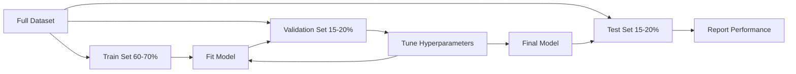

# 模型評估

> 模型的好壞，取決於你怎麼衡量它。

**類型：** 實作
**程式語言：** Python
**先修單元：** 階段 1（機率與分布、機器學習的統計學）、階段 2 · 單元 01-08
**時間：** 約 90 分鐘

## 學習目標

- 從零實作 K 折與分層 K 折交叉驗證，並說明為什麼分層抽樣對不平衡的資料很重要
- 從零計算精確率、召回率、F1、AUC-ROC，以及迴歸指標（MSE、RMSE、MAE、R 平方）
- 解讀學習曲線，診斷模型是高偏差還是高變異
- 指出常見的評估錯誤，包括資料洩漏、指標選錯，以及測試集被汙染

## 問題所在

你訓練了一個模型。它在你的資料上拿到 95% 的準確率。這樣算好嗎？

也許好，也許不好。如果你的資料有 95% 屬於同一個類別，那麼一個永遠預測那個類別的模型也能拿到 95% 準確率，卻毫無用處。如果你是在訓練時用過的同一批資料上評估，那 95% 這個數字就沒有意義，因為模型只是把答案背下來而已。如果你的資料集帶有時間性，而你在切分之前隨機打亂了它，那你的模型可能正在用未來的資料預測過去。

模型評估是大多數 ML 專案出錯的地方。指標選錯，會讓爛模型看起來很好。切分方式錯了，模型就有機會作弊。比較方式錯了，你會挑到比較差的那個模型。把評估做對不是選配，它決定了一個模型是能在生產環境運作，還是一看到真實資料就崩掉。

## 核心概念

### 訓練、驗證、測試



三種切分，三種用途：

- **訓練集**：模型從這份資料學習。訓練期間它看得到這些樣本。
- **驗證集**：用來調整超參數、在不同模型之間做選擇。模型不會在這份資料上訓練，但你的決策會受它影響。
- **測試集**：只碰一次，在最後才用來報告最終效能。如果你看了測試效能之後又回頭改模型，它就不再是測試集了 —— 它已經變成第二個驗證集。

測試集是你的保留（hold-out）保證，確保報告出來的效能真的反映模型在完全沒見過的資料上會有的表現。

### K 折交叉驗證

資料集很小的時候，單一次的訓練／驗證切分既浪費資料，估計值又充滿雜訊。K 折交叉驗證讓所有資料都同時用於訓練與驗證：

```mermaid
flowchart TB
    subgraph Fold1["Fold 1"]
        direction LR
        V1["Val"] --- T1a["Train"] --- T1b["Train"] --- T1c["Train"] --- T1d["Train"]
    end
    subgraph Fold2["Fold 2"]
        direction LR
        T2a["Train"] --- V2["Val"] --- T2b["Train"] --- T2c["Train"] --- T2d["Train"]
    end
    subgraph Fold3["Fold 3"]
        direction LR
        T3a["Train"] --- T3b["Train"] --- V3["Val"] --- T3c["Train"] --- T3d["Train"]
    end
    subgraph Fold4["Fold 4"]
        direction LR
        T4a["Train"] --- T4b["Train"] --- T4c["Train"] --- V4["Val"] --- T4d["Train"]
    end
    subgraph Fold5["Fold 5"]
        direction LR
        T5a["Train"] --- T5b["Train"] --- T5c["Train"] --- T5d["Train"] --- V5["Val"]
    end
    Fold1 --> R["Average scores"]
    Fold2 --> R
    Fold3 --> R
    Fold4 --> R
    Fold5 --> R
```



1. 把資料切成 K 個大小相同的折（fold）
2. 對每一折，用其餘 K-1 折訓練，在剩下的那一折上驗證
3. 把 K 個驗證分數平均起來

K=5 或 K=10 是標準選擇。每一個資料點都剛好被當作驗證資料一次。平均分數比任何單一次切分都更穩定。

**分層 K 折**：讓每一折都保持原本的類別分布。如果你的資料集是 70% 類別 A、30% 類別 B，每一折都會維持大致相同的比例。這對不平衡的資料集很重要 —— 隨機切分可能會把少數類別的樣本全都塞進同一折。

### 分類指標

**混淆矩陣**：一切的基礎。以二元分類為例：

|  | 預測為正 | 預測為負 |
|--|---|---|
| 實際為正 | 真正例（TP） | 假負例（FN） |
| 實際為負 | 假正例（FP） | 真負例（TN） |

其他所有指標都由這個矩陣推導出來：

- **準確率** = (TP + TN) / (TP + TN + FP + FN)。預測正確的比例。當類別不平衡時會誤導人。
- **精確率** = TP / (TP + FP)。在所有被預測為正的東西裡，有多少真的是正的？當假正例代價很高時用它（例如垃圾郵件過濾器把正常郵件標成垃圾）。
- **召回率**（敏感度）= TP / (TP + FN)。在所有實際為正的樣本裡，我們抓到了多少？當假負例代價很高時用它（例如癌症篩檢漏掉腫瘤）。
- **F1 分數** = 2 * precision * recall / (precision + recall)。精確率與召回率的調和平均。當兩者都沒有明顯優先時，用它來取得平衡。
- **AUC-ROC**：Receiver Operating Characteristic 曲線下的面積。它在各種分類閾值下描繪真正例率對假正例率的關係。AUC = 0.5 代表跟隨機猜一樣，AUC = 1.0 代表完美分離。它與閾值無關：無論你挑哪個切點，它衡量的都是模型把正例排在負例前面的能力有多好。

### 迴歸指標

- **MSE**（均方誤差）= mean((y_true - y_pred)^2)。以平方的方式懲罰大誤差。對離群值敏感。
- **RMSE**（均方根誤差）= sqrt(MSE)。單位與目標變數相同。比 MSE 好解讀。
- **MAE**（平均絕對誤差）= mean(|y_true - y_pred|)。所有誤差都以線性方式對待。比 MSE 更能抵抗離群值。
- **R 平方** = 1 - SS_res / SS_tot，其中 SS_res = sum((y_true - y_pred)^2)，而 SS_tot = sum((y_true - y_mean)^2)。模型解釋掉的變異比例。R^2 = 1.0 是完美。R^2 = 0.0 代表模型跟永遠預測平均值一樣好。如果模型比平均值還差，R^2 可以是負的。

### 學習曲線

把訓練與驗證分數畫成訓練集大小的函式：

- **高偏差（欠擬合）**：兩條曲線都收斂到很低的分數。加更多資料不會有幫助。你需要更複雜的模型。
- **高變異（過度擬合）**：訓練分數很高，但驗證分數低很多。兩者之間的落差很大。加更多資料應該會有幫助。

### 驗證曲線

把訓練與驗證分數畫成某個超參數的函式：

- 複雜度低時：兩個分數都很低（欠擬合）
- 複雜度剛好時：兩個分數都很高，而且很接近
- 複雜度高時：訓練分數維持很高，但驗證分數下滑（過度擬合）

最佳的超參數值就在驗證分數達到高峰的地方。

### 常見的評估錯誤

**資料洩漏**：測試集的資訊漏進了訓練。例如：在切分之前就用整個資料集配適 scaler、在時間序列預測中納入未來的資料、使用從目標變數推導出來的特徵。永遠先切分，再做前處理。

**類別不平衡**：99% 的交易是正常的，1% 是詐欺。一個永遠預測「正常」的模型可以拿到 99% 準確率。改用精確率、召回率、F1 或 AUC-ROC。

**指標選錯**：明明該最佳化召回率（醫療診斷）卻在最佳化準確率，或是資料有嚴重離群值時還在最佳化 RMSE（這時該用 MAE）。

**沒有使用分層切分**：資料不平衡時，隨機切分可能讓驗證折裡只有極少數的少數類別樣本，估計值因此不穩定。

**測試太頻繁**：每次你看了測試效能又回去調整，就是在對測試集過度擬合。測試集只能用一次。

```figure
precision-recall-threshold
```

## 動手實作

### 步驟 1：訓練／驗證／測試切分

```python
import random
import math


def train_val_test_split(X, y, train_ratio=0.6, val_ratio=0.2, seed=42):
    random.seed(seed)
    n = len(X)
    indices = list(range(n))
    random.shuffle(indices)

    train_end = int(n * train_ratio)
    val_end = int(n * (train_ratio + val_ratio))

    train_idx = indices[:train_end]
    val_idx = indices[train_end:val_end]
    test_idx = indices[val_end:]

    X_train = [X[i] for i in train_idx]
    y_train = [y[i] for i in train_idx]
    X_val = [X[i] for i in val_idx]
    y_val = [y[i] for i in val_idx]
    X_test = [X[i] for i in test_idx]
    y_test = [y[i] for i in test_idx]

    return X_train, y_train, X_val, y_val, X_test, y_test
```

### 步驟 2：K 折與分層 K 折交叉驗證

```python
def kfold_split(n, k=5, seed=42):
    random.seed(seed)
    indices = list(range(n))
    random.shuffle(indices)

    fold_size = n // k
    folds = []

    for i in range(k):
        start = i * fold_size
        end = start + fold_size if i < k - 1 else n
        val_idx = indices[start:end]
        train_idx = indices[:start] + indices[end:]
        folds.append((train_idx, val_idx))

    return folds


def stratified_kfold_split(y, k=5, seed=42):
    random.seed(seed)

    class_indices = {}
    for i, label in enumerate(y):
        class_indices.setdefault(label, []).append(i)

    for label in class_indices:
        random.shuffle(class_indices[label])

    folds = [{"train": [], "val": []} for _ in range(k)]

    for label, indices in class_indices.items():
        fold_size = len(indices) // k
        for i in range(k):
            start = i * fold_size
            end = start + fold_size if i < k - 1 else len(indices)
            val_part = indices[start:end]
            train_part = indices[:start] + indices[end:]
            folds[i]["val"].extend(val_part)
            folds[i]["train"].extend(train_part)

    return [(f["train"], f["val"]) for f in folds]


def cross_validate(X, y, model_fn, k=5, metric_fn=None, stratified=False):
    n = len(X)

    if stratified:
        folds = stratified_kfold_split(y, k)
    else:
        folds = kfold_split(n, k)

    scores = []
    for train_idx, val_idx in folds:
        X_train = [X[i] for i in train_idx]
        y_train = [y[i] for i in train_idx]
        X_val = [X[i] for i in val_idx]
        y_val = [y[i] for i in val_idx]

        model = model_fn()
        model.fit(X_train, y_train)
        predictions = [model.predict(x) for x in X_val]

        if metric_fn:
            score = metric_fn(y_val, predictions)
        else:
            score = sum(1 for yt, yp in zip(y_val, predictions) if yt == yp) / len(y_val)
        scores.append(score)

    return scores
```

### 步驟 3：混淆矩陣與分類指標

```python
def confusion_matrix(y_true, y_pred):
    tp = sum(1 for yt, yp in zip(y_true, y_pred) if yt == 1 and yp == 1)
    tn = sum(1 for yt, yp in zip(y_true, y_pred) if yt == 0 and yp == 0)
    fp = sum(1 for yt, yp in zip(y_true, y_pred) if yt == 0 and yp == 1)
    fn = sum(1 for yt, yp in zip(y_true, y_pred) if yt == 1 and yp == 0)
    return tp, tn, fp, fn


def accuracy(y_true, y_pred):
    tp, tn, fp, fn = confusion_matrix(y_true, y_pred)
    total = tp + tn + fp + fn
    return (tp + tn) / total if total > 0 else 0.0


def precision(y_true, y_pred):
    tp, tn, fp, fn = confusion_matrix(y_true, y_pred)
    return tp / (tp + fp) if (tp + fp) > 0 else 0.0


def recall(y_true, y_pred):
    tp, tn, fp, fn = confusion_matrix(y_true, y_pred)
    return tp / (tp + fn) if (tp + fn) > 0 else 0.0


def f1_score(y_true, y_pred):
    p = precision(y_true, y_pred)
    r = recall(y_true, y_pred)
    return 2 * p * r / (p + r) if (p + r) > 0 else 0.0


def roc_curve(y_true, y_scores):
    thresholds = sorted(set(y_scores), reverse=True)
    tpr_list = []
    fpr_list = []

    total_positives = sum(y_true)
    total_negatives = len(y_true) - total_positives

    for threshold in thresholds:
        y_pred = [1 if s >= threshold else 0 for s in y_scores]
        tp = sum(1 for yt, yp in zip(y_true, y_pred) if yt == 1 and yp == 1)
        fp = sum(1 for yt, yp in zip(y_true, y_pred) if yt == 0 and yp == 1)

        tpr = tp / total_positives if total_positives > 0 else 0.0
        fpr = fp / total_negatives if total_negatives > 0 else 0.0

        tpr_list.append(tpr)
        fpr_list.append(fpr)

    return fpr_list, tpr_list, thresholds


def auc_roc(y_true, y_scores):
    fpr_list, tpr_list, _ = roc_curve(y_true, y_scores)

    pairs = sorted(zip(fpr_list, tpr_list))
    fpr_sorted = [p[0] for p in pairs]
    tpr_sorted = [p[1] for p in pairs]

    area = 0.0
    for i in range(1, len(fpr_sorted)):
        width = fpr_sorted[i] - fpr_sorted[i - 1]
        height = (tpr_sorted[i] + tpr_sorted[i - 1]) / 2
        area += width * height

    return area
```

### 步驟 4：迴歸指標

```python
def mse(y_true, y_pred):
    n = len(y_true)
    return sum((yt - yp) ** 2 for yt, yp in zip(y_true, y_pred)) / n


def rmse(y_true, y_pred):
    return math.sqrt(mse(y_true, y_pred))


def mae(y_true, y_pred):
    n = len(y_true)
    return sum(abs(yt - yp) for yt, yp in zip(y_true, y_pred)) / n


def r_squared(y_true, y_pred):
    mean_y = sum(y_true) / len(y_true)
    ss_res = sum((yt - yp) ** 2 for yt, yp in zip(y_true, y_pred))
    ss_tot = sum((yt - mean_y) ** 2 for yt in y_true)
    if ss_tot == 0:
        return 0.0
    return 1.0 - ss_res / ss_tot
```

### 步驟 5：學習曲線

```python
def learning_curve(X, y, model_fn, metric_fn, train_sizes=None, val_ratio=0.2, seed=42):
    random.seed(seed)
    n = len(X)
    indices = list(range(n))
    random.shuffle(indices)

    val_size = int(n * val_ratio)
    val_idx = indices[:val_size]
    pool_idx = indices[val_size:]

    X_val = [X[i] for i in val_idx]
    y_val = [y[i] for i in val_idx]

    if train_sizes is None:
        train_sizes = [int(len(pool_idx) * r) for r in [0.1, 0.2, 0.4, 0.6, 0.8, 1.0]]

    train_scores = []
    val_scores = []

    for size in train_sizes:
        subset = pool_idx[:size]
        X_train = [X[i] for i in subset]
        y_train = [y[i] for i in subset]

        model = model_fn()
        model.fit(X_train, y_train)

        train_pred = [model.predict(x) for x in X_train]
        val_pred = [model.predict(x) for x in X_val]

        train_scores.append(metric_fn(y_train, train_pred))
        val_scores.append(metric_fn(y_val, val_pred))

    return train_sizes, train_scores, val_scores
```

### 步驟 6：一個用來測試的簡單分類器，加上完整示範

```python
class SimpleLogistic:
    def __init__(self, lr=0.1, epochs=100):
        self.lr = lr
        self.epochs = epochs
        self.weights = None
        self.bias = 0.0

    def sigmoid(self, z):
        z = max(-500, min(500, z))
        return 1.0 / (1.0 + math.exp(-z))

    def fit(self, X, y):
        n_features = len(X[0])
        self.weights = [0.0] * n_features
        self.bias = 0.0

        for _ in range(self.epochs):
            for xi, yi in zip(X, y):
                z = sum(w * x for w, x in zip(self.weights, xi)) + self.bias
                pred = self.sigmoid(z)
                error = yi - pred
                for j in range(n_features):
                    self.weights[j] += self.lr * error * xi[j]
                self.bias += self.lr * error

    def predict_proba(self, x):
        z = sum(w * xi for w, xi in zip(self.weights, x)) + self.bias
        return self.sigmoid(z)

    def predict(self, x):
        return 1 if self.predict_proba(x) >= 0.5 else 0


class SimpleLinearRegression:
    def __init__(self, lr=0.001, epochs=200):
        self.lr = lr
        self.epochs = epochs
        self.weights = None
        self.bias = 0.0

    def fit(self, X, y):
        n_features = len(X[0])
        self.weights = [0.0] * n_features
        self.bias = 0.0
        n = len(X)

        for _ in range(self.epochs):
            for xi, yi in zip(X, y):
                pred = sum(w * x for w, x in zip(self.weights, xi)) + self.bias
                error = yi - pred
                for j in range(n_features):
                    self.weights[j] += self.lr * error * xi[j] / n
                self.bias += self.lr * error / n

    def predict(self, x):
        return sum(w * xi for w, xi in zip(self.weights, x)) + self.bias


def standardize(values):
    n = len(values)
    mean = sum(values) / n
    var = sum((v - mean) ** 2 for v in values) / n
    std = math.sqrt(var) if var > 0 else 1.0
    return [(v - mean) / std for v in values], mean, std


def make_classification_data(n=300, seed=42):
    random.seed(seed)
    X = []
    y = []
    for _ in range(n):
        x1 = random.gauss(0, 1)
        x2 = random.gauss(0, 1)
        label = 1 if (x1 + x2 + random.gauss(0, 0.5)) > 0 else 0
        X.append([x1, x2])
        y.append(label)
    return X, y


def make_regression_data(n=200, seed=42):
    random.seed(seed)
    X = []
    y = []
    for _ in range(n):
        x1 = random.uniform(0, 10)
        x2 = random.uniform(0, 5)
        target = 3 * x1 + 2 * x2 + random.gauss(0, 2)
        X.append([x1, x2])
        y.append(target)
    return X, y


def make_imbalanced_data(n=300, minority_ratio=0.05, seed=42):
    random.seed(seed)
    X = []
    y = []
    for _ in range(n):
        if random.random() < minority_ratio:
            x1 = random.gauss(3, 0.5)
            x2 = random.gauss(3, 0.5)
            label = 1
        else:
            x1 = random.gauss(0, 1)
            x2 = random.gauss(0, 1)
            label = 0
        X.append([x1, x2])
        y.append(label)
    return X, y


if __name__ == "__main__":
    X_clf, y_clf = make_classification_data(300)

    print("=== Train/Validation/Test Split ===")
    X_train, y_train, X_val, y_val, X_test, y_test = train_val_test_split(X_clf, y_clf)
    print(f"  Train: {len(X_train)}, Val: {len(X_val)}, Test: {len(X_test)}")
    print(f"  Train class distribution: {sum(y_train)}/{len(y_train)} positive")
    print(f"  Val class distribution: {sum(y_val)}/{len(y_val)} positive")

    model = SimpleLogistic(lr=0.1, epochs=200)
    model.fit(X_train, y_train)

    print("\n=== Classification Metrics ===")
    y_pred = [model.predict(x) for x in X_test]
    tp, tn, fp, fn = confusion_matrix(y_test, y_pred)
    print(f"  Confusion matrix: TP={tp}, TN={tn}, FP={fp}, FN={fn}")
    print(f"  Accuracy:  {accuracy(y_test, y_pred):.4f}")
    print(f"  Precision: {precision(y_test, y_pred):.4f}")
    print(f"  Recall:    {recall(y_test, y_pred):.4f}")
    print(f"  F1 Score:  {f1_score(y_test, y_pred):.4f}")

    y_scores = [model.predict_proba(x) for x in X_test]
    auc = auc_roc(y_test, y_scores)
    print(f"  AUC-ROC:   {auc:.4f}")

    print("\n=== K-Fold Cross-Validation (K=5) ===")
    cv_scores = cross_validate(
        X_clf, y_clf,
        model_fn=lambda: SimpleLogistic(lr=0.1, epochs=200),
        k=5,
        metric_fn=accuracy,
    )
    mean_cv = sum(cv_scores) / len(cv_scores)
    std_cv = math.sqrt(sum((s - mean_cv) ** 2 for s in cv_scores) / len(cv_scores))
    print(f"  Fold scores: {[round(s, 4) for s in cv_scores]}")
    print(f"  Mean: {mean_cv:.4f} (+/- {std_cv:.4f})")

    print("\n=== Stratified K-Fold Cross-Validation (K=5) ===")
    strat_scores = cross_validate(
        X_clf, y_clf,
        model_fn=lambda: SimpleLogistic(lr=0.1, epochs=200),
        k=5,
        metric_fn=accuracy,
        stratified=True,
    )
    strat_mean = sum(strat_scores) / len(strat_scores)
    strat_std = math.sqrt(sum((s - strat_mean) ** 2 for s in strat_scores) / len(strat_scores))
    print(f"  Fold scores: {[round(s, 4) for s in strat_scores]}")
    print(f"  Mean: {strat_mean:.4f} (+/- {strat_std:.4f})")

    print("\n=== Imbalanced Data: Why Accuracy Lies ===")
    X_imb, y_imb = make_imbalanced_data(300, minority_ratio=0.05)
    positives = sum(y_imb)
    print(f"  Class distribution: {positives} positive, {len(y_imb) - positives} negative ({positives/len(y_imb)*100:.1f}% positive)")

    always_negative = [0] * len(y_imb)
    print(f"  Always-negative baseline:")
    print(f"    Accuracy:  {accuracy(y_imb, always_negative):.4f}")
    print(f"    Precision: {precision(y_imb, always_negative):.4f}")
    print(f"    Recall:    {recall(y_imb, always_negative):.4f}")
    print(f"    F1 Score:  {f1_score(y_imb, always_negative):.4f}")

    X_tr_i, y_tr_i, X_v_i, y_v_i, X_te_i, y_te_i = train_val_test_split(X_imb, y_imb)
    model_imb = SimpleLogistic(lr=0.5, epochs=500)
    model_imb.fit(X_tr_i, y_tr_i)
    y_pred_imb = [model_imb.predict(x) for x in X_te_i]
    print(f"\n  Trained model on imbalanced data:")
    print(f"    Accuracy:  {accuracy(y_te_i, y_pred_imb):.4f}")
    print(f"    Precision: {precision(y_te_i, y_pred_imb):.4f}")
    print(f"    Recall:    {recall(y_te_i, y_pred_imb):.4f}")
    print(f"    F1 Score:  {f1_score(y_te_i, y_pred_imb):.4f}")

    print("\n=== Regression Metrics ===")
    X_reg, y_reg = make_regression_data(200)

    col0 = [x[0] for x in X_reg]
    col1 = [x[1] for x in X_reg]
    col0_s, m0, s0 = standardize(col0)
    col1_s, m1, s1 = standardize(col1)
    X_reg_scaled = [[col0_s[i], col1_s[i]] for i in range(len(X_reg))]

    X_tr_r, y_tr_r, X_v_r, y_v_r, X_te_r, y_te_r = train_val_test_split(X_reg_scaled, y_reg)
    reg_model = SimpleLinearRegression(lr=0.01, epochs=500)
    reg_model.fit(X_tr_r, y_tr_r)
    y_pred_r = [reg_model.predict(x) for x in X_te_r]

    print(f"  MSE:       {mse(y_te_r, y_pred_r):.4f}")
    print(f"  RMSE:      {rmse(y_te_r, y_pred_r):.4f}")
    print(f"  MAE:       {mae(y_te_r, y_pred_r):.4f}")
    print(f"  R-squared: {r_squared(y_te_r, y_pred_r):.4f}")

    mean_baseline = [sum(y_tr_r) / len(y_tr_r)] * len(y_te_r)
    print(f"\n  Mean baseline:")
    print(f"    MSE:       {mse(y_te_r, mean_baseline):.4f}")
    print(f"    R-squared: {r_squared(y_te_r, mean_baseline):.4f}")

    print("\n=== Learning Curve ===")
    sizes, train_sc, val_sc = learning_curve(
        X_clf, y_clf,
        model_fn=lambda: SimpleLogistic(lr=0.1, epochs=200),
        metric_fn=accuracy,
    )
    print(f"  {'Size':>6} {'Train':>8} {'Val':>8}")
    for s, tr, va in zip(sizes, train_sc, val_sc):
        print(f"  {s:>6} {tr:>8.4f} {va:>8.4f}")

    print("\n=== Statistical Model Comparison ===")
    model_a_scores = cross_validate(
        X_clf, y_clf,
        model_fn=lambda: SimpleLogistic(lr=0.1, epochs=100),
        k=5, metric_fn=accuracy,
    )
    model_b_scores = cross_validate(
        X_clf, y_clf,
        model_fn=lambda: SimpleLogistic(lr=0.1, epochs=500),
        k=5, metric_fn=accuracy,
    )
    diffs = [a - b for a, b in zip(model_a_scores, model_b_scores)]
    mean_diff = sum(diffs) / len(diffs)
    std_diff = math.sqrt(sum((d - mean_diff) ** 2 for d in diffs) / len(diffs))
    t_stat = mean_diff / (std_diff / math.sqrt(len(diffs))) if std_diff > 0 else 0.0
    print(f"  Model A (100 epochs) mean: {sum(model_a_scores)/len(model_a_scores):.4f}")
    print(f"  Model B (500 epochs) mean: {sum(model_b_scores)/len(model_b_scores):.4f}")
    print(f"  Mean difference: {mean_diff:.4f}")
    print(f"  Paired t-statistic: {t_stat:.4f}")
    print(f"  (|t| > 2.78 for significance at p<0.05 with df=4)")
```

## 框架應用

用 scikit-learn 的話，評估本來就內建在工作流程裡：

```python
from sklearn.model_selection import cross_val_score, StratifiedKFold, learning_curve
from sklearn.metrics import (
    accuracy_score, precision_score, recall_score, f1_score,
    roc_auc_score, confusion_matrix, mean_squared_error, r2_score,
)
from sklearn.linear_model import LogisticRegression

model = LogisticRegression()
scores = cross_val_score(model, X, y, cv=StratifiedKFold(5), scoring="f1")
```

從零寫的版本清楚呈現了交叉驗證到底在做什麼（沒有魔法，就是 for 迴圈加上索引追蹤）、每個指標是怎麼算出來的（就是數 TP/FP/TN/FN），以及分層為什麼重要（在每一折裡保持類別比例）。函式庫的版本額外提供了平行化、更多評分選項，以及與 pipeline 的整合。

## 產出交付

這一課會產出：
- `outputs/skill-evaluation.md` —— 一份技能文件，涵蓋分類與迴歸模型的評估策略

## 練習

1. 實作 PR 曲線（精確率-召回率曲線）：在不同閾值下畫出精確率對召回率。計算平均精確率（PR 曲線下的面積）。在一個不平衡的資料集上比較 PR 曲線與 ROC 曲線，並說明各自在什麼情況下更有參考價值。
2. 打造一個巢狀交叉驗證迴圈：外層迴圈評估模型效能，內層迴圈調整超參數。用它公平地比較兩個模型，而不讓驗證資料洩漏到評估裡。
3. 為模型比較實作一個排列檢定（permutation test）：把標籤打亂、重新訓練、量測效能。重複 100 次來建立虛無分布。針對這個分布，計算實際觀測到的模型效能的 p 值。

## 關鍵術語

| 術語 | 大家怎麼說 | 實際上是什麼 |
|------|----------------|----------------------|
| 過度擬合 | 「把訓練資料背下來」 | 模型把訓練資料裡的雜訊也學了進去，在訓練資料上表現很好，在沒見過的資料上表現很差 |
| 交叉驗證 | 「在不同的子集上測試」 | 有系統地輪替用哪一部分資料做驗證，再把所有輪次的結果平均起來 |
| 精確率 | 「挑出來的有多少是對的」 | TP / (TP + FP)：被預測為正的樣本中，真的是正的比例 |
| 召回率 | 「該挑的挑到了多少」 | TP / (TP + FN)：實際為正的樣本中，被正確找出來的比例 |
| AUC-ROC | 「模型把類別分得多開」 | 在所有閾值下，真正例率對假正例率所形成的曲線下面積，從 0.5（隨機）到 1.0（完美） |
| R 平方 | 「解釋掉了多少變異」 | 1 -（殘差平方和／總平方和）：模型捕捉到的目標變異比例 |
| 資料洩漏 | 「模型作弊了」 | 訓練時用到了預測當下拿不到的資訊，導致評估結果過度樂觀 |
| 學習曲線 | 「效能隨資料量怎麼變」 | 把訓練與驗證分數對訓練集大小畫出來的圖，可以看出欠擬合或過度擬合 |
| 分層切分 | 「維持類別比例平衡」 | 切分資料時，讓每個子集都與完整資料集有相同的各類別比例 |

## 延伸閱讀

- [scikit-learn Model Selection Guide](https://scikit-learn.org/stable/model_selection.html) —— 交叉驗證、各項指標與超參數調整的完整參考
- [Beyond Accuracy: Precision and Recall (Google ML Crash Course)](https://developers.google.com/machine-learning/crash-course/classification/precision-and-recall) —— 清楚的說明，附互動範例
- [A Survey of Cross-Validation Procedures (Arlot & Celisse, 2010)](https://projecteuclid.org/journals/statistics-surveys/volume-4/issue-none/A-survey-of-cross-validation-procedures-for-model-selection/10.1214/09-SS054.full) —— 嚴謹地探討不同 CV 策略何時有效、為什麼有效
