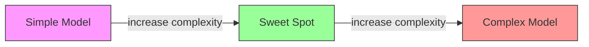
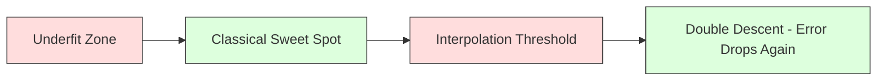
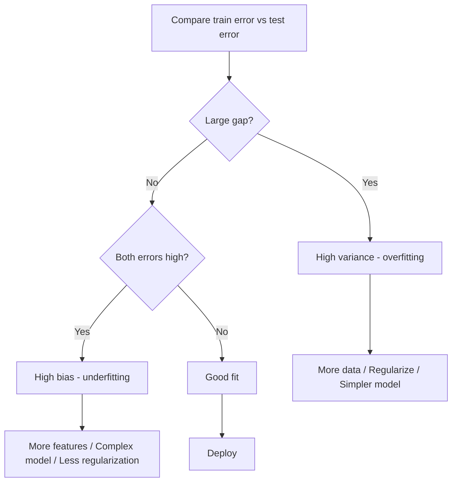
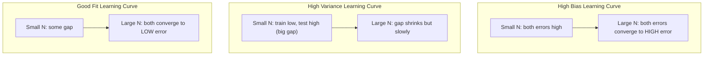
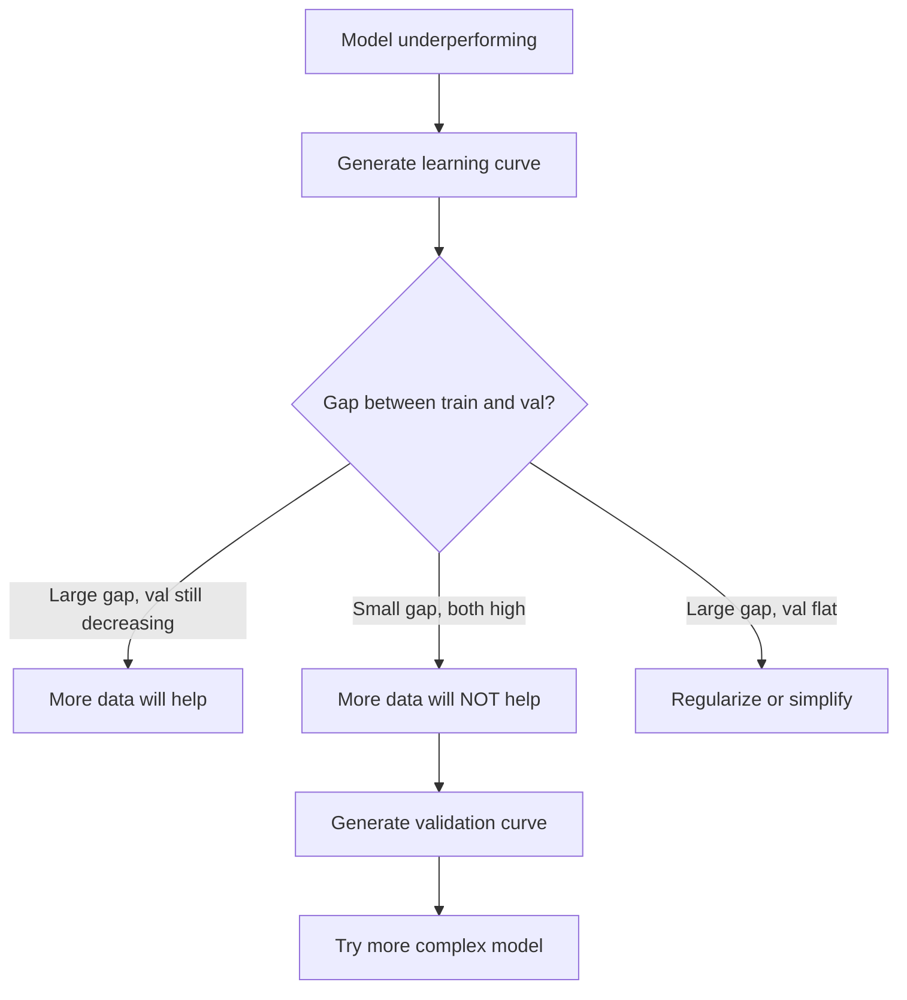

# 偏差變異權衡

> 模型的每一份誤差都來自三個來源之一：偏差、變異，或雜訊。你只能控制前兩個。

**類型：** 學習
**程式語言：** Python
**先修單元：** 階段 2 · 單元 01-09（機器學習基礎、迴歸、分類、評估）
**時間：** 約 75 分鐘

## 學習目標

- 推導預期預測誤差的偏差變異分解，並說明不可約雜訊在其中扮演的角色
- 用訓練誤差與測試誤差的樣態，診斷模型是高偏差還是高變異
- 說明正則化手法（L1、L2、dropout、提早停止）如何用偏差換取變異
- 實作實驗，把複雜度逐步升高的一系列模型上的偏差變異權衡視覺化

## 問題所在

你訓練了一個模型。它在測試資料上有一定的誤差。這些誤差是從哪裡來的？

如果你的模型太簡單（用線性迴歸去配適一份有曲率的資料），它會一貫地錯過真正的模式。這就是偏差。如果你的模型太複雜（用 20 次多項式去配適 15 個資料點），它會完美貼合訓練資料，但在新資料上給出天差地遠的預測。這就是變異。

在模型容量固定的情況下，你無法同時把兩者都壓到最低。把偏差壓下去，變異就上升；把變異壓下去，偏差就上升。理解這個權衡，是機器學習裡最有用的單一診斷能力。它會告訴你該讓模型更複雜還是更簡單、該去拿更多資料還是設計更好的特徵、該加強還是放鬆正則化。

## 核心概念

### 偏差：系統性誤差

偏差衡量的是模型的平均預測離真值有多遠。如果你用從同一個分布抽出的許多份不同訓練集去訓練同一個模型，再把預測平均起來，偏差就是這個平均值與真值之間的落差。

高偏差代表模型太僵硬，抓不到真實的模式。用一條直線去配適拋物線，永遠會錯過那個曲度，不管你給它多少資料都一樣。這就是欠擬合。

```
High bias (underfitting):
  Model always predicts roughly the same wrong thing.
  Training error: HIGH
  Test error: HIGH
  Gap between them: SMALL
```

### 變異：對訓練資料的敏感度

變異衡量的是當你換一批資料子集來訓練時，預測會變動多少。如果訓練集只有小小的改變就讓模型大幅改變，變異就很高。

高變異代表模型在配適訓練資料裡的雜訊，而不是底層的訊號。20 次多項式會穿過每一個訓練點，但在點與點之間劇烈震盪。這就是過度擬合。

```
High variance (overfitting):
  Model fits training data perfectly but fails on new data.
  Training error: LOW
  Test error: HIGH
  Gap between them: LARGE
```

### 分解

對任何一個點 x，在平方損失之下，預期預測誤差可以精確地分解為：

```
Expected Error = Bias^2 + Variance + Irreducible Noise

where:
  Bias^2   = (E[f_hat(x)] - f(x))^2
  Variance = E[(f_hat(x) - E[f_hat(x)])^2]
  Noise    = E[(y - f(x))^2]             (sigma^2)
```

- `f(x)` 是真正的函式
- `f_hat(x)` 是你的模型的預測
- `E[...]` 是對不同訓練集取的期望值
- `y` 是觀測到的標籤（真正的函式加上雜訊）

雜訊項是不可約的。在有雜訊的資料上，沒有任何模型能做得比 sigma^2 更好。你的工作是在 bias^2 與變異之間找到正確的平衡。

### 模型複雜度與誤差



那條經典的 U 型曲線：

| 複雜度 | 偏差 | 變異 | 總誤差 |
|-----------|------|----------|-------------|
| 太低 | HIGH | LOW | HIGH（欠擬合） |
| 剛剛好 | MODERATE | MODERATE | LOWEST |
| 太高 | LOW | HIGH | HIGH（過度擬合） |

### 正則化作為偏差變異的控制手段

正則化刻意提高偏差來換取變異的下降。它約束模型，讓模型沒辦法去追逐雜訊。

- **L2（Ridge）：** 把所有權重朝零收縮。保留所有特徵，但削弱它們的影響力。
- **L1（Lasso）：** 把部分權重直接推到零。等於在做特徵選擇。
- **Dropout：** 訓練時隨機停用神經元。迫使模型學出有冗餘的表示。
- **提早停止：** 在模型完全配適訓練資料之前就停止訓練。

正則化強度（lambda、dropout 比率、訓練輪數）直接決定你坐在偏差變異曲線上的哪個位置。正則化愈強，偏差愈大、變異愈小。

### 雙下降：現代的觀點

古典理論說：過了甜蜜點之後，再增加複雜度只會愈來愈糟。但 2019 年以來的研究呈現了一件出乎意料的事。如果你把模型容量一路推到遠遠超過插值閾值（模型的參數已足以完美配適訓練資料的那個點），測試誤差可以再次下降。



這個「雙下降」現象解釋了為什麼參數量嚴重過剩的神經網路（參數比訓練樣本多得多）依然能有好的泛化能力。古典的偏差變異權衡並沒有錯，但對現代這個範圍來說並不完整。

關於雙下降的幾個關鍵觀察：

- 它會出現在線性模型、決策樹與神經網路上
- 在插值區間裡，更多資料其實可能有害（樣本維度的雙下降）
- 更多訓練輪數也會引發它（輪數維度的雙下降）
- 正則化會把那個尖峰抹平，但不會讓它消失

為什麼會這樣？在插值閾值處，模型的容量剛好足以配適所有訓練點。它被逼進一個非常特定的解，必須穿過每一個點，而資料上的微小擾動就會讓配適結果大幅改變。這就是變異達到高峰的地方。過了這個閾值，模型有許多種都能完美配適資料的解。學習演算法（例如帶有隱性正則化的梯度下降）傾向從其中挑出最簡單的那一個。這種偏向簡單解的隱性偏誤，正是過參數化模型能泛化的原因。

| 範圍 | 參數量與樣本量 | 行為 |
|--------|----------------------|----------|
| 參數不足 | p << n | 古典權衡適用 |
| 插值閾值 | p ~ n | 變異達到高峰，測試誤差暴衝 |
| 參數過剩 | p >> n | 隱性正則化開始發揮作用，測試誤差下降 |

實務上的意思是：如果你在用神經網路或大型樹集成，不要停在插值閾值上。要嘛穩穩地待在它下方（搭配顯性的正則化），要嘛遠遠地衝過它。最糟的位置就是剛好卡在閾值上。

### 診斷你的模型



| 症狀 | 診斷 | 處方 |
|---------|-----------|-----|
| 訓練誤差高、測試誤差高 | 偏差 | 更多特徵、更複雜的模型、放鬆正則化 |
| 訓練誤差低、測試誤差高 | 變異 | 更多資料、正則化、更簡單的模型、dropout |
| 訓練誤差低、測試誤差低 | 配適得剛好 | 可以出貨了 |
| 訓練誤差持續下降、測試誤差開始上升 | 過度擬合正在發生 | 提早停止 |

### 實務策略

**當問題出在偏差：**

- 加入多項式特徵或交互特徵
- 換一個更有彈性的模型（用樹集成取代線性模型）
- 降低正則化強度
- 訓練久一點（如果還沒收斂）

**當問題出在變異：**

- 去拿更多訓練資料
- 使用 bagging（隨機森林）
- 加強正則化（提高 lambda、加大 dropout）
- 做特徵選擇（移除充滿雜訊的特徵）
- 用交叉驗證及早發現它

### 集成方法與變異的降低

集成方法是對抗變異最實用的工具。

**Bagging（Bootstrap Aggregating，自助聚合）** 在訓練資料的多份 bootstrap 樣本上分別訓練模型，再把它們的預測平均起來。每一個個別模型都有很高的變異，但平均之後的變異低得多。隨機森林就是把 bagging 套用到決策樹上。

從數學上看它為什麼有效：如果你把 N 個彼此獨立、變異都是 sigma^2 的預測平均起來，平均值的變異是 sigma^2 / N。這些模型並不是真的獨立（它們看到的資料很相似），所以降幅小於 1/N，但仍然相當可觀。

**Boosting** 透過依序建構模型來降低偏差，其中每一個新模型都專注在目前集成所犯的錯誤上。梯度提升與 AdaBoost 是主要的例子。如果加入太多模型，boosting 也會過度擬合，所以你需要提早停止或正則化。

| 方法 | 主要效果 | 偏差的變化 | 變異的變化 |
|--------|---------------|-------------|-----------------|
| Bagging | 降低變異 | 不變 | 下降 |
| Boosting | 降低偏差 | 下降 | 可能上升 |
| Stacking | 兩者都降低 | 取決於後設學習器 | 取決於基礎模型 |
| Dropout | 隱性的 bagging | 略微上升 | 下降 |

**實務原則：** 如果你的基礎模型變異很高（很深的樹、高次多項式），用 bagging。如果你的基礎模型偏差很高（很淺的決策樁、簡單的線性模型），用 boosting。

### 學習曲線

學習曲線把訓練誤差與驗證誤差畫成訓練集大小的函式。它們是你手上最實用的診斷工具。跟單一次的訓練／測試比較不同，學習曲線呈現的是模型的變化軌跡，並告訴你更多資料到底有沒有用。



怎麼讀它們：

| 情境 | 訓練誤差 | 驗證誤差 | 落差 | 代表什麼 | 該怎麼做 |
|----------|---------------|-----------------|-----|---------------|------------|
| 高偏差 | 高 | 高 | 小 | 模型抓不到那個模式 | 更多特徵、更複雜的模型、放鬆正則化 |
| 高變異 | 低 | 高 | 大 | 模型把訓練資料背下來了 | 更多資料、正則化、更簡單的模型 |
| 配適得剛好 | 中等 | 中等 | 小 | 模型泛化得很好 | 可以出貨了 |
| 高變異，但在改善 | 低 | 隨資料增加而下降 | 正在縮小 | 資料能解決的變異問題 | 蒐集更多資料 |
| 高偏差，而且平坦 | 高 | 高且平坦 | 小且平坦 | 更多資料不會有幫助 | 換模型架構 |

關鍵洞見：如果兩條曲線都已經打平、落差很小，但兩邊的誤差都很高，那更多資料毫無用處，你需要的是更好的模型。如果落差很大而且還在縮小，那更多資料會有幫助。

### 如何產生學習曲線

有兩種做法：

**做法 1：改變訓練集大小，固定模型。** 把模型與超參數固定住，在愈來愈大的訓練資料子集上訓練，在每一個大小上量測訓練誤差與驗證誤差。這就是標準的學習曲線。

**做法 2：改變模型複雜度，固定資料。** 把資料固定住，掃過某個複雜度參數（多項式次數、樹的深度、層數），在每一個複雜度上量測訓練誤差與驗證誤差。這叫驗證曲線，它直接呈現偏差變異權衡。

兩種做法互相補足。第一種告訴你更多資料有沒有幫助，第二種告訴你換個模型有沒有幫助。在決定下一步之前，兩種都跑一遍。



```figure
bias-variance
```

## 動手實作

`code/bias_variance.py` 裡的程式碼會跑完整套偏差變異分解實驗。以下逐步說明它的做法。

### 步驟 1：從一個已知的函式生成合成資料

我們用 `f(x) = sin(1.5x) + 0.5x`，再加上高斯雜訊。因為知道真正的函式，我們才能算出精確的偏差與變異。

```python
def true_function(x):
    return np.sin(1.5 * x) + 0.5 * x

def generate_data(n_samples=30, noise_std=0.5, x_range=(-3, 3), seed=None):
    rng = np.random.RandomState(seed)
    x = rng.uniform(x_range[0], x_range[1], n_samples)
    y = true_function(x) + rng.normal(0, noise_std, n_samples)
    return x, y
```

### 步驟 2：Bootstrap 抽樣與多項式配適

對每一個多項式次數，我們抽出許多份 bootstrap 訓練集，配適多項式，並記錄在一個固定的測試網格上的預測。這樣就得到了每個測試點上的預測分布。

```python
def fit_polynomial(x_train, y_train, degree, lam=0.0):
    X = np.column_stack([x_train ** d for d in range(degree + 1)])
    if lam > 0:
        penalty = lam * np.eye(X.shape[1])
        penalty[0, 0] = 0
        w = np.linalg.solve(X.T @ X + penalty, X.T @ y_train)
    else:
        w = np.linalg.lstsq(X, y_train, rcond=None)[0]
    return w
```

我們在 200 份不同的 bootstrap 樣本上配適。每一份 bootstrap 樣本都來自同一個底層分布，但包含的點不一樣。

### 步驟 3：計算 Bias^2 與變異的分解

有了每個測試點上的 200 組預測，我們就能直接按定義算出這個分解：

```python
mean_pred = predictions.mean(axis=0)
bias_sq = np.mean((mean_pred - y_true) ** 2)
variance = np.mean(predictions.var(axis=0))
total_error = np.mean(np.mean((predictions - y_true) ** 2, axis=1))
```

- `mean_pred` 是用 bootstrap 樣本估出來的 E[f_hat(x)]
- `bias_sq` 是平均預測與真值之間落差的平方
- `variance` 是預測在各個 bootstrap 樣本之間的平均離散程度
- `total_error` 應該大致等於 bias^2 + variance + noise

### 步驟 4：學習曲線

學習曲線在固定模型複雜度的前提下掃過訓練集大小。它們顯示出你的模型是受限於資料量，還是受限於容量。

```python
def demo_learning_curves():
    sizes = [10, 15, 20, 30, 50, 75, 100, 150, 200, 300]
    degree = 5

    for n in sizes:
        train_errors = []
        test_errors = []
        for seed in range(50):
            x_train, y_train = generate_data(n_samples=n, seed=seed * 100)
            w = fit_polynomial(x_train, y_train, degree)
            train_pred = predict_polynomial(x_train, w)
            train_mse = np.mean((train_pred - y_train) ** 2)
            test_pred = predict_polynomial(x_test, w)
            test_mse = np.mean((test_pred - y_test) ** 2)
            train_errors.append(train_mse)
            test_errors.append(test_mse)
        # Average over runs gives the learning curve point
```

對一個高變異的模型（次數 5 搭配少量資料），你會看到：

- 訓練誤差一開始很低，然後隨著資料變多、背答案變難而上升
- 測試誤差一開始很高，然後隨著模型拿到更多訊號而下降
- 落差隨著資料變多而縮小

對一個高偏差的模型（次數 1），兩邊的誤差都會很快收斂到同一個很高的值，而且更多資料也沒有幫助。

### 步驟 5：正則化掃描

程式碼裡也包含 `demo_regularization_sweep()`，它固定住一個高次多項式（次數 15），並把 Ridge 正則化強度從 0.001 掃到 100。這是從另一個角度呈現偏差變異權衡：不是改變模型複雜度，而是改變約束的強度。

```python
def demo_regularization_sweep():
    alphas = [0.001, 0.005, 0.01, 0.05, 0.1, 0.5, 1.0, 5.0, 10.0, 50.0, 100.0]
    for alpha in alphas:
        results = bias_variance_decomposition([15], lam=alpha)
        r = results[15]
        print(f"alpha={alpha:.3f}  bias={r['bias_sq']:.4f}  var={r['variance']:.4f}")
```

alpha 很低時，這個 15 次多項式幾乎沒有受到約束。變異主導一切，因為模型會去追逐每一份 bootstrap 樣本裡的雜訊。alpha 很高時，懲罰強到讓模型實際上變成一個近乎常數的函式，偏差主導一切。最佳的 alpha 坐在這兩個極端之間。

這跟改變多項式次數得到的 U 型曲線是同一回事，只是換成用一個連續的旋鈕來控制，而不是離散的。實務上，正則化是控制這個權衡的首選方式，因為它讓你能細緻地調整，又不必動到特徵集。

## 框架應用

sklearn 提供 `learning_curve` 與 `validation_curve`，讓你不必自己寫 bootstrap 迴圈就能自動做完這些診斷。

### 驗證曲線：掃過模型複雜度

```python
from sklearn.model_selection import validation_curve
from sklearn.pipeline import make_pipeline
from sklearn.preprocessing import PolynomialFeatures
from sklearn.linear_model import Ridge

degrees = list(range(1, 16))
train_scores_all = []
val_scores_all = []

for d in degrees:
    pipe = make_pipeline(PolynomialFeatures(d), Ridge(alpha=0.01))
    train_scores, val_scores = validation_curve(
        pipe, X, y, param_name="polynomialfeatures__degree",
        param_range=[d], cv=5, scoring="neg_mean_squared_error"
    )
    train_scores_all.append(-train_scores.mean())
    val_scores_all.append(-val_scores.mean())
```

這會直接給你偏差變異權衡的曲線。驗證分數相對於訓練分數最差的地方，是變異主導；兩邊都很糟的地方，是偏差主導。

### 學習曲線：掃過訓練集大小

```python
from sklearn.model_selection import learning_curve

pipe = make_pipeline(PolynomialFeatures(5), Ridge(alpha=0.01))
train_sizes, train_scores, val_scores = learning_curve(
    pipe, X, y, train_sizes=np.linspace(0.1, 1.0, 10),
    cv=5, scoring="neg_mean_squared_error"
)
train_mse = -train_scores.mean(axis=1)
val_mse = -val_scores.mean(axis=1)
```

把 `train_mse` 與 `val_mse` 對 `train_sizes` 畫出來。它的形狀會告訴你關於這個模型的一切。

### 交叉驗證搭配正則化掃描

```python
from sklearn.model_selection import cross_val_score

alphas = [0.001, 0.01, 0.1, 1.0, 10.0, 100.0]
for alpha in alphas:
    pipe = make_pipeline(PolynomialFeatures(10), Ridge(alpha=alpha))
    scores = cross_val_score(pipe, X, y, cv=5, scoring="neg_mean_squared_error")
    print(f"alpha={alpha:>7.3f}  MSE={-scores.mean():.4f} +/- {scores.std():.4f}")
```

這是在模型複雜度固定的情況下掃過正則化強度。你會看到同一個偏差變異權衡：alpha 低代表高變異，alpha 高代表高偏差。

### 全部串起來：一套完整的診斷流程

實務上，你會依序跑完這些診斷：

1. 訓練你的模型。算出訓練誤差與測試誤差。
2. 如果兩邊都很高：你遇到的是偏差問題。直接跳到步驟 4。
3. 如果訓練誤差低但測試誤差高：你遇到的是變異問題。畫一條學習曲線，看更多資料有沒有幫助。如果沒有，就加正則化。
4. 掃過你的主要複雜度參數，畫出驗證曲線。找出甜蜜點。
5. 在那個甜蜜點上再畫一條學習曲線。如果落差還是很大，你需要更多資料或更強的正則化。
6. 用 `cross_val_score` 試不同的 alpha 值跑 Ridge／Lasso。挑交叉驗證誤差最低的那個 alpha。

對大多數表格式資料集來說，這只需要 10 到 15 分鐘的運算時間，卻能省下好幾個小時的瞎猜。

## 產出交付

這一課會產出：`outputs/prompt-model-diagnostics.md`

## 練習

1. 用 `noise_std=0`（沒有雜訊）跑一次分解。不可約誤差項會發生什麼事？最佳複雜度有改變嗎？

2. 把訓練集大小從 30 提高到 300。這對變異這個成分有什麼影響？最佳的多項式次數會位移嗎？

3. 在實驗裡加入 L2 正則化（Ridge 迴歸）。固定一個高次多項式（次數 15），把 lambda 從 0 掃到 100。把 bias^2 與變異畫成 lambda 的函式。

4. 把真正的函式從多項式改成 `sin(x)`。偏差變異分解會有什麼變化？還存在一個明確的最佳次數嗎？

5. 實作一個簡單的自助聚合（bagging）包裝器：在 bootstrap 樣本上訓練 10 個模型，再把預測平均起來。證明這能降低變異，而偏差不會增加太多。

## 關鍵術語

| 術語 | 大家怎麼說 | 實際上是什麼 |
|------|----------------|----------------------|
| 偏差 | 「模型太簡單了」 | 來自錯誤假設的系統性誤差。模型平均預測與真值之間的落差。 |
| 變異 | 「模型過度擬合了」 | 來自對訓練資料敏感的誤差。預測在不同訓練集之間變動的幅度。 |
| 不可約誤差 | 「資料裡的雜訊」 | 來自真實資料生成過程本身隨機性的誤差。沒有任何模型能消除它。 |
| 欠擬合 | 「學得不夠」 | 模型偏差很高。連在訓練資料上都抓不到真實的模式。 |
| 過度擬合 | 「把資料背下來了」 | 模型變異很高。它配適了訓練資料裡無法泛化的雜訊。 |
| 正則化 | 「約束模型」 | 加上一個懲罰項來降低模型複雜度，用偏差換取更低的變異。 |
| 雙下降 | 「參數更多也可能有幫助」 | 當模型容量遠遠超過插值閾值時，測試誤差會再次下降。 |
| 模型複雜度 | 「模型有多有彈性」 | 模型配適任意模式的容量。由架構、特徵或正則化決定。 |

## 延伸閱讀

- [Hastie, Tibshirani, Friedman: Elements of Statistical Learning, Ch. 7](https://hastie.su.domains/ElemStatLearn/) —— 偏差變異分解最權威的處理
- [Belkin et al., Reconciling modern machine learning practice and the bias-variance trade-off (2019)](https://arxiv.org/abs/1812.11118) —— 雙下降的原始論文
- [Nakkiran et al., Deep Double Descent (2019)](https://arxiv.org/abs/1912.02292) —— 輪數維度與樣本維度的雙下降
- [Scott Fortmann-Roe: Understanding the Bias-Variance Tradeoff](http://scott.fortmann-roe.com/docs/BiasVariance.html) —— 清楚的視覺化說明
