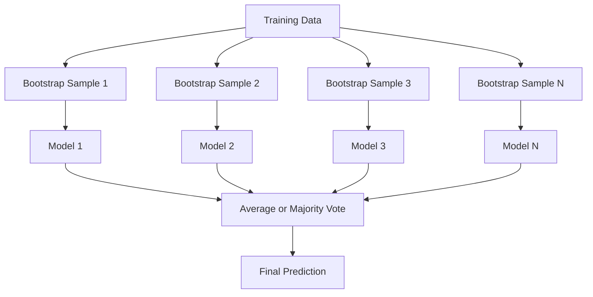
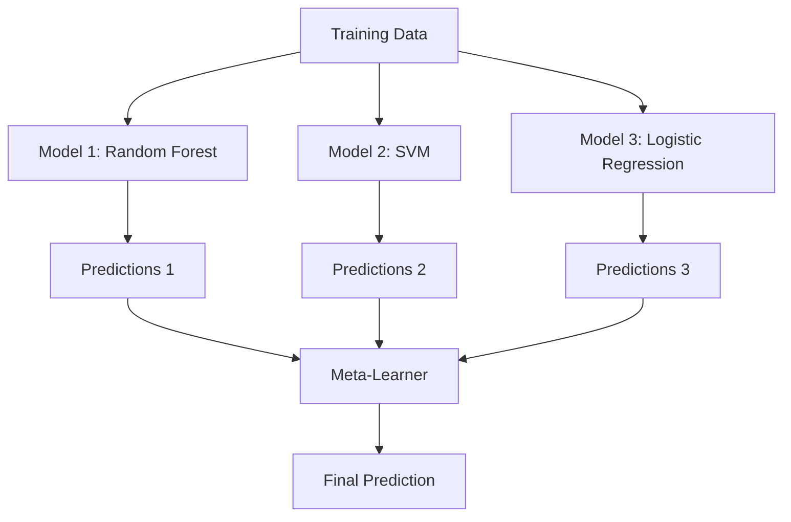

# 集成方法

> 一群弱學習器，只要組合的方式正確，就會變成一個強學習器。這不是什麼比喻，這是一條定理。

**類型：** 實作
**程式語言：** Python
**先修單元：** 階段 2 · 10（偏差與變異的取捨）
**時間：** 約 120 分鐘

## 學習目標

- 從零實作 AdaBoost 與梯度提升，並說明提升法是怎麼靠循序修正來降低偏差
- 建構一個自助聚合的集成，並示範平均去相關的模型能在不增加偏差的情況下降低變異
- 從「各自針對哪一塊誤差」的角度比較自助聚合、提升法與堆疊
- 評估集成的多樣性，並說明為什麼獨立的弱學習器越多，多數投票的準確率就越高

## 問題所在

單一棵決策樹訓練得快、也容易解讀，但它會過度擬合。單一個線性模型碰到複雜邊界則會擬合不足。你可以花好幾天去雕出完美的模型架構。或者，你可以把一堆不完美的模型組合起來，得到比其中任何一個都更好的東西。

集成方法做的就是這件事。在表格資料上，它是贏下 Kaggle 競賽最可靠的技術；它撐起了大多數上線的機器學習系統；它也把偏差與變異的取捨活生生演了一遍。自助聚合降低變異。提升法降低偏差。堆疊則學習「在什麼樣的輸入上該相信哪個模型」。

## 核心概念

### 集成為什麼有效

假設你有 N 個彼此獨立的分類器，每個的準確率都是 p > 0.5。那麼多數投票的準確率是：

```
P(majority correct) = sum over k > N/2 of C(N,k) * p^k * (1-p)^(N-k)
```

對 21 個各有 60% 準確率的分類器來說，多數投票的準確率約為 74%。換成 101 個分類器，會升到 84%。當各個模型犯的錯不一樣時，誤差就會互相抵消。

關鍵條件是**多樣性**。如果所有模型都犯一樣的錯，把它們組合起來一點幫助也沒有。集成之所以有效，是因為它靠下面這些方式製造出彼此不同的模型：

- 不同的訓練子集（自助聚合）
- 不同的特徵子集（random forests）
- 循序的誤差修正（提升法）
- 不同的模型家族（堆疊）

### 自助聚合（Bootstrap Aggregating）

自助聚合靠讓每個模型在一份不同的訓練資料自助抽樣上訓練，來製造多樣性。



自助抽樣是從原始資料裡有放回抽出來的，大小和原始資料相同。每份自助抽樣裡大約會出現 63.2% 的相異樣本。剩下的 36.8%（袋外樣本）則免費提供了一組驗證集。

自助聚合能降低變異，而偏差幾乎不增加。每棵樹都對自己那份自助抽樣過度擬合，但每棵樹過度擬合的方式不一樣，所以平均起來雜訊就被抵消掉了。

**Random Forests** 是自助聚合再加上一道手腳：每次分裂時只考慮一個隨機的特徵子集。這會逼出更多的多樣性。候選特徵數的常見設定是分類用 `sqrt(n_features)`、迴歸用 `n_features / 3`。

### 提升法（循序修正誤差）

提升法是循序訓練模型的。每個新模型都把注意力放在前面的模型答錯的那些樣本上。


提升法降低偏差。每個新模型都在修正目前這個集成的系統性誤差。最終預測是所有模型的加權和，表現越好的模型權重越高。

代價是：如果你跑太多輪，提升法會過度擬合，因為它會一直去擬合越來越難的樣本，而其中有些可能只是雜訊。

### AdaBoost

AdaBoost（Adaptive Boosting）是第一個實用的提升法演算法。它可以搭配任何基學習器，典型的選擇是決策樹樁（深度 1 的樹）。

演算法如下：

```
1. Initialize sample weights: w_i = 1/N for all i

2. For t = 1 to T:
   a. Train weak learner h_t on weighted data
   b. Compute weighted error:
      err_t = sum(w_i * I(h_t(x_i) != y_i)) / sum(w_i)
   c. Compute model weight:
      alpha_t = 0.5 * ln((1 - err_t) / err_t)
   d. Update sample weights:
      w_i = w_i * exp(-alpha_t * y_i * h_t(x_i))
   e. Normalize weights to sum to 1

3. Final prediction: H(x) = sign(sum(alpha_t * h_t(x)))
```

誤差越低的模型拿到越高的 alpha。被分錯的樣本權重會被調高，好讓下一個模型專心處理它們。

### 梯度提升

梯度提升把提升法推廣到任意的損失函式。它不再去重新調整樣本權重，而是讓每個新模型去擬合目前集成的殘差（也就是損失的負梯度）。

```
1. Initialize: F_0(x) = argmin_c sum(L(y_i, c))

2. For t = 1 to T:
   a. Compute pseudo-residuals:
      r_i = -dL(y_i, F_{t-1}(x_i)) / dF_{t-1}(x_i)
   b. Fit a tree h_t to the residuals r_i
   c. Find optimal step size:
      gamma_t = argmin_gamma sum(L(y_i, F_{t-1}(x_i) + gamma * h_t(x_i)))
   d. Update:
      F_t(x) = F_{t-1}(x) + learning_rate * gamma_t * h_t(x)

3. Final prediction: F_T(x)
```

在平方誤差損失下，偽殘差就是真正的殘差：`r_i = y_i - F_{t-1}(x_i)`。每棵樹確實就是在擬合前一個集成的誤差。

學習率（收縮）控制每棵樹的貢獻有多大。學習率越小需要的樹越多，但泛化得更好。典型值是 0.01 到 0.3。

### XGBoost：它為什麼主導表格資料

XGBoost（eXtreme Gradient Boosting）是梯度提升加上一連串工程最佳化，讓它又快、又準、又不容易過度擬合：

- **帶正則化的目標函式：** 對葉節點權重施加 L1 與 L2 懲罰，避免單棵樹過度自信
- **二階近似：** 同時用上損失的一階與二階導數，做出更好的分裂決策
- **對稀疏友善的分裂：** 原生處理缺失值，在每次分裂時學出缺失資料該往哪一邊走
- **欄取樣：** 和 random forests 一樣，每次分裂都抽樣特徵以增加多樣性
- **加權分位數草圖：** 在分散式資料上有效率地為連續特徵找出分裂點
- **對快取友善的區塊結構：** 記憶體排佈針對 CPU 快取行最佳化

在表格資料上，XGBoost（以及它的後繼者 LightGBM）始終勝過神經網路。這件事短期內不會改變。如果你的資料裝得進一張有列有欄的表格，就從梯度提升開始。

### 堆疊（元學習）

堆疊把多個基模型的預測當成特徵，餵給一個元學習器。



元學習器學的是：面對什麼樣的輸入，該相信哪一個基模型。如果 random forest 在某些區域比較準、SVM 在另一些區域比較準，元學習器就會學會照這樣分流。

為了避免資料洩漏，基模型的預測必須透過在訓練集上做交叉驗證來產生。絕對不要在同一批資料上同時訓練基模型並產生元特徵。

### 投票

最簡單的集成。直接把預測結果合起來就好。

- **硬投票：** 對類別標籤做多數投票。
- **軟投票：** 把預測機率平均起來，挑平均機率最高的類別。通常表現更好，因為它用上了信心程度的資訊。

## 動手實作

### 步驟 1：決策樹樁（基學習器）

`code/ensembles.py` 裡的程式碼全都是從零實作的。我們從決策樹樁開始：一棵只有單一次分裂的樹。

```python
class DecisionStump:
    def __init__(self):
        self.feature_idx = None
        self.threshold = None
        self.polarity = 1
        self.alpha = None

    def fit(self, X, y, weights):
        n_samples, n_features = X.shape
        best_error = float("inf")

        for f in range(n_features):
            thresholds = np.unique(X[:, f])
            for thresh in thresholds:
                for polarity in [1, -1]:
                    pred = np.ones(n_samples)
                    pred[polarity * X[:, f] < polarity * thresh] = -1
                    error = np.sum(weights[pred != y])
                    if error < best_error:
                        best_error = error
                        self.feature_idx = f
                        self.threshold = thresh
                        self.polarity = polarity

    def predict(self, X):
        n = X.shape[0]
        pred = np.ones(n)
        idx = self.polarity * X[:, self.feature_idx] < self.polarity * self.threshold
        pred[idx] = -1
        return pred
```

### 步驟 2：從零實作 AdaBoost

```python
class AdaBoostScratch:
    def __init__(self, n_estimators=50):
        self.n_estimators = n_estimators
        self.stumps = []
        self.alphas = []

    def fit(self, X, y):
        n = X.shape[0]
        weights = np.full(n, 1 / n)

        for _ in range(self.n_estimators):
            stump = DecisionStump()
            stump.fit(X, y, weights)
            pred = stump.predict(X)

            err = np.sum(weights[pred != y])
            err = np.clip(err, 1e-10, 1 - 1e-10)

            alpha = 0.5 * np.log((1 - err) / err)
            weights *= np.exp(-alpha * y * pred)
            weights /= weights.sum()

            stump.alpha = alpha
            self.stumps.append(stump)
            self.alphas.append(alpha)

    def predict(self, X):
        total = sum(a * s.predict(X) for a, s in zip(self.alphas, self.stumps))
        return np.sign(total)
```

### 步驟 3：從零實作梯度提升

```python
class GradientBoostingScratch:
    def __init__(self, n_estimators=100, learning_rate=0.1, max_depth=3):
        self.n_estimators = n_estimators
        self.lr = learning_rate
        self.max_depth = max_depth
        self.trees = []
        self.initial_pred = None

    def fit(self, X, y):
        self.initial_pred = np.mean(y)
        current_pred = np.full(len(y), self.initial_pred)

        for _ in range(self.n_estimators):
            residuals = y - current_pred
            tree = SimpleRegressionTree(max_depth=self.max_depth)
            tree.fit(X, residuals)
            update = tree.predict(X)
            current_pred += self.lr * update
            self.trees.append(tree)

    def predict(self, X):
        pred = np.full(X.shape[0], self.initial_pred)
        for tree in self.trees:
            pred += self.lr * tree.predict(X)
        return pred
```

### 步驟 4：和 sklearn 對照

程式碼會驗證我們從零寫出來的實作，準確率和 sklearn 的 `AdaBoostClassifier` 與 `GradientBoostingClassifier` 相近，並把所有方法並排比較。

## 框架應用

### 各種方法該在什麼時候用

| 方法 | 降低什麼 | 最適合 | 要注意 |
|--------|---------|----------|---------------|
| 自助聚合／Random Forest | 變異 | 有雜訊的資料、特徵很多 | 對偏差沒有幫助 |
| AdaBoost | 偏差 | 乾淨的資料、簡單的基學習器 | 對離群值與雜訊敏感 |
| 梯度提升 | 偏差 | 表格資料、競賽 | 訓練慢，不調參很容易過度擬合 |
| XGBoost／LightGBM | 兩者都降 | 上線的表格機器學習 | 超參數很多 |
| 堆疊 | 兩者都降 | 榨出最後 1-2% 的準確率 | 複雜，元學習器有過度擬合的風險 |
| 投票 | 變異 | 快速把幾個不同的模型併起來 | 只有在模型夠多樣時才有用 |

### 表格資料的實戰組合

面對大多數表格預測問題，這是嘗試的順序：

1. 用預設參數跑 **LightGBM 或 XGBoost**
2. 調 n_estimators、learning_rate、max_depth、min_child_weight
3. 如果還想再多榨出 0.5%，就用 3 到 5 個不同的模型建一個堆疊集成
4. 全程都用交叉驗證

在表格資料上，神經網路幾乎總是比梯度提升差，儘管研究上的嘗試一直沒停過。TabNet、NODE 之類的架構偶爾能打平，但很少贏過一個調校妥當的 XGBoost。

## 產出交付

這個單元會產出 `outputs/prompt-ensemble-selector.md`——一個幫你為特定資料集挑出正確集成方法的提示詞。描述你的資料（大小、特徵型別、雜訊程度、類別是否平衡）以及你要解決的問題，這個提示詞會帶你走過一份決策檢查清單，推薦一個方法，建議起始的超參數，並提醒你這個方法常見的坑。另外也會產出 `outputs/skill-ensemble-builder.md`，裡面是完整的選擇指南。

## 練習

1. 修改 AdaBoost 的實作，讓它記錄每一輪之後的訓練準確率。把準確率對估計器數量畫出來。它什麼時候收斂？

2. 從零實作一座 random forest：在迴歸樹上加入隨機特徵取樣。用 `max_features=sqrt(n_features)` 訓練 100 棵樹並平均預測。把變異降低的幅度和單一棵樹比較。

3. 在梯度提升的實作裡加入提早停止：記錄每一輪之後的驗證損失，連續 10 輪沒有改善就停下來。它實際上需要幾棵樹？

4. 用三個基模型（邏輯迴歸、決策樹、k 最近鄰）加上一個邏輯迴歸元學習器，建一個堆疊集成。用 5 折交叉驗證來產生元特徵。和每個基模型單獨的表現做比較。

5. 在同一份資料集上用預設參數跑 XGBoost。把它的準確率和你從零寫的梯度提升比較。兩者都計時。速度差距有多大？

## 關鍵術語

| 術語 | 大家怎麼說 | 實際上是什麼 |
|------|----------------|----------------------|
| 自助聚合 | 「在隨機子集上訓練」 | Bootstrap aggregating：讓模型各自在一份自助抽樣上訓練，再平均預測以降低變異 |
| 提升法 | 「專攻難的樣本」 | 循序訓練模型，每一個都修正目前集成的誤差，用來降低偏差 |
| AdaBoost | 「把資料重新加權」 | 靠更新樣本權重來做提升；被分錯的點在下一個學習器裡會拿到更高的權重 |
| 梯度提升 | 「去擬合殘差」 | 讓每個新模型去擬合損失函式的負梯度，藉此做提升 |
| XGBoost | 「Kaggle 神兵」 | 加上正則化、二階最佳化與系統層級加速技巧的梯度提升 |
| 堆疊 | 「模型疊在模型上」 | 把基模型的預測當成輸入特徵，餵給一個元學習器 |
| Random forest | 「一堆隨機化的樹」 | 用決策樹做的自助聚合，並在每次分裂加上隨機特徵取樣以增加多樣性 |
| 集成多樣性 | 「犯不一樣的錯」 | 各模型的誤差必須彼此不相關，集成才可能比單一模型更好 |
| 袋外誤差 | 「免費的驗證集」 | 沒被某次自助抽樣抽到的樣本（約 36.8%），可以當驗證集用，不必另外切一份保留資料 |

## 延伸閱讀

- [Schapire & Freund: Boosting: Foundations and Algorithms](https://mitpress.mit.edu/9780262526036/) —— AdaBoost 作者們寫的書
- [Friedman: Greedy Function Approximation: A Gradient Boosting Machine (2001)](https://statweb.stanford.edu/~jhf/ftp/trebst.pdf) —— 梯度提升的原始論文
- [Chen & Guestrin: XGBoost (2016)](https://arxiv.org/abs/1603.02754) —— XGBoost 論文
- [Wolpert: Stacked Generalization (1992)](https://www.sciencedirect.com/science/article/abs/pii/S0893608005800231) —— 堆疊的原始論文
- [scikit-learn Ensemble Methods](https://scikit-learn.org/stable/modules/ensemble.html) —— 實用參考資料
