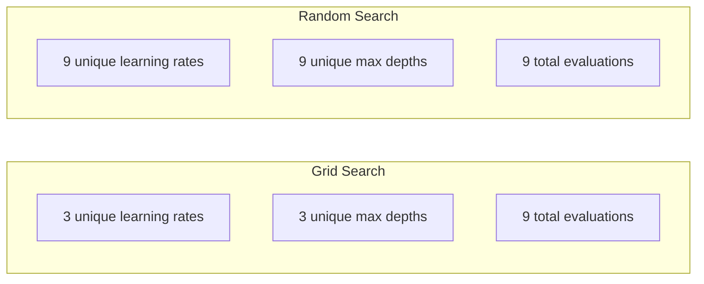
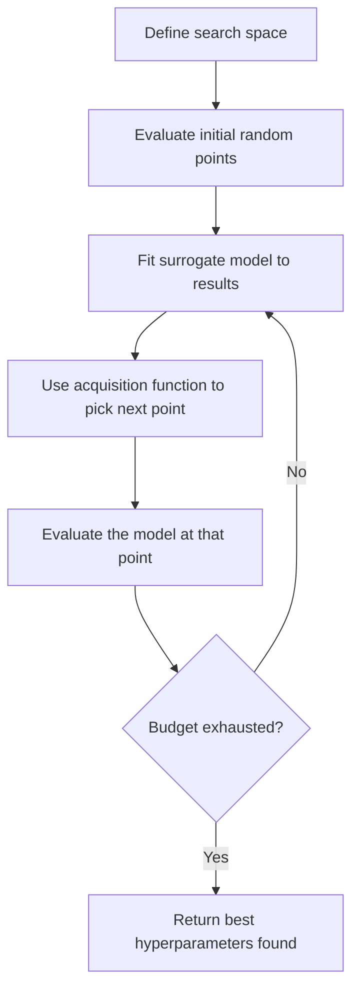
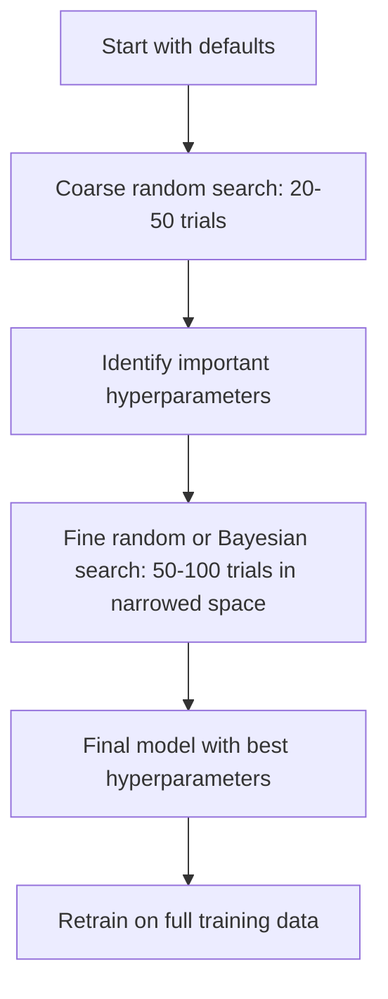
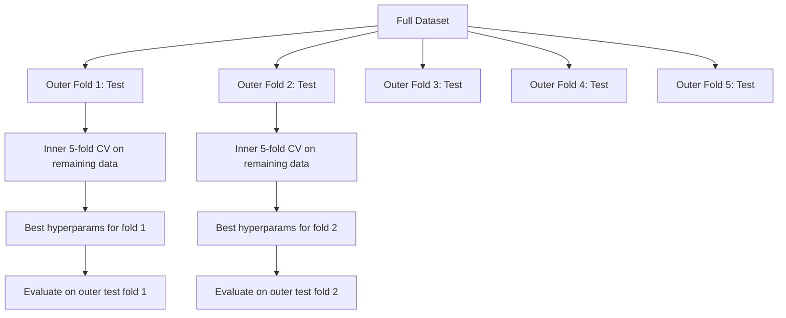

# 超參數調校

> 超參數是訓練開始前你要轉的那些旋鈕。轉得好，就是平庸模型與優秀模型的差別。

**類型：** 實作
**程式語言：** Python
**先修單元：** 階段 2 · 11（集成方法）
**時間：** 約 90 分鐘

## 學習目標

- 從零實作網格搜尋、隨機搜尋與貝氏最佳化，並比較它們的取樣效率
- 說明為什麼當大多數超參數的有效維度很低時，隨機搜尋會勝過網格搜尋
- 用代理模型與採集函式打造一個貝氏最佳化迴圈來引導搜尋
- 設計一套超參數調校策略，透過恰當的交叉驗證避免過度擬合驗證集

## 問題所在

你的梯度提升模型有學習率、樹的數量、最大深度、每葉最少樣本數、子取樣比例，以及欄取樣比例。這是六個超參數。如果每個各有 5 個合理的值，網格就有 5^6 = 15,625 種組合。每次訓練要 10 秒，全部試完就是 43 小時的運算。

網格搜尋是最直覺的做法，也是規模一大就最糟的做法。隨機搜尋用更少的運算就能做得更好。貝氏最佳化會從過去的評估中學習，因此表現又更好。知道該用哪一種策略、哪些超參數真的重要，能省下好幾天白燒的 GPU 時間。

## 核心概念

### 參數與超參數

參數是訓練過程中學到的（權重、偏差、分裂閾值）。超參數是在訓練開始前就設定好的，它控制學習怎麼進行。

| 超參數 | 控制什麼 | 常見範圍 |
|---------------|-----------------|---------------|
| 學習率 | 每次更新的步伐大小 | 0.001 到 1.0 |
| 樹的數量／epoch 數 | 訓練多久 | 10 到 10,000 |
| 最大深度 | 模型複雜度 | 1 到 30 |
| 正則化（lambda） | 防止過度擬合 | 0.0001 到 100 |
| 批次大小 | 梯度估計的雜訊 | 16 到 512 |
| Dropout 比例 | 被丟掉的神經元比例 | 0.0 到 0.5 |

### 網格搜尋

網格搜尋會評估指定值的每一種組合。它窮盡、好懂，但成本會隨超參數個數指數成長。

```
Grid for 2 hyperparameters:

  learning_rate: [0.01, 0.1, 1.0]
  max_depth:     [3, 5, 7]

  Evaluations: 3 x 3 = 9 combinations

  (0.01, 3)  (0.01, 5)  (0.01, 7)
  (0.1,  3)  (0.1,  5)  (0.1,  7)
  (1.0,  3)  (1.0,  5)  (1.0,  7)
```

網格搜尋有個根本缺陷：如果其中一個超參數重要、另一個不重要，那大部分的評估都被浪費掉了。9 次評估只換到重要參數的 3 個不同取值。

### 隨機搜尋

隨機搜尋是從分布中抽樣超參數，而不是走網格。同樣 9 次評估的預算，你會拿到每個超參數各 9 個不同的取值。



為什麼隨機勝過網格（Bergstra & Bengio, 2012）：

- 大多數超參數的有效維度很低。對某個特定問題來說，6 個超參數裡通常只有 1 到 2 個真的有影響。
- 網格搜尋把評估次數浪費在不重要的維度上。
- 同樣的預算下，隨機搜尋能更密集地覆蓋重要的維度。
- 跑 60 次隨機試驗，你有 95% 的機會找到落在最佳值 5% 以內的點（前提是搜尋空間裡真的有這個點）。

### 貝氏最佳化

隨機搜尋不看結果。它學不到「高學習率會讓訓練發散」，也學不到「深度 3 一直都比深度 10 好」。貝氏最佳化會用過去的評估來決定下一步該往哪裡搜尋。



兩個關鍵元件：

**代理模型：** 一個評估起來很便宜的模型（通常是高斯過程），用來近似那個昂貴的目標函式。它在搜尋空間中的任何一點，都能同時給出預測值與不確定性估計。

**採集函式：** 透過在利用（在已知的好點附近搜尋）與探索（往不確定性高的地方搜尋）之間取得平衡，決定下一個要評估的點。常見的選擇有：

- **期望改善量（EI）：** 在這一點上，我們預期會比目前最佳值好多少？
- **信賴上界（UCB）：** 預測值加上不確定性的某個倍數。UCB 高代表這一點要嘛有潛力，要嘛還沒被探索過。
- **改善機率（PI）：** 這一點勝過目前最佳值的機率有多大？

貝氏最佳化通常能用少 2 到 5 倍的評估次數，找到比隨機搜尋更好的超參數。配適代理模型的額外成本，跟訓練真正的模型比起來微不足道。

### 提早停止

不是每一次訓練都得跑完。如果某個設定跑了 10 個 epoch 就明顯很爛，就停掉它、換下一個。這就是超參數搜尋情境下的提早停止。

策略：
- **基於耐心值：** 如果驗證損失連續 N 個 epoch 都沒進步就停下來
- **中位數修剪：** 如果某次試驗在同一步的中間結果比已完成試驗的中位數還差，就停下來
- **Hyperband：** 先給很多組設定各一點小預算，再逐步把預算加到表現最好的那幾組上

Hyperband 特別有效。它讓 81 組設定各跑 1 個 epoch，留下前三分之一，給它們 3 個 epoch，再留下前三分之一，依此類推。這樣找到好設定的速度，比讓所有設定都跑完整預算快 10 到 50 倍。

### 學習率排程器

學習率幾乎總是最重要的超參數。與其固定不動，排程器會在訓練途中調整它。

| 排程器 | 公式 | 什麼時候用 |
|-----------|---------|-------------|
| 階梯式衰減 | 每 N 個 epoch 乘以 0.1 | 經典的 CNN 訓練 |
| 餘弦退火 | lr * 0.5 * (1 + cos(pi * t / T)) | 現代的預設選擇 |
| 暖身加衰減 | 先線性上升，再餘弦衰減 | Transformer |
| One-cycle | 在一個週期內先升後降 | 需要快速收斂時 |
| 遇平原就下降 | 指標停滯時乘上一個係數降低 | 安全的預設值 |

### 超參數的重要性

不是所有超參數都一樣重要。針對隨機森林（Probst et al., 2019）與梯度提升的研究顯示了一致的模式：

**高重要性：**
- 學習率（永遠先調它）
- 估計器數量／epoch 數（改用提早停止，不要拿來調）
- 正則化強度

**中重要性：**
- 最大深度／層數
- 每葉最少樣本數／權重衰減
- 子取樣比例

**低重要性：**
- 最大特徵數（隨機森林用）
- 具體選哪個激活函式
- 批次大小（在合理範圍內）

先調重要的那幾個，其餘留在預設值就好。

### 實務策略



具體的工作流程：

1. **從函式庫的預設值開始。** 那些值是有經驗的實務者挑的，往往已經走完 80% 的路。
2. **粗略的隨機搜尋。** 範圍放寬，跑 20 到 50 次試驗。用提早停止盡快砍掉爛的執行。
3. **分析結果。** 哪些超參數與效能相關？把搜尋空間縮小。
4. **精細搜尋。** 在縮小後的空間裡做貝氏最佳化或聚焦的隨機搜尋，50 到 100 次試驗。
5. **用找到的最佳超參數，在全部訓練資料上重新訓練。**

### 與交叉驗證整合

只靠單一次驗證切分來調超參數是有風險的。最佳的超參數可能只是過度擬合了那個特定的驗證折。巢狀交叉驗證用兩層迴圈解決這件事：

- **外層迴圈**（評估）：把資料切成 train+val 與 test。報告不偏的效能。
- **內層迴圈**（調校）：把 train+val 再切成 train 與 val。找出最佳超參數。



每一個外層折都各自獨立找出自己的最佳超參數。外層的分數就是泛化效能的不偏估計。

用 sklearn 的話：

```python
from sklearn.model_selection import cross_val_score, GridSearchCV
from sklearn.ensemble import GradientBoostingRegressor

inner_cv = GridSearchCV(
    GradientBoostingRegressor(),
    param_grid={
        "learning_rate": [0.01, 0.05, 0.1],
        "max_depth": [2, 3, 5],
        "n_estimators": [50, 100, 200],
    },
    cv=5,
    scoring="neg_mean_squared_error",
)

outer_scores = cross_val_score(
    inner_cv, X, y, cv=5, scoring="neg_mean_squared_error"
)

print(f"Nested CV MSE: {-outer_scores.mean():.4f} +/- {outer_scores.std():.4f}")
```

這很貴（5 個外層折 x 5 個內層折 x 27 個網格點 = 675 次模型配適），但它給你一個可以信任的效能估計。要在論文裡報告最終結果、或這個決策的代價很高時，就用它。

### 實務建議

**先從學習率開始。** 對基於梯度的方法來說，它永遠是最重要的超參數。學習率一爛，其他都不重要了。把其他超參數固定在預設值，先掃學習率。

**學習率與正則化要用對數均勻分布。** 0.001 與 0.01 之間的差距，跟 0.1 與 1.0 之間的差距一樣重要。線性搜尋會把預算浪費在數值大的那一端。

**用提早停止取代調 n_estimators。** 對提升方法與神經網路，把 n_estimators 或 epoch 數設得很高，讓提早停止來決定何時停。這樣搜尋空間就少一個超參數。

**預算分配。** 把調校預算的 60% 花在最重要的前 2 個超參數上，剩下的 40% 給其他全部。效能的變動大多來自那前 2 個。

**尺度很重要。** 不要用對數尺度搜尋批次大小（16、32、64 就很好）。學習率永遠用對數尺度搜尋。讓搜尋分布符合這個超參數影響模型的方式。

| 模型類型 | 最重要的超參數 | 建議的搜尋方式 | 預算 |
|-----------|--------------------|--------------------|--------|
| 隨機森林 | n_estimators、max_depth、min_samples_leaf | 隨機搜尋，50 次試驗 | 低（訓練快） |
| 梯度提升 | learning_rate、n_estimators、max_depth | 貝氏，100 次試驗 + 提早停止 | 中 |
| 神經網路 | learning_rate、weight_decay、batch_size | 貝氏或隨機，100 次以上試驗 | 高（訓練慢） |
| SVM | C、gamma（RBF 核） | 對數尺度上的網格，25 到 50 次試驗 | 低（2 個參數） |
| Lasso/Ridge | alpha | 對數尺度上的一維搜尋，20 次試驗 | 極低 |
| XGBoost | learning_rate、max_depth、subsample、colsample | 貝氏，100 到 200 次試驗 + 提早停止 | 中 |

**不確定的時候：** 用隨機搜尋，試驗次數取超參數個數的 2 倍（例如 6 個超參數至少 12 次以上）。你會很驚訝，跑 50 次試驗的隨機搜尋有多常打敗精心設計的網格搜尋。

```figure
k-fold-cv
```

## 動手實作

### 步驟 1：從零寫網格搜尋

`code/tuning.py` 裡的程式碼從零實作了網格搜尋、隨機搜尋，以及一個簡單的貝氏最佳化器。

```python
def grid_search(model_fn, param_grid, X_train, y_train, X_val, y_val):
    keys = list(param_grid.keys())
    values = list(param_grid.values())
    best_score = -float("inf")
    best_params = None
    n_evals = 0

    for combo in itertools.product(*values):
        params = dict(zip(keys, combo))
        model = model_fn(**params)
        model.fit(X_train, y_train)
        score = evaluate(model, X_val, y_val)
        n_evals += 1

        if score > best_score:
            best_score = score
            best_params = params

    return best_params, best_score, n_evals
```

### 步驟 2：從零寫隨機搜尋

```python
def random_search(model_fn, param_distributions, X_train, y_train,
                  X_val, y_val, n_iter=50, seed=42):
    rng = np.random.RandomState(seed)
    best_score = -float("inf")
    best_params = None

    for _ in range(n_iter):
        params = {k: sample(v, rng) for k, v in param_distributions.items()}
        model = model_fn(**params)
        model.fit(X_train, y_train)
        score = evaluate(model, X_val, y_val)

        if score > best_score:
            best_score = score
            best_params = params

    return best_params, best_score, n_iter
```

### 步驟 3：貝氏最佳化（簡化版）

核心想法是：對觀測到的（超參數、分數）配對配適一個高斯過程，再用採集函式決定下一步要看哪裡。

```python
class SimpleBayesianOptimizer:
    def __init__(self, search_space, n_initial=5):
        self.search_space = search_space
        self.n_initial = n_initial
        self.X_observed = []
        self.y_observed = []

    def _kernel(self, x1, x2, length_scale=1.0):
        dists = np.sum((x1[:, None, :] - x2[None, :, :]) ** 2, axis=2)
        return np.exp(-0.5 * dists / length_scale ** 2)

    def _fit_gp(self, X_new):
        X_obs = np.array(self.X_observed)
        y_obs = np.array(self.y_observed)
        y_mean = y_obs.mean()
        y_centered = y_obs - y_mean

        K = self._kernel(X_obs, X_obs) + 1e-4 * np.eye(len(X_obs))
        K_star = self._kernel(X_new, X_obs)

        L = np.linalg.cholesky(K)
        alpha = np.linalg.solve(L.T, np.linalg.solve(L, y_centered))
        mu = K_star @ alpha + y_mean

        v = np.linalg.solve(L, K_star.T)
        var = 1.0 - np.sum(v ** 2, axis=0)
        var = np.maximum(var, 1e-6)

        return mu, var

    def _expected_improvement(self, mu, var, best_y):
        sigma = np.sqrt(var)
        z = (mu - best_y) / (sigma + 1e-10)
        ei = sigma * (z * norm_cdf(z) + norm_pdf(z))
        return ei

    def suggest(self):
        if len(self.X_observed) < self.n_initial:
            return sample_random(self.search_space)

        candidates = [sample_random(self.search_space) for _ in range(500)]
        X_cand = np.array([to_vector(c) for c in candidates])
        mu, var = self._fit_gp(X_cand)
        ei = self._expected_improvement(mu, var, max(self.y_observed))
        return candidates[np.argmax(ei)]

    def observe(self, params, score):
        self.X_observed.append(to_vector(params))
        self.y_observed.append(score)
```

GP 代理模型在每個候選點給你兩樣東西：預測分數（mu）與不確定性（var）。期望改善量在兩者之間取得平衡：它偏好模型預測分數高、或不確定性高的點。一開始大多數點的不確定性都很高，所以最佳化器會去探索。到後期，它會聚焦在最有潛力的區域。

### 步驟 4：比較所有方法

在同一個合成目標上跑三種方法並比較。這個比較用了一個簡化的包裝，直接把目標函式交給各個最佳化器（不訓練模型），所以 API 跟上面基於模型的實作不同：

```python
def synthetic_objective(params):
    lr = params["learning_rate"]
    depth = params["max_depth"]
    return -(np.log10(lr) + 2) ** 2 - (depth - 4) ** 2 + 10

param_grid = {
    "learning_rate": [0.001, 0.01, 0.1, 1.0],
    "max_depth": [2, 3, 4, 5, 6, 7, 8],
}

grid_best = None
grid_score = -float("inf")
grid_history = []
for combo in itertools.product(*param_grid.values()):
    params = dict(zip(param_grid.keys(), combo))
    score = synthetic_objective(params)
    grid_history.append((params, score))
    if score > grid_score:
        grid_score = score
        grid_best = params

param_dist = {
    "learning_rate": ("log_float", 0.001, 1.0),
    "max_depth": ("int", 2, 8),
}

rand_best = None
rand_score = -float("inf")
rand_history = []
rng = np.random.RandomState(42)
for _ in range(28):
    params = {k: sample(v, rng) for k, v in param_dist.items()}
    score = synthetic_objective(params)
    rand_history.append((params, score))
    if score > rand_score:
        rand_score = score
        rand_best = params

optimizer = SimpleBayesianOptimizer(param_dist, n_initial=5)
bayes_history = []
for _ in range(28):
    params = optimizer.suggest()
    score = synthetic_objective(params)
    optimizer.observe(params, score)
    bayes_history.append((params, score))
bayes_score = max(s for _, s in bayes_history)

print(f"{'Method':<20} {'Best Score':>12} {'Evaluations':>12}")
print("-" * 50)
print(f"{'Grid Search':<20} {grid_score:>12.4f} {len(grid_history):>12}")
print(f"{'Random Search':<20} {rand_score:>12.4f} {len(rand_history):>12}")
print(f"{'Bayesian Opt':<20} {bayes_score:>12.4f} {len(bayes_history):>12}")
```

在同樣的預算下，貝氏最佳化通常最快找到最佳分數，因為它不會把評估浪費在明顯很差的區域。隨機搜尋涵蓋的範圍比網格搜尋大。只有在超參數非常少、而你也負擔得起窮盡搜尋的時候，網格搜尋才會贏。

## 框架應用

### Optuna 實戰

要認真做超參數調校，Optuna 是推薦的函式庫。它開箱就支援修剪、分散式搜尋與視覺化。

```python
import optuna

def objective(trial):
    lr = trial.suggest_float("learning_rate", 1e-4, 1e-1, log=True)
    n_est = trial.suggest_int("n_estimators", 50, 500)
    max_depth = trial.suggest_int("max_depth", 2, 10)

    model = GradientBoostingRegressor(
        learning_rate=lr,
        n_estimators=n_est,
        max_depth=max_depth,
    )
    model.fit(X_train, y_train)
    return mean_squared_error(y_val, model.predict(X_val))

study = optuna.create_study(direction="minimize")
study.optimize(objective, n_trials=100)

print(f"Best params: {study.best_params}")
print(f"Best MSE: {study.best_value:.4f}")
```

Optuna 的關鍵功能：
- `suggest_float(..., log=True)`：給適合在對數尺度上搜尋的參數用（學習率、正則化）
- `suggest_int`：給整數參數用
- `suggest_categorical`：給離散選項用
- 內建 MedianPruner，可以提早停掉爛的試驗
- `study.trials_dataframe()`：用來做分析

### 搭配修剪的 Optuna

修剪會提早結束沒有希望的試驗，省下大量運算。模式如下：

```python
import optuna
from sklearn.model_selection import cross_val_score

def objective(trial):
    params = {
        "learning_rate": trial.suggest_float("lr", 1e-4, 0.5, log=True),
        "max_depth": trial.suggest_int("max_depth", 2, 10),
        "n_estimators": trial.suggest_int("n_estimators", 50, 500),
        "subsample": trial.suggest_float("subsample", 0.5, 1.0),
    }

    model = GradientBoostingRegressor(**params)
    scores = cross_val_score(model, X_train, y_train, cv=3,
                             scoring="neg_mean_squared_error")
    mean_score = -scores.mean()

    trial.report(mean_score, step=0)
    if trial.should_prune():
        raise optuna.TrialPruned()

    return mean_score

pruner = optuna.pruners.MedianPruner(n_startup_trials=10, n_warmup_steps=5)
study = optuna.create_study(direction="minimize", pruner=pruner)
study.optimize(objective, n_trials=200)
```

如果某次試驗的中間值比同一步上所有已完成試驗的中位數還差，`MedianPruner` 就會把它停掉。修剪需要呼叫 `trial.report()` 回報中間指標，並用 `trial.should_prune()` 檢查該不該停。`n_startup_trials=10` 確保修剪機制啟動之前，至少有 10 次試驗完整跑完。這通常能省下 40% 到 60% 的總運算量。

### sklearn 內建的調校器

要快速做實驗，sklearn 提供了 `GridSearchCV`、`RandomizedSearchCV` 與 `HalvingRandomSearchCV`：

```python
from sklearn.model_selection import RandomizedSearchCV
from scipy.stats import loguniform, randint

param_dist = {
    "learning_rate": loguniform(1e-4, 0.5),
    "max_depth": randint(2, 10),
    "n_estimators": randint(50, 500),
}

search = RandomizedSearchCV(
    GradientBoostingRegressor(),
    param_dist,
    n_iter=100,
    cv=5,
    scoring="neg_mean_squared_error",
    random_state=42,
    n_jobs=-1,
)
search.fit(X_train, y_train)
print(f"Best params: {search.best_params_}")
print(f"Best CV MSE: {-search.best_score_:.4f}")
```

學習率與正則化用 scipy 的 `loguniform`。整數超參數用 `randint`。`n_jobs=-1` 這個旗標會把工作平行分配到所有 CPU 核心。

### 超參數調校常見的錯誤

**前處理造成的資料洩漏。** 如果你在交叉驗證之前就用整個資料集配適 scaler，驗證折的資訊就漏進了訓練。永遠把前處理放進 `Pipeline`，這樣它才只會在訓練折上配適。

**過度擬合驗證集。** 跑上千次試驗，實際上就等於在驗證集上訓練。最終效能估計要用巢狀交叉驗證，或是另外保留一份調校期間絕不碰的測試集。

**搜尋範圍太窄。** 如果你的最佳值落在搜尋空間的邊界上，那就代表你搜得還不夠廣。最佳值可能在你的範圍之外。永遠檢查一下最佳參數是不是貼在邊界上。

**忽略交互作用。** 在提升方法裡，學習率與估計器數量的交互作用很強。學習率低就需要更多估計器。分開調它們的結果會比一起調差。

**迭代式模型不用提早停止。** 對梯度提升與神經網路，把 n_estimators 或 epoch 數設高，然後用提早停止。這嚴格優於把迭代次數當成超參數來調。

## 練習

1. 用同樣的總預算（例如 50 次評估）跑網格搜尋與隨機搜尋，比較找到的最佳分數。換不同的種子把實驗跑 10 次。隨機搜尋贏的頻率有多高？

2. 從零實作 Hyperband。從 81 組設定開始，每組先訓練 1 個 epoch。每一輪留下前 1/3，並把它們的預算變成三倍。把總運算量（所有設定所有 epoch 的總和）跟讓 81 組設定都跑完整預算比一比。

3. 為單元 11 的梯度提升實作加上學習率排程器（餘弦退火）。跟固定學習率相比，它有幫助嗎？

4. 用 Optuna 在一份真實資料集上調 RandomForestClassifier（例如 sklearn 的乳癌資料集）。用 `optuna.visualization.plot_param_importances(study)` 看哪些超參數最重要。這跟本單元列出的重要性排序一致嗎？

5. 實作一個簡單的採集函式（期望改善量），並示範探索與利用的取捨。把代理模型的平均值與不確定性畫出來，標出 EI 選擇下一個評估點的位置。

## 關鍵術語

| 術語 | 大家怎麼說 | 實際上是什麼 |
|------|----------------|----------------------|
| 超參數 | 「一個你自己選的設定」 | 訓練前就設定好的值，控制學習過程本身，不是從資料學來的 |
| 網格搜尋 | 「每種組合都試一遍」 | 在指定的參數網格上做窮盡搜尋。成本呈指數成長。 |
| 隨機搜尋 | 「就隨便抽啊」 | 從分布中抽樣超參數。對重要維度的覆蓋比網格搜尋好。 |
| 貝氏最佳化 | 「聰明的搜尋」 | 用目標函式的代理模型決定下一個要評估的點，在探索與利用之間取得平衡 |
| 代理模型 | 「一個便宜的近似」 | 一個模型（通常是高斯過程），從已觀測的評估結果來近似那個昂貴的目標函式 |
| 採集函式 | 「下一步該看哪裡」 | 藉由平衡期望改善量與不確定性，為候選點評分。EI 與 UCB 是常見的選擇。 |
| 提早停止 | 「別再浪費時間了」 | 驗證效能停止進步時，就提早結束訓練 |
| Hyperband | 「設定之間的錦標賽」 | 自適應的資源分配：先讓很多組設定各拿一點小預算，留下最好的並加大它們的預算 |
| 學習率排程器 | 「訓練途中改 lr」 | 一個在整段訓練過程中調整學習率的函式，讓收斂更好 |

## 延伸閱讀

- [Bergstra & Bengio: Random Search for Hyper-Parameter Optimization (2012)](https://jmlr.org/papers/v13/bergstra12a.html) —— 證明隨機勝過網格的那篇論文
- [Snoek et al., Practical Bayesian Optimization of Machine Learning Algorithms (2012)](https://arxiv.org/abs/1206.2944) —— 用於 ML 的貝氏最佳化
- [Li et al., Hyperband: A Novel Bandit-Based Approach (2018)](https://jmlr.org/papers/v18/16-558.html) —— Hyperband 的論文
- [Optuna: A Next-generation Hyperparameter Optimization Framework](https://arxiv.org/abs/1907.10902) —— Optuna 的論文
- [Probst et al., Tunability: Importance of Hyperparameters (2019)](https://jmlr.org/papers/v20/18-444.html) —— 哪些超參數重要
