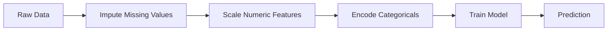
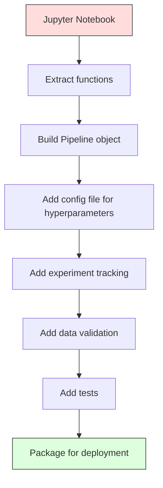

# ML 管線

> 模型不是產品，管線才是。管線涵蓋從原始資料到上線預測的一切，而其中每一步都必須可重現。

**類型：** 實作
**程式語言：** Python
**先修單元：** 階段 2 · 12（超參數調校）
**時間：** 約 120 分鐘

## 學習目標

- 從零打造一條 ML 管線，把補值、縮放、編碼與模型訓練串成單一個可重現的物件
- 指認出資料洩漏會發生的情境，並說明管線如何靠「只用訓練資料配適轉換器」來防止它
- 建構一個 ColumnTransformer，對數值特徵與類別特徵套用不同的前處理
- 實作管線的序列化，並證明同一個已配適的管線在訓練與生產環境會產生完全一致的結果

## 問題所在

你有一份 notebook：載入資料、用中位數填補缺值、縮放特徵、訓練模型、印出準確率。它跑得動，於是你把它交付出去。

一個月後，有人重新訓練模型，結果卻不一樣。中位數是拿包含測試資料的完整資料集算的（資料洩漏）。縮放參數沒有存下來，所以推論時用的是另一組統計量。特徵工程的程式碼在訓練端與服務端各複製了一份，然後兩份漸行漸遠。生產環境裡某個類別欄位冒出一個編碼器從沒見過的新值。

這些都不是假想情況，而是 ML 系統在生產環境掛掉最常見的原因。管線把每一個轉換步驟包成單一個、有順序、可重現的物件，一次解決所有這些問題。

## 核心概念

### 管線是什麼

管線是一連串有順序的資料轉換，最後接上一個模型。每一步都拿前一步的輸出當輸入。整條管線只在訓練資料上配適一次。推論時，同一條已配適的管線負責轉換新資料並產生預測。



管線保證：
- 轉換只在訓練資料上配適（沒有洩漏）
- 推論時套用的是同一組轉換
- 整個物件可以序列化，當成單一個產出物來部署
- 交叉驗證會逐折套用管線，防止細微的洩漏

### 資料洩漏：無聲的殺手

資料洩漏是指測試集或未來資料的資訊污染了訓練過程。最常見的幾種形式，管線都能防住。

**會洩漏（錯誤）：**
```python
X = df.drop("target", axis=1)
y = df["target"]

scaler = StandardScaler()
X_scaled = scaler.fit_transform(X)

X_train, X_test = X_scaled[:800], X_scaled[800:]
y_train, y_test = y[:800], y[800:]
```

scaler 看過測試資料了。平均值與標準差裡含有測試樣本，這會讓準確率的估計虛高。

**正確做法：**
```python
X_train, X_test = X[:800], X[800:]

scaler = StandardScaler()
X_train_scaled = scaler.fit_transform(X_train)
X_test_scaled = scaler.transform(X_test)
```

有了管線，你根本不用去想這件事，管線會自動處理好。

### sklearn Pipeline

sklearn 的 `Pipeline` 把一串轉換器與一個估計器串起來。它對外提供 `.fit()`、`.predict()` 與 `.score()`，會依序套用所有步驟。

```python
from sklearn.pipeline import Pipeline
from sklearn.preprocessing import StandardScaler
from sklearn.linear_model import LogisticRegression

pipe = Pipeline([
    ("scaler", StandardScaler()),
    ("model", LogisticRegression()),
])

pipe.fit(X_train, y_train)
predictions = pipe.predict(X_test)
```

當你呼叫 `pipe.fit(X_train, y_train)`：
1. scaler 對 X_train 呼叫 `fit_transform`
2. 模型對縮放後的 X_train 呼叫 `fit`

當你呼叫 `pipe.predict(X_test)`：
1. scaler 對 X_test 呼叫 `transform`（不是 fit_transform）
2. 模型對縮放後的 X_test 呼叫 `predict`

配適過程中，scaler 從來沒看到測試資料。這正是管線的全部意義。

### ColumnTransformer：不同欄位用不同管線

真實的資料集裡，數值欄位與類別欄位需要不同的前處理。`ColumnTransformer` 就是處理這件事的。

```python
from sklearn.compose import ColumnTransformer
from sklearn.preprocessing import StandardScaler, OneHotEncoder
from sklearn.impute import SimpleImputer

numeric_pipe = Pipeline([
    ("impute", SimpleImputer(strategy="median")),
    ("scale", StandardScaler()),
])

categorical_pipe = Pipeline([
    ("impute", SimpleImputer(strategy="most_frequent")),
    ("encode", OneHotEncoder(handle_unknown="ignore")),
])

preprocessor = ColumnTransformer([
    ("num", numeric_pipe, ["age", "income", "score"]),
    ("cat", categorical_pipe, ["city", "gender", "plan"]),
])

full_pipeline = Pipeline([
    ("preprocess", preprocessor),
    ("model", GradientBoostingClassifier()),
])
```

OneHotEncoder 裡的 `handle_unknown="ignore"` 對生產環境非常關鍵。當出現新類別（模型沒見過的城市）時，它會產生一個全零向量，而不是直接崩掉。

### 實驗追蹤

管線讓訓練可重現，但你還需要追蹤各次實驗到底發生了什麼：用了哪些超參數、哪一版資料集、指標是多少、跑的是哪一版程式碼。

**MLflow** 是最常見的開源方案：

```python
import mlflow

with mlflow.start_run():
    mlflow.log_param("max_depth", 5)
    mlflow.log_param("n_estimators", 100)
    mlflow.log_param("learning_rate", 0.1)

    pipe.fit(X_train, y_train)
    accuracy = pipe.score(X_test, y_test)

    mlflow.log_metric("accuracy", accuracy)
    mlflow.sklearn.log_model(pipe, "model")
```

每一次執行都會連同參數、指標、產出物與完整模型一起被記錄下來。你可以比較各次執行、重現任何一次實驗，也可以部署任何一個模型版本。

**Weights & Biases（wandb）** 提供同樣的功能，外加一個代管的儀表板：

```python
import wandb

wandb.init(project="my-pipeline")
wandb.config.update({"max_depth": 5, "n_estimators": 100})

pipe.fit(X_train, y_train)
accuracy = pipe.score(X_test, y_test)

wandb.log({"accuracy": accuracy})
```

### 模型版本控制

做完實驗追蹤，你得管理模型版本。哪個模型在生產環境？哪個在預備環境？上禮拜用的是哪一個？

MLflow 的 Model Registry 提供：
- **版本追蹤：** 每個存下來的模型都會拿到一個版本號
- **階段轉換：** 「Staging」、「Production」、「Archived」
- **核准流程：** 模型必須被明確晉升，才能進入生產環境
- **回滾：** 隨時可以立刻切回前一個版本

### 用 DVC 做資料版本控制

程式碼用 git 做版本控制。資料也該有版本控制，但 git 應付不了大檔案。DVC（Data Version Control）解決了這個問題。

```
dvc init
dvc add data/training.csv
git add data/training.csv.dvc data/.gitignore
git commit -m "Track training data"
dvc push
```

DVC 把真正的資料放在遠端儲存（S3、GCS、Azure），只在 git 裡留一個記錄雜湊值的小小 `.dvc` 檔。當你 checkout 某個 git commit 時，`dvc checkout` 會還原出當初用的那份資料。

這代表每一個 git commit 都同時釘住了程式碼與資料。這才是完整的可重現性。

### 可重現的實驗

一個可重現的實驗需要四樣東西：

1. **固定隨機種子：** 為 numpy、random 以及框架（torch、sklearn）都設好種子
2. **釘住依賴版本：** requirements.txt 或 poetry.lock，寫明確切版本
3. **資料有版本控制：** DVC 或類似工具
4. **設定檔：** 所有超參數都放進設定檔，不要寫死在程式碼裡

```python
import numpy as np
import random

def set_seed(seed=42):
    random.seed(seed)
    np.random.seed(seed)
    try:
        import torch
        torch.manual_seed(seed)
        torch.cuda.manual_seed_all(seed)
        torch.backends.cudnn.deterministic = True
    except ImportError:
        pass
```

### 從 Notebook 到生產管線



典型的演進過程：

1. **在 notebook 裡探索：** 快速實驗、畫圖、想特徵。
2. **抽出函式：** 把前處理、特徵工程、評估搬進模組裡。
3. **建立 Pipeline：** 把各個轉換串成一個 sklearn Pipeline 或自訂類別。
4. **設定檔管理：** 把所有超參數搬進 YAML／JSON 設定檔。
5. **實驗追蹤：** 加上 MLflow 或 wandb 的記錄。
6. **資料驗證：** 訓練前先檢查結構、分布與缺值的樣態。
7. **測試：** 為轉換器寫單元測試，為整條管線寫整合測試。
8. **部署：** 序列化管線、用 API 包起來（FastAPI、Flask），再容器化。

### 管線常見的錯誤

| 錯誤 | 為什麼不好 | 怎麼修 |
|---------|-------------|-----|
| 切分之前就用全部資料配適 | 資料洩漏 | 用 Pipeline 搭配 cross_val_score |
| 特徵工程做在管線外面 | 訓練與服務時的轉換不一致 | 把所有轉換都放進 Pipeline |
| 沒處理未知類別 | 生產環境遇到新值就崩掉 | OneHotEncoder(handle_unknown="ignore") |
| 欄位名稱寫死 | 結構一變就壞掉 | 從設定檔讀取欄位名稱清單 |
| 沒有資料驗證 | 爛資料悄悄產出錯誤的預測 | 預測前加上結構檢查 |
| 訓練／服務偏斜 | 生產環境裡模型看到的特徵不一樣 | 兩邊共用同一個 Pipeline 物件 |

## 動手實作

`code/pipeline.py` 裡的程式碼從零打造出一條完整的 ML 管線：

### 步驟 1：自訂轉換器

```python
class CustomTransformer:
    def __init__(self):
        self.means = None
        self.stds = None

    def fit(self, X):
        self.means = np.mean(X, axis=0)
        self.stds = np.std(X, axis=0)
        self.stds[self.stds == 0] = 1.0
        return self

    def transform(self, X):
        return (X - self.means) / self.stds

    def fit_transform(self, X):
        return self.fit(X).transform(X)
```

### 步驟 2：從零寫管線

```python
class PipelineFromScratch:
    def __init__(self, steps):
        self.steps = steps

    def fit(self, X, y=None):
        X_current = X.copy()
        for name, step in self.steps[:-1]:
            X_current = step.fit_transform(X_current)
        name, model = self.steps[-1]
        model.fit(X_current, y)
        return self

    def predict(self, X):
        X_current = X.copy()
        for name, step in self.steps[:-1]:
            X_current = step.transform(X_current)
        name, model = self.steps[-1]
        return model.predict(X_current)
```

### 步驟 3：搭配管線的交叉驗證

程式碼示範了用管線做交叉驗證如何防止資料洩漏：scaler 會在每一折的訓練資料上分別配適。

### 步驟 4：用 sklearn 打造完整的生產管線

一條完整的管線，包含 `ColumnTransformer`、多條前處理路徑與一個模型，並以正確的交叉驗證與實驗記錄來訓練。

## 產出交付

本單元產出：
- `outputs/prompt-ml-pipeline.md` —— 一個用來打造與除錯 ML 管線的 skill
- `code/pipeline.py` —— 一條從零寫到 sklearn 的完整管線

## 練習

1. 打造一條管線，處理一個有 3 個數值欄位與 2 個類別欄位的資料集。用 `ColumnTransformer` 對數值欄位套用中位數補值＋縮放，對類別欄位套用最常見值補值＋one-hot 編碼。用 5 折交叉驗證訓練。

2. 刻意製造資料洩漏：在切分之前就用完整資料集配適 scaler。把這個（會洩漏的）交叉驗證分數跟管線版（乾淨的）交叉驗證分數比一比。差距有多大？

3. 用 `joblib.dump` 序列化你的管線。在另一個獨立的腳本裡載入它並跑預測。驗證預測結果完全一致。

4. 在管線裡加一個自訂轉換器，為最重要的兩個數值欄位建立多項式特徵（次數 2）。它應該放在管線的哪個位置？

5. 為這條管線設定 MLflow 追蹤。用不同的超參數跑 5 次實驗。用 MLflow UI（`mlflow ui`）比較各次執行，挑出最好的模型。

## 關鍵術語

| 術語 | 大家怎麼說 | 實際上是什麼 |
|------|----------------|----------------------|
| 管線 | 「一串轉換＋模型」 | 一連串已配適的轉換器加上一個模型，有順序地當成一個整體套用，用來防止洩漏 |
| 資料洩漏 | 「測試的資訊漏進訓練了」 | 用了訓練集之外的資訊來建模型，導致效能估計虛高 |
| ColumnTransformer | 「每個欄位用不同的前處理」 | 對不同的欄位子集套用不同的管線，再把結果合併起來 |
| 實驗追蹤 | 「把你的執行記錄下來」 | 為每一次訓練執行記錄參數、指標、產出物與程式碼版本 |
| MLflow | 「追蹤並部署模型」 | 開源平台，涵蓋實驗追蹤、模型登錄與部署 |
| DVC | 「資料版的 git」 | 大型資料檔的版本控制系統，把雜湊值存在 git 裡、資料存在遠端儲存 |
| 模型登錄（model registry） | 「模型版本目錄」 | 一套追蹤模型版本並標上階段標籤（staging、production、archived）的系統 |
| 訓練／服務偏斜 | 「在 notebook 裡明明好好的」 | 訓練時與推論時處理資料的方式有差異，造成無聲的錯誤 |
| 可重現性 | 「同樣的程式碼，同樣的結果」 | 同樣的程式碼、資料與設定，能拿到完全一致結果的能力 |

## 延伸閱讀

- [scikit-learn Pipeline docs](https://scikit-learn.org/stable/modules/compose.html) —— 官方的管線參考文件
- [MLflow documentation](https://mlflow.org/docs/latest/index.html) —— 實驗追蹤與模型登錄
- [DVC documentation](https://dvc.org/doc) —— 資料版本控制
- [Sculley et al., Hidden Technical Debt in Machine Learning Systems (2015)](https://papers.nips.cc/paper/2015/hash/86df7dcfd896fcaf2674f757a2463eba-Abstract.html) —— 探討 ML 系統複雜度的開創性論文
- [Google ML Best Practices: Rules of ML](https://developers.google.com/machine-learning/guides/rules-of-ml) —— 實務的生產環境 ML 建議
