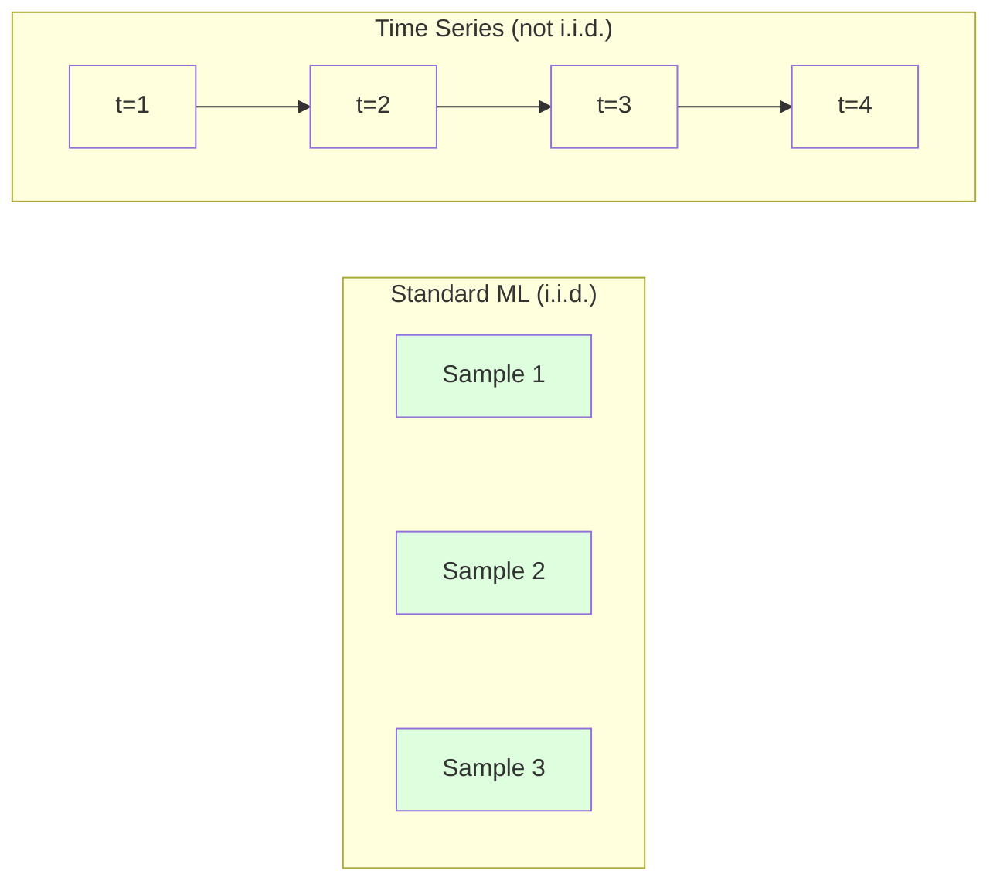
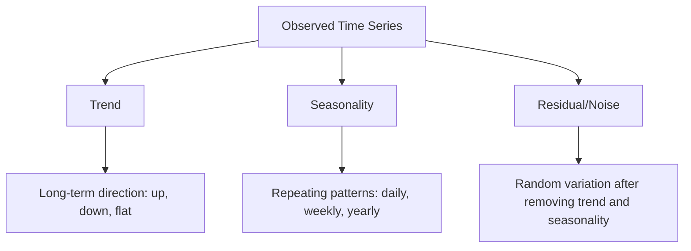
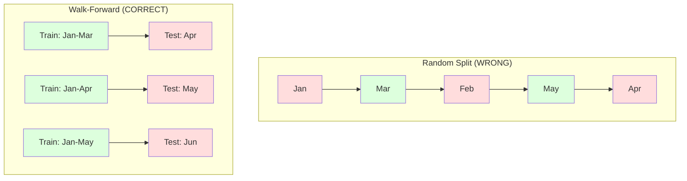

# 時間序列基礎

> 過去的表現確實能預測未來——前提是你先檢查過定態性。

**類型：** 實作
**程式語言：** Python
**先修單元：** 階段 2 · 單元 01-09
**時間：** 約 90 分鐘

## 學習目標

- 把一條時間序列拆解成趨勢、季節性與殘差三個成分，並檢驗它是否定態
- 實作滯後特徵與滾動統計量，把時間序列轉換成一個監督式學習問題
- 打造一套前向驗證框架，避免未來的資料洩漏到訓練集裡
- 說明為什麼隨機切分訓練／測試集對時間序列是無效的，並實際展示它跟正確的時間切分之間的效能落差

## 問題所在

你手上有一批按時間排序的資料。每日銷售額、每小時氣溫、每分鐘 CPU 使用率、每週股價。你想預測下一個值、下一週、下一季。

你伸手拿起平常那套 ML 工具：隨機切分訓練／測試集、交叉驗證、丟進特徵矩陣、拿出預測結果。每一步都是錯的。

時間序列打破了標準 ML 賴以成立的假設。樣本並不獨立——今天的氣溫取決於昨天的。隨機切分會把未來的資訊洩漏到過去。有些特徵在回測裡表現亮眼，上線卻失靈，因為它們依賴的是會隨時間變動的模式。

一個用隨機交叉驗證拿到 95% 準確率的模型，換成正確的時間評估方式可能只剩 55%。這個差距不是枝微末節。它是「紙上能跑的模型」跟「上線能跑的模型」之間的差別。

這個單元講的是基本功：時間資料到底哪裡不一樣、怎麼誠實地評估模型，以及怎麼把一條時間序列變成標準 ML 模型吃得下的特徵。

## 核心概念

### 時間序列到底有什麼不同

標準 ML 假設資料是 i.i.d.——獨立且同分布。每個樣本都獨立地從同一個分布抽出來。時間序列兩個條件都違反：

- **不獨立。** 今天的股價取決於昨天的。這週的銷售額跟上週相關。
- **不同分布。** 分布會隨時間位移。十二月的銷售額跟三月的長得不一樣。

這些違反並不輕微。它們會改變你怎麼建特徵、怎麼評估模型，以及哪些演算法能用。



在標準 ML 裡，樣本是可以互換的。把它們洗牌不會有任何影響。在時間序列裡，順序就是一切。洗牌會毀掉訊號。

### 時間序列的組成

每一條時間序列都是這幾樣東西的組合：



- **趨勢**：長期的方向。營收每年成長 10%。全球氣溫上升。
- **季節性**：固定間隔重複出現的模式。零售銷售在十二月衝高。冷氣用電在七月達到高峰。
- **殘差**：扣掉趨勢跟季節性之後剩下的東西。如果殘差看起來像白噪音，那這次拆解就抓到了訊號。

### 定態

如果一條時間序列的統計性質（平均、變異數、自相關）不隨時間改變，它就是定態的。大多數預測方法都假設定態。

**為什麼重要：** 非定態的序列，平均會漂移。用一月資料訓練出來的模型，學到的平均跟二月會呈現的不一樣。它會系統性地出錯。

**怎麼檢查：** 在一個個視窗上算滾動平均與滾動標準差。如果它們會漂移，這條序列就不是定態的。

**怎麼修：** 差分。不要去建模原始值，改成建模相鄰兩個值之間的變化：

```
diff[t] = value[t] - value[t-1]
```

如果做一輪差分還不足以讓序列定態，就再做一次（二階差分）。現實世界的序列大多最多只需要兩輪。

**例子：**

原始序列：[100, 102, 106, 112, 120]
一階差分：[2, 4, 6, 8]（還是往上走）
二階差分：[2, 2, 2]（常數——定態了）

原始序列帶的是二次趨勢。一階差分把它變成線性趨勢。二階差分讓它變平。實務上，你很少需要超過兩輪。

**正式的檢定：** Augmented Dickey-Fuller（ADF）檢定是定態性的標準統計檢定。虛無假設是「這條序列非定態」。p 值低於 0.05 就表示你可以拒絕虛無假設、判定它定態。我們不會從零實作 ADF（那需要漸近分布表），不過我們程式碼裡的滾動統計量做法能提供一個實用的視覺檢查。

### 自相關

自相關衡量的是時間 t 的值跟時間 t-k（往回 k 步）的值有多相關。自相關函數（ACF）會把每個滯後 k 對應的相關係數畫出來。

**ACF 告訴你：**
- 這條序列的記憶有多長。如果 ACF 在滯後 5 之後就掉到零，那 5 步以前的值就無關了。
- 有沒有季節性。如果 ACF 在滯後 12（月資料）出現尖峰，那就有年度季節性。
- 該建幾個滯後特徵。用到 ACF 變得可忽略的那個滯後為止。

**PACF（偏自相關函數）** 會把間接的相關性剔掉。如果今天跟三天前相關，純粹只是因為兩者都跟昨天相關，那麼滯後 3 的 PACF 會是零，而滯後 3 的 ACF 不會。

### 滯後特徵：把時間序列變成監督式學習

標準 ML 模型需要一個特徵矩陣 X 和一個目標 y。時間序列給你的只有一欄數值。中間的橋樑就是滯後特徵。

拿序列 [10, 12, 14, 13, 15] 來建 lag-1 跟 lag-2 特徵：

| lag_2 | lag_1 | target |
|-------|-------|--------|
| 10    | 12    | 14     |
| 12    | 14    | 13     |
| 14    | 13    | 15     |

現在你有了一個標準的迴歸問題。任何 ML 模型（線性迴歸、隨機森林、梯度提升）都能從這些滯後值預測目標。

你還可以再做出這些特徵：
- **滾動統計量：** 最近 k 個值的平均、標準差、最小值、最大值
- **日曆特徵：** 星期幾、月份、is_holiday、is_weekend
- **差分後的值：** 跟前一步相比的變化
- **擴張統計量：** 累積平均、累積和
- **比值特徵：** 當前值／滾動平均（離近期平均有多遠）
- **交互特徵：** lag_1 * day_of_week（星期效應對動能的影響）

**要用幾個滯後？** 看自相關函數。如果 ACF 到滯後 10 都還顯著，那至少用 10 個滯後。如果有週季節性，就把滯後 7（可能還有 14）納進來。滯後越多，模型看到的歷史越長，但要擬合的特徵也越多，過度擬合的風險跟著上升。

**目標對齊的陷阱。** 建滯後特徵時，目標必須是時間 t 的值，而所有特徵都只能用時間 t-1 或更早的值。如果你不小心把時間 t 的值也放進特徵，你就得到一個完美的預測器——以及一個完全沒用的模型。這是時間序列特徵工程裡最常見的 bug。

### 前向驗證

這是整個單元最重要的概念。標準的 k-fold 交叉驗證會隨機把樣本分派到訓練集跟測試集。對時間序列來說，這會洩漏未來的資訊。



前向驗證的做法：
1. 用到時間 t 為止的資料訓練
2. 預測時間 t+1（多步的話就是 t+1 到 t+k）
3. 把視窗往前滑
4. 重複

每一個測試折裡的資料，都排在所有訓練資料之後。沒有未來洩漏。這樣你才能得到模型部署後表現的誠實估計。

**擴張視窗（expanding window）** 拿所有歷史資料來訓練（視窗越來越大）。**滑動視窗（sliding window）** 用固定大小的訓練視窗（視窗往前滑）。如果你認為舊資料仍然有參考價值，用擴張視窗。如果世界會變、舊資料只會扯後腿，用滑動視窗。

### ARIMA 的直覺

ARIMA 是經典的時間序列模型。它有三個成分：

- **AR（自迴歸）：** 從過去的值來預測。AR(p) 用最近 p 個值。
- **I（整合）：** 用差分讓序列定態。I(d) 做 d 輪差分。
- **MA（移動平均）：** 從過去的預測誤差來預測。MA(q) 用最近 q 個誤差。

ARIMA(p, d, q) 把三者結合起來。p、d、q 要靠 ACF／PACF 分析或自動搜尋（auto-ARIMA）來選。

我們不會從零實作 ARIMA——它需要的數值最佳化超出這個單元的範圍。關鍵是理解每個成分在做什麼，這樣你才能解讀 ARIMA 的結果，也才知道什麼時候該用它。

### 什麼時候該用什麼

| 做法 | 最適合 | 能處理季節性 | 能處理外部特徵 |
|----------|---------|-------------------|------------------------|
| 滯後特徵 + ML | 有很多外部特徵的表格資料 | 搭配日曆特徵可以 | 可以 |
| ARIMA | 單一單變量序列、短期 | 要用 SARIMA 變體 | 不行（ARIMAX 有限支援） |
| 指數平滑 | 單純的趨勢 + 季節性 | 可以（Holt-Winters） | 不行 |
| Prophet | 商業預測、假日效應 | 可以（傅立葉項） | 有限 |
| 神經網路（LSTM、Transformer） | 長序列、多條序列 | 學出來的 | 可以 |

大多數實務問題，滯後特徵 + 梯度提升是最強的起點。它天生就能吃外部特徵、不要求定態，而且好除錯。

### 預測期程與策略

單步預測預測往前一個時間步。多步預測則預測好幾步。有三種策略：

**遞迴（迭代）：** 先預測一步，再把這個預測值當成下一步的輸入。簡單，但誤差會累積——每次預測都用到上一次的預測，錯誤會層層放大。

**直接：** 為每個期程各訓練一個模型。Model-1 預測 t+1，Model-5 預測 t+5。不會累積誤差，但每個模型的訓練樣本更少，而且彼此不共享資訊。

**多輸出：** 訓練一個模型同時輸出所有期程。能在各期程之間共享資訊，但需要一個支援多輸出的模型（或自訂損失函式）。

大多數實務問題，短期程（1-5 步）先從遞迴開始，較長的期程用直接法。

### 時間序列的常見錯誤

| 錯誤 | 為什麼會發生 | 怎麼修 |
|---------|---------------|-----------|
| 隨機切分訓練／測試集 | 標準 ML 養成的習慣 | 改用前向驗證或時間切分 |
| 用到未來的特徵 | 不小心把時間 t 的特徵放進去 | 逐一稽核每個特徵的時間對齊 |
| 對季節性過度擬合 | 模型把日曆模式背下來了 | 測試集要留完整的一個季節週期 |
| 忽略尺度變化 | 營收翻倍但模式不變 | 建模百分比變化而不是絕對值 |
| 滯後特徵太多 | 「歷史越多越好」 | 用 ACF 決定哪些滯後真的有關 |
| 沒做差分 | 「模型自己會搞懂」 | 樹模型能處理趨勢；線性模型需要定態 |

## 動手實作

`code/time_series.py` 裡的程式碼從零實作了這些核心元件。

### 滯後特徵產生器

```python
def make_lag_features(series, n_lags):
    n = len(series)
    X = np.full((n, n_lags), np.nan)
    for lag in range(1, n_lags + 1):
        X[lag:, lag - 1] = series[:-lag]
    valid = ~np.isnan(X).any(axis=1)
    return X[valid], series[valid]
```

這會把一維序列轉成一個特徵矩陣：每一列以最近 `n_lags` 個值當特徵，以當前值當目標。

### 前向交叉驗證

```python
def walk_forward_split(n_samples, n_splits=5, min_train=50):
    assert min_train < n_samples, "min_train must be less than n_samples"
    step = max(1, (n_samples - min_train) // n_splits)
    for i in range(n_splits):
        train_end = min_train + i * step
        test_end = min(train_end + step, n_samples)
        if train_end >= n_samples:
            break
        yield slice(0, train_end), slice(train_end, test_end)
```

每一次切分都保證訓練資料嚴格排在測試資料之前。訓練視窗會隨著每一折擴張。

### 簡單的自迴歸模型

純 AR 模型不過就是在滯後特徵上做線性迴歸：

```python
class SimpleAR:
    def __init__(self, n_lags=5):
        self.n_lags = n_lags
        self.weights = None
        self.bias = None

    def fit(self, series):
        X, y = make_lag_features(series, self.n_lags)
        # Solve via normal equations
        X_b = np.column_stack([np.ones(len(X)), X])
        theta = np.linalg.lstsq(X_b, y, rcond=None)[0]
        self.bias = theta[0]
        self.weights = theta[1:]
        return self
```

這在概念上跟單元 02 的線性迴歸完全一樣，只是套用在同一個變數的時間滯後版本上。

### 定態檢查

程式碼會計算滾動統計量，從視覺跟數值兩方面評估定態性：

```python
def check_stationarity(series, window=50):
    rolling_mean = np.array([
        series[max(0, i - window):i].mean()
        for i in range(1, len(series) + 1)
    ])
    rolling_std = np.array([
        series[max(0, i - window):i].std()
        for i in range(1, len(series) + 1)
    ])
    return rolling_mean, rolling_std
```

如果滾動平均會漂移、或滾動標準差有變化，這條序列就不是定態的。做差分，然後再檢查一次。

程式碼另外還會比較序列前半段跟後半段來檢查定態性。如果兩段的平均差超過半個標準差、或變異數比值超過 2 倍，這條序列就會被標記為非定態。

### 自相關

```python
def autocorrelation(series, max_lag=20):
    n = len(series)
    mean = series.mean()
    var = series.var()
    acf = np.zeros(max_lag + 1)
    for k in range(max_lag + 1):
        cov = np.mean((series[:n-k] - mean) * (series[k:] - mean))
        acf[k] = cov / var if var > 0 else 0
    return acf
```

## 框架應用

用 sklearn 的話，滯後特徵可以直接餵給任何迴歸器：

```python
from sklearn.linear_model import Ridge
from sklearn.ensemble import GradientBoostingRegressor

X, y = make_lag_features(series, n_lags=10)

for train_idx, test_idx in walk_forward_split(len(X)):
    model = Ridge(alpha=1.0)
    model.fit(X[train_idx], y[train_idx])
    predictions = model.predict(X[test_idx])
```

ARIMA 則用 statsmodels：

```python
from statsmodels.tsa.arima.model import ARIMA

model = ARIMA(train_series, order=(5, 1, 2))
fitted = model.fit()
forecast = fitted.forecast(steps=30)
```

`time_series.py` 裡的程式碼示範了這兩種做法，並用前向驗證來比較它們。

### sklearn TimeSeriesSplit

sklearn 提供的 `TimeSeriesSplit` 就是前向驗證的實作：

```python
from sklearn.model_selection import TimeSeriesSplit

tscv = TimeSeriesSplit(n_splits=5)
for train_index, test_index in tscv.split(X):
    X_train, X_test = X[train_index], X[test_index]
    y_train, y_test = y[train_index], y[test_index]
    model.fit(X_train, y_train)
    score = model.score(X_test, y_test)
```

這跟我們從零寫的 `walk_forward_split` 等價，只是整合進了 sklearn 的交叉驗證框架。你可以拿它搭配 `cross_val_score`：

```python
from sklearn.model_selection import cross_val_score

scores = cross_val_score(model, X, y, cv=TimeSeriesSplit(n_splits=5))
print(f"Mean score: {scores.mean():.4f} +/- {scores.std():.4f}")
```

### 評估指標

時間序列預測用的是迴歸指標，但要放在有時間感的脈絡裡看：

- **MAE（平均絕對誤差）：** |y_true - y_pred| 的平均。用原始單位就能直接解讀。「平均而言，預測差了 3.2 度。」
- **RMSE（均方根誤差）：** 均方誤差開根號。對大誤差的懲罰比 MAE 重。當「一次大錯」比「很多次小錯」更糟時就用它。
- **MAPE（平均絕對百分比誤差）：** |error / true_value| * 100 的平均。跟尺度無關，適合拿來比較不同的序列。但真值為零時它沒有定義。
- **跟天真基準線比較：** 永遠要跟簡單的基準線比。季節性天真基準線預測的是一個週期前的值（昨天、上週）。如果你的模型連天真基準線都打不贏，那就是哪裡出問題了。

### 滾動特徵

程式碼示範了在滯後特徵之外，再加上滾動統計量（7 天與 14 天視窗的平均、標準差、最小值、最大值）。這些能提供模型關於近期趨勢與波動度的資訊，而那是滯後特徵單靠自己抓不到的。

舉例來說，如果滾動平均在上升，就暗示有向上的趨勢。如果滾動標準差在變大，就暗示波動度在增加。這類模式是樹模型學得起來、而線性模型學不到的。

## 產出交付

這個單元會產出：
- `outputs/prompt-time-series-advisor.md` —— 一個幫你把時間序列問題框架化的提示詞
- `code/time_series.py` —— 滯後特徵、前向驗證、AR 模型、定態檢查

### 你必須打敗的基準線

在建任何模型之前，先立好基準線：

1. **上一個值（persistence）。** 預測明天跟今天一樣。對很多序列來說，這條線難打贏的程度會讓你意外。
2. **季節性天真法。** 預測今天跟上週的同一天（或去年同期）一樣。如果你的模型連這個都打不贏，那它除了季節性以外什麼有用的模式都沒學到。
3. **移動平均。** 預測最近 k 個值的平均。能平滑雜訊，但抓不住突然的變化。

如果你那套花俏的 ML 模型輸給季節性天真基準線，你就是有 bug。最常見的原因是：特徵裡有未來洩漏、評估方法錯了，或者這條序列真的就是隨機、不可預測的。

### 實務建議

1. **先從畫圖開始。** 在建模之前，先把原始序列畫出來。看有沒有趨勢、季節性、離群值、結構性斷點（行為突然改變）。30 秒的目視檢查，常常比一小時的自動化分析告訴你更多。

2. **先差分，再建模。** 如果序列有明顯的趨勢，先差分再建滯後特徵。樹模型能處理趨勢，線性模型不行，而差分從來不會有壞處。

3. **至少留一個完整的季節週期出來。** 如果你有週季節性，測試集至少要涵蓋完整的一週。如果是月季節性，至少要一整個月。不然你根本無法評估模型有沒有抓到季節模式。

4. **上線後要監控。** 時間序列模型會隨著世界變化而衰退。用滾動的方式追蹤預測誤差。當誤差開始上升，就用近期的資料重新訓練。

5. **小心體制轉變（regime change）。** 用疫情前資料訓練的模型，預測不了疫情後的行為。把已知的體制轉變做成指標特徵，或者用會遺忘舊資料的滑動視窗。

6. **偏斜的序列先取對數。** 營收、價格、計數這類資料常常右偏。取對數可以穩定變異數，並把乘性模式變成加性的，這樣線性模型才吃得下。在對數空間做預測，再取指數換回原始單位。

## 練習

1. **定態實驗。** 產生一條帶線性趨勢的序列。用滾動統計量檢查定態性。做一階差分。再檢查一次。二次趨勢要做幾輪差分才會定態？

2. **滯後選擇。** 對一條季節性序列（週期 = 7）算 ACF。哪些滯後的自相關最高？只用那些滯後來建特徵（不要用連續的滯後）。跟用滯後 1 到 7 相比，準確率有變好嗎？

3. **前向驗證 vs 隨機切分。** 在滯後特徵上訓練一個 Ridge 迴歸。分別用隨機 80/20 切分跟前向驗證來評估。隨機切分把效能高估了多少？

4. **特徵工程。** 在滯後特徵之外，加上滾動平均（視窗 = 7）、滾動標準差（視窗 = 7）跟星期幾特徵。用前向驗證比較加與不加這些額外特徵的準確率。

5. **多步預測。** 把 AR 模型改成預測往前 5 步而不是 1 步。比較兩種策略：(a) 預測一步，再把預測值當成下一步的輸入（遞迴），以及 (b) 為每個期程各訓練一個模型（直接）。哪一種更準？

## 關鍵術語

| 術語 | 大家怎麼說 | 實際上是什麼 |
|------|----------------|----------------------|
| 定態 | 「統計量不隨時間改變」 | 平均、變異數與自相關結構都不隨時間變動的序列 |
| 差分 | 「相鄰兩個值相減」 | 計算 y[t] - y[t-1] 以移除趨勢、達到定態 |
| 自相關（ACF） | 「序列跟自己有多相關」 | 一條時間序列跟它自己滯後版本之間的相關係數，寫成滯後的函式 |
| 偏自相關（PACF） | 「只看直接的相關」 | 扣掉所有更短滯後的影響之後，滯後 k 的自相關 |
| 滯後特徵 | 「用過去的值當輸入」 | 拿 y[t-1]、y[t-2]、...、y[t-k] 當特徵來預測 y[t] |
| 前向驗證 | 「尊重時間的交叉驗證」 | 一種評估方式，訓練資料在時間上永遠排在測試資料之前 |
| ARIMA | 「經典的時間序列模型」 | AutoRegressive Integrated Moving Average：把過去的值（AR）、差分（I）與過去的誤差（MA）結合起來 |
| 季節性 | 「重複出現的日曆模式」 | 時間序列裡跟日曆週期（每日、每週、每年）綁在一起的規律、可預測的循環 |
| 趨勢 | 「長期的方向」 | 序列水準隨時間持續上升或下降 |
| 擴張視窗 | 「用上全部歷史」 | 訓練集隨著每一折長大的前向驗證 |
| 滑動視窗 | 「固定長度的歷史」 | 訓練集是一個固定長度、往前滑動的視窗的前向驗證 |

## 延伸閱讀

- [Hyndman and Athanasopoulos, Forecasting: Principles and Practice (3rd ed.)](https://otexts.com/fpp3/) —— 時間序列預測最好的免費教科書
- [scikit-learn Time Series Split](https://scikit-learn.org/stable/modules/generated/sklearn.model_selection.TimeSeriesSplit.html) —— sklearn 的前向切分器
- [statsmodels ARIMA docs](https://www.statsmodels.org/stable/generated/statsmodels.tsa.arima.model.ARIMA.html) —— 帶診斷功能的 ARIMA 實作
- [Makridakis et al., The M5 Competition (2022)](https://www.sciencedirect.com/science/article/pii/S0169207021001874) —— 大規模預測競賽，展示 ML 方法與統計方法的對比
