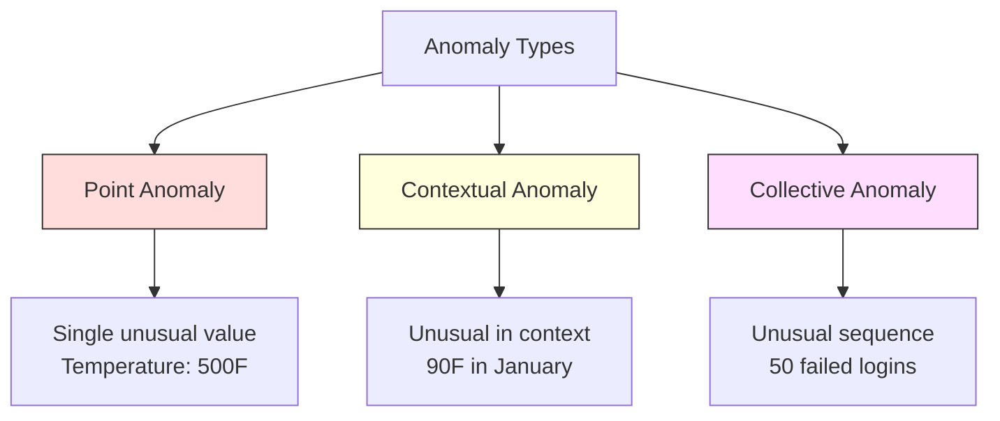
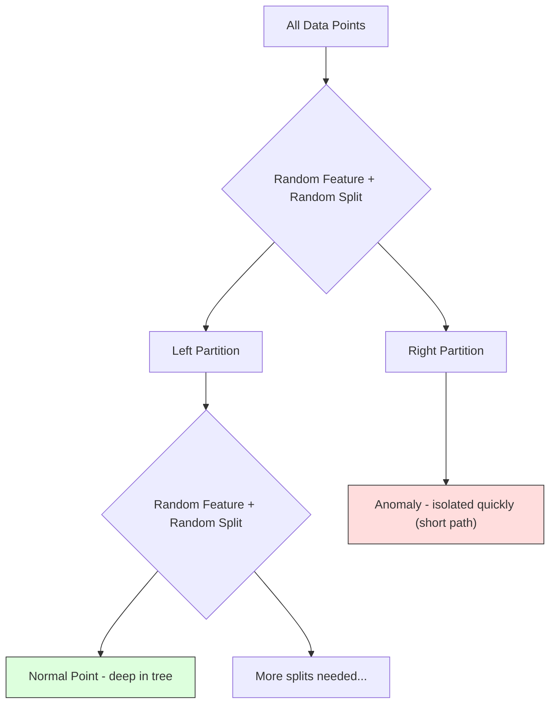
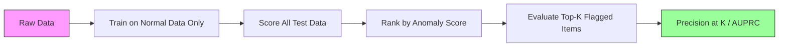

# 異常偵測

> 「正常」很容易定義。「不正常」就是所有不符合正常的東西。

**類型：** 實作
**程式語言：** Python
**先修單元：** 階段 2 單元 01-09
**時間：** 約 75 分鐘

## 學習目標

- 從零實作 Z-score、IQR 與 Isolation Forest 三種異常偵測方法
- 分辨點異常、情境異常與集體異常，並為每一種挑出合適的偵測方法
- 說明為什麼異常偵測要被表述成「對正常資料建模」，而不是「把異常分類出來」
- 比較非監督式異常偵測與監督式分類，並評估「涵蓋未知異常」與「精確率」之間的取捨

## 問題所在

一張信用卡下午兩點在紐約刷了一筆，兩點零五分又在東京刷了一筆。一個工廠感測器讀到 150 度，而正常範圍是 80-120。一台伺服器每秒送出 50,000 個請求，而日平均是 200。

這些都是異常。把它們找出來很重要。詐欺造成的損失以十億計。設備故障造成停機。網路入侵造成資料外洩。

難處在於：你幾乎不會有帶標籤的異常樣本。詐欺只佔交易的 0.1%。設備故障一年才發生幾次。你沒辦法訓練一個標準的分類器，因為「異常」這一類裡幾乎沒有東西可以學。就算你手上有一些標籤，你見過的那些異常也不是你將會遇到的全部類型。明天的詐欺手法，長得跟今天不一樣。

異常偵測把問題翻轉過來。不去學什麼叫不正常，而是學什麼叫正常。任何偏離正常的東西都可疑。這種做法不需要標籤，能適應新出現的異常類型，也能擴展到超大規模的資料集。

## 核心概念

### 異常的種類

異常不是只有一種：

- **點異常。** 單一資料點本身就不尋常，跟情境無關。一筆 500 度的溫度讀數。一個平時只花 50 美元的帳戶，出現一筆 50,000 美元的交易。
- **情境異常。** 一個資料點放在它所處的情境下才顯得不尋常。90 度的氣溫在夏天很正常，在冬天就是異常。同樣的數值，不同的情境。
- **集體異常。** 一連串資料點整體看起來不尋常，即使每一個單點都可能很正常。五次登入失敗很正常。連續五十次就是暴力破解攻擊。

大多數方法偵測的是點異常。情境異常需要時間或地點特徵。集體異常需要能理解序列的方法。



### 非監督式的表述方式

在標準分類裡，兩個類別你都有標籤。在異常偵測裡，你通常會落在三種情況之一：

1. **完全非監督。** 完全沒有標籤。你在全部資料上配適偵測器，並期待異常夠稀少，不至於汙染那個「正常」模型。
2. **半監督。** 你有一份乾淨的資料集，裡面只有正常資料。你在這份乾淨資料上配適，再對其他所有東西打分數。條件允許時，這是最強的設定。
3. **弱監督。** 你有少數幾筆標好的異常。把它們拿來做評估，不要拿來訓練。用非監督的方式訓練，再在這個有標籤的子集上量測精確率／召回率。

關鍵的洞見是：異常偵測跟分類根本不是同一件事。你在對正常資料的分布建模，而不是在找兩個類別之間的決策邊界。

### 監督式與非監督式：取捨在哪裡

如果你手上真的有標好的異常，該把它們拿去訓練（監督式分類），還是只拿來評估（非監督式偵測）？

**監督式（當成分類問題）：**
- 抓得到你以前見過的那幾類異常
- 在已知的異常類型上精確率更高
- 完全抓不到全新的異常類型
- 出現新的異常類型時，必須重新訓練
- 需要足夠多的異常樣本（通常太少）

**非監督式（對正常建模，把偏離的標記出來）：**
- 抓得到任何偏離正常的東西，包括全新的類型
- 不需要標好的異常
- 偽陽性率更高（不尋常的東西不一定是壞事）
- 對分布偏移更穩健

實務上，最好的系統會兩者並用：用非監督式偵測拿到廣泛的覆蓋率，用監督式模型盯住已知的高優先異常類型，模稜兩可的案例交給人工審查。

### Z-score 方法

最簡單的做法。算出每個特徵的平均值與標準差。任何離平均超過 k 個標準差的點就標記出來。

```text
z_score = (x - mean) / std
anomaly if |z_score| > threshold
```

預設閾值是 3.0（在高斯分布下，99.7% 的正常資料都落在 3 個標準差之內）。

**強項：** 簡單。快。可解釋（「這個值離正常有 4.5 個標準差」）。

**弱項：** 假設資料呈常態分布。對訓練資料裡的離群值很敏感（離群值會把平均拉走、把標準差撐大，反而讓自己更難被偵測到）。碰到多峰分布就失效。

**什麼時候好用：** 資料大致呈鐘形的單一特徵監控。伺服器回應時間、製造公差、基線穩定的感測器讀數。

**什麼時候會失效：** 多群資料（兩個辦公地點有不同的基線溫度）、偏斜資料（交易金額裡 1000 美元很罕見，但不算異常）、訓練集本身就含有離群值的資料。

### IQR 方法

比 Z-score 更穩健。用四分位距取代平均值與標準差。

```
Q1 = 25th percentile
Q3 = 75th percentile
IQR = Q3 - Q1
lower_bound = Q1 - factor * IQR
upper_bound = Q3 + factor * IQR
anomaly if x < lower_bound or x > upper_bound
```

預設的 factor 是 1.5。

**強項：** 對離群值穩健（百分位數不受極端值影響）。在偏斜分布上也能用。不需要常態性假設。

**弱項：** 只能單變量（每個特徵各自獨立套用）。抓不到那種「只有把多個特徵合起來看才不尋常」的異常（一個點在每個特徵上單獨看都很正常，但在聯合空間裡是異常的）。

**實務提醒：** IQR 裡的 1.5 這個係數，對應的就是箱形圖的鬚線。落在鬚線之外的點就是潛在的離群值。把 1.5 改成 3.0 會讓偵測器更保守（標記更少、偽陽性更少）。係數該取多少，取決於你對假警報的容忍度。

### Isolation Forest

關鍵的洞見是：異常又少又不一樣。在對資料做隨機切分時，異常更容易被孤立出來——把它們跟其他點分開所需的隨機切分次數更少。



**它怎麼運作：**
1. 建出很多棵隨機樹（一座 isolation forest）
2. 在每個節點上，隨機挑一個特徵，並在該特徵的最小值與最大值之間隨機挑一個切分值
3. 一直切下去，直到每個點都被孤立（各自佔一個葉節點）
4. 異常在所有樹上的平均路徑長度較短

**為什麼有效：** 正常點住在稠密區域，要把它從鄰居之中孤立出來，需要很多次隨機切分。異常住在稀疏區域，一兩次隨機切分就足以把它孤立。

異常分數是以所有樹的平均路徑長度為基礎，再用隨機二元搜尋樹的期望路徑長度做正規化：

```
score(x) = 2^(-average_path_length(x) / c(n))
```

其中 `c(n)` 是 n 個樣本的期望路徑長度。分數接近 1 表示異常。分數接近 0.5 表示正常。分數接近 0 表示非常正常（深藏在稠密的群裡）。

**強項：** 不做任何分布假設。在高維度也能用。擴展性好（相對於樣本數是次線性的，因為每棵樹只用一份子樣本）。能處理混合的特徵型別。

**弱項：** 碰到位於稠密區域裡的異常會很吃力（遮蔽效應）。當有很多特徵都無關時，隨機切分的效果會變差。

**重要超參數：**
- `n_estimators`：樹的數量。100 通常就夠了。樹越多，分數越穩定，但計算越慢。
- `max_samples`：每棵樹用的樣本數。原始論文的預設值是 256。值越小，單棵樹越不準，但多樣性越高。子取樣正是 Isolation Forest 快的原因——每棵樹只看到資料的一小部分。
- `contamination`：預期的異常比例。只用來設定閾值，不會影響分數本身。

### Local Outlier Factor（LOF）

LOF 比較的是某個點周圍的局部密度，與它鄰居周圍的密度。一個位於稀疏區域、四周卻被稠密區域包圍的點，就是異常。

**它怎麼運作：**
1. 對每個點，找出它的 k 個最近鄰居
2. 計算局部可達密度（這個鄰域有多稠密）
3. 把每個點的密度跟它鄰居的密度做比較
4. 如果某個點的密度遠低於它的鄰居，它就是離群值

**LOF 分數：**
- LOF 接近 1.0 表示密度和鄰居差不多（正常）
- LOF 大於 1.0 表示密度低於鄰居（可能是異常）
- LOF 遠大於 1.0（例如 2.0 以上）表示密度顯著偏低（很可能是異常）

「局部」這兩個字很關鍵。想像一份有兩個群的資料集：一個是 1000 個點的稠密群，一個是 50 個點的稀疏群。稀疏群邊緣的一個點在全域看來並不特別——它有 50 個鄰居。但如果它的近鄰都比它更稠密，它在局部上就是不尋常的。LOF 抓得到這個細微差別，而全域方法會漏掉。

**強項：** 能偵測局部異常（在自己的鄰域裡不尋常，即使在全域看來並不特別的點）。在密度不一致的群上也能用。

**弱項：** 在大型資料集上很慢（樸素實作是 O(n^2)）。對 k 的選擇很敏感。在維度非常高時效果不好（維度詛咒會影響距離計算）。

### 比較

| 方法 | 假設 | 速度 | 能處理高維 | 能偵測局部異常 |
|--------|------------|-------|-------------------|------------------------|
| Z-score | 常態分布 | 非常快 | 可以（逐特徵） | 不行 |
| IQR | 無（逐特徵） | 非常快 | 可以（逐特徵） | 不行 |
| Isolation Forest | 無 | 快 | 可以 | 部分可以 |
| LOF | 距離有意義 | 慢 | 不太行 | 可以 |

### 評估上的挑戰

評估異常偵測器比評估分類器更難：

- **極端的類別不平衡。** 異常只佔 0.1% 時，全部預測「正常」就有 99.9% 的準確率。準確率毫無用處。
- **AUROC 會騙人。** 在嚴重不平衡下，即使模型在實際可用的閾值上漏掉大多數異常，AUROC 看起來還是可以很漂亮。
- **更好的指標：** Precision@k（被標記出來的前 k 筆裡，有幾筆是真異常）、AUPRC（precision-recall 曲線下面積），以及固定偽陽性率下的召回率。



### 異常偵測管線

實務上，異常偵測會走這樣一套流程：

1. **收集基線資料。** 最理想是取一段你確定沒有（或極少）異常的期間。
2. **特徵工程。** 原始特徵，加上衍生特徵（滾動統計量、時間特徵、比率）。
3. **訓練偵測器。** 在基線資料上配適。模型學到「正常」長什麼樣。
4. **對新資料打分數。** 每一筆新觀測都會得到一個異常分數。
5. **選定閾值。** 決定分數的切點。這是商業決策：閾值越高，假警報越少，但漏掉的異常越多。
6. **告警與調查。** 被標記出來的點交給人工審查或自動化處理。
7. **收集回饋。** 記錄被標記的項目到底是真異常還是假警報。用這批資料來評估偵測器，並隨時間調校閾值。

這條管線永遠不會「做完」。資料分布會偏移、新的異常類型會出現、閾值需要調整。把異常偵測當成一個活的系統，而不是一次性的模型。

## 動手實作

`code/anomaly_detection.py` 裡的程式碼從零實作了 Z-score、IQR 與 Isolation Forest。

### Z-score 偵測器

```python
def zscore_detect(X, threshold=3.0):
    mean = X.mean(axis=0)
    std = X.std(axis=0)
    std[std == 0] = 1.0
    z = np.abs((X - mean) / std)
    return z.max(axis=1) > threshold
```

簡單而且已向量化。只要任一特徵超過閾值，就把這個點標記出來。

### IQR 偵測器

```python
def iqr_detect(X, factor=1.5):
    q1 = np.percentile(X, 25, axis=0)
    q3 = np.percentile(X, 75, axis=0)
    iqr = q3 - q1
    iqr[iqr == 0] = 1.0
    lower = q1 - factor * iqr
    upper = q3 + factor * iqr
    outside = (X < lower) | (X > upper)
    return outside.any(axis=1)
```

### 從零實作 Isolation Forest

從零寫的版本會建出一批 isolation tree，隨機把特徵空間切開：

```python
class IsolationTree:
    def __init__(self, max_depth):
        self.max_depth = max_depth

    def fit(self, X, depth=0):
        n, p = X.shape
        if depth >= self.max_depth or n <= 1:
            self.is_leaf = True
            self.size = n
            return self
        self.is_leaf = False
        self.feature = np.random.randint(p)
        x_min = X[:, self.feature].min()
        x_max = X[:, self.feature].max()
        if x_min == x_max:
            self.is_leaf = True
            self.size = n
            return self
        self.threshold = np.random.uniform(x_min, x_max)
        left_mask = X[:, self.feature] < self.threshold
        self.left = IsolationTree(self.max_depth).fit(X[left_mask], depth + 1)
        self.right = IsolationTree(self.max_depth).fit(X[~left_mask], depth + 1)
        return self
```

孤立一個點所需的路徑長度，決定了它的異常分數。路徑越短，越異常。

`IsolationForest` 這個類別把多棵樹包起來：

```python
class IsolationForest:
    def __init__(self, n_estimators=100, max_samples=256, seed=42):
        self.n_estimators = n_estimators
        self.max_samples = max_samples

    def fit(self, X):
        sample_size = min(self.max_samples, X.shape[0])
        max_depth = int(np.ceil(np.log2(sample_size)))
        for _ in range(self.n_estimators):
            idx = rng.choice(X.shape[0], size=sample_size, replace=False)
            tree = IsolationTree(max_depth=max_depth)
            tree.fit(X[idx])
            self.trees.append(tree)

    def anomaly_score(self, X):
        avg_path = average path length across all trees
        scores = 2.0 ** (-avg_path / c(max_samples))
        return scores
```

正規化因子 `c(n)` 是在含 n 個元素的二元搜尋樹裡，一次失敗搜尋的期望路徑長度。它等於 `2 * H(n-1) - 2*(n-1)/n`，其中 `H` 是調和數。有了這個正規化，不同大小的資料集之間分數才能互相比較。

### 示範情境

程式碼會產生好幾種測試情境：

1. **單一群加上離群值。** 一個 2D 高斯群，外加一些注入在遠離中心處的異常。所有方法在這裡都該有效。
2. **多峰資料。** 三個大小與密度都不同的群。落在群之間的點是異常。Z-score 在這裡會很吃力，因為逐特徵的範圍太寬。
3. **高維資料。** 50 個特徵，但異常只在其中 5 個特徵上有差異。這是在測試各方法能不能在特徵的子集裡找到異常。

每個示範都會用精確率、召回率、F1 與 Precision@k 來比較所有方法。

## 框架應用

用 sklearn（採用函式庫的實作，不是從零寫的版本）：

```python
from sklearn.ensemble import IsolationForest
from sklearn.neighbors import LocalOutlierFactor

iso = IsolationForest(n_estimators=100, contamination=0.05, random_state=42)
iso.fit(X_train)
predictions = iso.predict(X_test)

lof = LocalOutlierFactor(n_neighbors=20, contamination=0.05, novelty=True)
lof.fit(X_train)
predictions = lof.predict(X_test)
```

注意 `contamination` 設定的是預期的異常比例。設得對很重要——設太低會漏掉異常，設太高會製造假警報。

`anomaly_detection.py` 裡的程式碼會在同一份資料上，把從零寫的實作和 sklearn 做比較。

### sklearn 的 contamination 參數

sklearn 裡的 `contamination`（汙染比例）參數決定的是把連續的異常分數轉成二元預測時所用的閾值。它不會改變底層的分數。

```python
iso_5 = IsolationForest(contamination=0.05)
iso_10 = IsolationForest(contamination=0.10)
```

這兩個產生的異常分數完全一樣。但 `iso_5` 標記的是前 5%，`iso_10` 標記的是前 10%。如果你不知道真正的異常比例（通常你就是不知道），就把 contamination 設成 "auto"，直接拿原始分數來用。再根據偽陽性與偽陰性之間的成本取捨，自己訂一個閾值。

### One-Class SVM

另一個值得認識的非監督式異常偵測器。One-Class SVM 會在一個高維特徵空間裡（利用核技巧），沿著正常資料的外圍配適出一條邊界。

```python
from sklearn.svm import OneClassSVM

oc_svm = OneClassSVM(kernel="rbf", gamma="auto", nu=0.05)
oc_svm.fit(X_train)
predictions = oc_svm.predict(X_test)
```

`nu` 這個參數約略對應異常的比例。One-Class SVM 在中小型資料集上表現不錯，但無法擴展到非常大的資料（核矩陣會以平方成長）。

### autoencoder 做法（預覽）

autoencoder 是學習壓縮並重建資料的神經網路。用正常資料訓練它。到了測試時，異常會有很高的重建誤差，因為這個網路只學會重建正常的模式。

這部分會在階段 3（深度學習）講，但原則是一樣的：對正常建模，把偏離的標記出來。

### 集成式異常偵測

就像集成方法能改善分類（單元 11）一樣，把多個異常偵測器組合起來也能改善偵測效果。最簡單的做法：

1. 跑多個偵測器（Z-score、IQR、Isolation Forest、LOF）
2. 把每個偵測器的分數正規化到 [0, 1]
3. 把正規化後的分數平均起來
4. 把平均分數超過閾值的點標記出來

這樣能減少偽陽性，因為不同方法的失效模式各不相同。被四種方法一起標記的點，幾乎肯定是異常。只被其中一種標記的點，可能只是那個方法的怪癖。

更講究的集成做法，會依每個偵測器的可靠度估計給它加權（如果拿得到帶已知異常的驗證集，就在上面量測）。

### 上線時要考慮的事

1. **閾值漂移。** 資料分布一偏移，固定的閾值就過時了。要監控異常分數的分布，並定期調整。
2. **告警疲乏。** 假警報一多，值班人員就不再理它了。一開始把閾值設高（告警更少、更可靠），隨著信任累積再往下調。
3. **集成做法。** 上線環境裡要組合多個偵測器。只有在多個方法都認定異常時才標記。這能大幅減少偽陽性。
4. **特徵工程。** 原始特徵很少夠用。加上滾動統計量、比率、距上次事件的時間，以及領域專屬的特徵。一組好的特徵，比選哪個偵測器更重要。
5. **回饋迴路。** 當值班人員調查被標記的項目並確認或駁回時，把結果餵回系統。隨時間累積帶標籤的資料，用來評估與改善偵測器。

## 產出交付

這個單元會產出：
- `outputs/skill-anomaly-detector.md` —— 一份用來挑選合適偵測器的決策技能
- `code/anomaly_detection.py` —— 從零實作的 Z-score、IQR 與 Isolation Forest，並和 sklearn 做比較

### 選定閾值

異常分數是連續的。你需要一個閾值才能做出二元決策。這是商業決策，不是技術決策。

想想兩種情境：
- **詐欺偵測。** 漏掉詐欺代價很高（退單、客戶信任）。假警報的代價是一位分析師花 5 分鐘查一下。閾值設低一點，多抓一些詐欺，接受更多假警報。
- **設備維護。** 一次假警報代表一次沒必要的停機，成本 50,000 美元。漏掉一次故障代表 500,000 美元的維修。閾值要設在讓這兩種成本取得平衡的地方。

兩種情境下，最佳閾值都取決於偽陽性與偽陰性之間的成本比。把不同閾值下的精確率與召回率畫出來，疊上成本函式，挑那個成本最低的點。

### 擴展到上線環境

要在上線環境做即時異常偵測：

1. **批次訓練，線上打分。** 定期（每天、每週）用近期的正常資料訓練模型。每一筆新觀測一進來就打分數。
2. **特徵計算必須一致。** 如果你訓練時用的是 30 天的滾動統計量，那要為一筆新觀測算特徵時，你就需要 30 天的歷史。把需要的歷史緩存起來。
3. **監控分數分布。** 追蹤異常分數隨時間的分布。如果中位數分數往上漂，那要嘛是資料在變，要嘛是模型已經過時。
4. **可解釋性。** 標記一個異常時，要說出理由。Z-score：「特徵 X 高於正常值 4.2 個標準差。」Isolation Forest：「這個點平均只用 3.1 次切分就被孤立（正常點要 8.5 次）。」

## 練習

1. **調校閾值。** 用 1.0 到 5.0、每次加 0.5 的閾值跑一遍 Z-score 偵測器。把每個閾值下的精確率與召回率畫出來。對你的資料來說，最佳落點在哪裡？

2. **多變量異常。** 造一份 2D 資料，讓每個特徵單獨看都很正常，但組合起來是異常的（例如遠離主群對角線的點）。證明逐特徵的 Z-score 會漏掉它們，而 Isolation Forest 抓得到。

3. **從零實作 LOF。** 用 k 近鄰實作 Local Outlier Factor。在同一份資料上和 sklearn 的 LocalOutlierFactor 做比較。試 k=10 和 k=50——k 的選擇對結果有什麼影響？

4. **串流式異常偵測。** 改寫 Z-score 偵測器，讓它能在串流情境下運作：新的點一進來就更新累進的平均值與變異數（Welford 的線上演算法）。在同一份資料上和批次版的 Z-score 做比較。

5. **真實世界評估。** 找一份有已知異常的資料集（例如 Kaggle 上的信用卡詐欺資料）。用 precision@100、precision@500 與 AUPRC 評估這四種方法。哪一個最好？為什麼？

## 關鍵術語

| 術語 | 大家怎麼說 | 實際上是什麼 |
|------|----------------|----------------------|
| 異常 | 「離群值、不尋常的點」 | 明顯偏離正常資料預期模式的資料點 |
| 點異常 | 「單一個怪值」 | 單獨一筆觀測，不論情境如何都不尋常 |
| 情境異常 | 「值很正常，情境不對」 | 放在它的情境（時間、地點等）下顯得不尋常，但換到另一個情境可能很正常的觀測 |
| Isolation Forest | 「用隨機切分找離群值」 | 一群隨機樹組成的集成，把異常孤立出來所需的切分次數比正常點更少 |
| Local Outlier Factor | 「把密度和鄰居比一比」 | 一種方法，把局部密度遠低於鄰居密度的點標記出來 |
| Z-score | 「離平均幾個標準差」 | (x - mean) / std，以標準差為單位量測一個點離中心有多遠 |
| IQR | 「四分位距」 | Q3 - Q1，量測資料中間 50% 的離散程度，用於穩健的離群值偵測 |
| 汙染比例 | 「預期的異常比例」 | 一個超參數，告訴偵測器它該把資料的多少比例標記為異常 |
| Precision@k | 「被標記的前 k 筆裡有幾筆是真的」 | 只在最可疑的 k 個點上計算的精確率，在不平衡的異常偵測裡很有用 |
| AUPRC | 「precision-recall 曲線下面積」 | 一個把所有閾值下的 precision-recall 表現總結起來的指標，在資料不平衡時比 AUROC 更好 |

## 延伸閱讀

- [Liu et al., Isolation Forest (2008)](https://cs.nju.edu.cn/zhouzh/zhouzh.files/publication/icdm08b.pdf) —— Isolation Forest 的原始論文
- [Breunig et al., LOF: Identifying Density-Based Local Outliers (2000)](https://dl.acm.org/doi/10.1145/342009.335388) —— LOF 的原始論文
- [scikit-learn Outlier Detection docs](https://scikit-learn.org/stable/modules/outlier_detection.html) —— sklearn 所有異常偵測器的概覽
- [Chandola et al., Anomaly Detection: A Survey (2009)](https://dl.acm.org/doi/10.1145/1541880.1541882) —— 異常偵測方法的完整綜述
- [Goldstein and Uchida, A Comparative Evaluation of Unsupervised Anomaly Detection Algorithms (2016)](https://journals.plos.org/plosone/article?id=10.1371/journal.pone.0152173) —— 在真實資料集上對 10 種方法的實證比較
