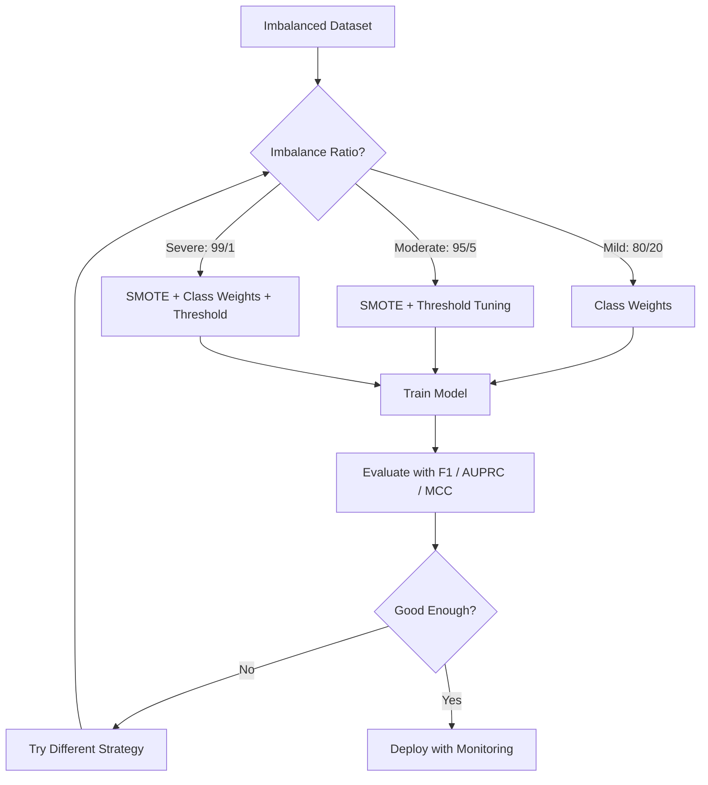
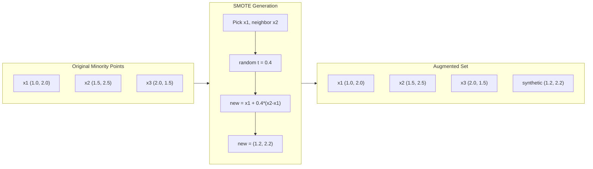
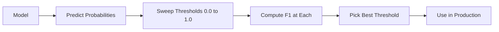
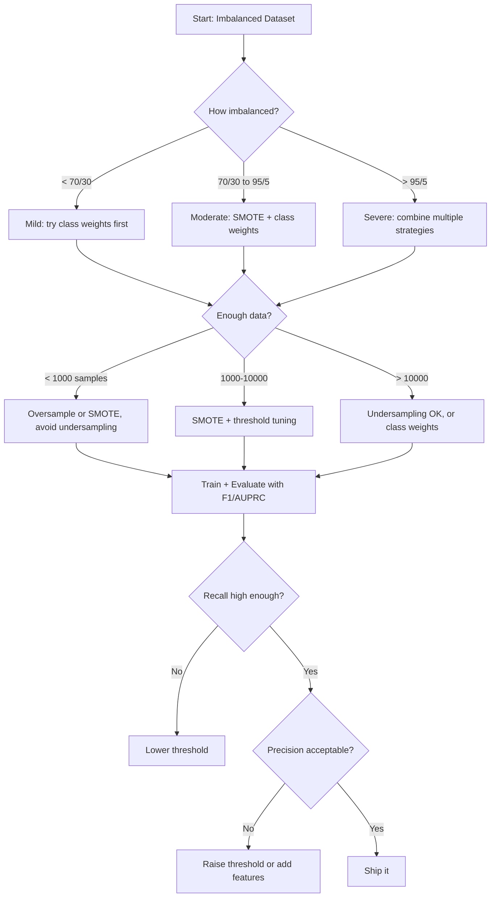

# 處理不平衡資料

> 當你的資料有 99% 都是「正常」時，準確率就是一種謊言。

**類型：** 實作
**程式語言：** Python
**先修單元：** 階段 2 · 單元 01-09（特別是評估指標）
**時間：** 約 90 分鐘

## 學習目標

- 從零實作 SMOTE，並說明合成樣本的過取樣（oversampling）與單純隨機複製有什麼不同
- 用 F1、AUPRC 與 Matthews 相關係數評估不平衡資料上的分類器，而不是用準確率
- 比較類別權重（class weight）、決策閾值調整與重新取樣這幾種策略，並為給定的不平衡比例挑出正確的做法
- 打造一條完整的不平衡資料流程，結合 SMOTE、類別權重與決策閾值最佳化

## 問題所在

你做了一個詐欺偵測模型。它拿到 99.9% 的準確率。你開心慶祝。然後你發現，它對每一筆交易的預測都是「不是詐欺」。

這不是程式錯誤。當只有 0.1% 的交易是詐欺時，這麼做才是理性的。模型學到的是：永遠猜多數類別可以讓整體誤差最小。技術上它完全正確，實際上它完全沒用。

只要分類這件事真的重要，這個問題就到處都在。疾病診斷：正例率 1%。網路入侵：攻擊佔 0.01%。製造缺陷：0.5% 不良。垃圾郵件過濾：20% 是垃圾。流失預測：5% 會流失。少數類別的後果越嚴重，它通常就越稀少。

準確率會失效，是因為它把所有正確預測都當成一樣的。正確標出一筆正常交易，跟正確抓到一筆詐欺，在準確率裡都只算一分。但抓到詐欺才是這個模型存在的全部理由。我們需要的是能逼模型去關注那個稀少但重要的類別的指標、技術與訓練策略。

## 核心概念

### 為什麼準確率會失效

考慮一個有 1000 筆樣本的資料集：990 筆負例、10 筆正例。一個永遠預測負例的模型：

|  | 預測為正 | 預測為負 |
|--|---|---|
| 實際為正 | 0（TP） | 10（FN） |
| 實際為負 | 0（FP） | 990（TN） |

Accuracy = (0 + 990) / 1000 = 99.0%

這個模型抓到零筆詐欺、零個病例、零個缺陷。但準確率說它有 99%。這就是準確率悖論，也是準確率對不平衡問題來說很危險的原因。

### 更好的指標

**精確率（Precision）** = TP / (TP + FP)。在所有被標為正的東西裡，有多少真的是正的？精確率高代表誤報很少。

**召回率（Recall）** = TP / (TP + FN)。在所有實際為正的樣本裡，我們抓到了多少？召回率高代表漏掉的正例很少。

**F1 分數** = 2 * precision * recall / (precision + recall)。調和平均。比算術平均更會懲罰精確率與召回率之間的極端失衡。

**F-beta 分數** = (1 + beta^2) * precision * recall / (beta^2 * precision + recall)。beta > 1 時，召回率更重要；beta < 1 時，精確率更重要。F2 在詐欺偵測中很常見（漏掉詐欺比誤報一次更糟）。

**AUPRC**（PR 曲線下的面積）。類似 AUC-ROC，但對不平衡資料更有參考價值。隨機分類器的 AUPRC 等於正類別的比例（不像 ROC 是 0.5）。這讓改善的幅度更容易被看見。

**Matthews 相關係數** = (TP * TN - FP * FN) / sqrt((TP+FP)(TP+FN)(TN+FP)(TN+FN))。範圍從 -1 到 +1。只有模型在兩個類別上都表現良好時才會給高分。即使兩個類別的樣本數差距很大，它依然平衡。

以上面那個「永遠預測負例」的模型來說：precision = 0/0（未定義，通常設為 0），recall = 0/10 = 0，F1 = 0，MCC = 0。這些指標正確地判定這個模型毫無價值。

### 不平衡資料的處理流程



### SMOTE：少數類別的合成過取樣技術

隨機過取樣是把既有的少數類別樣本複製一份。這樣可行，但有過度擬合的風險，因為模型會反覆看到完全相同的點。

SMOTE 產生的是新的少數類別合成樣本：看起來合理，但不是複製品。演算法如下：

1. 對每個少數類別樣本 x，在其他少數類別樣本中找出它的 k 個最近鄰
2. 隨機挑一個鄰居
3. 在 x 與那個鄰居之間的線段上產生一個新樣本

公式是：`new_sample = x + random(0, 1) * (neighbor - x)`

這是在真實的少數類別點之間做內插，在特徵空間的同一個區域裡生出樣本，而不只是把既有資料複製一遍。



### 各種取樣策略的比較

**隨機過取樣（Random Oversampling）**：複製少數類別樣本，直到數量與多數類別相同。
- 優點：簡單，不會丟掉資訊
- 缺點：完全相同的複製品會造成過度擬合，訓練時間也變長

**隨機欠取樣（Random Undersampling）**：刪掉多數類別樣本，直到數量與少數類別相同。
- 優點：訓練快，做法簡單
- 缺點：丟掉了可能有用的多數類別資料，變異也更大

**SMOTE**：用內插的方式產生少數類別的合成樣本。
- 優點：生成的是新的資料點，比隨機過取樣更不容易過度擬合
- 缺點：可能在決策邊界附近生出雜訊樣本，也沒有考慮多數類別的分布

| 策略 | 改動了什麼資料 | 風險 | 什麼時候用 |
|----------|-------------|------|-------------|
| 過取樣 | 複製少數類別 | 過度擬合 | 小型資料集、中等程度的不平衡 |
| 欠取樣 | 移除多數類別 | 資訊流失 | 大型資料集、想要訓練快 |
| SMOTE | 加入合成的少數類別樣本 | 邊界雜訊 | 中等程度的不平衡，且少數類別樣本足夠做 k-NN |

### 類別權重

不改動資料，改的是模型怎麼看待錯誤。把少數類別分類錯誤的權重調高。

以一個有 950 筆負例、50 筆正例的二元問題為例：
- 負類別的權重 = n_samples / (2 * n_negative) = 1000 / (2 * 950) = 0.526
- 正類別的權重 = n_samples / (2 * n_positive) = 1000 / (2 * 50) = 10.0

正類別拿到 19 倍的權重。分錯一筆正例的代價，等於分錯 19 筆負例。模型被迫去關注少數類別。

在邏輯迴歸裡，這件事會改寫損失函式：

```
weighted_loss = -sum(w_i * [y_i * log(p_i) + (1-y_i) * log(1-p_i)])
```

其中 w_i 取決於樣本 i 屬於哪個類別。

在期望值上，類別權重與過取樣在數學上是等價的，但它不需要產生新的資料點。所以它更快，也避開了複製樣本帶來的過度擬合風險。

### 決策閾值調整

大多數分類器輸出的是機率。預設的閾值是 0.5：如果 P(positive) >= 0.5，就預測為正。但 0.5 這個值是隨便定的。類別不平衡時，最佳的決策閾值通常低很多。

流程如下：
1. 訓練一個模型
2. 取得驗證集上的預測機率
3. 把閾值從 0.0 掃到 1.0
4. 在每個閾值上算出 F1（或你選定的指標）
5. 挑出讓指標最大的那個閾值



模型對一筆詐欺交易可能輸出 P(fraud) = 0.15。在閾值 0.5 之下，它會被分類成不是詐欺；在閾值 0.10 之下，它就被正確抓到了。機率的校準沒有排序來得重要 —— 只要詐欺拿到的機率比非詐欺高，就一定存在一個閾值可以把兩者分開。

### 成本敏感學習

類別權重的一般化版本。不用統一的代價，而是指定各種分類錯誤各自的代價：

| | 預測為正 | 預測為負 |
|--|---|---|
| 實際為正 | 0（正確） | C_FN = 100 |
| 實際為負 | C_FP = 1 | 0（正確） |

漏掉一筆詐欺交易（FN）的代價，是誤報一次（FP）的 100 倍。模型最佳化的是總成本，而不是錯誤的總數。

當你有能力估計出真實世界的代價時，成本敏感學習（cost-sensitive learning）是最有原則的做法。漏診一個癌症病例，跟誤報一次導致多做一次切片檢查，代價完全不同。把這些代價寫明白，能逼出正確的取捨。

### 決策流程圖



```figure
class-imbalance
```

## 動手實作

### 步驟 1：產生一個不平衡的資料集

```python
import numpy as np


def make_imbalanced_data(n_majority=950, n_minority=50, seed=42):
    rng = np.random.RandomState(seed)

    X_maj = rng.randn(n_majority, 2) * 1.0 + np.array([0.0, 0.0])
    X_min = rng.randn(n_minority, 2) * 0.8 + np.array([2.5, 2.5])

    X = np.vstack([X_maj, X_min])
    y = np.concatenate([np.zeros(n_majority), np.ones(n_minority)])

    shuffle_idx = rng.permutation(len(y))
    return X[shuffle_idx], y[shuffle_idx]
```

### 步驟 2：從零實作 SMOTE

```python
def euclidean_distance(a, b):
    return np.sqrt(np.sum((a - b) ** 2))


def find_k_neighbors(X, idx, k):
    distances = []
    for i in range(len(X)):
        if i == idx:
            continue
        d = euclidean_distance(X[idx], X[i])
        distances.append((i, d))
    distances.sort(key=lambda x: x[1])
    return [d[0] for d in distances[:k]]


def smote(X_minority, k=5, n_synthetic=100, seed=42):
    rng = np.random.RandomState(seed)
    n_samples = len(X_minority)
    k = min(k, n_samples - 1)
    synthetic = []

    for _ in range(n_synthetic):
        idx = rng.randint(0, n_samples)
        neighbors = find_k_neighbors(X_minority, idx, k)
        neighbor_idx = neighbors[rng.randint(0, len(neighbors))]
        t = rng.random()
        new_point = X_minority[idx] + t * (X_minority[neighbor_idx] - X_minority[idx])
        synthetic.append(new_point)

    return np.array(synthetic)
```

### 步驟 3：隨機過取樣與隨機欠取樣

```python
def random_oversample(X, y, seed=42):
    rng = np.random.RandomState(seed)
    classes, counts = np.unique(y, return_counts=True)
    max_count = counts.max()

    X_resampled = list(X)
    y_resampled = list(y)

    for cls, count in zip(classes, counts):
        if count < max_count:
            cls_indices = np.where(y == cls)[0]
            n_needed = max_count - count
            chosen = rng.choice(cls_indices, size=n_needed, replace=True)
            X_resampled.extend(X[chosen])
            y_resampled.extend(y[chosen])

    X_out = np.array(X_resampled)
    y_out = np.array(y_resampled)
    shuffle = rng.permutation(len(y_out))
    return X_out[shuffle], y_out[shuffle]


def random_undersample(X, y, seed=42):
    rng = np.random.RandomState(seed)
    classes, counts = np.unique(y, return_counts=True)
    min_count = counts.min()

    X_resampled = []
    y_resampled = []

    for cls in classes:
        cls_indices = np.where(y == cls)[0]
        chosen = rng.choice(cls_indices, size=min_count, replace=False)
        X_resampled.extend(X[chosen])
        y_resampled.extend(y[chosen])

    X_out = np.array(X_resampled)
    y_out = np.array(y_resampled)
    shuffle = rng.permutation(len(y_out))
    return X_out[shuffle], y_out[shuffle]
```

### 步驟 4：帶類別權重的邏輯迴歸

```python
def sigmoid(z):
    return 1.0 / (1.0 + np.exp(-np.clip(z, -500, 500)))


def logistic_regression_weighted(X, y, weights, lr=0.01, epochs=200):
    n_samples, n_features = X.shape
    w = np.zeros(n_features)
    b = 0.0

    for _ in range(epochs):
        z = X @ w + b
        pred = sigmoid(z)
        error = pred - y
        weighted_error = error * weights

        gradient_w = (X.T @ weighted_error) / n_samples
        gradient_b = np.mean(weighted_error)

        w -= lr * gradient_w
        b -= lr * gradient_b

    return w, b


def compute_class_weights(y):
    classes, counts = np.unique(y, return_counts=True)
    n_samples = len(y)
    n_classes = len(classes)
    weight_map = {}
    for cls, count in zip(classes, counts):
        weight_map[cls] = n_samples / (n_classes * count)
    return np.array([weight_map[yi] for yi in y])
```

### 步驟 5：決策閾值調整

```python
def find_optimal_threshold(y_true, y_probs, metric="f1"):
    best_threshold = 0.5
    best_score = -1.0

    for threshold in np.arange(0.05, 0.96, 0.01):
        y_pred = (y_probs >= threshold).astype(int)
        tp = np.sum((y_pred == 1) & (y_true == 1))
        fp = np.sum((y_pred == 1) & (y_true == 0))
        fn = np.sum((y_pred == 0) & (y_true == 1))

        if metric == "f1":
            precision = tp / (tp + fp) if (tp + fp) > 0 else 0.0
            recall = tp / (tp + fn) if (tp + fn) > 0 else 0.0
            score = 2 * precision * recall / (precision + recall) if (precision + recall) > 0 else 0.0
        elif metric == "recall":
            score = tp / (tp + fn) if (tp + fn) > 0 else 0.0
        elif metric == "precision":
            score = tp / (tp + fp) if (tp + fp) > 0 else 0.0

        if score > best_score:
            best_score = score
            best_threshold = threshold

    return best_threshold, best_score
```

### 步驟 6：評估函式

```python
def confusion_matrix_values(y_true, y_pred):
    tp = np.sum((y_pred == 1) & (y_true == 1))
    tn = np.sum((y_pred == 0) & (y_true == 0))
    fp = np.sum((y_pred == 1) & (y_true == 0))
    fn = np.sum((y_pred == 0) & (y_true == 1))
    return tp, tn, fp, fn


def compute_metrics(y_true, y_pred):
    tp, tn, fp, fn = confusion_matrix_values(y_true, y_pred)
    accuracy = (tp + tn) / (tp + tn + fp + fn)
    precision = tp / (tp + fp) if (tp + fp) > 0 else 0.0
    recall = tp / (tp + fn) if (tp + fn) > 0 else 0.0
    f1 = 2 * precision * recall / (precision + recall) if (precision + recall) > 0 else 0.0

    denom = np.sqrt(float((tp + fp) * (tp + fn) * (tn + fp) * (tn + fn)))
    mcc = (tp * tn - fp * fn) / denom if denom > 0 else 0.0

    return {
        "accuracy": accuracy,
        "precision": precision,
        "recall": recall,
        "f1": f1,
        "mcc": mcc,
    }
```

### 步驟 7：比較所有做法

```python
X, y = make_imbalanced_data(950, 50, seed=42)
split = int(0.8 * len(y))
X_train, X_test = X[:split], X[split:]
y_train, y_test = y[:split], y[split:]

# Baseline: no treatment
w_base, b_base = logistic_regression_weighted(
    X_train, y_train, np.ones(len(y_train)), lr=0.1, epochs=300
)
probs_base = sigmoid(X_test @ w_base + b_base)
preds_base = (probs_base >= 0.5).astype(int)

# Oversampled
X_over, y_over = random_oversample(X_train, y_train)
w_over, b_over = logistic_regression_weighted(
    X_over, y_over, np.ones(len(y_over)), lr=0.1, epochs=300
)
preds_over = (sigmoid(X_test @ w_over + b_over) >= 0.5).astype(int)

# SMOTE
minority_mask = y_train == 1
X_minority = X_train[minority_mask]
synthetic = smote(X_minority, k=5, n_synthetic=len(y_train) - 2 * int(minority_mask.sum()))
X_smote = np.vstack([X_train, synthetic])
y_smote = np.concatenate([y_train, np.ones(len(synthetic))])
w_sm, b_sm = logistic_regression_weighted(
    X_smote, y_smote, np.ones(len(y_smote)), lr=0.1, epochs=300
)
preds_smote = (sigmoid(X_test @ w_sm + b_sm) >= 0.5).astype(int)

# Class weights
sample_weights = compute_class_weights(y_train)
w_cw, b_cw = logistic_regression_weighted(
    X_train, y_train, sample_weights, lr=0.1, epochs=300
)
probs_cw = sigmoid(X_test @ w_cw + b_cw)
preds_cw = (probs_cw >= 0.5).astype(int)

# Threshold tuning (tune on held-out validation set, not test set)
probs_val = sigmoid(X_val @ w_cw + b_cw)
best_thresh, best_f1 = find_optimal_threshold(y_val, probs_val, metric="f1")
preds_thresh = (probs_cw >= best_thresh).astype(int)
```

程式碼檔案會在單一腳本裡跑完上面所有內容，並把結果印出來。

## 框架應用

用 scikit-learn 加上 imbalanced-learn，這些技術都是一行搞定：

```python
from sklearn.linear_model import LogisticRegression
from sklearn.metrics import classification_report, f1_score
from sklearn.model_selection import train_test_split
from imblearn.over_sampling import SMOTE
from imblearn.under_sampling import RandomUnderSampler
from imblearn.pipeline import Pipeline

X_train, X_test, y_train, y_test = train_test_split(X, y, stratify=y)

model_weighted = LogisticRegression(class_weight="balanced")
model_weighted.fit(X_train, y_train)
print(classification_report(y_test, model_weighted.predict(X_test)))

smote = SMOTE(random_state=42)
X_resampled, y_resampled = smote.fit_resample(X_train, y_train)
model_smote = LogisticRegression()
model_smote.fit(X_resampled, y_resampled)
print(classification_report(y_test, model_smote.predict(X_test)))

pipeline = Pipeline([
    ("smote", SMOTE()),
    ("model", LogisticRegression(class_weight="balanced")),
])
pipeline.fit(X_train, y_train)
print(classification_report(y_test, pipeline.predict(X_test)))
```

從零寫的實作清楚呈現了每個技術到底在做什麼。SMOTE 就是在少數類別上做 k-NN 內插。類別權重就是把損失乘上一個係數。決策閾值調整就是一個掃過各個切點的 for 迴圈。沒有魔法。

## 產出交付

這一課會產出：
- `outputs/skill-imbalanced-data.md` —— 一份處理不平衡分類問題的決策檢查清單

## 練習

1. **Borderline-SMOTE**：修改 SMOTE 的實作，只為靠近決策邊界的少數類別點（也就是 k 個最近鄰裡含有多數類別樣本的那些點）產生合成樣本。在一個類別互相重疊的資料集上，把結果跟標準 SMOTE 做比較。

2. **成本矩陣最佳化**：實作成本敏感學習，並把成本矩陣做成一個參數。寫一個函式，吃進一個成本矩陣，回傳能讓期望成本最小的最佳預測。用不同的成本比例（1:10、1:100、1:1000）測試，並畫出精確率與召回率的取捨如何跟著改變。

3. **閾值校準**：實作 Platt scaling（在模型的原始輸出上配適一個邏輯迴歸，產生校準過的機率）。比較校準前後的 PR 曲線。證明校準不會改變排序（AUC 保持不變），但會讓機率更有意義。

4. **用 balanced bagging 做集成**：訓練多個模型，每個都用一份平衡的 bootstrap 樣本（全部少數類別＋隨機抽出的一部分多數類別）。把它們的預測平均起來。把這個做法跟單一個搭配 SMOTE 的模型比較。同時量測效能與多次執行之間的變異。

5. **不平衡比例實驗**：拿一個平衡的資料集，逐步把不平衡比例拉高（50/50、70/30、90/10、95/5、99/1）。每個比例都分別在有 SMOTE 與沒有 SMOTE 的情況下訓練。把兩種做法的 F1 對不平衡比例畫出來。到什麼比例時，SMOTE 才開始帶來有意義的差別？

## 關鍵術語

| 術語 | 大家怎麼說 | 實際上是什麼 |
|------|----------------|----------------------|
| 類別不平衡 | 「有個類別的樣本多太多了」 | 資料集裡各類別的分布明顯偏斜，導致模型偏向多數類別 |
| SMOTE | 「合成的過取樣」 | 在既有的少數類別樣本與它們的 k 個最近少數類別鄰居之間做內插，生出新的少數類別樣本 |
| 類別權重 | 「讓稀有類別的錯誤更貴」 | 把損失函式乘上各類別各自的權重，讓模型對少數類別的分類錯誤懲罰得更重 |
| 決策閾值調整 | 「把決策邊界移一下」 | 把分類用的機率切點從預設的 0.5 改成能讓目標指標最佳化的值 |
| 精確率與召回率的取捨 | 「你不可能兩個都要」 | 把閾值降低會抓到更多正例（召回率上升），但也會標出更多假正例（精確率下降），反之亦然 |
| AUPRC | 「PR 曲線下的面積」 | 把精確率-召回率曲線總結成一個數字；類別嚴重不平衡時，比 AUC-ROC 更有參考價值 |
| Matthews 相關係數 | 「那個平衡的指標」 | 預測標籤與實際標籤之間的相關性，只有模型在兩個類別上都表現良好時才會給出高分 |
| 成本敏感學習 | 「不同的錯，代價不一樣」 | 把真實世界的分類錯誤代價納入訓練目標，讓模型最佳化的是總成本，而不是錯誤數量 |
| 隨機過取樣 | 「把少數類別複製一份」 | 重複少數類別的樣本讓各類別數量平衡；簡單，但有對複製點過度擬合的風險 |

## 延伸閱讀

- [SMOTE: Synthetic Minority Over-sampling Technique (Chawla et al., 2002)](https://arxiv.org/abs/1106.1813) —— 最原始的 SMOTE 論文，至今仍是不平衡學習領域被引用最多的作品
- [Learning from Imbalanced Data (He & Garcia, 2009)](https://ieeexplore.ieee.org/document/5128907) —— 完整的綜述，涵蓋取樣、成本敏感與演算法層面的各種做法
- [imbalanced-learn documentation](https://imbalanced-learn.org/stable/) —— Python 函式庫，提供各種 SMOTE 變體、欠取樣策略，以及與 pipeline 的整合
- [The Precision-Recall Plot Is More Informative than the ROC Plot (Saito & Rehmsmeier, 2015)](https://journals.plos.org/plosone/article?id=10.1371/journal.pone.0118432) —— 對不平衡問題來說，什麼時候該用 PR 曲線而不是 ROC 曲線，以及為什麼
