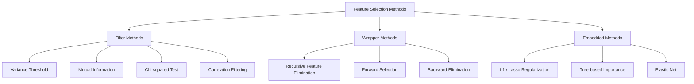
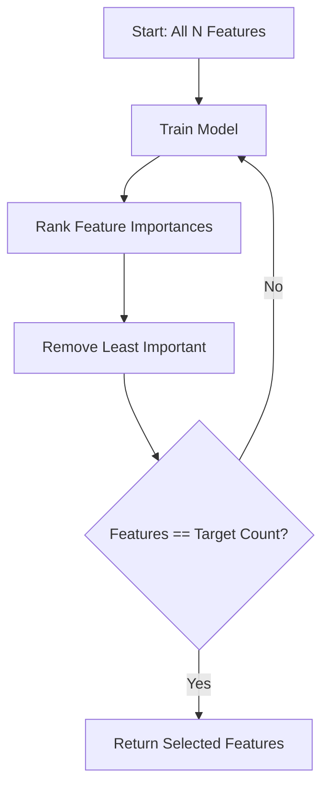
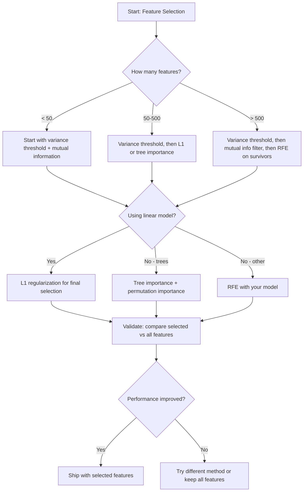

# 特徵選擇

> 特徵越多不代表越好。特徵對了才好。

**類型：** 實作
**程式語言：** Python
**先修單元：** 階段 2 單元 01-09、08（特徵工程）
**時間：** 約 75 分鐘

## 學習目標

- 從零實作過濾法（變異數閾值、互資訊、卡方檢定）與包裝法（RFE、前向選擇）
- 說明為什麼互資訊能捕捉相關係數會漏掉的非線性特徵－目標關係
- 比較 L1 正則化（嵌入法選擇）與 RFE（包裝法選擇），並評估兩者的計算成本取捨
- 打造一條結合多種方法的特徵選擇流程，並在留出資料上展示泛化能力的提升

## 問題所在

你有 500 個特徵。你的模型訓練很慢、動不動就過度擬合，而且沒有人說得出它到底學到了什麼。你加進更多特徵，希望表現變好。結果更糟。

這就是維度詛咒正在發生。特徵數量一多，特徵空間的體積就爆炸性成長。資料點變得稀疏。點與點之間的距離趨於一致。模型需要指數成長的資料量才找得到真正的規律。雜訊特徵把訊號特徵淹掉。過度擬合成了預設結果。

特徵選擇就是解藥。剝掉雜訊。移除冗餘。留下真正帶有目標資訊的特徵。結果是：訓練更快、泛化更好，而且模型你真的解釋得出來。

目標不是把手上所有資訊都用上。而是只用對的那些資訊。

## 核心概念

### 特徵選擇的三大類別

每一種特徵選擇方法都落在以下三類之中：



**過濾法** 用一個統計指標，獨立地給每個特徵打分。它們不動用模型。很快，但看不到特徵之間的交互作用。

**包裝法** 訓練一個模型來評估特徵子集，用模型表現當作分數。結果比較好，但很貴，因為它得把模型重訓很多次。

**嵌入法** 在模型訓練的過程中就順帶選好特徵。L1 正則化會把權重壓到零。決策樹會在最有用的特徵上做分裂。選擇是在擬合時發生的，不是另外一個步驟。

### 變異數閾值

最簡單的過濾法。如果一個特徵在各筆樣本之間幾乎不變動，它帶的資訊就幾乎是零。

想像一個特徵在 1000 筆樣本裡有 999 筆都是 0.0。它的變異數趨近於零。沒有任何模型能靠它區分類別。移掉它。

```
variance(x) = mean((x - mean(x))^2)
```

設一個閾值（例如 0.01）。把變異數低於閾值的特徵全部丟掉。這能移除常數或近似常數的特徵，而且完全不需要看目標變數。

什麼時候用它：當成其他方法之前的預處理步驟。它能用接近零的成本抓出明顯沒用的特徵。

限制：一個特徵可以有很高的變異數，卻仍然是純雜訊。變異數閾值是必要條件，不是充分條件。

### 互資訊

互資訊衡量的是：知道特徵 X 的值之後，對目標 Y 的不確定性減少了多少。

```
I(X; Y) = sum_x sum_y p(x, y) * log(p(x, y) / (p(x) * p(y)))
```

如果 X 與 Y 獨立，則 p(x, y) = p(x) * p(y)，log 項為零，於是 I(X; Y) = 0。X 對 Y 說得越多，互資訊就越高。

相對於相關係數的關鍵優勢：互資訊能捕捉非線性關係。一個特徵可能與目標的相關係數是零，卻有很高的互資訊，因為兩者的關係是二次的或週期性的。

對連續特徵，要先離散化成幾個分箱（以直方圖做估計）。分箱數會影響估計結果——分箱太少會丟失資訊，太多則會引入雜訊。常見的選法：sqrt(n) 個分箱，或 Sturges 法則（1 + log2(n)）。


### 遞迴特徵消除（RFE）

RFE 是一種包裝法。它用模型自己算出的特徵重要性，一輪一輪地修剪：

1. 用全部特徵訓練模型
2. 依重要性把特徵排序（線性模型看係數，樹模型看不純度下降量）
3. 移除最不重要的那一個（或幾個）特徵
4. 重複，直到剩下想要的特徵數量



RFE 會考慮到特徵之間的交互作用，因為模型每次看到的是所有還留著的特徵。移掉一個特徵，會改變其他特徵的重要性。這讓它比過濾法更周全。

代價是：你得訓練模型 N - target 次。500 個特徵、目標是 10 個，就是 490 輪訓練。對昂貴的模型來說，這很慢。你可以每一步移掉多個特徵來加速（例如每輪砍掉最後 10%）。

### L1（Lasso）正則化

L1 正則化把權重的絕對值加進損失函式：

```
loss = prediction_error + alpha * sum(|w_i|)
```

alpha 參數控制修剪特徵的積極程度。alpha 越大，就有越多權重變成恰好為零。

為什麼是恰好為零？L1 懲罰項在權重空間裡形成一個菱形的約束區域。最佳解傾向落在這個菱形的角上，而角上有一個或多個權重為零。L2 正則化（ridge）形成的是圓形約束，權重會縮小，但很少剛好碰到零。

這就是嵌入式的特徵選擇：模型在訓練過程中自己學會該忽略哪些特徵。權重為零的特徵等於被移除了。

優點：只需訓練一次、能處理彼此相關的特徵（挑一個留下，其餘歸零）、大多數線性模型實作都內建這個功能。

限制：只適用於線性模型。無法捕捉非線性的特徵重要性。

### 樹模型的特徵重要性

決策樹及其集成模型（隨機森林、梯度提升）天生就會給特徵排序。每一次分裂都會降低不純度（分類用 Gini 或熵，迴歸用變異數）。造成較大不純度下降的特徵就比較重要。

對一個有 T 棵樹的隨機森林：

```
importance(feature_j) = (1/T) * sum over all trees of
    sum over all nodes splitting on feature_j of
        (n_samples * impurity_decrease)
```

這會給每個特徵一個正規化後的重要性分數。它會自動處理非線性關係與特徵交互作用。

注意：樹模型的特徵重要性偏好唯一值很多的特徵（高基數）。一個隨機的 ID 欄位會顯得很重要，因為它能把每一筆樣本都完美分開。拿排列重要性當作合理性檢查。

### 排列重要性

一種與模型無關的方法：

1. 訓練模型，並記下它在驗證資料上的基準表現
2. 對每個特徵：把它的值隨機打亂，量測表現下降了多少
3. 掉得越多，這個特徵就越重要

如果打亂一個特徵不會傷害表現，模型就不依賴它。如果表現崩掉，那這個特徵是關鍵。

排列重要性避開了樹模型重要性的高基數偏差。但它慢：每個特徵都要做一次完整評估，而且為了穩定還得重複多次。

### 方法比較表

| 方法 | 類型 | 速度 | 非線性 | 特徵交互作用 |
|--------|------|-------|-----------|---------------------|
| 變異數閾值 | 過濾法 | 非常快 | 否 | 否 |
| 互資訊 | 過濾法 | 快 | 是 | 否 |
| 相關係數過濾 | 過濾法 | 快 | 否 | 否 |
| RFE | 包裝法 | 慢 | 視模型而定 | 是 |
| L1 / Lasso | 嵌入法 | 快 | 否（線性） | 否 |
| 樹模型重要性 | 嵌入法 | 中等 | 是 | 是 |
| 排列重要性 | 與模型無關 | 慢 | 是 | 是 |

### 決策流程圖



## 動手實作

### 步驟 1：生成特徵結構已知的合成資料

```python
import numpy as np


def make_feature_selection_data(n_samples=500, seed=42):
    rng = np.random.RandomState(seed)

    x1 = rng.randn(n_samples)
    x2 = rng.randn(n_samples)
    x3 = rng.randn(n_samples)
    x4 = x1 + 0.1 * rng.randn(n_samples)
    x5 = x2 + 0.1 * rng.randn(n_samples)

    informative = np.column_stack([x1, x2, x3, x4, x5])

    correlated = np.column_stack([
        x1 * 0.9 + 0.1 * rng.randn(n_samples),
        x2 * 0.8 + 0.2 * rng.randn(n_samples),
        x3 * 0.7 + 0.3 * rng.randn(n_samples),
        x1 * 0.5 + x2 * 0.5 + 0.1 * rng.randn(n_samples),
        x2 * 0.6 + x3 * 0.4 + 0.1 * rng.randn(n_samples),
    ])

    noise = rng.randn(n_samples, 10) * 0.5

    X = np.hstack([informative, correlated, noise])
    y = (2 * x1 - 1.5 * x2 + x3 + 0.5 * rng.randn(n_samples) > 0).astype(int)

    feature_names = (
        [f"info_{i}" for i in range(5)]
        + [f"corr_{i}" for i in range(5)]
        + [f"noise_{i}" for i in range(10)]
    )

    return X, y, feature_names
```

我們知道真實答案：特徵 0-4 是有資訊量的（其中 3 和 4 是 0 和 1 的相關複本），特徵 5-9 與這些有資訊量的特徵相關，特徵 10-19 是純雜訊。一個好的選擇方法應該把 0-4 排最前面、10-19 排最後面。

### 步驟 2：變異數閾值

```python
def variance_threshold(X, threshold=0.01):
    variances = np.var(X, axis=0)
    mask = variances > threshold
    return mask, variances
```

### 步驟 3：互資訊（離散版）

```python
def discretize(x, n_bins=10):
    min_val, max_val = x.min(), x.max()
    if max_val == min_val:
        return np.zeros_like(x, dtype=int)
    bin_edges = np.linspace(min_val, max_val, n_bins + 1)
    binned = np.digitize(x, bin_edges[1:-1])
    return binned


def mutual_information(X, y, n_bins=10):
    n_samples, n_features = X.shape
    mi_scores = np.zeros(n_features)

    y_vals, y_counts = np.unique(y, return_counts=True)
    p_y = y_counts / n_samples

    for f in range(n_features):
        x_binned = discretize(X[:, f], n_bins)
        x_vals, x_counts = np.unique(x_binned, return_counts=True)
        p_x = dict(zip(x_vals, x_counts / n_samples))

        mi = 0.0
        for xv in x_vals:
            for yi, yv in enumerate(y_vals):
                joint_mask = (x_binned == xv) & (y == yv)
                p_xy = np.sum(joint_mask) / n_samples
                if p_xy > 0:
                    mi += p_xy * np.log(p_xy / (p_x[xv] * p_y[yi]))
        mi_scores[f] = mi

    return mi_scores
```

### 步驟 4：遞迴特徵消除

```python
def simple_logistic_importance(X, y, lr=0.1, epochs=100):
    n_samples, n_features = X.shape
    w = np.zeros(n_features)
    b = 0.0

    for _ in range(epochs):
        z = X @ w + b
        pred = 1.0 / (1.0 + np.exp(-np.clip(z, -500, 500)))
        error = pred - y
        w -= lr * (X.T @ error) / n_samples
        b -= lr * np.mean(error)

    return w, b


def rfe(X, y, n_features_to_select=5, lr=0.1, epochs=100):
    n_total = X.shape[1]
    remaining = list(range(n_total))
    rankings = np.ones(n_total, dtype=int)
    rank = n_total

    while len(remaining) > n_features_to_select:
        X_subset = X[:, remaining]
        w, _ = simple_logistic_importance(X_subset, y, lr, epochs)
        importances = np.abs(w)

        least_idx = np.argmin(importances)
        original_idx = remaining[least_idx]
        rankings[original_idx] = rank
        rank -= 1
        remaining.pop(least_idx)

    for idx in remaining:
        rankings[idx] = 1

    selected_mask = rankings == 1
    return selected_mask, rankings
```

### 步驟 5：L1 特徵選擇

```python
def soft_threshold(w, alpha):
    return np.sign(w) * np.maximum(np.abs(w) - alpha, 0)


def l1_feature_selection(X, y, alpha=0.1, lr=0.01, epochs=500):
    n_samples, n_features = X.shape
    w = np.zeros(n_features)
    b = 0.0

    for _ in range(epochs):
        z = X @ w + b
        pred = 1.0 / (1.0 + np.exp(-np.clip(z, -500, 500)))
        error = pred - y

        gradient_w = (X.T @ error) / n_samples
        gradient_b = np.mean(error)

        w -= lr * gradient_w
        w = soft_threshold(w, lr * alpha)
        b -= lr * gradient_b

    selected_mask = np.abs(w) > 1e-6
    return selected_mask, w
```

### 步驟 6：樹模型的特徵重要性（簡易決策樹）

```python
def gini_impurity(y):
    if len(y) == 0:
        return 0.0
    classes, counts = np.unique(y, return_counts=True)
    probs = counts / len(y)
    return 1.0 - np.sum(probs ** 2)


def best_split(X, y, feature_idx):
    values = np.unique(X[:, feature_idx])
    if len(values) <= 1:
        return None, -1.0

    best_threshold = None
    best_gain = -1.0
    parent_gini = gini_impurity(y)
    n = len(y)

    for i in range(len(values) - 1):
        threshold = (values[i] + values[i + 1]) / 2.0
        left_mask = X[:, feature_idx] <= threshold
        right_mask = ~left_mask

        n_left = np.sum(left_mask)
        n_right = np.sum(right_mask)

        if n_left == 0 or n_right == 0:
            continue

        gain = parent_gini - (n_left / n) * gini_impurity(y[left_mask]) - (n_right / n) * gini_impurity(y[right_mask])

        if gain > best_gain:
            best_gain = gain
            best_threshold = threshold

    return best_threshold, best_gain


def tree_importance(X, y, n_trees=50, max_depth=5, seed=42):
    rng = np.random.RandomState(seed)
    n_samples, n_features = X.shape
    importances = np.zeros(n_features)

    for _ in range(n_trees):
        sample_idx = rng.choice(n_samples, size=n_samples, replace=True)
        feature_subset = rng.choice(n_features, size=max(1, int(np.sqrt(n_features))), replace=False)

        X_boot = X[sample_idx]
        y_boot = y[sample_idx]

        tree_imp = _build_tree_importance(X_boot, y_boot, feature_subset, max_depth)
        importances += tree_imp

    total = importances.sum()
    if total > 0:
        importances /= total

    return importances


def _build_tree_importance(X, y, feature_subset, max_depth, depth=0):
    n_features = X.shape[1]
    importances = np.zeros(n_features)

    if depth >= max_depth or len(np.unique(y)) <= 1 or len(y) < 4:
        return importances

    best_feature = None
    best_threshold = None
    best_gain = -1.0

    for f in feature_subset:
        threshold, gain = best_split(X, y, f)
        if gain > best_gain:
            best_gain = gain
            best_feature = f
            best_threshold = threshold

    if best_feature is None or best_gain <= 0:
        return importances

    importances[best_feature] += best_gain * len(y)

    left_mask = X[:, best_feature] <= best_threshold
    right_mask = ~left_mask

    importances += _build_tree_importance(X[left_mask], y[left_mask], feature_subset, max_depth, depth + 1)
    importances += _build_tree_importance(X[right_mask], y[right_mask], feature_subset, max_depth, depth + 1)

    return importances
```

### 步驟 7：跑完所有方法並比較

程式碼檔會在同一份合成資料集上跑完全部五種方法，並印出一張比較表，顯示每種方法各自選了哪些特徵。

## 框架應用

在 scikit-learn 裡，特徵選擇是直接內建在 pipeline 裡的：

```python
from sklearn.feature_selection import (
    VarianceThreshold,
    mutual_info_classif,
    RFE,
    SelectFromModel,
)
from sklearn.linear_model import Lasso, LogisticRegression
from sklearn.ensemble import RandomForestClassifier

vt = VarianceThreshold(threshold=0.01)
X_filtered = vt.fit_transform(X)

mi_scores = mutual_info_classif(X, y)
top_k = np.argsort(mi_scores)[-10:]

rfe_selector = RFE(LogisticRegression(), n_features_to_select=10)
rfe_selector.fit(X, y)
X_rfe = rfe_selector.transform(X)

lasso_selector = SelectFromModel(Lasso(alpha=0.01))
lasso_selector.fit(X, y)
X_lasso = lasso_selector.transform(X)

rf = RandomForestClassifier(n_estimators=100)
rf.fit(X, y)
importances = rf.feature_importances_
```

從零寫的版本讓你看清每種方法內部到底做了什麼。變異數閾值就只是算 `var(X, axis=0)` 再套一個遮罩。互資訊就是在一張列聯表裡數聯合次數與邊際次數。RFE 就是一個訓練、排序、修剪的迴圈。L1 就是梯度下降再加一步軟閾值。樹模型重要性就是把各次分裂的不純度下降量累加起來。沒有魔法——就只是統計和迴圈。

sklearn 的版本多了穩健性（例如 mutual_info_classif 用 k-NN 密度估計取代分箱）、速度（C 實作）與 pipeline 整合能力。

## 產出交付

這個單元會產出：
- `outputs/skill-feature-selector.md` -- 一份快速參考的決策樹，用來挑選對的特徵選擇方法

## 練習

1. **前向選擇**：實作 RFE 的反向操作。從零個特徵開始。每一步都加入最能提升模型表現的那個特徵。當加特徵已經沒有幫助時就停下。把選出的特徵和 RFE 的結果做比較。哪個比較快？哪個結果比較好？

2. **穩定性選擇**：把 L1 特徵選擇跑 50 次，每次都在資料的隨機 80% 子樣本上跑，alpha 值也略作變動。統計每個特徵被選中的次數。在超過 80% 的執行中都被選到的特徵算是「穩定的」。把穩定特徵和只跑一次的 L1 選擇結果做比較。哪個比較可靠？

3. **多重共線性偵測**：計算所有特徵的相關係數矩陣。實作一個函式，給定一個相關係數閾值（例如 0.9），從每一對高度相關的特徵中移掉其中一個（留下與目標互資訊較高的那個）。在合成資料集上測試，並確認它確實移掉了冗餘的相關特徵。

4. **特徵選擇流程**：把變異數閾值、互資訊過濾與 RFE 串成單一條流程。先移除近乎零變異數的特徵，再依互資訊留下前 50%，最後對存活下來的特徵跑 RFE。把這條流程和「直接對全部特徵單跑 RFE」做比較。流程比較快嗎？準確度一樣嗎？

5. **從零實作排列重要性**：實作排列重要性。對每個特徵，把它的值打亂 10 次，量測 F1 分數的平均下降幅度。把排序結果和樹模型的特徵重要性做比較。找出兩者不一致的情況並解釋原因（提示：相關特徵）。

## 關鍵術語

| 術語 | 大家怎麼說 | 實際上是什麼 |
|------|----------------|----------------------|
| 過濾法 | 「一個一個特徵獨立打分」 | 一種特徵選擇途徑：不訓練模型，只用統計指標把特徵排序，並且把每個特徵單獨拿出來評估 |
| 包裝法 | 「用模型來挑特徵」 | 一種特徵選擇途徑：訓練模型來評估特徵子集，並以模型表現作為選擇標準 |
| 嵌入法 | 「模型在訓練時自己選特徵」 | 在模型擬合的過程中就順帶完成的特徵選擇，例如 L1 正則化把權重壓到零 |
| 互資訊 | 「一件事能告訴你多少另一件事」 | 衡量在已知 X 的情況下，對 Y 的不確定性減少了多少，同時能捕捉線性與非線性的依賴關係 |
| 遞迴特徵消除 | 「訓練、排序、修剪、重複」 | 一種疊代式的包裝法：訓練模型、移除最不重要的特徵，並重複直到達到目標特徵數 |
| L1 / Lasso 正則化 | 「會殺掉特徵的懲罰項」 | 把權重絕對值的總和加進損失函式，使不重要特徵的權重被壓到恰好為零 |
| 變異數閾值 | 「把常數特徵移掉」 | 丟掉那些在樣本間的變異數低於指定閾值的特徵，篩掉不帶任何資訊的特徵 |
| 特徵重要性 | 「哪些特徵最要緊」 | 一個分數，表示每個特徵對模型預測的貢獻程度，由分裂增益（樹）或係數大小（線性）算出 |
| 排列重要性 | 「打亂它，看損失多大」 | 隨機打亂每個特徵的值，量測模型表現因此下降多少，以此評估特徵重要性 |
| 維度詛咒 | 「特徵太多，資料不夠」 | 一種現象：加入特徵會讓特徵空間的體積指數成長，使資料變得稀疏、距離失去意義 |

## 延伸閱讀

- [An Introduction to Variable and Feature Selection (Guyon & Elisseeff, 2003)](https://jmlr.org/papers/v3/guyon03a.html) -- 特徵選擇方法的奠基性綜述，至今仍被廣泛引用
- [scikit-learn Feature Selection Guide](https://scikit-learn.org/stable/modules/feature_selection.html) -- 過濾法、包裝法與嵌入法的實用參考，附程式碼範例
- [Stability Selection (Meinshausen & Buhlmann, 2010)](https://arxiv.org/abs/0809.2932) -- 把子樣本抽樣與特徵選擇結合起來，得到穩健、可重現的結果
- [Beware Default Random Forest Importances (Strobl et al., 2007)](https://bmcbioinformatics.biomedcentral.com/articles/10.1186/1471-2105-8-25) -- 展示樹模型特徵重要性的高基數偏差，並提出條件重要性作為替代方案
