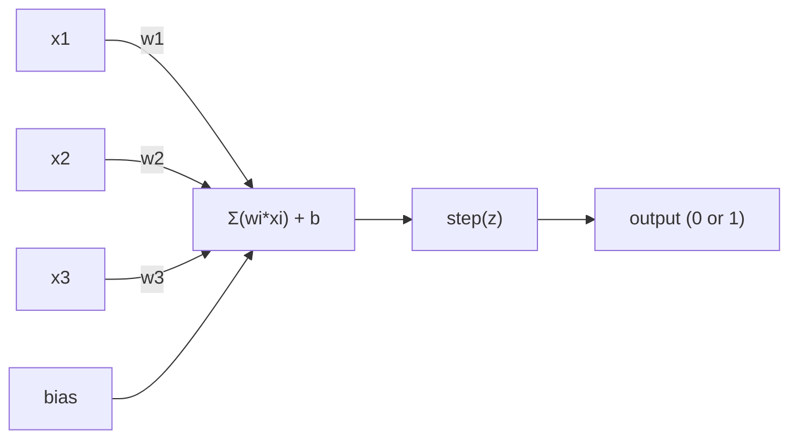
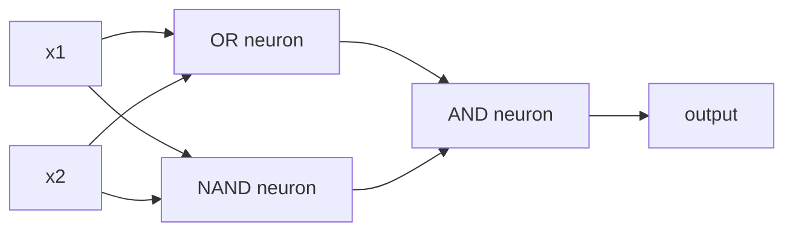

# 感知器

> 感知器是神經網路的原子。把它剖開，你會看到權重、一個偏差項，以及一個決定。

**類型：** 實作
**程式語言：** Python
**先修單元：** 階段 1（線性代數直覺）
**時間：** 約 60 分鐘

## 學習目標

- 用 Python 從零實作一個感知器，包含權重更新規則與階梯激活函式
- 說明為什麼單一感知器只能解決線性可分的問題，並實際演示 XOR 失敗的案例
- 用 OR、NAND、AND 三個閘組合出一個多層感知器來解決 XOR
- 用 sigmoid 激活函式與反向傳播訓練一個兩層網路，讓它自動學會 XOR

## 問題所在

你已經懂向量與內積，也知道矩陣會把輸入轉換成輸出。但機器要怎麼「學」出該用哪一種轉換？

感知器回答了這個問題。它是最簡單的學習機器：拿一些輸入、乘上權重、加上偏差項，然後做出二元的決定。接著調整。就這樣。史上每一個神經網路，都只是把這個想法一層層疊起來而已。

搞懂感知器，就等於搞懂「學習」在程式碼裡實際上是什麼：不斷調整數字，直到輸出符合現實。

## 核心概念

### 一個神經元，一個決定

感知器接收 n 個輸入，把每個輸入乘上一個權重、全部加總、再加上偏差項，最後把結果送進激活函式。



階梯函式非常粗暴：如果加權總和加上偏差項 >= 0，就輸出 1，否則輸出 0。

```
step(z) = 1  if z >= 0
           0  if z < 0
```

這是一個線性分類器。權重與偏差項定義出一條線（在更高維度則是一個超平面），把輸入空間切成兩個區域。

### 決策邊界

對兩個輸入來說，感知器會在二維空間裡畫出一條線：

```
  x2
  ┤
  │  Class 1        /
  │    (0)          /
  │                /
  │               / w1·x1 + w2·x2 + b = 0
  │              /
  │             /     Class 2
  │            /        (1)
  ┼───────────/──────────── x1
```

線的一側全部輸出 0，另一側全部輸出 1。訓練就是移動這條線，直到它正確地把兩個類別分開。

### 學習規則

感知器學習規則很簡單：

```
For each training example (x, y_true):
    y_pred = predict(x)
    error = y_true - y_pred

    For each weight:
        w_i = w_i + learning_rate * error * x_i
    bias = bias + learning_rate * error
```

如果預測正確，error = 0，什麼都不會變。如果預測 0 但答案是 1，權重就增加。如果預測 1 但答案是 0，權重就減少。學習率控制每次調整的幅度。

### XOR 問題

問題就出在這裡。看看這幾個邏輯閘：

```
AND gate:           OR gate:            XOR gate:
x1  x2  out         x1  x2  out         x1  x2  out
0   0   0           0   0   0           0   0   0
0   1   0           0   1   1           0   1   1
1   0   0           1   0   1           1   0   1
1   1   1           1   1   1           1   1   0
```

AND 與 OR 是線性可分的：你可以畫一條線把 0 跟 1 分開。XOR 不行。沒有任何一條線能把 [0,1] 和 [1,0] 從 [0,0] 和 [1,1] 之中分出來。

```
AND (separable):        XOR (not separable):

  x2                      x2
  1 ┤  0     1            1 ┤  1     0
    │     /                 │
  0 ┤  0 / 0              0 ┤  0     1
    ┼──/──────── x1         ┼──────────── x1
       line works!          no single line works!
```

這是一個根本性的限制。單一感知器只能解決線性可分的問題。Minsky 與 Papert 在 1969 年證明了這件事，幾乎讓神經網路研究停滯了十年。

解法：把感知器疊成好幾層。多層感知器可以把兩個線性的決定組合成一個非線性的決定，藉此解決 XOR。

```figure
perceptron-boundary
```

## 動手實作

### 步驟 1：Perceptron 類別

```python
class Perceptron:
    def __init__(self, n_inputs, learning_rate=0.1):
        self.weights = [0.0] * n_inputs
        self.bias = 0.0
        self.lr = learning_rate

    def predict(self, inputs):
        total = sum(w * x for w, x in zip(self.weights, inputs))
        total += self.bias
        return 1 if total >= 0 else 0

    def train(self, training_data, epochs=100):
        for epoch in range(epochs):
            errors = 0
            for inputs, target in training_data:
                prediction = self.predict(inputs)
                error = target - prediction
                if error != 0:
                    errors += 1
                    for i in range(len(self.weights)):
                        self.weights[i] += self.lr * error * inputs[i]
                    self.bias += self.lr * error
            if errors == 0:
                print(f"Converged at epoch {epoch + 1}")
                return
        print(f"Did not converge after {epochs} epochs")
```

### 步驟 2：在邏輯閘上訓練

```python
and_data = [
    ([0, 0], 0),
    ([0, 1], 0),
    ([1, 0], 0),
    ([1, 1], 1),
]

or_data = [
    ([0, 0], 0),
    ([0, 1], 1),
    ([1, 0], 1),
    ([1, 1], 1),
]

not_data = [
    ([0], 1),
    ([1], 0),
]

print("=== AND Gate ===")
p_and = Perceptron(2)
p_and.train(and_data)
for inputs, _ in and_data:
    print(f"  {inputs} -> {p_and.predict(inputs)}")

print("\n=== OR Gate ===")
p_or = Perceptron(2)
p_or.train(or_data)
for inputs, _ in or_data:
    print(f"  {inputs} -> {p_or.predict(inputs)}")

print("\n=== NOT Gate ===")
p_not = Perceptron(1)
p_not.train(not_data)
for inputs, _ in not_data:
    print(f"  {inputs} -> {p_not.predict(inputs)}")
```

### 步驟 3：看著 XOR 失敗

```python
xor_data = [
    ([0, 0], 0),
    ([0, 1], 1),
    ([1, 0], 1),
    ([1, 1], 0),
]

print("\n=== XOR Gate (single perceptron) ===")
p_xor = Perceptron(2)
p_xor.train(xor_data, epochs=1000)
for inputs, expected in xor_data:
    result = p_xor.predict(inputs)
    status = "OK" if result == expected else "WRONG"
    print(f"  {inputs} -> {result} (expected {expected}) {status}")
```

它永遠不會收斂。這就是單一感知器學不會 XOR 的鐵證。

### 步驟 4：用兩層解決 XOR

訣竅是：XOR = (x1 OR x2) AND NOT (x1 AND x2)。把三個感知器組合起來：



```python
def xor_network(x1, x2):
    or_neuron = Perceptron(2)
    or_neuron.weights = [1.0, 1.0]
    or_neuron.bias = -0.5

    nand_neuron = Perceptron(2)
    nand_neuron.weights = [-1.0, -1.0]
    nand_neuron.bias = 1.5

    and_neuron = Perceptron(2)
    and_neuron.weights = [1.0, 1.0]
    and_neuron.bias = -1.5

    hidden1 = or_neuron.predict([x1, x2])
    hidden2 = nand_neuron.predict([x1, x2])
    output = and_neuron.predict([hidden1, hidden2])
    return output


print("\n=== XOR Gate (multi-layer network) ===")
for inputs, expected in xor_data:
    result = xor_network(inputs[0], inputs[1])
    print(f"  {inputs} -> {result} (expected {expected})")
```

四種情況全對。把感知器疊成多層，就能造出任何單一感知器都畫不出來的決策邊界。

### 步驟 5：訓練一個兩層網路

步驟 4 的權重是手工接線接出來的。這對 XOR 行得通，但真實問題裡你事先並不知道正確的權重。解法是：把階梯函式換成 sigmoid，再透過反向傳播自動學出權重。

```python
class TwoLayerNetwork:
    def __init__(self, learning_rate=0.5):
        import random
        random.seed(0)
        self.w_hidden = [[random.uniform(-1, 1), random.uniform(-1, 1)] for _ in range(2)]
        self.b_hidden = [random.uniform(-1, 1), random.uniform(-1, 1)]
        self.w_output = [random.uniform(-1, 1), random.uniform(-1, 1)]
        self.b_output = random.uniform(-1, 1)
        self.lr = learning_rate

    def sigmoid(self, x):
        import math
        x = max(-500, min(500, x))
        return 1.0 / (1.0 + math.exp(-x))

    def forward(self, inputs):
        self.inputs = inputs
        self.hidden_outputs = []
        for i in range(2):
            z = sum(w * x for w, x in zip(self.w_hidden[i], inputs)) + self.b_hidden[i]
            self.hidden_outputs.append(self.sigmoid(z))
        z_out = sum(w * h for w, h in zip(self.w_output, self.hidden_outputs)) + self.b_output
        self.output = self.sigmoid(z_out)
        return self.output

    def train(self, training_data, epochs=10000):
        for epoch in range(epochs):
            total_error = 0
            for inputs, target in training_data:
                output = self.forward(inputs)
                error = target - output
                total_error += error ** 2

                d_output = error * output * (1 - output)

                saved_w_output = self.w_output[:]
                hidden_deltas = []
                for i in range(2):
                    h = self.hidden_outputs[i]
                    hd = d_output * saved_w_output[i] * h * (1 - h)
                    hidden_deltas.append(hd)

                for i in range(2):
                    self.w_output[i] += self.lr * d_output * self.hidden_outputs[i]
                self.b_output += self.lr * d_output

                for i in range(2):
                    for j in range(len(inputs)):
                        self.w_hidden[i][j] += self.lr * hidden_deltas[i] * inputs[j]
                    self.b_hidden[i] += self.lr * hidden_deltas[i]
```

```python
net = TwoLayerNetwork(learning_rate=2.0)
net.train(xor_data, epochs=10000)
for inputs, expected in xor_data:
    result = net.forward(inputs)
    predicted = 1 if result >= 0.5 else 0
    print(f"  {inputs} -> {result:.4f} (rounded: {predicted}, expected {expected})")
```

跟步驟 4 有兩個關鍵差異。第一，sigmoid 取代了階梯函式——它是平滑的，所以梯度存在。第二，`train` 方法把誤差從輸出層往回傳播到隱藏層，依照每個權重對誤差的貢獻比例去調整它。這就是 20 行寫完的反向傳播。

這是通往第 03 課的橋樑。`d_output` 與 `hidden_deltas` 背後的數學，就是把連鎖律套用到網路的計算圖上。我們會在那一課好好推導一遍。

## 框架應用

你剛剛從零打造出來的一切，只要 import 一行就有了：

```python
from sklearn.linear_model import Perceptron as SkPerceptron
import numpy as np

X = np.array([[0,0],[0,1],[1,0],[1,1]])
y = np.array([0, 0, 0, 1])

clf = SkPerceptron(max_iter=100, tol=1e-3)
clf.fit(X, y)
print([clf.predict([x])[0] for x in X])
```

五行。你那 30 行的 `Perceptron` 類別做的是同一件事。sklearn 的版本多了收斂檢查、多種損失函式，以及稀疏輸入的支援——但核心迴圈完全一樣：加權總和、階梯函式、有誤差就更新權重。

真正的差距要到規模變大時才會顯現。生產級的網路裡會變的是：

- 階梯函式換成 sigmoid、ReLU 或其他平滑的激活函式
- 權重透過反向傳播自動學出來（第 03 課）
- 層數變深：3 層、10 層、100 層以上
- 同樣的原則依然成立：每一層都從前一層的輸出造出新的特徵

單一感知器只能畫直線。把它們疊起來，你就能畫出任何形狀。

## 產出交付

這一課會產出：
- `outputs/skill-perceptron.md` —— 一份技能文件，說明什麼時候需要單層架構、什麼時候需要多層架構

## 練習

1. 用一個 NAND 閘訓練感知器（NAND 是萬用閘——任何邏輯電路都能只用 NAND 搭出來）。驗證它的權重與偏差項構成一個有效的決策邊界。
2. 修改 Perceptron 類別，讓它在每個 epoch 記錄決策邊界（w1*x1 + w2*x2 + b = 0）。印出在 AND 閘上訓練時，這條線是怎麼移動的。
3. 打造一個三輸入的感知器，只有在三個輸入中至少有 2 個是 1 時才輸出 1（多數表決函式）。這是線性可分的嗎？為什麼？

## 關鍵術語

| 術語 | 大家怎麼說 | 實際上是什麼 |
|------|----------------|----------------------|
| 感知器 | 「假的神經元」 | 一個線性分類器：輸入與權重的內積，加上偏差項，再送進階梯函式 |
| 權重 | 「一個輸入有多重要」 | 一個乘數，用來縮放每個輸入對決定的貢獻程度 |
| 偏差項 | 「那個閾值」 | 一個常數，會平移決策邊界，讓感知器在輸入全為 0 時也能激發 |
| 激活函式 | 「把數值壓扁的那個東西」 | 加權總和之後套上的函式——感知器用階梯函式，現代網路用 sigmoid／ReLU |
| 線性可分 | 「你可以在它們之間畫一條線」 | 一個資料集，能被單一超平面完美地把各類別分開 |
| XOR 問題 | 「感知器做不到的那件事」 | 證明單層網路無法學會非線性可分的函式 |
| 決策邊界 | 「分類器切換的地方」 | 超平面 w*x + b = 0，把輸入空間切成兩個類別 |
| 多層感知器 | 「真正的神經網路」 | 把感知器疊成多層，每一層的輸出就是下一層的輸入 |

## 延伸閱讀

- Frank Rosenblatt, "The Perceptron: A Probabilistic Model for Information Storage and Organization in the Brain" (1958) —— 開啟這一切的原始論文
- Minsky & Papert, "Perceptrons" (1969) —— 證明單層網路解不了 XOR、也讓感知器研究停擺十年的那本書
- Michael Nielsen, "Neural Networks and Deep Learning", Chapter 1 (http://neuralnetworksanddeeplearning.com/) —— 免費線上閱讀，對感知器如何組成網路有最好的視覺化說明
