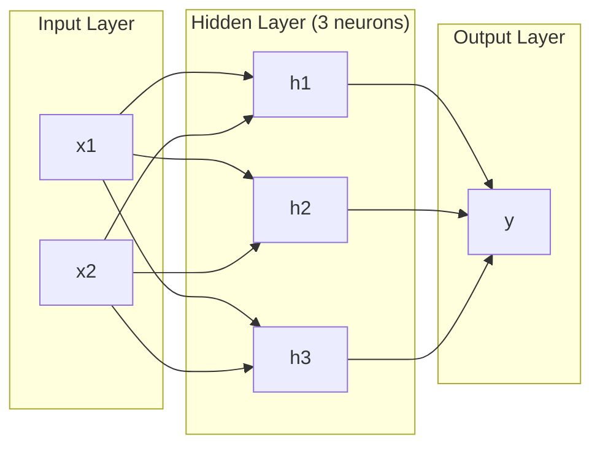
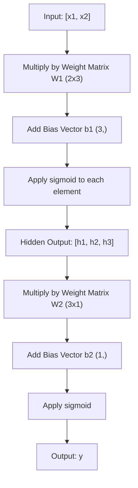
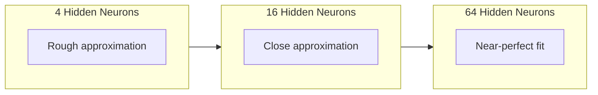

# 多層網路與前向傳播

> 一個神經元只能畫一條線。把它們疊起來，你就什麼都畫得出來。

**類型：** 實作
**程式語言：** Python
**先修單元：** 階段 01（數學基礎）、單元 03.01（感知器）
**時間：** 約 90 分鐘

## 學習目標

- 從零打造一個多層網路，用 Layer 與 Network 類別完成一次完整的前向傳播
- 追蹤矩陣維度如何穿過網路的每一層，並找出形狀不匹配的地方
- 說明為什麼把非線性激活函式疊起來，網路就能學出彎曲的決策邊界
- 用 2-2-1 架構搭配手動調好的 sigmoid 權重解出 XOR 問題

## 問題所在

單一神經元就是個畫線工具。就這樣。一條直線穿過你的資料。AI 裡每一個真實問題 —— 影像辨識、語言理解、下圍棋 —— 都需要曲線。把神經元疊成一層一層，就是取得曲線的方法。

1969 年，Minsky 與 Papert 證明了這個限制是致命的：單層網路學不會 XOR。不是「學得很辛苦」—— 是數學上不可能。XOR 真值表把 [0,1] 和 [1,0] 放在一邊，[0,0] 和 [1,1] 放在另一邊。沒有任何一條直線能把它們分開。

這件事讓神經網路的研究經費斷了十幾年。事後看來解法很明顯：別只用一層。把神經元疊成多層。讓第一層把輸入空間切成新的特徵，再讓第二層把這些特徵組合成任何單一直線都做不到的判斷。

那一疊就是多層網路。它是今天每一個上線的深度學習模型的基礎。前向傳播 —— 資料從輸入流經隱藏層再到輸出 —— 是你在任何其他東西能動之前，第一個要打造的部分。

## 核心概念

### 層：輸入層、隱藏層、輸出層

一個多層網路有三種層：

**輸入層** —— 其實不太算是一層。它只是裝著你的原始資料。兩個特徵就是兩個輸入節點。這裡不做任何運算。

**隱藏層** —— 工作真正發生的地方。每個神經元收下前一層的每一個輸出，套上權重與一個偏差項，再把結果送過激活函式。叫「隱藏」是因為你在訓練資料裡永遠看不到這些值。

**輸出層** —— 最終答案。二元分類就是一個神經元加 sigmoid。多類別分類則是每個類別一個神經元。



這是一個 2-3-1 網路。兩個輸入、三個隱藏神經元、一個輸出。每一條連線都帶著一個權重。每個神經元（輸入層除外）都帶著一個偏差項。

每一層都產出一個數字向量，稱為隱藏狀態。對文字來說，隱藏狀態會提高維度 —— 把一個詞編碼成 768 個數字來捕捉語意。對影像來說，它會降低維度 —— 把數百萬個像素壓縮成一份可處理的表示。學習就住在隱藏狀態裡。

### 神經元與激活函式

每個神經元做三件事：

1. 把每個輸入乘上它對應的權重
2. 把所有乘積加總，再加上一個偏差項
3. 把這個總和送過激活函式

目前我們用的激活函式是 sigmoid：

```
sigmoid(z) = 1 / (1 + e^(-z))
```

Sigmoid 把任何數字壓進 (0, 1) 這個範圍。很大的正數會被推向 1。很大的負數會被推向 0。零則對應到 0.5。這條平滑的曲線正是學習之所以可能的原因 —— 不像感知器那種硬邦邦的階梯函式，sigmoid 處處都有梯度。

### 前向傳播：資料怎麼流動

前向傳播把輸入資料一層一層推過網路，直到抵達輸出。前向傳播期間不發生學習。它是純粹的運算：乘、加、激活，重複。



在每一層，都有三個運算依序發生：

```
z = W * input + b       (linear transformation)
a = sigmoid(z)           (activation)
```

一層的輸出成為下一層的輸入。這就是整個前向傳播。

### 矩陣維度

追蹤維度是深度學習裡最重要的一項除錯技能。以下是那個 2-3-1 網路：

| 步驟 | 運算 | 維度 | 結果形狀 |
|------|-----------|------------|-------------|
| 輸入 | x | —— | (2,) |
| 隱藏層線性運算 | W1 * x + b1 | W1: (3, 2), b1: (3,) | (3,) |
| 隱藏層激活 | sigmoid(z1) | —— | (3,) |
| 輸出層線性運算 | W2 * h + b2 | W2: (1, 3), b2: (1,) | (1,) |
| 輸出層激活 | sigmoid(z2) | —— | (1,) |

規則是：第 k 層的權重矩陣 W 形狀為 (neurons_in_layer_k, neurons_in_layer_k_minus_1)。行數對應當前層。列數對應前一層。如果形狀對不上，你就有 bug。

### 通用近似定理

1989 年，George Cybenko 證明了一件了不起的事：只要有足夠多的神經元，一個只有單一隱藏層的神經網路就能以任意精度近似任何連續函式。

這不代表一層隱藏層永遠是最好的。它只代表這個架構在理論上做得到。實務上，更深的網路（層數更多、每層神經元更少）能用遠比淺而寬的網路更少的總參數量，學到同樣的函式。這就是深度學習之所以有效的原因。

直覺是這樣：隱藏層裡的每個神經元學會一個「凸起」或一項特徵。只要有足夠多的凸起放在對的位置，就能近似任何平滑曲線。神經元越多、凸起越多，近似越好。



### 可組合性

神經網路是可以組合的。你可以把它們疊起來、串起來、平行跑。Whisper 模型用一個編碼器網路處理音訊，再用另一個獨立的解碼器網路生成文字。現代的 LLM 是只有解碼器的架構。BERT 只有編碼器。T5 是編碼器解碼器。架構的選擇決定了模型能做什麼。

```figure
mlp-forward
```

## 動手實作

純 Python。不用 numpy。每一個矩陣運算都從零寫起。

### 步驟 1：Sigmoid 激活函式

```python
import math

def sigmoid(x):
    x = max(-500.0, min(500.0, x))
    return 1.0 / (1.0 + math.exp(-x))
```

夾到 [-500, 500] 是為了避免溢位。`math.exp(500)` 很大，但仍是有限值。`math.exp(1000)` 則是無限大。

### 步驟 2：Layer 類別

整個深度學習裡最重要的運算就是矩陣乘法。每一層、每個注意力頭、每次前向傳播 —— 從上到下都是矩陣乘法。一個線性層收下一個輸入向量，乘上一個權重矩陣，再加上一個偏差向量：y = Wx + b。光是這一條式子，就佔掉神經網路九成的運算量。

一個層裝著一個權重矩陣和一個偏差向量。它的 forward 方法收下一個輸入向量，回傳激活過的輸出。

```python
class Layer:
    def __init__(self, n_inputs, n_neurons, weights=None, biases=None):
        if weights is not None:
            self.weights = weights
        else:
            import random
            self.weights = [
                [random.uniform(-1, 1) for _ in range(n_inputs)]
                for _ in range(n_neurons)
            ]
        if biases is not None:
            self.biases = biases
        else:
            self.biases = [0.0] * n_neurons

    def forward(self, inputs):
        self.last_input = inputs
        self.last_output = []
        for neuron_idx in range(len(self.weights)):
            z = sum(
                w * x for w, x in zip(self.weights[neuron_idx], inputs)
            )
            z += self.biases[neuron_idx]
            self.last_output.append(sigmoid(z))
        return self.last_output
```

權重矩陣的形狀是 (n_neurons, n_inputs)。每一行是一個神經元對所有輸入的權重。forward 方法逐一走過每個神經元，算出加權和加偏差項，套上 sigmoid，再把結果收集起來。

### 步驟 3：Network 類別

一個網路就是一串層。前向傳播把它們串接起來：第 k 層的輸出餵進第 k+1 層。

```python
class Network:
    def __init__(self, layers):
        self.layers = layers

    def forward(self, inputs):
        current = inputs
        for layer in self.layers:
            current = layer.forward(current)
        return current
```

這就是整個前向傳播。四行邏輯。資料進來，流過每一層，從另一端出去。

### 步驟 4：用手動調好的權重解 XOR

在單元 01，我們是靠組合 OR、NAND 與 AND 感知器解出 XOR 的。現在用我們的 Layer 與 Network 類別做同一件事。2-2-1 架構：兩個輸入、兩個隱藏神經元、一個輸出。

```python
hidden = Layer(
    n_inputs=2,
    n_neurons=2,
    weights=[[20.0, 20.0], [-20.0, -20.0]],
    biases=[-10.0, 30.0],
)

output = Layer(
    n_inputs=2,
    n_neurons=1,
    weights=[[20.0, 20.0]],
    biases=[-30.0],
)

xor_net = Network([hidden, output])

xor_data = [
    ([0, 0], 0),
    ([0, 1], 1),
    ([1, 0], 1),
    ([1, 1], 0),
]

for inputs, expected in xor_data:
    result = xor_net.forward(inputs)
    predicted = 1 if result[0] >= 0.5 else 0
    print(f"  {inputs} -> {result[0]:.6f} (rounded: {predicted}, expected: {expected})")
```

很大的權重（20、-20）會讓 sigmoid 表現得像階梯函式。第一個隱藏神經元近似 OR。第二個近似 NAND。輸出神經元把它們組合成 AND，也就是 XOR。

### 步驟 5：圓形分類

一個更難的問題：判斷 2D 點落在以原點為中心、半徑 0.5 的圓內還是圓外。這需要一條彎曲的決策邊界 —— 單一感知器辦不到。

```python
import random
import math

random.seed(42)

data = []
for _ in range(200):
    x = random.uniform(-1, 1)
    y = random.uniform(-1, 1)
    label = 1 if (x * x + y * y) < 0.25 else 0
    data.append(([x, y], label))

circle_net = Network([
    Layer(n_inputs=2, n_neurons=8),
    Layer(n_inputs=8, n_neurons=1),
])
```

權重是隨機的，網路分類不會分得好。但前向傳播照樣跑得起來。重點就在這裡 —— 前向傳播純粹只是運算。學到對的權重是反向傳播的事，那是單元 03 的內容。

```python
correct = 0
for inputs, expected in data:
    result = circle_net.forward(inputs)
    predicted = 1 if result[0] >= 0.5 else 0
    if predicted == expected:
        correct += 1

print(f"Accuracy with random weights: {correct}/{len(data)} ({100*correct/len(data):.1f}%)")
```

隨機權重的準確率很差 —— 常常比直接猜多數類別還糟。訓練過之後（單元 03），同樣這個帶 8 個隱藏神經元的架構就會畫出一條彎曲的邊界，把圓內和圓外分開。

## 框架應用

PyTorch 用四行就做完上面所有事：

```python
import torch
import torch.nn as nn

model = nn.Sequential(
    nn.Linear(2, 8),
    nn.Sigmoid(),
    nn.Linear(8, 1),
    nn.Sigmoid(),
)

x = torch.tensor([[0.0, 0.0], [0.0, 1.0], [1.0, 0.0], [1.0, 1.0]])
output = model(x)
print(output)
```

`nn.Linear(2, 8)` 就是你的 Layer 類別：形狀 (8, 2) 的權重矩陣，加上形狀 (8,) 的偏差向量。`nn.Sigmoid()` 就是你的 sigmoid 函式，逐元素套用。`nn.Sequential` 就是你的 Network 類別：依序串接各層。

差別在速度與規模。PyTorch 跑在 GPU 上，能處理數百萬筆樣本的批次，還會自動算出反向傳播需要的梯度。但前向傳播的邏輯，跟你剛剛從零打造的完全相同。

## 產出交付

本單元會產出一份可重複使用的提示詞，用來設計網路架構：

- `outputs/prompt-network-architect.md`

當你需要決定某個問題該用幾層、每層幾個神經元、以及用哪些激活函式時，就拿它出來用。

## 練習

1. 打造一個 2-4-2-1 網路（兩層隱藏層），用隨機權重在 XOR 資料上跑一次前向傳播。把中間隱藏層的輸出印出來，看看表示在每一層是怎麼變形的。

2. 把圓形分類器的隱藏層大小從 8 改成 2，再改成 32。每次都用隨機權重跑一次前向傳播。隱藏神經元的數量會改變輸出的範圍或分布嗎？為什麼？

3. 在 Network 類別上實作一個 `count_parameters` 方法，回傳可訓練的權重與偏差項總數。拿一個 784-256-128-10 的網路（經典的 MNIST 架構）來測。它有多少參數？

4. 為一個 3-4-4-2 網路打造前向傳播。餵給它 RGB 色彩值（正規化到 0-1），觀察那兩個輸出。這就是一個有兩個類別的簡單色彩分類器的架構。

5. 把 sigmoid 換成一個「洩漏階梯」函式：z < 0 時回傳 0.01 * z，否則回傳 1.0。用步驟 4 那組手動調好的權重，在 XOR 上跑前向傳播。它還能動嗎？為什麼平滑的 sigmoid 比硬切斷更受青睞？

## 關鍵術語

| 術語 | 大家怎麼說 | 實際上是什麼 |
|------|----------------|----------------------|
| 前向傳播 | 「跑一次模型」 | 把輸入推過每一層 —— 乘權重、加偏差項、套激活函式 —— 產出一個輸出 |
| 隱藏層 | 「中間那段」 | 介於輸入與輸出之間的任何一層，其數值在資料裡看不到 |
| 多層網路 | 「深度神經網路」 | 依序疊起來的一層層神經元，每層的輸出餵進下一層的輸入 |
| 激活函式 | 「那個非線性」 | 套在線性變換之後的函式，把曲線引入決策邊界 |
| Sigmoid | 「那條 S 曲線」 | sigma(z) = 1/(1+e^(-z))，把任何實數壓進 (0,1)，處處平滑可微 |
| 權重矩陣 | 「那些參數」 | 形狀為 (current_layer_neurons, previous_layer_neurons) 的矩陣 W，裝著可學習的連結強度 |
| 偏差向量 | 「那個偏移量」 | 矩陣乘法之後加上的向量，讓神經元在所有輸入都是零時也能被激活 |
| 通用近似 | 「神經網路什麼都學得會」 | 只要神經元夠多，單一隱藏層就能近似任何連續函式 —— 但「夠多」可能意味著數十億個 |
| 線性變換 | 「矩陣乘法那一步」 | z = W * x + b，激活之前的運算，把輸入映射到一個新空間 |
| 決策邊界 | 「分類器翻面的地方」 | 輸入空間裡的那個曲面，網路輸出在此跨過分類門檻 |

## 延伸閱讀

- Michael Nielsen, "Neural Networks and Deep Learning", Chapter 1-2 (http://neuralnetworksanddeeplearning.com/) —— 對前向傳播與網路結構最清楚的免費說明，附互動視覺化
- Cybenko, "Approximation by Superpositions of a Sigmoidal Function" (1989) —— 通用近似定理的原始論文，意外地好讀
- 3Blue1Brown, "But what is a neural network?" (https://www.youtube.com/watch?v=aircAruvnKk) —— 20 分鐘的視覺導覽，講層、權重與前向傳播，能幫你建立正確的心智模型
- Goodfellow, Bengio, Courville, "Deep Learning", Chapter 6 (https://www.deeplearningbook.org/) —— 多層網路的標準參考書，網路上免費
