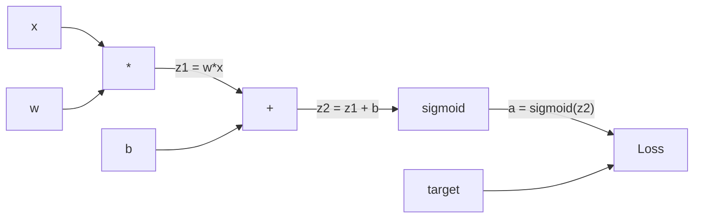
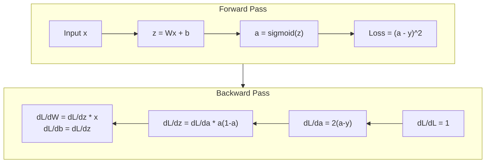
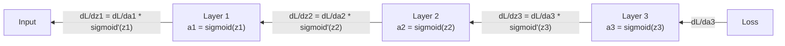

# 從零打造反向傳播

> 反向傳播是讓學習成為可能的演算法。少了它，神經網路只是很貴的隨機數產生器。

**類型：** 實作
**程式語言：** Python
**先修單元：** 階段 3 · 02（多層網路）
**時間：** 約 120 分鐘

## 學習目標

- 實作一個以 Value 為核心的 autograd 引擎，它會建出計算圖，並用拓撲排序算出梯度
- 用連鎖律推導加法、乘法與 sigmoid 的反向傳播
- 只用你從零打造的反向傳播引擎，在 XOR 與圓形分類上訓練一個多層網路
- 指出深層 sigmoid 網路裡的梯度消失問題，並解釋梯度為什麼會指數縮小

## 問題所在

你的網路只有一層隱藏層，768 個輸入、3072 個輸出。那是 2,359,296 個權重。它給了一個錯的預測。是哪些權重造成這個誤差？逐一測試每個權重，意思是要跑 230 萬次前向傳播。反向傳播只用一次反向傳播就把這 230 萬個梯度全算出來。這不是最佳化，這是「訓練得動」與「根本不可能」的差別。

天真的做法：拿一個權重，把它推動一丁點，再跑一次前向傳播，看看損失是升還是降。這樣你得到那個權重的梯度。現在對網路裡每一個權重都做一遍。再乘上好幾千個訓練步、好幾百萬筆資料。你需要地質年代的時間才訓練得出任何有用的東西。

反向傳播解決了這件事。一次前向傳播、一次反向傳播，所有梯度都算好。訣竅就是微積分裡的連鎖律，系統性地套用在一張計算圖上。這就是讓深度學習變得實用的演算法。少了它，我們現在還會卡在玩具問題上。

## 核心概念

### 套用在網路上的連鎖律

你在階段 1 的單元 05 見過連鎖律。快速複習：若 y = f(g(x))，則 dy/dx = f'(g(x)) * g'(x)。把鏈上的導數一路乘起來。

在神經網路裡，這條「鏈」就是從輸入到損失的那一串運算。每一層乘上權重、加上偏差項、再穿過激活函式。損失函式把最後的輸出跟目標比較。反向傳播沿著這條鏈往回走，算出每個運算對誤差的貢獻有多少。

### 計算圖

每一次前向傳播都會建出一張圖。每個節點是一個運算（乘、加、sigmoid）。每條邊往前帶著數值，往後帶著梯度。



前向傳播：數值從左流到右。x 與 w 產生 z1 = w*x。加上 b 得到 z2。sigmoid 給出激活值 a。再用損失函式把 a 跟目標 y 比較。

反向傳播：梯度從右流到左。從 dL/da（損失隨激活值怎麼變）開始。乘上 da/dz2（sigmoid 的導數），得到 dL/dz2。再拆成 dL/db（因為 z2 = z1 + b，它等於 dL/dz2）與 dL/dz1。接著 dL/dw = dL/dz1 * x、dL/dx = dL/dz1 * w。

反向傳播時，圖上每個節點只做一件事：接住從上游來的梯度，乘上自己的局部梯度，再往下傳。

### 前向與反向



前向傳播會存下每一個中間值：z、a、以及每一層的輸入。反向傳播需要這些存下來的值才算得出梯度。這就是反向傳播核心的記憶體與計算取捨：你用記憶體（存激活值）換速度（一次傳遞取代幾百萬次）。

### 梯度在網路中的流動

在一個 3 層網路裡，梯度會串過每一層：



在每一層，梯度都會再乘上一次 sigmoid 的導數。sigmoid 的導數是 a * (1 - a)，最大值只有 0.25（在 a = 0.5 時）。往下三層，梯度最多只被乘上 0.25^3 = 0.0156。往下十層：0.25^10 = 0.000001。

### 梯度消失

這就是梯度消失問題。sigmoid 把輸出壓在 0 與 1 之間，它的導數永遠小於 0.25。sigmoid 層疊得夠多，梯度就會縮到什麼都不剩。前面幾層幾乎學不到東西，因為它們收到的誤差訊號趨近於零。

```
sigmoid(z):     Output range [0, 1]
sigmoid'(z):    Max value 0.25 (at z = 0)

After 5 layers:   gradient * 0.25^5 = 0.001x original
After 10 layers:  gradient * 0.25^10 = 0.000001x original
```

這就是深層 sigmoid 網路幾乎訓練不起來的原因。解法 —— ReLU 及其變體 —— 是單元 04 的主題。現在你只要理解：反向傳播本身運作得完美無缺，問題出在它得穿過的東西。

### 推導一個 2 層網路的梯度

以下是具體的數學，網路是：輸入 x、一層帶 sigmoid 的隱藏層、一層帶 sigmoid 的輸出層，加上 MSE 損失。

前向傳播：
```
z1 = W1 * x + b1
a1 = sigmoid(z1)
z2 = W2 * a1 + b2
a2 = sigmoid(z2)
L = (a2 - y)^2
```

反向傳播（一步一步套用連鎖律）：
```
dL/da2 = 2(a2 - y)
da2/dz2 = a2 * (1 - a2)
dL/dz2 = dL/da2 * da2/dz2 = 2(a2 - y) * a2 * (1 - a2)

dL/dW2 = dL/dz2 * a1
dL/db2 = dL/dz2

dL/da1 = dL/dz2 * W2
da1/dz1 = a1 * (1 - a1)
dL/dz1 = dL/da1 * da1/dz1

dL/dW1 = dL/dz1 * x
dL/db1 = dL/dz1
```

每一個梯度都是從損失一路回溯的局部梯度乘積。反向傳播就只是這樣而已。

```figure
backprop-vanishing
```

## 動手實作

### 步驟 1：Value 節點

我們計算裡的每一個數字都變成一個 Value。它存住自己的數值、梯度，以及它是怎麼被造出來的（這樣它才知道反向時怎麼算梯度）。

```python
class Value:
    def __init__(self, data, children=(), op=''):
        self.data = data
        self.grad = 0.0
        self._backward = lambda: None
        self._children = set(children)
        self._op = op

    def __repr__(self):
        return f"Value(data={self.data:.4f}, grad={self.grad:.4f})"
```

還沒有梯度（0.0）。也還沒有反向函式（空操作）。`_children` 記著哪些 Value 產生了它，這樣我們之後才能對圖做拓撲排序。

### 步驟 2：帶反向函式的運算

每個運算都建立一個新的 Value，並定義梯度要怎麼反向穿過它。

```python
def __add__(self, other):
    other = other if isinstance(other, Value) else Value(other)
    out = Value(self.data + other.data, (self, other), '+')

    def _backward():
        self.grad += out.grad
        other.grad += out.grad

    out._backward = _backward
    return out

def __mul__(self, other):
    other = other if isinstance(other, Value) else Value(other)
    out = Value(self.data * other.data, (self, other), '*')

    def _backward():
        self.grad += other.data * out.grad
        other.grad += self.data * out.grad

    out._backward = _backward
    return out
```

加法：d(a+b)/da = 1、d(a+b)/db = 1。所以兩個輸入都直接拿到輸出的梯度。

乘法：d(a*b)/da = b、d(a*b)/db = a。每個輸入拿到的是另一個輸入的值乘上輸出的梯度。

`+=` 很關鍵。一個 Value 可能被用在多個運算裡，它的梯度是所有路徑傳回來的梯度總和。

### 步驟 3：Sigmoid 與損失

```python
import math

def sigmoid(self):
    x = self.data
    x = max(-500, min(500, x))
    s = 1.0 / (1.0 + math.exp(-x))
    out = Value(s, (self,), 'sigmoid')

    def _backward():
        self.grad += (s * (1 - s)) * out.grad

    out._backward = _backward
    return out
```

sigmoid 的導數：sigmoid(x) * (1 - sigmoid(x))。前向傳播時我們已經算出 sigmoid(x) = s，直接重用就好，不必多做事。

```python
def mse_loss(predicted, target):
    diff = predicted + Value(-target)
    return diff * diff
```

單一輸出的 MSE：(predicted - target)^2。我們把減法寫成加上一個取負的 Value。

### 步驟 4：反向傳播

拓撲排序保證我們用正確的順序處理節點 —— 一個節點的梯度完全累積好之後，才會穿過它往下傳。

```python
def backward(self):
    topo = []
    visited = set()

    def build_topo(v):
        if v not in visited:
            visited.add(v)
            for child in v._children:
                build_topo(child)
            topo.append(v)

    build_topo(self)
    self.grad = 1.0
    for v in reversed(topo):
        v._backward()
```

從損失開始（梯度 = 1.0，因為 dL/dL = 1）。沿著排序好的圖往回走。每個節點的 `_backward` 把梯度推給它的子節點。

### 步驟 5：層與網路

```python
import random

class Neuron:
    def __init__(self, n_inputs):
        scale = (2.0 / n_inputs) ** 0.5
        self.weights = [Value(random.uniform(-scale, scale)) for _ in range(n_inputs)]
        self.bias = Value(0.0)

    def __call__(self, x):
        act = sum((wi * xi for wi, xi in zip(self.weights, x)), self.bias)
        return act.sigmoid()

    def parameters(self):
        return self.weights + [self.bias]


class Layer:
    def __init__(self, n_inputs, n_outputs):
        self.neurons = [Neuron(n_inputs) for _ in range(n_outputs)]

    def __call__(self, x):
        out = [n(x) for n in self.neurons]
        return out[0] if len(out) == 1 else out

    def parameters(self):
        params = []
        for n in self.neurons:
            params.extend(n.parameters())
        return params


class Network:
    def __init__(self, sizes):
        self.layers = []
        for i in range(len(sizes) - 1):
            self.layers.append(Layer(sizes[i], sizes[i + 1]))

    def __call__(self, x):
        for layer in self.layers:
            x = layer(x)
            if not isinstance(x, list):
                x = [x]
        return x[0] if len(x) == 1 else x

    def parameters(self):
        params = []
        for layer in self.layers:
            params.extend(layer.parameters())
        return params

    def zero_grad(self):
        for p in self.parameters():
            p.grad = 0.0
```

一個 Neuron 接收輸入，算出加權和加偏差項，再套上 sigmoid。權重初始化以 sqrt(2/n_inputs) 縮放，避免較深的網路裡 sigmoid 飽和。一個 Layer 是一串 Neuron。一個 Network 是一串 Layer。`parameters()` 方法把所有可學習的 Value 蒐集起來，這樣我們才能對它們做參數更新。

### 步驟 6：在 XOR 上訓練

```python
random.seed(42)
net = Network([2, 4, 1])

xor_data = [
    ([0.0, 0.0], 0.0),
    ([0.0, 1.0], 1.0),
    ([1.0, 0.0], 1.0),
    ([1.0, 1.0], 0.0),
]

learning_rate = 1.0

for epoch in range(1000):
    total_loss = Value(0.0)
    for inputs, target in xor_data:
        x = [Value(i) for i in inputs]
        pred = net(x)
        loss = mse_loss(pred, target)
        total_loss = total_loss + loss

    net.zero_grad()
    total_loss.backward()

    for p in net.parameters():
        p.data -= learning_rate * p.grad

    if epoch % 100 == 0:
        print(f"Epoch {epoch:4d} | Loss: {total_loss.data:.6f}")

print("\nXOR Results:")
for inputs, target in xor_data:
    x = [Value(i) for i in inputs]
    pred = net(x)
    print(f"  {inputs} -> {pred.data:.4f} (expected {target})")
```

看著損失一路往下掉。從隨機的預測到正確的 XOR 輸出，全都是反向傳播算出梯度、再把權重推往正確方向的結果。

### 步驟 7：圓形分類

在單元 02，你是手動調權重來做圓形分類。現在讓網路自己學出來。

```python
random.seed(7)

def generate_circle_data(n=100):
    data = []
    for _ in range(n):
        x1 = random.uniform(-1.5, 1.5)
        x2 = random.uniform(-1.5, 1.5)
        label = 1.0 if x1 * x1 + x2 * x2 < 1.0 else 0.0
        data.append(([x1, x2], label))
    return data

circle_data = generate_circle_data(80)

circle_net = Network([2, 8, 1])
learning_rate = 0.5

for epoch in range(2000):
    random.shuffle(circle_data)
    total_loss_val = 0.0
    for inputs, target in circle_data:
        x = [Value(i) for i in inputs]
        pred = circle_net(x)
        loss = mse_loss(pred, target)
        circle_net.zero_grad()
        loss.backward()
        for p in circle_net.parameters():
            p.data -= learning_rate * p.grad
        total_loss_val += loss.data

    if epoch % 200 == 0:
        correct = 0
        for inputs, target in circle_data:
            x = [Value(i) for i in inputs]
            pred = circle_net(x)
            predicted_class = 1.0 if pred.data > 0.5 else 0.0
            if predicted_class == target:
                correct += 1
        accuracy = correct / len(circle_data) * 100
        print(f"Epoch {epoch:4d} | Loss: {total_loss_val:.4f} | Accuracy: {accuracy:.1f}%")
```

這裡我們用線上 SGD —— 每看完一個樣本就做一次參數更新，而不是累積整個批次。這樣能更快打破對稱性，也避免在完整的損失地形上讓 sigmoid 飽和。每個 epoch 都把資料打亂，可以避免網路把順序背下來。

不用手調。網路自己找出圓形的決策邊界。這就是反向傳播的威力：你定好架構、損失函式與資料，演算法會把權重找出來。

## 框架應用

PyTorch 用幾行就做完上面所有事。核心想法一模一樣 —— autograd 在前向傳播時建出計算圖，再反向走一遍算出梯度。

```python
import torch
import torch.nn as nn

model = nn.Sequential(
    nn.Linear(2, 4),
    nn.Sigmoid(),
    nn.Linear(4, 1),
    nn.Sigmoid(),
)
optimizer = torch.optim.SGD(model.parameters(), lr=1.0)
criterion = nn.MSELoss()

X = torch.tensor([[0,0],[0,1],[1,0],[1,1]], dtype=torch.float32)
y = torch.tensor([[0],[1],[1],[0]], dtype=torch.float32)

for epoch in range(1000):
    pred = model(X)
    loss = criterion(pred, y)
    optimizer.zero_grad()
    loss.backward()
    optimizer.step()

print("PyTorch XOR Results:")
with torch.no_grad():
    for i in range(4):
        pred = model(X[i])
        print(f"  {X[i].tolist()} -> {pred.item():.4f} (expected {y[i].item()})")
```

`loss.backward()` 就是你的 `total_loss.backward()`。`optimizer.step()` 就是你手寫的 `p.data -= lr * p.grad`。`optimizer.zero_grad()` 就是你的 `net.zero_grad()`。同一套演算法，只是工業級的實作。PyTorch 會處理 GPU 加速、混合精度、梯度檢查點，還有好幾百種層。但反向傳播還是同一條連鎖律，套在同一張計算圖上。

訓練會跑前向傳播、接著跑反向傳播，然後做參數更新。推論只跑前向傳播，沒有梯度，也沒有更新。這個區別很重要，因為推論才是正式環境裡發生的事。當你呼叫像 Claude 或 GPT 這樣的 API，你跑的是推論 —— 你的提示詞往前流過整個網路，詞元從另一端出來。權重不會變。懂反向傳播之所以重要，是因為那個網路裡的每一個權重都是它塑造出來的。

## 產出交付

本單元會產出：
- `outputs/prompt-gradient-debugger.md` —— 一個可重複使用的提示詞，用來診斷任何神經網路的梯度問題（梯度消失、梯度爆炸、NaN）

## 練習

1. 為 Value 類別加上 `__sub__` 方法（a - b = a + (-1 * b)）。接著實作 `__neg__` 方法。拿 (a - b)^2 這種簡單的表達式跟手算結果比對，驗證梯度是對的。

2. 為 Value 加上 `relu` 方法（輸出 max(0, x)，導數在 x > 0 時是 1，否則是 0）。把隱藏層的 sigmoid 換成 relu，再訓練一次 XOR。比較收斂速度。你應該會看到訓練變快 —— 這是單元 04 的預告。

3. 在 Value 上實作 `__pow__` 方法以支援整數次方。用它把 `mse_loss` 換成正規的 `(predicted - target) ** 2` 表達式。驗證梯度跟原本的實作一致。

4. 在訓練迴圈裡加上梯度裁剪：呼叫 `backward()` 之後，把所有梯度裁到 [-1, 1]。訓練一個更深的網路（4 層以上，用 sigmoid），比較有裁剪與沒裁剪的損失曲線。這是你對付梯度爆炸的第一道防線。

5. 做一個視覺化：在 XOR 上訓練完之後，把網路裡每一個參數的梯度印出來。找出哪一層的梯度最小。這會實際展示你在核心概念一節讀到的梯度消失問題。

## 關鍵術語

| 術語 | 大家怎麼說 | 實際上是什麼 |
|------|----------------|----------------------|
| 反向傳播（backpropagation） | 「網路在學習」 | 一套演算法，靠著在計算圖上反向套用連鎖律，算出每個權重的 dL/dw |
| 計算圖 | 「網路的結構」 | 一張有向無環圖，節點是運算，邊上帶著數值（前向）與梯度（反向） |
| 連鎖律 | 「把導數乘起來」 | 若 y = f(g(x))，則 dy/dx = f'(g(x)) * g'(x) —— 反向傳播的數學基礎 |
| 梯度 | 「最陡上升的方向」 | 損失對某個參數的偏導數 —— 告訴你要怎麼改那個參數才能讓損失變小 |
| 梯度消失 | 「深層網路學不動」 | 梯度穿過像 sigmoid 這種會飽和的激活函式時，會逐層指數縮小 |
| 前向傳播 | 「跑一次網路」 | 依序套用每一層的運算，從輸入算出輸出，並把中間值存下來 |
| 反向傳播（backward pass） | 「算梯度」 | 反向走過計算圖，用連鎖律在每個節點累積梯度 |
| 學習率 | 「學得多快」 | 一個純量，控制參數更新的步長：w_new = w_old - lr * gradient |
| 拓撲排序 | 「正確的順序」 | 一種圖節點的排序，讓每個節點都排在它所有相依項之後 —— 保證梯度傳下去之前已經完全累積好 |
| Autograd | 「自動微分」 | 一套在前向計算時建出計算圖、並自動算出梯度的系統 —— PyTorch 的引擎做的就是這件事 |

## 延伸閱讀

- Rumelhart, Hinton & Williams, "Learning representations by back-propagating errors" (1986) —— 讓反向傳播成為主流、也解開多層網路訓練的那篇論文
- 3Blue1Brown, "Neural Networks" series (https://www.youtube.com/playlist?list=PLZHQObOWTQDNU6R1_67000Dx_ZCJB-3pi) —— 對反向傳播與梯度在網路中流動最好的視覺化解釋
