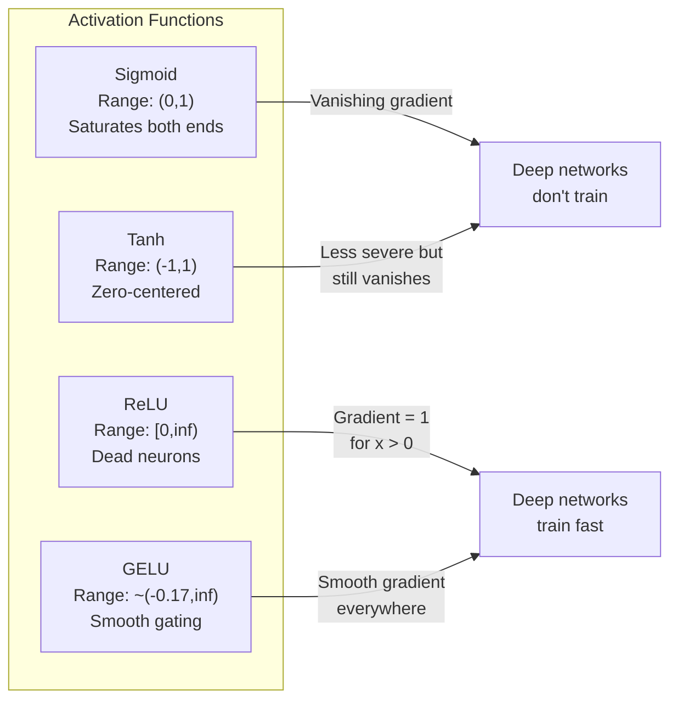
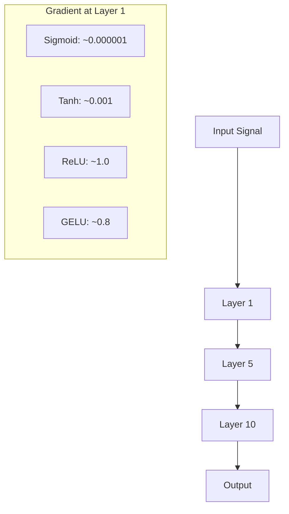
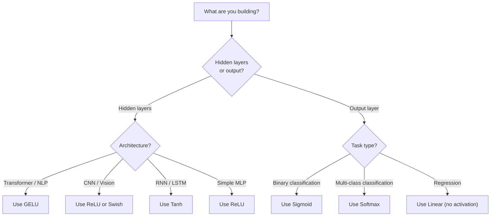

# 激活函式

> 少了非線性，你那個 100 層的網路只是一次花俏的矩陣相乘。激活函式是讓神經網路能用曲線思考的閘門。

**類型：** 實作
**程式語言：** Python
**先修單元：** 階段 3 · 03（反向傳播）
**時間：** 約 75 分鐘

## 學習目標

- 從零實作 sigmoid、tanh、ReLU、Leaky ReLU、GELU、Swish 與 softmax，以及它們的導數
- 用不同的激活函式量測訊號穿過 10 層以上網路後的激活值大小，藉此診斷梯度消失問題
- 偵測 ReLU 網路裡的死亡神經元，並解釋 GELU 為什麼不會落入這種失效模式
- 為給定的架構（transformer、CNN、RNN、輸出層）挑對激活函式

## 問題所在

把兩個線性轉換疊起來：y = W2(W1x + b1) + b2。展開它：y = W2W1x + W2b1 + b2。這就只是 y = Ax + c —— 一個線性轉換。線性層疊得再多，結果都塌回成一次矩陣相乘。你那個 100 層的網路，表達能力跟單一層一模一樣。

這不是理論上的趣談。它意味著一個純線性的深層網路真的學不會 XOR、分不出螺旋形資料集、認不出一張臉。少了激活函式，深度只是幻覺。

激活函式打破線性。它們把每一層的輸出扭過一個非線性函式，讓網路有能力彎折決策邊界、逼近任意函式，也才真的學得動。但激活函式挑錯，你的梯度就會消失到零（深層網路裡的 sigmoid）、爆炸到無限大（沒有小心初始化的無界激活函式），或是神經元永久死亡（帶大負偏差項的 ReLU）。激活函式的選擇，直接決定了你的網路到底學不學得起來。

## 核心概念

### 為什麼一定要有非線性

矩陣相乘是可以合成的。一個向量先乘矩陣 A 再乘矩陣 B，等同於直接乘 AB。這意味著疊十個線性層，數學上等於一個帶著一個大矩陣的線性層。那些參數、那些深度 —— 全都浪費掉了。你需要某個東西來打斷這條鏈。那就是激活函式的工作。

證明如下。一個線性層計算 f(x) = Wx + b。疊兩層：

```
Layer 1: h = W1 * x + b1
Layer 2: y = W2 * h + b2
```

代入：

```
y = W2 * (W1 * x + b1) + b2
y = (W2 * W1) * x + (W2 * b1 + b2)
y = A * x + c
```

一層而已。在層與層之間插入一個非線性激活函式 g()：

```
h = g(W1 * x + b1)
y = W2 * h + b2
```

現在代入就進行不下去了。W2 * g(W1 * x + b1) + b2 無法化簡成單一個線性轉換。網路能表示非線性函式了。每多一層帶激活函式的層，就多一分表達能力。

### Sigmoid

神經網路最早的激活函式。

```
sigmoid(x) = 1 / (1 + e^(-x))
```

輸出範圍：(0, 1)。平滑、可微，把任何實數映射成一個像機率的值。

它的導數：

```
sigmoid'(x) = sigmoid(x) * (1 - sigmoid(x))
```

這個導數的最大值是 0.25，出現在 x = 0。在反向傳播裡，梯度會逐層相乘。十層 sigmoid 意味著梯度最多被乘上 0.25 十次：

```
0.25^10 = 0.000000953674
```

不到原本訊號的百萬分之一。這就是梯度消失問題。前面幾層的梯度變得太小，權重幾乎不會更新。網路看起來在學 —— 損失在較後面的層有下降 —— 但最前面幾層是凍住的。深層 sigmoid 網路根本訓練不起來。

還有另一個問題：sigmoid 的輸出永遠是正的（0 到 1），這意味著權重上的梯度永遠同號。這會讓梯度下降走出鋸齒狀的路徑。

### Tanh

sigmoid 的零中心版本。

```
tanh(x) = (e^x - e^(-x)) / (e^x + e^(-x))
```

輸出範圍：(-1, 1)。零中心，消掉了鋸齒問題。

它的導數：

```
tanh'(x) = 1 - tanh(x)^2
```

導數最大值是 x = 0 時的 1.0 —— 比 sigmoid 好四倍。但梯度消失問題還在。輸入的正負值一大，導數就趨近於零。十層還是會把梯度壓爛，只是沒那麼兇。

### ReLU：突破

Rectified Linear Unit。2010 年由 Nair 與 Hinton 推廣到深度學習（這個函式本身可追到 Fukushima 1969 年的工作），它改變了一切。

```
relu(x) = max(0, x)
```

輸出範圍：[0, infinity)。導數簡單到不行：

```
relu'(x) = 1  if x > 0
            0  if x <= 0
```

正輸入不會有梯度消失。梯度恰好是 1，直接原封不動傳過去。這就是深層網路變得訓練得動的原因 —— ReLU 讓梯度大小跨層保持住。

但它有一種失效模式：死亡神經元問題（死亡 ReLU）。如果一個神經元的加權輸入永遠是負的（因為一個很大的負偏差項，或是不巧的權重初始化），它的輸出永遠是零、梯度永遠是零，也就永遠不會更新。它永久死亡了。實務上，ReLU 網路裡有 10-40% 的神經元可能在訓練途中死掉。

### Leaky ReLU

對付死亡神經元最簡單的修法。

```
leaky_relu(x) = x        if x > 0
                alpha * x if x <= 0
```

其中 alpha 是一個小常數，通常是 0.01。負的那一側有一個小斜率而不是零，所以死亡神經元還是收得到梯度訊號，有機會活回來。

### GELU：現代預設值

Gaussian Error Linear Unit。2016 年由 Hendrycks 與 Gimpel 提出。BERT、GPT 以及多數現代 transformer 的預設激活函式。

```
gelu(x) = x * Phi(x)
```

其中 Phi(x) 是標準常態分布的累積分布函式。實務上使用的近似式：

```
gelu(x) ~= 0.5 * x * (1 + tanh(sqrt(2/pi) * (x + 0.044715 * x^3)))
```

GELU 處處平滑、容許小的負值（不像 ReLU 直接硬切到零），而且有機率上的解讀：它按照每個輸入在高斯分布下為正的可能性來給它加權。這種平滑的閘控在 transformer 架構裡表現優於 ReLU，因為它提供更好的梯度流動，也完全避開了死亡神經元問題。

### Swish / SiLU

Ramachandran 等人在 2017 年透過自動化搜尋找到的自我閘控激活函式。

```
swish(x) = x * sigmoid(x)
```

Swish 的正式定義是 x * sigmoid(x)。Google 是在激活函式的空間上做自動化搜尋才發現它的 —— 一個神經網路在設計神經網路的零件。

跟 GELU 一樣，它平滑、非單調，也容許小的負值。差別很細微：Swish 用 sigmoid 做閘控，GELU 用高斯 CDF。實務上兩者表現幾乎一樣。Swish 用在 EfficientNet 與一些視覺模型上。GELU 則在語言模型裡佔主導。

### Softmax：輸出層的激活函式

不用在隱藏層。Softmax 把一串原始分數（logits）轉成一個機率分布。

```
softmax(x_i) = e^(x_i) / sum(e^(x_j) for all j)
```

每個輸出都在 0 與 1 之間。所有輸出加起來是 1。這讓它成為多類別分類的標準最後一層激活函式。最大的 logit 拿到最高的機率，但不同於 argmax，softmax 可微，而且保留了相對信心程度的資訊。

### 形狀比較



### 梯度流動比較



### 什麼時候用哪個激活函式



```figure
softmax-temperature
```

## 動手實作

### 步驟 1：實作所有激活函式與它們的導數

每個函式吃一個 float、回傳一個 float。每個導數函式吃同樣的輸入、回傳梯度。

```python
import math

def sigmoid(x):
    x = max(-500, min(500, x))
    return 1.0 / (1.0 + math.exp(-x))

def sigmoid_derivative(x):
    s = sigmoid(x)
    return s * (1 - s)

def tanh_act(x):
    return math.tanh(x)

def tanh_derivative(x):
    t = math.tanh(x)
    return 1 - t * t

def relu(x):
    return max(0.0, x)

def relu_derivative(x):
    return 1.0 if x > 0 else 0.0

def leaky_relu(x, alpha=0.01):
    return x if x > 0 else alpha * x

def leaky_relu_derivative(x, alpha=0.01):
    return 1.0 if x > 0 else alpha

def gelu(x):
    return 0.5 * x * (1 + math.tanh(math.sqrt(2 / math.pi) * (x + 0.044715 * x ** 3)))

def gelu_derivative(x):
    phi = 0.5 * (1 + math.erf(x / math.sqrt(2)))
    pdf = math.exp(-0.5 * x * x) / math.sqrt(2 * math.pi)
    return phi + x * pdf

def swish(x):
    return x * sigmoid(x)

def swish_derivative(x):
    s = sigmoid(x)
    return s + x * s * (1 - s)

def softmax(xs):
    max_x = max(xs)
    exps = [math.exp(x - max_x) for x in xs]
    total = sum(exps)
    return [e / total for e in exps]
```

### 步驟 2：把梯度死掉的地方畫出來

在 -5 到 5 之間取 100 個等距的點算梯度。印一張文字直方圖，顯示每個激活函式的梯度在哪裡接近零。

```python
def gradient_scan(name, derivative_fn, start=-5, end=5, n=100):
    step = (end - start) / n
    near_zero = 0
    healthy = 0
    for i in range(n):
        x = start + i * step
        g = derivative_fn(x)
        if abs(g) < 0.01:
            near_zero += 1
        else:
            healthy += 1
    pct_dead = near_zero / n * 100
    print(f"{name:15s}: {healthy:3d} healthy, {near_zero:3d} near-zero ({pct_dead:.0f}% dead zone)")

gradient_scan("Sigmoid", sigmoid_derivative)
gradient_scan("Tanh", tanh_derivative)
gradient_scan("ReLU", relu_derivative)
gradient_scan("Leaky ReLU", leaky_relu_derivative)
gradient_scan("GELU", gelu_derivative)
gradient_scan("Swish", swish_derivative)
```

### 步驟 3：梯度消失實驗

讓一個訊號分別用 sigmoid 與 ReLU 前向穿過 N 層。量測激活值的大小怎麼變化。

```python
import random

def vanishing_gradient_experiment(activation_fn, name, n_layers=10, n_inputs=5):
    random.seed(42)
    values = [random.gauss(0, 1) for _ in range(n_inputs)]

    print(f"\n{name} through {n_layers} layers:")
    for layer in range(n_layers):
        weights = [random.gauss(0, 1) for _ in range(n_inputs)]
        z = sum(w * v for w, v in zip(weights, values))
        activated = activation_fn(z)
        magnitude = abs(activated)
        bar = "#" * int(magnitude * 20)
        print(f"  Layer {layer+1:2d}: magnitude = {magnitude:.6f} {bar}")
        values = [activated] * n_inputs

vanishing_gradient_experiment(sigmoid, "Sigmoid")
vanishing_gradient_experiment(relu, "ReLU")
vanishing_gradient_experiment(gelu, "GELU")
```

### 步驟 4：死亡神經元偵測器

建一個 ReLU 網路，把隨機輸入送進去，數數看有幾個神經元從來沒有觸發。

```python
def dead_neuron_detector(n_inputs=5, hidden_size=20, n_samples=1000):
    random.seed(0)
    weights = [[random.gauss(0, 1) for _ in range(n_inputs)] for _ in range(hidden_size)]
    biases = [random.gauss(0, 1) for _ in range(hidden_size)]

    fire_counts = [0] * hidden_size

    for _ in range(n_samples):
        inputs = [random.gauss(0, 1) for _ in range(n_inputs)]
        for neuron_idx in range(hidden_size):
            z = sum(w * x for w, x in zip(weights[neuron_idx], inputs)) + biases[neuron_idx]
            if relu(z) > 0:
                fire_counts[neuron_idx] += 1

    dead = sum(1 for c in fire_counts if c == 0)
    rarely_fire = sum(1 for c in fire_counts if 0 < c < n_samples * 0.05)
    healthy = hidden_size - dead - rarely_fire

    print(f"\nDead Neuron Report ({hidden_size} neurons, {n_samples} samples):")
    print(f"  Dead (never fired):     {dead}")
    print(f"  Barely alive (<5%):     {rarely_fire}")
    print(f"  Healthy:                {healthy}")
    print(f"  Dead neuron rate:       {dead/hidden_size*100:.1f}%")

    for i, c in enumerate(fire_counts):
        status = "DEAD" if c == 0 else "WEAK" if c < n_samples * 0.05 else "OK"
        bar = "#" * (c * 40 // n_samples)
        print(f"  Neuron {i:2d}: {c:4d}/{n_samples} fires [{status:4s}] {bar}")

dead_neuron_detector()
```

### 步驟 5：訓練比較 —— Sigmoid vs ReLU vs GELU

用三種不同的激活函式，在圓形資料集（圓內的點 = 類別 1，圓外 = 類別 0）上訓練同一個兩層網路。比較收斂速度。

```python
def make_circle_data(n=200, seed=42):
    random.seed(seed)
    data = []
    for _ in range(n):
        x = random.uniform(-2, 2)
        y = random.uniform(-2, 2)
        label = 1.0 if x * x + y * y < 1.5 else 0.0
        data.append(([x, y], label))
    return data


class ActivationNetwork:
    def __init__(self, activation_fn, activation_deriv, hidden_size=8, lr=0.1):
        random.seed(0)
        self.act = activation_fn
        self.act_d = activation_deriv
        self.lr = lr
        self.hidden_size = hidden_size

        self.w1 = [[random.gauss(0, 0.5) for _ in range(2)] for _ in range(hidden_size)]
        self.b1 = [0.0] * hidden_size
        self.w2 = [random.gauss(0, 0.5) for _ in range(hidden_size)]
        self.b2 = 0.0

    def forward(self, x):
        self.x = x
        self.z1 = []
        self.h = []
        for i in range(self.hidden_size):
            z = self.w1[i][0] * x[0] + self.w1[i][1] * x[1] + self.b1[i]
            self.z1.append(z)
            self.h.append(self.act(z))

        self.z2 = sum(self.w2[i] * self.h[i] for i in range(self.hidden_size)) + self.b2
        self.out = sigmoid(self.z2)
        return self.out

    def backward(self, target):
        error = self.out - target
        d_out = error * self.out * (1 - self.out)

        for i in range(self.hidden_size):
            d_h = d_out * self.w2[i] * self.act_d(self.z1[i])
            self.w2[i] -= self.lr * d_out * self.h[i]
            for j in range(2):
                self.w1[i][j] -= self.lr * d_h * self.x[j]
            self.b1[i] -= self.lr * d_h
        self.b2 -= self.lr * d_out

    def train(self, data, epochs=200):
        losses = []
        for epoch in range(epochs):
            total_loss = 0
            correct = 0
            for x, y in data:
                pred = self.forward(x)
                self.backward(y)
                total_loss += (pred - y) ** 2
                if (pred >= 0.5) == (y >= 0.5):
                    correct += 1
            avg_loss = total_loss / len(data)
            accuracy = correct / len(data) * 100
            losses.append(avg_loss)
            if epoch % 50 == 0 or epoch == epochs - 1:
                print(f"    Epoch {epoch:3d}: loss={avg_loss:.4f}, accuracy={accuracy:.1f}%")
        return losses


data = make_circle_data()

configs = [
    ("Sigmoid", sigmoid, sigmoid_derivative),
    ("ReLU", relu, relu_derivative),
    ("GELU", gelu, gelu_derivative),
]

results = {}
for name, act_fn, act_d_fn in configs:
    print(f"\n=== Training with {name} ===")
    net = ActivationNetwork(act_fn, act_d_fn, hidden_size=8, lr=0.1)
    losses = net.train(data, epochs=200)
    results[name] = losses

print("\n=== Final Loss Comparison ===")
for name, losses in results.items():
    print(f"  {name:10s}: start={losses[0]:.4f} -> end={losses[-1]:.4f} (improvement: {(1 - losses[-1]/losses[0])*100:.1f}%)")
```

## 框架應用

PyTorch 把上面這些都提供了，函式式與模組式兩種形式都有：

```python
import torch
import torch.nn as nn
import torch.nn.functional as F

x = torch.randn(4, 10)

relu_out = F.relu(x)
gelu_out = F.gelu(x)
sigmoid_out = torch.sigmoid(x)
swish_out = F.silu(x)

logits = torch.randn(4, 5)
probs = F.softmax(logits, dim=1)

model = nn.Sequential(
    nn.Linear(10, 64),
    nn.GELU(),
    nn.Linear(64, 32),
    nn.GELU(),
    nn.Linear(32, 5),
)
```

transformer 的隱藏層：GELU。CNN 的隱藏層：ReLU。分類任務的輸出層：softmax。迴歸任務的輸出層：不用（線性）。輸出機率的輸出層：sigmoid。就這樣。先從這些預設值開始。只有在你手上有證據時才改。

RNN 與 LSTM 的隱藏狀態用 tanh、閘門用 sigmoid，但如果你今天是從零打造，你大概不會用 RNN。如果你的 ReLU 網路裡神經元在死掉，換成 GELU。除非有特定理由，不要伸手去拿 Leaky ReLU —— GELU 解掉了死亡神經元問題，梯度流動也更好。

## 產出交付

本單元會產出：
- `outputs/prompt-activation-selector.md` —— 一個可重複使用的提示詞，幫你為任何架構挑出對的激活函式

## 練習

1. 實作 Parametric ReLU（PReLU），讓負半邊的斜率 alpha 變成可學習的參數。在圓形資料集上訓練它，並跟固定的 Leaky ReLU 比較。

2. 把梯度消失實驗改成 50 層而不是 10 層。把 sigmoid、tanh、ReLU 與 GELU 在每一層的大小畫出來。每種激活函式的訊號分別在第幾層實際上歸零？

3. 實作 ELU（Exponential Linear Unit）：elu(x) = x if x > 0, alpha * (e^x - 1) if x <= 0。在同一個網路上比較它與 ReLU 的死亡神經元比例。

4. 做一個「梯度健康監測器」，在訓練過程中跑：每個 epoch 算出每一層的平均梯度大小。任何一層的梯度掉到 0.001 以下或超過 100 時就印出警告。

5. 把訓練比較改用單元 01 的 XOR 資料集，而不是圓形資料集。哪個激活函式在 XOR 上收斂最快？為什麼這跟圓形資料集的結果不同？

## 關鍵術語

| 術語 | 大家怎麼說 | 實際上是什麼 |
|------|----------------|----------------------|
| 激活函式 | 「非線性的那部分」 | 套用在每個神經元輸出上的函式，用來打破線性，讓網路學得出非線性的映射 |
| 梯度消失 | 「梯度在深層網路裡不見了」 | 當激活函式的導數小於 1，梯度會逐層指數縮小，使前面幾層訓練不動 |
| 梯度爆炸 | 「梯度炸開了」 | 當有效的乘數大於 1，梯度會逐層指數放大，導致訓練不穩定 |
| 死亡神經元 | 「一個停止學習的神經元」 | 一個輸入永久為負的 ReLU 神經元，輸出零、梯度也是零 |
| Sigmoid | 「把數值壓到 0 到 1」 | 邏輯函式 1/(1+e^-x)，歷史上很重要，但在深層網路裡會造成梯度消失 |
| ReLU | 「把負值切成零」 | max(0, x) —— 靠保住梯度大小讓深度學習變得實用的那個激活函式 |
| GELU | 「transformer 的激活函式」 | Gaussian Error Linear Unit，一個平滑的激活函式，按輸入為正的機率給它加權 |
| Swish/SiLU | 「自我閘控的 ReLU」 | x * sigmoid(x)，透過自動化搜尋發現，用在 EfficientNet |
| Softmax | 「把分數變成機率」 | 把一串 logits 正規化成機率分布，所有值都落在 (0,1) 且總和為 1 |
| Leaky ReLU | 「不會死掉的 ReLU」 | max(alpha*x, x)，其中 alpha 很小（0.01），靠容許小的負梯度來防止死亡神經元 |
| 飽和 | 「sigmoid 平掉的那一段」 | 激活函式導數趨近於零的區間，梯度流動會被卡住 |
| Logit | 「softmax 之前的原始分數」 | 最後一層在套上 softmax 或 sigmoid 之前的未正規化輸出 |

## 延伸閱讀

- Nair & Hinton, "Rectified Linear Units Improve Restricted Boltzmann Machines" (2010) —— 提出 ReLU、讓深層網路訓練得起來的那篇論文
- Hendrycks & Gimpel, "Gaussian Error Linear Units (GELUs)" (2016) —— 提出了後來成為 transformer 預設值的那個激活函式
- Ramachandran et al., "Searching for Activation Functions" (2017) —— 用自動化搜尋找出 Swish，展示激活函式的設計也能自動化
- Glorot & Bengio, "Understanding the difficulty of training deep feedforward neural networks" (2010) —— 診斷出梯度消失／梯度爆炸並提出 Xavier 初始化的那篇論文
- Goodfellow, Bengio, Courville, "Deep Learning" Chapter 6.3 (https://www.deeplearningbook.org/) —— 對隱藏單元與激活函式的嚴謹論述
