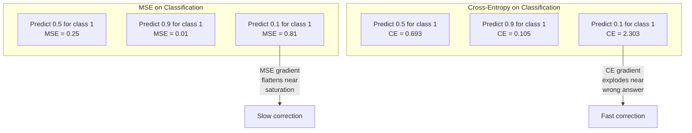
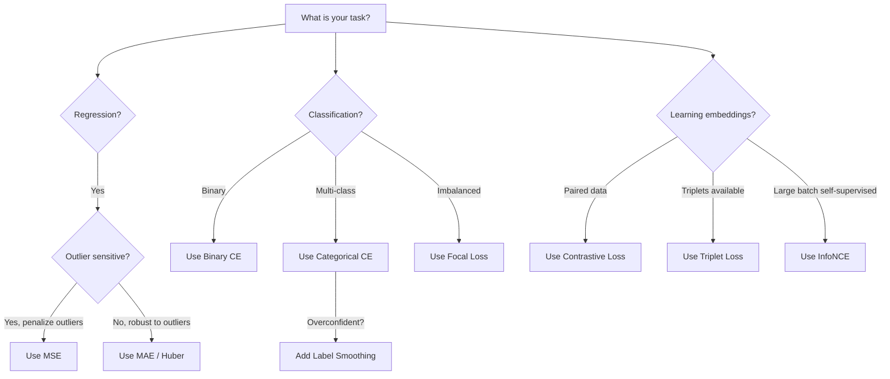
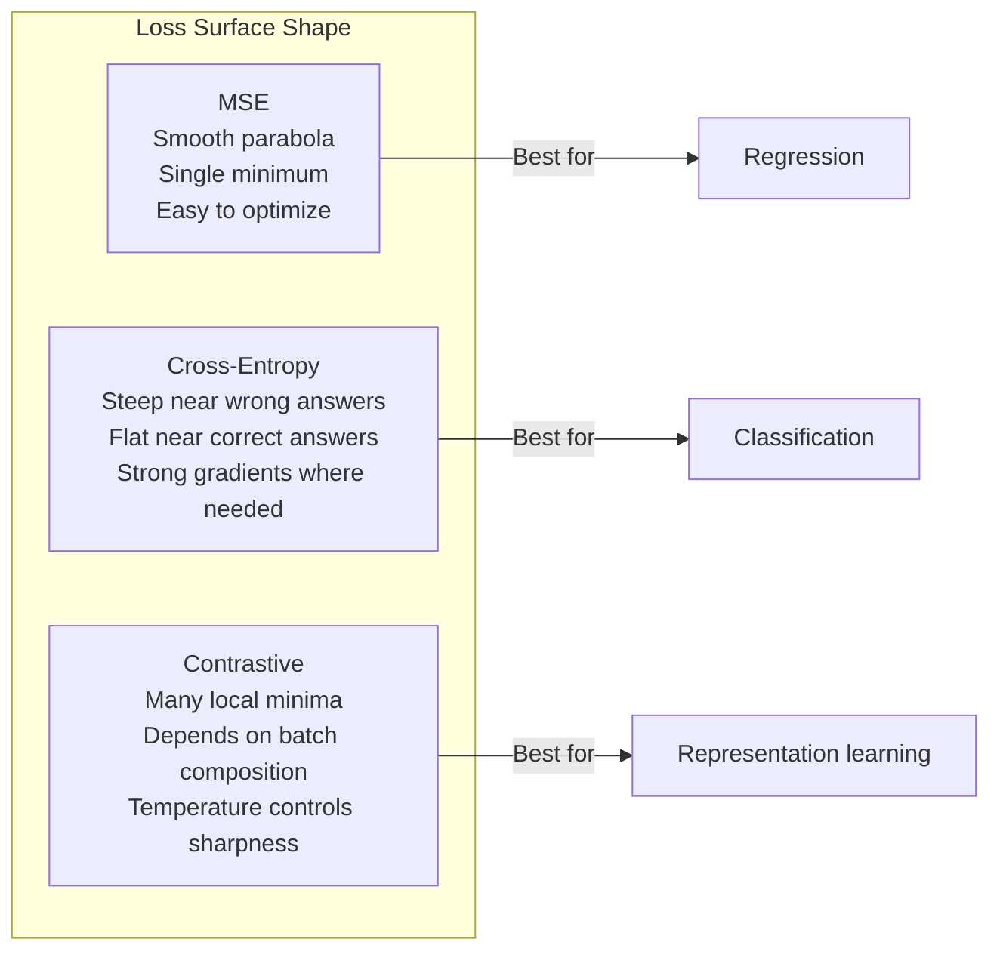

# 損失函式

> 你的網路給出一個預測。真實答案說不對。到底錯得多離譜？那個數字就是損失。挑錯損失函式，你的模型就會徹底朝著錯誤的目標最佳化。

**類型：** 實作
**程式語言：** Python
**先修單元：** 階段 3 · 04（激活函式）
**時間：** 約 75 分鐘

## 學習目標

- 從零實作 MSE、二元交叉熵、類別交叉熵與對比損失（InfoNCE），連梯度一起寫出來
- 用「所有輸入都預測 0.5」這個失敗模式，說明為什麼 MSE 不適合分類
- 把標籤平滑套到交叉熵上，並描述它如何避免模型過度自信
- 為迴歸、二元分類、多類別分類與嵌入學習任務各挑出正確的損失函式

## 問題所在

一個在分類問題上最小化 MSE 的模型，會對每個輸入都自信地預測 0.5。它確實在最小化損失。它同時也毫無用處。

損失函式是你的模型唯一真正在最佳化的東西。不是準確率。不是 F1 分數。也不是你回報給主管的那個指標。最佳化器拿損失函式的梯度去調整權重，只為了讓那個數字變小。如果損失函式沒有捕捉到你在意的事，模型就會找出數學上最省力的方式來滿足它，而那個方式幾乎永遠不是你想要的。

舉一個具體的例子。你有一個二元分類任務，兩個類別各半。你用 MSE 當損失。模型對每一個輸入都預測 0.5。平均 MSE 是 0.25，這是在完全沒學到任何東西的前提下能達到的最小值。模型的鑑別能力是零，但嚴格說來它已經把你的損失函式最小化了。換成交叉熵，同一個模型就被迫把預測推向 0 或 1，因為 -log(0.5) = 0.693 是很糟的損失，而 -log(0.99) = 0.01 則會獎勵自信且正確的預測。損失函式的選擇，就是「會學習的模型」與「鑽指標漏洞的模型」之間的差別。

情況還會更糟。在自監督學習裡，你連標籤都沒有。對比損失（contrastive loss）完全定義了學習訊號：什麼算相似、什麼算不同、以及模型該多用力把它們推開。對比損失搞錯，你的嵌入就會塌縮到單一個點 —— 每個輸入都映射到同一個向量。技術上損失是零。實際上一文不值。

## 核心概念

### 均方誤差（MSE）

迴歸的預設選擇。算出預測與目標之間的平方差，再對所有樣本取平均。

```
MSE = (1/n) * sum((y_pred - y_true)^2)
```

平方為什麼重要：它會以二次方的力度懲罰大誤差。誤差 2 的代價是誤差 1 的 4 倍。誤差 10 的代價是 100 倍。這讓 MSE 對離群值很敏感 —— 單一個錯得離譜的預測就能主宰整個損失。

實際的數字：如果你的模型在預測房價，大部分房子只差 $10,000，但某一棟豪宅差了 $200,000，MSE 會非常積極地想修好那一棟豪宅，代價可能是傷害其他 99 棟房子的表現。

MSE 對某個預測的梯度是：

```
dMSE/dy_pred = (2/n) * (y_pred - y_true)
```

對誤差是線性的。誤差越大，梯度越大。這對迴歸是優點（大誤差需要大幅修正），對分類卻是缺陷（你想以指數方式懲罰自信但答錯的預測，而不是線性）。

### 交叉熵損失

分類用的損失函式。根源在資訊理論 —— 它衡量預測的機率分布與真實分布之間的散度。

**二元交叉熵（BCE）：**

```
BCE = -(y * log(p) + (1 - y) * log(1 - p))
```

其中 y 是真實標籤（0 或 1），p 是預測出的機率。

-log(p) 為什麼有效：當真實標籤是 1、你預測 p = 0.99 時，損失是 -log(0.99) = 0.01。當你預測 p = 0.01 時，損失是 -log(0.01) = 4.6。那個 460 倍的差距就是交叉熵有效的原因。它會狠狠懲罰自信卻答錯的預測，而對自信且正確的預測幾乎不罰。

梯度講的是同一個故事：

```
dBCE/dp = -(y/p) + (1-y)/(1-p)
```

當 y = 1 而 p 接近零時，梯度是 -1/p，會趨向負無限大。模型拿到一個巨大的梯度訊號去修正自己的錯誤。當 p 接近 1 時，梯度極小。已經對了，沒什麼要修的。

**類別交叉熵：**

用於目標以 one-hot 編碼的多類別分類。

```
CCE = -sum(y_i * log(p_i))
```

只有真實類別會貢獻損失（因為其他所有 y_i 都是零）。如果有 10 個類別，而正確類別拿到 0.1 的機率（等於亂猜），損失是 -log(0.1) = 2.3。如果正確類別拿到 0.9，損失是 -log(0.9) = 0.105。模型於是學會把機率質量集中在正確答案上。

### 為什麼 MSE 用在分類上會失敗



當預測接近 0 或 1 時，MSE 的梯度會變平（因為 sigmoid 飽和）。交叉熵的梯度剛好補償掉這件事 —— -log 抵消了 sigmoid 的平坦區，正好在最需要的地方給出強梯度。

### 標籤平滑

標準的 one-hot 標籤說的是「這 100% 是類別 3，其他全都 0%」。這是很強的斷言。標籤平滑（label smoothing）把它放軟：

```
smooth_label = (1 - alpha) * one_hot + alpha / num_classes
```

當 alpha = 0.1、類別數為 10 時：目標從 [0, 0, 1, 0, ...] 變成 [0.01, 0.01, 0.91, 0.01, ...]。模型追的目標是 0.91，而不是 1.0。

這為什麼有效：一個想透過 softmax 輸出剛好 1.0 的模型，得把 logits 推到無限大。這會造成過度自信、傷害泛化能力，也讓模型在分布偏移下變得脆弱。標籤平滑把目標上限壓在 0.9（alpha=0.1 時），讓 logits 留在合理範圍內。GPT 與大多數現代模型都用標籤平滑或它的等價做法。

### 對比損失

沒有標籤。沒有類別。只有一對一對的輸入，和一個問題：這兩個是相似還是不同？

**SimCLR 式的對比損失（NT-Xent／InfoNCE）：**

拿一張圖片，做出它的兩個增強視角（裁切、旋轉、色彩抖動）。這是「正樣本對」—— 它們的嵌入應該相似。批次裡其他每一張圖片都構成「負樣本對」—— 它們的嵌入應該不同。

```
L = -log(exp(sim(z_i, z_j) / tau) / sum(exp(sim(z_i, z_k) / tau)))
```

其中 sim() 是餘弦相似度，z_i 與 z_j 是正樣本對，總和跑過所有負樣本，而 tau（溫度）控制分布有多尖銳。溫度越低 = 負樣本越「硬」= 分離得越激烈。

實際的數字：批次大小 256 意味著每個正樣本對有 255 個負樣本。溫度 tau = 0.07（SimCLR 的預設值）。這個損失長得像是在相似度上做 softmax —— 它要的是正樣本對的相似度在全部 256 個選項中最高。

**三元組損失（triplet loss）：**

吃三個輸入：anchor、positive（同類別）、negative（不同類別）。

```
L = max(0, d(anchor, positive) - d(anchor, negative) + margin)
```

margin（通常是 0.2 到 1.0）強制正負距離之間至少要有一段間隔。如果負樣本本來就離得夠遠，損失就是零 —— 沒有梯度，沒有更新。這讓訓練變有效率，但需要小心地做三元組挖掘（挑出貼近 anchor 的困難負樣本）。

### Focal Loss

給不平衡資料集用的。標準交叉熵對所有分類正確的樣本一視同仁。Focal Loss（焦點損失）則調降簡單樣本的權重：

```
FL = -alpha * (1 - p_t)^gamma * log(p_t)
```

其中 p_t 是真實類別的預測機率，gamma 控制聚焦程度。gamma = 0 時，這就是標準交叉熵。gamma = 2 時（預設值）：

- 簡單樣本（p_t = 0.9）：權重 = (0.1)^2 = 0.01。實質上被忽略。
- 困難樣本（p_t = 0.1）：權重 = (0.9)^2 = 0.81。完整的梯度訊號。

Focal Loss 由 Lin 等人為物件偵測提出，在那個場景裡 99% 的候選區域都是背景（簡單負樣本）。少了 Focal Loss，模型會被簡單背景樣本淹沒，永遠學不會偵測物件。有了它，模型就能把容量集中在真正重要的困難、模稜兩可的案例上。

### 損失函式決策樹



### 損失地景



```figure
cross-entropy-loss
```

## 動手實作

### 步驟 1：MSE 與它的梯度

```python
def mse(predictions, targets):
    n = len(predictions)
    total = 0.0
    for p, t in zip(predictions, targets):
        total += (p - t) ** 2
    return total / n

def mse_gradient(predictions, targets):
    n = len(predictions)
    grads = []
    for p, t in zip(predictions, targets):
        grads.append(2.0 * (p - t) / n)
    return grads
```

### 步驟 2：二元交叉熵

log(0) 的問題是真實存在的。如果模型對一個正樣本剛好預測 0，log(0) 就是負無限大。夾住數值（clipping）可以避免這件事。

```python
import math

def binary_cross_entropy(predictions, targets, eps=1e-15):
    n = len(predictions)
    total = 0.0
    for p, t in zip(predictions, targets):
        p_clipped = max(eps, min(1 - eps, p))
        total += -(t * math.log(p_clipped) + (1 - t) * math.log(1 - p_clipped))
    return total / n

def bce_gradient(predictions, targets, eps=1e-15):
    grads = []
    for p, t in zip(predictions, targets):
        p_clipped = max(eps, min(1 - eps, p))
        grads.append(-(t / p_clipped) + (1 - t) / (1 - p_clipped))
    return grads
```

### 步驟 3：搭配 Softmax 的類別交叉熵

Softmax 把原始 logits 轉成機率。接著我們對 one-hot 目標算交叉熵。

```python
def softmax(logits):
    max_val = max(logits)
    exps = [math.exp(x - max_val) for x in logits]
    total = sum(exps)
    return [e / total for e in exps]

def categorical_cross_entropy(logits, target_index, eps=1e-15):
    probs = softmax(logits)
    p = max(eps, probs[target_index])
    return -math.log(p)

def cce_gradient(logits, target_index):
    probs = softmax(logits)
    grads = list(probs)
    grads[target_index] -= 1.0
    return grads
```

softmax 加交叉熵的梯度會漂亮地簡化：對真實類別就是（預測機率 - 1），對其他所有類別就是（預測機率）。這個優雅的簡化不是巧合 —— 它正是 softmax 與交叉熵成對出現的原因。

### 步驟 4：標籤平滑

```python
def label_smoothed_cce(logits, target_index, num_classes, alpha=0.1, eps=1e-15):
    probs = softmax(logits)
    loss = 0.0
    for i in range(num_classes):
        if i == target_index:
            smooth_target = 1.0 - alpha + alpha / num_classes
        else:
            smooth_target = alpha / num_classes
        p = max(eps, probs[i])
        loss += -smooth_target * math.log(p)
    return loss
```

### 步驟 5：對比損失（簡化版 InfoNCE）

```python
def cosine_similarity(a, b):
    dot = sum(x * y for x, y in zip(a, b))
    norm_a = math.sqrt(sum(x * x for x in a))
    norm_b = math.sqrt(sum(x * x for x in b))
    if norm_a < 1e-10 or norm_b < 1e-10:
        return 0.0
    return dot / (norm_a * norm_b)

def contrastive_loss(anchor, positive, negatives, temperature=0.07):
    sim_pos = cosine_similarity(anchor, positive) / temperature
    sim_negs = [cosine_similarity(anchor, neg) / temperature for neg in negatives]

    max_sim = max(sim_pos, max(sim_negs)) if sim_negs else sim_pos
    exp_pos = math.exp(sim_pos - max_sim)
    exp_negs = [math.exp(s - max_sim) for s in sim_negs]
    total_exp = exp_pos + sum(exp_negs)

    return -math.log(max(1e-15, exp_pos / total_exp))
```

### 步驟 6：分類任務上的 MSE vs 交叉熵

用兩種損失函式分別訓練單元 04 的同一個網路（圓形資料集）。看著交叉熵收斂得更快。

```python
import random

def sigmoid(x):
    x = max(-500, min(500, x))
    return 1.0 / (1.0 + math.exp(-x))

def make_circle_data(n=200, seed=42):
    random.seed(seed)
    data = []
    for _ in range(n):
        x = random.uniform(-2, 2)
        y = random.uniform(-2, 2)
        label = 1.0 if x * x + y * y < 1.5 else 0.0
        data.append(([x, y], label))
    return data


class LossComparisonNetwork:
    def __init__(self, loss_type="bce", hidden_size=8, lr=0.1):
        random.seed(0)
        self.loss_type = loss_type
        self.lr = lr
        self.hidden_size = hidden_size

        self.w1 = [[random.gauss(0, 0.5) for _ in range(2)] for _ in range(hidden_size)]
        self.b1 = [0.0] * hidden_size
        self.w2 = [random.gauss(0, 0.5) for _ in range(hidden_size)]
        self.b2 = 0.0

    def forward(self, x):
        self.x = x
        self.z1 = []
        self.h = []
        for i in range(self.hidden_size):
            z = self.w1[i][0] * x[0] + self.w1[i][1] * x[1] + self.b1[i]
            self.z1.append(z)
            self.h.append(max(0.0, z))

        self.z2 = sum(self.w2[i] * self.h[i] for i in range(self.hidden_size)) + self.b2
        self.out = sigmoid(self.z2)
        return self.out

    def backward(self, target):
        if self.loss_type == "mse":
            d_loss = 2.0 * (self.out - target)
        else:
            eps = 1e-15
            p = max(eps, min(1 - eps, self.out))
            d_loss = -(target / p) + (1 - target) / (1 - p)

        d_sigmoid = self.out * (1 - self.out)
        d_out = d_loss * d_sigmoid

        for i in range(self.hidden_size):
            d_relu = 1.0 if self.z1[i] > 0 else 0.0
            d_h = d_out * self.w2[i] * d_relu
            self.w2[i] -= self.lr * d_out * self.h[i]
            for j in range(2):
                self.w1[i][j] -= self.lr * d_h * self.x[j]
            self.b1[i] -= self.lr * d_h
        self.b2 -= self.lr * d_out

    def compute_loss(self, pred, target):
        if self.loss_type == "mse":
            return (pred - target) ** 2
        else:
            eps = 1e-15
            p = max(eps, min(1 - eps, pred))
            return -(target * math.log(p) + (1 - target) * math.log(1 - p))

    def train(self, data, epochs=200):
        losses = []
        for epoch in range(epochs):
            total_loss = 0.0
            correct = 0
            for x, y in data:
                pred = self.forward(x)
                self.backward(y)
                total_loss += self.compute_loss(pred, y)
                if (pred >= 0.5) == (y >= 0.5):
                    correct += 1
            avg_loss = total_loss / len(data)
            accuracy = correct / len(data) * 100
            losses.append((avg_loss, accuracy))
            if epoch % 50 == 0 or epoch == epochs - 1:
                print(f"    Epoch {epoch:3d}: loss={avg_loss:.4f}, accuracy={accuracy:.1f}%")
        return losses
```

## 框架應用

PyTorch 提供所有標準損失函式，數值穩定性都已內建：

```python
import torch
import torch.nn as nn
import torch.nn.functional as F

predictions = torch.tensor([0.9, 0.1, 0.7], requires_grad=True)
targets = torch.tensor([1.0, 0.0, 1.0])

mse_loss = F.mse_loss(predictions, targets)
bce_loss = F.binary_cross_entropy(predictions, targets)

logits = torch.randn(4, 10)
labels = torch.tensor([3, 7, 1, 9])
ce_loss = F.cross_entropy(logits, labels)
ce_smooth = F.cross_entropy(logits, labels, label_smoothing=0.1)
```

請用 `F.cross_entropy`（而不是 `F.nll_loss` 再自己手動做 softmax）。它把 log-softmax 與負對數概似合併成一個數值穩定的運算。分開套用 softmax 再取對數比較不穩定 —— 你會在大指數相減時損失精度。

至於對比學習，大多數團隊用的是自己的實作，或像 `lightly`、`pytorch-metric-learning` 這樣的函式庫。核心迴圈永遠一樣：算出兩兩之間的相似度、在正負樣本上做 softmax、反向傳播。

## 產出交付

這一課會產出：
- `outputs/prompt-loss-function-selector.md` —— 一個可重複使用的提示詞，用來挑選正確的損失函式
- `outputs/prompt-loss-debugger.md` —— 一個診斷用的提示詞，適用於損失曲線看起來不對的時候

## 練習

1. 實作 Huber 損失（smooth L1 loss）：小誤差時像 MSE，大誤差時像平均絕對誤差（MAE）。訓練一個預測 y = sin(x) 的迴歸網路，並在 5% 的訓練目標被加上隨機雜訊（離群值）的情況下比較 MSE 與 Huber。比較最終的測試誤差。

2. 在二元分類的訓練迴圈裡加上 Focal Loss。造一個不平衡的資料集（90% 類別 0、10% 類別 1）。跑 200 個 epoch 之後，比較標準 BCE 與 Focal Loss（gamma=2）在少數類別上的召回率。

3. 實作帶半困難負樣本挖掘（semi-hard negative mining）的三元組損失。為 5 個類別產生 2D 嵌入資料。對每個 anchor，找出仍然比 positive 更遠的最困難負樣本（semi-hard）。把收斂情況和隨機挑三元組的做法比較。

4. 跑一次 MSE vs 交叉熵的比較，但在訓練過程中追蹤每一層的梯度大小。畫出每個 epoch 的平均梯度範數。驗證在模型最不確定的早期 epoch 裡，交叉熵確實產生較大的梯度。

5. 實作 KL 散度損失，並驗證當真實分布是 one-hot 時，最小化 KL(true || predicted) 給出的梯度與交叉熵相同。接著試試軟目標（像知識蒸餾那樣），此時的「真實」分布來自教師模型的 softmax 輸出。

## 關鍵術語

| 術語 | 大家怎麼說 | 實際上是什麼 |
|------|----------------|----------------------|
| 損失函式 | 「模型錯得多離譜」 | 一個可微分的函式，把預測與目標映射成一個純量，最佳化器要把它最小化 |
| MSE | 「平均平方誤差」 | 預測與目標之間平方差的平均；以二次方的力度懲罰大誤差 |
| 交叉熵 | 「那個分類損失」 | 用 -log(p) 衡量預測機率分布與真實分布之間的散度 |
| 二元交叉熵 | 「BCE」 | 兩個類別版本的交叉熵：-(y*log(p) + (1-y)*log(1-p)) |
| 標籤平滑 | 「把目標放軟」 | 把硬性的 0／1 目標換成軟數值（例如 0.1／0.9），以避免過度自信並改善泛化 |
| 對比損失 | 「相近的拉一起，不同的推開」 | 一種損失，透過讓相似對在嵌入空間靠近、不相似對遠離來學習表示 |
| InfoNCE | 「CLIP／SimCLR 那個損失」 | 在相似度分數上做溫度縮放與正規化的交叉熵；把對比學習當成分類問題處理 |
| Focal Loss | 「治不平衡資料的藥」 | 用 (1-p_t)^gamma 加權的交叉熵，調降簡單樣本的權重，聚焦在困難樣本上 |
| 三元組損失 | 「anchor-positive-negative」 | 在嵌入空間裡，把 anchor 拉近 positive、至少比 negative 近一個 margin |
| 溫度 | 「尖銳度旋鈕」 | 除在 logits／相似度上的一個純量，控制最終分布有多尖；越低越尖 |

## 延伸閱讀

- Lin et al., "Focal Loss for Dense Object Detection" (2017) —— 提出 Focal Loss，用來處理物件偵測中極端的類別不平衡（RetinaNet）
- Chen et al., "A Simple Framework for Contrastive Learning of Visual Representations" (SimCLR, 2020) —— 用 NT-Xent 損失定義了現代對比學習的流程
- Szegedy et al., "Rethinking the Inception Architecture" (2016) —— 提出標籤平滑作為一種正則化技巧，現在在多數大型模型裡已是標準做法
- Hinton et al., "Distilling the Knowledge in a Neural Network" (2015) —— 用軟目標與 KL 散度做知識蒸餾，是模型壓縮的奠基之作
