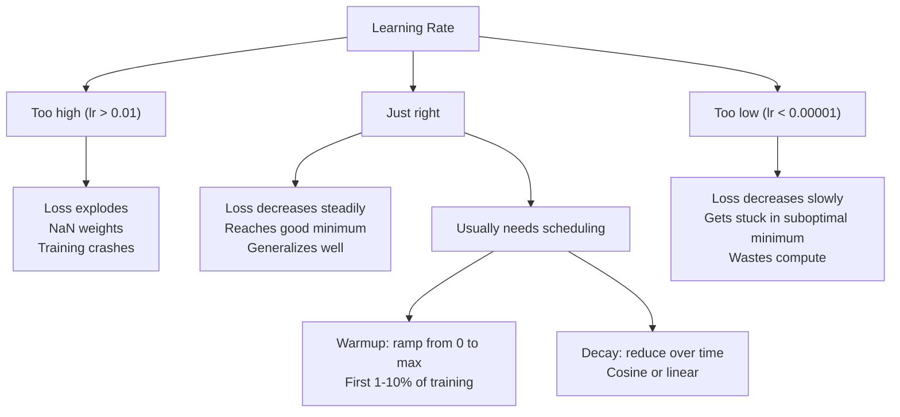
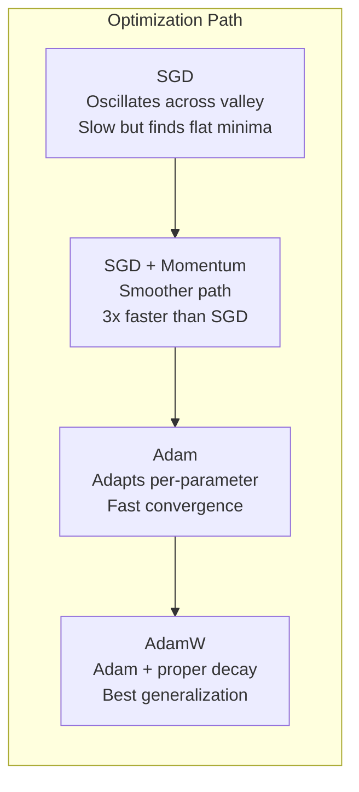
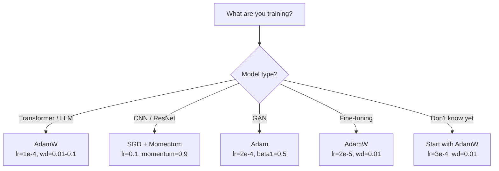

# 最佳化器

> 梯度下降告訴你該往哪個方向走，卻完全沒說要走多遠、走多快。SGD 是指北針，Adam 是帶路況資訊的 GPS。

**類型：** 實作
**程式語言：** Python
**先修單元：** 階段 3 · 05（損失函式）
**時間：** 約 75 分鐘

## 學習目標

- 用 Python 從零實作 SGD、帶動量的 SGD、Adam 與 AdamW 最佳化器
- 說明 Adam 的偏差校正如何在訓練初期補償零初始化的動量估計
- 在同一個任務上示範 AdamW 為何比「Adam 加 L2 正則化」泛化得更好
- 為 Transformer、CNN、GAN 與微調各自挑出合適的最佳化器與預設超參數

## 問題所在

你算好了梯度。你知道第 4,721 號權重應該減少 0.003 才能降低損失。但 0.003 的單位是什麼？用什麼尺度縮放過？而且第 1 步和第 1,000 步該挪動一樣的量嗎？

原始版梯度下降在每一步、對每個參數都套用同一個學習率：w = w - lr * gradient。這會製造出三個問題，讓實務上訓練神經網路變得很痛苦。

第一，震盪。損失地景很少長得像一只平滑的碗，它更像一條狹長的山谷。梯度指的是橫越山谷的方向（陡的方向），而不是沿著山谷走的方向（緩的方向）。梯度下降在窄的那個維度上來回彈跳，而在真正有用的那個方向上只前進了一點點。這個現象你見過：損失先快速下降，然後就停在原地 —— 不是因為模型收斂了，而是因為它在震盪。

第二，「所有參數共用一個學習率」本身就是錯的。有些權重需要大幅更新（它們還在擬合不足的早期階段），有些需要極小的更新（它們已經接近自己的最佳值）。適合前者的學習率會毀掉後者，反之亦然。

第三，鞍點。在高維空間裡，損失地景有大片平坦區域，梯度在那裡趨近於零。原始版 SGD 只能以梯度的速度在裡面爬行，而那速度實際上等於零。模型看起來卡住了。它並沒有卡住 —— 它只是在一片平坦區域裡，而另一側還有可用的下坡。但 SGD 沒有任何機制能推它一把。

Adam 一次解決這三件事。它為每個參數維護兩個移動平均 —— 梯度的平均（動量，處理震盪）以及梯度平方的平均（自適應學習率，處理不同的尺度）。再加上針對前幾步的偏差校正，你就得到一個用預設超參數就能應付 80% 問題的最佳化器。這一單元從零把它做出來，好讓你確切知道它在剩下那 20% 上何時會失效、又為什麼失效。

## 核心概念

### 隨機梯度下降 (SGD)

最簡單的最佳化器。在一個小批次上算出梯度，然後往反方向踏一步。

```
w = w - lr * gradient
```

「隨機」指的是你用資料的一個隨機子集（小批次）來估計梯度，而不是整份資料集。這種雜訊其實有用 —— 它幫助你逃離尖銳的區域最小值。但雜訊同時也會造成震盪。

學習率是唯一的旋鈕。太大：損失發散。太小：訓練慢到沒完沒了。最佳值取決於架構、資料、批次大小，以及當下訓練到哪個階段。原始版 SGD 用在現代網路上，典型值大約落在 0.01 到 0.1 之間。但即使在同一次訓練裡，理想的學習率也是會變的。

### 動量

滾下山坡的球這個比喻被用到爛了，但它是準確的。你不再只按梯度踏步，而是維護一個累積過去梯度的速度。

```
m_t = beta * m_{t-1} + gradient
w = w - lr * m_t
```

Beta（通常是 0.9）控制要保留多少歷史。beta = 0.9 時，動量大致等於最近 10 個梯度的平均（1 / (1 - 0.9) = 10）。

為什麼這能修掉震盪：指向同一方向的梯度會累積起來，方向反覆翻轉的梯度會互相抵消。在那條狹窄的山谷裡，「橫越」的分量每一步都變號，因此被抑制；「沿著」的分量方向一致，因此被放大。結果就是在有用的方向上平滑加速。

實際數字：在條件很差的損失地景上，單用 SGD 可能要走 10,000 步。同一個問題上，帶動量的 SGD（beta=0.9）通常 3,000 到 5,000 步就夠了。這個加速幅度不是可有可無的差別。

### RMSProp

第一個真正管用的「每個參數各自調整學習率」的方法。由 Hinton 在一堂 Coursera 課程裡提出（從未正式發表）。

```
s_t = beta * s_{t-1} + (1 - beta) * gradient^2
w = w - lr * gradient / (sqrt(s_t) + epsilon)
```

s_t 追蹤梯度平方的移動平均。梯度一直很大的參數會被一個大的數字除（有效學習率變小）。梯度很小的參數會被一個小的數字除（有效學習率變大）。

這解決了「所有參數共用一個學習率」的問題。一個一直在拿到大幅更新的權重，大概已經接近它的目標了 —— 讓它慢下來。一個一直只拿到極小更新的權重，可能訓練得還不夠 —— 讓它快起來。

Epsilon（通常是 1e-8）用來避免某個參數還沒被更新過時發生除以零。

### Adam：動量 + RMSProp

Adam 把兩個想法結合起來。它為每個參數維護兩個指數移動平均：

```
m_t = beta1 * m_{t-1} + (1 - beta1) * gradient        (first moment: mean)
v_t = beta2 * v_{t-1} + (1 - beta2) * gradient^2       (second moment: variance)
```

**偏差校正 (bias correction)** 是多數說明都跳過的關鍵細節。在第 1 步，m_1 = (1 - beta1) * gradient。beta1 = 0.9 時那是 0.1 * gradient —— 小了十倍。移動平均還沒暖機。偏差校正補償這件事：

```
m_hat = m_t / (1 - beta1^t)
v_hat = v_t / (1 - beta2^t)
```

在第 1 步、beta1 = 0.9 時：m_hat = m_1 / (1 - 0.9) = m_1 / 0.1 = 實際的梯度。到了第 100 步：(1 - 0.9^100) 大約等於 1.0，校正就消失了。偏差校正在前 10 步左右才有意義，大約 50 步之後就無關緊要。

更新式：

```
w = w - lr * m_hat / (sqrt(v_hat) + epsilon)
```

Adam 的預設值：lr = 0.001, beta1 = 0.9, beta2 = 0.999, epsilon = 1e-8。這些預設值在 80% 的問題上都行得通。行不通的時候，先改 lr，然後改 beta2。beta1 和 epsilon 幾乎不需要動。

### AdamW：把權重衰減做對

L2 正則化在損失裡加上 lambda * w^2。在原始版 SGD 裡，這等價於權重衰減（每一步從權重裡減掉 lambda * w）。在 Adam 裡，這個等價關係就破了。

Loshchilov 與 Hutter 的洞見：當你把 L2 加進損失、再讓 Adam 去處理梯度時，自適應學習率也會把正則化項一起縮放。梯度變異大的參數拿到比較少的正則化，變異小的參數拿到比較多。這不是你想要的 —— 你想要的是不論梯度統計如何，正則化都一致。

AdamW 的修法是把權重衰減直接作用在權重上，在 Adam 的更新之後：

```
w = w - lr * m_hat / (sqrt(v_hat) + epsilon) - lr * lambda * w
```

權重衰減項（lr * lambda * w）不會被 Adam 的自適應因子縮放。每個參數都得到相同比例的縮減。

這看起來像個小細節。它不是。幾乎在每一個任務上，AdamW 都會收斂到比「Adam 加 L2 正則化」更好的解。它是 PyTorch 裡訓練 Transformer、擴散模型與大多數現代架構的預設最佳化器。BERT、GPT、LLaMA、Stable Diffusion —— 全都是用 AdamW 訓練的。

### 學習率：最重要的超參數



如果你只調一個超參數，就調學習率。學習率差 10 倍，影響比你會做的任何架構決策都大。常見的預設值：

- SGD：lr = 0.01 到 0.1
- Adam/AdamW：lr = 1e-4 到 3e-4
- 微調預訓練模型：lr = 1e-5 到 5e-5
- 學習率 warmup：在前 1-10% 的步數裡線性上升

### 最佳化器比較



### 各個最佳化器分別在什麼時候勝出



```figure
optimizer-trajectory
```

## 動手實作

### 步驟 1：原始版 SGD

```python
class SGD:
    def __init__(self, lr=0.01):
        self.lr = lr

    def step(self, params, grads):
        for i in range(len(params)):
            params[i] -= self.lr * grads[i]
```

### 步驟 2：帶動量的 SGD

```python
class SGDMomentum:
    def __init__(self, lr=0.01, beta=0.9):
        self.lr = lr
        self.beta = beta
        self.velocities = None

    def step(self, params, grads):
        if self.velocities is None:
            self.velocities = [0.0] * len(params)
        for i in range(len(params)):
            self.velocities[i] = self.beta * self.velocities[i] + grads[i]
            params[i] -= self.lr * self.velocities[i]
```

### 步驟 3：Adam

```python
import math

class Adam:
    def __init__(self, lr=0.001, beta1=0.9, beta2=0.999, epsilon=1e-8):
        self.lr = lr
        self.beta1 = beta1
        self.beta2 = beta2
        self.epsilon = epsilon
        self.m = None
        self.v = None
        self.t = 0

    def step(self, params, grads):
        if self.m is None:
            self.m = [0.0] * len(params)
            self.v = [0.0] * len(params)

        self.t += 1

        for i in range(len(params)):
            self.m[i] = self.beta1 * self.m[i] + (1 - self.beta1) * grads[i]
            self.v[i] = self.beta2 * self.v[i] + (1 - self.beta2) * grads[i] ** 2

            m_hat = self.m[i] / (1 - self.beta1 ** self.t)
            v_hat = self.v[i] / (1 - self.beta2 ** self.t)

            params[i] -= self.lr * m_hat / (math.sqrt(v_hat) + self.epsilon)
```

### 步驟 4：AdamW

```python
class AdamW:
    def __init__(self, lr=0.001, beta1=0.9, beta2=0.999, epsilon=1e-8, weight_decay=0.01):
        self.lr = lr
        self.beta1 = beta1
        self.beta2 = beta2
        self.epsilon = epsilon
        self.weight_decay = weight_decay
        self.m = None
        self.v = None
        self.t = 0

    def step(self, params, grads):
        if self.m is None:
            self.m = [0.0] * len(params)
            self.v = [0.0] * len(params)

        self.t += 1

        for i in range(len(params)):
            self.m[i] = self.beta1 * self.m[i] + (1 - self.beta1) * grads[i]
            self.v[i] = self.beta2 * self.v[i] + (1 - self.beta2) * grads[i] ** 2

            m_hat = self.m[i] / (1 - self.beta1 ** self.t)
            v_hat = self.v[i] / (1 - self.beta2 ** self.t)

            params[i] -= self.lr * m_hat / (math.sqrt(v_hat) + self.epsilon)
            params[i] -= self.lr * self.weight_decay * params[i]
```

### 步驟 5：訓練結果比較

用這四個最佳化器，在單元 05 的圓形資料集上訓練同一個兩層網路。比較收斂情形。

```python
import random

def sigmoid(x):
    x = max(-500, min(500, x))
    return 1.0 / (1.0 + math.exp(-x))

def make_circle_data(n=200, seed=42):
    random.seed(seed)
    data = []
    for _ in range(n):
        x = random.uniform(-2, 2)
        y = random.uniform(-2, 2)
        label = 1.0 if x * x + y * y < 1.5 else 0.0
        data.append(([x, y], label))
    return data


class OptimizerTestNetwork:
    def __init__(self, optimizer, hidden_size=8):
        random.seed(0)
        self.hidden_size = hidden_size
        self.optimizer = optimizer

        self.w1 = [[random.gauss(0, 0.5) for _ in range(2)] for _ in range(hidden_size)]
        self.b1 = [0.0] * hidden_size
        self.w2 = [random.gauss(0, 0.5) for _ in range(hidden_size)]
        self.b2 = 0.0

    def get_params(self):
        params = []
        for row in self.w1:
            params.extend(row)
        params.extend(self.b1)
        params.extend(self.w2)
        params.append(self.b2)
        return params

    def set_params(self, params):
        idx = 0
        for i in range(self.hidden_size):
            for j in range(2):
                self.w1[i][j] = params[idx]
                idx += 1
        for i in range(self.hidden_size):
            self.b1[i] = params[idx]
            idx += 1
        for i in range(self.hidden_size):
            self.w2[i] = params[idx]
            idx += 1
        self.b2 = params[idx]

    def forward(self, x):
        self.x = x
        self.z1 = []
        self.h = []
        for i in range(self.hidden_size):
            z = self.w1[i][0] * x[0] + self.w1[i][1] * x[1] + self.b1[i]
            self.z1.append(z)
            self.h.append(max(0.0, z))

        self.z2 = sum(self.w2[i] * self.h[i] for i in range(self.hidden_size)) + self.b2
        self.out = sigmoid(self.z2)
        return self.out

    def compute_grads(self, target):
        eps = 1e-15
        p = max(eps, min(1 - eps, self.out))
        d_loss = -(target / p) + (1 - target) / (1 - p)
        d_sigmoid = self.out * (1 - self.out)
        d_out = d_loss * d_sigmoid

        grads = [0.0] * (self.hidden_size * 2 + self.hidden_size + self.hidden_size + 1)
        idx = 0
        for i in range(self.hidden_size):
            d_relu = 1.0 if self.z1[i] > 0 else 0.0
            d_h = d_out * self.w2[i] * d_relu
            grads[idx] = d_h * self.x[0]
            grads[idx + 1] = d_h * self.x[1]
            idx += 2

        for i in range(self.hidden_size):
            d_relu = 1.0 if self.z1[i] > 0 else 0.0
            grads[idx] = d_out * self.w2[i] * d_relu
            idx += 1

        for i in range(self.hidden_size):
            grads[idx] = d_out * self.h[i]
            idx += 1

        grads[idx] = d_out
        return grads

    def train(self, data, epochs=300):
        losses = []
        for epoch in range(epochs):
            total_loss = 0.0
            correct = 0
            for x, y in data:
                pred = self.forward(x)
                grads = self.compute_grads(y)
                params = self.get_params()
                self.optimizer.step(params, grads)
                self.set_params(params)

                eps = 1e-15
                p = max(eps, min(1 - eps, pred))
                total_loss += -(y * math.log(p) + (1 - y) * math.log(1 - p))
                if (pred >= 0.5) == (y >= 0.5):
                    correct += 1
            avg_loss = total_loss / len(data)
            accuracy = correct / len(data) * 100
            losses.append((avg_loss, accuracy))
            if epoch % 75 == 0 or epoch == epochs - 1:
                print(f"    Epoch {epoch:3d}: loss={avg_loss:.4f}, accuracy={accuracy:.1f}%")
        return losses
```

## 框架應用

PyTorch 的最佳化器會處理參數群組、梯度裁剪與學習率排程：

```python
import torch
import torch.optim as optim

model = torch.nn.Sequential(
    torch.nn.Linear(784, 256),
    torch.nn.ReLU(),
    torch.nn.Linear(256, 10),
)

optimizer = optim.AdamW(model.parameters(), lr=3e-4, weight_decay=0.01)

scheduler = optim.lr_scheduler.CosineAnnealingLR(optimizer, T_max=100)

for epoch in range(100):
    optimizer.zero_grad()
    output = model(torch.randn(32, 784))
    loss = torch.nn.functional.cross_entropy(output, torch.randint(0, 10, (32,)))
    loss.backward()
    torch.nn.utils.clip_grad_norm_(model.parameters(), max_norm=1.0)
    optimizer.step()
    scheduler.step()
```

流程永遠是：zero_grad、前向傳播、算損失、反向傳遞、（裁剪）、step、（排程）。把這個順序記牢。搞錯了（例如在 optimizer.step() 之前呼叫 scheduler.step()）是很常見的隱晦 bug 來源。

對 CNN 來說，許多實務工作者仍然偏好帶動量的 SGD（lr=0.1, momentum=0.9, weight_decay=1e-4），搭配階梯式或 cosine 排程。SGD 會找到比較平坦的最小值，而那通常泛化得更好。對 Transformer 與 LLM 來說，AdamW 搭配 warmup 加 cosine 衰減是通用的預設。沒有量測過的理由，就不要跟這個共識對幹。

## 產出交付

這個單元會產出：
- `outputs/prompt-optimizer-selector.md` —— 一份決策提示詞，用來為任何架構挑出合適的最佳化器與學習率

## 練習

1. 實作 Nesterov 動量：梯度在「前瞻」位置（w - lr * beta * v）上計算，而不是在當前位置上。在圓形資料集上和標準動量比較收斂情形。

2. 實作學習率 warmup 排程：在前 10% 的訓練步數裡從 0 線性上升到 max_lr，之後 cosine 衰減到 0。分別用「Adam 加 warmup」和「Adam 不加 warmup」訓練。量測在圓形資料集上各要幾個 epoch 才能達到 90% 準確率。

3. 追蹤 Adam 訓練過程中每個參數的有效學習率。有效學習率是 lr * m_hat / (sqrt(v_hat) + eps)。把第 10、50 與 200 步之後的有效學習率分布畫出來。所有參數都是以同樣的速度在更新嗎？

4. 實作梯度裁剪（按全域範數裁剪）。把梯度範數上限設為 1.0。用一個偏大的學習率（Adam 用 lr=0.01），分別在有裁剪與沒裁剪的情況下訓練。在 10 個隨機種子上，數一數有裁剪與沒裁剪各有幾次跑到發散（損失變成 NaN）。

5. 在一個權重很大的網路上比較 Adam 與 AdamW。把所有權重初始化成 [-5, 5] 之間的隨機值（比正常大得多）。用 weight_decay=0.1 訓練 200 個 epoch。把兩個最佳化器在訓練過程中的權重 L2 範數畫出來。AdamW 應該會顯示出更快的權重縮減。

## 關鍵術語

| 術語 | 大家怎麼說 | 實際上是什麼 |
|------|----------------|----------------------|
| 學習率 | 「步伐大小」 | 梯度更新上的純量乘數；訓練裡影響最大的單一超參數 |
| SGD | 「基本的梯度下降」 | 隨機梯度下降：用小批次算出的 lr * gradient 從權重裡減掉，以此更新權重 |
| 動量 | 「滾動的球那個比喻」 | 過去梯度的指數移動平均；抑制震盪，並在方向一致的路上加速前進 |
| RMSProp | 「自適應學習率」 | 把每個參數的梯度除以它近期梯度的移動 RMS；讓各參數的學習率拉平 |
| Adam | 「預設的最佳化器」 | 結合動量（一階動量）與 RMSProp（二階動量），並對最初幾步做偏差校正 |
| AdamW | 「把 Adam 做對」 | 把權重衰減解耦的 Adam；正則化直接作用在權重上，而不是透過梯度 |
| 偏差校正 | 「移動平均的暖機」 | 除以 (1 - beta^t)，用來補償 Adam 動量估計的零初始化 |
| 權重衰減 | 「把權重縮小」 | 每一步從權重值裡減掉一小部分；一種懲罰大權重的正則化手段 |
| 學習率排程 | 「讓 lr 隨時間變化」 | 一個在訓練過程中調整學習率的函式；warmup 加 cosine 衰減是現代的預設 |
| 梯度裁剪 | 「限制梯度範數的上限」 | 當梯度向量的範數超過門檻時把它縮小；避免爆炸的梯度更新 |

## 延伸閱讀

- Kingma & Ba, "Adam: A Method for Stochastic Optimization" (2014) —— Adam 的原始論文，含收斂分析與偏差校正的推導
- Loshchilov & Hutter, "Decoupled Weight Decay Regularization" (2017) —— 證明了 L2 正則化與權重衰減在 Adam 裡並不等價，並提出 AdamW
- Smith, "Cyclical Learning Rates for Training Neural Networks" (2017) —— 提出 LR range test 與循環排程，讓你不必再去調一個固定的學習率
- Ruder, "An Overview of Gradient Descent Optimization Algorithms" (2016) —— 所有最佳化器變體最好的單篇綜述，比較清楚、直覺到位
