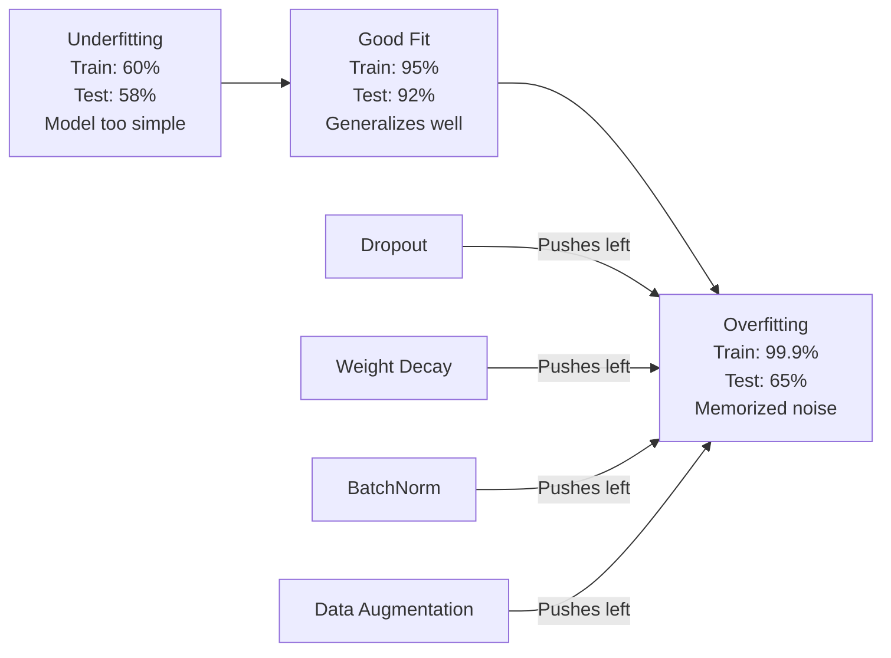
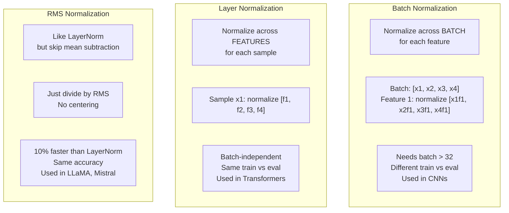
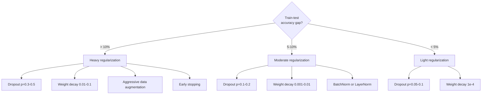

# 正則化

> 你的模型在訓練資料上拿到 99%，在測試資料上只有 60%。它是背下來，不是學會。正則化就是你對複雜度課的稅，用來逼出泛化能力。

**類型：** 實作
**程式語言：** Python
**先修單元：** 階段 3 · 06（最佳化器）
**時間：** 約 75 分鐘

## 學習目標

- 從零實作帶反向縮放的 dropout、L2 權重衰減、批次正規化、層正規化與 RMSNorm
- 量測訓練與測試準確率的落差，並用正則化實驗診斷過度擬合
- 說明為什麼 Transformer 用 LayerNorm 而不是 BatchNorm，以及為什麼現代 LLM 偏好 RMSNorm
- 依過度擬合的嚴重程度，套用正確的正則化手法組合

## 問題所在

參數夠多的神經網路可以把任何資料集背下來。這不是假設 —— Zhang 等人（2017）用隨機標籤在 ImageNet 上訓練標準網路，證明了這件事。這些網路在完全隨機的標籤指派上，訓練損失逼近零。它們背下了一百萬組沒有任何模式可學的輸入輸出配對。訓練損失完美無缺。測試準確率是零。

這就是過度擬合問題，而且模型愈大就愈嚴重。GPT-3 有 1,750 億個參數。訓練集大約有 5,000 億個詞元。參數這麼多，模型的容量足以把訓練資料中相當大的片段一字不差地背下來。少了正則化，它就只會把訓練樣本反芻出來，而不是學會可泛化的模式。

訓練表現與測試表現之間的落差，就是過度擬合落差。這一課的每一種手法，都從不同角度攻擊這道落差。Dropout 逼網路不去依賴任何單一神經元。權重衰減防止任何單一權重長得太大。批次正規化把損失地景抹平，讓最佳化器找到更平坦、更能泛化的最小值。層正規化做同一件事，但在批次正規化失效的地方（小批次、長度會變動的序列）依然可用。RMSNorm 靠省掉平均值的計算，把同一件事做快 10%。每一種手法都很簡單。合起來，它們就是「會背答案的模型」與「會泛化的模型」之間的差別。

## 核心概念

### 過度擬合的頻譜

每個模型都落在一道頻譜上的某處，一端是欠擬合（太簡單，抓不到模式），另一端是過度擬合（太複雜，把雜訊也抓了進來）。甜蜜點在兩者之間，而正則化會把模型從過度擬合那一側推向它。



### Dropout

最簡單、詮釋卻最優雅的正則化手法。訓練時，以機率 p 把每個神經元的輸出隨機設為零。

```
output = activation(z) * mask    where mask[i] ~ Bernoulli(1 - p)
```

p = 0.5 時，每一次前向傳播都有一半的神經元被歸零。網路必須學出有冗餘的表示，因為它無法預測哪些神經元會在。這防止了共適應（co-adaptation）—— 神經元學會依賴某些特定的其他神經元存在。

集成效果的詮釋：一個有 N 個神經元的網路加上 dropout，會產生 2^N 個可能的子網路（神經元開或關的每一種組合）。用 dropout 訓練，約等於同時訓練這全部 2^N 個子網路，每一個各自看不同的 mini-batch。測試時，你用上全部神經元（不做 dropout），並把輸出乘上 (1 - p) 以對齊訓練時的期望值。這等價於把 2^N 個子網路的預測平均起來 —— 從單一個模型得到一個超大的集成。

實務上，這個縮放是在訓練時做，而不是測試時做（inverted dropout，反向 dropout）：

```
During training:  output = activation(z) * mask / (1 - p)
During testing:   output = activation(z)   (no change needed)
```

這樣更乾淨，因為測試端的程式碼完全不需要知道 dropout 的存在。

預設比率：Transformer 用 p = 0.1，MLP 用 p = 0.5，CNN 用 p = 0.2-0.3。dropout 愈高＝正則化愈強＝欠擬合的風險愈大。

### 權重衰減（L2 正則化）

把所有權重的平方大小加進損失裡：

```
total_loss = task_loss + (lambda / 2) * sum(w_i^2)
```

正則化項的梯度是 lambda * w。這意味著每一步都會把每個權重朝零縮小一個與它自身大小成正比的比例。大權重被罰得更重。模型被推向那種沒有任何單一權重佔主導的解。

這為什麼有助於泛化：過度擬合的模型往往帶有很大的權重，會把訓練資料裡的雜訊放大。權重衰減讓權重保持小，這限制了模型的有效容量，逼它去依賴穩健、可泛化的特徵，而不是背下來的怪癖。

lambda 這個超參數控制強度。典型值：

- Transformer 上搭配 AdamW：0.01
- CNN 上搭配 SGD：1e-4
- 嚴重過度擬合的模型：0.1

如同單元 06 討論過的：權重衰減與 L2 正則化在 SGD 裡等價，在 Adam 裡則不等價。用 Adam 訓練時，永遠選 AdamW（解耦的權重衰減）。

### 批次正規化

把每一層的輸出跨 mini-batch 正規化之後，再傳給下一層。

對某一層上一個 mini-batch 的激活值：

```
mu = (1/B) * sum(x_i)           (batch mean)
sigma^2 = (1/B) * sum((x_i - mu)^2)   (batch variance)
x_hat = (x_i - mu) / sqrt(sigma^2 + eps)   (normalize)
y = gamma * x_hat + beta        (scale and shift)
```

Gamma 與 beta 是可學習的參數，讓網路在「不正規化才最好」的情況下能把正規化撤銷掉。少了它們，你就是在強迫每一層的輸出都是零均值、單位變異數，而那未必是網路想要的。

**訓練／推論模式的分野：** 訓練時，mu 與 sigma 來自當前的 mini-batch。推論時，你用的是訓練期間累積下來的移動平均（momentum = 0.1 的指數移動平均，也就是 90% 舊值加 10% 新值）。

BatchNorm 為什麼有效，至今仍有爭議。原始論文聲稱它降低了「內部共變量偏移」（internal covariate shift，即隨著前面的層更新，後面層的輸入分布跟著改變）。Santurkar 等人（2018）指出這個解釋是錯的。真正的原因是：BatchNorm 讓損失地景變得更平滑。梯度更有預測性、Lipschitz 常數更小，最佳化器可以安全地走更大步。這就是 BatchNorm 讓你能用更高學習率、也收斂得更快的原因。

BatchNorm 有一個根本的限制：它依賴批次統計量。批次大小是 1 時，平均值與變異數毫無意義。批次很小（< 32）時，統計量充滿雜訊，反而傷害表現。這對物件偵測（記憶體限制了批次大小）與語言模型（序列長度不一）這類任務很要緊。

### 層正規化

改成跨特徵正規化，而不是跨批次。對單一個樣本：

```
mu = (1/D) * sum(x_j)           (feature mean)
sigma^2 = (1/D) * sum((x_j - mu)^2)   (feature variance)
x_hat = (x_j - mu) / sqrt(sigma^2 + eps)
y = gamma * x_hat + beta
```

D 是特徵維度。每個樣本各自獨立正規化 —— 完全不依賴批次大小。這就是 Transformer 用 LayerNorm 而不是 BatchNorm 的原因。序列長度會變動、批次大小往往很小（生成時甚至只有 1），而且訓練與推論的運算完全相同。

Transformer 裡的 LayerNorm 會放在每個自注意力區塊與每個前饋區塊之後（Post-LN），或是放在它們之前（Pre-LN，訓練起來更穩定）。

### RMSNorm

把 LayerNorm 的減平均去掉。由 Zhang 與 Sennrich（2019）提出。

```
rms = sqrt((1/D) * sum(x_j^2))
y = gamma * x / rms
```

就這樣。不算平均值，也沒有 beta 參數。他們的觀察是：LayerNorm 裡的重新置中（減掉平均值）對模型表現的貢獻極小，卻要花運算。把它拿掉，可以在準確率相同的情況下少掉約 10% 的額外開銷。

LLaMA、LLaMA 2、LLaMA 3、Mistral 以及大多數現代 LLM 都用 RMSNorm 取代 LayerNorm。在數十億參數、數兆詞元的規模上，那 10% 的節省很可觀。

### 正規化手法比較



### 資料增強作為正則化

這不是改模型，而是改資料。在保住標籤的前提下，對訓練輸入做變換：

- 影像：隨機裁切、翻轉、旋轉、色彩抖動、cutout
- 文字：同義詞替換、回譯、隨機刪詞
- 音訊：時間伸縮、音高位移、加入雜訊

效果跟正則化一模一樣：它放大了訓練集的有效規模，讓模型更難把特定樣本背下來。一個每張圖只看過一次原始樣貌的模型，可以把它背下來。一個每張圖看過 50 種增強版本的模型，就被迫去學那個不變的結構。

### 提早停止

最簡單的正則化手段：驗證損失開始上升時就停止訓練。在那個時點，模型還沒有過度擬合。實務上，你每個 epoch 追蹤一次驗證損失、存下目前最好的模型，然後再多訓練一個「耐心值」（patience，通常是 5 到 20 個 epoch）的窗口。如果驗證損失在耐心窗口內都沒有改善，就停下來，把存下的最佳模型載回來。

### 什麼時候該用什麼



```figure
l2-regularization
```

## 動手實作

### 步驟 1：Dropout（訓練與評估模式）

```python
import random
import math


class Dropout:
    def __init__(self, p=0.5):
        self.p = p
        self.training = True
        self.mask = None

    def forward(self, x):
        if not self.training:
            return list(x)
        self.mask = []
        output = []
        for val in x:
            if random.random() < self.p:
                self.mask.append(0)
                output.append(0.0)
            else:
                self.mask.append(1)
                output.append(val / (1 - self.p))
        return output

    def backward(self, grad_output):
        grads = []
        for g, m in zip(grad_output, self.mask):
            if m == 0:
                grads.append(0.0)
            else:
                grads.append(g / (1 - self.p))
        return grads
```

### 步驟 2：L2 權重衰減

```python
def l2_regularization(weights, lambda_reg):
    penalty = 0.0
    for w in weights:
        penalty += w * w
    return lambda_reg * 0.5 * penalty

def l2_gradient(weights, lambda_reg):
    return [lambda_reg * w for w in weights]
```

### 步驟 3：批次正規化

```python
class BatchNorm:
    def __init__(self, num_features, momentum=0.1, eps=1e-5):
        self.gamma = [1.0] * num_features
        self.beta = [0.0] * num_features
        self.eps = eps
        self.momentum = momentum
        self.running_mean = [0.0] * num_features
        self.running_var = [1.0] * num_features
        self.training = True
        self.num_features = num_features

    def forward(self, batch):
        batch_size = len(batch)
        if self.training:
            mean = [0.0] * self.num_features
            for sample in batch:
                for j in range(self.num_features):
                    mean[j] += sample[j]
            mean = [m / batch_size for m in mean]

            var = [0.0] * self.num_features
            for sample in batch:
                for j in range(self.num_features):
                    var[j] += (sample[j] - mean[j]) ** 2
            var = [v / batch_size for v in var]

            for j in range(self.num_features):
                self.running_mean[j] = (1 - self.momentum) * self.running_mean[j] + self.momentum * mean[j]
                self.running_var[j] = (1 - self.momentum) * self.running_var[j] + self.momentum * var[j]
        else:
            mean = list(self.running_mean)
            var = list(self.running_var)

        self.x_hat = []
        output = []
        for sample in batch:
            normalized = []
            out_sample = []
            for j in range(self.num_features):
                x_h = (sample[j] - mean[j]) / math.sqrt(var[j] + self.eps)
                normalized.append(x_h)
                out_sample.append(self.gamma[j] * x_h + self.beta[j])
            self.x_hat.append(normalized)
            output.append(out_sample)
        return output
```

### 步驟 4：層正規化

```python
class LayerNorm:
    def __init__(self, num_features, eps=1e-5):
        self.gamma = [1.0] * num_features
        self.beta = [0.0] * num_features
        self.eps = eps
        self.num_features = num_features

    def forward(self, x):
        mean = sum(x) / len(x)
        var = sum((xi - mean) ** 2 for xi in x) / len(x)

        self.x_hat = []
        output = []
        for j in range(self.num_features):
            x_h = (x[j] - mean) / math.sqrt(var + self.eps)
            self.x_hat.append(x_h)
            output.append(self.gamma[j] * x_h + self.beta[j])
        return output
```

### 步驟 5：RMSNorm

```python
class RMSNorm:
    def __init__(self, num_features, eps=1e-6):
        self.gamma = [1.0] * num_features
        self.eps = eps
        self.num_features = num_features

    def forward(self, x):
        rms = math.sqrt(sum(xi * xi for xi in x) / len(x) + self.eps)
        output = []
        for j in range(self.num_features):
            output.append(self.gamma[j] * x[j] / rms)
        return output
```

### 步驟 6：有正則化與沒有正則化的訓練

```python
def sigmoid(x):
    x = max(-500, min(500, x))
    return 1.0 / (1.0 + math.exp(-x))


def make_circle_data(n=200, seed=42):
    random.seed(seed)
    data = []
    for _ in range(n):
        x = random.uniform(-2, 2)
        y = random.uniform(-2, 2)
        label = 1.0 if x * x + y * y < 1.5 else 0.0
        data.append(([x, y], label))
    return data


class RegularizedNetwork:
    def __init__(self, hidden_size=16, lr=0.05, dropout_p=0.0, weight_decay=0.0):
        random.seed(0)
        self.hidden_size = hidden_size
        self.lr = lr
        self.dropout_p = dropout_p
        self.weight_decay = weight_decay
        self.dropout = Dropout(p=dropout_p) if dropout_p > 0 else None

        self.w1 = [[random.gauss(0, 0.5) for _ in range(2)] for _ in range(hidden_size)]
        self.b1 = [0.0] * hidden_size
        self.w2 = [random.gauss(0, 0.5) for _ in range(hidden_size)]
        self.b2 = 0.0

    def forward(self, x, training=True):
        self.x = x
        self.z1 = []
        self.h = []
        for i in range(self.hidden_size):
            z = self.w1[i][0] * x[0] + self.w1[i][1] * x[1] + self.b1[i]
            self.z1.append(z)
            self.h.append(max(0.0, z))

        if self.dropout and training:
            self.dropout.training = True
            self.h = self.dropout.forward(self.h)
        elif self.dropout:
            self.dropout.training = False
            self.h = self.dropout.forward(self.h)

        self.z2 = sum(self.w2[i] * self.h[i] for i in range(self.hidden_size)) + self.b2
        self.out = sigmoid(self.z2)
        return self.out

    def backward(self, target):
        eps = 1e-15
        p = max(eps, min(1 - eps, self.out))
        d_loss = -(target / p) + (1 - target) / (1 - p)
        d_sigmoid = self.out * (1 - self.out)
        d_out = d_loss * d_sigmoid

        for i in range(self.hidden_size):
            d_relu = 1.0 if self.z1[i] > 0 else 0.0
            d_h = d_out * self.w2[i] * d_relu
            self.w2[i] -= self.lr * (d_out * self.h[i] + self.weight_decay * self.w2[i])
            for j in range(2):
                self.w1[i][j] -= self.lr * (d_h * self.x[j] + self.weight_decay * self.w1[i][j])
            self.b1[i] -= self.lr * d_h
        self.b2 -= self.lr * d_out

    def evaluate(self, data):
        correct = 0
        total_loss = 0.0
        for x, y in data:
            pred = self.forward(x, training=False)
            eps = 1e-15
            p = max(eps, min(1 - eps, pred))
            total_loss += -(y * math.log(p) + (1 - y) * math.log(1 - p))
            if (pred >= 0.5) == (y >= 0.5):
                correct += 1
        return total_loss / len(data), correct / len(data) * 100

    def train_model(self, train_data, test_data, epochs=300):
        history = []
        for epoch in range(epochs):
            total_loss = 0.0
            correct = 0
            for x, y in train_data:
                pred = self.forward(x, training=True)
                self.backward(y)
                eps = 1e-15
                p = max(eps, min(1 - eps, pred))
                total_loss += -(y * math.log(p) + (1 - y) * math.log(1 - p))
                if (pred >= 0.5) == (y >= 0.5):
                    correct += 1
            train_loss = total_loss / len(train_data)
            train_acc = correct / len(train_data) * 100
            test_loss, test_acc = self.evaluate(test_data)
            history.append((train_loss, train_acc, test_loss, test_acc))
            if epoch % 75 == 0 or epoch == epochs - 1:
                gap = train_acc - test_acc
                print(f"    Epoch {epoch:3d}: train_acc={train_acc:.1f}%, test_acc={test_acc:.1f}%, gap={gap:.1f}%")
        return history
```

## 框架應用

PyTorch 把所有正規化與正則化手法都做成了模組：

```python
import torch
import torch.nn as nn

model = nn.Sequential(
    nn.Linear(784, 256),
    nn.BatchNorm1d(256),
    nn.ReLU(),
    nn.Dropout(0.3),
    nn.Linear(256, 128),
    nn.BatchNorm1d(128),
    nn.ReLU(),
    nn.Dropout(0.3),
    nn.Linear(128, 10),
)

model.train()
out_train = model(torch.randn(32, 784))

model.eval()
out_test = model(torch.randn(1, 784))
```

`model.train()` / `model.eval()` 的切換非常關鍵。它會開關 dropout，並告訴 BatchNorm 該用批次統計量還是移動統計量。推論前忘記呼叫 `model.eval()`，是深度學習裡最常見的 bug 之一。你的測試準確率會隨機跳動，因為 dropout 還在作用，而 BatchNorm 用的是 mini-batch 統計量。

對 Transformer 來說，樣態不一樣：

```python
class TransformerBlock(nn.Module):
    def __init__(self, d_model=512, nhead=8, dropout=0.1):
        super().__init__()
        self.attention = nn.MultiheadAttention(d_model, nhead, dropout=dropout)
        self.norm1 = nn.LayerNorm(d_model)
        self.ff = nn.Sequential(
            nn.Linear(d_model, d_model * 4),
            nn.GELU(),
            nn.Linear(d_model * 4, d_model),
            nn.Dropout(dropout),
        )
        self.norm2 = nn.LayerNorm(d_model)
        self.dropout = nn.Dropout(dropout)

    def forward(self, x):
        attended, _ = self.attention(x, x, x)
        x = self.norm1(x + self.dropout(attended))
        x = self.norm2(x + self.ff(x))
        return x
```

是 LayerNorm，不是 BatchNorm。Dropout 用 p=0.1，不是 p=0.5。這些就是 Transformer 的預設值。

## 產出交付

這一課會產出：
- `outputs/prompt-regularization-advisor.md` —— 一個診斷過度擬合、並建議正確正則化策略的提示詞

## 練習

1. 為 2D 資料實作空間 dropout（spatial dropout）：不是丟掉個別神經元，而是丟掉整個特徵通道。把連續的幾組特徵當成通道、整組一起丟掉，以此模擬。在 hidden_size=32 的圓形資料集上，比較它與標準 dropout 的訓練測試落差。

2. 把單元 05 的標籤平滑與這一課的 dropout 結合起來。用四種設定訓練：兩者都不用、只用 dropout、只用標籤平滑、兩者都用。量測每一種設定最後的訓練測試準確率落差。哪一種組合的落差最小？

3. 在你圓形資料集網路的隱藏層與激活函式之間，加上一層 BatchNorm。在學習率 0.01、0.05 與 0.1 之下，各訓練一次有 BatchNorm 與沒有 BatchNorm 的版本。BatchNorm 應該能讓訓練在原版網路會發散的那些較高學習率下仍然穩定。

4. 實作提早停止：每個 epoch 追蹤測試損失、存下最佳權重，若測試損失連續 20 個 epoch 都沒有改善就停止。把正則化後的網路跑 1000 個 epoch。回報哪一個 epoch 有最好的測試準確率，以及你省下了多少個 epoch 的運算。

5. 在一個四層（不只兩層）的網路上比較 LayerNorm 與 RMSNorm。兩者用相同的權重初始化。訓練 200 個 epoch，比較最終準確率、訓練速度（每個 epoch 的時間）與第一層的梯度大小。驗證 RMSNorm 在準確率相同的情況下確實更快。

## 關鍵術語

| 術語 | 大家怎麼說 | 實際上是什麼 |
|------|----------------|----------------------|
| 過度擬合 | 「模型把資料背下來了」 | 模型的訓練表現顯著超過測試表現，代表它學到的是雜訊而不是訊號 |
| 正則化 | 「防止過度擬合」 | 任何約束模型複雜度以改善泛化能力的手法：dropout、權重衰減、正規化、資料增強 |
| Dropout | 「隨機刪掉神經元」 | 訓練時以機率 p 把隨機的神經元歸零，迫使模型學出冗餘的表示；等價於訓練一個集成 |
| 權重衰減 | 「L2 懲罰」 | 每一步從權重裡減掉 lambda * w，把所有權重朝零縮小；透過權重大小來懲罰複雜度 |
| 批次正規化 | 「按批次正規化」 | 沿批次維度正規化層的輸出，訓練時用批次統計量、推論時用移動平均 |
| 層正規化 | 「按樣本正規化」 | 在每個樣本內跨特徵正規化；不依賴批次，用在批次大小會變動的 Transformer 上 |
| RMSNorm | 「不減平均的 LayerNorm」 | 均方根正規化；把 LayerNorm 的減平均拿掉，換來 10% 的加速而準確率不變 |
| 提早停止 | 「在過度擬合之前停手」 | 驗證損失不再改善時就中止訓練；最簡單的正則化手段，通常與其他手法並用 |
| 資料增強 | 「用更少的資料變出更多」 | 對訓練輸入做變換（翻轉、裁切、加雜訊），放大有效的資料集規模，並迫使模型學到不變性 |
| 泛化落差 | 「訓練測試落差」 | 訓練表現與測試表現之間的差距；正則化的目標就是把這道落差縮到最小 |

## 延伸閱讀

- Srivastava et al., "Dropout: A Simple Way to Prevent Neural Networks from Overfitting" (2014) —— dropout 的原始論文，提出集成效果的詮釋並做了大量實驗
- Ioffe & Szegedy, "Batch Normalization: Accelerating Deep Network Training by Reducing Internal Covariate Shift" (2015) —— 提出了 BatchNorm 與它的訓練流程，是被引用最多的深度學習論文之一
- Zhang & Sennrich, "Root Mean Square Layer Normalization" (2019) —— 證明 RMSNorm 能在減少運算量的同時追上 LayerNorm 的準確率；被 LLaMA 與 Mistral 採用
- Zhang et al., "Understanding Deep Learning Requires Rethinking Generalization" (2017) —— 這篇里程碑論文指出神經網路能把隨機標籤背下來，挑戰了傳統對泛化能力的看法
