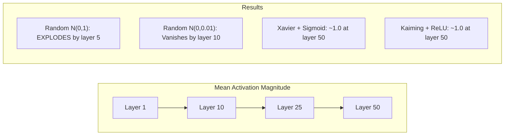
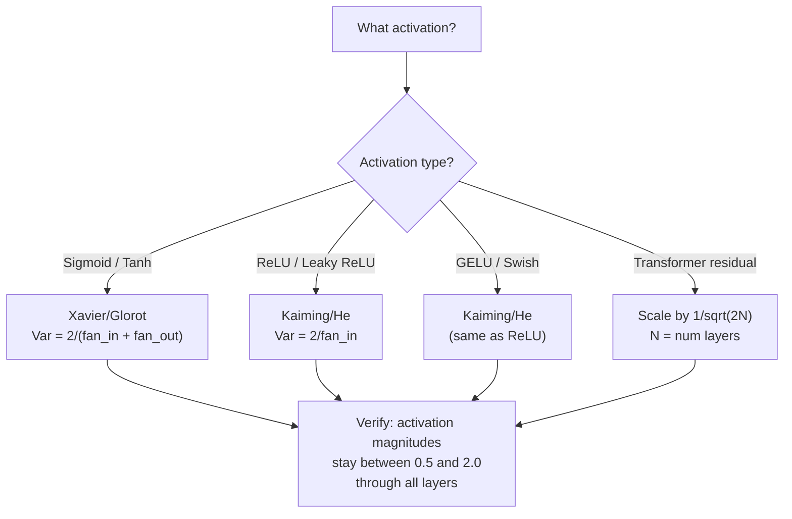

# 權重初始化與訓練穩定性

> 初始化錯了，訓練根本不會開始。初始化對了，50 層跟 3 層一樣順。

**類型：** 實作
**程式語言：** Python
**先修單元：** 階段 3 · 04（激活函式）、階段 3 · 07（正則化）
**時間：** 約 90 分鐘

## 學習目標

- 實作零初始化、隨機初始化、Xavier/Glorot 與 Kaiming/He 四種初始化策略，並量測它們對激活值大小穿過 50 層後的影響
- 推導 Xavier 初始化為什麼用 Var(w) = 2/(fan_in + fan_out)，而 Kaiming 用 Var(w) = 2/fan_in
- 示範零初始化造成的對稱性問題，並解釋為什麼光靠隨機的縮放尺度還不夠
- 依照激活函式挑對初始化策略：sigmoid／tanh 用 Xavier，ReLU／GELU 用 Kaiming

## 問題所在

把所有權重初始化成零。什麼都學不到。每個神經元算出同一個函式、收到同一個梯度，更新的幅度也一模一樣。訓練一萬個 epoch 之後，你那個 512 個神經元的隱藏層仍然是同一個神經元的 512 份複本。你付了 512 個參數的代價，拿到 1 個。

把它們初始化得太大。激活值會穿過網路一路爆炸。到第 10 層，數值就衝到 1e15。到第 20 層，直接溢位成無限大。梯度會沿著反方向走出同一條軌跡。

用標準常態分布隨機初始化。3 層還行。到了 50 層，訊號就會塌成零或炸到無限大——取決於那個隨機的縮放尺度是稍微偏小還是稍微偏大。「能用」和「壞掉」之間的界線細如刀鋒。

權重初始化是深度學習裡最被低估的一個決定。架構有論文寫，最佳化器有部落格文章講，初始化只拿到一行註腳。但這件事一錯，其他都不重要了——你的網路在訓練開始前就已經死了。

## 核心概念

### 對稱性問題

一層裡的每個神經元結構都相同：輸入乘權重、加偏差項、套激活函式。如果所有權重都從同一個值起跑（零是最極端的情況），每個神經元就會算出同樣的輸出。在反向傳遞的過程中，每個神經元收到同樣的梯度。在更新步驟裡，每個神經元變動的幅度也一樣。

你卡住了。網路有好幾百個參數，但它們全部同步移動。這叫做對稱性，而隨機初始化就是打破它的暴力解法。每個神經元從權重空間裡不同的位置起跑，於是各自學到不同的特徵。

但「隨機」還不夠。真正決定網路訓不訓練得起來的，是隨機值的*尺度*。

### 變異數如何逐層傳遞

考慮一層有 fan_in 個輸入：

```
z = w1*x1 + w2*x2 + ... + w_n*x_n
```

如果每個權重 wi 都取自變異數為 Var(w) 的分布，而每個輸入 xi 的變異數是 Var(x)，那麼輸出的變異數是：

```
Var(z) = fan_in * Var(w) * Var(x)
```

如果 Var(w) = 1 且 fan_in = 512，輸出變異數就是輸入變異數的 512 倍。經過 10 層之後：512^10 = 1.2e27。你的訊號爆炸了。

如果 Var(w) = 0.001，輸出變異數每層會縮小 0.001 * 512 = 0.512 倍。經過 10 層之後：0.512^10 = 0.00013。你的訊號消失了。

目標是：挑一個 Var(w) 使得 Var(z) = Var(x)。訊號大小就能跨層維持不變。

### Xavier/Glorot 初始化

Glorot 與 Bengio（2010）針對 sigmoid 與 tanh 激活函式推導出解答。要讓變異數在前向傳播與反向傳遞裡都保持穩定：

```
Var(w) = 2 / (fan_in + fan_out)
```

實務上，權重取自：

```
w ~ Uniform(-limit, limit)  where limit = sqrt(6 / (fan_in + fan_out))
```

或是：

```
w ~ Normal(0, sqrt(2 / (fan_in + fan_out)))
```

這行得通，是因為 sigmoid 與 tanh 在零附近大致是線性的，而初始化得當的激活值就落在那一帶。變異數能穿過幾十層都保持穩定。

### Kaiming/He 初始化

ReLU 會殺掉一半的輸出（所有負值都變成零）。有效的 fan_in 等於被砍半，因為平均而言有一半的輸入被歸零。Xavier 初始化沒有把這件事算進去——它低估了需要的變異數。

He 等人（2015）調整了公式：

```
Var(w) = 2 / fan_in
```

權重取自：

```
w ~ Normal(0, sqrt(2 / fan_in))
```

那個 2 倍係數補償了 ReLU 把一半激活值歸零的損失。少了它，訊號每層會縮小約 0.5 倍。50 層下來：0.5^50 = 8.8e-16。Kaiming 初始化防止了這件事。

### Transformer 的初始化

GPT-2 帶進了另一種做法。殘差連接會把每個子層的輸出加回它的輸入：

```
x = x + sublayer(x)
```

每一次相加都會讓變異數變大。有 N 個殘差層時，變異數會跟著 N 成正比成長。GPT-2 把殘差層的權重乘上 1/sqrt(2N) 做縮放，其中 N 是層數。這讓累積下來的訊號大小維持穩定。

Llama 3（405B 參數、126 層）用的是類似的方案。少了這個縮放，殘差流會穿過 126 層的注意力與前饋區塊無界限地成長。

```mermaid
flowchart TD
    subgraph "Zero Init"
        Z1["Layer 1<br/>All weights = 0"] --> Z2["Layer 2<br/>All neurons identical"]
        Z2 --> Z3["Layer 3<br/>Still identical"]
        Z3 --> ZR["Result: 1 effective neuron<br/>regardless of width"]
    end

    subgraph "Xavier Init"
        X1["Layer 1<br/>Var = 2/(fan_in+fan_out)"] --> X2["Layer 2<br/>Signal stable"]
        X2 --> X3["Layer 50<br/>Signal stable"]
        X3 --> XR["Result: Trains with<br/>sigmoid/tanh"]
    end

    subgraph "Kaiming Init"
        K1["Layer 1<br/>Var = 2/fan_in"] --> K2["Layer 2<br/>Signal stable"]
        K2 --> K3["Layer 50<br/>Signal stable"]
        K3 --> KR["Result: Trains with<br/>ReLU/GELU"]
    end
```



### 激活值大小穿過 50 層的變化



### 怎麼挑對初始化



```figure
weight-init-variance
```

## 動手實作

### 步驟 1：初始化策略

初始化一個權重矩陣的四種方法。每個函式回傳一個 list of lists（一個 2D 矩陣），有 fan_in 個欄、fan_out 個列。

```python
import math
import random


def zero_init(fan_in, fan_out):
    return [[0.0 for _ in range(fan_in)] for _ in range(fan_out)]


def random_init(fan_in, fan_out, scale=1.0):
    return [[random.gauss(0, scale) for _ in range(fan_in)] for _ in range(fan_out)]


def xavier_init(fan_in, fan_out):
    std = math.sqrt(2.0 / (fan_in + fan_out))
    return [[random.gauss(0, std) for _ in range(fan_in)] for _ in range(fan_out)]


def kaiming_init(fan_in, fan_out):
    std = math.sqrt(2.0 / fan_in)
    return [[random.gauss(0, std) for _ in range(fan_in)] for _ in range(fan_out)]
```

### 步驟 2：激活函式

我們需要 sigmoid、tanh 與 ReLU，才能用各自搭配的激活函式測試每種初始化策略。

```python
def sigmoid(x):
    x = max(-500, min(500, x))
    return 1.0 / (1.0 + math.exp(-x))


def tanh_act(x):
    return math.tanh(x)


def relu(x):
    return max(0.0, x)
```

### 步驟 3：前向穿過 50 層

把隨機資料送進一個深層網路，並量測每一層的平均激活值大小。

```python
def forward_deep(init_fn, activation_fn, n_layers=50, width=64, n_samples=100):
    random.seed(42)
    layer_magnitudes = []

    inputs = [[random.gauss(0, 1) for _ in range(width)] for _ in range(n_samples)]

    for layer_idx in range(n_layers):
        weights = init_fn(width, width)
        biases = [0.0] * width

        new_inputs = []
        for sample in inputs:
            output = []
            for neuron_idx in range(width):
                z = sum(weights[neuron_idx][j] * sample[j] for j in range(width)) + biases[neuron_idx]
                output.append(activation_fn(z))
            new_inputs.append(output)
        inputs = new_inputs

        magnitudes = []
        for sample in inputs:
            magnitudes.append(sum(abs(v) for v in sample) / width)
        mean_mag = sum(magnitudes) / len(magnitudes)
        layer_magnitudes.append(mean_mag)

    return layer_magnitudes
```

### 步驟 4：實驗

跑過所有組合：零初始化、隨機 N(0,1)、隨機 N(0,0.01)、Xavier 配 sigmoid、Xavier 配 tanh、Kaiming 配 ReLU。印出幾個關鍵層的大小。

```python
def run_experiment():
    configs = [
        ("Zero init + Sigmoid", lambda fi, fo: zero_init(fi, fo), sigmoid),
        ("Random N(0,1) + ReLU", lambda fi, fo: random_init(fi, fo, 1.0), relu),
        ("Random N(0,0.01) + ReLU", lambda fi, fo: random_init(fi, fo, 0.01), relu),
        ("Xavier + Sigmoid", xavier_init, sigmoid),
        ("Xavier + Tanh", xavier_init, tanh_act),
        ("Kaiming + ReLU", kaiming_init, relu),
    ]

    print(f"{'Strategy':<30} {'L1':>10} {'L5':>10} {'L10':>10} {'L25':>10} {'L50':>10}")
    print("-" * 80)

    for name, init_fn, act_fn in configs:
        mags = forward_deep(init_fn, act_fn)
        row = f"{name:<30}"
        for idx in [0, 4, 9, 24, 49]:
            val = mags[idx]
            if val > 1e6:
                row += f" {'EXPLODED':>10}"
            elif val < 1e-6:
                row += f" {'VANISHED':>10}"
            else:
                row += f" {val:>10.4f}"
        print(row)
```

### 步驟 5：對稱性示範

證明零初始化會產出一模一樣的神經元。

```python
def symmetry_demo():
    random.seed(42)
    weights = zero_init(2, 4)
    biases = [0.0] * 4

    inputs = [0.5, -0.3]
    outputs = []
    for neuron_idx in range(4):
        z = sum(weights[neuron_idx][j] * inputs[j] for j in range(2)) + biases[neuron_idx]
        outputs.append(sigmoid(z))

    print("\nSymmetry Demo (4 neurons, zero init):")
    for i, out in enumerate(outputs):
        print(f"  Neuron {i}: output = {out:.6f}")
    all_same = all(abs(outputs[i] - outputs[0]) < 1e-10 for i in range(len(outputs)))
    print(f"  All identical: {all_same}")
    print(f"  Effective parameters: 1 (not {len(weights) * len(weights[0])})")
```

### 步驟 6：逐層大小報告

把 50 層的激活值大小印成一張視覺化的長條圖。

```python
def magnitude_report(name, magnitudes):
    print(f"\n{name}:")
    for i, mag in enumerate(magnitudes):
        if i % 5 == 0 or i == len(magnitudes) - 1:
            if mag > 1e6:
                bar = "X" * 50 + " EXPLODED"
            elif mag < 1e-6:
                bar = "." + " VANISHED"
            else:
                bar_len = min(50, max(1, int(mag * 10)))
                bar = "#" * bar_len
            print(f"  Layer {i+1:3d}: {bar} ({mag:.6f})")
```

## 框架應用

PyTorch 把這些都做成內建函式了：

```python
import torch
import torch.nn as nn

layer = nn.Linear(512, 256)

nn.init.xavier_uniform_(layer.weight)
nn.init.xavier_normal_(layer.weight)

nn.init.kaiming_uniform_(layer.weight, nonlinearity='relu')
nn.init.kaiming_normal_(layer.weight, nonlinearity='relu')

nn.init.zeros_(layer.bias)
```

當你呼叫 `nn.Linear(512, 256)`，PyTorch 預設用的是 Kaiming 均勻分布初始化。這就是為什麼大多數簡單的網路「就是能跑」——PyTorch 已經幫你做了對的選擇。但當你要打造自訂架構、或是疊到 20 層以上時，你就得搞懂底下在發生什麼事，而且可能要覆寫掉這個預設值。

至於 transformer，HuggingFace 的模型通常在它們的 `_init_weights` 方法裡處理初始化。GPT-2 的實作會把殘差投影乘上 1/sqrt(N) 做縮放。如果你是從零打造一個 transformer，這件事得你自己加上去。

## 產出交付

本單元會產出：
- `outputs/prompt-init-strategy.md` —— 一個提示詞，用來診斷權重初始化的問題並推薦對的策略

## 練習

1. 加上 LeCun 初始化（Var = 1/fan_in，為 SELU 激活函式設計的）。用 LeCun 初始化配 tanh 跑一次 50 層實驗，並跟 Xavier 配 tanh 比較。

2. 實作 GPT-2 的殘差縮放：在把每一層的輸出加進殘差流之前，先乘上 1/sqrt(2*N)。跑 50 層，比較有做跟沒做縮放的差別，量測殘差的大小成長得多快。

3. 做一個「初始化健檢」函式，吃進一個網路的各層維度與激活函式類型，然後推薦正確的初始化，並在目前的初始化會出問題時發出警告。

4. 用 fan_in = 16 和 fan_in = 1024 各跑一次實驗。Xavier 與 Kaiming 會隨 fan_in 調整，隨機初始化不會。呈現「能用」與「壞掉」之間的落差如何隨著層變寬而拉大。

5. 實作 orthogonal 初始化（產生一個隨機矩陣、算它的 SVD、取那個正交矩陣 U）。在 50 層的 ReLU 網路上跟 Kaiming 比較。

## 關鍵術語

| 術語 | 大家怎麼說 | 實際上是什麼 |
|------|----------------|----------------------|
| 權重初始化 | 「把起始權重隨機設一下」 | 挑選初始權重值的策略，它決定了一個網路到底訓練不訓練得起來 |
| 對稱性破壞 | 「讓神經元長得不一樣」 | 用隨機初始化來確保神經元學到各自不同的特徵，而不是算出一模一樣的函式 |
| 扇入 | 「一個神經元有幾個輸入」 | 進來的連接數量，它決定了輸入變異數在加權和裡怎麼累積 |
| 扇出 | 「一個神經元有幾個輸出」 | 出去的連接數量，跟反向傳播時維持梯度變異數有關 |
| Xavier/Glorot 初始化 | 「sigmoid 用的那個初始化」 | Var(w) = 2/(fan_in + fan_out)，設計目的是讓變異數穿過 sigmoid 與 tanh 激活函式後仍然保持住 |
| Kaiming/He 初始化 | 「ReLU 用的那個初始化」 | Var(w) = 2/fan_in，把 ReLU 會把一半激活值歸零這件事算了進去 |
| 變異數傳遞 | 「訊號怎麼逐層變大或變小」 | 針對激活值變異數如何依權重尺度逐層變化所做的數學分析 |
| 殘差縮放 | 「GPT-2 的初始化小技巧」 | 把殘差連接的權重乘上 1/sqrt(2N) 做縮放，避免變異數穿過 N 層 transformer 後不斷成長 |
| 死掉的網路 | 「什麼都訓練不動」 | 一個因為初始化沒做好，導致所有梯度都是零、或所有激活值都飽和的網路 |
| 激活值爆炸 | 「數值衝到無限大」 | 當權重變異數過高時，激活值大小會逐層指數成長 |

## 延伸閱讀

- Glorot & Bengio, "Understanding the difficulty of training deep feedforward neural networks" (2010) —— 提出 Xavier 初始化並附上變異數分析的原始論文
- He et al., "Delving Deep into Rectifiers" (2015) —— 為 ReLU 網路提出 Kaiming 初始化
- Radford et al., "Language Models are Unsupervised Multitask Learners" (2019) —— GPT-2 論文，帶有殘差縮放的初始化
- Mishkin & Matas, "All You Need is a Good Init" (2016) —— 逐層單位變異數初始化，是解析公式之外的一個經驗性替代方案
