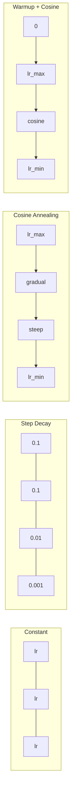
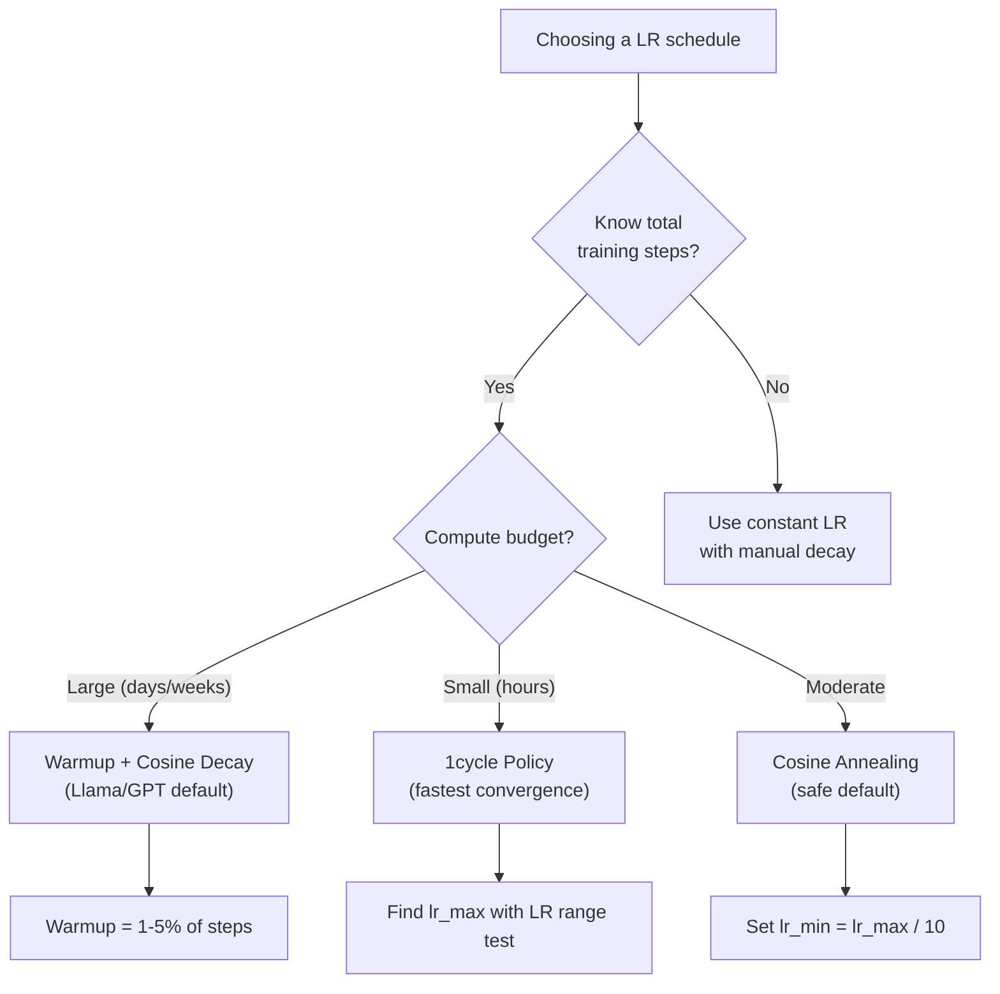
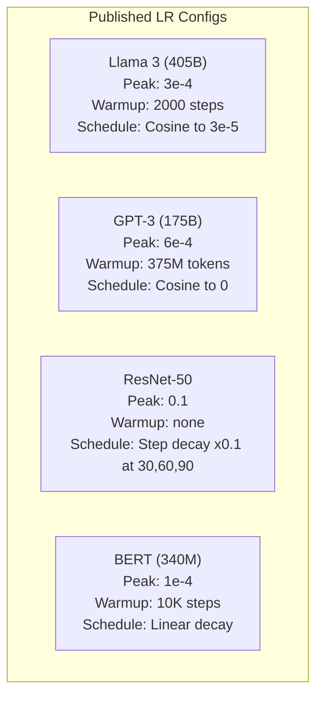

# 學習率排程與暖身

> 學習率是最重要的單一超參數。不是架構。不是資料集大小。不是激活函式。是學習率。如果你只調一個東西，就調這個。

**類型：** 實作
**程式語言：** Python
**先修單元：** 階段 3 · 06（最佳化器）、階段 3 · 08（權重初始化）
**時間：** 約 90 分鐘

## 學習目標

- 從零實作固定學習率、階梯式衰減、餘弦退火、暖身加餘弦，以及 1cycle 這五種學習率排程
- 示範學習率選擇的三種失敗模式：發散（太大）、停滯（太小）與震盪（不衰減）
- 說明為什麼以 Adam 為基礎的最佳化器需要暖身，以及暖身如何穩定訓練初期
- 在同一個任務上比較全部五種排程的收斂速度，並為給定的訓練預算挑出合適的那一個

## 問題所在

把學習率設成 0.1。訓練發散 —— 損失在 3 步之內飆到無限大。設成 0.0001。訓練慢到只能爬 —— 100 個 epoch 過去，模型幾乎還停在隨機初始的位置。設成 0.01。前 50 個 epoch 都很順，然後損失就在一個它永遠到不了的最小值附近震盪，因為步伐太大了。

最佳學習率不是一個常數。它會在訓練過程中改變。訓練初期，你想要大步伐，好快速涵蓋大片地景。訓練後期，你想要極小的步伐，好穩穩落進一個尖銳的最小值裡。準確率 90% 的模型和 95% 的模型，差別常常就只是排程而已。

過去三年裡發表的每一個重要模型都用了學習率排程。Llama 3 用的是峰值 lr=3e-4、2000 步暖身，再餘弦衰減到 3e-5。GPT-3 用 lr=6e-4，暖身涵蓋 3.75 億個詞元。這些都不是隨手挑的數字，而是花掉數百萬美元、做完大量超參數掃描之後的結果。

你需要搞懂排程，因為預設值不會剛好適合你的問題。微調一個預訓練模型時，正確的排程和從零訓練並不一樣。把批次大小調大時，暖身的長度也得跟著改。訓練在第 10,000 步壞掉時，你得判斷這是排程的問題，還是別的問題。

## 核心概念

### 固定學習率

最簡單的做法。挑一個數字，每一步都用它。

```
lr(t) = lr_0
```

很少是最佳解。它要嘛對訓練尾段太大（在最小值附近震盪），要嘛對訓練初期太小（把算力浪費在極小的步伐上）。小模型和除錯時還算堪用。任何訓練時間超過一小時的東西，用它都是很糟的選擇。

### 階梯式衰減

ResNet 時代的老派做法。在固定的 epoch 把學習率砍掉一個倍數（通常是 10 倍）。

```
lr(t) = lr_0 * gamma^(floor(epoch / step_size))
```

gamma = 0.1、step_size = 30 的意思是：學習率每 30 個 epoch 掉 10 倍。ResNet-50 就是這樣做的 —— lr=0.1，在第 30、60、90 個 epoch 各掉 10 倍。

問題在於：最佳的衰減時點取決於資料集與架構。換一個問題，你就得重新調「什麼時候降」。而且轉換是突兀的 —— 學習率忽然改變時，損失可能會冒出一個尖峰。

### 餘弦退火

從最大學習率平滑衰減到最小值，沿著一條餘弦曲線走：

```
lr(t) = lr_min + 0.5 * (lr_max - lr_min) * (1 + cos(pi * t / T))
```

其中 t 是當前步數，T 是總步數。

t=0 時餘弦項是 1，所以 lr = lr_max。t=T 時餘弦項是 -1，所以 lr = lr_min。衰減一開始很緩，中段加速，接近尾聲時又緩下來。

這是現在多數訓練的預設做法。除了 lr_max 與 lr_min 之外沒有超參數要調。餘弦的形狀符合一個經驗觀察：大部分的學習都發生在訓練中段 —— 你會希望在那段關鍵期裡的步伐大小是合理的。

### 暖身：為什麼要從小開始

Adam 和其他自適應最佳化器會維護梯度平均與變異數的移動估計。在第 0 步，這些估計被初始化為零。最前面幾次梯度更新是建立在垃圾統計量上的。如果這段期間你的學習率很大，模型就會踏出一大步 —— 而且方向很糟。

暖身修掉這件事。用一個極小的學習率開始（常見的是 lr_max / warmup_steps，甚至直接從零開始），在前 N 步裡線性上升到 lr_max。等你到達完整的學習率時，Adam 的統計量已經穩定了。

```
lr(t) = lr_max * (t / warmup_steps)     for t < warmup_steps
```

典型的暖身長度：總訓練步數的 1-5%。Llama 3 訓練了約 1.8 兆個詞元，暖身 2000 步。GPT-3 的暖身涵蓋 3.75 億個詞元。

### 線性暖身 + 餘弦衰減

現代的預設。先線性上升，再用餘弦衰減：

```
if t < warmup_steps:
    lr(t) = lr_max * (t / warmup_steps)
else:
    progress = (t - warmup_steps) / (total_steps - warmup_steps)
    lr(t) = lr_min + 0.5 * (lr_max - lr_min) * (1 + cos(pi * progress))
```

Llama、GPT、PaLM 與多數現代 Transformer 用的就是這個。暖身擋掉初期的不穩定，餘弦衰減讓模型穩穩落進一個好的最小值。

### 1cycle 策略

Leslie Smith 在 2018 年的發現：在訓練的前半段把學習率從一個低值拉升到一個高值，後半段再拉回來。這很反直覺 —— 為什麼你會想在訓練途中*提高*學習率？

理論是這樣：高學習率會給最佳化軌跡加入雜訊，因而起到正則化的作用。模型在上升階段探索了更多損失地景，找到更好的盆地；接著的下降階段則在找到的最佳盆地裡做精修。

```
Phase 1 (0 to T/2):    lr ramps from lr_max/25 to lr_max
Phase 2 (T/2 to T):    lr ramps from lr_max to lr_max/10000
```

在固定的算力預算下，1cycle 往往比餘弦退火訓練得更快。代價是：你必須事先知道總步數。

### 排程形狀



### 決策流程圖



### 已發表模型的真實數字



```figure
lr-schedule
```

## 動手實作

### 步驟 1：排程函式

每個函式接收當前步數，回傳該步要用的學習率。

```python
import math


def constant_schedule(step, lr=0.01, **kwargs):
    return lr


def step_decay_schedule(step, lr=0.1, step_size=100, gamma=0.1, **kwargs):
    return lr * (gamma ** (step // step_size))


def cosine_schedule(step, lr=0.01, total_steps=1000, lr_min=1e-5, **kwargs):
    if step >= total_steps:
        return lr_min
    return lr_min + 0.5 * (lr - lr_min) * (1 + math.cos(math.pi * step / total_steps))


def warmup_cosine_schedule(step, lr=0.01, total_steps=1000, warmup_steps=100, lr_min=1e-5, **kwargs):
    if total_steps <= warmup_steps:
        return lr * (step / max(warmup_steps, 1))
    if step < warmup_steps:
        return lr * step / warmup_steps
    progress = (step - warmup_steps) / (total_steps - warmup_steps)
    return lr_min + 0.5 * (lr - lr_min) * (1 + math.cos(math.pi * progress))


def one_cycle_schedule(step, lr=0.01, total_steps=1000, **kwargs):
    mid = max(total_steps // 2, 1)
    if step < mid:
        return (lr / 25) + (lr - lr / 25) * step / mid
    else:
        progress = (step - mid) / max(total_steps - mid, 1)
        return lr * (1 - progress) + (lr / 10000) * progress
```

### 步驟 2：把所有排程畫出來

印出一張文字圖，顯示每種排程在訓練過程中怎麼變化。

```python
def visualize_schedule(name, schedule_fn, total_steps=500, **kwargs):
    steps = list(range(0, total_steps, total_steps // 20))
    if total_steps - 1 not in steps:
        steps.append(total_steps - 1)

    lrs = [schedule_fn(s, total_steps=total_steps, **kwargs) for s in steps]
    max_lr = max(lrs) if max(lrs) > 0 else 1.0

    print(f"\n{name}:")
    for s, lr_val in zip(steps, lrs):
        bar_len = int(lr_val / max_lr * 40)
        bar = "#" * bar_len
        print(f"  Step {s:4d}: lr={lr_val:.6f} {bar}")
```

### 步驟 3：訓練網路

一個跑在圓形資料集上的簡單兩層網路，和前幾個單元一樣，只是這次我們換不同的排程。

```python
import random


def sigmoid(x):
    x = max(-500, min(500, x))
    return 1.0 / (1.0 + math.exp(-x))


def relu(x):
    return max(0.0, x)


def relu_deriv(x):
    return 1.0 if x > 0 else 0.0


def make_circle_data(n=200, seed=42):
    random.seed(seed)
    data = []
    for _ in range(n):
        x = random.uniform(-2, 2)
        y = random.uniform(-2, 2)
        label = 1.0 if x * x + y * y < 1.5 else 0.0
        data.append(([x, y], label))
    return data


def train_with_schedule(schedule_fn, schedule_name, data, epochs=300, base_lr=0.05, **kwargs):
    random.seed(0)
    hidden_size = 8
    total_steps = epochs * len(data)

    std = math.sqrt(2.0 / 2)
    w1 = [[random.gauss(0, std) for _ in range(2)] for _ in range(hidden_size)]
    b1 = [0.0] * hidden_size
    w2 = [random.gauss(0, std) for _ in range(hidden_size)]
    b2 = 0.0

    step = 0
    epoch_losses = []

    for epoch in range(epochs):
        total_loss = 0
        correct = 0

        for x, target in data:
            lr = schedule_fn(step, lr=base_lr, total_steps=total_steps, **kwargs)

            z1 = []
            h = []
            for i in range(hidden_size):
                z = w1[i][0] * x[0] + w1[i][1] * x[1] + b1[i]
                z1.append(z)
                h.append(relu(z))

            z2 = sum(w2[i] * h[i] for i in range(hidden_size)) + b2
            out = sigmoid(z2)

            error = out - target
            d_out = error * out * (1 - out)

            for i in range(hidden_size):
                d_h = d_out * w2[i] * relu_deriv(z1[i])
                w2[i] -= lr * d_out * h[i]
                for j in range(2):
                    w1[i][j] -= lr * d_h * x[j]
                b1[i] -= lr * d_h
            b2 -= lr * d_out

            total_loss += (out - target) ** 2
            if (out >= 0.5) == (target >= 0.5):
                correct += 1
            step += 1

        avg_loss = total_loss / len(data)
        accuracy = correct / len(data) * 100
        epoch_losses.append(avg_loss)

    return epoch_losses
```

### 步驟 4：比較所有排程

用每一種排程訓練同一個網路，比較最終損失與收斂行為。

```python
def compare_schedules(data):
    configs = [
        ("Constant", constant_schedule, {}),
        ("Step Decay", step_decay_schedule, {"step_size": 15000, "gamma": 0.1}),
        ("Cosine", cosine_schedule, {"lr_min": 1e-5}),
        ("Warmup+Cosine", warmup_cosine_schedule, {"warmup_steps": 3000, "lr_min": 1e-5}),
        ("1cycle", one_cycle_schedule, {}),
    ]

    print(f"\n{'Schedule':<20} {'Start Loss':>12} {'Mid Loss':>12} {'End Loss':>12} {'Best Loss':>12}")
    print("-" * 70)

    for name, schedule_fn, extra_kwargs in configs:
        losses = train_with_schedule(schedule_fn, name, data, epochs=300, base_lr=0.05, **extra_kwargs)
        mid_idx = len(losses) // 2
        best = min(losses)
        print(f"{name:<20} {losses[0]:>12.6f} {losses[mid_idx]:>12.6f} {losses[-1]:>12.6f} {best:>12.6f}")
```

### 步驟 5：學習率太大 vs 太小

示範三種失敗模式：太大（發散）、太小（爬行），以及剛剛好。

```python
def lr_sensitivity(data):
    learning_rates = [1.0, 0.1, 0.01, 0.001, 0.0001]

    print("\nLR Sensitivity (constant schedule, 100 epochs):")
    print(f"  {'LR':>10} {'Start Loss':>12} {'End Loss':>12} {'Status':>15}")
    print("  " + "-" * 52)

    for lr in learning_rates:
        losses = train_with_schedule(constant_schedule, f"lr={lr}", data, epochs=100, base_lr=lr)
        start = losses[0]
        end = losses[-1]

        if end > start or math.isnan(end) or end > 1.0:
            status = "DIVERGED"
        elif end > start * 0.9:
            status = "BARELY MOVED"
        elif end < 0.15:
            status = "CONVERGED"
        else:
            status = "LEARNING"

        end_str = f"{end:.6f}" if not math.isnan(end) else "NaN"
        print(f"  {lr:>10.4f} {start:>12.6f} {end_str:>12} {status:>15}")
```

## 框架應用

PyTorch 在 `torch.optim.lr_scheduler` 裡提供了各種排程器：

```python
import torch
import torch.optim as optim
from torch.optim.lr_scheduler import CosineAnnealingLR, OneCycleLR, StepLR

model = nn.Sequential(nn.Linear(10, 64), nn.ReLU(), nn.Linear(64, 1))
optimizer = optim.Adam(model.parameters(), lr=3e-4)

scheduler = CosineAnnealingLR(optimizer, T_max=1000, eta_min=1e-5)

for step in range(1000):
    loss = train_step(model, optimizer)
    scheduler.step()
```

要做暖身加餘弦，可以用 lambda 排程器，或是 HuggingFace 的 `get_cosine_schedule_with_warmup`：

```python
from transformers import get_cosine_schedule_with_warmup

scheduler = get_cosine_schedule_with_warmup(
    optimizer,
    num_warmup_steps=2000,
    num_training_steps=100000,
)
```

多數 Llama 與 GPT 的微調腳本用的就是這個 HuggingFace 函式。不確定的時候，就用暖身加餘弦，暖身設成總步數的 3-5%。它幾乎在所有情況下都管用。

## 產出交付

這個單元會產出：
- `outputs/prompt-lr-schedule-advisor.md` —— 一份提示詞，會為你的訓練設定推薦合適的學習率排程與超參數

## 練習

1. 實作指數衰減：lr(t) = lr_0 * gamma^t，其中 gamma = 0.999。在圓形資料集上和餘弦退火比較。

2. 實作學習率範圍測試（Leslie Smith）：訓練幾百步，同時讓學習率從 1e-7 指數式上升到 1。把損失對學習率畫出來。最佳的最大學習率就落在損失開始上升之前。

3. 用暖身加餘弦訓練，但改變暖身長度：總步數的 0%、1%、5%、10%、20%。找出訓練最穩定的那個甜蜜點。

4. 實作帶暖重啟的餘弦退火（SGDR）：每 T 步把學習率重設回 lr_max，然後再次衰減。在較長的訓練上和標準餘弦比較。

5. 做一個「排程外科醫生」：監控訓練損失，在損失穩定下來時自動從暖身切換到餘弦，並在損失停滯太久時降低學習率。

## 關鍵術語

| 術語 | 大家怎麼說 | 實際上是什麼 |
|------|----------------|----------------------|
| 學習率 | 「模型學得多快」 | 乘在梯度上、用來決定參數更新幅度的純量 |
| 排程 | 「讓學習率隨時間變化」 | 把訓練步數映射到學習率的函式，設計目的是讓收斂最佳化 |
| 暖身 | 「一開始先用小的學習率」 | 在前 N 步裡把學習率從接近零線性拉升到目標值，用來穩定最佳化器的統計量 |
| 餘弦退火 | 「平滑的學習率衰減」 | 在整段訓練裡沿著餘弦曲線從 lr_max 遞減到 lr_min |
| 階梯式衰減 | 「在里程碑處把學習率降下來」 | 每隔固定的 epoch 數就把學習率乘上一個倍數（通常是 0.1） |
| 1cycle 策略 | 「先上去再下來」 | Leslie Smith 的方法：在單一個週期裡把學習率先拉升再拉下，換取更快的收斂 |
| 學習率範圍測試 | 「找出最好的學習率」 | 短暫訓練並同時提高學習率，找出損失開始發散的那個值 |
| 帶暖重啟的餘弦 | 「重設之後再跑一次」 | 週期性地把學習率重設回 lr_max，然後再次衰減（SGDR） |
| Eta min | 「學習率的下限」 | 排程最終衰減到的最小學習率 |
| 峰值學習率 | 「最大的學習率」 | 訓練過程中達到的最高學習率，通常出現在暖身結束之後 |

## 延伸閱讀

- Loshchilov & Hutter, "SGDR: Stochastic Gradient Descent with Warm Restarts" (2017) —— 提出了餘弦退火與暖重啟
- Smith, "Super-Convergence: Very Fast Training of Neural Networks Using Large Learning Rates" (2018) —— 1cycle 策略的原始論文
- Touvron et al., "Llama 2: Open Foundation and Fine-Tuned Chat Models" (2023) —— 記錄了大規模訓練實際採用的暖身加餘弦排程
- Goyal et al., "Accurate, Large Minibatch SGD: Training ImageNet in 1 Hour" (2017) —— 線性縮放法則，以及大批次訓練所需的暖身
