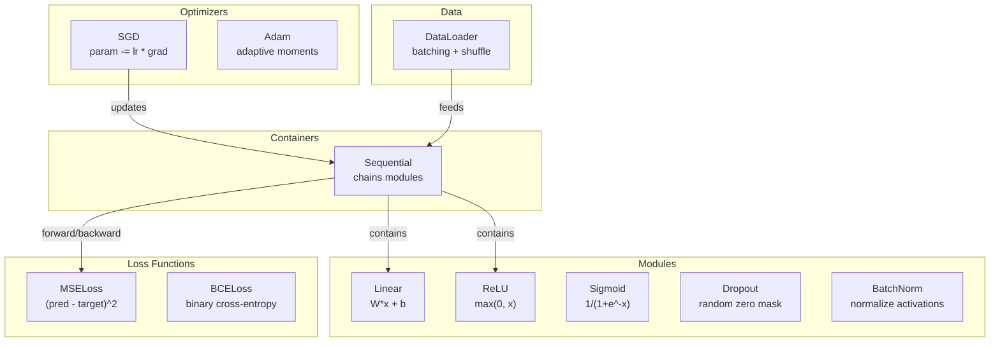
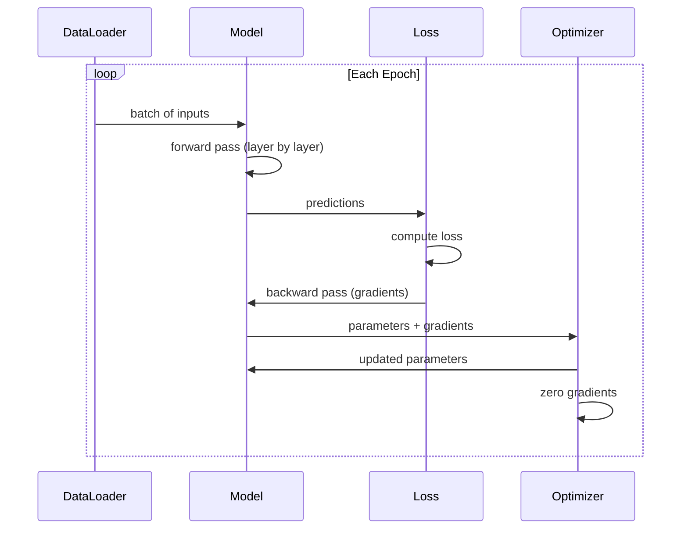
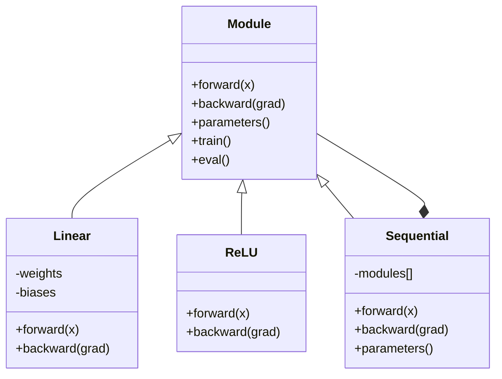

# 從零打造你自己的迷你框架

> 你已經打造過神經元、層、網路、反向傳播、激活函式、損失函式、最佳化器、正則化、初始化，還有學習率排程。全都是各自獨立的零件。現在把它們接成一個框架。不是 PyTorch，不是 TensorFlow，是你的。

**類型：** 實作
**程式語言：** Python
**先修單元：** 階段 3 的全部內容（單元 01-09）
**時間：** 約 120 分鐘

## 學習目標

- 打造一個完整的深度學習框架（約 500 行），含 Module、Linear、ReLU、Sigmoid、Dropout、BatchNorm、Sequential、損失函式、最佳化器與 DataLoader
- 說明 Module 這層抽象（forward、backward、parameters），以及為什麼必須能在 train／eval 模式間切換
- 把所有元件接成一個能跑的訓練迴圈，用它在圓形分類上訓練一個 4 層網路
- 把你框架裡的每個元件對應到 PyTorch 的對等物（nn.Module、nn.Sequential、optim.Adam、DataLoader）

## 問題所在

你有十個單元的積木，散落在各自的檔案裡。`Value` 類別在這邊，訓練迴圈在那邊，權重初始化在另一個檔案，學習率排程又在別的地方。想訓練一個網路，你得從五個不同單元複製貼上，再手動接起來。

這就是框架解決的事。PyTorch 給你 `nn.Module`、`nn.Sequential`、`optim.Adam`、`DataLoader`，以及一套把它們綁在一起的訓練迴圈範式。TensorFlow 給你 `keras.Layer`、`keras.Sequential`、`keras.optimizers.Adam`。這些都不是魔法，它們是一種組織方式，讓你能定義、訓練、評估網路，而不必每次都把管線重造一遍。

你要用大約 500 行 Python 打造同樣的東西。不用 numpy，不用任何外部依賴。這個框架能定義任何前饋網路，用 SGD 或 Adam 訓練它，把資料切成批次，套用 dropout 與批次正規化，用任何激活函式，還能排程學習率。

做完之後，你會確切知道在 PyTorch 裡寫 `model = nn.Sequential(...)` 時發生了什麼；會知道 `model.train()` 與 `model.eval()` 為什麼存在；會知道 `optimizer.zero_grad()` 為什麼是獨立的一次呼叫。你會全部弄懂，因為全部都是你自己蓋的。

## 核心概念

### Module 這層抽象

PyTorch 裡每一層都繼承自 `nn.Module`。一個 Module 有三項職責：

1. **forward()** —— 給定輸入算出輸出
2. **parameters()** —— 回傳所有可訓練的權重
3. **backward()** —— 算出梯度（PyTorch 交給 autograd 處理，我們這裡明寫出來）

Linear 層是一個 Module。ReLU 激活是一個 Module。dropout 層是一個 Module。批次正規化層是一個 Module。它們的介面完全一樣。

### Sequential 容器

`nn.Sequential` 把多個 Module 串起來。前向傳播：資料先過 Module 1，再過 Module 2，再過 Module 3。反向傳遞：把這條鏈倒著走。容器本身也是一個 Module —— 它同樣有 forward()、parameters() 與 backward()。這就是組合模式：一串 Module 本身就是一個 Module。

### 訓練模式與評估模式

Dropout 在訓練時隨機把神經元歸零，但在評估時讓所有值原封不動通過。批次正規化在訓練時用批次統計量，在評估時用移動平均。`train()` 與 `eval()` 這兩個方法就是在切換這個行為。每個 Module 都有一個 `training` 旗標。

### 最佳化器

最佳化器用參數的梯度來更新參數。SGD：`param -= lr * grad`。Adam：維護動量與變異數的估計值，再做更新。最佳化器完全不知道網路架構長什麼樣 —— 它只看到一份扁平的參數清單和它們的梯度。

### DataLoader

分批次有兩個理由。第一，問題一大，整份資料集根本塞不進記憶體。第二，小批次梯度下降帶來的雜訊有助於跳出局部極小值。DataLoader 把資料切成批次，並可選擇在每個 epoch 之間打亂順序。

### 框架架構



### 訓練迴圈



### Module 的繼承關係



```figure
gradient-clipping
```

## 動手實作

### 步驟 1：Module 基底類別

每一層都要實作的抽象介面。

```python
class Module:
    def __init__(self):
        self.training = True

    def forward(self, x):
        raise NotImplementedError

    def backward(self, grad):
        raise NotImplementedError

    def parameters(self):
        return []

    def train(self):
        self.training = True

    def eval(self):
        self.training = False
```

### 步驟 2：Linear 層

最基本的積木。存住權重與偏差項，前向算出 Wx + b，反向算出權重梯度與輸入梯度。

```python
import math
import random


class Linear(Module):
    def __init__(self, fan_in, fan_out):
        super().__init__()
        std = math.sqrt(2.0 / fan_in)
        self.weights = [[random.gauss(0, std) for _ in range(fan_in)] for _ in range(fan_out)]
        self.biases = [0.0] * fan_out
        self.weight_grads = [[0.0] * fan_in for _ in range(fan_out)]
        self.bias_grads = [0.0] * fan_out
        self.fan_in = fan_in
        self.fan_out = fan_out
        self.input = None

    def forward(self, x):
        self.input = x
        output = []
        for i in range(self.fan_out):
            val = self.biases[i]
            for j in range(self.fan_in):
                val += self.weights[i][j] * x[j]
            output.append(val)
        return output

    def backward(self, grad):
        input_grad = [0.0] * self.fan_in
        for i in range(self.fan_out):
            self.bias_grads[i] += grad[i]
            for j in range(self.fan_in):
                self.weight_grads[i][j] += grad[i] * self.input[j]
                input_grad[j] += grad[i] * self.weights[i][j]
        return input_grad

    def parameters(self):
        params = []
        for i in range(self.fan_out):
            for j in range(self.fan_in):
                params.append((self.weights, i, j, self.weight_grads))
            params.append((self.biases, i, None, self.bias_grads))
        return params
```

### 步驟 3：激活函式 Module

把 ReLU、Sigmoid、Tanh 都寫成 Module。每一個都會把反向傳遞需要的東西快取起來。

```python
class ReLU(Module):
    def __init__(self):
        super().__init__()
        self.mask = None

    def forward(self, x):
        self.mask = [1.0 if v > 0 else 0.0 for v in x]
        return [max(0.0, v) for v in x]

    def backward(self, grad):
        return [g * m for g, m in zip(grad, self.mask)]


class Sigmoid(Module):
    def __init__(self):
        super().__init__()
        self.output = None

    def forward(self, x):
        self.output = []
        for v in x:
            v = max(-500, min(500, v))
            self.output.append(1.0 / (1.0 + math.exp(-v)))
        return self.output

    def backward(self, grad):
        return [g * o * (1 - o) for g, o in zip(grad, self.output)]


class Tanh(Module):
    def __init__(self):
        super().__init__()
        self.output = None

    def forward(self, x):
        self.output = [math.tanh(v) for v in x]
        return self.output

    def backward(self, grad):
        return [g * (1 - o * o) for g, o in zip(grad, self.output)]
```

### 步驟 4：Dropout Module

訓練時隨機把元素歸零，並把留下來的元素乘上 1/(1-p)，讓期望值維持不變。評估時什麼都不做。

```python
class Dropout(Module):
    def __init__(self, p=0.5):
        super().__init__()
        self.p = p
        self.mask = None

    def forward(self, x):
        if not self.training:
            return x
        self.mask = [0.0 if random.random() < self.p else 1.0 / (1 - self.p) for _ in x]
        return [v * m for v, m in zip(x, self.mask)]

    def backward(self, grad):
        if self.mask is None:
            return grad
        return [g * m for g, m in zip(grad, self.mask)]
```

### 步驟 5：BatchNorm Module

在整個批次上，逐特徵把激活值正規化成零均值、單位變異數。同時維護一組移動統計量供 eval 模式使用。

```python
class BatchNorm(Module):
    def __init__(self, size, momentum=0.1, eps=1e-5):
        super().__init__()
        self.size = size
        self.gamma = [1.0] * size
        self.beta = [0.0] * size
        self.gamma_grads = [0.0] * size
        self.beta_grads = [0.0] * size
        self.running_mean = [0.0] * size
        self.running_var = [1.0] * size
        self.momentum = momentum
        self.eps = eps
        self.x_norm = None
        self.std_inv = None
        self.batch_input = None

    def forward_batch(self, batch):
        batch_size = len(batch)
        output_batch = []

        if self.training:
            mean = [0.0] * self.size
            for sample in batch:
                for j in range(self.size):
                    mean[j] += sample[j]
            mean = [m / batch_size for m in mean]

            var = [0.0] * self.size
            for sample in batch:
                for j in range(self.size):
                    var[j] += (sample[j] - mean[j]) ** 2
            var = [v / batch_size for v in var]

            self.std_inv = [1.0 / math.sqrt(v + self.eps) for v in var]

            self.x_norm = []
            self.batch_input = batch
            for sample in batch:
                normed = [(sample[j] - mean[j]) * self.std_inv[j] for j in range(self.size)]
                self.x_norm.append(normed)
                output = [self.gamma[j] * normed[j] + self.beta[j] for j in range(self.size)]
                output_batch.append(output)

            for j in range(self.size):
                self.running_mean[j] = (1 - self.momentum) * self.running_mean[j] + self.momentum * mean[j]
                self.running_var[j] = (1 - self.momentum) * self.running_var[j] + self.momentum * var[j]
        else:
            std_inv = [1.0 / math.sqrt(v + self.eps) for v in self.running_var]
            for sample in batch:
                normed = [(sample[j] - self.running_mean[j]) * std_inv[j] for j in range(self.size)]
                output = [self.gamma[j] * normed[j] + self.beta[j] for j in range(self.size)]
                output_batch.append(output)

        return output_batch

    def forward(self, x):
        result = self.forward_batch([x])
        return result[0]

    def backward(self, grad):
        if self.x_norm is None:
            return grad
        for j in range(self.size):
            self.gamma_grads[j] += self.x_norm[0][j] * grad[j]
            self.beta_grads[j] += grad[j]
        return [grad[j] * self.gamma[j] * self.std_inv[j] for j in range(self.size)]

    def parameters(self):
        params = []
        for j in range(self.size):
            params.append((self.gamma, j, None, self.gamma_grads))
            params.append((self.beta, j, None, self.beta_grads))
        return params
```

### 步驟 6：Sequential 容器

把多個模組串起來。前向從左往右走，反向從右往左走。

```python
class Sequential(Module):
    def __init__(self, *modules):
        super().__init__()
        self.modules = list(modules)

    def forward(self, x):
        for module in self.modules:
            x = module.forward(x)
        return x

    def backward(self, grad):
        for module in reversed(self.modules):
            grad = module.backward(grad)
        return grad

    def parameters(self):
        params = []
        for module in self.modules:
            params.extend(module.parameters())
        return params

    def train(self):
        self.training = True
        for module in self.modules:
            module.train()

    def eval(self):
        self.training = False
        for module in self.modules:
            module.eval()
```

### 步驟 7：損失函式

MSE 與二元交叉熵。每一個都回傳損失值，並提供一個回傳梯度的 backward()。

```python
class MSELoss:
    def __call__(self, predicted, target):
        self.predicted = predicted
        self.target = target
        n = len(predicted)
        self.loss = sum((p - t) ** 2 for p, t in zip(predicted, target)) / n
        return self.loss

    def backward(self):
        n = len(self.predicted)
        return [2 * (p - t) / n for p, t in zip(self.predicted, self.target)]


class BCELoss:
    def __call__(self, predicted, target):
        self.predicted = predicted
        self.target = target
        eps = 1e-7
        n = len(predicted)
        self.loss = 0
        for p, t in zip(predicted, target):
            p = max(eps, min(1 - eps, p))
            self.loss += -(t * math.log(p) + (1 - t) * math.log(1 - p))
        self.loss /= n
        return self.loss

    def backward(self):
        eps = 1e-7
        n = len(self.predicted)
        grads = []
        for p, t in zip(self.predicted, self.target):
            p = max(eps, min(1 - eps, p))
            grads.append((-t / p + (1 - t) / (1 - p)) / n)
        return grads
```

### 步驟 8：SGD 與 Adam 最佳化器

兩者都接收一份參數清單，並用梯度更新權重。

```python
class SGD:
    def __init__(self, parameters, lr=0.01):
        self.params = parameters
        self.lr = lr

    def step(self):
        for container, i, j, grad_container in self.params:
            if j is not None:
                container[i][j] -= self.lr * grad_container[i][j]
            else:
                container[i] -= self.lr * grad_container[i]

    def zero_grad(self):
        for container, i, j, grad_container in self.params:
            if j is not None:
                grad_container[i][j] = 0.0
            else:
                grad_container[i] = 0.0


class Adam:
    def __init__(self, parameters, lr=0.001, beta1=0.9, beta2=0.999, eps=1e-8):
        self.params = parameters
        self.lr = lr
        self.beta1 = beta1
        self.beta2 = beta2
        self.eps = eps
        self.t = 0
        self.m = [0.0] * len(parameters)
        self.v = [0.0] * len(parameters)

    def step(self):
        self.t += 1
        for idx, (container, i, j, grad_container) in enumerate(self.params):
            if j is not None:
                g = grad_container[i][j]
            else:
                g = grad_container[i]

            self.m[idx] = self.beta1 * self.m[idx] + (1 - self.beta1) * g
            self.v[idx] = self.beta2 * self.v[idx] + (1 - self.beta2) * g * g

            m_hat = self.m[idx] / (1 - self.beta1 ** self.t)
            v_hat = self.v[idx] / (1 - self.beta2 ** self.t)

            update = self.lr * m_hat / (math.sqrt(v_hat) + self.eps)

            if j is not None:
                container[i][j] -= update
            else:
                container[i] -= update

    def zero_grad(self):
        for container, i, j, grad_container in self.params:
            if j is not None:
                grad_container[i][j] = 0.0
            else:
                grad_container[i] = 0.0
```

### 步驟 9：DataLoader

把資料切成批次，並可選擇每個 epoch 都打亂順序。

```python
class DataLoader:
    def __init__(self, data, batch_size=32, shuffle=True):
        self.data = data
        self.batch_size = batch_size
        self.shuffle = shuffle

    def __iter__(self):
        indices = list(range(len(self.data)))
        if self.shuffle:
            random.shuffle(indices)
        for start in range(0, len(indices), self.batch_size):
            batch_indices = indices[start:start + self.batch_size]
            batch = [self.data[i] for i in batch_indices]
            inputs = [item[0] for item in batch]
            targets = [item[1] for item in batch]
            yield inputs, targets

    def __len__(self):
        return (len(self.data) + self.batch_size - 1) // self.batch_size
```

### 步驟 10：在圓形分類上訓練一個 4 層網路

把所有東西接起來。定義模型、挑一個損失函式、挑一個最佳化器，然後跑訓練迴圈。

```python
def make_circle_data(n=500, seed=42):
    random.seed(seed)
    data = []
    for _ in range(n):
        x = random.uniform(-2, 2)
        y = random.uniform(-2, 2)
        label = 1.0 if x * x + y * y < 1.5 else 0.0
        data.append(([x, y], [label]))
    return data


def train():
    random.seed(42)

    model = Sequential(
        Linear(2, 16),
        ReLU(),
        Linear(16, 16),
        ReLU(),
        Linear(16, 8),
        ReLU(),
        Linear(8, 1),
        Sigmoid(),
    )

    criterion = BCELoss()
    optimizer = Adam(model.parameters(), lr=0.01)

    data = make_circle_data(500)
    split = int(len(data) * 0.8)
    train_data = data[:split]
    test_data = data[split:]

    loader = DataLoader(train_data, batch_size=16, shuffle=True)

    model.train()

    for epoch in range(100):
        total_loss = 0
        total_correct = 0
        total_samples = 0

        for batch_inputs, batch_targets in loader:
            batch_loss = 0
            for x, t in zip(batch_inputs, batch_targets):
                pred = model.forward(x)
                loss = criterion(pred, t)
                batch_loss += loss

                optimizer.zero_grad()
                grad = criterion.backward()
                model.backward(grad)
                optimizer.step()

                predicted_class = 1.0 if pred[0] >= 0.5 else 0.0
                if predicted_class == t[0]:
                    total_correct += 1
                total_samples += 1

            total_loss += batch_loss

        avg_loss = total_loss / total_samples
        accuracy = total_correct / total_samples * 100

        if epoch % 10 == 0 or epoch == 99:
            print(f"Epoch {epoch:3d} | Loss: {avg_loss:.6f} | Train Accuracy: {accuracy:.1f}%")

    model.eval()
    correct = 0
    for x, t in test_data:
        pred = model.forward(x)
        predicted_class = 1.0 if pred[0] >= 0.5 else 0.0
        if predicted_class == t[0]:
            correct += 1
    test_accuracy = correct / len(test_data) * 100
    print(f"\nTest Accuracy: {test_accuracy:.1f}% ({correct}/{len(test_data)})")

    return model, test_accuracy
```

## 框架應用

以下是你剛剛打造的東西在 PyTorch 裡的對等寫法：

```python
import torch
import torch.nn as nn
from torch.utils.data import DataLoader, TensorDataset

model = nn.Sequential(
    nn.Linear(2, 16),
    nn.ReLU(),
    nn.Linear(16, 16),
    nn.ReLU(),
    nn.Linear(16, 8),
    nn.ReLU(),
    nn.Linear(8, 1),
    nn.Sigmoid(),
)

criterion = nn.BCELoss()
optimizer = torch.optim.Adam(model.parameters(), lr=0.01)

for epoch in range(100):
    model.train()
    for inputs, targets in dataloader:
        optimizer.zero_grad()
        predictions = model(inputs)
        loss = criterion(predictions, targets)
        loss.backward()
        optimizer.step()

    model.eval()
    with torch.no_grad():
        test_predictions = model(test_inputs)
```

結構一模一樣。`Sequential`、`Linear`、`ReLU`、`Sigmoid`、`BCELoss`、`Adam`、`zero_grad`、`backward`、`step`、`train`、`eval`，每個概念都一對一對得上。差別在於 PyTorch 自動處理 autograd（不必在每個模組裡實作 backward()）、能跑在 GPU 上，而且被最佳化了好幾年。但骨架是同一套。

從現在起你看到 PyTorch 程式碼，會確切知道每一行在做什麼。這份理解就是這個單元的全部意義。

## 產出交付

本單元會產出：
- `outputs/prompt-framework-architect.md` —— 一個提示詞，用框架的抽象概念來設計神經網路架構

## 練習

1. 加一個 `SoftmaxCrossEntropyLoss` 類別做多類別分類。對預測值取 softmax、算交叉熵損失，並處理合併後的反向傳遞。用一組 3 類別的螺旋資料集測試它。

2. 在最佳化器裡實作學習率排程：加一個 `set_lr()` 方法，把單元 09 的餘弦排程接進來。用 warmup + 餘弦訓練圓形分類器，跟固定學習率比較。

3. 為 Sequential 加上 `save()` 與 `load()` 方法，把所有權重序列化成 JSON 檔案，再讀回來。驗證讀回來的模型能產生跟原本一樣的預測。

4. 在 Adam 最佳化器裡實作權重衰減（L2 正則化）。加一個 `weight_decay` 參數，每一步都把權重往零收縮。比較 decay=0 與 decay=0.01 的訓練結果。

5. 把逐樣本的訓練迴圈換成正規的小批次梯度累積：把一個批次裡所有樣本的梯度累積起來，再除以批次大小，然後做一次最佳化器更新。量測這樣會不會改變收斂速度。

## 關鍵術語

| 術語 | 大家怎麼說 | 實際上是什麼 |
|------|----------------|----------------------|
| Module（模組） | 「一層」 | 框架裡最基礎的抽象 —— 任何具備 forward()、backward() 與 parameters() 的東西 |
| Sequential | 「照順序疊層」 | 一個容器，把模組串起來：前向依序套用，反向倒著套用 |
| 前向傳播 | 「跑一次網路」 | 讓輸入依序穿過每個模組，算出輸出 |
| 反向傳遞 | 「算梯度」 | 讓損失的梯度反向穿過每個模組，算出各參數的梯度 |
| 參數 | 「可訓練的權重」 | 網路裡所有最佳化器能更新的值 —— 權重與偏差項 |
| 最佳化器 | 「更新權重的那個東西」 | 一套用梯度更新參數的演算法，實作 SGD、Adam 或其他規則 |
| DataLoader | 「餵資料的那個東西」 | 一個迭代器，把資料集切成批次，並可在 epoch 之間打亂順序 |
| 訓練模式 | 「model.train()」 | 一個旗標，啟用像 dropout、以及用批次統計量的批次正規化這類隨機行為 |
| 評估模式 | 「model.eval()」 | 一個旗標，關掉 dropout，並讓批次正規化改用移動統計量 |
| Zero grad | 「把梯度清掉」 | 在算下一個批次的梯度之前，把所有參數梯度歸零 |

## 延伸閱讀

- Paszke et al., "PyTorch: An Imperative Style, High-Performance Deep Learning Library" (2019) —— 說明 PyTorch 設計決策的那篇論文
- Chollet, "Deep Learning with Python, Second Edition" (2021) —— 第 3 章用同一套 module／layer 抽象講解 Keras 的內部運作
- Johnson, "Tiny-DNN" (https://github.com/tiny-dnn/tiny-dnn) —— 一個純標頭檔的 C++ 深度學習框架，適合用來理解框架內部
