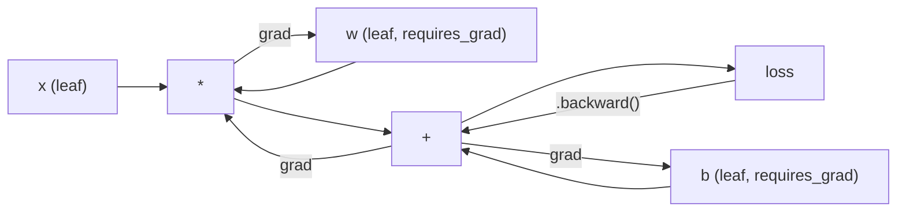
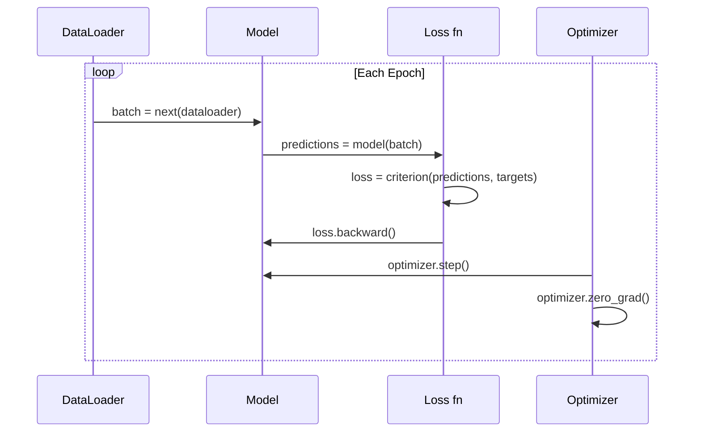

# PyTorch 入門

> 你已經從活塞和曲軸開始造出一具引擎。現在來學大家真正開上路的那一具。

**類型：** 實作
**程式語言：** Python
**先修單元：** 階段 3 · 10（打造你自己的迷你框架）
**時間：** 約 75 分鐘

## 學習目標

- 用 PyTorch 的 nn.Module、nn.Sequential 與 autograd 建立並訓練神經網路
- 使用 PyTorch 張量、GPU 加速，以及標準的訓練迴圈（zero_grad、前向傳播、損失、反向傳遞、step）
- 把你從零寫的迷你框架元件，一一對應到 PyTorch 的等價物
- 在同一個任務上量測並比較純 Python 框架與 PyTorch 的訓練速度

## 問題所在

你有一個能跑的迷你框架。全連接層、ReLU、dropout、batch norm、Adam、一個 DataLoader、一個訓練迴圈。它用純 Python 在一個圓形分類問題上訓練一個 4 層網路。

它在同一個問題上也比 PyTorch 慢 500 倍。

你的迷你框架用嵌套的 Python 迴圈一次處理一個樣本。PyTorch 把同樣的運算派送到最佳化過的 C++/CUDA kernel，在 GPU 上跑。在單張 NVIDIA A100 上，PyTorch 用大約 6 小時就能在 ImageNet（1.28M 張圖片）上訓練完一個 ResNet-50（25.6M 個參數）。你的框架做同一件事大概要 3,000 小時——如果它沒先把記憶體吃光的話。

速度不是唯一的差距。你的框架沒有 GPU 支援。沒有自動微分——每個模組的 backward() 都是你自己手寫的。沒有序列化。沒有分散式訓練。沒有混合精度。除了塞 print 之外，沒有辦法檢查梯度怎麼流的。

PyTorch 把上面每一個洞都補上了。而且它是在維持你已經建好的那套心智模型的前提下補的：Module、forward()、parameters()、backward()、optimizer.step()。概念一對一對得上。語法幾乎一樣。差別在於 PyTorch 用你自己從零設計出來的同一套介面，包住了十年的系統工程。

## 核心概念

### PyTorch 為什麼贏

2015 年的 TensorFlow 要求你在跑任何東西之前，先定義一張靜態的計算圖。你先把圖建好，編譯，然後才把資料餵進去。除錯意味著盯著圖的視覺化看。改架構意味著把圖整個重建一次。

PyTorch 在 2017 年帶著另一種哲學登場：動態圖的即時執行（eager execution）。你寫 Python，它馬上就跑。`y = model(x)` 是現在真的把 y 算出來，不是「往一張稍後才會算出 y 的圖上加一個節點」。這代表標準的 Python 除錯工具全都能用。print() 能用。pdb 能用。forward 裡的 if/else 能用。

到了 2020 年，市場已經表態了。PyTorch 在 ML 研究論文裡的佔比，從 7%（2017）漲到超過 75%（2022）。Meta、Google DeepMind、OpenAI、Anthropic 與 Hugging Face 全都以 PyTorch 為主要框架。TensorFlow 2.x 也因此改採動態圖執行——這等於默認了 PyTorch 的設計是對的。

這一課是：開發體驗會複利。一個慢 10%、但除錯快 50% 的框架，每一次都贏。

### 張量

張量是一個多維陣列，有三個關鍵屬性：形狀（shape）、資料型別（dtype）與裝置（device）。

```python
import torch

x = torch.zeros(3, 4)           # shape: (3, 4), dtype: float32, device: cpu
x = torch.randn(2, 3, 224, 224) # batch of 2 RGB images, 224x224
x = torch.tensor([1, 2, 3])     # from a Python list
```

**形狀**就是維度結構。純量的形狀是 ()，向量是 (n,)，矩陣是 (m, n)，一批圖片是 (batch, channels, height, width)。

**Dtype** 決定精度與記憶體用量。

| dtype | 位元數 | 範圍 | 用途 |
|-------|------|-------|----------|
| float32 | 32 | 約 7 位十進位數字 | 預設的訓練型別 |
| float16 | 16 | 約 3.3 位十進位數字 | 混合精度 |
| bfloat16 | 16 | 範圍與 float32 相同，精度較低 | LLM 訓練 |
| int8 | 8 | -128 到 127 | 量化推論 |

**裝置**決定運算在哪裡發生。

```python
device = torch.device("cuda" if torch.cuda.is_available() else "cpu")
x = torch.randn(3, 4, device=device)
x = x.to("cuda")
x = x.cpu()
```

每一個運算都要求所有張量在同一個裝置上。這是初學者撞到的第一名 PyTorch 錯誤：`RuntimeError: Expected all tensors to be on the same device`。修法是在運算之前把所有東西都搬到同一個裝置。

**重塑**是常數時間的——它改的是中介資料，不是資料本身。

```python
x = torch.randn(2, 3, 4)
x.view(2, 12)      # reshape to (2, 12) -- must be contiguous
x.reshape(6, 4)    # reshape to (6, 4) -- works always
x.permute(2, 0, 1) # reorder dimensions
x.unsqueeze(0)     # add dimension: (1, 2, 3, 4)
x.squeeze()        # remove size-1 dimensions
```

### Autograd

你的迷你框架要求你為每個模組實作 backward()。PyTorch 不用。它把張量上的每一個運算記錄成一張有向無環圖（也就是計算圖），然後反向走過那張圖，自動算出梯度。



跟你的框架最關鍵的差別：PyTorch 用的是以磁帶（tape）為基礎的自動微分。前向傳播時，每一個運算都往「磁帶」上追加一筆。呼叫 `.backward()` 就是把磁帶反向重播一次。

```python
x = torch.randn(3, requires_grad=True)
y = x ** 2 + 3 * x
z = y.sum()
z.backward()
print(x.grad)  # dz/dx = 2x + 3
```

autograd 的三條規則：

1. 只有 `requires_grad=True` 的葉節點張量會累積梯度
2. 梯度預設是累加的——每次反向傳遞之前要先呼叫 `optimizer.zero_grad()`
3. `torch.no_grad()` 會關掉梯度追蹤（評估時使用）

### nn.Module

`nn.Module` 是 PyTorch 裡每一個神經網路元件的基底類別。這個抽象你在單元 10 已經自己做過一次了。PyTorch 的版本多了自動參數註冊、遞迴的子模組探索、裝置管理，以及 state dict 序列化。

```python
import torch.nn as nn

class MLP(nn.Module):
    def __init__(self, input_dim, hidden_dim, output_dim):
        super().__init__()
        self.layer1 = nn.Linear(input_dim, hidden_dim)
        self.relu = nn.ReLU()
        self.layer2 = nn.Linear(hidden_dim, output_dim)

    def forward(self, x):
        x = self.layer1(x)
        x = self.relu(x)
        x = self.layer2(x)
        return x
```

當你在 `__init__` 裡把一個 `nn.Module` 或 `nn.Parameter` 指派成屬性時，PyTorch 就自動把它註冊起來。`model.parameters()` 會遞迴收集每一個註冊過的參數。這就是為什麼你再也不必像在迷你框架裡那樣手動去蒐集權重。

主要的積木：

| 模組 | 做什麼 | 參數量 |
|--------|-------------|------------|
| nn.Linear(in, out) | Wx + b | in*out + out |
| nn.Conv2d(in_ch, out_ch, k) | 二維卷積 | in_ch*out_ch*k*k + out_ch |
| nn.BatchNorm1d(features) | 正規化激活值 | 2 * features |
| nn.Dropout(p) | 隨機歸零 | 0 |
| nn.ReLU() | max(0, x) | 0 |
| nn.GELU() | 高斯誤差線性單元 | 0 |
| nn.Embedding(vocab, dim) | 查表 | vocab * dim |
| nn.LayerNorm(dim) | 逐樣本正規化 | 2 * dim |

### 損失函式與最佳化器

你自己做過的每一樣東西，PyTorch 都附上了生產級的版本。

**損失函式**（來自 `torch.nn`）：

| 損失函式 | 任務 | 輸入 |
|------|------|-------|
| nn.MSELoss() | 迴歸 | 任意形狀 |
| nn.CrossEntropyLoss() | 多類別分類 | logits（不是 softmax 之後） |
| nn.BCEWithLogitsLoss() | 二元分類 | logits（不是 sigmoid 之後） |
| nn.L1Loss() | 迴歸（較穩健） | 任意形狀 |
| nn.CTCLoss() | 序列對齊 | 對數機率 |

注意：`CrossEntropyLoss` 內部已經把 `LogSoftmax` + `NLLLoss` 合在一起了。要傳原始的 logits，不是 softmax 的輸出。這是個常見錯誤，而且會不聲不響地產生錯的梯度。

**最佳化器**（來自 `torch.optim`）：

| 最佳化器 | 什麼時候用 | 典型 LR |
|-----------|-------------|-----------|
| SGD(params, lr, momentum) | CNN、已經調校好的流程 | 0.01--0.1 |
| Adam(params, lr) | 預設的起點 | 1e-3 |
| AdamW(params, lr, weight_decay) | Transformer、微調 | 1e-4--1e-3 |
| LBFGS(params) | 小規模、二階方法 | 1.0 |

### 訓練迴圈

每一個 PyTorch 訓練迴圈都照著同樣的 5 步模式。你在單元 10 就已經知道了。



標準寫法：

```python
for epoch in range(num_epochs):
    model.train()
    for inputs, targets in train_loader:
        inputs, targets = inputs.to(device), targets.to(device)
        optimizer.zero_grad()
        outputs = model(inputs)
        loss = criterion(outputs, targets)
        loss.backward()
        optimizer.step()
```

批次迴圈裡五行。就是這五行訓練出了 GPT-4、Stable Diffusion 與 LLaMA。架構會變。資料會變。這五行不會。

### 資料集與資料載入器（Dataset 與 DataLoader）

PyTorch 的 `Dataset` 是一個抽象類別，只有兩個方法：`__len__` 與 `__getitem__`。`DataLoader` 把它包起來，補上批次化、洗牌與多行程的資料載入。

```python
from torch.utils.data import Dataset, DataLoader

class MNISTDataset(Dataset):
    def __init__(self, images, labels):
        self.images = images
        self.labels = labels

    def __len__(self):
        return len(self.labels)

    def __getitem__(self, idx):
        return self.images[idx], self.labels[idx]

loader = DataLoader(dataset, batch_size=64, shuffle=True, num_workers=4)
```

`num_workers=4` 會啟動 4 個行程，在 GPU 訓練當前批次的同時平行載入資料。碰到受磁碟 I/O 限制的工作負載（大圖片、音訊），光是這一項就可能讓訓練速度翻倍。

### GPU 訓練

把模型搬到 GPU：

```python
device = torch.device("cuda" if torch.cuda.is_available() else "cpu")
model = model.to(device)
```

這會遞迴把每一個參數與緩衝區搬到 GPU。接著訓練時把每一個批次也搬過去：

```python
inputs, targets = inputs.to(device), targets.to(device)
```

**混合精度**在現代 GPU（A100、H100、RTX 4090）上能把記憶體用量砍半、吞吐量加倍：前向與反向用 float16 跑，主權重仍然留在 float32：

```python
from torch.amp import autocast, GradScaler

scaler = GradScaler()
for inputs, targets in loader:
    with autocast(device_type="cuda"):
        outputs = model(inputs)
        loss = criterion(outputs, targets)
    scaler.scale(loss).backward()
    scaler.step(optimizer)
    scaler.update()
    optimizer.zero_grad()
```

### 對照：迷你框架 vs PyTorch vs JAX

| 特性 | 迷你框架（L10） | PyTorch | JAX |
|---------|---------------------|---------|-----|
| 自動微分 | 手寫 backward() | 磁帶式 autograd | 函式式轉換 |
| 執行方式 | 動態圖（Python 迴圈） | 動態圖（C++ kernel） | 先追蹤再 JIT 編譯 |
| GPU 支援 | 無 | 有（CUDA、ROCm、MPS） | 有（CUDA、TPU） |
| 速度（MNIST MLP） | ~300s/epoch | ~0.5s/epoch | ~0.3s/epoch |
| 模組系統 | 自訂的 Module 類別 | nn.Module | 無狀態函式（Flax/Equinox） |
| 除錯 | print() | print()、pdb、breakpoint() | 較難（JIT 追蹤讓 print 失效） |
| 生態系 | 沒有 | Hugging Face、Lightning、timm | Flax、Optax、Orbax |
| 學習曲線 | 你自己寫的 | 中等 | 陡（函式式範式） |
| 生產環境 | 玩具問題 | Meta、OpenAI、Anthropic、HF | Google DeepMind、Midjourney |

```figure
dropout-mask
```

## 動手實作

一個只用 PyTorch 原生元件、在 MNIST 上訓練的 3 層 MLP。沒有高階包裝。不用 `torchvision.datasets`。原始資料我們自己下載、自己解析。

### 步驟 1：從原始檔案載入 MNIST

MNIST 以 4 個 gzip 檔發布：訓練圖片（60,000 x 28 x 28）、訓練標籤、測試圖片（10,000 x 28 x 28）、測試標籤。我們把它們下載下來，解析那個二進位格式。

```python
import torch
import torch.nn as nn
import struct
import gzip
import urllib.request
import os

def download_mnist(path="./mnist_data"):
    base_url = "https://storage.googleapis.com/cvdf-datasets/mnist/"
    files = [
        "train-images-idx3-ubyte.gz",
        "train-labels-idx1-ubyte.gz",
        "t10k-images-idx3-ubyte.gz",
        "t10k-labels-idx1-ubyte.gz",
    ]
    os.makedirs(path, exist_ok=True)
    for f in files:
        filepath = os.path.join(path, f)
        if not os.path.exists(filepath):
            urllib.request.urlretrieve(base_url + f, filepath)

def load_images(filepath):
    with gzip.open(filepath, "rb") as f:
        magic, num, rows, cols = struct.unpack(">IIII", f.read(16))
        data = f.read()
        images = torch.frombuffer(bytearray(data), dtype=torch.uint8)
        images = images.reshape(num, rows * cols).float() / 255.0
    return images

def load_labels(filepath):
    with gzip.open(filepath, "rb") as f:
        magic, num = struct.unpack(">II", f.read(8))
        data = f.read()
        labels = torch.frombuffer(bytearray(data), dtype=torch.uint8).long()
    return labels
```

### 步驟 2：定義模型

一個 3 層 MLP：784 -> 256 -> 128 -> 10。ReLU 激活。用 dropout 做正則化。為了保持簡單，不放 batch norm。

```python
class MNISTModel(nn.Module):
    def __init__(self):
        super().__init__()
        self.net = nn.Sequential(
            nn.Linear(784, 256),
            nn.ReLU(),
            nn.Dropout(0.2),
            nn.Linear(256, 128),
            nn.ReLU(),
            nn.Dropout(0.2),
            nn.Linear(128, 10),
        )

    def forward(self, x):
        return self.net(x)
```

輸出層產生 10 個原始 logits（每個數字一個）。不接 softmax——`CrossEntropyLoss` 內部會處理。

參數量：784*256 + 256 + 256*128 + 128 + 128*10 + 10 = 235,146。以現代標準來說小得可以。GPT-2 small 有 124M。這個幾秒鐘就訓練完了。

### 步驟 3：訓練迴圈

標準的 forward-loss-backward-step 模式。

```python
def train_one_epoch(model, loader, criterion, optimizer, device):
    model.train()
    total_loss = 0
    correct = 0
    total = 0
    for images, labels in loader:
        images, labels = images.to(device), labels.to(device)
        optimizer.zero_grad()
        outputs = model(images)
        loss = criterion(outputs, labels)
        loss.backward()
        optimizer.step()
        total_loss += loss.item() * images.size(0)
        _, predicted = outputs.max(1)
        correct += predicted.eq(labels).sum().item()
        total += labels.size(0)
    return total_loss / total, correct / total


def evaluate(model, loader, criterion, device):
    model.eval()
    total_loss = 0
    correct = 0
    total = 0
    with torch.no_grad():
        for images, labels in loader:
            images, labels = images.to(device), labels.to(device)
            outputs = model(images)
            loss = criterion(outputs, labels)
            total_loss += loss.item() * images.size(0)
            _, predicted = outputs.max(1)
            correct += predicted.eq(labels).sum().item()
            total += labels.size(0)
    return total_loss / total, correct / total
```

注意評估時的 `torch.no_grad()`。它會關掉 autograd，降低記憶體用量、加快推論。沒有它，PyTorch 會建出一張你根本用不到的計算圖。

### 步驟 4：把所有東西接起來

```python
def main():
    device = torch.device("cuda" if torch.cuda.is_available() else "cpu")

    download_mnist()
    train_images = load_images("./mnist_data/train-images-idx3-ubyte.gz")
    train_labels = load_labels("./mnist_data/train-labels-idx1-ubyte.gz")
    test_images = load_images("./mnist_data/t10k-images-idx3-ubyte.gz")
    test_labels = load_labels("./mnist_data/t10k-labels-idx1-ubyte.gz")

    train_dataset = torch.utils.data.TensorDataset(train_images, train_labels)
    test_dataset = torch.utils.data.TensorDataset(test_images, test_labels)
    train_loader = torch.utils.data.DataLoader(
        train_dataset, batch_size=64, shuffle=True
    )
    test_loader = torch.utils.data.DataLoader(
        test_dataset, batch_size=256, shuffle=False
    )

    model = MNISTModel().to(device)
    criterion = nn.CrossEntropyLoss()
    optimizer = torch.optim.Adam(model.parameters(), lr=1e-3)

    num_params = sum(p.numel() for p in model.parameters())
    print(f"Device: {device}")
    print(f"Parameters: {num_params:,}")
    print(f"Train samples: {len(train_dataset):,}")
    print(f"Test samples: {len(test_dataset):,}")
    print()

    for epoch in range(10):
        train_loss, train_acc = train_one_epoch(
            model, train_loader, criterion, optimizer, device
        )
        test_loss, test_acc = evaluate(
            model, test_loader, criterion, device
        )
        print(
            f"Epoch {epoch+1:2d} | "
            f"Train Loss: {train_loss:.4f} | Train Acc: {train_acc:.4f} | "
            f"Test Loss: {test_loss:.4f} | Test Acc: {test_acc:.4f}"
        )

    torch.save(model.state_dict(), "mnist_mlp.pt")
    print(f"\nModel saved to mnist_mlp.pt")
    print(f"Final test accuracy: {test_acc:.4f}")
```

跑完 10 個 epoch 的預期輸出：測試準確率約 97.8%。CPU 上的訓練時間：約 30 秒。GPU 上：約 5 秒。用你的迷你框架跑同一個架構：約 45 分鐘。

## 框架應用

### 快速對照：迷你框架 vs PyTorch

| 迷你框架（單元 10） | PyTorch |
|---------------------------|---------|
| `model = Sequential(Linear(784, 256), ReLU(), ...)` | `model = nn.Sequential(nn.Linear(784, 256), nn.ReLU(), ...)` |
| `pred = model.forward(x)` | `pred = model(x)` |
| `optimizer.zero_grad()` | `optimizer.zero_grad()` |
| 先 `grad = criterion.backward()` 再 `model.backward(grad)` | `loss.backward()` |
| `optimizer.step()` | `optimizer.step()` |
| 沒有 GPU | `model.to("cuda")` |
| 每個模組都要手寫 backward | autograd 全部包辦 |

介面幾乎一模一樣。差別全在引擎蓋底下。

### 儲存與載入模型

```python
torch.save(model.state_dict(), "model.pt")

model = MNISTModel()
model.load_state_dict(torch.load("model.pt", weights_only=True))
model.eval()
```

存檢查點時一律存 `state_dict()`（也就是那份參數字典），不要存模型物件。存模型物件用的是 pickle，你一重構程式碼它就壞了。state dict 是可攜的。

### 學習率排程

```python
scheduler = torch.optim.lr_scheduler.CosineAnnealingLR(
    optimizer, T_max=10
)
for epoch in range(10):
    train_one_epoch(model, train_loader, criterion, optimizer, device)
    scheduler.step()
```

PyTorch 內建 15 種以上的排程器：StepLR、ExponentialLR、CosineAnnealingLR、OneCycleLR、ReduceLROnPlateau。全都接在同一套最佳化器介面上。

## 產出交付

這個單元會產出兩份成果：

- `outputs/prompt-pytorch-debugger.md` —— 一份用來診斷常見 PyTorch 訓練失敗的提示詞
- `outputs/skill-pytorch-patterns.md` —— 一份 PyTorch 訓練模式的技能參考

## 練習

1. **加上 batch normalization。** 在每個線性層之後（激活之前）插入 `nn.BatchNorm1d`。比較它與只用 dropout 的版本在測試準確率和訓練速度上的差別。batch norm 應該用更少的 epoch 就達到 98% 以上。

2. **實作一個學習率搜尋器。** 用指數遞增的學習率（從 1e-7 到 1.0）訓練一個 epoch。畫出損失對 LR 的圖。最佳 LR 就在損失開始往上爬之前。用這個方法為 MNIST 模型挑一個更好的 LR。

3. **移植到 GPU 並加上混合精度。** 在訓練迴圈裡加上 `torch.amp.autocast` 與 `GradScaler`。在 GPU 上量測有無混合精度的吞吐量（樣本／秒）。在 A100 上預期約 2 倍加速。

4. **打造一個自訂的 Dataset。** 下載 Fashion-MNIST（格式與 MNIST 相同，但內容是衣物）。實作一個帶 `__getitem__` 與 `__len__` 的 `FashionMNISTDataset(Dataset)` 類別。訓練同樣的 MLP 並比較準確率。Fashion-MNIST 比較難——預期約 88%，對比約 98%。

5. **把 Adam 換成 SGD + momentum。** 用 `SGD(params, lr=0.01, momentum=0.9)` 訓練。比較收斂曲線。然後加上 `CosineAnnealingLR` 排程器，看 SGD 到第 10 個 epoch 有沒有追上 Adam。

## 關鍵術語

| 術語 | 大家怎麼說 | 實際上是什麼 |
|------|----------------|----------------------|
| 張量 | 「一個多維陣列」 | 一個有型別、知道自己在哪個裝置上的陣列，而且每一個運算都內建了自動微分支援 |
| Autograd | 「自動反向傳播」 | 一套磁帶式系統：前向傳播時記下每個運算，然後反向重播，算出精確的梯度 |
| nn.Module | 「一層」 | 任何可微分計算區塊的基底類別——它註冊參數、支援嵌套、處理訓練／評估模式的切換 |
| state_dict | 「模型權重」 | 一個把參數名稱映射到張量的 OrderedDict——訓練好的模型那份可攜、可序列化的表示 |
| .backward() | 「算梯度」 | 反向走過計算圖，為每一個 requires_grad=True 的葉節點張量計算並累積梯度 |
| .to(device) | 「搬到 GPU」 | 遞迴把所有參數與緩衝區轉移到指定的裝置（CPU、CUDA、MPS） |
| DataLoader | 「資料流水線」 | 一個迭代器，負責從資料集批次化、洗牌，並可選擇平行化資料載入 |
| 混合精度 | 「用 float16」 | 前向／反向用 float16 換速度，同時保留 float32 的主權重維持數值穩定性 |
| 動態圖執行 | 「現在就跑」 | 運算一被呼叫就立刻執行，不延後到後面某個編譯階段——這就是 PyTorch 與 TF 1.x 最核心的設計分歧 |
| zero_grad | 「重設梯度」 | 在下一次反向傳遞之前把所有參數的梯度歸零，因為 PyTorch 預設是累加梯度的 |

## 延伸閱讀

- Paszke et al., "PyTorch: An Imperative Style, High-Performance Deep Learning Library" (2019) —— 解釋 PyTorch 設計取捨的原始論文
- PyTorch Tutorials: "Learning PyTorch with Examples" (https://pytorch.org/tutorials/beginner/pytorch_with_examples.html) —— 官方從張量走到 nn.Module 的路徑
- PyTorch Performance Tuning Guide (https://pytorch.org/tutorials/recipes/recipes/tuning_guide.html) —— 混合精度、DataLoader workers、pinned memory 與其他生產環境最佳化
- Horace He, "Making Deep Learning Go Brrrr" (https://horace.io/brrr_intro.html) —— GPU 訓練為什麼快，附 PyTorch 專屬的最佳化策略
