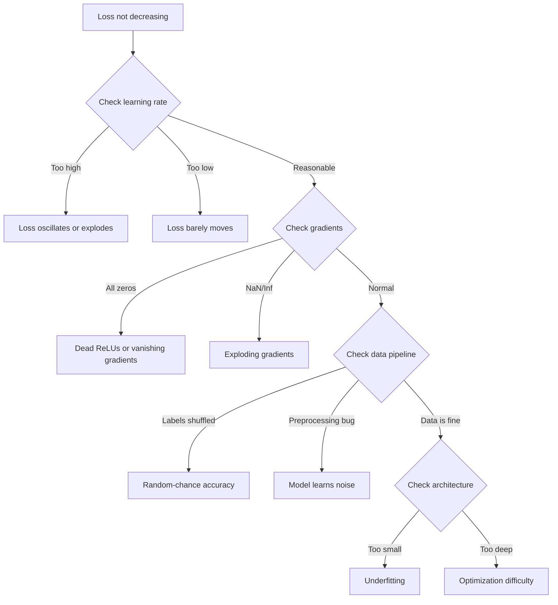
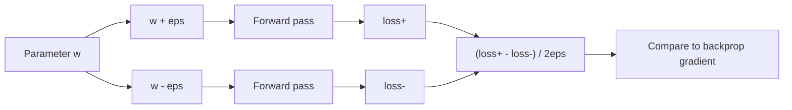
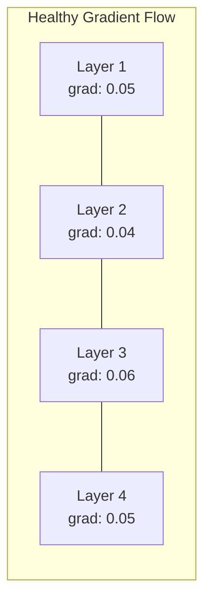
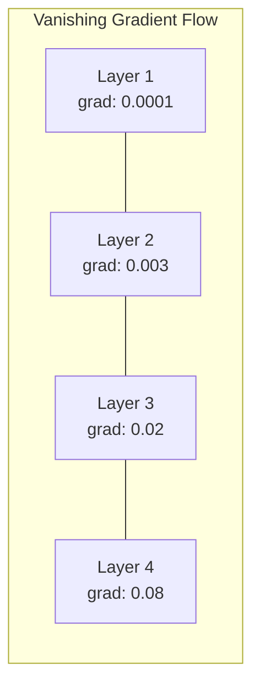
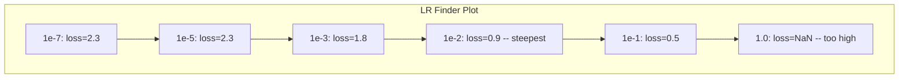

# 神經網路除錯

> 你的網路編譯過了。它跑起來了。它產出了一個數字。那個數字是錯的，而且什麼都沒掛掉。歡迎來到最難的一種除錯 —— 沒有錯誤訊息可看的那種。

**類型：** 實作
**程式語言：** Python, PyTorch
**先修單元：** 階段 03 · 單元 01-10（尤其是反向傳播、損失函式、最佳化器）
**時間：** 約 90 分鐘

## 學習目標

- 用系統性的除錯策略診斷常見的神經網路失敗（損失變成 NaN、損失曲線平坦、過度擬合、震盪）
- 用「過度擬合單一批次」的手法，驗證你的模型架構與訓練迴圈是正確的
- 檢視梯度大小、激活值分布與權重範數，辨認梯度消失／梯度爆炸的問題
- 建立一份除錯檢查清單，涵蓋資料流程、模型架構、損失函式、最佳化器與學習率的問題

## 問題所在

傳統軟體壞掉的時候會掛掉。空指標會丟出例外。型別不符在編譯期就失敗。差一錯誤會產出明顯錯誤的輸出。

神經網路不給你這種待遇。

一個壞掉的神經網路會一路跑完、印出一個損失值、輸出預測。損失可能還在下降。預測可能看起來很合理。但模型是無聲無息地錯了 —— 它在學捷徑、把雜訊背下來，或收斂到一個沒用的區域極小值。Google 的研究人員估計，ML 除錯時間有 60-70% 花在那些「無聲」的 bug 上：它們不報錯，只是讓模型品質變差。

可用的模型和壞掉的模型之間，差別常常只是一行放錯的程式碼：少了一次 `zero_grad()`、某個維度被轉置了、學習率差了 10 倍。經典的〈Recipe for Training Neural Networks〉（2019）開頭就寫著：「最常見的神經網路錯誤，是那些不會讓程式掛掉的 bug。」

這一課教你怎麼找出那些 bug。

## 核心概念

### 除錯的心態

忘掉「印出來然後祈禱」式的除錯。神經網路除錯需要系統性的做法，因為回饋迴圈很慢（每一次訓練要幾分鐘到幾小時），而症狀又很含糊（損失不好可能代表 20 件不同的事）。

黃金法則：**從最簡單的開始，一次只加一個部件，並且各自獨立驗證每一個部件。**



### 症狀 1：損失不下降

這是最常見的抱怨。訓練迴圈在跑，epoch 一個個過去，損失卻一直平坦或劇烈震盪。

**學習率不對。** 過大：損失震盪，或直接跳成 NaN。過小：損失下降得慢到看起來像沒動。用 Adam 就從 1e-3 開始。用 SGD 就從 1e-1 或 1e-2 開始。在斷定是別的問題之前，永遠先試三個彼此相差 10 倍的學習率（例如 1e-2、1e-3、1e-4）。

**死掉的 ReLU。** 如果一個 ReLU 神經元收到很大的負值輸入，它會輸出 0，梯度也是 0。它從此不再被激活。死掉的神經元一多，網路就學不動了。檢查方式：在每個 ReLU 層之後，印出激活值剛好是 0 的比例。如果超過 50% 是死的，就改用 LeakyReLU 或把學習率調小。

**梯度消失。** 在使用 sigmoid 或 tanh 激活函式的深層網路裡，梯度往後傳的過程中會呈指數縮小。等它傳到第一層時已經接近 0。前面幾層就停止學習了。修法：改用 ReLU/GELU、加上殘差連接，或使用批次正規化。

**梯度爆炸。** 相反的問題 —— 梯度呈指數成長。常見於 RNN 和非常深的網路。損失會跳成 NaN。修法：梯度裁剪（`torch.nn.utils.clip_grad_norm_`）、降低學習率，或加上正規化。

### 症狀 2：損失有下降，但模型很爛

損失往下走。訓練準確率衝到 99%。但測試準確率是 55%。或者模型在真實資料上輸出一堆莫名其妙的東西。

**過度擬合。** 模型把訓練資料背下來，而不是學到模式。訓練損失和驗證損失之間的落差隨時間變大。修法：更多資料、dropout、權重衰減、提早停止、資料增強。

**資料洩漏。** 測試資料洩漏進訓練裡了。準確率高得可疑。常見原因：先打亂再切分、用整份資料集的統計量做前處理、不同切分之間有重複樣本。修法：先切分、再前處理，並檢查重複。

**標籤錯誤。** 大多數真實資料集有 5-10% 的標籤是錯的（Northcutt et al., 2021 ——「Pervasive Label Errors in Test Sets」）。模型學到的是那些雜訊。修法：用 confident learning 找出並修正標錯的樣本，或用 loss truncation 忽略高損失的樣本。

### 症狀 3：損失出現 NaN 或 Inf

損失值變成 `nan` 或 `inf`。訓練死了。

**學習率過大。** 梯度更新衝過頭太多，權重直接爆掉。修法：降低 10 倍。

**log(0) 或 log(負數)。** 交叉熵損失要算 `log(p)`。如果你的模型輸出剛好是 0 或一個負的機率，log 就會爆掉。修法：把預測夾在 `[eps, 1-eps]`，其中 `eps=1e-7`。

**除以零。** 批次正規化要除以標準差。一個值全都相同的批次，std=0。修法：在分母加上 epsilon（PyTorch 預設就會這麼做，但自訂實作可能沒有）。

**數值溢位。** 很大的激活值丟進 `exp()` 會產生 Inf。softmax 特別容易中招。修法：取指數之前先減掉最大值（log-sum-exp 技巧）。

### 手法 1：梯度檢查

把你的解析梯度（來自反向傳播）和數值梯度（來自有限差分）做對照。如果兩者不一致，你的反向傳遞有 bug。

參數 `w` 的數值梯度：

```
grad_numerical = (loss(w + eps) - loss(w - eps)) / (2 * eps)
```

一致性指標（相對差異）：

```
rel_diff = |grad_analytical - grad_numerical| / max(|grad_analytical|, |grad_numerical|, 1e-8)
```

若 `rel_diff < 1e-5`：正確。若 `rel_diff > 1e-3`：幾乎肯定有 bug。



### 手法 2：激活值統計

訓練期間，監控每一層之後激活值的平均值與標準差。健康的網路會讓激活值維持在平均值接近 0、標準差接近 1（做過正規化之後），至少要是有界的。

| 健康指標 | 平均值 | 標準差 | 診斷 |
|-----------------|------|-----|-----------|
| 健康 | ~0 | ~1 | 網路正常學習 |
| 飽和 | >>0 或 <<0 | ~0 | 激活值卡在極端值上 |
| 死亡 | 0 | 0 | 神經元死了（全是零） |
| 爆炸 | >>10 | >>10 | 激活值無上界地成長 |

### 手法 3：梯度流視覺化

把每一層的平均梯度大小畫出來。在健康的網路裡，各層的梯度大小應該大致相近。如果前面幾層的梯度比後面幾層小 1000 倍，你遇到的就是梯度消失。





### 手法 4：過度擬合單一批次測試

深度學習裡最重要的單一除錯手法。

取一個很小的批次（8-32 個樣本）。在它上面訓練 100 步以上。損失應該掉到接近零，訓練準確率應該達到 100%。如果沒有，你的模型或訓練迴圈有根本性的 bug —— 不要進到完整訓練。

這個測試抓得到：
- 壞掉的損失函式
- 壞掉的反向傳遞
- 架構太小，表達不了這份資料
- 最佳化器沒有接上模型參數
- 資料和標籤沒有對齊

它只要 30 秒就跑完，卻能省下好幾小時對著完整訓練除錯的時間。

### 手法 5：學習率搜尋器

Leslie Smith（2017）提出在一個 epoch 之內，把學習率從很小（1e-7）掃到很大（10），同時記錄損失。畫出損失對學習率的圖。最佳學習率大約是「損失開始下降得最快」那個學習率的十分之一。



這個例子裡最好的 LR：約 1e-3（比最陡的那個點小一個數量級）。

### 常見的 PyTorch bug

這些是在 PyTorch 社群裡集體浪費最多小時的 bug：

| Bug | 症狀 | 修法 |
|-----|---------|-----|
| 忘記 `optimizer.zero_grad()` | 梯度跨批次累積，損失震盪 | 在 `loss.backward()` 之前加上 `optimizer.zero_grad()` |
| 測試時忘記 `model.eval()` | Dropout 與批次正規化的行為不同，測試準確率每次跑都不一樣 | 加上 `model.eval()` 與 `torch.no_grad()` |
| 張量形狀不符 | 無聲的廣播產出錯誤結果，而且不報錯 | 除錯期間，每一次運算後都印出形狀 |
| CPU/GPU 不一致 | `RuntimeError: expected CUDA tensor` | 對模型「和」資料都呼叫 `.to(device)` |
| 沒有 detach 張量 | 計算圖無止盡地長大，記憶體不足 | 用 `.detach()` 或 `with torch.no_grad()` |
| 原地運算破壞 autograd | `RuntimeError: modified by in-place operation` | 把 `x += 1` 換成 `x = x + 1` |
| 輸入沒有正規化 | 損失卡在隨機猜測的水準 | 把輸入正規化成 mean=0、std=1 |
| 標籤的 dtype 不對 | 交叉熵期望 `Long`，卻收到 `Float` | 轉換標籤型別：`labels.long()` |

### 除錯總表

| 症狀 | 可能原因 | 先試這個 |
|---------|-------------|-------------------|
| 損失卡在 -log(1/num_classes) | 模型輸出的是均勻分布 | 檢查資料流程，確認標籤和輸入對得上 |
| 幾步之後損失變成 NaN | 學習率過大 | 把 LR 降低 10 倍 |
| 一開始損失就是 NaN | log(0) 或除以零 | 在 log／除法運算裡加上 epsilon |
| 損失劇烈震盪 | LR 過大，或批次太小 | 降低 LR、加大批次 |
| 損失先下降然後停滯 | 對微調階段來說 LR 過大 | 加上 LR 排程（cosine 或 step decay） |
| 訓練準確率高、測試準確率低 | 過度擬合 | 加上 dropout、權重衰減、更多資料 |
| 訓練準確率 = 測試準確率 = 隨機水準 | 模型什麼都沒學到 | 跑過度擬合單一批次測試 |
| 訓練準確率 = 測試準確率，但兩者都低 | 欠擬合 | 更大的模型、更多層、更多特徵 |
| 梯度全都是零 | 死掉的 ReLU，或計算圖被 detach 掉了 | 改用 LeakyReLU，檢查 `.requires_grad` |
| 訓練期間記憶體不足 | 批次太大，或計算圖沒被釋放 | 減小批次，評估時用 `torch.no_grad()` |

```figure
learning-curves
```

## 動手實作

一套診斷工具包，用來監控激活值、梯度與損失曲線。你會刻意把一個網路弄壞，再用這套工具包診斷每一個問題。

### 步驟 1：NetworkDebugger 類別

用 hook 掛進 PyTorch 模型，逐層記錄激活值與梯度的統計量。

```python
import torch
import torch.nn as nn
import math


class NetworkDebugger:
    def __init__(self, model):
        self.model = model
        self.activation_stats = {}
        self.gradient_stats = {}
        self.loss_history = []
        self.lr_losses = []
        self.hooks = []
        self._register_hooks()

    def _register_hooks(self):
        for name, module in self.model.named_modules():
            if isinstance(module, (nn.Linear, nn.Conv2d, nn.ReLU, nn.LeakyReLU)):
                hook = module.register_forward_hook(self._make_activation_hook(name))
                self.hooks.append(hook)
                hook = module.register_full_backward_hook(self._make_gradient_hook(name))
                self.hooks.append(hook)

    def _make_activation_hook(self, name):
        def hook(module, input, output):
            with torch.no_grad():
                out = output.detach().float()
                self.activation_stats[name] = {
                    "mean": out.mean().item(),
                    "std": out.std().item(),
                    "fraction_zero": (out == 0).float().mean().item(),
                    "min": out.min().item(),
                    "max": out.max().item(),
                }
        return hook

    def _make_gradient_hook(self, name):
        def hook(module, grad_input, grad_output):
            if grad_output[0] is not None:
                with torch.no_grad():
                    grad = grad_output[0].detach().float()
                    self.gradient_stats[name] = {
                        "mean": grad.mean().item(),
                        "std": grad.std().item(),
                        "abs_mean": grad.abs().mean().item(),
                        "max": grad.abs().max().item(),
                    }
        return hook

    def record_loss(self, loss_value):
        self.loss_history.append(loss_value)

    def check_loss_health(self):
        if len(self.loss_history) < 2:
            return "NOT_ENOUGH_DATA"
        recent = self.loss_history[-10:]
        if any(math.isnan(v) or math.isinf(v) for v in recent):
            return "NAN_OR_INF"
        if len(self.loss_history) >= 20:
            first_half = sum(self.loss_history[:10]) / 10
            second_half = sum(self.loss_history[-10:]) / 10
            if second_half >= first_half * 0.99:
                return "NOT_DECREASING"
        if len(recent) >= 5:
            diffs = [recent[i+1] - recent[i] for i in range(len(recent)-1)]
            if max(diffs) - min(diffs) > 2 * abs(sum(diffs) / len(diffs)):
                return "OSCILLATING"
        return "HEALTHY"

    def check_activations(self):
        issues = []
        for name, stats in self.activation_stats.items():
            if stats["fraction_zero"] > 0.5:
                issues.append(f"DEAD_NEURONS: {name} has {stats['fraction_zero']:.0%} zero activations")
            if abs(stats["mean"]) > 10:
                issues.append(f"EXPLODING_ACTIVATIONS: {name} mean={stats['mean']:.2f}")
            if stats["std"] < 1e-6:
                issues.append(f"COLLAPSED_ACTIVATIONS: {name} std={stats['std']:.2e}")
        return issues if issues else ["HEALTHY"]

    def check_gradients(self):
        issues = []
        grad_magnitudes = []
        for name, stats in self.gradient_stats.items():
            grad_magnitudes.append((name, stats["abs_mean"]))
            if stats["abs_mean"] < 1e-7:
                issues.append(f"VANISHING_GRADIENT: {name} abs_mean={stats['abs_mean']:.2e}")
            if stats["abs_mean"] > 100:
                issues.append(f"EXPLODING_GRADIENT: {name} abs_mean={stats['abs_mean']:.2e}")
        if len(grad_magnitudes) >= 2:
            first_mag = grad_magnitudes[0][1]
            last_mag = grad_magnitudes[-1][1]
            if last_mag > 0 and first_mag / last_mag > 100:
                issues.append(f"GRADIENT_RATIO: first/last = {first_mag/last_mag:.0f}x (vanishing)")
        return issues if issues else ["HEALTHY"]

    def print_report(self):
        print("\n=== NETWORK DEBUGGER REPORT ===")
        print(f"\nLoss health: {self.check_loss_health()}")
        if self.loss_history:
            print(f"  Last 5 losses: {[f'{v:.4f}' for v in self.loss_history[-5:]]}")
        print("\nActivation diagnostics:")
        for item in self.check_activations():
            print(f"  {item}")
        print("\nGradient diagnostics:")
        for item in self.check_gradients():
            print(f"  {item}")
        print("\nPer-layer activation stats:")
        for name, stats in self.activation_stats.items():
            print(f"  {name}: mean={stats['mean']:.4f} std={stats['std']:.4f} zero={stats['fraction_zero']:.1%}")
        print("\nPer-layer gradient stats:")
        for name, stats in self.gradient_stats.items():
            print(f"  {name}: abs_mean={stats['abs_mean']:.2e} max={stats['max']:.2e}")

    def remove_hooks(self):
        for hook in self.hooks:
            hook.remove()
        self.hooks.clear()
```

### 步驟 2：過度擬合單一批次測試

```python
def overfit_one_batch(model, x_batch, y_batch, criterion, lr=0.01, steps=200):
    optimizer = torch.optim.Adam(model.parameters(), lr=lr)
    model.train()
    print("\n=== OVERFIT ONE BATCH TEST ===")
    print(f"Batch size: {x_batch.shape[0]}, Steps: {steps}")

    for step in range(steps):
        optimizer.zero_grad()
        output = model(x_batch)
        loss = criterion(output, y_batch)
        loss.backward()
        optimizer.step()

        if step % 50 == 0 or step == steps - 1:
            with torch.no_grad():
                preds = (output > 0).float() if output.shape[-1] == 1 else output.argmax(dim=1)
                targets = y_batch if y_batch.dim() == 1 else y_batch.squeeze()
                acc = (preds.squeeze() == targets).float().mean().item()
            print(f"  Step {step:3d} | Loss: {loss.item():.6f} | Accuracy: {acc:.1%}")

    final_loss = loss.item()
    if final_loss > 0.1:
        print(f"\n  FAIL: Loss did not converge ({final_loss:.4f}). Model or training loop is broken.")
        return False
    print(f"\n  PASS: Loss converged to {final_loss:.6f}")
    return True
```

### 步驟 3：學習率搜尋器

```python
def find_learning_rate(model, x_data, y_data, criterion, start_lr=1e-7, end_lr=10, steps=100):
    import copy
    original_state = copy.deepcopy(model.state_dict())
    optimizer = torch.optim.SGD(model.parameters(), lr=start_lr)
    lr_mult = (end_lr / start_lr) ** (1 / steps)

    model.train()
    results = []
    best_loss = float("inf")
    current_lr = start_lr

    print("\n=== LEARNING RATE FINDER ===")

    for step in range(steps):
        optimizer.zero_grad()
        output = model(x_data)
        loss = criterion(output, y_data)

        if math.isnan(loss.item()) or loss.item() > best_loss * 10:
            break

        best_loss = min(best_loss, loss.item())
        results.append((current_lr, loss.item()))

        loss.backward()
        optimizer.step()

        current_lr *= lr_mult
        for param_group in optimizer.param_groups:
            param_group["lr"] = current_lr

    model.load_state_dict(original_state)

    if len(results) < 10:
        print("  Could not complete LR sweep -- loss diverged too quickly")
        return results

    min_loss_idx = min(range(len(results)), key=lambda i: results[i][1])
    suggested_lr = results[max(0, min_loss_idx - 10)][0]

    print(f"  Swept {len(results)} steps from {start_lr:.0e} to {results[-1][0]:.0e}")
    print(f"  Minimum loss {results[min_loss_idx][1]:.4f} at lr={results[min_loss_idx][0]:.2e}")
    print(f"  Suggested learning rate: {suggested_lr:.2e}")

    return results
```

### 步驟 4：梯度檢查器

```python
def _flat_to_multi_index(flat_idx, shape):
    multi_idx = []
    remaining = flat_idx
    for dim in reversed(shape):
        multi_idx.insert(0, remaining % dim)
        remaining //= dim
    return tuple(multi_idx)


def gradient_check(model, x, y, criterion, eps=1e-4):
    model.train()
    x_double = x.double()
    y_double = y.double()
    model_double = model.double()

    print("\n=== GRADIENT CHECK ===")
    overall_max_diff = 0
    checked = 0

    for name, param in model_double.named_parameters():
        if not param.requires_grad:
            continue

        layer_max_diff = 0

        model_double.zero_grad()
        output = model_double(x_double)
        loss = criterion(output, y_double)
        loss.backward()
        analytical_grad = param.grad.clone()

        num_checks = min(5, param.numel())
        for i in range(num_checks):
            idx = _flat_to_multi_index(i, param.shape)
            original = param.data[idx].item()

            param.data[idx] = original + eps
            with torch.no_grad():
                loss_plus = criterion(model_double(x_double), y_double).item()

            param.data[idx] = original - eps
            with torch.no_grad():
                loss_minus = criterion(model_double(x_double), y_double).item()

            param.data[idx] = original

            numerical = (loss_plus - loss_minus) / (2 * eps)
            analytical = analytical_grad[idx].item()

            denom = max(abs(numerical), abs(analytical), 1e-8)
            rel_diff = abs(numerical - analytical) / denom

            layer_max_diff = max(layer_max_diff, rel_diff)
            checked += 1

        overall_max_diff = max(overall_max_diff, layer_max_diff)
        status = "OK" if layer_max_diff < 1e-5 else "MISMATCH"
        print(f"  {name}: max_rel_diff={layer_max_diff:.2e} [{status}]")

    model.float()

    print(f"\n  Checked {checked} parameters")
    if overall_max_diff < 1e-5:
        print("  PASS: Gradients match (rel_diff < 1e-5)")
    elif overall_max_diff < 1e-3:
        print("  WARN: Small differences (1e-5 < rel_diff < 1e-3)")
    else:
        print("  FAIL: Gradient mismatch detected (rel_diff > 1e-3)")
    return overall_max_diff
```

### 步驟 5：刻意弄壞的網路

現在把這套工具包套到壞掉的網路上，逐一診斷。

```python
def demo_broken_networks():
    torch.manual_seed(42)
    x = torch.randn(64, 10)
    y = (x[:, 0] > 0).long()

    print("\n" + "=" * 60)
    print("BUG 1: Learning rate too high (lr=10)")
    print("=" * 60)
    model1 = nn.Sequential(nn.Linear(10, 32), nn.ReLU(), nn.Linear(32, 2))
    debugger1 = NetworkDebugger(model1)
    optimizer1 = torch.optim.SGD(model1.parameters(), lr=10.0)
    criterion = nn.CrossEntropyLoss()
    for step in range(20):
        optimizer1.zero_grad()
        out = model1(x)
        loss = criterion(out, y)
        debugger1.record_loss(loss.item())
        loss.backward()
        optimizer1.step()
    debugger1.print_report()
    debugger1.remove_hooks()

    print("\n" + "=" * 60)
    print("BUG 2: Dead ReLUs from bad initialization")
    print("=" * 60)
    model2 = nn.Sequential(nn.Linear(10, 32), nn.ReLU(), nn.Linear(32, 32), nn.ReLU(), nn.Linear(32, 2))
    with torch.no_grad():
        for m in model2.modules():
            if isinstance(m, nn.Linear):
                m.weight.fill_(-1.0)
                m.bias.fill_(-5.0)
    debugger2 = NetworkDebugger(model2)
    optimizer2 = torch.optim.Adam(model2.parameters(), lr=1e-3)
    for step in range(50):
        optimizer2.zero_grad()
        out = model2(x)
        loss = criterion(out, y)
        debugger2.record_loss(loss.item())
        loss.backward()
        optimizer2.step()
    debugger2.print_report()
    debugger2.remove_hooks()

    print("\n" + "=" * 60)
    print("BUG 3: Missing zero_grad (gradients accumulate)")
    print("=" * 60)
    model3 = nn.Sequential(nn.Linear(10, 32), nn.ReLU(), nn.Linear(32, 2))
    debugger3 = NetworkDebugger(model3)
    optimizer3 = torch.optim.SGD(model3.parameters(), lr=0.01)
    for step in range(50):
        out = model3(x)
        loss = criterion(out, y)
        debugger3.record_loss(loss.item())
        loss.backward()
        optimizer3.step()
    debugger3.print_report()
    debugger3.remove_hooks()

    print("\n" + "=" * 60)
    print("HEALTHY NETWORK: Correct setup for comparison")
    print("=" * 60)
    model_good = nn.Sequential(nn.Linear(10, 32), nn.ReLU(), nn.Linear(32, 2))
    debugger_good = NetworkDebugger(model_good)
    optimizer_good = torch.optim.Adam(model_good.parameters(), lr=1e-3)
    for step in range(50):
        optimizer_good.zero_grad()
        out = model_good(x)
        loss = criterion(out, y)
        debugger_good.record_loss(loss.item())
        loss.backward()
        optimizer_good.step()
    debugger_good.print_report()
    debugger_good.remove_hooks()

    print("\n" + "=" * 60)
    print("OVERFIT-ONE-BATCH TEST (healthy model)")
    print("=" * 60)
    model_test = nn.Sequential(nn.Linear(10, 32), nn.ReLU(), nn.Linear(32, 2))
    overfit_one_batch(model_test, x[:8], y[:8], criterion)

    print("\n" + "=" * 60)
    print("LEARNING RATE FINDER")
    print("=" * 60)
    model_lr = nn.Sequential(nn.Linear(10, 32), nn.ReLU(), nn.Linear(32, 2))
    find_learning_rate(model_lr, x, y, criterion)

    print("\n" + "=" * 60)
    print("GRADIENT CHECK")
    print("=" * 60)
    model_grad = nn.Sequential(nn.Linear(10, 8), nn.ReLU(), nn.Linear(8, 2))
    gradient_check(model_grad, x[:4], y[:4], criterion)
```

## 框架應用

### PyTorch 內建工具

```python
import torch
import torch.nn as nn

model = nn.Sequential(
    nn.Linear(768, 256),
    nn.ReLU(),
    nn.Linear(256, 10),
)

with torch.autograd.detect_anomaly():
    output = model(input_tensor)
    loss = criterion(output, target)
    loss.backward()

for name, param in model.named_parameters():
    if param.grad is not None:
        print(f"{name}: grad_mean={param.grad.abs().mean():.2e}")
```

### 整合 Weights & Biases

```python
import wandb

wandb.init(project="debug-training")

for epoch in range(100):
    loss = train_one_epoch()
    wandb.log({
        "loss": loss,
        "lr": optimizer.param_groups[0]["lr"],
        "grad_norm": torch.nn.utils.clip_grad_norm_(model.parameters(), float("inf")),
    })

    for name, param in model.named_parameters():
        if param.grad is not None:
            wandb.log({f"grad/{name}": wandb.Histogram(param.grad.cpu().numpy())})
```

### TensorBoard

```python
from torch.utils.tensorboard import SummaryWriter

writer = SummaryWriter("runs/debug_experiment")

for epoch in range(100):
    loss = train_one_epoch()
    writer.add_scalar("Loss/train", loss, epoch)

    for name, param in model.named_parameters():
        writer.add_histogram(f"weights/{name}", param, epoch)
        if param.grad is not None:
            writer.add_histogram(f"gradients/{name}", param.grad, epoch)
```

### 除錯檢查清單（正式訓練之前）

1. 跑過度擬合單一批次測試。失敗就停下來。
2. 印出模型摘要 —— 確認參數量合理。
3. 用隨機資料跑一次前向傳遞 —— 檢查輸出形狀。
4. 訓練 5 個 epoch —— 確認損失有下降。
5. 檢查激活值統計 —— 沒有死掉的層，沒有爆炸。
6. 檢查梯度流 —— 沒有梯度消失，沒有梯度爆炸。
7. 驗證資料流程 —— 印出 5 個隨機樣本連同它們的標籤。

## 產出交付

這個單元產出：
- `outputs/prompt-nn-debugger.md` —— 一段用來診斷神經網路訓練失敗的提示詞
- `outputs/skill-debug-checklist.md` —— 一份決策樹形式的訓練問題除錯清單

除錯的關鍵部署做法：
- 在正式訓練腳本裡加上監控 hook
- 每 N 步就把激活值與梯度統計記錄到 W&B 或 TensorBoard
- 對損失變成 NaN、神經元死亡（超過 80% 是零）或梯度爆炸實作自動警報
- 每次改動架構或資料流程時，都一定要跑過度擬合單一批次測試

## 練習

1. **加上梯度爆炸偵測器。** 修改 `NetworkDebugger`，讓它在梯度超過某個門檻時偵測到，並自動建議一個梯度裁剪值。拿一個 20 層、完全沒有正規化的網路來測試。

2. **打造一個死神經元復活器。** 寫一個函式，找出死掉的 ReLU 神經元（永遠輸出 0），並用 Kaiming 初始化重設它們的輸入權重。證明這能救回一個超過 70% 神經元都死掉的網路。

3. **實作帶繪圖的學習率搜尋器。** 擴充 `find_learning_rate`，把結果存成 CSV，再另外寫一個腳本讀取這份 CSV，用 matplotlib 顯示 LR 對損失的曲線。找出 ResNet-18 在 CIFAR-10 上的最佳 LR。

4. **做一個資料流程驗證器。** 寫一個函式，檢查以下項目：訓練／測試切分之間有沒有重複樣本、標籤分布是否失衡（比例超過 10:1）、輸入是否正規化（平均值接近 0、標準差接近 1），以及資料裡有沒有 NaN/Inf 值。拿一份刻意弄壞的資料集跑一遍。

5. **除掉一個真實的失敗。** 拿單元 10 的迷你框架，塞進一個不明顯的 bug（例如在反向傳遞裡把權重矩陣轉置），再用梯度檢查精準定位是哪個參數的梯度不對。把整個除錯過程記錄下來。

## 關鍵術語

| 術語 | 大家怎麼說 | 實際上是什麼 |
|------|----------------|----------------------|
| 無聲 bug | 「它跑得起來，但結果很爛」 | 一種不報錯卻讓模型品質變差的 bug —— ML 裡最主要的失敗模式 |
| 死掉的 ReLU | 「神經元死了」 | 一個輸入永遠是負值的 ReLU 神經元，因此它輸出 0，也永久只收到 0 梯度 |
| 梯度消失 | 「前面幾層停止學習」 | 梯度穿過層層網路時呈指數縮小，讓前面幾層的權重實質上被凍結 |
| 梯度爆炸 | 「損失變成 NaN」 | 梯度穿過層層網路時呈指數成長，造成大到會溢位的權重更新 |
| 梯度檢查 | 「驗證反向傳播是對的」 | 把反向傳播算出的解析梯度和有限差分算出的數值梯度做對照 |
| 過度擬合單一批次 | 「最重要的除錯測試」 | 在單一個小批次上訓練，驗證模型「有能力」學會 —— 如果連這都做不到，就是有根本性的東西壞了 |
| LR 搜尋器 | 「掃一遍找出對的學習率」 | 在一個 epoch 之內以指數方式拉高學習率，並挑出損失發散之前的那個值 |
| 資料洩漏 | 「測試資料洩漏進訓練了」 | 測試集的資訊污染了訓練過程，產出人為偏高的準確率 |
| 激活值統計 | 「監控各層的健康狀況」 | 追蹤每一層輸出的平均值、標準差與零值比例，偵測死掉、飽和或爆炸的神經元 |
| 梯度裁剪 | 「限制梯度大小」 | 當梯度範數超過某個門檻時把它縮小，避免梯度爆炸式的權重更新 |

## 延伸閱讀

- Smith, "Cyclical Learning Rates for Training Neural Networks" (2017) —— 提出學習率範圍測試（LR 搜尋器）的論文
- Northcutt et al., "Pervasive Label Errors in Test Sets Destabilize Machine Learning Benchmarks" (2021) —— 證明 ImageNet、CIFAR-10 等主要基準測試集有 3-6% 的標籤是錯的
- Zhang et al., "Understanding Deep Learning Requires Rethinking Generalization" (2017) —— 這篇論文說明神經網路能把隨機標籤背下來，這也正是過度擬合單一批次測試行得通的原因
- PyTorch 關於 `torch.autograd.detect_anomaly` 與 `torch.autograd.set_detect_anomaly` 的文件，用於內建的 NaN/Inf 偵測
