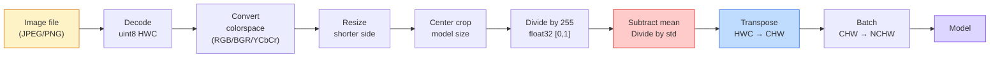
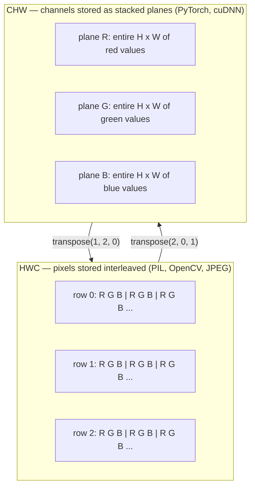

# 影像基礎 —— 像素、通道、色彩空間

> 一張影像就是一個光線取樣值的張量。你將來用到的每一個視覺模型，都從這一個事實出發。

**類型：** 實作
**程式語言：** Python
**先修單元：** 階段 1 · 12（張量運算）、階段 3 · 11（PyTorch 入門）
**時間：** 約 45 分鐘

## 學習目標

- 說明一個連續的場景是怎麼被離散化成像素的，以及取樣／量化的決定為什麼會替後面每一個模型定下天花板
- 把影像當成 NumPy 陣列來讀取、切片、檢視，並能在 HWC 與 CHW 兩種佈局之間自在切換
- 在 RGB、灰階、HSV、YCbCr 之間轉換，並說得出每個色彩空間存在的理由
- 完全按照 torchvision 期待的方式做像素層級的預處理（正規化、標準化、縮放、通道優先）

## 問題所在

你會讀到的每篇論文、你會下載的每份預訓練權重、你會呼叫的每個視覺 API，都假設了輸入是某一種特定的編碼。模型要 `float32`，你餵一張 `uint8` 影像進去 —— 它照樣跑，只是安靜地吐出垃圾。把 BGR 餵給一個用 RGB 訓練出來的網路，準確率直接掉十個百分點。模型期待通道優先，你給它通道在後的輸入，第一層卷積就會把高度當成一個特徵通道來處理。這些狀況全都不會拋出錯誤。它只是把你的指標搞爛，然後你花一個星期在找一個其實住在「你怎麼載入檔案」裡的臭蟲。

一旦你知道卷積是在什麼東西上面滑動，它其實不複雜。難的是「一張影像」對相機、對 JPEG 解碼器、對 PIL、對 OpenCV、對 torchvision、對一個 CUDA kernel 來說，指的都是不一樣的東西。每一層技術堆疊都有自己的軸順序、位元組範圍與通道慣例。一個分不清這些的視覺工程師，交付出去的就是壞掉的流程。

本單元把地基打好，讓這個階段剩下的內容能疊在上面。讀完你會知道像素是什麼、為什麼一個像素是三個數字而不是一個、「用 ImageNet 統計量做正規化」實際上在做什麼，以及怎麼在這個階段其他每一個單元都會預設的那兩三種佈局之間移動。

## 核心概念

### 完整的預處理流程一覽

每一套上線的視覺系統都是同一串可逆的轉換。其中任何一步做錯，模型看到的輸入就跟它訓練時看到的不一樣了。



紅色與藍色那兩個框，就是 80% 的無聲失敗住的地方：漏掉標準化，還有佈局搞錯。

### 像素是一次取樣，不是一個方塊

相機感光元件會數落在一格格微小偵測器上的光子。每個偵測器把光線積分一小段時間，然後輸出一個跟撞上它的光子數成正比的電壓。感光元件接著把那個電壓離散化成一個整數。一個偵測器就成為一個像素。

```
Continuous scene                 Sensor grid                     Digital image
(infinite detail)                (H x W detectors)               (H x W integers)

    ~~~~~                        +--+--+--+--+--+                 210 198 180 155 120
   ~   ~   ~                     |  |  |  |  |  |                 205 195 178 152 118
  ~ light ~      ---->           +--+--+--+--+--+     ---->       200 190 175 150 115
   ~~~~~                         |  |  |  |  |  |                 195 185 170 148 112
                                 +--+--+--+--+--+                 188 180 165 145 108
```

這一步會做兩個選擇，而它們替後面所有東西定下了天花板：

- **空間取樣**決定場景的每一度視角配幾個偵測器。太少，邊緣會變鋸齒（疊頻）。太多，儲存與計算量就爆掉。
- **強度量化**決定電壓被分桶分得多細。8 位元給你 256 個階層，是顯示用的標準。10、12、16 位元給出更平滑的漸層，對醫學影像、HDR 與 raw 感光元件流程才重要。

像素不是一個有面積的彩色方塊。它是單一次量測。當你縮放或旋轉影像時，你是在對那個量測網格重新取樣。

### 為什麼是三個通道

一個偵測器把整個可見光譜的光子一起數 —— 那就是灰階。要拿到顏色，感光元件會在網格上覆一層紅、綠、藍濾光片組成的馬賽克。去馬賽克之後，每個空間位置都有三個整數：附近那個紅色濾光偵測器、綠色濾光、藍色濾光各自的響應。那三個整數就是一個像素的 RGB 三元組。

```
One pixel in memory:

    (R, G, B) = (210, 140, 30)   <- reddish-orange

An H x W RGB image:

    shape (H, W, 3)     stored as   H rows of W pixels of 3 values
                                    each in [0, 255] for uint8
```

三並沒有什麼神奇之處。深度相機多一個 Z 通道。衛星多出紅外與紫外波段。醫學掃描常常只有一個通道（X 光、CT）或非常多個（超光譜）。通道數是最後一個軸；卷積層學的就是怎麼跨著它混合。

### 兩種佈局慣例：HWC 與 CHW

同一個張量，兩種排序。每個函式庫都選一種。

```
HWC (height, width, channels)           CHW (channels, height, width)

   W ->                                    H ->
  +-----+-----+-----+                     +-----+-----+
H |R G B|R G B|R G B|                   C |R R R R R R|
| +-----+-----+-----+                   | +-----+-----+
v |R G B|R G B|R G B|                   v |G G G G G G|
  +-----+-----+-----+                     +-----+-----+
                                          |B B B B B B|
                                          +-----+-----+

   PIL, OpenCV, matplotlib,              PyTorch, most deep learning
   almost every image file on disk       frameworks, cuDNN kernels
```

CHW 之所以存在，是因為卷積核是沿著 H 與 W 滑動的。把通道軸擺在最前面，意味著每個核在每個通道上看到的是一塊連續的 2D 平面，能乾淨地向量化。磁碟上的格式維持 HWC，是因為那正好對應掃描線從感光元件出來的順序。

那行你會打上一千次的轉換：

```
img_chw = img_hwc.transpose(2, 0, 1)      # NumPy
img_chw = img_hwc.permute(2, 0, 1)        # PyTorch tensor
```

記憶體佈局，畫出來看：



### 位元組範圍與 dtype

三種慣例佔絕大多數：

| 慣例 | dtype | 範圍 | 你會在哪裡遇到 |
|------------|-------|-------|------------------|
| 原始 | `uint8` | [0, 255] | 磁碟上的檔案、PIL、OpenCV 的輸出 |
| 正規化後 | `float32` | [0.0, 1.0] | 做完 `img.astype('float32') / 255` 之後 |
| 標準化後 | `float32` | 大致落在 [-2, +2] | 減掉平均值再除以標準差之後 |

卷積網路是用標準化後的輸入訓練出來的。ImageNet 統計量 `mean=[0.485, 0.456, 0.406]`、`std=[0.229, 0.224, 0.225]` 是三個通道在整份 ImageNet 訓練集上的算術平均值與標準差，在正規化到 [0, 1] 的像素上算出來的。把原始 `uint8` 餵進一個期待標準化浮點數的模型，是應用視覺裡最常見的單一無聲失敗。

### 色彩空間，以及它們為什麼存在

RGB 是拍攝時的格式，但對模型來說它不一定是最有用的表示法。

```
 RGB               HSV                       YCbCr / YUV

 R red             H hue (angle 0-360)       Y luminance (brightness)
 G green           S saturation (0-1)        Cb chroma blue-yellow
 B blue            V value/brightness (0-1)  Cr chroma red-green

 Linear to         Separates color from      Separates brightness from
 sensor output     brightness. Useful for    color. JPEG and most video
                   color thresholding, UI    codecs compress the chroma
                   sliders, simple filters   channels harder because the
                                             human eye is less sensitive
                                             to chroma detail than to Y.
```

大多數現代 CNN 你就餵 RGB。你會碰到其他色彩空間的時機是：

- **HSV** —— 傳統 CV 程式碼、基於顏色的分割、白平衡。
- **YCbCr** —— 讀 JPEG 內部結構、影片處理流程、只在 Y 通道上運作的超解析度模型。
- **灰階** —— OCR、文件模型，以及任何顏色屬於干擾變數而不是訊號的場合。

從 RGB 轉灰階是加權和，不是平均，因為人眼對綠色比對紅色或藍色更敏感：

```
Y = 0.299 R + 0.587 G + 0.114 B       (ITU-R BT.601, the classic weights)
```

### 長寬比、縮放與內插

每個模型都有固定的輸入尺寸（多數 ImageNet 分類器是 224x224，現代偵測器是 384x384 或 512x512）。你的影像很少剛好符合。三種真正重要的縮放選擇：

- **縮放短邊，再中央裁切** —— 標準的 ImageNet 配方。保住長寬比，代價是丟掉邊緣的一圈像素。
- **縮放後補邊** —— 保住長寬比也保住每一個像素，代價是多出黑邊。偵測與 OCR 的標準做法。
- **直接縮放到目標尺寸** —— 把影像拉扯變形。便宜、會扭曲幾何形狀，但對很多分類任務來說夠用。

當新網格跟舊網格對不上時，內插方法決定中間那些像素怎麼算出來：

```
Nearest neighbour     fastest, blocky, only choice for masks/labels
Bilinear              fast, smooth, default for most image resizing
Bicubic               slower, sharper on upscaling
Lanczos               slowest, best quality, used for final display
```

經驗法則：訓練用雙線性，要給人看的素材用雙三次或 Lanczos，任何內容是整數類別 ID 的東西用最近鄰。

```figure
conv-output-size
```

## 動手實作

### 步驟 1：載入一張影像並檢視它的形狀

用 Pillow 載入任何一張 JPEG 或 PNG，轉成 NumPy，然後把你拿到的東西印出來。為了有一個可離線執行又結果確定的例子，我們自己合成一張。

```python
import numpy as np
from PIL import Image

def synthetic_rgb(h=128, w=192, seed=0):
    rng = np.random.default_rng(seed)
    yy, xx = np.meshgrid(np.linspace(0, 1, h), np.linspace(0, 1, w), indexing="ij")
    r = (np.sin(xx * 6) * 0.5 + 0.5) * 255
    g = yy * 255
    b = (1 - yy) * xx * 255
    rgb = np.stack([r, g, b], axis=-1) + rng.normal(0, 6, (h, w, 3))
    return np.clip(rgb, 0, 255).astype(np.uint8)

arr = synthetic_rgb()
# Or load from disk:
# arr = np.asarray(Image.open("your_image.jpg").convert("RGB"))

print(f"type:   {type(arr).__name__}")
print(f"dtype:  {arr.dtype}")
print(f"shape:  {arr.shape}     # (H, W, C)")
print(f"min:    {arr.min()}")
print(f"max:    {arr.max()}")
print(f"pixel at (0, 0): {arr[0, 0]}")
```

預期輸出：`shape: (H, W, 3)`、`dtype: uint8`、範圍 `[0, 255]`。不管那些位元組是來自相機、JPEG 解碼器還是一個合成產生器，這就是磁碟上的標準表示法。

### 步驟 2：拆開通道並重排佈局

把 R、G、B 分別取出來，然後為了 PyTorch 把 HWC 轉成 CHW。

```python
R = arr[:, :, 0]
G = arr[:, :, 1]
B = arr[:, :, 2]
print(f"R shape: {R.shape}, mean: {R.mean():.1f}")
print(f"G shape: {G.shape}, mean: {G.mean():.1f}")
print(f"B shape: {B.shape}, mean: {B.mean():.1f}")

arr_chw = arr.transpose(2, 0, 1)
print(f"\nHWC shape: {arr.shape}")
print(f"CHW shape: {arr_chw.shape}")
```

三張灰階平面，每個通道一張。CHW 只是把軸重新排序；記憶體佈局允許的時候，並不一定真的需要複製資料。

### 步驟 3：灰階與 HSV 轉換

先做加權和灰階，再手寫一個 RGB 轉 HSV。

```python
def rgb_to_grayscale(rgb):
    weights = np.array([0.299, 0.587, 0.114], dtype=np.float32)
    return (rgb.astype(np.float32) @ weights).astype(np.uint8)

def rgb_to_hsv(rgb):
    rgb_f = rgb.astype(np.float32) / 255.0
    r, g, b = rgb_f[..., 0], rgb_f[..., 1], rgb_f[..., 2]
    cmax = np.max(rgb_f, axis=-1)
    cmin = np.min(rgb_f, axis=-1)
    delta = cmax - cmin

    h = np.zeros_like(cmax)
    mask = delta > 0
    rmax = mask & (cmax == r)
    gmax = mask & (cmax == g)
    bmax = mask & (cmax == b)
    h[rmax] = ((g[rmax] - b[rmax]) / delta[rmax]) % 6
    h[gmax] = ((b[gmax] - r[gmax]) / delta[gmax]) + 2
    h[bmax] = ((r[bmax] - g[bmax]) / delta[bmax]) + 4
    h = h * 60.0

    s = np.where(cmax > 0, delta / cmax, 0)
    v = cmax
    return np.stack([h, s, v], axis=-1)

gray = rgb_to_grayscale(arr)
hsv = rgb_to_hsv(arr)
print(f"gray shape: {gray.shape}, range: [{gray.min()}, {gray.max()}]")
print(f"hsv   shape: {hsv.shape}")
print(f"hue range: [{hsv[..., 0].min():.1f}, {hsv[..., 0].max():.1f}] degrees")
print(f"sat range: [{hsv[..., 1].min():.2f}, {hsv[..., 1].max():.2f}]")
print(f"val range: [{hsv[..., 2].min():.2f}, {hsv[..., 2].max():.2f}]")
```

色相出來的單位是度，飽和度與明度落在 [0, 1]。這符合 OpenCV 的 `hsv_full` 慣例。

### 步驟 4：正規化、標準化，然後反推回去

從原始位元組一路走到一個預訓練 ImageNet 模型所期待的那個張量，再走回來。

```python
mean = np.array([0.485, 0.456, 0.406], dtype=np.float32)
std = np.array([0.229, 0.224, 0.225], dtype=np.float32)

def preprocess_imagenet(rgb_uint8):
    x = rgb_uint8.astype(np.float32) / 255.0
    x = (x - mean) / std
    x = x.transpose(2, 0, 1)
    return x

def deprocess_imagenet(chw_float32):
    x = chw_float32.transpose(1, 2, 0)
    x = x * std + mean
    x = np.clip(x * 255.0, 0, 255).astype(np.uint8)
    return x

x = preprocess_imagenet(arr)
print(f"preprocessed shape: {x.shape}     # (C, H, W)")
print(f"preprocessed dtype: {x.dtype}")
print(f"preprocessed mean per channel:  {x.mean(axis=(1, 2)).round(3)}")
print(f"preprocessed std  per channel:  {x.std(axis=(1, 2)).round(3)}")

roundtrip = deprocess_imagenet(x)
max_diff = np.abs(roundtrip.astype(int) - arr.astype(int)).max()
print(f"roundtrip max pixel diff: {max_diff}    # should be 0 or 1")
```

每個通道的平均值應該接近零，標準差接近一。這組預處理／反預處理函式，正是每一次 torchvision `transforms.Normalize` 在底下做的事。

### 步驟 5：用三種內插方法縮放

在放大的情境下比較最近鄰、雙線性與雙三次，這樣差異才看得出來。

```python
target = (arr.shape[0] * 3, arr.shape[1] * 3)

nearest = np.asarray(Image.fromarray(arr).resize(target[::-1], Image.NEAREST))
bilinear = np.asarray(Image.fromarray(arr).resize(target[::-1], Image.BILINEAR))
bicubic = np.asarray(Image.fromarray(arr).resize(target[::-1], Image.BICUBIC))

def local_roughness(x):
    gy = np.diff(x.astype(float), axis=0)
    gx = np.diff(x.astype(float), axis=1)
    return float(np.abs(gy).mean() + np.abs(gx).mean())

for name, out in [("nearest", nearest), ("bilinear", bilinear), ("bicubic", bicubic)]:
    print(f"{name:>8}  shape={out.shape}  roughness={local_roughness(out):6.2f}")
```

最近鄰在粗糙度上分數最高，因為它保留了硬邊。雙線性最平滑。雙三次落在中間，既保住感知上的銳利度，又不會有階梯狀的假影。

## 框架應用

`torchvision.transforms` 把上面所有東西包成一條可組合的流程。下面這段程式碼完全複製了 `preprocess_imagenet` 做的事，再加上縮放與裁切。

```python
import torch
from torchvision import transforms
from PIL import Image

img = Image.fromarray(synthetic_rgb(256, 256))

pipeline = transforms.Compose([
    transforms.Resize(256),
    transforms.CenterCrop(224),
    transforms.ToTensor(),
    transforms.Normalize(mean=[0.485, 0.456, 0.406], std=[0.229, 0.224, 0.225]),
])

x = pipeline(img)
print(f"tensor type:  {type(x).__name__}")
print(f"tensor dtype: {x.dtype}")
print(f"tensor shape: {tuple(x.shape)}      # (C, H, W)")
print(f"per-channel mean: {x.mean(dim=(1, 2)).tolist()}")
print(f"per-channel std:  {x.std(dim=(1, 2)).tolist()}")

batch = x.unsqueeze(0)
print(f"\nbatched shape: {tuple(batch.shape)}   # (N, C, H, W) — ready for a model")
```

四個步驟，順序就是這樣：`Resize(256)` 把短邊縮放到 256；`CenterCrop(224)` 從中間取一塊 224x224 的區域；`ToTensor()` 除以 255 並把 HWC 換成 CHW；`Normalize` 減掉 ImageNet 平均值再除以標準差。把這個順序調換，會無聲地改變送進模型的東西。

## 產出交付

本單元會產出：

- `outputs/prompt-vision-preprocessing-audit.md` —— 一個提示詞，能把任何模型卡或資料集卡轉成一份清單，列出團隊必須遵守的預處理不變條件。
- `outputs/skill-image-tensor-inspector.md` —— 一個技能，給它任何形狀像影像的張量或陣列，它會回報 dtype、佈局、範圍，以及它看起來是原始、正規化後還是標準化後的資料。

## 練習

1. **（簡單）** 用 OpenCV（`cv2.imread`）和 Pillow 各載入一張 JPEG。把兩者的形狀以及 `(0, 0)` 位置的像素印出來。說明通道順序的差異，然後寫一行轉換，讓 OpenCV 那個陣列跟 Pillow 那個一模一樣。
2. **（中等）** 寫出 `standardize(img, mean, std)` 以及它的逆函式，兩者合起來要能在任何 uint8 影像上通過 `roundtrip_max_diff <= 1` 的測試。你的函式必須用同一種呼叫方式，同時處理 HWC 的單張影像與 NCHW 的一個批次。
3. **（困難）** 拿一個 3 通道、已做 ImageNet 標準化的張量，讓它通過一個 1x1 卷積，這個卷積學的是把 RGB 加權混合成單一個灰階通道。把權重初始化成 `[0.299, 0.587, 0.114]`、凍結它們，然後驗證輸出跟你手寫的 `rgb_to_grayscale` 在浮點誤差範圍內一致。還有哪些傳統的色彩空間轉換可以寫成 1x1 卷積？

## 關鍵術語

| 術語 | 大家怎麼說 | 實際上是什麼 |
|------|----------------|----------------------|
| 像素 | 「一個彩色方塊」 | 在一個網格位置上對光強度的一次取樣 —— 彩色是三個數字，灰階是一個 |
| 通道 | 「顏色」 | 疊成一個影像張量的那些平行空間網格之一；在 HWC 裡是最後一軸，在 CHW 裡是第一軸 |
| HWC／CHW | 「形狀」 | 影像張量的軸順序；磁碟與 PIL 用 HWC，PyTorch 與 cuDNN 用 CHW |
| 正規化 | 「把影像縮放一下」 | 除以 255 讓像素落在 [0, 1] —— 必要，但還不夠 |
| 標準化 | 「置中到零」 | 每個通道各自減掉平均值再除以標準差，讓輸入分布對上模型訓練時的樣子 |
| 灰階轉換 | 「把通道平均起來」 | 係數為 0.299/0.587/0.114 的加權和，對應人眼的亮度感知 |
| 內插 | 「縮放怎麼挑像素」 | 決定新網格跟舊網格對不上時輸出值是多少的規則 —— 標註用最近鄰、訓練用雙線性、顯示用雙三次 |
| 長寬比 | 「寬除以高」 | 分辨「縮放後補邊」與「縮放後拉扯」的那個比值 |

## 延伸閱讀

- [Charles Poynton — A Guided Tour of Color Space](https://poynton.ca/PDFs/Guided_tour.pdf) —— 關於為什麼會有這麼多色彩空間、每一個又在什麼時候重要，寫得最清楚的技術性論述
- [PyTorch Vision Transforms Docs](https://pytorch.org/vision/stable/transforms.html) —— 你在生產環境裡真的會組起來的那整條轉換流程
- [How JPEG Works (Colt McAnlis)](https://www.youtube.com/watch?v=F1kYBnY6mwg) —— 對色度次取樣、DCT，以及 JPEG 為什麼編碼 YCbCr 而不是 RGB 的一趟犀利視覺導覽
- [ImageNet Preprocessing Conventions (torchvision models)](https://pytorch.org/vision/stable/models.html) —— `mean=[0.485, 0.456, 0.406]` 的真相來源，以及為什麼模型庫裡每個模型都期待它
