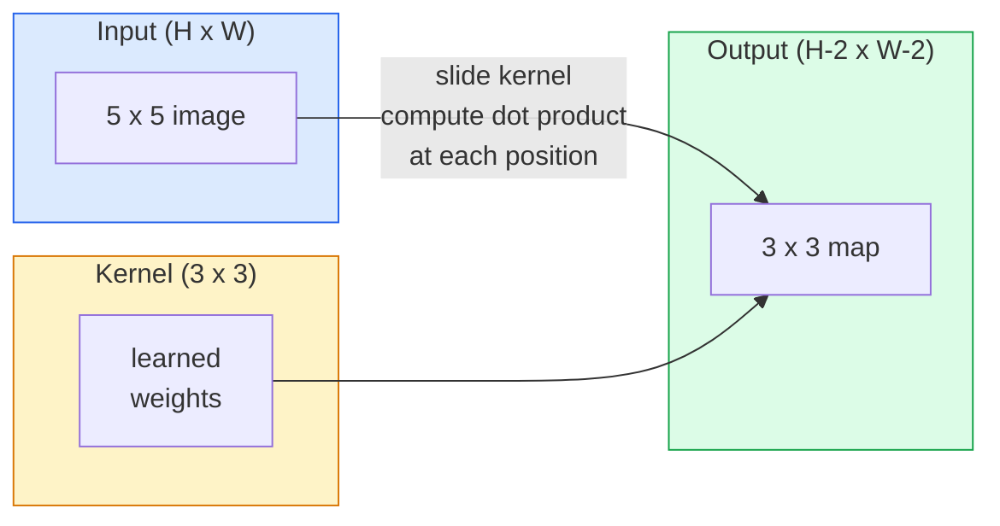
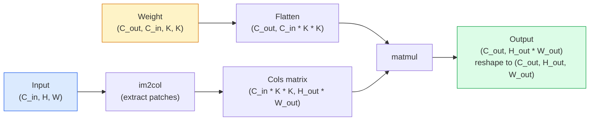

# 從零實作卷積

> 卷積就是一個很小的全連接層，你把它滑過整張影像，每個位置都共用同一組權重。

**類型：** 實作
**程式語言：** Python
**先修單元：** 階段 3（深度學習核心）、階段 4 單元 01（影像基礎）
**時間：** 約 75 分鐘

## 學習目標

- 只用 NumPy 從零實作二維卷積，包含巢狀迴圈版與向量化的 `im2col` 版
- 對任意的輸入尺寸、卷積核大小、填充與步幅組合算出輸出空間尺寸，並說明 `(H - K + 2P) / S + 1` 這條公式的來由
- 手工設計卷積核（邊緣、模糊、銳化、Sobel），並解釋每一個為什麼會產生它那樣的激活樣態
- 把卷積疊成一個特徵提取器，並把疊的層數連結到感受野的大小

## 問題所在

在一張 224x224 的 RGB 影像上，全連接層的每個神經元需要 224 * 224 * 3 = 150,528 個輸入權重。一個只有 1,000 個單元的隱藏層就已經是 1.5 億個參數——而你還什麼有用的東西都沒學到。更糟的是，這一層完全不知道左上角的狗和右下角的狗是同一個樣態。它把每個像素位置都當成彼此獨立，而這對影像來說剛好完全錯誤：把一隻貓平移三個像素，不該逼網路重新學一次這個概念。

影像模型需要的兩個性質是**平移等變性**（輸入位移時輸出跟著位移）與**參數共享**（同一個特徵偵測器在每個地方都跑）。全連接層兩個都給不了。卷積兩個都免費給你。

卷積不是為深度學習發明的。JPEG 壓縮、Photoshop 的高斯模糊、工業視覺的邊緣偵測，以及史上出貨過的每一個音訊濾波器，背後都是同一個運算——訊號處理裡的摺積。CNN 之所以能從 2012 年主宰 ImageNet 到 2020 年，是因為對於「相鄰數值彼此相關、同一個樣態可能出現在任何位置」這種資料，卷積正是正確的先驗。

## 核心概念

### 一個卷積核，滑過去

二維卷積拿一個叫做卷積核（或濾波器）的小權重矩陣，把它滑過整個輸入，在每個位置算出逐元素相乘的總和。那個總和就成為一個輸出像素。



在 5x5 輸入上做 3x3 卷積的具體例子（不填充，步幅 1）：

```
Input X (5 x 5):                Kernel W (3 x 3):

  1  2  0  1  2                   1  0 -1
  0  1  3  1  0                   2  0 -2
  2  1  0  2  1                   1  0 -1
  1  0  2  1  3
  2  1  1  0  1

The kernel slides across every valid 3 x 3 window. Output Y is 3 x 3:

 Y[0,0] = sum( W * X[0:3, 0:3] )
 Y[0,1] = sum( W * X[0:3, 1:4] )
 Y[0,2] = sum( W * X[0:3, 2:5] )
 Y[1,0] = sum( W * X[1:4, 0:3] )
 ... and so on
```

就這一條式子——**權重共享、局部性、滑動視窗**——整個想法就這樣。其餘全是帳務細節。

### 輸出尺寸公式

給定輸入空間尺寸 `H`、卷積核大小 `K`、填充 `P`、步幅 `S`：

```
H_out = floor( (H - K + 2P) / S ) + 1
```

把它背下來。設計一個架構，你會算上幾十次。

| 情境 | H | K | P | S | H_out |
|----------|---|---|---|---|-------|
| 有效卷積，不填充 | 32 | 3 | 0 | 1 | 30 |
| 同尺寸卷積（保持尺寸） | 32 | 3 | 1 | 1 | 32 |
| 降採樣 2 倍 | 32 | 3 | 1 | 2 | 16 |
| 2x2 池化 | 32 | 2 | 0 | 2 | 16 |
| 大感受野 | 32 | 7 | 3 | 2 | 16 |

「same 填充」的意思是挑一個 P，讓 S == 1 時 H_out == H。K 是奇數時，那就是 P = (K - 1) / 2。這就是 3x3 卷積核之所以獨大的原因——它是仍然有中心點的最小奇數核。

### 填充

不填充的話，每一次卷積都會讓特徵圖縮小。疊 20 層，你的 224x224 影像就變成 184x184，這既在邊界上浪費算力，也讓需要形狀對齊的殘差連接變得麻煩。

```
Zero padding (P = 1) on a 5 x 5 input:

  0  0  0  0  0  0  0
  0  1  2  0  1  2  0
  0  0  1  3  1  0  0
  0  2  1  0  2  1  0       Now the kernel can centre on pixel
  0  1  0  2  1  3  0       (0, 0) and still have three rows and
  0  2  1  1  0  1  0       three columns of values to multiply.
  0  0  0  0  0  0  0
```

實務上會遇到的模式：`zero`（最常見）、`reflect`（鏡射邊緣，在生成模型裡可避免硬邊界）、`replicate`（複製邊緣）、`circular`（繞回，用在環面型問題上）。

### 步幅

步幅就是滑動的步長。`stride=1` 是預設值。`stride=2` 會讓空間維度減半，是在 CNN 內部不另外加池化層就完成降採樣的經典做法——每個現代架構（ResNet、ConvNeXt、MobileNet）都在某處用帶步幅的卷積取代 max-pool。

```
Stride 1 on a 5 x 5 input, 3 x 3 kernel:

  starts: (0,0) (0,1) (0,2)        -> output row 0
          (1,0) (1,1) (1,2)        -> output row 1
          (2,0) (2,1) (2,2)        -> output row 2

  Output: 3 x 3

Stride 2 on the same input:

  starts: (0,0) (0,2)              -> output row 0
          (2,0) (2,2)              -> output row 1

  Output: 2 x 2
```

### 多個輸入通道

真實影像有三個通道。作用在 RGB 輸入上的 3x3 卷積，其實是一個 3x3x3 的立方體：每個輸入通道一片 3x3。在每個空間位置上，你跨全部三片相乘並加總，再加上一個偏差項。

```
Input:   (C_in,  H,  W)        3 x 5 x 5
Kernel:  (C_in,  K,  K)        3 x 3 x 3 (one kernel)
Output:  (1,     H', W')       2D map

For a layer that produces C_out output channels, you stack C_out kernels:

Weight:  (C_out, C_in, K, K)   e.g. 64 x 3 x 3 x 3
Output:  (C_out, H', W')       64 x 3 x 3

Parameter count: C_out * C_in * K * K + C_out   (the + C_out is biases)
```

最後那一行就是你規劃模型時要算的東西。作用在 3 通道輸入上的 64 通道 3x3 卷積有 `64 * 3 * 3 * 3 + 64 = 1,792` 個參數。很便宜。

### im2col 這個把戲

巢狀迴圈好讀，但很慢。GPU 想要的是大矩陣乘法。訣竅是：把輸入裡每一個感受野視窗攤平成一個大矩陣的一欄，把卷積核攤平成一列，整個卷積就變成單一次矩陣乘法。



每一套生產級的卷積實作，都是這個做法的某種變體再加上快取分塊的手法（直接卷積、Winograd、大核用的 FFT 卷積）。搞懂 im2col，你就搞懂了核心。

### 感受野

單一個 3x3 卷積看的是 9 個輸入像素。疊兩個 3x3 卷積，第二層的一個神經元就看到 5x5 個輸入像素。三個 3x3 給你 7x7。一般而言：

```
RF after L stacked K x K convs (stride 1) = 1 + L * (K - 1)

With strides:   RF grows multiplicatively with stride along each layer.
```

「全程都用 3x3」（VGG、ResNet、ConvNeXt）之所以行得通，理由全在這裡：兩個 3x3 卷積看到的輸入範圍和一個 5x5 卷積一樣大，但參數更少，中間還多了一道非線性。

```figure
convolution-kernel
```

## 動手實作

### 步驟 1：為陣列補邊

從最小的基本元件開始：一個在 H x W 陣列四周補零的函式。

```python
import numpy as np

def pad2d(x, p):
    if p == 0:
        return x
    h, w = x.shape[-2:]
    out = np.zeros(x.shape[:-2] + (h + 2 * p, w + 2 * p), dtype=x.dtype)
    out[..., p:p + h, p:p + w] = x
    return out

x = np.arange(9).reshape(3, 3)
print(x)
print()
print(pad2d(x, 1))
```

`x.shape[:-2]` 這個「只管末兩軸」的手法，讓同一個函式不必修改就能用在 `(H, W)`、`(C, H, W)` 或 `(N, C, H, W)` 上。

### 步驟 2：用巢狀迴圈實作二維卷積

參考實作——很慢，但毫無模糊空間。原理上 `torch.nn.functional.conv2d` 做的就是這件事。

```python
def conv2d_naive(x, w, b=None, stride=1, padding=0):
    c_in, h, w_in = x.shape
    c_out, c_in_w, kh, kw = w.shape
    assert c_in == c_in_w

    x_pad = pad2d(x, padding)
    h_out = (h + 2 * padding - kh) // stride + 1
    w_out = (w_in + 2 * padding - kw) // stride + 1

    out = np.zeros((c_out, h_out, w_out), dtype=np.float32)
    for oc in range(c_out):
        for i in range(h_out):
            for j in range(w_out):
                hs = i * stride
                ws = j * stride
                patch = x_pad[:, hs:hs + kh, ws:ws + kw]
                out[oc, i, j] = np.sum(patch * w[oc])
        if b is not None:
            out[oc] += b[oc]
    return out
```

四層巢狀迴圈（輸出通道、橫列、直欄，再加上對 C_in、kh、kw 的隱含加總）。這是基準答案，之後每一個更快的實作都要拿它來對。

### 步驟 3：用手工設計的卷積核驗證

做一個垂直方向的 Sobel 核，套到一張合成的階梯影像上，看著垂直邊緣亮起來。

```python
def synthetic_step_image():
    img = np.zeros((1, 16, 16), dtype=np.float32)
    img[:, :, 8:] = 1.0
    return img

sobel_x = np.array([
    [[-1, 0, 1],
     [-2, 0, 2],
     [-1, 0, 1]]
], dtype=np.float32)[None]

x = synthetic_step_image()
y = conv2d_naive(x, sobel_x, padding=1)
print(y[0].round(1))
```

預期第 7 欄會出現很大的正值（亮度由左往右上升），其他地方都是零。這一次 print 就是你確認數學沒算錯的檢查。

### 步驟 4：im2col

把輸入裡每一個和卷積核同尺寸的視窗，轉成矩陣的一欄。`C_in=3, K=3` 時，每一欄是 27 個數。

```python
def im2col(x, kh, kw, stride=1, padding=0):
    c_in, h, w = x.shape
    x_pad = pad2d(x, padding)
    h_out = (h + 2 * padding - kh) // stride + 1
    w_out = (w + 2 * padding - kw) // stride + 1

    cols = np.zeros((c_in * kh * kw, h_out * w_out), dtype=x.dtype)
    col = 0
    for i in range(h_out):
        for j in range(w_out):
            hs = i * stride
            ws = j * stride
            patch = x_pad[:, hs:hs + kh, ws:ws + kw]
            cols[:, col] = patch.reshape(-1)
            col += 1
    return cols, h_out, w_out
```

它仍然是 Python 迴圈，但真正的重活現在交給單一次向量化的矩陣乘法。

### 步驟 5：用 im2col + 矩陣乘法做快速卷積

用一次矩陣乘法取代那四層迴圈。

```python
def conv2d_im2col(x, w, b=None, stride=1, padding=0):
    c_out, c_in, kh, kw = w.shape
    cols, h_out, w_out = im2col(x, kh, kw, stride, padding)
    w_flat = w.reshape(c_out, -1)
    out = w_flat @ cols
    if b is not None:
        out += b[:, None]
    return out.reshape(c_out, h_out, w_out)
```

正確性檢查：兩個實作都跑一遍再比對。

```python
rng = np.random.default_rng(0)
x = rng.normal(0, 1, (3, 16, 16)).astype(np.float32)
w = rng.normal(0, 1, (8, 3, 3, 3)).astype(np.float32)
b = rng.normal(0, 1, (8,)).astype(np.float32)

y_naive = conv2d_naive(x, w, b, padding=1)
y_im2col = conv2d_im2col(x, w, b, padding=1)

print(f"max abs diff: {np.max(np.abs(y_naive - y_im2col)):.2e}")
```

`max abs diff` 應該在 `1e-5` 上下——差異來自浮點累加的順序，不是 bug。

### 步驟 6：一組手工設計的卷積核

五個濾波器，展示單一個卷積層在還沒訓練之前就能表達什麼。

```python
KERNELS = {
    "identity": np.array([[0, 0, 0], [0, 1, 0], [0, 0, 0]], dtype=np.float32),
    "blur_3x3": np.ones((3, 3), dtype=np.float32) / 9.0,
    "sharpen": np.array([[0, -1, 0], [-1, 5, -1], [0, -1, 0]], dtype=np.float32),
    "sobel_x": np.array([[-1, 0, 1], [-2, 0, 2], [-1, 0, 1]], dtype=np.float32),
    "sobel_y": np.array([[-1, -2, -1], [0, 0, 0], [1, 2, 1]], dtype=np.float32),
}

def apply_kernel(img2d, kernel):
    x = img2d[None].astype(np.float32)
    w = kernel[None, None]
    return conv2d_im2col(x, w, padding=1)[0]
```

套到任何灰階影像上：blur 讓畫面變柔，sharpen 讓邊緣變銳利，sobel_x 讓垂直邊緣亮起來，sobel_y 讓水平邊緣亮起來。AlexNet 與 VGG 訓練完的*第一層*卷積，最後學到的就正是這些樣態——因為不管後面接的是什麼任務，一個好的影像模型都需要邊緣與斑塊偵測器。

## 框架應用

PyTorch 的 `nn.Conv2d` 把同一個運算包上了 autograd、CUDA 核心與 cuDNN 最佳化。形狀的語意完全一致。

```python
import torch
import torch.nn as nn

conv = nn.Conv2d(in_channels=3, out_channels=64, kernel_size=3, stride=1, padding=1)
print(conv)
print(f"weight shape: {tuple(conv.weight.shape)}   # (C_out, C_in, K, K)")
print(f"bias shape:   {tuple(conv.bias.shape)}")
print(f"param count:  {sum(p.numel() for p in conv.parameters())}")

x = torch.randn(8, 3, 224, 224)
y = conv(x)
print(f"\ninput  shape: {tuple(x.shape)}")
print(f"output shape: {tuple(y.shape)}")
```

把 `padding=1` 換成 `padding=0`，輸出就掉到 222x222。把 `stride=1` 換成 `stride=2`，就掉到 112x112。用的是你上面背下來的同一條公式。

## 產出交付

本單元產出：

- `outputs/prompt-cnn-architect.md` —— 一段提示詞：給定輸入尺寸、參數預算與目標感受野，設計出一疊 `Conv2d` 層，並在每一步給出正確的 K/S/P。
- `outputs/skill-conv-shape-calculator.md` —— 一項技能：逐層走過一份網路規格，回報每個區塊的輸出形狀、感受野與參數數量。

## 練習

1. **（簡單）** 給定一張 128x128 的灰階輸入與一疊 `[Conv3x3(s=1,p=1), Conv3x3(s=2,p=1), Conv3x3(s=1,p=1), Conv3x3(s=2,p=1)]`，用手算出每一層的輸出空間尺寸與感受野。再用一個由虛設卷積組成的 PyTorch `nn.Sequential` 驗證。
2. **（中等）** 擴充 `conv2d_naive` 與 `conv2d_im2col`，讓它們接受 `groups` 參數。證明 `groups=C_in=C_out` 會重現深度卷積，而它的參數量是 `C * K * K` 而不是 `C * C * K * K`。
3. **（困難）** 手工實作 `conv2d_im2col` 的反向傳遞：給定輸出的梯度，算出 `x` 與 `w` 的梯度。用相同的輸入與權重跟 `torch.autograd.grad` 對照驗證。訣竅是：im2col 的梯度就是 `col2im`，而且它必須把重疊的視窗累加起來。

## 關鍵術語

| 術語 | 大家怎麼說 | 實際上是什麼 |
|------|----------------|----------------------|
| 卷積 | 「把濾波器滑過去」 | 在每個空間位置以共享權重做一次可學習的內積；數學上它是互相關（cross-correlation），但大家都叫它卷積 |
| 卷積核／濾波器 | 「特徵偵測器」 | 形狀為 (C_in, K, K) 的小權重張量，它與輸入的一個視窗做內積，產生一個輸出像素 |
| 步幅 | 「一次跳多遠」 | 相鄰兩次擺放卷積核之間的步長；步幅 2 會讓每個空間維度減半 |
| 填充 | 「邊緣補零」 | 在輸入四周加上的額外數值，讓卷積核能以邊界像素為中心；`same` 填充讓輸出尺寸等於輸入尺寸 |
| 感受野 | 「這個神經元看得到多少」 | 某個輸出激活值所依賴的那塊原始輸入區域，會隨深度與步幅增大 |
| im2col | 「GEMM 那個把戲」 | 把每個感受野視窗重排成欄，讓卷積變成一次大矩陣乘法——所有快速卷積核心的根本做法 |
| 深度卷積 | 「每個通道一個核」 | `groups == C_in` 的卷積，每個輸出通道只由對應的那個輸入通道算出來；MobileNet 與 ConvNeXt 的骨幹 |
| 平移等變性 | 「輸入移，輸出跟著移」 | 輸入平移 k 個像素、輸出就平移 k 個像素的性質；權重共享自動附帶這個性質 |

## 延伸閱讀

- [A guide to convolution arithmetic for deep learning (Dumoulin & Visin, 2016)](https://arxiv.org/abs/1603.07285) —— 填充／步幅／膨脹卷積的權威示意圖，每堂課都默默照抄
- [CS231n: Convolutional Neural Networks for Visual Recognition](https://cs231n.github.io/convolutional-networks/) —— 經典講義，包含最初的 im2col 說明
- [The Annotated ConvNet (fast.ai)](https://nbviewer.org/github/fastai/fastbook/blob/master/13_convolutions.ipynb) —— 一份筆記本，從手工卷積一路走到訓練好的手寫數字分類器
- [Receptive Field Arithmetic for CNNs (Dang Ha The Hien)](https://distill.pub/2019/computing-receptive-fields/) —— 論文水準的感受野計算互動式解說
