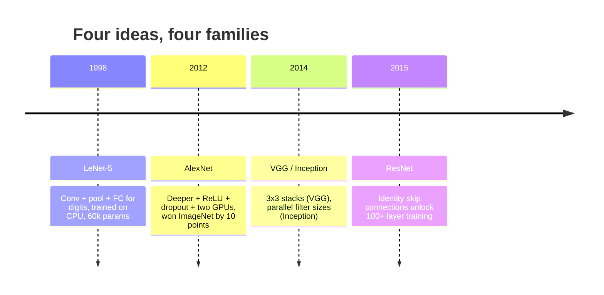
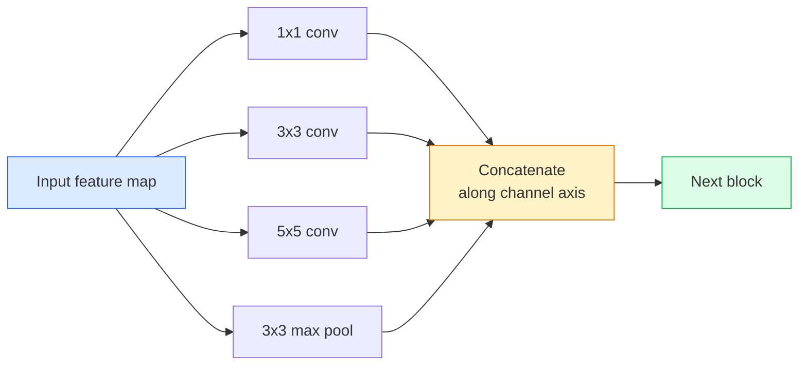
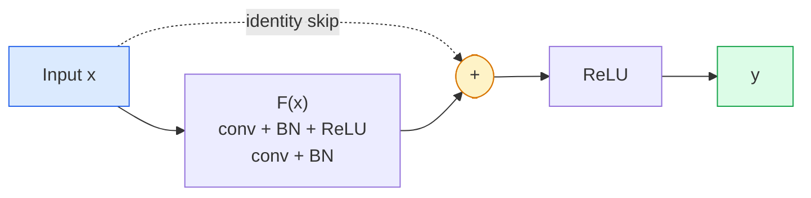

# CNN：從 LeNet 到 ResNet

> 過去三十年每一個重要的 CNN，都是同一套「卷積—非線性—降採樣」配方，再栓上一個新想法。照順序把這些想法學會。

**類型：** 學習 + 實作
**程式語言：** Python
**先修單元：** 階段 3 · 11（PyTorch 入門）、階段 4 · 01（影像基礎）、階段 4 · 02（從零實作卷積）
**時間：** 約 75 分鐘

## 學習目標

- 追出 LeNet-5 -> AlexNet -> VGG -> Inception -> ResNet 這條架構血脈，並說出每個家族各自貢獻的那一個新想法
- 在 PyTorch 裡實作 LeNet-5、一個 VGG 風格的區塊，以及一個 ResNet BasicBlock，每個都在 40 行以內
- 解釋為什麼殘差連接能把 1,000 層的網路從「根本訓練不動」變成「最先進」
- 讀一個現代主幹網路（ResNet-18、ResNet-50），在翻開原始碼之前就先預測它的輸出形狀、感受野與參數量

## 問題所在

2011 年，最好的 ImageNet 分類器 top-5 準確率大約 74%。2012 年 AlexNet 拿到 85%。2015 年 ResNet 拿到 96%。沒有新資料。沒有新一代的 GPU。這些進步全部來自架構上的想法。做視覺的工程師必須知道哪個想法出自哪篇論文，因為你在 2026 年出貨的每一個生產級主幹網路，都是這些同樣零件的重新組合——也因為這些想法會不斷遷移：分組卷積從 CNN 走進了 transformer，殘差連接從 ResNet 走進了現存的每一個 LLM，批次正規化則活在擴散模型裡。

按順序研究這些網路還能讓你對一個常見錯誤免疫：明明 LeNet 大小的網路就解得掉的問題，卻伸手去拿手邊最大的模型。MNIST 不需要 ResNet。知道每個家族的縮放曲線，你才知道自己該坐在曲線的哪個位置。

## 核心概念

### 改變視覺的四個想法



古典視覺裡沒有別的東西比得上這四次跳躍。

### LeNet-5（1998）

Yann LeCun 的數字辨識器。60,000 個參數。兩組卷積—池化區塊、兩個全連接層、tanh 激活函式。它定義了此後每個 CNN 都繼承的樣板：

```
input (1, 32, 32)
  conv 5x5 -> (6, 28, 28)
  avg pool 2x2 -> (6, 14, 14)
  conv 5x5 -> (16, 10, 10)
  avg pool 2x2 -> (16, 5, 5)
  flatten -> 400
  dense -> 120
  dense -> 84
  dense -> 10
```

現代世界所稱的 CNN——卷積與降採樣交替進行，再餵給一個小的分類頭——就是層數更多、通道更寬、激活函式更好的 LeNet。

### AlexNet（2012）

三個改動合起來攻破了 ImageNet：

1. **ReLU** 取代 tanh。梯度不再消失。訓練速度快了六倍。
2. 在全連接頭裡加 **Dropout**。正則化從一個小技巧變成一個層。
3. **深度與寬度**。五個卷積層、三個全連接層、6,000 萬個參數，用兩張 GPU 訓練，模型被切開分放在兩張卡上。

論文的 Figure 2 至今仍把那個 GPU 切分畫成兩條平行的流。那個平行化是硬體上的權宜之計，不是架構上的洞見——但上面那三個想法，還活在你今天用的每一個模型裡。

### VGG（2014）

VGG 問的是：如果只用 3x3 卷積，然後一路疊深，會發生什麼事？

```
stack:   conv 3x3 -> conv 3x3 -> pool 2x2
repeat:  16 or 19 conv layers
```

兩個 3x3 卷積看到的輸入區域，跟一個 5x5 卷積一樣大，但參數更少（2*9*C^2 = 18C^2 對上 25*C^2），中間還多了一個 ReLU。VGG 把這個觀察擴張成一整套架構。夠簡單——只有一種區塊，反覆堆疊——讓它成為後續所有架構的參照點。

代價：1.38 億個參數，訓練慢，推論貴。

### Inception（2014，同一年）

Google 對「我該用多大的卷積核？」的回答是：全都用，而且並行地用。



每條分支各有專長——1x1 負責混合通道、3x3 負責局部紋理、5x5 負責更大範圍的圖樣、池化負責平移不變的特徵——而串接則讓下一層自己去挑哪一條分支有用。Inception v1 在每條分支裡都用 1x1 卷積當瓶頸，把參數量壓在合理範圍內。

### 退化問題

到 2015 年，VGG-19 能用，VGG-32 不能。深度本來應該有幫助，可是超過大約 20 層之後，訓練損失和測試損失都變差了。這不是過度擬合。這是最佳化器找不到有用的權重，因為梯度會穿過每一層被乘性地縮小。

```
Plain deep network:
  y = f_L( f_{L-1}( ... f_1(x) ... ) )

Gradient wrt early layer:
  dL/dW_1 = dL/dy * df_L/df_{L-1} * ... * df_2/df_1 * df_1/dW_1

Each multiplicative term has magnitude roughly (weight magnitude) * (activation gain).
Stack 100 of them with gains < 1 and the gradient is effectively zero.
```

VGG 在 19 層還能運作，是因為批次正規化（同時期發表）讓激活值維持在良好的尺度上。但即使有批次正規化，也救不了 30 層上下之後的深度。

### ResNet（2015）

He、Zhang、Ren、Sun 提出了一個改動，把所有問題都修好了：

```
standard block:   y = F(x)
residual block:   y = F(x) + x
```

那個 `+ x` 意味著這一層永遠可以選擇什麼都不做——只要把 `F(x)` 壓成零。一個 1,000 層的 ResNet 現在最差也就跟一個 1 層網路一樣差，因為每個多出來的區塊都有一個輕鬆的逃生口。有了這個保證，最佳化器就願意讓每個區塊都*稍微*有用一點——而稍微有用的東西疊上 100 次，就是最先進的水準。



這種區塊有兩個變體到處都看得到：

- **BasicBlock**（ResNet-18、ResNet-34）：兩個 3x3 卷積，跳接跨過兩者。
- **Bottleneck**（ResNet-50、-101、-152）：1x1 降維、3x3 居中、1x1 升維，跳接跨過這三個。通道數高的時候更省。

當跳接必須跨過一次降採樣（stride=2）時，恆等路徑會換成一個 1x1、stride=2 的卷積來對齊形狀。

### 為什麼殘差在視覺之外也重要

這個想法其實跟影像分類沒什麼關係。它真正做到的，是把深層網路從「兩手合十祈禱梯度活下來」變成一個可靠、可擴展的工程工具。你下個階段會讀到的每一個 transformer，每個區塊裡都有一模一樣的跳接。沒有 ResNet，就沒有 GPT。

```figure
pooling
```

## 動手實作

### 步驟 1：LeNet-5

一個極簡但忠於原作的 LeNet。tanh 激活函式、平均池化。唯一對現代的讓步，是我們在下游用 `nn.CrossEntropyLoss`，而不是原論文的高斯連接。

```python
import torch
import torch.nn as nn
import torch.nn.functional as F

class LeNet5(nn.Module):
    def __init__(self, num_classes=10):
        super().__init__()
        self.conv1 = nn.Conv2d(1, 6, kernel_size=5)
        self.conv2 = nn.Conv2d(6, 16, kernel_size=5)
        self.pool = nn.AvgPool2d(2)
        self.fc1 = nn.Linear(16 * 5 * 5, 120)
        self.fc2 = nn.Linear(120, 84)
        self.fc3 = nn.Linear(84, num_classes)

    def forward(self, x):
        x = self.pool(torch.tanh(self.conv1(x)))
        x = self.pool(torch.tanh(self.conv2(x)))
        x = torch.flatten(x, 1)
        x = torch.tanh(self.fc1(x))
        x = torch.tanh(self.fc2(x))
        return self.fc3(x)

net = LeNet5()
x = torch.randn(1, 1, 32, 32)
print(f"output: {net(x).shape}")
print(f"params: {sum(p.numel() for p in net.parameters()):,}")
```

預期輸出：`output: torch.Size([1, 10])`、`params: 61,706`。這就是整個開啟現代視覺的數字分類器。

### 步驟 2：一個 VGG 區塊

一個可重複使用的區塊：兩個 3x3 卷積、ReLU、批次正規化、最大池化。

```python
class VGGBlock(nn.Module):
    def __init__(self, in_c, out_c):
        super().__init__()
        self.conv1 = nn.Conv2d(in_c, out_c, kernel_size=3, padding=1)
        self.bn1 = nn.BatchNorm2d(out_c)
        self.conv2 = nn.Conv2d(out_c, out_c, kernel_size=3, padding=1)
        self.bn2 = nn.BatchNorm2d(out_c)
        self.pool = nn.MaxPool2d(2)

    def forward(self, x):
        x = F.relu(self.bn1(self.conv1(x)))
        x = F.relu(self.bn2(self.conv2(x)))
        return self.pool(x)

class MiniVGG(nn.Module):
    def __init__(self, num_classes=10):
        super().__init__()
        self.stack = nn.Sequential(
            VGGBlock(3, 32),
            VGGBlock(32, 64),
            VGGBlock(64, 128),
        )
        self.head = nn.Sequential(
            nn.AdaptiveAvgPool2d(1),
            nn.Flatten(),
            nn.Linear(128, num_classes),
        )

    def forward(self, x):
        return self.head(self.stack(x))

net = MiniVGG()
x = torch.randn(1, 3, 32, 32)
print(f"output: {net(x).shape}")
print(f"params: {sum(p.numel() for p in net.parameters()):,}")
```

三個 VGG 區塊處理 CIFAR 尺寸的輸入，接一個自適應池化、一個線性層。約 29 萬個參數。對 CIFAR-10 來說綽綽有餘。

### 步驟 3：一個 ResNet BasicBlock

ResNet-18 與 ResNet-34 的核心建構區塊。

```python
class BasicBlock(nn.Module):
    def __init__(self, in_c, out_c, stride=1):
        super().__init__()
        self.conv1 = nn.Conv2d(in_c, out_c, kernel_size=3, stride=stride, padding=1, bias=False)
        self.bn1 = nn.BatchNorm2d(out_c)
        self.conv2 = nn.Conv2d(out_c, out_c, kernel_size=3, stride=1, padding=1, bias=False)
        self.bn2 = nn.BatchNorm2d(out_c)
        if stride != 1 or in_c != out_c:
            self.shortcut = nn.Sequential(
                nn.Conv2d(in_c, out_c, kernel_size=1, stride=stride, bias=False),
                nn.BatchNorm2d(out_c),
            )
        else:
            self.shortcut = nn.Identity()

    def forward(self, x):
        out = F.relu(self.bn1(self.conv1(x)))
        out = self.bn2(self.conv2(out))
        out = out + self.shortcut(x)
        return F.relu(out)
```

卷積層上的 `bias=False` 是搭配批次正規化的慣例——BN 的 beta 參數已經處理了偏差項，再帶一個卷積偏差項只是浪費。`shortcut` 只有在 stride 或通道數改變時才需要一個真的卷積；否則它就是一個什麼都不做的恆等映射。

### 步驟 4：一個小型 ResNet

把四組 BasicBlock 疊起來，就得到一個能處理 CIFAR 尺寸輸入的可用 ResNet。

```python
class TinyResNet(nn.Module):
    def __init__(self, num_classes=10):
        super().__init__()
        self.stem = nn.Sequential(
            nn.Conv2d(3, 32, kernel_size=3, stride=1, padding=1, bias=False),
            nn.BatchNorm2d(32),
            nn.ReLU(inplace=True),
        )
        self.layer1 = self._make_group(32, 32, num_blocks=2, stride=1)
        self.layer2 = self._make_group(32, 64, num_blocks=2, stride=2)
        self.layer3 = self._make_group(64, 128, num_blocks=2, stride=2)
        self.layer4 = self._make_group(128, 256, num_blocks=2, stride=2)
        self.head = nn.Sequential(
            nn.AdaptiveAvgPool2d(1),
            nn.Flatten(),
            nn.Linear(256, num_classes),
        )

    def _make_group(self, in_c, out_c, num_blocks, stride):
        blocks = [BasicBlock(in_c, out_c, stride=stride)]
        for _ in range(num_blocks - 1):
            blocks.append(BasicBlock(out_c, out_c, stride=1))
        return nn.Sequential(*blocks)

    def forward(self, x):
        x = self.stem(x)
        x = self.layer1(x)
        x = self.layer2(x)
        x = self.layer3(x)
        x = self.layer4(x)
        return self.head(x)

net = TinyResNet()
x = torch.randn(1, 3, 32, 32)
print(f"output: {net(x).shape}")
print(f"params: {sum(p.numel() for p in net.parameters()):,}")
```

四組、每組兩個區塊。第 2、3、4 組的開頭用 stride 2。每次降採樣通道數就加倍。大約 280 萬個參數。這就是一路乾淨擴展到 ResNet-152 的標準配方。

### 步驟 5：比較參數與特徵的效率

把同一份輸入送過三個網路，比較它們的參數量。

```python
def summary(name, net, x):
    y = net(x)
    params = sum(p.numel() for p in net.parameters())
    print(f"{name:12s}  input {tuple(x.shape)} -> output {tuple(y.shape)}  params {params:>10,}")

x = torch.randn(1, 3, 32, 32)
summary("LeNet5",     LeNet5(),       torch.randn(1, 1, 32, 32))
summary("MiniVGG",    MiniVGG(),      x)
summary("TinyResNet", TinyResNet(),   x)
```

三個模型、三個年代、參數量橫跨三個數量級。CIFAR-10 的準確率大致是：訓練幾個 epoch 之後 LeNet 60%、MiniVGG 89%、TinyResNet 93%。

## 框架應用

`torchvision.models` 直接給你上面所有模型的預訓練版本。跨家族的呼叫介面完全一樣，而這正是主幹網路這層抽象的重點。

```python
from torchvision.models import resnet18, ResNet18_Weights, vgg16, VGG16_Weights

r18 = resnet18(weights=ResNet18_Weights.IMAGENET1K_V1)
r18.eval()

print(f"ResNet-18 params: {sum(p.numel() for p in r18.parameters()):,}")
print(r18.layer1[0])
print()

v16 = vgg16(weights=VGG16_Weights.IMAGENET1K_V1)
v16.eval()
print(f"VGG-16   params: {sum(p.numel() for p in v16.parameters()):,}")
```

ResNet-18 有 1,170 萬個參數。VGG-16 有 1.38 億。ImageNet top-1 準確率卻差不多（69.8% 對上 71.6%）。殘差連接替你換到 12 倍的參數效率。這就是為什麼從 2016 年到 2021 年 ViT 出現之前，ResNet 系列一直是主流——而在算力就是瓶頸的真實部署場景裡，它至今仍是主流。

要做遷移學習，配方永遠一樣：載入預訓練權重、凍結主幹網路、換掉分類頭。

```python
for p in r18.parameters():
    p.requires_grad = False
r18.fc = nn.Linear(r18.fc.in_features, 10)
```

三行。你現在有了一個 10 類的 CIFAR 分類器，而且它繼承了 ImageNet 花錢買來的表示。

## 產出交付

本單元會產出：

- `outputs/prompt-backbone-selector.md` —— 一個提示詞，依據任務、資料集大小與算力預算挑出對的 CNN 家族（LeNet/VGG/ResNet/MobileNet/ConvNeXt）。
- `outputs/skill-residual-block-reviewer.md` —— 一項技能，讀一個 PyTorch 模組並標出跳接的錯誤（stride 改變時少了 shortcut、shortcut 的激活順序、BN 相對於相加的位置）。

## 練習

1. **（簡單）** 手算 `TinyResNet` 逐層的參數量。跟 `sum(p.numel() for p in net.parameters())` 對照。參數預算的大部分花在哪裡——卷積、BN，還是分類頭？
2. **（中等）** 實作 Bottleneck 區塊（1x1 -> 3x3 -> 1x1 加跳接），用它為 CIFAR 打造一個 ResNet-50 風格的網路。跟 `TinyResNet` 比較參數量。
3. **（困難）** 把 `BasicBlock` 的跳接拿掉，在 CIFAR-10 上各訓練 10 個 epoch：一個 34 區塊的「plain」網路，和一個 34 區塊的 ResNet。把兩者的訓練損失對 epoch 畫出來。重現 He 等人 Figure 1 的結果——那個沒有跳接的深層網路收斂到的損失，比它較淺的雙胞胎還高。

## 關鍵術語

| 術語 | 大家怎麼說 | 實際上是什麼 |
|------|----------------|----------------------|
| 主幹網路 | 「就是那個模型」 | 那一疊卷積區塊，負責產出餵給任務頭的特徵圖 |
| 殘差連接 | 「跳接」 | `y = F(x) + x`；讓最佳化器只要把 F 壓成零就能學到恆等映射，於是任意深度都訓練得起來 |
| BasicBlock | 「兩個 3x3 卷積加一條跳接」 | ResNet-18/34 的建構區塊：conv-BN-ReLU-conv-BN-加法-ReLU |
| Bottleneck | 「1x1 降維、3x3、1x1 升維」 | ResNet-50/101/152 的區塊；通道數高的時候很省，因為那個 3x3 是在被壓縮過的寬度上跑 |
| 退化問題 | 「越深越糟」 | 超過大約 20 個普通卷積層之後，訓練誤差與測試誤差都會上升；靠殘差連接解決，不是靠更多資料 |
| Stem | 「第一層」 | 最前面那個卷積，把 3 通道輸入轉成基礎的特徵寬度；ImageNet 通常用 7x7 stride 2，CIFAR 用 3x3 stride 1 |
| Head | 「分類器」 | 主幹網路最後一個區塊之後的那些層：自適應池化、攤平、一到多個線性層 |
| 遷移學習 | 「預訓練權重」 | 載入一個在 ImageNet 上訓練過的主幹網路，只針對你的任務微調那個頭 |

## 延伸閱讀

- [Deep Residual Learning for Image Recognition (He et al., 2015)](https://arxiv.org/abs/1512.03385) —— ResNet 論文；每一張圖都值得細讀
- [Very Deep Convolutional Networks (Simonyan & Zisserman, 2014)](https://arxiv.org/abs/1409.1556) —— VGG 論文；至今仍是「為什麼是 3x3」最好的參考
- [ImageNet Classification with Deep CNNs (Krizhevsky et al., 2012)](https://papers.nips.cc/paper_files/paper/2012/hash/c399862d3b9d6b76c8436e924a68c45b-Abstract.html) —— AlexNet；終結手工特徵時代的那篇論文
- [Going Deeper with Convolutions (Szegedy et al., 2014)](https://arxiv.org/abs/1409.4842) —— Inception v1；那個並行濾波器的想法至今仍出現在視覺 transformer 裡
