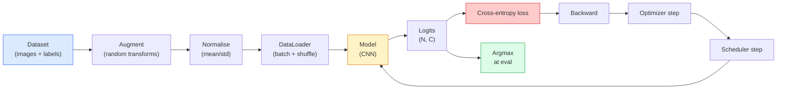

# 影像分類

> 分類器就是一個從像素映射到類別機率分布的函式。其他一切都只是接管線。

**類型：** 實作
**程式語言：** Python
**先修單元：** 階段 2 · 09（模型評估）、階段 3 · 10（迷你框架）、階段 4 · 03（CNN）
**時間：** 約 75 分鐘

## 學習目標

- 在 CIFAR-10 上打造一條端到端的影像分類流程：資料集、資料增強、模型、訓練迴圈、評估
- 說明每個元件（dataloader、損失函式、最佳化器、排程器、資料增強）各自的角色，並預測其中任何一個壞掉時會在損失曲線上呈現什麼樣子
- 從零實作 mixup、cutout 與標籤平滑，並判斷各自值得在什麼時候加進來
- 讀懂混淆矩陣與各類別的精確率／召回率表格，診斷出總體準確率看不到的資料集與模型問題

## 問題所在

每一個真正上線的視覺任務，某種程度上都能化簡成影像分類。偵測是對區域做分類。分割是對像素做分類。檢索則依照與各類別中心的相似度排序。把分類做對 —— 資料集迴圈、資料增強策略、損失函式、評估方式 —— 這項能力會遷移到本階段其他所有任務上。

大多數分類的錯誤都不在模型裡，而是住在流程裡：正規化寫錯、訓練集沒打亂、資料增強扭曲了標籤、驗證集被訓練資料汙染、學習率在第 30 個週期之後悄悄發散。同一個 CNN 在設定正確時能在 CIFAR-10 上拿到 93%，設定壞掉時通常只有 70-75%，而且整個過程中損失曲線看起來都很合理。

這一課會親手把整條流程接起來，讓每一部分都能被檢查。你不會用到 `torchvision.datasets` 裡任何可能藏著 bug 的東西。

## 核心概念

### 分類流程



這個迴圈裡的每一條線都可能住著一個 bug。交叉熵吃的是原始 logits，不是 softmax 之後的輸出，所以在損失函式之前寫任何 `model(x).softmax()` 都會靜靜地算出錯誤的梯度。資料增強只作用在輸入上，不動標籤 —— 除了 mixup，它兩邊都混。`optimizer.zero_grad()` 每一步必須剛好呼叫一次；漏掉它會累積梯度，看起來就像學習率高到極不穩定。上面每一個 bug 都會把學習曲線壓平，卻不會拋出任何錯誤。

### 交叉熵、logits 與 softmax

分類器對每張影像產生 `C` 個數字，稱為 logits。套上 softmax 就把它們轉成機率分布：

```
softmax(z)_i = exp(z_i) / sum_j exp(z_j)
```

交叉熵量測的是正確類別的負對數機率：

```
CE(z, y) = -log( softmax(z)_y )
        = -z_y + log( sum_j exp(z_j) )
```

右邊那個形式才是數值穩定的版本（log-sum-exp）。PyTorch 的 `nn.CrossEntropyLoss` 把 softmax + NLL 融合成一個運算，直接吃原始 logits。自己先套一次 softmax 幾乎一定是 bug —— 你算出來的是 log(softmax(softmax(z)))，一個沒有意義的量。

### 資料增強為什麼有用

CNN 對平移有歸納偏差（來自權重共享），但對裁切、翻轉、色彩抖動或遮擋都沒有內建的不變性。要教它這些不變性，唯一的辦法就是給它看那些會用到這些不變性的像素。訓練期間的每一個隨機變換，都是在說：「這兩張影像有相同的標籤；去學那些會忽略掉差異的特徵。」

```
Original crop:  "dog facing left"
Flip:           "dog facing right"       <- same label, different pixels
Rotate(+15):    "dog, slight tilt"
Colour jitter:  "dog in warmer light"
RandomErasing:  "dog with patch missing"
```

規則是：資料增強必須保持標籤不變。cutout 與旋轉套在數字上，可能把「6」翻成「9」；對那種資料集，你會用較小的旋轉範圍，並挑選尊重數字特有不變性的增強方式。

### Mixup 與 cutmix

一般的資料增強只變換像素，標籤仍然是 one-hot。**Mixup** 與 **cutmix** 打破了這一點 —— 它們把兩邊都做內插。

```
Mixup:
  lambda ~ Beta(a, a)
  x = lambda * x_i + (1 - lambda) * x_j
  y = lambda * y_i + (1 - lambda) * y_j

Cutmix:
  paste a random rectangle of x_j into x_i
  y = area-weighted mix of y_i and y_j
```

為什麼有幫助：模型不再死記那些尖銳的 one-hot 目標，而是學會在類別之間做內插。訓練損失變高，測試準確率變高。對任何分類器來說，這是最便宜的穩健性升級。

### 標籤平滑

mixup 的近親。不再拿 `[0, 0, 1, 0, 0]` 當訓練目標，而是改用 `[eps/C, eps/C, 1-eps, eps/C, eps/C]`，其中 `eps` 是個小值，例如 0.1。這會阻止模型產生任意尖銳的 logits，並且幾乎不花成本就改善了校準。自 PyTorch 1.10 起，`nn.CrossEntropyLoss(label_smoothing=0.1)` 已內建這個功能。

### 超越準確率的評估

總體準確率會藏住不平衡。一個 90-10 的二元分類器只要永遠預測多數類別就有 90%。真正能告訴你發生了什麼事的工具是：

- **各類別準確率** —— 每個類別一個數字；表現不佳的類別立刻現形。
- **混淆矩陣** —— 一個 C x C 的格子，第 i 橫列、第 j 縱行是實際類別 i 被預測成類別 j 的次數；對角線是預測正確的部分，而你的模型真正的樣貌就住在非對角線上。
- **Top-1／Top-5** —— 正確類別有沒有出現在機率最高的 1 個或 5 個預測裡；Top-5 對 ImageNet 很重要，因為像「Norwich terrier」與「Norfolk terrier」這樣的類別確實有真正的模糊性。
- **校準（ECE）** —— 信心值 0.8 的預測，真的有 80% 的時候是對的嗎？現代網路系統性地過度自信；用溫度縮放或標籤平滑可以修正。

```figure
receptive-field
```

## 動手實作

### 步驟 1：一個確定性的合成資料集

CIFAR-10 放在磁碟上。為了讓這一課可重現又跑得快，我們造一個看起來像 CIFAR 的合成資料集 —— 32x32 的 RGB 影像，帶有模型必須學會的類別專屬結構。同一條流程放到真正的 CIFAR-10 上完全不用改。

```python
import numpy as np
import torch
from torch.utils.data import Dataset


def synthetic_cifar(num_per_class=1000, num_classes=10, seed=0):
    rng = np.random.default_rng(seed)
    X = []
    Y = []
    for c in range(num_classes):
        centre = rng.uniform(0, 1, (3,))
        freq = 2 + c
        for _ in range(num_per_class):
            yy, xx = np.meshgrid(np.linspace(0, 1, 32), np.linspace(0, 1, 32), indexing="ij")
            r = np.sin(xx * freq) * 0.5 + centre[0]
            g = np.cos(yy * freq) * 0.5 + centre[1]
            b = (xx + yy) * 0.5 * centre[2]
            img = np.stack([r, g, b], axis=-1)
            img += rng.normal(0, 0.08, img.shape)
            img = np.clip(img, 0, 1)
            X.append(img.astype(np.float32))
            Y.append(c)
    X = np.stack(X)
    Y = np.array(Y)
    idx = rng.permutation(len(X))
    return X[idx], Y[idx]


class ArrayDataset(Dataset):
    def __init__(self, X, Y, transform=None):
        self.X = X
        self.Y = Y
        self.transform = transform

    def __len__(self):
        return len(self.X)

    def __getitem__(self, i):
        img = self.X[i]
        if self.transform is not None:
            img = self.transform(img)
        img = torch.from_numpy(img).permute(2, 0, 1)
        return img, int(self.Y[i])
```

每個類別都有自己的色盤與頻率樣式，再加上高斯雜訊，逼模型去學訊號而不是把像素背下來。十個類別，每類一千張影像，全部打亂。

### 步驟 2：正規化與資料增強

每條視覺流程都會有的兩個變換。

```python
def standardize(mean, std):
    mean = np.array(mean, dtype=np.float32)
    std = np.array(std, dtype=np.float32)
    def _fn(img):
        return (img - mean) / std
    return _fn


def random_hflip(p=0.5):
    def _fn(img):
        if np.random.random() < p:
            return img[:, ::-1, :].copy()
        return img
    return _fn


def random_crop(pad=4):
    def _fn(img):
        h, w = img.shape[:2]
        padded = np.pad(img, ((pad, pad), (pad, pad), (0, 0)), mode="reflect")
        y = np.random.randint(0, 2 * pad)
        x = np.random.randint(0, 2 * pad)
        return padded[y:y + h, x:x + w, :]
    return _fn


def compose(*fns):
    def _fn(img):
        for fn in fns:
            img = fn(img)
        return img
    return _fn
```

裁切前用反射填補（reflect-pad），不要用零填補，因為黑邊本身就是一種訊號，模型會學著以一種沒有用處的方式忽略它。

### 步驟 3：Mixup

在訓練步驟裡把兩張影像與兩個標籤混起來。實作成批次層級的變換，讓它待在前向傳播旁邊，而不是塞進資料集裡。

```python
def mixup_batch(x, y, num_classes, alpha=0.2):
    if alpha <= 0:
        return x, torch.nn.functional.one_hot(y, num_classes).float()
    lam = float(np.random.beta(alpha, alpha))
    idx = torch.randperm(x.size(0), device=x.device)
    x_mixed = lam * x + (1 - lam) * x[idx]
    y_onehot = torch.nn.functional.one_hot(y, num_classes).float()
    y_mixed = lam * y_onehot + (1 - lam) * y_onehot[idx]
    return x_mixed, y_mixed


def soft_cross_entropy(logits, soft_targets):
    log_probs = torch.log_softmax(logits, dim=-1)
    return -(soft_targets * log_probs).sum(dim=-1).mean()
```

`soft_cross_entropy` 就是對一個軟標籤分布算交叉熵。當目標剛好是 one-hot 時，它會退化成一般的 one-hot 情況。

### 步驟 4：訓練迴圈

完整的配方：資料掃過一遍，每個批次算一次梯度，排程器每個週期走一步。

```python
import torch
import torch.nn as nn
from torch.utils.data import DataLoader
from torch.optim import SGD
from torch.optim.lr_scheduler import CosineAnnealingLR

def train_one_epoch(model, loader, optimizer, device, num_classes, use_mixup=True):
    model.train()
    total, correct, loss_sum = 0, 0, 0.0
    for x, y in loader:
        x, y = x.to(device), y.to(device)
        if use_mixup:
            x_m, y_soft = mixup_batch(x, y, num_classes)
            logits = model(x_m)
            loss = soft_cross_entropy(logits, y_soft)
        else:
            logits = model(x)
            loss = nn.functional.cross_entropy(logits, y, label_smoothing=0.1)
        optimizer.zero_grad()
        loss.backward()
        optimizer.step()
        loss_sum += loss.item() * x.size(0)
        total += x.size(0)
        # Training accuracy vs the un-mixed labels `y` is only an approximation
        # when mixup is on (the model saw soft targets, not y). Treat it as a
        # rough progress signal; rely on val accuracy for real performance.
        with torch.no_grad():
            pred = logits.argmax(dim=-1)
            correct += (pred == y).sum().item()
    return loss_sum / total, correct / total


@torch.no_grad()
def evaluate(model, loader, device, num_classes):
    model.eval()
    total, correct = 0, 0
    loss_sum = 0.0
    cm = torch.zeros(num_classes, num_classes, dtype=torch.long)
    for x, y in loader:
        x, y = x.to(device), y.to(device)
        logits = model(x)
        loss = nn.functional.cross_entropy(logits, y)
        pred = logits.argmax(dim=-1)
        for t, p in zip(y.cpu(), pred.cpu()):
            cm[t, p] += 1
        loss_sum += loss.item() * x.size(0)
        total += x.size(0)
        correct += (pred == y).sum().item()
    return loss_sum / total, correct / total, cm
```

每次寫訓練迴圈都要檢查的五個不變條件：

1. 訓練前 `model.train()`，評估前 `model.eval()` —— 這會切換 dropout 與 batchnorm 的行為。
2. `.backward()` 之前先 `.zero_grad()`。
3. 累積指標時用 `.item()`，這樣就不會有東西讓計算圖一直活著。
4. 評估期間掛上 `@torch.no_grad()` —— 省記憶體、省時間，也避免不易察覺的意外。
5. 對原始 logits 取 argmax，不要對 softmax 取 —— 結果一樣，少一個運算。

### 步驟 5：組裝起來

用上一課的 `TinyResNet`，訓練幾個週期，然後評估。

```python
from main import synthetic_cifar, ArrayDataset
from main import standardize, random_hflip, random_crop, compose
from main import mixup_batch, soft_cross_entropy
from main import train_one_epoch, evaluate
# TinyResNet comes from the previous lesson (03-cnns-lenet-to-resnet).
# Adjust the import path to wherever you stored the previous lesson's code.
from cnns_lenet_to_resnet import TinyResNet  # example placeholder

X, Y = synthetic_cifar(num_per_class=500)
split = int(0.9 * len(X))
X_train, Y_train = X[:split], Y[:split]
X_val, Y_val = X[split:], Y[split:]

mean = [0.5, 0.5, 0.5]
std = [0.25, 0.25, 0.25]
train_tf = compose(random_hflip(), random_crop(pad=4), standardize(mean, std))
eval_tf = standardize(mean, std)

train_ds = ArrayDataset(X_train, Y_train, transform=train_tf)
val_ds = ArrayDataset(X_val, Y_val, transform=eval_tf)

train_loader = DataLoader(train_ds, batch_size=128, shuffle=True, num_workers=0)
val_loader = DataLoader(val_ds, batch_size=256, shuffle=False, num_workers=0)

device = "cuda" if torch.cuda.is_available() else "cpu"
model = TinyResNet(num_classes=10).to(device)
optimizer = SGD(model.parameters(), lr=0.1, momentum=0.9, weight_decay=5e-4, nesterov=True)
scheduler = CosineAnnealingLR(optimizer, T_max=10)

for epoch in range(10):
    tr_loss, tr_acc = train_one_epoch(model, train_loader, optimizer, device, 10, use_mixup=True)
    va_loss, va_acc, _ = evaluate(model, val_loader, device, 10)
    scheduler.step()
    print(f"epoch {epoch:2d}  lr {scheduler.get_last_lr()[0]:.4f}  "
          f"train {tr_loss:.3f}/{tr_acc:.3f}  val {va_loss:.3f}/{va_acc:.3f}")
```

在這個合成資料集上，五個週期內驗證準確率就會接近完美，而這正是重點：流程是對的，模型學得到那些學得會的東西。把資料集換成真正的 CIFAR-10，同一個迴圈不用改也能訓練到約 90%。

### 步驟 6：讀懂混淆矩陣

單看準確率永遠告訴不了你模型在哪裡失敗。混淆矩陣可以。

```python
def print_confusion(cm, labels=None):
    c = cm.shape[0]
    labels = labels or [str(i) for i in range(c)]
    print(f"{'':>6}" + "".join(f"{l:>5}" for l in labels))
    for i in range(c):
        row = cm[i].tolist()
        print(f"{labels[i]:>6}" + "".join(f"{v:>5}" for v in row))
    print()
    tp = cm.diag().float()
    fp = cm.sum(dim=0).float() - tp
    fn = cm.sum(dim=1).float() - tp
    prec = tp / (tp + fp).clamp_min(1)
    rec = tp / (tp + fn).clamp_min(1)
    f1 = 2 * prec * rec / (prec + rec).clamp_min(1e-9)
    for i in range(c):
        print(f"{labels[i]:>6}  prec {prec[i]:.3f}  rec {rec[i]:.3f}  f1 {f1[i]:.3f}")

_, _, cm = evaluate(model, val_loader, device, 10)
print_confusion(cm)
```

橫列是實際類別，縱行是預測。如果類別 3 與類別 5 之間出現一叢非對角線的計數，代表模型把這兩者搞混了，而這給了你一個起點 —— 針對性地補資料，或是加上針對該類別的資料增強。

## 框架應用

`torchvision` 把上面所有東西都包成慣用的元件。對真正的 CIFAR-10 來說，整條流程就是四行加上一個訓練迴圈。

```python
from torchvision.datasets import CIFAR10
from torchvision.transforms import Compose, RandomCrop, RandomHorizontalFlip, ToTensor, Normalize

mean = (0.4914, 0.4822, 0.4465)
std = (0.2470, 0.2435, 0.2616)
train_tf = Compose([
    RandomCrop(32, padding=4, padding_mode="reflect"),
    RandomHorizontalFlip(),
    ToTensor(),
    Normalize(mean, std),
])
eval_tf = Compose([ToTensor(), Normalize(mean, std)])

train_ds = CIFAR10(root="./data", train=True,  download=True, transform=train_tf)
val_ds   = CIFAR10(root="./data", train=False, download=True, transform=eval_tf)
```

有兩件事要注意：mean／std 是**資料集專屬**的 —— 它們算自 CIFAR-10 的訓練集，不是 ImageNet —— 而反射填補是社群預設的裁切策略。把 ImageNet 的統計值複製貼到這裡，會漏掉約 1% 的準確率，而且沒人會發現，直到有人真的去分析這個模型。

## 產出交付

這一課會產出：

- `outputs/prompt-classifier-pipeline-auditor.md` —— 一段提示詞，會針對上面五個不變條件審查一份訓練腳本，並指出第一個違規之處。
- `outputs/skill-classification-diagnostics.md` —— 一份技能文件，給定一個混淆矩陣與一份類別名稱清單，總結各類別的失敗情形，並提出影響最大的那一個修法。

## 練習

1. **（簡單）** 在合成資料集上，分別用 mixup 與不用 mixup 訓練同一個模型五個週期。把兩者的訓練與驗證損失畫出來。說明為什麼用了 mixup 的訓練損失比較高，驗證準確率卻相近甚至更好。
2. **（中等）** 實作 Cutout —— 在每張訓練影像裡把一個隨機的 8x8 方塊歸零 —— 然後做一組消融實驗：完全不增強、hflip+crop、hflip+crop+cutout、hflip+crop+mixup。回報每一種的驗證準確率。
3. **（困難）** 打造一條 CIFAR-100 的流程（100 個類別，輸入尺寸相同），並重現一次 ResNet-34 的訓練，達到與已發表準確率相差 1% 以內。加分項：掃三個學習率與兩個權重衰減值、記錄到本地 CSV，並產出最終的「混淆矩陣最常混淆組合」表格。

## 關鍵術語

| 術語 | 大家怎麼說 | 實際上是什麼 |
|------|----------------|----------------------|
| Logits | 「原始輸出」 | 每張影像在 softmax 之前的那個 C 維向量；交叉熵要的是這個，不是 softmax 過的值 |
| 交叉熵 | 「損失」 | 正確類別的負對數機率；把 log-softmax 與 NLL 合成一個數值穩定的運算 |
| DataLoader | 「打包批次的東西」 | 把資料集包上打亂、分批，以及（選配的）多工作行程載入；一半的訓練 bug 都被算在它頭上 |
| 資料增強 | 「隨機變換」 | 訓練時任何保持標籤不變的像素層級變換；教會 CNN 它天生沒有的不變性 |
| Mixup／Cutmix | 「把兩張影像混起來」 | 同時混合輸入與標籤，讓分類器學到平滑的內插而不是硬邊界 |
| 標籤平滑 | 「軟一點的目標」 | 把 one-hot 換成 (1-eps, eps/(C-1), ...)；改善校準，並小幅提升準確率 |
| Top-k 準確率 | 「Top-5」 | 正確類別出現在機率最高的 k 個預測裡；用在類別本身確實有模糊性的資料集上 |
| 混淆矩陣 | 「錯誤都住在哪裡」 | 一張 C x C 的表格，第 (i, j) 格數的是實際類別 i 被預測成 j 的影像數；對角線是對的，非對角線告訴你該修什麼 |

## 延伸閱讀

- [CS231n: Training Neural Networks](https://cs231n.github.io/neural-networks-3/) —— 到今天仍然是單頁篇幅內把訓練流程講得最清楚的一份
- [Bag of Tricks for Image Classification (He et al., 2019)](https://arxiv.org/abs/1812.01187) —— 每一個小技巧，加起來讓 ResNet 在 ImageNet 上的準確率多 3-4%
- [mixup: Beyond Empirical Risk Minimization (Zhang et al., 2017)](https://arxiv.org/abs/1710.09412) —— 最早的 mixup 論文；三頁理論加上有說服力的實驗
- [Why temperature scaling matters (Guo et al., 2017)](https://arxiv.org/abs/1706.04599) —— 證明現代網路校準有偏差，並用一個純量參數修好它的那篇論文
