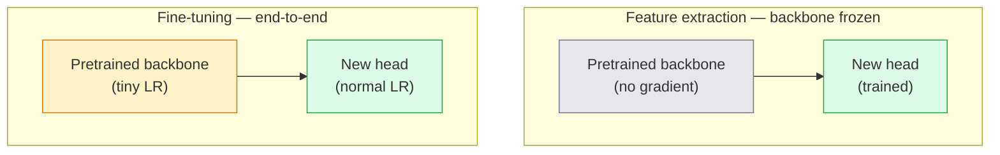

# 遷移學習與微調

> 別人已經花了一百萬個 GPU 小時，教一個網路認識邊緣、紋理與物件部件長什麼樣子。在你自己開始訓練之前，先把那些特徵借過來用。

**類型：** 實作
**程式語言：** Python
**先修單元：** 階段 4 · 03（CNN）、階段 4 · 04（影像分類）
**時間：** 約 75 分鐘

## 學習目標

- 區分特徵抽取與微調，並依資料集大小、領域差距與算力預算挑對其中一種
- 載入一個預訓練主幹網路、換掉它的分類頭，只訓練那個頭，在 20 行以內做出一條可用的基線
- 搭配差異化學習率逐層解凍，讓早期的通用特徵拿到比後期任務專屬特徵更小的更新量
- 診斷三種常見故障：解凍區塊的學習率過高導致特徵漂移、在極小資料集上 BN 統計量崩壞，以及災難性遺忘

## 問題所在

在 ImageNet 上訓練一個 ResNet-50 大約要 2,000 個 GPU 小時。幾乎沒有團隊能為每個要出貨的任務都掏出這筆預算。幾乎每個團隊真正出貨的，都是一個預訓練主幹網路，配上一個用幾百或幾千張任務專屬影像訓練出來的新頭。

這不是偷吃步。任何在 ImageNet 上訓練過的 CNN，第一個卷積區塊學到的是邊緣與 Gabor 風格的濾波器。接下來幾個區塊學到紋理和簡單的圖案母題。中間的區塊學到物件部件。最後幾個區塊學到的組合，開始長得像那 1,000 個 ImageNet 類別。這個層級結構的前 90% 幾乎原封不動地遷移到醫學影像、工業檢測、衛星資料，以及其他每一種視覺任務——因為大自然在邊緣與紋理上的詞彙量是有限的。你真正要訓練的是最後那 10%。

要把遷移做對，有三個 bug 在前面等你：用過高的學習率毀掉預訓練特徵、凍結太多而讓模型吃不到資訊，以及讓 BatchNorm 的移動統計量往一個網路其餘部分從未學過的極小資料集偏移。本單元會刻意把這三個都走一遍。

## 核心概念

### 特徵抽取對上微調

兩種模式，取決於你對預訓練特徵有多信任、以及手上有多少資料。



經驗法則：

| 資料集大小 | 領域差距 | 配方 |
|--------------|-----------------|--------|
| < 1k 張影像 | 接近 ImageNet | 凍結主幹網路，只訓練頭 |
| 1k-10k | 接近 | 凍結前 2-3 個 stage，其餘微調 |
| 10k-100k | 任意 | 用差異化學習率端到端微調 |
| 100k+ | 遠 | 全部微調；領域差距真的夠遠時，可以考慮從零訓練 |

「接近 ImageNet」大致是指內容有物件感的自然 RGB 照片。醫學 CT 掃描、俯視衛星影像與顯微影像都屬於遠領域——那些特徵仍然有用，但你得放更多層去適應。

### 凍結為什麼行得通

CNN 在 ImageNet 上學到的特徵並不是為那 1,000 個類別特化的。它們是為自然影像的統計特性特化的：特定方向的邊緣、紋理、對比圖樣、形狀基元。這些統計特性在幾乎任何人叫得出名字的視覺領域裡都很穩定。所以一個在 ImageNet 上訓練的模型，只換一個新的線性頭（主幹網路完全不微調）就在 CIFAR-10 上零樣本評測，也能到 80% 以上的準確率。那個頭學的是「對這個任務該把已經學好的哪些特徵加重權重」。

### 差異化學習率

真要解凍的時候，早期層的訓練速度應該比後期層慢。早期層編碼的是你想保留的通用特徵；後期層編碼的是任務專屬結構，那是你需要大幅移動的部分。

```
Typical recipe:

  stage 0 (stem + first group): lr = base_lr / 100    (mostly fixed)
  stage 1:                       lr = base_lr / 10
  stage 2:                       lr = base_lr / 3
  stage 3 (last backbone group): lr = base_lr
  head:                          lr = base_lr  (or slightly higher)
```

在 PyTorch 裡這只是一串傳給最佳化器的參數群組。一個模型、五個學習率、零行額外程式碼。

### BatchNorm 的問題

BN 層裡存著 `running_mean` 和 `running_var` 兩個 buffer，它們是在 ImageNet 上算出來的。如果你的任務有不同的像素分布——不同的光照、不同的感測器、不同的色彩空間——那些 buffer 就是錯的。三個選項，依偏好排序：

1. **讓 BN 留在 train 模式下微調。** 讓 BN 跟其他所有東西一起更新它的移動統計量。任務資料集屬於中等規模（>= 5k 筆）時的預設選擇。
2. **把 BN 凍在 eval 模式。** 保留 ImageNet 的統計量，只訓練權重。當你的資料集小到會讓 BN 的移動平均變得很吵時，這才是對的做法。
3. **把 BN 換成 GroupNorm。** 徹底移除移動平均的問題。用在偵測與分割的主幹網路上，因為那裡每張 GPU 的批次大小都極小。

這件事做錯，準確率會無聲無息地掉 5-15%。

### 分類頭的設計

分類頭是 1 到 3 個線性層，外加一個可選的 dropout。每個 torchvision 主幹網路都附一個預設的頭，等你把它換掉：

```
backbone.fc = nn.Linear(backbone.fc.in_features, num_classes)          # ResNet
backbone.classifier[1] = nn.Linear(..., num_classes)                    # EfficientNet, MobileNet
backbone.heads.head = nn.Linear(..., num_classes)                       # torchvision ViT
```

資料集小的時候，單一個線性層通常就夠了。當任務分布離主幹網路的訓練分布比較遠時，加一個隱藏層（Linear -> ReLU -> Dropout -> Linear）會有幫助。

### 逐層學習率衰減

現代微調（BEiT、DINOv2、ViT-B 的微調）在用的、比較平滑的差異化學習率版本。不再把層分組成 stage，而是讓每一層的學習率都比它上面那層再小一點：

```
lr_layer_k = base_lr * decay^(L - k)
```

取 decay = 0.75、L = 12 個 transformer 區塊，第一個區塊的訓練學習率是頭的 `0.75^11 ≈ 0.04x`。這對 transformer 微調比對 CNN 更重要，CNN 通常用 stage 分組的學習率就夠了。

### 該評測什麼

遷移學習的訓練需要兩個數字，是你在從零訓練時不會追蹤的：

- **僅預訓練的準確率** —— 主幹網路凍結時那個頭的準確率。這是你的地板。
- **微調後的準確率** —— 同一個模型端到端訓練之後的成績。這是你的天花板。

如果微調後比僅預訓練還差，那你有一個學習率或 BN 的 bug。兩個都要印出來。

## 動手實作

### 步驟 1：載入一個預訓練主幹網路並檢視它

```python
import torch
import torch.nn as nn
from torchvision.models import resnet18, ResNet18_Weights

backbone = resnet18(weights=ResNet18_Weights.IMAGENET1K_V1)
print(backbone)
print()
print("classifier head:", backbone.fc)
print("feature dim:", backbone.fc.in_features)
```

`ResNet18` 有四個 stage（`layer1..layer4`），前面加一個 stem、後面接一個 `fc` 頭。每個 torchvision 的分類主幹網路都有類似的結構。

### 步驟 2：特徵抽取——全部凍結，換掉頭

```python
def make_feature_extractor(num_classes=10):
    model = resnet18(weights=ResNet18_Weights.IMAGENET1K_V1)
    for p in model.parameters():
        p.requires_grad = False
    model.fc = nn.Linear(model.fc.in_features, num_classes)
    return model

model = make_feature_extractor(num_classes=10)
trainable = sum(p.numel() for p in model.parameters() if p.requires_grad)
frozen = sum(p.numel() for p in model.parameters() if not p.requires_grad)
print(f"trainable: {trainable:>10,}")
print(f"frozen:    {frozen:>10,}")
```

只有 `model.fc` 是可訓練的。主幹網路成了一個凍結的特徵抽取器。

### 步驟 3：差異化微調

一個工具函式，建出帶有各 stage 專屬學習率的參數群組。

```python
def discriminative_param_groups(model, base_lr=1e-3, decay=0.3):
    stages = [
        ["conv1", "bn1"],
        ["layer1"],
        ["layer2"],
        ["layer3"],
        ["layer4"],
        ["fc"],
    ]
    groups = []
    for i, names in enumerate(stages):
        lr = base_lr * (decay ** (len(stages) - 1 - i))
        params = [p for n, p in model.named_parameters()
                  if any(n.startswith(k) for k in names)]
        if params:
            groups.append({"params": params, "lr": lr, "name": "_".join(names)})
    return groups

model = resnet18(weights=ResNet18_Weights.IMAGENET1K_V1)
model.fc = nn.Linear(model.fc.in_features, 10)
for p in model.parameters():
    p.requires_grad = True

groups = discriminative_param_groups(model)
for g in groups:
    print(f"{g['name']:>10s}  lr={g['lr']:.2e}  params={sum(p.numel() for p in g['params']):>8,}")
```

`decay=0.3` 意思是每個 stage 的訓練速率是下一個 stage 的 30%。`fc` 拿到 `base_lr`、`layer4` 拿到 `0.3 * base_lr`、`conv1` 拿到 `0.3^5 * base_lr ≈ 0.00243 * base_lr`。聽起來很極端；但實務上就是有效。

### 步驟 4：處理 BatchNorm

一個輔助函式，凍結 BN 的移動統計量但不凍結它的權重。

```python
def freeze_bn_stats(model):
    for m in model.modules():
        if isinstance(m, (nn.BatchNorm1d, nn.BatchNorm2d, nn.BatchNorm3d)):
            m.eval()
            for p in m.parameters():
                p.requires_grad = False
    return model
```

在每個 epoch 開頭呼叫 `model.train()` 之後再呼叫它。`model.train()` 會把所有東西切到訓練模式；這個函式只把 BN 層切回來。

### 步驟 5：一個最小的端到端微調迴圈

```python
from torch.optim import SGD
from torch.utils.data import DataLoader
from torch.optim.lr_scheduler import CosineAnnealingLR
import torch.nn.functional as F

def fine_tune(model, train_loader, val_loader, device, epochs=5, base_lr=1e-3, freeze_bn=False):
    model = model.to(device)
    groups = discriminative_param_groups(model, base_lr=base_lr)
    optimizer = SGD(groups, momentum=0.9, weight_decay=1e-4, nesterov=True)
    scheduler = CosineAnnealingLR(optimizer, T_max=epochs)

    for epoch in range(epochs):
        model.train()
        if freeze_bn:
            freeze_bn_stats(model)
        tr_loss, tr_correct, tr_total = 0.0, 0, 0
        for x, y in train_loader:
            x, y = x.to(device), y.to(device)
            logits = model(x)
            loss = F.cross_entropy(logits, y, label_smoothing=0.1)
            optimizer.zero_grad()
            loss.backward()
            optimizer.step()
            tr_loss += loss.item() * x.size(0)
            tr_total += x.size(0)
            tr_correct += (logits.argmax(-1) == y).sum().item()
        scheduler.step()

        model.eval()
        va_total, va_correct = 0, 0
        with torch.no_grad():
            for x, y in val_loader:
                x, y = x.to(device), y.to(device)
                pred = model(x).argmax(-1)
                va_total += x.size(0)
                va_correct += (pred == y).sum().item()
        print(f"epoch {epoch}  train {tr_loss/tr_total:.3f}/{tr_correct/tr_total:.3f}  "
              f"val {va_correct/va_total:.3f}")
    return model
```

用上面這套配方在 CIFAR-10 上跑五個 epoch，可以把 `ResNet18-IMAGENET1K_V1` 從零樣本線性探測的約 70% 準確率推到微調後的約 93%。只訓練那個頭、完全不碰主幹網路的話，大概會在 86% 上下停住。

### 步驟 6：逐層解凍

一個排程，從最後面往最前面每個 epoch 解凍一個 stage。代價是多花幾個 epoch，換來緩解特徵漂移。

```python
def progressive_unfreeze_schedule(model):
    stages = ["layer4", "layer3", "layer2", "layer1"]
    yielded = set()

    def start():
        for p in model.parameters():
            p.requires_grad = False
        for p in model.fc.parameters():
            p.requires_grad = True

    def unfreeze(epoch):
        if epoch < len(stages):
            name = stages[epoch]
            yielded.add(name)
            for n, p in model.named_parameters():
                if n.startswith(name):
                    p.requires_grad = True
            return name
        return None

    return start, unfreeze
```

第一個 epoch 之前呼叫 `start()` 一次。每個 epoch 開頭呼叫 `unfreeze(epoch)`。只要可訓練參數的集合有變動，就要重建最佳化器，否則那些被凍結的參數還握著快取的動量，會把它搞糊。

## 框架應用

大部分真實任務用 `torchvision.models` 加三行程式碼就夠了。上面那些比較重的機制，是在你撞上函式庫預設值修不掉的問題時才派上用場。

```python
from torchvision.models import resnet50, ResNet50_Weights

model = resnet50(weights=ResNet50_Weights.IMAGENET1K_V2)
model.fc = nn.Linear(model.fc.in_features, num_classes)
optimizer = torch.optim.AdamW(model.parameters(), lr=1e-4, weight_decay=1e-4)
```

另外兩個生產級的預設選項：

- `timm` 提供約 800 個預訓練視覺主幹網路，介面一致（`timm.create_model("resnet50", pretrained=True, num_classes=10)`）。任何超出 torchvision 模型庫範圍的微調，它就是標準做法。
- 要用 transformer 的話，`transformers.AutoModelForImageClassification.from_pretrained(name, num_labels=N)` 會給你 ViT / BEiT / DeiT，載入語意跟文字模型完全一樣。

## 產出交付

本單元會產出：

- `outputs/prompt-fine-tune-planner.md` —— 一個提示詞，依據資料集大小、領域差距與算力預算，在特徵抽取、逐層解凍與端到端微調之間做選擇。
- `outputs/skill-freeze-inspector.md` —— 一項技能，給它一個 PyTorch 模型，它會回報哪些參數可訓練、哪些 BatchNorm 層處於 eval 模式，以及最佳化器實際上有沒有拿到那些可訓練參數。

## 練習

1. **（簡單）** 在同一份合成 CIFAR 資料集上，把一個 `ResNet18` 分別當成線性探測（主幹網路凍結）和完整微調各訓練一次。把兩個準確率並排列出來。說明哪一段落差告訴你特徵遷移得好，哪一段告訴你它遷移得不好。
2. **（中等）** 刻意製造一個 bug：把 `base_lr = 1e-1` 設在主幹網路那個 stage 上，而不是設在頭上。展示訓練損失爆掉，再用 `discriminative_param_groups` 這個輔助函式救回來。記錄每個 stage 開始發散時的學習率。
3. **（困難）** 拿一個醫學影像資料集（例如 CheXpert-small、PatchCamelyon 或 HAM10000），比較三種模式：(a) ImageNet 預訓練、主幹網路凍結加一個線性頭；(b) ImageNet 預訓練、端到端微調；(c) 從零訓練。分別回報準確率與算力成本。資料集要多大，從零訓練才開始有競爭力？

## 關鍵術語

| 術語 | 大家怎麼說 | 實際上是什麼 |
|------|----------------|----------------------|
| 特徵抽取 | 「凍結然後訓練頭」 | 主幹網路的參數全部凍結，只有新的分類頭收得到梯度 |
| 微調 | 「端到端重訓」 | 所有參數都可訓練，學習率通常遠小於從零訓練 |
| 差異化學習率 | 「早期層學習率小一點」 | 最佳化器的參數群組，前段 stage 的學習率是後段 stage 的一個分數 |
| 逐層學習率衰減 | 「平滑的學習率梯度」 | 每層的學習率乘上 decay^(L - k)；常見於 transformer 微調 |
| 災難性遺忘 | 「模型把 ImageNet 忘了」 | 學習率過高，在新任務的訊號還沒學到之前就把預訓練特徵覆寫掉 |
| BN 統計量漂移 | 「running mean 是錯的」 | BatchNorm 的 running_mean/var 是在跟當前任務不同的分布上算出來的，無聲無息地拉低準確率 |
| 線性探測 | 「凍結主幹網路加線性頭」 | 對預訓練特徵的評測方式——在凍結的表示之上，最好的線性分類器能達到多少準確率 |
| 災難性崩壞 | 「所有東西都預測成同一類」 | 微調時學習率高到在頭的梯度還來不及穩定之前就毀掉特徵，就會發生 |

## 延伸閱讀

- [How transferable are features in deep neural networks? (Yosinski et al., 2014)](https://arxiv.org/abs/1411.1792) —— 把特徵的逐層可遷移性量化出來的那篇論文
- [Universal Language Model Fine-tuning (ULMFiT, Howard & Ruder, 2018)](https://arxiv.org/abs/1801.06146) —— 差異化學習率／逐層解凍配方的原始出處；這些想法可以直接遷移到視覺
- [timm documentation](https://huggingface.co/docs/timm) —— 現代視覺主幹網路的參考文件，也記載了它們訓練時所用的確切微調預設值
- [A Simple Framework for Linear-Probe Evaluation (Kornblith et al., 2019)](https://arxiv.org/abs/1805.08974) —— 為什麼線性探測的準確率重要，以及該怎麼正確地回報它
