# 物件偵測 —— 從零實作 YOLO

> 偵測就是分類加上回歸，在特徵圖的每一個位置上跑一遍，最後用非極大值抑制清理乾淨。

**類型：** 實作
**程式語言：** Python
**先修單元：** 階段 4 · 03（CNN）、階段 4 · 04（影像分類）、階段 4 · 05（遷移學習）
**時間：** 約 75 分鐘

## 學習目標

- 解釋「網格加錨框」這套設計如何把偵測變成一個稠密預測問題，並說出輸出張量裡每個數字各代表什麼
- 計算兩個邊界框之間的交集比聯集，並從零實作非極大值抑制
- 在一個預訓練的主幹網路上搭出一個極簡的 YOLO 風格頭部，包含分類、objectness 與邊界框回歸三個損失
- 讀懂一列偵測指標（precision@0.5、recall、mAP@0.5、mAP@0.5:0.95），並判斷下一步該轉哪顆旋鈕

## 問題所在

分類說的是「這張圖是一隻狗」。偵測說的是「像素 (112, 40, 280, 210) 有一隻狗、(400, 180, 560, 310) 有一隻貓，畫面裡沒有其他東西」。就這一個結構上的改變——預測數量不固定的一組帶標籤邊界框，而不是每張圖一個標籤——是每個自駕系統、每個監控產品、每個文件版面解析器、每條工廠視覺產線所依賴的東西。

偵測也是視覺領域裡所有工程權衡同時現形的地方。你要框準（回歸頭），你要每個框的類別對（分類頭），你要模型知道什麼時候根本沒東西可偵測（信賴分數裡的 objectness），你還要每個真實物件恰好對到一個預測（非極大值抑制）。少了任何一項，流程就會漏掉物件、報出幻想出來的框，或是把同一個物件在稍微不同的位置預測十五次。

YOLO（You Only Look Once，Redmon 等人 2016）就是那個讓上面這些能即時跑起來的設計——用卷積網路的單次前向傳播全部做完；而同樣這些結構決策，至今仍是現代偵測器（YOLOv8、YOLOv9、YOLO-NAS、RT-DETR）的骨幹。把核心學會，每個變體都只是同一批零件的重新排列。

## 核心概念

### 把偵測當成稠密預測

分類器每張圖輸出 C 個數字。YOLO 風格的偵測器每張圖輸出 `(S x S x (5 + C))` 個數字，其中 S 是空間網格的邊長。

```mermaid
flowchart LR
    IMG["Input 416x416 RGB"] --> BB["Backbone<br/>(ResNet, DarkNet, ...)"]
    BB --> FM["Feature map<br/>(C_feat, 13, 13)"]
    FM --> HEAD["Detection head<br/>(1x1 convs)"]
    HEAD --> OUT["Output tensor<br/>(13, 13, B * (5 + C))"]
    OUT --> DEC["Decode<br/>(grid + sigmoid + exp)"]
    DEC --> NMS["Non-max suppression"]
    NMS --> RESULT["Final boxes"]

    style IMG fill:#dbeafe,stroke:#2563eb
    style HEAD fill:#fef3c7,stroke:#d97706
    style NMS fill:#fecaca,stroke:#dc2626
    style RESULT fill:#dcfce7,stroke:#16a34a
```



`S * S` 個網格單元裡的每一個都預測 `B` 個邊界框。對每個框：

- 4 個數字描述幾何：`tx, ty, tw, th`。
- 1 個數字是 objectness 分數：「有物件的中心落在這個網格單元裡嗎？」
- C 個數字是各類別的機率。

每個網格單元總共 `B * (5 + C)` 個數字。以 VOC 的 `S=13, B=2, C=20` 為例，就是每個網格單元 50 個數字。

### 為什麼要網格與錨框

單純的回歸會把每個物件的 `(x, y, w, h)` 當成絕對座標來預測。這對卷積網路來說很難，因為平移影像不該讓所有預測都平移同一個量——每個物件在空間上都各有各的定錨處。網格的解法是：把每個真實框指派給它中心所落入的那個網格單元；只有那個網格單元要為那個物件負責。

錨框處理的是第二個問題。一個 3x3 卷積很難從感受野只有 16 像素的特徵單元裡回歸出一個 500 像素寬的框。取而代之，我們為每個網格單元預先定義 `B` 種先驗框形狀（錨框），然後預測相對於每個錨框的小幅位移量。模型學的是挑對錨框、再把它推一下，而不是從無到有硬回歸。

```
Anchor box priors (example for 416x416 input):

  small:   (30,  60)
  medium:  (75,  170)
  large:   (200, 380)

At each grid cell, every anchor emits (tx, ty, tw, th, obj, c_1, ..., c_C).
```

現代偵測器常用特徵金字塔（FPN），每個解析度配一組不同的錨框——小錨框放在淺層高解析度的特徵圖上，大錨框放在深層低解析度的特徵圖上。想法一樣，只是尺度更多。

### 解碼預測

原始的 `tx, ty, tw, th` 並不是框的座標；它們是回歸目標，畫出來之前要先轉換：

```
centre x  = (sigmoid(tx) + cell_x) * stride
centre y  = (sigmoid(ty) + cell_y) * stride
width     = anchor_w * exp(tw)
height    = anchor_h * exp(th)
```

`sigmoid` 把中心偏移量鎖在網格單元內。`exp` 讓寬度能自由地相對錨框縮放，又不會翻成負值。`stride` 把網格座標放大回像素。從 v2 之後，每個 YOLO 版本的這個解碼步驟都一樣。

### IoU

偵測領域裡衡量兩個框有多像的通用指標：

```
IoU(A, B) = area(A intersect B) / area(A union B)
```

IoU = 1 表示完全相同；IoU = 0 表示毫無重疊。預測框與真實框之間的 IoU，決定一個預測算不算真正例（一般取 IoU >= 0.5）。兩個預測框之間的 IoU，則是 NMS 用來去重的依據。

### 非極大值抑制

用相鄰錨框訓練出來的卷積網路，經常會為同一個物件預測出好幾個互相重疊的框。NMS 保留信賴分數最高的那個預測，並刪掉任何與它 IoU 超過門檻的其他預測。

```
NMS(boxes, scores, iou_threshold):
    sort boxes by score descending
    keep = []
    while boxes not empty:
        pick the top-scoring box, add to keep
        remove every box with IoU > iou_threshold to the picked box
    return keep
```

物件偵測常用的門檻：0.45。近期的偵測器把標準 NMS 換成 `soft-NMS`、`DIoU-NMS`，或是直接把抑制學進模型裡（RT-DETR），但結構上的目的都一樣。

### 損失

YOLO 的損失是三個損失加權相加：

```
L = lambda_coord * L_box(pred, target, where obj=1)
  + lambda_obj   * L_obj(pred, 1,     where obj=1)
  + lambda_noobj * L_obj(pred, 0,     where obj=0)
  + lambda_cls   * L_cls(pred, target, where obj=1)
```

只有含物件的網格單元才對邊界框回歸損失與分類損失有貢獻。不含物件的網格單元只貢獻 objectness 損失（教模型保持安靜）。`lambda_noobj` 通常設得很小（約 0.5），因為絕大多數網格單元都是空的，否則負樣本會主宰整個損失。

現代變體把 MSE 邊界框損失換成 CIoU／DIoU（直接最佳化 IoU），用 focal loss 處理類別不平衡，並用 quality focal loss 平衡 objectness。三個組件的結構沒有變。

### 偵測指標

準確率在偵測上派不上用場。派得上用場的是這四個數字：

- **Precision@IoU=0.5** —— 被判為正例的那些預測裡，實際上有多少是對的。
- **Recall@IoU=0.5** —— 真實存在的物件裡，我們找到了多少。
- **AP@0.5** —— IoU 門檻 0.5 之下 precision-recall 曲線的面積；每個類別一個數字。
- **mAP@0.5:0.95** —— AP 在 IoU 門檻 0.5、0.55、…、0.95 上的平均。COCO 用的指標；最嚴格，資訊量也最大。

四個都要報。一個 mAP@0.5 很強但 mAP@0.5:0.95 很弱的偵測器，是位置抓得大概對但框不夠貼；用更好的邊界框回歸損失來修。一個 precision 高、recall 低的偵測器太保守；把信賴分數門檻調低，或把 objectness 的權重調高。

```figure
object-detection-nms
```

## 動手實作

### 步驟 1：IoU

整個單元的主力工具。吃兩個 `(x1, y1, x2, y2)` 格式的框陣列。

```python
import numpy as np

def box_iou(boxes_a, boxes_b):
    ax1, ay1, ax2, ay2 = boxes_a[:, 0], boxes_a[:, 1], boxes_a[:, 2], boxes_a[:, 3]
    bx1, by1, bx2, by2 = boxes_b[:, 0], boxes_b[:, 1], boxes_b[:, 2], boxes_b[:, 3]

    inter_x1 = np.maximum(ax1[:, None], bx1[None, :])
    inter_y1 = np.maximum(ay1[:, None], by1[None, :])
    inter_x2 = np.minimum(ax2[:, None], bx2[None, :])
    inter_y2 = np.minimum(ay2[:, None], by2[None, :])

    inter_w = np.clip(inter_x2 - inter_x1, 0, None)
    inter_h = np.clip(inter_y2 - inter_y1, 0, None)
    inter = inter_w * inter_h

    area_a = (ax2 - ax1) * (ay2 - ay1)
    area_b = (bx2 - bx1) * (by2 - by1)
    union = area_a[:, None] + area_b[None, :] - inter
    return inter / np.clip(union, 1e-8, None)
```

回傳一個 `(N_a, N_b)` 的兩兩 IoU 矩陣。要拿它跟單一個真實框比，就把其中一個陣列做成 `(1, 4)` 的形狀。

### 步驟 2：非極大值抑制

```python
def nms(boxes, scores, iou_threshold=0.45):
    order = np.argsort(-scores)
    keep = []
    while len(order) > 0:
        i = order[0]
        keep.append(i)
        if len(order) == 1:
            break
        rest = order[1:]
        ious = box_iou(boxes[[i]], boxes[rest])[0]
        order = rest[ious <= iou_threshold]
    return np.array(keep, dtype=np.int64)
```

結果確定、複雜度是排序帶來的 `O(N log N)`，而且在相同輸入下與 `torchvision.ops.nms` 的行為一致。

### 步驟 3：邊界框的編碼與解碼

在像素座標與網路真正回歸的 `(tx, ty, tw, th)` 目標之間互相轉換。

```python
def encode(box_xyxy, cell_x, cell_y, stride, anchor_wh):
    x1, y1, x2, y2 = box_xyxy
    cx = 0.5 * (x1 + x2)
    cy = 0.5 * (y1 + y2)
    w = x2 - x1
    h = y2 - y1
    tx = cx / stride - cell_x
    ty = cy / stride - cell_y
    tw = np.log(w / anchor_wh[0] + 1e-8)
    th = np.log(h / anchor_wh[1] + 1e-8)
    return np.array([tx, ty, tw, th])


def decode(tx_ty_tw_th, cell_x, cell_y, stride, anchor_wh):
    tx, ty, tw, th = tx_ty_tw_th
    cx = (sigmoid(tx) + cell_x) * stride
    cy = (sigmoid(ty) + cell_y) * stride
    w = anchor_wh[0] * np.exp(tw)
    h = anchor_wh[1] * np.exp(th)
    return np.array([cx - w / 2, cy - h / 2, cx + w / 2, cy + h / 2])


def sigmoid(x):
    return 1.0 / (1.0 + np.exp(-x))
```

測試：把一個框編碼再解碼——你應該拿回非常接近原本的東西（誤差來自 `tx` 不在 sigmoid 值域內時，sigmoid 的反函式並非完美可逆）。

### 步驟 4：一個極簡的 YOLO 頭部

在特徵圖上做一個 1x1 卷積，再重塑成 `(B, S, S, num_anchors, 5 + C)`。

```python
import torch
import torch.nn as nn

class YOLOHead(nn.Module):
    def __init__(self, in_c, num_anchors, num_classes):
        super().__init__()
        self.num_anchors = num_anchors
        self.num_classes = num_classes
        self.conv = nn.Conv2d(in_c, num_anchors * (5 + num_classes), kernel_size=1)

    def forward(self, x):
        n, _, h, w = x.shape
        y = self.conv(x)
        y = y.view(n, self.num_anchors, 5 + self.num_classes, h, w)
        y = y.permute(0, 3, 4, 1, 2).contiguous()
        return y
```

輸出形狀：`(N, H, W, num_anchors, 5 + C)`。最後一個維度裝的是 `[tx, ty, tw, th, obj, cls_0, ..., cls_{C-1}]`。

### 步驟 5：真實框的指派

對每一個真實框，決定哪一組 `(cell, anchor)` 要負責它。

```python
def assign_targets(boxes_xyxy, classes, anchors, stride, grid_size, num_classes):
    num_anchors = len(anchors)
    target = np.zeros((grid_size, grid_size, num_anchors, 5 + num_classes), dtype=np.float32)
    has_obj = np.zeros((grid_size, grid_size, num_anchors), dtype=bool)

    for box, cls in zip(boxes_xyxy, classes):
        x1, y1, x2, y2 = box
        cx, cy = 0.5 * (x1 + x2), 0.5 * (y1 + y2)
        gx, gy = int(cx / stride), int(cy / stride)
        bw, bh = x2 - x1, y2 - y1

        ious = np.array([
            (min(bw, aw) * min(bh, ah)) / (bw * bh + aw * ah - min(bw, aw) * min(bh, ah))
            for aw, ah in anchors
        ])
        best = int(np.argmax(ious))
        aw, ah = anchors[best]

        target[gy, gx, best, 0] = cx / stride - gx
        target[gy, gx, best, 1] = cy / stride - gy
        target[gy, gx, best, 2] = np.log(bw / aw + 1e-8)
        target[gy, gx, best, 3] = np.log(bh / ah + 1e-8)
        target[gy, gx, best, 4] = 1.0
        target[gy, gx, best, 5 + cls] = 1.0
        has_obj[gy, gx, best] = True
    return target, has_obj
```

錨框的選法是「與真實框形狀 IoU 最高的那個」——一個廉價的替代指標，對應 YOLOv2/v3 的指派方式。v5 之後採用更精緻的策略（task-aligned matching、dynamic k），都是同一個想法的細緻化。

### 步驟 6：三個損失

```python
def yolo_loss(pred, target, has_obj, lambda_coord=5.0, lambda_obj=1.0, lambda_noobj=0.5, lambda_cls=1.0):
    has_obj_t = torch.from_numpy(has_obj).bool()
    target_t = torch.from_numpy(target).float()

    # box-regression loss: only on cells with objects
    box_pred = pred[..., :4][has_obj_t]
    box_true = target_t[..., :4][has_obj_t]
    loss_box = torch.nn.functional.mse_loss(box_pred, box_true, reduction="sum")

    # objectness loss
    obj_pred = pred[..., 4]
    obj_true = target_t[..., 4]
    loss_obj_pos = torch.nn.functional.binary_cross_entropy_with_logits(
        obj_pred[has_obj_t], obj_true[has_obj_t], reduction="sum")
    loss_obj_neg = torch.nn.functional.binary_cross_entropy_with_logits(
        obj_pred[~has_obj_t], obj_true[~has_obj_t], reduction="sum")

    # classification loss on cells with objects
    cls_pred = pred[..., 5:][has_obj_t]
    cls_true = target_t[..., 5:][has_obj_t]
    loss_cls = torch.nn.functional.binary_cross_entropy_with_logits(
        cls_pred, cls_true, reduction="sum")

    total = (lambda_coord * loss_box
             + lambda_obj * loss_obj_pos
             + lambda_noobj * loss_obj_neg
             + lambda_cls * loss_cls)
    return total, {"box": loss_box.item(), "obj_pos": loss_obj_pos.item(),
                   "obj_neg": loss_obj_neg.item(), "cls": loss_cls.item()}
```

五個超參數，每份 YOLO 教學要嘛把它們寫死、要嘛拿去掃參數。比例才是重點：`lambda_coord=5, lambda_noobj=0.5` 沿用原始 YOLOv1 論文的設定，至今仍是合理的預設值。

### 步驟 7：推論流程

解碼頭部的原始輸出，套上 sigmoid／exp，用 objectness 篩掉低分的，再做 NMS。

```python
def postprocess(pred_tensor, anchors, stride, img_size, conf_threshold=0.25, iou_threshold=0.45):
    pred = pred_tensor.detach().cpu().numpy()
    grid_h, grid_w = pred.shape[1], pred.shape[2]
    num_anchors = len(anchors)

    boxes, scores, classes = [], [], []
    for gy in range(grid_h):
        for gx in range(grid_w):
            for a in range(num_anchors):
                tx, ty, tw, th, obj, *cls = pred[0, gy, gx, a]
                score = sigmoid(obj) * sigmoid(np.array(cls)).max()
                if score < conf_threshold:
                    continue
                cls_idx = int(np.argmax(cls))
                cx = (sigmoid(tx) + gx) * stride
                cy = (sigmoid(ty) + gy) * stride
                w = anchors[a][0] * np.exp(tw)
                h = anchors[a][1] * np.exp(th)
                boxes.append([cx - w / 2, cy - h / 2, cx + w / 2, cy + h / 2])
                scores.append(float(score))
                classes.append(cls_idx)

    if not boxes:
        return np.zeros((0, 4)), np.zeros((0,)), np.zeros((0,), dtype=int)
    boxes = np.array(boxes)
    scores = np.array(scores)
    classes = np.array(classes)
    keep = nms(boxes, scores, iou_threshold)
    return boxes[keep], scores[keep], classes[keep]
```

這就是完整的評估路徑：頭部 -> 解碼 -> 篩選門檻 -> NMS。

## 框架應用

`torchvision.models.detection` 直接提供概念結構相同的生產級偵測器。載入一個預訓練模型只要三行。

```python
import torch
from torchvision.models.detection import fasterrcnn_resnet50_fpn_v2

model = fasterrcnn_resnet50_fpn_v2(weights="DEFAULT")
model.eval()
with torch.no_grad():
    predictions = model([torch.randn(3, 400, 600)])
print(predictions[0].keys())
print(f"boxes:  {predictions[0]['boxes'].shape}")
print(f"scores: {predictions[0]['scores'].shape}")
print(f"labels: {predictions[0]['labels'].shape}")
```

要做即時推論的流程，`ultralytics`（YOLOv8/v9）是標準選擇：`from ultralytics import YOLO; model = YOLO('yolov8n.pt'); model(img)`。這個模型內部就處理好解碼與 NMS，回傳的正是你上面親手做出來的那組 `boxes / scores / labels`。

## 產出交付

本單元會產出：

- `outputs/prompt-detection-metric-reader.md` —— 一個提示詞，把一列 `precision, recall, AP, mAP@0.5:0.95` 變成一行診斷，再加上最有用的那一個下一步實驗。
- `outputs/skill-anchor-designer.md` —— 一項技能，給它一份真實框的資料集，它會對 `(w, h)` 跑 k-means，回傳每個 FPN 層級的錨框組合，以及你挑錨框數量時需要的覆蓋率統計。

## 練習

1. **（簡單）** 實作 `box_iou`，拿 1,000 組隨機框對跟 `torchvision.ops.box_iou` 對照。確認最大絕對誤差低於 `1e-6`。
2. **（中等）** 把 `yolo_loss` 改寫成用 `CIoU` 邊界框損失取代 MSE 的版本。在一份 100 張影像的合成資料集上證明：相同 epoch 數之下，CIoU 收斂到的最終 mAP@0.5:0.95 比 MSE 更好。
3. **（困難）** 實作多尺度推論：把同一張影像以三種解析度送進模型，把邊界框預測聯集起來，最後只做一次 NMS。在保留集上量測它相對於單尺度推論的 mAP 提升。

## 關鍵術語

| 術語 | 大家怎麼說 | 實際上是什麼 |
|------|----------------|----------------------|
| 錨框 | 「框的先驗」 | 每個網格單元上預先定義好的框形狀，網路從它預測位移量，而不是預測絕對座標 |
| IoU | 「重疊」 | 兩個框的交集比聯集；偵測領域裡通用的相似度量 |
| NMS | 「去重」 | 貪婪演算法，保留分數最高的預測，刪掉與它重疊超過門檻的那些 |
| Objectness | 「這裡有東西嗎」 | 每個網格單元、每個錨框各一個純量，預測是否有物件的中心落在該網格單元 |
| 網格 stride | 「降採樣倍率」 | 每個網格單元對應幾個像素；416 像素輸入配 13 網格的頭部，stride 就是 32 |
| mAP | 「平均精度均值」 | precision-recall 曲線下的面積，先對類別平均，（COCO 的話）再對 IoU 門檻平均 |
| AP@0.5 | 「PASCAL VOC AP」 | IoU 門檻取 0.5 的平均精度；這個指標的寬鬆版 |
| mAP@0.5:0.95 | 「COCO AP」 | 在 IoU 門檻 0.5..0.95、間隔 0.05 上取平均；嚴格版，也是目前社群的標準 |

## 延伸閱讀

- [YOLOv1: You Only Look Once (Redmon et al., 2016)](https://arxiv.org/abs/1506.02640) —— 開創性的論文；此後每個 YOLO 都是這套結構的精修
- [YOLOv3 (Redmon & Farhadi, 2018)](https://arxiv.org/abs/1804.02767) —— 引入多尺度 FPN 風格頭部的那篇論文；圖至今仍是畫得最清楚的
- [Ultralytics YOLOv8 docs](https://docs.ultralytics.com) —— 目前的生產級參考；涵蓋資料集格式、資料增強、訓練配方
- [The Illustrated Guide to Object Detection (Jonathan Hui)](https://jonathan-hui.medium.com/object-detection-series-24d03a12f904) —— 把整個偵測器動物園講得最平白的一篇；要搞懂 DETR、RetinaNet、FCOS 與 YOLO 之間的關係，價值連城
