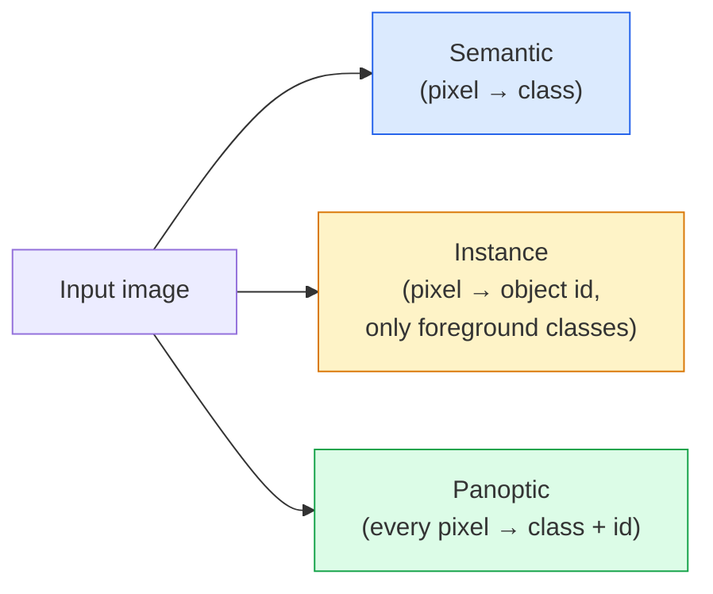
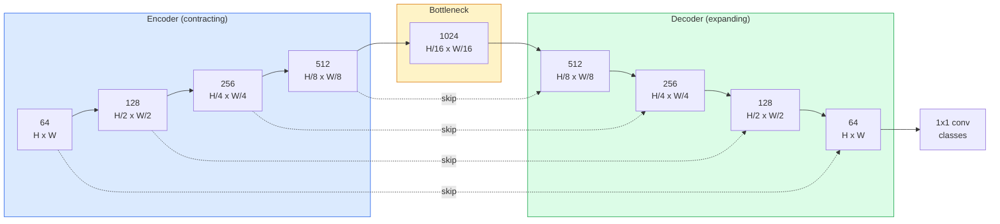

# 語意分割 —— U-Net

> 分割就是在每一個像素上做分類。U-Net 的做法是把一個下採樣的編碼器和一個上採樣的解碼器配成一對，再在兩者之間接上跳接。

**類型：** 實作
**程式語言：** Python
**先修單元：** 階段 4 單元 03（CNN）、階段 4 單元 04（影像分類）
**時間：** 約 75 分鐘

## 學習目標

- 分辨語意分割、實例分割與全景分割，並為給定的問題挑對任務
- 用 PyTorch 從零建出一個 U-Net：編碼器區塊、瓶頸層、使用轉置卷積的解碼器，以及跳接
- 實作逐像素交叉熵、Dice 損失，以及目前在醫療與工業分割上作為預設的組合損失
- 讀懂每個類別的 IoU 與 Dice 指標，並診斷分數難看的原因是小物件召回率、邊界精度，還是類別不平衡

## 問題所在

分類每張影像輸出一個標籤。偵測每張影像輸出幾個框。分割每個像素輸出一個標籤。對一張尺寸為 `H x W` 的輸入，輸出是形狀為 `H x W`（語意）或 `H x W x N_instances`（實例）的張量。那是每張影像數百萬個預測，不是一個。

分割的這種結構，正是它幾乎撐起所有稠密預測視覺產品的原因：醫療影像（腫瘤遮罩）、自動駕駛（道路、車道、障礙物）、衛星影像（建物輪廓、作物邊界）、文件解析（版面區塊）、機器人（可抓取區域）。這些任務沒有一個能靠在物體外面框一個方框解決；它們需要精確的輪廓。

架構上的難題講起來很簡單，解起來不簡單：你需要網路同時看到影像的全域脈絡（這是什麼樣的場景）和局部的像素細節（到底哪個像素是道路、哪個是人行道）。標準的 CNN 靠壓縮空間來換取脈絡，而這會把細節丟掉。U-Net 就是那個兩者兼得的設計。

## 核心概念

### 語意、實例與全景之別



- **語意分割**說的是「這個像素是道路，那個像素是車」。兩台並排的車會塌成同一團。
- **實例分割**說的是「這個像素是車 #3，那個像素是車 #5」。它忽略背景的 stuff（「stuff」= 天空、道路、草地）。
- **全景分割**把兩者統一起來：每個像素都拿到一個類別標籤，每個實例都拿到一個唯一 id，stuff 和 things 都被分割出來。

本單元講語意分割。下一個單元（Mask R-CNN）講實例分割。

### U-Net 的形狀



編碼器把空間解析度減半四次，並把通道數加倍。解碼器反過來：把空間解析度加倍四次，並把通道數減半。跳接則在每一個解析度上，把對應的編碼器特徵和解碼器特徵串接起來。最後那個 1x1 卷積在全解析度上把 `64 -> num_classes`。

跳接為什麼必要：解碼器要輸出像素級預測時，一路上看到的都只是很小的特徵圖。沒有跳接，它無法準確定位邊緣，因為那些資訊在編碼器裡已經被壓掉了。跳接把編碼器下行途中算出來的高解析度特徵圖直接交到它手上。

### 轉置卷積與雙線性上採樣

解碼器必須把空間維度擴回去。有兩個選項：

- **轉置卷積**（`nn.ConvTranspose2d`）—— 可學習的上採樣。歷史上 U-Net 的預設。如果步幅和卷積核大小不能整除，會產生棋盤格瑕疵。
- **雙線性上採樣 + 3x3 卷積** —— 先平滑放大，再接一層卷積。瑕疵更少、參數更少，是現在的預設做法。

兩種在實務上都會遇到。第一次做 U-Net，雙線性比較保險。

### 在像素網格上做交叉熵

在 C 個類別的語意分割裡，模型輸出是 `(N, C, H, W)`。目標是 `(N, H, W)`，值為整數類別 ID。交叉熵和分類的情況一模一樣，只是套用在每一個空間位置上：

```
Loss = mean over (n, h, w) of -log( softmax(logits[n, :, h, w])[target[n, h, w]] )
```

PyTorch 的 `F.cross_entropy` 原生就吃這個形狀，不需要 reshape。

### Dice 損失，以及你為什麼需要它

交叉熵把每個像素一視同仁。當某個類別在畫面裡占絕對多數時（醫療影像：99% 背景、1% 腫瘤），這是錯的。網路只要到處都預測背景就能拿到 99% 準確率，卻毫無用處。

Dice 損失的解法是直接最佳化預測遮罩與真實遮罩之間的重疊：

```
Dice(p, y) = 2 * sum(p * y) / (sum(p) + sum(y) + epsilon)
Dice_loss = 1 - Dice
```

其中 `p` 是某個類別的 sigmoid/softmax 機率圖，`y` 是二元的真實標註遮罩。只有在重疊完美時，損失才會是零。因為它是基於比值的，所以類別不平衡與它無關。

實務上請用**組合損失**：

```
L = L_cross_entropy + lambda * L_dice       (lambda ~ 1)
```

交叉熵在訓練前期提供穩定的梯度；Dice 讓訓練後段專注在真正把遮罩形狀對上。這個組合是醫療影像的預設做法，在任何類別不平衡的資料集上都很難打敗。

### 評估指標

- **像素準確率** —— 預測正確的像素百分比。便宜。在不平衡資料上會失效，理由和分類裡的準確率一樣。
- **每個類別的 IoU** —— 每個類別遮罩的交集比聯集；跨類別平均就是 mIoU。
- **Dice（像素上的 F1）** —— 和 IoU 類似；`Dice = 2 * IoU / (1 + IoU)`。醫療影像偏好 Dice，自駕圈偏好 IoU；兩者是單調相關的。
- **邊界 F1** —— 衡量預測邊界和真實標註邊界有多接近，連很小的位移都會被罰。對半導體檢測這類高精度任務很重要。

回報每個類別的 IoU，不要只報 mIoU。平均 IoU 會把一個只有 15% 的類別藏在另外九個 85% 的後面。

### 輸入解析度的取捨

U-Net 的編碼器把解析度減半四次，所以輸入必須能被 16 整除。醫療影像常常是 512x512 或 1024x1024。自動駕駛的裁切圖是 2048x1024。U-Net 的記憶體開銷隨 `H * W * C_max` 增長，在 1024x1024 搭配 1024 個瓶頸通道時，光是前向傳播就已經吃掉好幾 GB 的 VRAM。

兩個標準的變通做法：
1. 把輸入切磚 —— 以重疊的方式處理 256x256 的磚塊，再拼回去。
2. 把瓶頸換成空洞卷積，讓空間解析度保持得更高，同時把感受野撐大（DeepLab 家族的做法）。

第一個模型的話，256x256 的輸入搭配基礎通道 64 的 U-Net，在 8 GB VRAM 上訓練起來很輕鬆。

```figure
segmentation-flood
```

## 動手實作

### 步驟 1：編碼器區塊

兩個 3x3 卷積，各自帶批次正規化與 ReLU。第一個卷積改變通道數，第二個維持不變。

```python
import torch
import torch.nn as nn
import torch.nn.functional as F

class DoubleConv(nn.Module):
    def __init__(self, in_c, out_c):
        super().__init__()
        self.net = nn.Sequential(
            nn.Conv2d(in_c, out_c, kernel_size=3, padding=1, bias=False),
            nn.BatchNorm2d(out_c),
            nn.ReLU(inplace=True),
            nn.Conv2d(out_c, out_c, kernel_size=3, padding=1, bias=False),
            nn.BatchNorm2d(out_c),
            nn.ReLU(inplace=True),
        )

    def forward(self, x):
        return self.net(x)
```

這個區塊之後會反覆使用。`bias=False` 是因為 BN 的 beta 已經扮演偏差項的角色。

### 步驟 2：下行與上行區塊

```python
class Down(nn.Module):
    def __init__(self, in_c, out_c):
        super().__init__()
        self.net = nn.Sequential(
            nn.MaxPool2d(2),
            DoubleConv(in_c, out_c),
        )

    def forward(self, x):
        return self.net(x)


class Up(nn.Module):
    def __init__(self, in_c, out_c):
        super().__init__()
        self.up = nn.Upsample(scale_factor=2, mode="bilinear", align_corners=False)
        self.conv = DoubleConv(in_c, out_c)

    def forward(self, x, skip):
        x = self.up(x)
        if x.shape[-2:] != skip.shape[-2:]:
            x = F.interpolate(x, size=skip.shape[-2:], mode="bilinear", align_corners=False)
        x = torch.cat([skip, x], dim=1)
        return self.conv(x)
```

只比對空間形狀（`shape[-2:]`）能處理維度不是 16 倍數的輸入；一次安全的 `F.interpolate` 會在串接之前把張量對齊。比對完整形狀的話，通道數不同也會觸發它，而那應該是一個大聲報錯的錯誤，不是默默做一次插值。

### 步驟 3：U-Net 本體

```python
class UNet(nn.Module):
    def __init__(self, in_channels=3, num_classes=2, base=64):
        super().__init__()
        self.inc = DoubleConv(in_channels, base)
        self.d1 = Down(base, base * 2)
        self.d2 = Down(base * 2, base * 4)
        self.d3 = Down(base * 4, base * 8)
        self.d4 = Down(base * 8, base * 16)
        self.u1 = Up(base * 16 + base * 8, base * 8)
        self.u2 = Up(base * 8 + base * 4, base * 4)
        self.u3 = Up(base * 4 + base * 2, base * 2)
        self.u4 = Up(base * 2 + base, base)
        self.outc = nn.Conv2d(base, num_classes, kernel_size=1)

    def forward(self, x):
        x1 = self.inc(x)
        x2 = self.d1(x1)
        x3 = self.d2(x2)
        x4 = self.d3(x3)
        x5 = self.d4(x4)
        x = self.u1(x5, x4)
        x = self.u2(x, x3)
        x = self.u3(x, x2)
        x = self.u4(x, x1)
        return self.outc(x)

net = UNet(in_channels=3, num_classes=2, base=32)
x = torch.randn(1, 3, 256, 256)
print(f"output: {net(x).shape}")
print(f"params: {sum(p.numel() for p in net.parameters()):,}")
```

輸出形狀 `(1, 2, 256, 256)` —— 空間尺寸和輸入相同，通道數是 `num_classes`。在 `base=32` 時大約 770 萬個參數。

### 步驟 4：損失函式

```python
def dice_loss(logits, targets, num_classes, eps=1e-6):
    probs = F.softmax(logits, dim=1)
    targets_one_hot = F.one_hot(targets, num_classes).permute(0, 3, 1, 2).float()
    dims = (0, 2, 3)
    intersection = (probs * targets_one_hot).sum(dim=dims)
    denom = probs.sum(dim=dims) + targets_one_hot.sum(dim=dims)
    dice = (2 * intersection + eps) / (denom + eps)
    return 1 - dice.mean()


def combined_loss(logits, targets, num_classes, lam=1.0):
    ce = F.cross_entropy(logits, targets)
    dc = dice_loss(logits, targets, num_classes)
    return ce + lam * dc, {"ce": ce.item(), "dice": dc.item()}
```

Dice 是逐類別計算後再平均（macro Dice）。`eps` 避免在批次裡沒出現的類別上除以零。

### 步驟 5：IoU 指標

```python
@torch.no_grad()
def iou_per_class(logits, targets, num_classes):
    preds = logits.argmax(dim=1)
    ious = torch.zeros(num_classes)
    for c in range(num_classes):
        pred_c = (preds == c)
        true_c = (targets == c)
        inter = (pred_c & true_c).sum().float()
        union = (pred_c | true_c).sum().float()
        ious[c] = (inter / union) if union > 0 else torch.tensor(float("nan"))
    return ious
```

回傳一個長度為 C 的向量。`nan` 標記的是批次裡沒出現的類別 —— 算 mIoU 時不要把它們一起平均。

### 步驟 6：用合成資料集做端到端驗證

在有顏色的背景上產生各種形狀，逼網路去學形狀，而不是學像素顏色。

```python
import numpy as np
from torch.utils.data import Dataset, DataLoader

def synthetic_segmentation(num_samples=200, size=64, seed=0):
    rng = np.random.default_rng(seed)
    images = np.zeros((num_samples, size, size, 3), dtype=np.float32)
    masks = np.zeros((num_samples, size, size), dtype=np.int64)
    for i in range(num_samples):
        bg = rng.uniform(0, 1, (3,))
        images[i] = bg
        masks[i] = 0
        num_shapes = rng.integers(1, 4)
        for _ in range(num_shapes):
            cls = int(rng.integers(1, 3))
            color = rng.uniform(0, 1, (3,))
            cx, cy = rng.integers(10, size - 10, size=2)
            r = int(rng.integers(4, 12))
            yy, xx = np.meshgrid(np.arange(size), np.arange(size), indexing="ij")
            if cls == 1:
                mask = (xx - cx) ** 2 + (yy - cy) ** 2 < r ** 2
            else:
                mask = (np.abs(xx - cx) < r) & (np.abs(yy - cy) < r)
            images[i][mask] = color
            masks[i][mask] = cls
        images[i] += rng.normal(0, 0.02, images[i].shape)
        images[i] = np.clip(images[i], 0, 1)
    return images, masks


class SegDataset(Dataset):
    def __init__(self, images, masks):
        self.images = images
        self.masks = masks

    def __len__(self):
        return len(self.images)

    def __getitem__(self, i):
        img = torch.from_numpy(self.images[i]).permute(2, 0, 1).float()
        mask = torch.from_numpy(self.masks[i]).long()
        return img, mask
```

三個類別：背景（0）、圓形（1）、方形（2）。網路必須學會分辨形狀。

### 步驟 7：訓練迴圈

```python
def train_one_epoch(model, loader, optimizer, device, num_classes):
    model.train()
    loss_sum, total = 0.0, 0
    iou_sum = torch.zeros(num_classes)
    for x, y in loader:
        x, y = x.to(device), y.to(device)
        logits = model(x)
        loss, _ = combined_loss(logits, y, num_classes)
        optimizer.zero_grad()
        loss.backward()
        optimizer.step()
        loss_sum += loss.item() * x.size(0)
        total += x.size(0)
        iou_sum += iou_per_class(logits, y, num_classes).nan_to_num(0)
    return loss_sum / total, iou_sum / len(loader)
```

在合成資料集上跑 10 到 30 個 epoch，看著形狀類別的 mIoU 爬過 0.9。注意 `nan_to_num(0)` 是把批次裡沒出現的類別當成零；若要精確的逐類別 IoU，請依類別是否出現做遮罩，並在評估時跨批次用 `torch.nanmean`，而不是在這裡就平均掉。

## 框架應用

上生產環境的話，`segmentation_models_pytorch`（「smp」）把每一種標準分割架構都包起來，並可搭配任何 torchvision 或 timm 骨幹。三行就好：

```python
import segmentation_models_pytorch as smp

model = smp.Unet(
    encoder_name="resnet34",
    encoder_weights="imagenet",
    in_channels=3,
    classes=3,
)
```

實務工作上還值得知道的：
- **DeepLabV3+** 用空洞卷積取代基於 max-pool 的下採樣，讓瓶頸保住解析度；在衛星與駕駛資料上更快拿到準確的邊界。
- **SegFormer** 把卷積編碼器換成階層式 transformer；目前在許多基準上是 SOTA。
- **Mask2Former** / **OneFormer** 用單一架構統一語意、實例與全景分割。

三者在 `smp` 或 `transformers` 裡都能直接替換，資料載入器不用改。

## 產出交付

本單元產出：

- `outputs/prompt-segmentation-task-picker.md` —— 一段提示詞：在語意、實例與全景分割之間做選擇，並為給定任務指名架構。
- `outputs/skill-segmentation-mask-inspector.md` —— 一項技能：回報類別分布、預測遮罩的統計數據，以及哪些類別被預測不足或邊界模糊。

## 練習

1. **（簡單）** 為二元分割任務（前景對背景）實作 `bce_dice_loss`。在一個合成的兩類別資料集上驗證：當前景只占 5% 的像素時，組合損失比單用 BCE 收斂得更快。
2. **（中等）** 把 `nn.Upsample + conv` 的上行區塊換成 `nn.ConvTranspose2d` 的上行區塊。兩者都在合成資料集上訓練並比較 mIoU。觀察棋盤格瑕疵在轉置卷積版本裡出現在什麼地方。
3. **（困難）** 拿一個真實的分割資料集（Oxford-IIIT Pets、Cityscapes 的迷你切分，或某個醫療子集），把這個 U-Net 訓練到與 `smp.Unet` 參考模型相差 2 個 IoU 點以內。回報逐類別的 IoU，並指出哪些類別從損失裡加入 Dice 獲益最多。

## 關鍵術語

| 術語 | 大家怎麼說 | 實際上是什麼 |
|------|----------------|----------------------|
| 語意分割 | 「標記每一個像素」 | 逐像素分類到 C 個類別；同一類別的多個實例會合併 |
| 實例分割 | 「標記每一個物體」 | 分開同一類別的不同實例；只處理前景 |
| 全景分割 | 「語意 + 實例」 | 每個像素都拿到類別；每個 thing 實例還額外拿到唯一 id |
| 跳接 | 「U-Net 的橋」 | 把編碼器特徵串接進同解析度的解碼器特徵；保住高頻細節 |
| 轉置卷積 | 「反卷積」 | 可學習的上採樣；可能產生棋盤格瑕疵 |
| Dice 損失 | 「重疊損失」 | 1 - 2|A ∩ B| / (|A| + |B|)；直接最佳化遮罩重疊，且對類別不平衡穩健 |
| mIoU | 「平均交集比聯集」 | 跨類別平均的 IoU；分割領域的社群標準指標 |
| 邊界 F1 | 「邊界精度」 | 只在邊界像素上計算的 F1 分數；對精度關鍵的任務很重要 |

## 延伸閱讀

- [U-Net: Convolutional Networks for Biomedical Image Segmentation (Ronneberger et al., 2015)](https://arxiv.org/abs/1505.04597) —— 原始論文；大家都在抄的那張圖在第 2 頁
- [Fully Convolutional Networks (Long et al., 2015)](https://arxiv.org/abs/1411.4038) —— 第一篇把分割變成端到端卷積問題的論文
- [segmentation_models_pytorch](https://github.com/qubvel/segmentation_models.pytorch) —— 生產級分割的參考實作；每一種標準架構加上每一種標準損失
- [Lessons learned from training SOTA segmentation (kaggle.com competitions)](https://www.kaggle.com/code/iafoss/carvana-unet-pytorch) —— 一份逐步說明，講清楚 TTA、偽標註與類別權重在真實資料上為什麼重要
