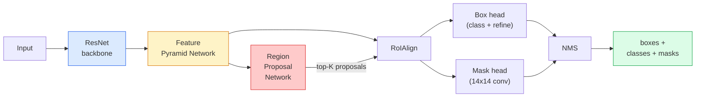

# 實例分割 —— Mask R-CNN

> 在 Faster R-CNN 偵測器上加一個小小的遮罩分支，你就有了實例分割。難的地方在 RoIAlign，而它比看起來更難。

**類型：** 實作 + 學習
**程式語言：** Python
**先修單元：** 階段 4 · 06（YOLO）、階段 4 · 07（U-Net）
**時間：** 約 75 分鐘

## 學習目標

- 從頭到尾追一遍 Mask R-CNN 的架構：主幹網路、FPN、RPN、RoIAlign、框頭、遮罩頭
- 從零實作 RoIAlign，並說清楚為什麼現在沒人用 RoIPool 了
- 用 torchvision 的 `maskrcnn_resnet50_fpn_v2` 預訓練模型產出生產級的實例遮罩，並正確讀懂它的輸出格式
- 換掉框頭與遮罩頭、凍住主幹網路，在一個小型自訂資料集上微調 Mask R-CNN

## 問題所在

語意分割給你的是每個類別一張遮罩。實例分割給你的是每個物件一張遮罩，就算兩個物件屬於同一個類別也一樣。數個體數量、跨影格追蹤、量測尺寸（一面牆上每一塊磚的邊界框、一張顯微影像裡的每一個細胞），這些都非實例分割不可。

Mask R-CNN（He 等人，2017）解決這件事的方式，是把實例分割重新表述成「偵測再加一張遮罩」。這個設計乾淨到後續五年幾乎每一篇實例分割論文都是 Mask R-CNN 的變體，而 torchvision 的實作至今仍是中小型資料集的生產預設選項。

工程上真正難的問題是取樣：當提議框的角落並不落在像素邊界上，你要怎麼從裡面裁出一塊固定大小的特徵區域？這件事做錯，處處都要付出零點幾個 mAP 的代價。RoIAlign 就是答案。

## 核心概念

### 架構



五個要弄懂的零件：

1. **主幹網路** —— 在 ImageNet 上訓練過的 ResNet-50 或 ResNet-101。產出 stride 分別為 4、8、16、32 的一整層級特徵圖。
2. **FPN（特徵金字塔網路）** —— 自上而下加上橫向連接，讓每一層都拿到 C 個通道、語意豐富的特徵。偵測時就去查詢跟物件大小相符的那一層 FPN。
3. **RPN（區域提議網路）** —— 一個小的卷積頭，在每個 anchor 位置上預測「這裡有物件嗎？」以及「這個框該怎麼修」。每張影像產出約 1000 個區域提議。
4. **RoIAlign** —— 從任意 FPN 層的任意框上取樣出固定大小（例如 7x7）的特徵片段。雙線性取樣，不做量化。
5. **頭** —— 一個兩層的框頭，負責修正框並選出類別；再加一個小的卷積頭，為每個提議輸出一張 `28x28` 的二值遮罩。

### 為什麼是 RoIAlign，而不是 RoIPool

最早的 Fast R-CNN 用的是 RoIPool：把提議框切成網格、在每個格子裡取特徵最大值，並把所有座標都取整成整數。那個取整會在特徵圖與輸入像素座標之間製造出最多整整一個特徵圖像素的對齊誤差——在 224x224 的影像上還算小，但當特徵圖的 stride 是 32 時就是災難。

```
RoIPool:
  box (34.7, 51.3, 98.2, 142.9)
  round -> (34, 51, 98, 142)
  split grid -> round each cell boundary
  misalignment accumulates at every step

RoIAlign:
  box (34.7, 51.3, 98.2, 142.9)
  sample at exact float coordinates using bilinear interpolation
  no rounding anywhere
```

RoIAlign 在 COCO 上白白把遮罩 AP 拉高 3 到 4 個點。現在只要在意定位精度的偵測器都會用它——YOLOv7 seg、RT-DETR、Mask2Former 一律如此。

### 一段話講完 RPN

在特徵圖的每個位置放 K 個不同大小、不同形狀的 anchor 框。為每個 anchor 預測一個 objectness 分數，以及一組迴歸偏移量，把 anchor 變成貼得更好的框。依分數留下前約 1,000 個框，在 IoU 0.7 上做 NMS，把倖存者交給後面的頭。RPN 有它自己的小損失函式來訓練——結構跟第 6 單元的 YOLO 損失一樣，只是類別只有兩個（有物件／無物件）。

### 遮罩頭

對每個提議（經過 RoIAlign 之後），遮罩頭是一個小型 FCN：四個 3x3 卷積、一個 2 倍反卷積，最後一個 1x1 卷積在 `28x28` 解析度上輸出 `num_classes` 個通道。只有對應到預測類別的那個通道會被留下，其餘一概忽略。這讓遮罩預測跟分類解耦。

把 28x28 的遮罩上採樣回提議原本的像素尺寸，就得到最終的二值遮罩。

### 損失

Mask R-CNN 有四種損失加在一起：

```
L = L_rpn_cls + L_rpn_box + L_box_cls + L_box_reg + L_mask
```

- `L_rpn_cls`、`L_rpn_box` —— RPN 區域提議的 objectness 加邊界框迴歸。
- `L_box_cls` —— 在頭部分類器上、對 (C+1) 個類別（含背景）算的交叉熵。
- `L_box_reg` —— 頭部框修正的 smooth L1。
- `L_mask` —— 在 28x28 遮罩輸出上逐像素算的二元交叉熵。

每種損失都有自己的預設權重；torchvision 的實作把它們開放成建構子參數。

### 輸出格式

`torchvision.models.detection.maskrcnn_resnet50_fpn_v2` 回傳一串 dict，每張影像一個：

```
{
    "boxes":  (N, 4) in (x1, y1, x2, y2) pixel coordinates,
    "labels": (N,) class IDs, 0 = background so indices are 1-based,
    "scores": (N,) confidence scores,
    "masks":  (N, 1, H, W) float masks in [0, 1] — threshold at 0.5 for binary,
}
```

遮罩已經是整張影像的解析度了。28x28 的頭部輸出在模型內部就已經上採樣過。

## 動手實作

### 步驟 1：從零實作 RoIAlign

這是 Mask R-CNN 裡唯一一個看程式碼比看文字更容易懂的元件。

```python
import torch
import torch.nn.functional as F

def roi_align_single(feature, box, output_size=7, spatial_scale=1 / 16.0):
    """
    feature: (C, H, W) single-image feature map
    box: (x1, y1, x2, y2) in original image pixel coordinates
    output_size: side of the output grid (7 for box head, 14 for mask head)
    spatial_scale: reciprocal of the feature map stride
    """
    C, H, W = feature.shape
    x1, y1, x2, y2 = [c * spatial_scale - 0.5 for c in box]
    bin_w = (x2 - x1) / output_size
    bin_h = (y2 - y1) / output_size

    grid_y = torch.linspace(y1 + bin_h / 2, y2 - bin_h / 2, output_size)
    grid_x = torch.linspace(x1 + bin_w / 2, x2 - bin_w / 2, output_size)
    yy, xx = torch.meshgrid(grid_y, grid_x, indexing="ij")

    gx = 2 * (xx + 0.5) / W - 1
    gy = 2 * (yy + 0.5) / H - 1
    grid = torch.stack([gx, gy], dim=-1).unsqueeze(0)
    sampled = F.grid_sample(feature.unsqueeze(0), grid, mode="bilinear",
                            align_corners=False)
    return sampled.squeeze(0)
```

每一個數字都取自一個雙線性取樣出來的位置。沒有取整、沒有量化、沒有被丟掉的梯度。

### 步驟 2：跟 torchvision 的 RoIAlign 對照

```python
from torchvision.ops import roi_align

feature = torch.randn(1, 16, 50, 50)
boxes = torch.tensor([[0, 10, 20, 100, 90]], dtype=torch.float32)  # (batch_idx, x1, y1, x2, y2)

ours = roi_align_single(feature[0], boxes[0, 1:].tolist(), output_size=7, spatial_scale=1/4)
theirs = roi_align(feature, boxes, output_size=(7, 7), spatial_scale=1/4, sampling_ratio=1, aligned=True)[0]

print(f"shape ours:   {tuple(ours.shape)}")
print(f"shape theirs: {tuple(theirs.shape)}")
print(f"max|diff|:    {(ours - theirs).abs().max().item():.3e}")
```

在 `sampling_ratio=1` 且 `aligned=True` 的設定下，兩者的差距在 `1e-5` 以內。

### 步驟 3：載入預訓練的 Mask R-CNN

```python
import torch
from torchvision.models.detection import maskrcnn_resnet50_fpn_v2, MaskRCNN_ResNet50_FPN_V2_Weights

model = maskrcnn_resnet50_fpn_v2(weights=MaskRCNN_ResNet50_FPN_V2_Weights.DEFAULT)
model.eval()
print(f"params: {sum(p.numel() for p in model.parameters()):,}")
print(f"classes (including background): {len(model.roi_heads.box_predictor.cls_score.out_features * [0])}")
```

4600 萬個參數、91 個類別（COCO）。第一個類別（id 0）是背景；模型真正會偵測到的東西全部從 id 1 開始。

### 步驟 4：跑推論

```python
with torch.no_grad():
    x = torch.randn(3, 400, 600)
    predictions = model([x])
p = predictions[0]
print(f"boxes:  {tuple(p['boxes'].shape)}")
print(f"labels: {tuple(p['labels'].shape)}")
print(f"scores: {tuple(p['scores'].shape)}")
print(f"masks:  {tuple(p['masks'].shape)}")
```

遮罩張量的形狀是 `(N, 1, H, W)`。在 0.5 上取閾值，就得到每個物件一張二值遮罩：

```python
binary_masks = (p['masks'] > 0.5).squeeze(1)  # (N, H, W) boolean
```

### 步驟 5：換掉頭以支援自訂類別數

常見的微調配方：沿用主幹網路、FPN 與 RPN，只換掉那兩個分類頭。

```python
from torchvision.models.detection.faster_rcnn import FastRCNNPredictor
from torchvision.models.detection.mask_rcnn import MaskRCNNPredictor

def build_custom_maskrcnn(num_classes):
    model = maskrcnn_resnet50_fpn_v2(weights=MaskRCNN_ResNet50_FPN_V2_Weights.DEFAULT)
    in_features = model.roi_heads.box_predictor.cls_score.in_features
    model.roi_heads.box_predictor = FastRCNNPredictor(in_features, num_classes)
    in_features_mask = model.roi_heads.mask_predictor.conv5_mask.in_channels
    hidden_layer = 256
    model.roi_heads.mask_predictor = MaskRCNNPredictor(in_features_mask, hidden_layer, num_classes)
    return model

custom = build_custom_maskrcnn(num_classes=5)
print(f"custom cls_score.out_features: {custom.roi_heads.box_predictor.cls_score.out_features}")
```

`num_classes` 必須把背景類別算進去，所以一個有 4 個物件類別的資料集要用 `num_classes=5`。

### 步驟 6：凍住不需要訓練的部分

在小型資料集上，把主幹網路與 FPN 凍起來。只讓 RPN 的 objectness 加迴歸、以及那兩個頭去學。

```python
def freeze_backbone_and_fpn(model):
    # torchvision Mask R-CNN packs the FPN inside `model.backbone` (as
    # `model.backbone.fpn`), so iterating `model.backbone.parameters()` covers
    # both the ResNet feature layers and the FPN lateral/output convs.
    for p in model.backbone.parameters():
        p.requires_grad = False
    return model

custom = freeze_backbone_and_fpn(custom)
trainable = sum(p.numel() for p in custom.parameters() if p.requires_grad)
print(f"trainable after freeze: {trainable:,}")
```

在 500 張影像規模的資料集上，這一步就是收斂與過度擬合的分界。

## 框架應用

torchvision 裡 Mask R-CNN 的完整訓練迴圈只有 40 行，而且換任務也不會有什麼實質變化——換掉資料集就能開跑。

```python
def train_step(model, images, targets, optimizer):
    model.train()
    loss_dict = model(images, targets)
    losses = sum(loss for loss in loss_dict.values())
    optimizer.zero_grad()
    losses.backward()
    optimizer.step()
    return {k: v.item() for k, v in loss_dict.items()}
```

`targets` 這個 list 裡每張影像要有一個 dict，含 `boxes`、`labels` 與 `masks`（形狀為 `(num_instances, H, W)` 的二值張量）。模型在訓練時回傳一個裝著四種損失的 dict，在評估時回傳一串預測，依 `model.training` 切換。

`pycocotools` 的評估器會同時給出框與遮罩的 mAP@IoU=0.5:0.95；兩個數字都要看，才知道瓶頸是在框頭還是遮罩頭。

## 產出交付

本單元會產出：

- `outputs/prompt-instance-vs-semantic-router.md` —— 一個提示詞，問三個問題就決定要用實例分割、語意分割還是全景分割，並指出該從哪個模型下手。
- `outputs/skill-mask-rcnn-head-swapper.md` —— 一項技能，給定新的 `num_classes`，為任意 torchvision 偵測模型生成那 10 行換頭的程式碼。

## 練習

1. **（簡單）** 拿 100 個隨機框，把你的 RoIAlign 跟 `torchvision.ops.roi_align` 對照，回報最大絕對差。另外也跑一次 RoIPool（2017 年之前的行為），呈現它在靠邊界的框上會偏離約 1 到 2 個特徵圖像素。
2. **（中等）** 在一個 50 張影像的自訂資料集上微調 `maskrcnn_resnet50_fpn_v2`（任選兩個類別：氣球、魚、路面坑洞、商標）。凍住主幹網路，訓練 20 個 epoch，回報遮罩 AP@0.5。
3. **（困難）** 把 Mask R-CNN 的遮罩頭換成在 56x56 而非 28x28 上做預測。量測前後的 mAP@IoU=0.75。解釋為什麼這個增益（或為什麼沒有增益）符合預期中邊界精度與記憶體之間的取捨。

## 關鍵術語

| 術語 | 大家怎麼說 | 實際上是什麼 |
|------|----------------|----------------------|
| Mask R-CNN | 「偵測再加遮罩」 | Faster R-CNN 加上一個小型 FCN 頭，為每個提議、每個類別預測一張 28x28 遮罩 |
| FPN | 「特徵金字塔」 | 自上而下加橫向連接，讓每個 stride 層級都拿到 C 個通道、語意豐富的特徵 |
| RPN | 「產區域提議的那個」 | 一個小的卷積頭，每張影像產出約 1000 個有物件／無物件的區域提議 |
| RoIAlign | 「不取整的裁切」 | 從任何浮點座標的框上，雙線性取樣出一塊固定大小的特徵網格 |
| RoIPool | 「2017 年前的裁切」 | 目的跟 RoIAlign 一樣，但會把框座標取整；已淘汰 |
| 遮罩 AP | 「實例 mAP」 | 用遮罩 IoU 而非框 IoU 算出來的平均精度；COCO 實例分割的評測指標 |
| 二值遮罩頭 | 「每類別一張遮罩」 | 為每個提議、每個類別各預測一張二值遮罩；只保留預測類別那個通道 |
| 背景類別 | 「類別 0」 | 那個包山包海的「沒有物件」類別；真實類別的索引從 1 開始 |

## 延伸閱讀

- [Mask R-CNN (He et al., 2017)](https://arxiv.org/abs/1703.06870) —— 原論文；第 3 節談 RoIAlign 的部分是關鍵必讀
- [FPN: Feature Pyramid Networks (Lin et al., 2017)](https://arxiv.org/abs/1612.03144) —— FPN 論文；現代偵測器無一不用
- [torchvision Mask R-CNN tutorial](https://pytorch.org/tutorials/intermediate/torchvision_tutorial.html) —— 微調迴圈的參考實作
- [Detectron2 model zoo](https://github.com/facebookresearch/detectron2/blob/main/MODEL_ZOO.md) —— 生產級實作，幾乎每種偵測與分割變體都有訓練好的權重
